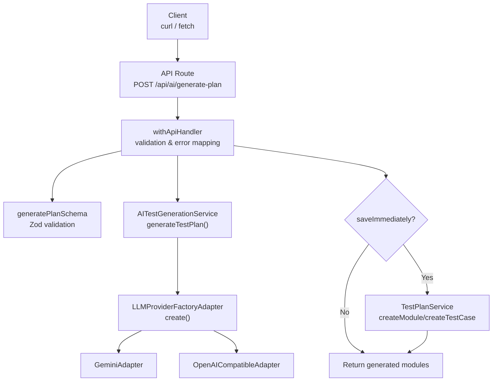
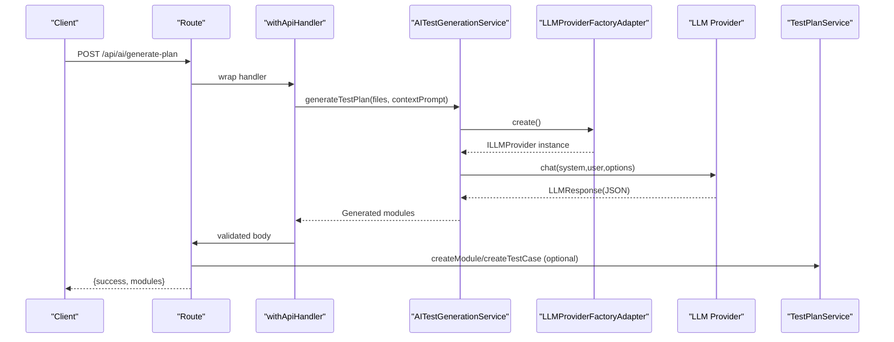
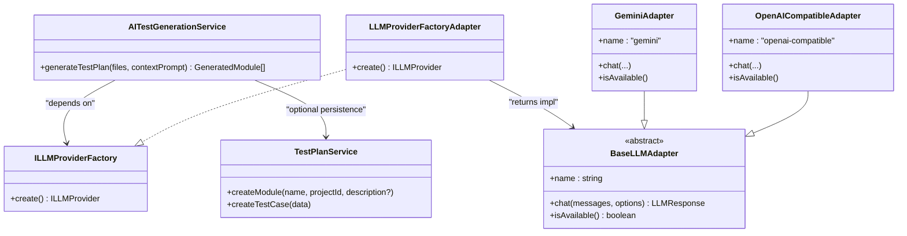
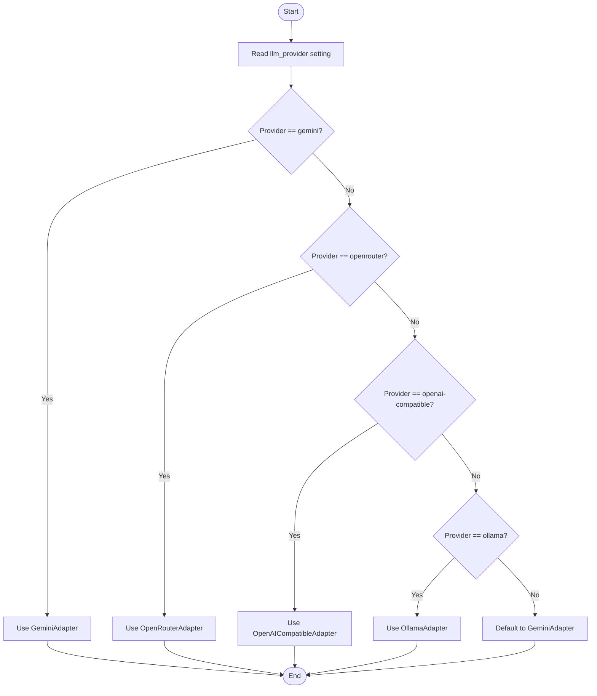

# AI Integration API

<cite>
**Referenced Files in This Document**
- [route.ts](file://app/api/ai/generate-plan/route.ts)
- [schemas.ts](file://app/api/_lib/schemas.ts)
- [withApiHandler.ts](file://app/api/_lib/withApiHandler.ts)
- [AITestGenerationService.ts](file://src/domain/services/AITestGenerationService.ts)
- [TestPlanService.ts](file://src/domain/services/TestPlanService.ts)
- [LLMProviderFactoryAdapter.ts](file://src/adapters/llm/LLMProviderFactoryAdapter.ts)
- [BaseLLMAdapter.ts](file://src/adapters/llm/BaseLLMAdapter.ts)
- [GeminiAdapter.ts](file://src/adapters/llm/GeminiAdapter.ts)
- [OpenAICompatibleAdapter.ts](file://src/adapters/llm/OpenAICompatibleAdapter.ts)
- [config.ts](file://src/infrastructure/config.ts)
- [DomainErrors.ts](file://src/domain/errors/DomainErrors.ts)
- [AIGenerateButton.tsx](file://src/ui/test-design/AIGenerateButton.tsx)
</cite>

## Table of Contents
1. [Introduction](#introduction)
2. [Project Structure](#project-structure)
3. [Core Components](#core-components)
4. [Architecture Overview](#architecture-overview)
5. [Detailed Component Analysis](#detailed-component-analysis)
6. [Dependency Analysis](#dependency-analysis)
7. [Performance Considerations](#performance-considerations)
8. [Troubleshooting Guide](#troubleshooting-guide)
9. [Conclusion](#conclusion)
10. [Appendices](#appendices)

## Introduction
This document describes the AI integration endpoint for generating test plans from source code. It covers the HTTP endpoint, request/response schemas, AI provider configuration, error handling, and practical usage examples via curl and JavaScript fetch.

Endpoint: POST /api/ai/generate-plan  
Purpose: Accepts source code files and optional context, generates structured test modules and test cases using an LLM, and optionally persists them into a project.

## Project Structure
The AI generation flow spans the API layer, domain services, and adapter layer for LLM providers.



**Diagram sources**
- [route.ts:8-31](file://app/api/ai/generate-plan/route.ts#L8-L31)
- [withApiHandler.ts:22-64](file://app/api/_lib/withApiHandler.ts#L22-L64)
- [schemas.ts:45-56](file://app/api/_lib/schemas.ts#L45-L56)
- [AITestGenerationService.ts:25-81](file://src/domain/services/AITestGenerationService.ts#L25-L81)
- [LLMProviderFactoryAdapter.ts:15-42](file://src/adapters/llm/LLMProviderFactoryAdapter.ts#L15-L42)
- [GeminiAdapter.ts:5-67](file://src/adapters/llm/GeminiAdapter.ts#L5-L67)
- [OpenAICompatibleAdapter.ts:8-97](file://src/adapters/llm/OpenAICompatibleAdapter.ts#L8-L97)
- [TestPlanService.ts:9-25](file://src/domain/services/TestPlanService.ts#L9-L25)

**Section sources**
- [route.ts:1-32](file://app/api/ai/generate-plan/route.ts#L1-L32)
- [schemas.ts:45-56](file://app/api/_lib/schemas.ts#L45-L56)

## Core Components
- Endpoint: POST /api/ai/generate-plan
- Purpose: Generate test plan modules and test cases from source files and optional context
- Optional persistence: When saveImmediately is true, creates modules and test cases under the given project
- AI provider selection: Configurable via settings or defaults to Gemini

**Section sources**
- [route.ts:8-31](file://app/api/ai/generate-plan/route.ts#L8-L31)
- [AITestGenerationService.ts:25-81](file://src/domain/services/AITestGenerationService.ts#L25-L81)
- [LLMProviderFactoryAdapter.ts:15-42](file://src/adapters/llm/LLMProviderFactoryAdapter.ts#L15-L42)

## Architecture Overview
The request passes through a standardized API handler that validates input, invokes the AI generation service, and optionally persists results.



**Diagram sources**
- [route.ts:8-31](file://app/api/ai/generate-plan/route.ts#L8-L31)
- [withApiHandler.ts:22-64](file://app/api/_lib/withApiHandler.ts#L22-L64)
- [AITestGenerationService.ts:28-80](file://src/domain/services/AITestGenerationService.ts#L28-L80)
- [LLMProviderFactoryAdapter.ts:18-41](file://src/adapters/llm/LLMProviderFactoryAdapter.ts#L18-L41)
- [TestPlanService.ts:15-25](file://src/domain/services/TestPlanService.ts#L15-L25)

## Detailed Component Analysis

### Endpoint Definition
- Method: POST
- Path: /api/ai/generate-plan
- Body schema (Zod):
  - files: array of { path: string, content: string }, min 1, max 50
  - contextPrompt: string (optional)
  - saveImmediately: boolean (optional)
  - projectId: string (optional, required if saveImmediately is true)
- Response:
  - success: boolean
  - modules: array of generated modules

Behavior:
- Calls AITestGenerationService to produce modules and test cases
- If saveImmediately and projectId are provided, persists modules and test cases via TestPlanService

**Section sources**
- [schemas.ts:45-56](file://app/api/_lib/schemas.ts#L45-L56)
- [route.ts:8-31](file://app/api/ai/generate-plan/route.ts#L8-L31)

### Request Schema Details
- files
  - path: string (file path)
  - content: string (file content)
  - constraints: min 1, max 50 entries
- contextPrompt: string (optional)
- saveImmediately: boolean (optional)
- projectId: string (optional)
- Validation rule: if saveImmediately is true, projectId must also be provided

**Section sources**
- [schemas.ts:45-56](file://app/api/_lib/schemas.ts#L45-L56)

### Response Schema
- success: boolean
- modules: array of objects with:
  - moduleName: string
  - testCases: array of objects with:
    - title: string
    - steps: string (multiline)
    - expectedResult: string
    - priority: "P1" | "P2" | "P3" | "P4"

Note: The service enforces strict JSON output and validates the structure.

**Section sources**
- [AITestGenerationService.ts:3-18](file://src/domain/services/AITestGenerationService.ts#L3-L18)
- [AITestGenerationService.ts:28-80](file://src/domain/services/AITestGenerationService.ts#L28-L80)

### AI Provider Configuration
- Provider selection is delegated to LLMProviderFactoryAdapter, which reads:
  - Persisted settings (from ISettingsRepository)
  - Or falls back to environment/config defaults
- Supported providers:
  - Gemini (default)
  - OpenAI-compatible (OpenAI, Mistral, Groq, etc.)
  - OpenRouter
  - Ollama
- Configuration keys:
  - llm_provider: "gemini" | "openai-compatible" | "openrouter" | "ollama"
  - llm_model: model name
  - llm_api_key: provider API key
  - llm_base_url: base URL for compatible providers
- Defaults:
  - Provider: gemini
  - Model: gemini-2.5-flash
  - API key: GEMINI_API_KEY or LLM_API_KEY

**Section sources**
- [LLMProviderFactoryAdapter.ts:15-42](file://src/adapters/llm/LLMProviderFactoryAdapter.ts#L15-L42)
- [config.ts:13-18](file://src/infrastructure/config.ts#L13-L18)

### Prompt Engineering
- System prompt instructs the model to:
  - Act as an expert QA engineer
  - Analyze provided source code files
  - Group test cases into logical modules
  - Output strict JSON matching the expected schema
- User prompt includes:
  - Optional context/requirements
  - Concatenated files with headers
- Options passed to provider:
  - temperature: 0.2
  - responseFormat: json
  - maxTokens: 4000

**Section sources**
- [AITestGenerationService.ts:31-64](file://src/domain/services/AITestGenerationService.ts#L31-L64)

### Persistence Behavior
- When saveImmediately is true and projectId is present:
  - Creates modules (deduplicated by name)
  - Creates test cases with auto-generated IDs and provided details
- Test case ID pattern: {First 3 uppercase moduleName}-{random 3-digit number}

**Section sources**
- [route.ts:14-28](file://app/api/ai/generate-plan/route.ts#L14-L28)
- [TestPlanService.ts:15-25](file://src/domain/services/TestPlanService.ts#L15-L25)

### Error Handling and Status Codes
- Validation errors (Zod): 400 with details
- Domain errors: mapped to HTTP status via DomainError subclasses
  - NotFoundError: 404
  - ValidationError: 400
  - ConflictError: 409
- Unknown errors: 500
- API error response shape:
  - error: string
  - code: string
  - details: object (optional, field-level validation messages)

**Section sources**
- [withApiHandler.ts:22-64](file://app/api/_lib/withApiHandler.ts#L22-L64)
- [DomainErrors.ts:7-39](file://src/domain/errors/DomainErrors.ts#L7-L39)

### Practical Examples

#### curl
- Basic request (no persistence):
  ```bash
  curl -X POST http://localhost:3000/api/ai/generate-plan \
    -H "Content-Type: application/json" \
    -d '{
      "files": [
        {"path":"src/main.py","content":"def hello():\n  return \"world\""},
        {"path":"tests/test_main.py","content":"def test_hello():\n  assert hello() == \"world\""}
      ],
      "contextPrompt": "Focus on boundary conditions."
    }'
  ```
- With persistence:
  ```bash
  curl -X POST http://localhost:3000/api/ai/generate-plan \
    -H "Content-Type: application/json" \
    -d '{
      "files": [...],
      "contextPrompt": "Focus on boundary conditions.",
      "projectId": "proj-abc123",
      "saveImmediately": true
    }'
  ```

#### JavaScript (fetch)
- Basic usage:
  ```javascript
  const res = await fetch('/api/ai/generate-plan', {
    method: 'POST',
    headers: { 'Content-Type': 'application/json' },
    body: JSON.stringify({
      files: [
        { path: 'src/main.py', content: 'def hello():\n  return "world"' }
      ],
      contextPrompt: 'Focus on boundary conditions.'
    })
  });
  const data = await res.json();
  console.log(data.modules);
  ```

**Section sources**
- [AIGenerateButton.tsx:52-80](file://src/ui/test-design/AIGenerateButton.tsx#L52-L80)
- [route.ts:8-31](file://app/api/ai/generate-plan/route.ts#L8-L31)

## Dependency Analysis


**Diagram sources**
- [AITestGenerationService.ts:25-26](file://src/domain/services/AITestGenerationService.ts#L25-L26)
- [LLMProviderFactoryAdapter.ts:15-42](file://src/adapters/llm/LLMProviderFactoryAdapter.ts#L15-L42)
- [BaseLLMAdapter.ts:3-25](file://src/adapters/llm/BaseLLMAdapter.ts#L3-L25)
- [GeminiAdapter.ts:5-67](file://src/adapters/llm/GeminiAdapter.ts#L5-L67)
- [OpenAICompatibleAdapter.ts:8-97](file://src/adapters/llm/OpenAICompatibleAdapter.ts#L8-L97)
- [TestPlanService.ts:9-25](file://src/domain/services/TestPlanService.ts#L9-L25)

**Section sources**
- [AITestGenerationService.ts:25-26](file://src/domain/services/AITestGenerationService.ts#L25-L26)
- [LLMProviderFactoryAdapter.ts:15-42](file://src/adapters/llm/LLMProviderFactoryAdapter.ts#L15-L42)

## Performance Considerations
- Limit input files: Max 50 files per request to avoid excessive prompt size and cost
- Reduce context size: Keep individual file sizes reasonable; consider excluding large binary or generated files
- Provider latency: Choose a nearby endpoint for compatible providers when applicable
- Token budget: The service requests up to 4000 max tokens; monitor provider usage
- Batch persistence: When saving immediately, operations are sequential; consider batching strategies if generating many modules/test cases

[No sources needed since this section provides general guidance]

## Troubleshooting Guide
Common issues and resolutions:
- Validation failures (HTTP 400):
  - Ensure files array is present and not empty
  - Respect max 50 files
  - If saveImmediately is true, provide projectId
- Provider initialization errors:
  - Gemini: Ensure GEMINI_API_KEY or LLM_API_KEY is set
  - OpenAI-compatible: Ensure LLM_API_KEY and LLM_BASE_URL are set appropriately
  - OpenRouter/Ollama: Ensure respective settings are configured
- JSON parsing errors:
  - The model must return strict JSON matching the schema; verify provider supports JSON mode
- Internal server errors (HTTP 500):
  - Check logs for provider-specific errors
  - Verify network connectivity and endpoint availability

**Section sources**
- [withApiHandler.ts:28-64](file://app/api/_lib/withApiHandler.ts#L28-L64)
- [GeminiAdapter.ts:22-61](file://src/adapters/llm/GeminiAdapter.ts#L22-L61)
- [OpenAICompatibleAdapter.ts:34-81](file://src/adapters/llm/OpenAICompatibleAdapter.ts#L34-L81)
- [LLMProviderFactoryAdapter.ts:18-41](file://src/adapters/llm/LLMProviderFactoryAdapter.ts#L18-L41)

## Conclusion
The /api/ai/generate-plan endpoint provides a robust way to transform source code into structured test plans using configurable AI providers. By validating inputs, enforcing JSON output, and optionally persisting results, it integrates cleanly with the broader testing workflow. Proper configuration of provider credentials and awareness of token and file limits will ensure reliable operation.

[No sources needed since this section summarizes without analyzing specific files]

## Appendices

### API Definition Summary
- Method: POST
- Path: /api/ai/generate-plan
- Request body:
  - files: array of { path, content } (1–50)
  - contextPrompt: string (optional)
  - saveImmediately: boolean (optional)
  - projectId: string (required if saveImmediately is true)
- Response:
  - success: boolean
  - modules: array of { moduleName, testCases }

**Section sources**
- [schemas.ts:45-56](file://app/api/_lib/schemas.ts#L45-L56)
- [route.ts:8-31](file://app/api/ai/generate-plan/route.ts#L8-L31)

### AI Provider Selection Flow


**Diagram sources**
- [LLMProviderFactoryAdapter.ts:18-41](file://src/adapters/llm/LLMProviderFactoryAdapter.ts#L18-L41)