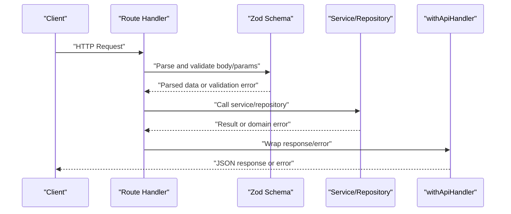
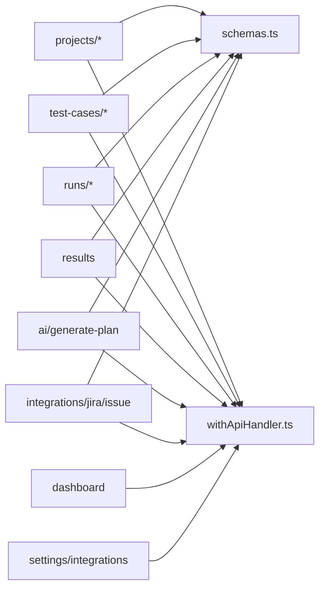

# API Reference

<cite>
**Referenced Files in This Document**
- [schemas.ts](file://app/api/_lib/schemas.ts)
- [withApiHandler.ts](file://app/api/_lib/withApiHandler.ts)
- [projects/route.ts](file://app/api/projects/route.ts)
- [projects/[id]/route.ts](file://app/api/projects/[id]/route.ts)
- [test-cases/route.ts](file://app/api/test-cases/route.ts)
- [test-cases/[id]/route.ts](file://app/api/test-cases/[id]/route.ts)
- [runs/route.ts](file://app/api/runs/route.ts)
- [runs/[id]/route.ts](file://app/api/runs/[id]/route.ts)
- [runs/[id]/finish/route.ts](file://app/api/runs/[id]/finish/route.ts)
- [runs/[id]/export/route.ts](file://app/api/runs/[id]/export/route.ts)
- [runs/[id]/bug-report/route.ts](file://app/api/runs/[id]/bug-report/route.ts)
- [results/route.ts](file://app/api/results/route.ts)
- [ai/generate-plan/route.ts](file://app/api/ai/generate-plan/route.ts)
- [integrations/jira/issue/route.ts](file://app/api/integrations/jira/issue/route.ts)
- [dashboard/route.ts](file://app/api/dashboard/route.ts)
- [settings/integrations/route.ts](file://app/api/settings/integrations/route.ts)
</cite>

## Table of Contents
1. [Introduction](#introduction)
2. [Project Structure](#project-structure)
3. [Core Components](#core-components)
4. [Architecture Overview](#architecture-overview)
5. [Detailed Component Analysis](#detailed-component-analysis)
6. [Dependency Analysis](#dependency-analysis)
7. [Performance Considerations](#performance-considerations)
8. [Troubleshooting Guide](#troubleshooting-guide)
9. [Conclusion](#conclusion)
10. [Appendices](#appendices)

## Introduction
This document provides comprehensive API documentation for Test Plan Manager’s REST endpoints. It covers HTTP methods, URL patterns, request/response schemas, authentication requirements, error handling, and practical usage examples via curl and JavaScript fetch. Endpoints are organized by functional areas: project management, test case management, test run management, AI integration, integrations (e.g., Jira), dashboard analytics, and settings.

## Project Structure
The API surface is implemented using Next.js App Router-style route handlers under app/api. Each logical resource has a dedicated route file with method-specific handlers. Shared validation and error handling are centralized in _lib.

```mermaid
graph TB
subgraph "API Layer"
P1["projects/route.ts"]
P2["projects/[id]/route.ts"]
TC1["test-cases/route.ts"]
TC2["test-cases/[id]/route.ts"]
R1["runs/route.ts"]
R2["runs/[id]/route.ts"]
RF["runs/[id]/finish/route.ts"]
RE["runs/[id]/export/route.ts"]
RB["runs/[id]/bug-report/route.ts"]
RS["results/route.ts"]
AI["ai/generate-plan/route.ts"]
DJ["integrations/jira/issue/route.ts"]
DASH["dashboard/route.ts"]
SET["settings/integrations/route.ts"]
end
subgraph "_lib"
SCH["schemas.ts"]
HND["withApiHandler.ts"]
end
P1 --> HND
P2 --> HND
TC1 --> HND
TC2 --> HND
R1 --> HND
R2 --> HND
RF --> HND
RE --> HND
RB --> HND
RS --> HND
AI --> HND
DJ --> HND
DASH --> HND
SET --> HND
P1 --> SCH
P2 --> SCH
TC1 --> SCH
TC2 --> SCH
R1 --> SCH
R2 --> SCH
RS --> SCH
AI --> SCH
RB --> SCH
DJ --> SCH
```

**Diagram sources**
- [projects/route.ts:1-19](file://app/api/projects/route.ts#L1-L19)
- [projects/[id]/route.ts](file://app/api/projects/[id]/route.ts#L1-L43)
- [test-cases/route.ts:1-37](file://app/api/test-cases/route.ts#L1-L37)
- [test-cases/[id]/route.ts](file://app/api/test-cases/[id]/route.ts#L1-L33)
- [runs/route.ts:1-26](file://app/api/runs/route.ts#L1-L26)
- [runs/[id]/route.ts](file://app/api/runs/[id]/route.ts#L1-L27)
- [runs/[id]/finish/route.ts](file://app/api/runs/[id]/finish/route.ts#L1-L15)
- [runs/[id]/export/route.ts](file://app/api/runs/[id]/export/route.ts#L1-L20)
- [runs/[id]/bug-report/route.ts](file://app/api/runs/[id]/bug-report/route.ts#L1-L19)
- [results/route.ts:1-19](file://app/api/results/route.ts#L1-L19)
- [ai/generate-plan/route.ts:1-32](file://app/api/ai/generate-plan/route.ts#L1-L32)
- [integrations/jira/issue/route.ts:1-20](file://app/api/integrations/jira/issue/route.ts#L1-L20)
- [dashboard/route.ts:1-24](file://app/api/dashboard/route.ts#L1-L24)
- [settings/integrations/route.ts:1-19](file://app/api/settings/integrations/route.ts#L1-L19)
- [schemas.ts:1-92](file://app/api/_lib/schemas.ts#L1-L92)
- [withApiHandler.ts:1-65](file://app/api/_lib/withApiHandler.ts#L1-L65)

**Section sources**
- [projects/route.ts:1-19](file://app/api/projects/route.ts#L1-L19)
- [projects/[id]/route.ts](file://app/api/projects/[id]/route.ts#L1-L43)
- [test-cases/route.ts:1-37](file://app/api/test-cases/route.ts#L1-L37)
- [test-cases/[id]/route.ts](file://app/api/test-cases/[id]/route.ts#L1-L33)
- [runs/route.ts:1-26](file://app/api/runs/route.ts#L1-L26)
- [runs/[id]/route.ts](file://app/api/runs/[id]/route.ts#L1-L27)
- [runs/[id]/finish/route.ts](file://app/api/runs/[id]/finish/route.ts#L1-L15)
- [runs/[id]/export/route.ts](file://app/api/runs/[id]/export/route.ts#L1-L20)
- [runs/[id]/bug-report/route.ts](file://app/api/runs/[id]/bug-report/route.ts#L1-L19)
- [results/route.ts:1-19](file://app/api/results/route.ts#L1-L19)
- [ai/generate-plan/route.ts:1-32](file://app/api/ai/generate-plan/route.ts#L1-L32)
- [integrations/jira/issue/route.ts:1-20](file://app/api/integrations/jira/issue/route.ts#L1-L20)
- [dashboard/route.ts:1-24](file://app/api/dashboard/route.ts#L1-L24)
- [settings/integrations/route.ts:1-19](file://app/api/settings/integrations/route.ts#L1-L19)
- [schemas.ts:1-92](file://app/api/_lib/schemas.ts#L1-L92)
- [withApiHandler.ts:1-65](file://app/api/_lib/withApiHandler.ts#L1-L65)

## Core Components
- Centralized error handling: A higher-order wrapper standardizes error responses, mapping Zod validation errors to 400 and domain errors to appropriate HTTP statuses. See [withApiHandler.ts:1-65](file://app/api/_lib/withApiHandler.ts#L1-L65).
- Validation schemas: Zod schemas define request shapes and constraints for all endpoints. See [schemas.ts:1-92](file://app/api/_lib/schemas.ts#L1-L92).

Key behaviors:
- Validation failures return structured JSON with field-level details.
- Domain errors propagate code and status code.
- Unknown errors return generic 500 with server logs.

**Section sources**
- [withApiHandler.ts:1-65](file://app/api/_lib/withApiHandler.ts#L1-L65)
- [schemas.ts:1-92](file://app/api/_lib/schemas.ts#L1-L92)

## Architecture Overview
The API follows a layered pattern:
- Route handlers (HTTP methods) parse requests and delegate to services/repositories.
- Validation schemas enforce request contracts.
- Centralized error handler ensures consistent responses.

**Diagram sources**
- [withApiHandler.ts:1-65](file://app/api/_lib/withApiHandler.ts#L1-L65)
- [schemas.ts:1-92](file://app/api/_lib/schemas.ts#L1-L92)

## Detailed Component Analysis

### Authentication and Security
- No explicit authentication middleware is present in the documented routes. Treat all endpoints as requiring authentication unless otherwise stated by deployment configuration.
- Recommended: Use bearer tokens or session cookies depending on your deployment. Apply transport encryption (HTTPS) in production.

### Versioning
- No explicit version prefix is used in the documented routes. The base path is app/api. If versioning is desired, introduce a version segment (e.g., /api/v1) at the API layer.

### Rate Limiting
- Not implemented in the documented routes. Consider adding rate limiting at the ingress or middleware level.

### Project Management APIs
- Base path: /api/projects
- Methods:
  - GET /api/projects
    - Description: List all projects.
    - Response: Array of project objects.
    - Status codes: 200 OK.
    - Section sources
      - [projects/route.ts:1-19](file://app/api/projects/route.ts#L1-L19)
  - POST /api/projects
    - Description: Create a new project.
    - Request body: { name, description? }.
    - Response: Project object.
    - Status codes: 201 Created, 400 Bad Request (validation), 500 Internal Server Error.
    - Section sources
      - [projects/route.ts:13-18](file://app/api/projects/route.ts#L13-L18)
      - [schemas.ts:5-8](file://app/api/_lib/schemas.ts#L5-L8)
      - [withApiHandler.ts:29-54](file://app/api/_lib/withApiHandler.ts#L29-L54)

- Base path: /api/projects/[id]
- Path parameters:
  - id: string (project identifier)
- Methods:
  - GET /api/projects/[id]
    - Description: Get a project by ID.
    - Response: Project object.
    - Status codes: 200 OK, 404 Not Found.
    - Section sources
      - [projects/[id]/route.ts:8-L11](file://app/api/projects/[id]/route.ts#L8-L11)
  - PUT /api/projects/[id]
    - Description: Update a project.
    - Request body: { name, description? }.
    - Response: Updated project object.
    - Status codes: 200 OK, 400 Bad Request, 500 Internal Server Error.
    - Section sources
      - [projects/[id]/route.ts:14-L19](file://app/api/projects/[id]/route.ts#L14-L19)
      - [schemas.ts:5-8](file://app/api/_lib/schemas.ts#L5-L8)
  - DELETE /api/projects/[id]
    - Description: Delete a project and return counts of associated modules, test cases, and runs.
    - Response: { deleted: true, stats: { modules, cases, runs } }.
    - Status codes: 200 OK, 500 Internal Server Error.
    - Section sources
      - [projects/[id]/route.ts:22-L41](file://app/api/projects/[id]/route.ts#L22-L41)

Practical examples:
- curl
  - List projects: curl -s -X GET https://your-host/api/projects
  - Create project: curl -s -X POST https://your-host/api/projects -H "Content-Type: application/json" -d '{"name":"My Project","description":"Desc"}'
  - Get project: curl -s -X GET https://your-host/api/projects/PROJECT_ID
  - Update project: curl -s -X PUT https://your-host/api/projects/PROJECT_ID -H "Content-Type: application/json" -d '{"name":"Updated Name"}'
  - Delete project: curl -s -X DELETE https://your-host/api/projects/PROJECT_ID
- JavaScript fetch
  - fetch('/api/projects', { method: 'POST', headers: {'Content-Type':'application/json'}, body: JSON.stringify({name:'Project', description:'Desc'}) })

### Test Case Management APIs
- Base path: /api/test-cases
- Query parameters:
  - projectId: string (required for listing)
- Methods:
  - GET /api/test-cases?projectId=...
    - Description: List all test cases for a project, grouped by module.
    - Response: { modules: [{ module, testCases: [...] }], totalCases: number }.
    - Status codes: 200 OK, 400 Bad Request (missing projectId).
    - Section sources
      - [test-cases/route.ts:8-28](file://app/api/test-cases/route.ts#L8-L28)
  - POST /api/test-cases
    - Description: Create a test case.
    - Request body: { testId, title, steps, expectedResult, priority, moduleId }.
    - Response: Test case object.
    - Status codes: 201 Created, 400 Bad Request, 500 Internal Server Error.
    - Section sources
      - [test-cases/route.ts:30-36](file://app/api/test-cases/route.ts#L30-L36)
      - [schemas.ts:74-90](file://app/api/_lib/schemas.ts#L74-L90)

- Base path: /api/test-cases/[id]
- Path parameters:
  - id: string (test case identifier)
- Methods:
  - GET /api/test-cases/[id]
    - Description: Get a single test case.
    - Response: Test case object.
    - Status codes: 200 OK, 404 Not Found.
    - Section sources
      - [test-cases/[id]/route.ts:8-L16](file://app/api/test-cases/[id]/route.ts#L8-L16)
  - PUT /api/test-cases/[id]
    - Description: Update a test case (partial updates supported).
    - Request body: { testId?, title?, steps?, expectedResult?, priority?, moduleId? }.
    - Response: Updated test case object.
    - Status codes: 200 OK, 400 Bad Request, 500 Internal Server Error.
    - Section sources
      - [test-cases/[id]/route.ts:18-L25](file://app/api/test-cases/[id]/route.ts#L18-L25)
      - [schemas.ts:83-90](file://app/api/_lib/schemas.ts#L83-L90)
  - DELETE /api/test-cases/[id]
    - Description: Delete a test case.
    - Response: { deleted: true }.
    - Status codes: 200 OK, 500 Internal Server Error.
    - Section sources
      - [test-cases/[id]/route.ts:27-L32](file://app/api/test-cases/[id]/route.ts#L27-L32)

Practical examples:
- curl
  - List test cases: curl -s "https://your-host/api/test-cases?projectId=PROJECT_ID"
  - Create test case: curl -s -X POST https://your-host/api/test-cases -H "Content-Type: application/json" -d '{"testId":"TC-001","title":"Title","steps":"Steps","expectedResult":"ER","priority":"P1","moduleId":"MODULE_ID"}'
  - Get test case: curl -s -X GET https://your-host/api/test-cases/TEST_CASE_ID
  - Update test case: curl -s -X PUT https://your-host/api/test-cases/TEST_CASE_ID -H "Content-Type: application/json" -d '{"priority":"P2"}'
  - Delete test case: curl -s -X DELETE https://your-host/api/test-cases/TEST_CASE_ID
- JavaScript fetch
  - fetch('/api/test-cases', { method: 'POST', headers: {'Content-Type':'application/json'}, body: JSON.stringify({...}) })

### Test Run Management APIs
- Base path: /api/runs
- Query parameters:
  - projectId: string (required for listing)
- Methods:
  - GET /api/runs?projectId=...
    - Description: List all runs for a project.
    - Response: Array of run objects.
    - Status codes: 200 OK, 400 Bad Request (missing projectId).
    - Section sources
      - [runs/route.ts:8-18](file://app/api/runs/route.ts#L8-L18)
  - POST /api/runs
    - Description: Create a test run.
    - Request body: { name, projectId }.
    - Response: Run object.
    - Status codes: 201 Created, 400 Bad Request, 500 Internal Server Error.
    - Section sources
      - [runs/route.ts:20-25](file://app/api/runs/route.ts#L20-L25)
      - [schemas.ts:12-19](file://app/api/_lib/schemas.ts#L12-L19)

- Base path: /api/runs/[id]
- Path parameters:
  - id: string (run identifier)
- Methods:
  - PATCH /api/runs/[id]
    - Description: Rename a test run.
    - Request body: { name }.
    - Response: Updated run object.
    - Status codes: 200 OK, 400 Bad Request, 500 Internal Server Error.
    - Section sources
      - [runs/[id]/route.ts:8-L17](file://app/api/runs/[id]/route.ts#L8-L17)
      - [schemas.ts:17-19](file://app/api/_lib/schemas.ts#L17-L19)
  - DELETE /api/runs/[id]
    - Description: Delete a test run.
    - Response: 204 No Content.
    - Status codes: 204 No Content, 500 Internal Server Error.
    - Section sources
      - [runs/[id]/route.ts:19-L26](file://app/api/runs/[id]/route.ts#L19-L26)

- Lifecycle endpoints under /api/runs/[id]:
  - POST /api/runs/[id]/finish
    - Description: Mark a run as finished.
    - Response: { success: true }.
    - Status codes: 200 OK, 500 Internal Server Error.
    - Section sources
      - [runs/[id]/finish/route.ts:7-L14](file://app/api/runs/[id]/finish/route.ts#L7-L14)
  - GET /api/runs/[id]/export
    - Description: Download an HTML report for a run.
    - Response: text/html stream with attachment header.
    - Status codes: 200 OK, 500 Internal Server Error.
    - Section sources
      - [runs/[id]/export/route.ts:6-L19](file://app/api/runs/[id]/export/route.ts#L6-L19)
  - POST /api/runs/[id]/bug-report
    - Description: Generate a bug report from run context.
    - Request body: { contextPrompt? }.
    - Response: { success: true, report: string }.
    - Status codes: 200 OK, 400 Bad Request, 500 Internal Server Error.
    - Section sources
      - [runs/[id]/bug-report/route.ts:8-L18](file://app/api/runs/[id]/bug-report/route.ts#L8-L18)
      - [schemas.ts:60-62](file://app/api/_lib/schemas.ts#L60-L62)

- Update result status:
  - PATCH /api/results
    - Description: Update a test result’s status and/or notes.
    - Request body: { resultId, status?, notes? } where status is one of PASSED, FAILED, BLOCKED, UNTESTED.
    - Response: Updated result object.
    - Status codes: 200 OK, 400 Bad Request, 500 Internal Server Error.
    - Section sources
      - [results/route.ts:8-18](file://app/api/results/route.ts#L8-L18)
      - [schemas.ts:23-27](file://app/api/_lib/schemas.ts#L23-L27)

Practical examples:
- curl
  - List runs: curl -s "https://your-host/api/runs?projectId=PROJECT_ID"
  - Create run: curl -s -X POST https://your-host/api/runs -H "Content-Type: application/json" -d '{"name":"Run 1","projectId":"PROJECT_ID"}'
  - Rename run: curl -s -X PATCH https://your-host/api/runs/RUN_ID -H "Content-Type: application/json" -d '{"name":"New Name"}'
  - Finish run: curl -s -X POST https://your-host/api/runs/RUN_ID/finish
  - Export run: curl -s -o report.html https://your-host/api/runs/RUN_ID/export
  - Generate bug report: curl -s -X POST https://your-host/api/runs/RUN_ID/bug-report -H "Content-Type: application/json" -d '{}'
  - Update result: curl -s -X PATCH https://your-host/api/results -H "Content-Type: application/json" -d '{"resultId":"RESULT_ID","status":"PASSED","notes":"OK"}'

### AI Integration APIs
- Base path: /api/ai/generate-plan
- Methods:
  - POST /api/ai/generate-plan
    - Description: Generate a test plan from file contexts. Optionally save immediately into a project as modules and test cases.
    - Request body: { files: [{ path, content }], contextPrompt?, saveImmediately?, projectId? } where files count is between 1 and 50.
    - Response: { success: true, modules: [...] }.
    - Behavior: If saveImmediately is true, projectId is required; modules and test cases are persisted.
    - Status codes: 200 OK, 400 Bad Request, 500 Internal Server Error.
    - Section sources
      - [ai/generate-plan/route.ts:8-31](file://app/api/ai/generate-plan/route.ts#L8-L31)
      - [schemas.ts:45-56](file://app/api/_lib/schemas.ts#L45-L56)

Practical examples:
- curl
  - Generate plan: curl -s -X POST https://your-host/api/ai/generate-plan -H "Content-Type: application/json" -d '{"files":[{"path":"README.md","content":"..."}],"contextPrompt":"Review UI tests"}'

### Integrations (Jira)
- Base path: /api/integrations/jira/issue
- Methods:
  - POST /api/integrations/jira/issue
    - Description: Create a Jira issue.
    - Request body: { summary, description?, issueType? }.
    - Response: { success: true, issue: ... }.
    - Status codes: 200 OK, 400 Bad Request, 500 Internal Server Error.
    - Section sources
      - [integrations/jira/issue/route.ts:8-19](file://app/api/integrations/jira/issue/route.ts#L8-L19)
      - [schemas.ts:66-70](file://app/api/_lib/schemas.ts#L66-L70)

Practical examples:
- curl
  - Create issue: curl -s -X POST https://your-host/api/integrations/jira/issue -H "Content-Type: application/json" -d '{"summary":"Bug found","description":"Details","issueType":"Bug"}'

### Dashboard APIs
- Base path: /api/dashboard
- Query parameters:
  - projectId: string (required)
  - days: number (optional, defaults to 14)
- Methods:
  - GET /api/dashboard?projectId=...&days=...
    - Description: Retrieve dashboard statistics for a project.
    - Response: Statistics object (structure depends on implementation).
    - Status codes: 200 OK, 400 Bad Request (missing projectId), 500 Internal Server Error.
    - Section sources
      - [dashboard/route.ts:7-22](file://app/api/dashboard/route.ts#L7-L22)

Practical examples:
- curl
  - Get stats: curl -s "https://your-host/api/dashboard?projectId=PROJECT_ID&days=30"

### Settings APIs
- Base path: /api/settings/integrations
- Methods:
  - GET /api/settings/integrations
    - Description: Retrieve current integration settings.
    - Response: Settings object.
    - Status codes: 200 OK, 500 Internal Server Error.
    - Section sources
      - [settings/integrations/route.ts:8-11](file://app/api/settings/integrations/route.ts#L8-L11)
  - POST /api/settings/integrations
    - Description: Update integration settings.
    - Request body: Partial settings object supporting provider, model, baseUrl, apiKey, jiraUrl, jiraEmail, jiraToken, jiraProject, slackWebhook.
    - Response: { success: true }.
    - Status codes: 200 OK, 400 Bad Request, 500 Internal Server Error.
    - Section sources
      - [settings/integrations/route.ts:13-18](file://app/api/settings/integrations/route.ts#L13-L18)
      - [schemas.ts:31-41](file://app/api/_lib/schemas.ts#L31-L41)

Practical examples:
- curl
  - Get settings: curl -s -X GET https://your-host/api/settings/integrations
  - Update settings: curl -s -X POST https://your-host/api/settings/integrations -H "Content-Type: application/json" -d '{"provider":"openai","model":"gpt-4","apiKey":"sk-..."}'

## Dependency Analysis
The routes depend on:
- Centralized error handler: [withApiHandler.ts:1-65](file://app/api/_lib/withApiHandler.ts#L1-L65)
- Validation schemas: [schemas.ts:1-92](file://app/api/_lib/schemas.ts#L1-L92)
- Services/repositories accessed via dependency injection container (referenced in route imports)

**Diagram sources**
- [schemas.ts:1-92](file://app/api/_lib/schemas.ts#L1-L92)
- [withApiHandler.ts:1-65](file://app/api/_lib/withApiHandler.ts#L1-L65)
- [projects/route.ts:1-19](file://app/api/projects/route.ts#L1-L19)
- [test-cases/route.ts:1-37](file://app/api/test-cases/route.ts#L1-L37)
- [runs/route.ts:1-26](file://app/api/runs/route.ts#L1-L26)
- [results/route.ts:1-19](file://app/api/results/route.ts#L1-L19)
- [ai/generate-plan/route.ts:1-32](file://app/api/ai/generate-plan/route.ts#L1-L32)
- [integrations/jira/issue/route.ts:1-20](file://app/api/integrations/jira/issue/route.ts#L1-L20)
- [dashboard/route.ts:1-24](file://app/api/dashboard/route.ts#L1-L24)
- [settings/integrations/route.ts:1-19](file://app/api/settings/integrations/route.ts#L1-L19)

**Section sources**
- [schemas.ts:1-92](file://app/api/_lib/schemas.ts#L1-L92)
- [withApiHandler.ts:1-65](file://app/api/_lib/withApiHandler.ts#L1-L65)
- [projects/route.ts:1-19](file://app/api/projects/route.ts#L1-L19)
- [test-cases/route.ts:1-37](file://app/api/test-cases/route.ts#L1-L37)
- [runs/route.ts:1-26](file://app/api/runs/route.ts#L1-L26)
- [results/route.ts:1-19](file://app/api/results/route.ts#L1-L19)
- [ai/generate-plan/route.ts:1-32](file://app/api/ai/generate-plan/route.ts#L1-L32)
- [integrations/jira/issue/route.ts:1-20](file://app/api/integrations/jira/issue/route.ts#L1-L20)
- [dashboard/route.ts:1-24](file://app/api/dashboard/route.ts#L1-L24)
- [settings/integrations/route.ts:1-19](file://app/api/settings/integrations/route.ts#L1-L19)

## Performance Considerations
- Batch operations: Prefer bulk endpoints where available (e.g., listing grouped test cases) to reduce round trips.
- Pagination: For large datasets, implement pagination at the service layer and expose limit/offset or cursor-based parameters.
- Caching: Add caching for read-heavy endpoints (e.g., dashboard stats) with cache invalidation on write operations.
- Compression: Enable gzip/brotli at the web server/proxy level.

## Troubleshooting Guide
Common issues and resolutions:
- Validation errors (400):
  - Cause: Request body does not match schema.
  - Action: Inspect details in the error response and align payload with schema.
  - Section sources
    - [withApiHandler.ts:29-42](file://app/api/_lib/withApiHandler.ts#L29-L42)
    - [schemas.ts:1-92](file://app/api/_lib/schemas.ts#L1-L92)
- Domain errors:
  - Cause: Business rule violation (e.g., not found).
  - Action: Use returned code/status to determine corrective action.
  - Section sources
    - [withApiHandler.ts:44-54](file://app/api/_lib/withApiHandler.ts#L44-L54)
- Internal server errors (500):
  - Cause: Unexpected runtime error.
  - Action: Check server logs and retry; report persistent issues.
  - Section sources
    - [withApiHandler.ts:56-62](file://app/api/_lib/withApiHandler.ts#L56-L62)

Debugging tips:
- Enable verbose logging on the server.
- Use curl with -i to inspect headers and status codes.
- Validate payloads against schemas before sending requests.

**Section sources**
- [withApiHandler.ts:1-65](file://app/api/_lib/withApiHandler.ts#L1-L65)
- [schemas.ts:1-92](file://app/api/_lib/schemas.ts#L1-L92)

## Conclusion
This API reference documents all REST endpoints exposed by Test Plan Manager. It emphasizes consistent error handling, strict request validation, and practical usage examples. For production deployments, add authentication, rate limiting, and monitoring as needed.

## Appendices

### Error Response Format
- Structure: { error: string, code: string, details?: Record<string,string[]> }
- Examples:
  - Validation failure: code "VALIDATION_ERROR", details includes field-level messages.
  - Domain error: code and statusCode derived from the domain error.
  - Internal error: generic message with code "INTERNAL_ERROR".

**Section sources**
- [withApiHandler.ts:8-12](file://app/api/_lib/withApiHandler.ts#L8-L12)
- [withApiHandler.ts:29-62](file://app/api/_lib/withApiHandler.ts#L29-L62)