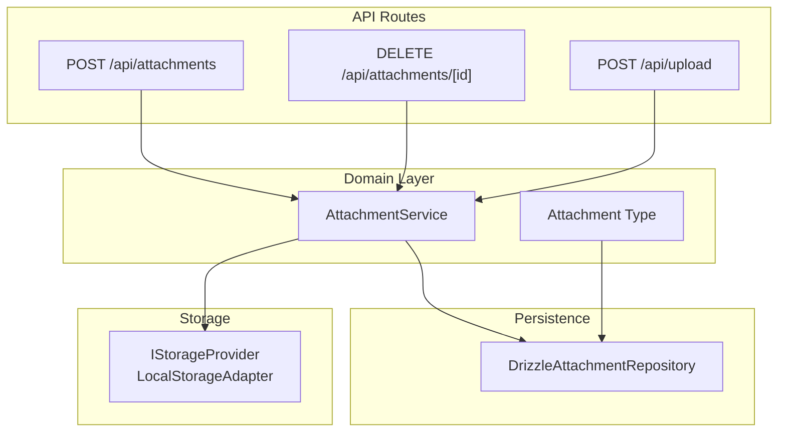
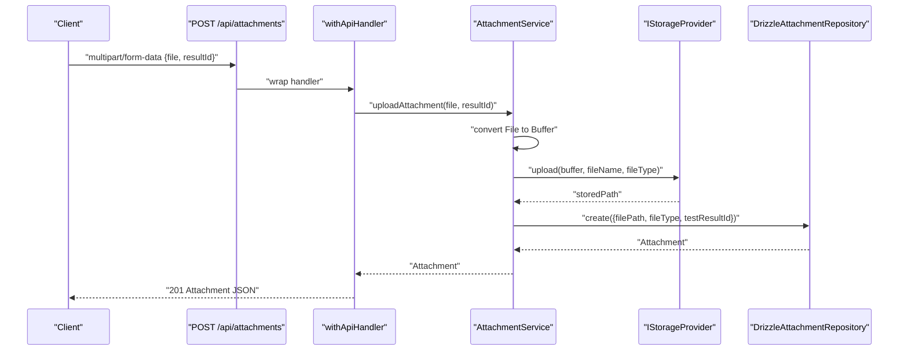
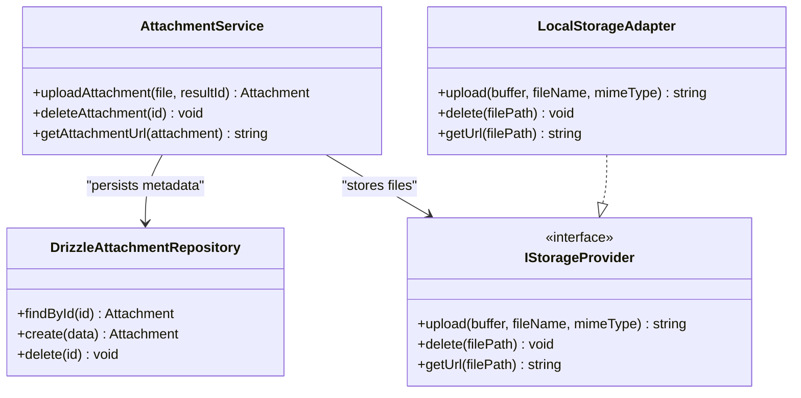

# Attachment & File Upload API

<cite>
**Referenced Files in This Document**
- [route.ts](file://app/api/attachments/route.ts)
- [route.ts](file://app/api/attachments/[id]/route.ts)
- [route.ts](file://app/api/upload/route.ts)
- [withApiHandler.ts](file://app/api/_lib/withApiHandler.ts)
- [schemas.ts](file://app/api/_lib/schemas.ts)
- [AttachmentService.ts](file://src/domain/services/AttachmentService.ts)
- [DrizzleAttachmentRepository.ts](file://src/adapters/persistence/drizzle/DrizzleAttachmentRepository.ts)
- [IStorageProvider.ts](file://src/domain/ports/IStorageProvider.ts)
- [LocalStorageAdapter.ts](file://src/adapters/storage/LocalStorageAdapter.ts)
- [index.ts](file://src/domain/types/index.ts)
- [DomainErrors.ts](file://src/domain/errors/DomainErrors.ts)
- [config.ts](file://src/infrastructure/config.ts)
</cite>

## Table of Contents
1. [Introduction](#introduction)
2. [Project Structure](#project-structure)
3. [Core Components](#core-components)
4. [Architecture Overview](#architecture-overview)
5. [Detailed Component Analysis](#detailed-component-analysis)
6. [Dependency Analysis](#dependency-analysis)
7. [Performance Considerations](#performance-considerations)
8. [Troubleshooting Guide](#troubleshooting-guide)
9. [Conclusion](#conclusion)
10. [Appendices](#appendices)

## Introduction
This document describes the Attachment and File Upload APIs. It covers:
- HTTP endpoints and methods
- Request and response schemas
- Parameter specifications for multipart/form-data uploads
- Metadata handling and storage
- Retrieval and deletion semantics
- Error handling and status codes
- Practical examples using curl and JavaScript fetch
- Security considerations, validation, and cleanup procedures

## Project Structure
The API surface for attachments and uploads consists of three routes:
- POST /api/attachments: Upload a file and associate it with a test result
- DELETE /api/attachments/[id]: Remove an attachment by ID
- POST /api/upload: Parse and save Markdown content linked to a project



**Diagram sources**
- [route.ts:1-22](file://app/api/attachments/route.ts#L1-L22)
- [route.ts:1-15](file://app/api/attachments/[id]/route.ts#L1-L15)
- [route.ts:1-24](file://app/api/upload/route.ts#L1-L24)
- [AttachmentService.ts:1-52](file://src/domain/services/AttachmentService.ts#L1-L52)
- [DrizzleAttachmentRepository.ts:1-26](file://src/adapters/persistence/drizzle/DrizzleAttachmentRepository.ts#L1-L26)
- [IStorageProvider.ts:1-21](file://src/domain/ports/IStorageProvider.ts#L1-L21)
- [LocalStorageAdapter.ts:1-44](file://src/adapters/storage/LocalStorageAdapter.ts#L1-L44)
- [index.ts:53-59](file://src/domain/types/index.ts#L53-L59)

**Section sources**
- [route.ts:1-22](file://app/api/attachments/route.ts#L1-L22)
- [route.ts:1-15](file://app/api/attachments/[id]/route.ts#L1-L15)
- [route.ts:1-24](file://app/api/upload/route.ts#L1-L24)

## Core Components
- AttachmentService: Orchestrates upload, deletion, and URL generation. It converts uploaded files to buffers, sanitizes filenames, persists metadata, and delegates storage to IStorageProvider.
- DrizzleAttachmentRepository: CRUD operations for attachment records in the database.
- IStorageProvider + LocalStorageAdapter: Abstraction and local filesystem implementation for storing files and generating URLs.
- withApiHandler: Centralized error handling middleware mapping domain errors to HTTP status codes and formatting structured error responses.

Key data structures:
- Attachment: id, filePath, fileType, createdAt, testResultId
- CreateAttachmentDTO: fields persisted for new attachments

**Section sources**
- [AttachmentService.ts:1-52](file://src/domain/services/AttachmentService.ts#L1-L52)
- [DrizzleAttachmentRepository.ts:1-26](file://src/adapters/persistence/drizzle/DrizzleAttachmentRepository.ts#L1-L26)
- [IStorageProvider.ts:1-21](file://src/domain/ports/IStorageProvider.ts#L1-L21)
- [LocalStorageAdapter.ts:1-44](file://src/adapters/storage/LocalStorageAdapter.ts#L1-L44)
- [index.ts:53-59](file://src/domain/types/index.ts#L53-L59)
- [withApiHandler.ts:1-65](file://app/api/_lib/withApiHandler.ts#L1-L65)

## Architecture Overview
End-to-end flow for uploading an attachment to a test result:



**Diagram sources**
- [route.ts:7-21](file://app/api/attachments/route.ts#L7-L21)
- [withApiHandler.ts:22-64](file://app/api/_lib/withApiHandler.ts#L22-L64)
- [AttachmentService.ts:17-31](file://src/domain/services/AttachmentService.ts#L17-L31)
- [IStorageProvider.ts:9-16](file://src/domain/ports/IStorageProvider.ts#L9-L16)
- [DrizzleAttachmentRepository.ts:13-16](file://src/adapters/persistence/drizzle/DrizzleAttachmentRepository.ts#L13-L16)

## Detailed Component Analysis

### Endpoint: POST /api/attachments
- Method: POST
- Purpose: Upload a file and associate it with a test result
- Request
  - Content-Type: multipart/form-data
  - Parts:
    - file: binary payload (required)
    - resultId: string identifier of the test result (required)
- Validation
  - Returns 400 with error code VALIDATION_ERROR if either part is missing
- Processing
  - Converts File to ArrayBuffer and Buffer
  - Sanitizes filename and prefixes with timestamp
  - Delegates storage via IStorageProvider.upload
  - Persists metadata via DrizzleAttachmentRepository.create
- Response
  - 201 Created with Attachment JSON body
  - Attachment includes id, filePath, fileType, createdAt, testResultId

Security and validation highlights:
- Filename sanitization prevents path traversal and invalid characters
- No explicit MIME whitelist is enforced in the service; ensure appropriate checks at the storage adapter or upstream
- No size limit enforcement is present in the route/service; consider adding limits for production

**Section sources**
- [route.ts:7-21](file://app/api/attachments/route.ts#L7-L21)
- [AttachmentService.ts:17-31](file://src/domain/services/AttachmentService.ts#L17-L31)
- [DrizzleAttachmentRepository.ts:13-16](file://src/adapters/persistence/drizzle/DrizzleAttachmentRepository.ts#L13-L16)
- [IStorageProvider.ts:9-16](file://src/domain/ports/IStorageProvider.ts#L9-L16)

### Endpoint: DELETE /api/attachments/[id]
- Method: DELETE
- Path Parameters:
  - id: string (required)
- Processing
  - Loads attachment by ID
  - Attempts to delete file from storage via IStorageProvider.delete
  - Deletes record from database via DrizzleAttachmentRepository.delete
  - Logs but does not fail the operation if storage deletion throws
- Response
  - 200 OK with { success: true }
- Error Handling
  - NotFoundError mapped to 404 with code NOT_FOUND

**Section sources**
- [route.ts:7-14](file://app/api/attachments/[id]/route.ts#L7-L14)
- [AttachmentService.ts:33-46](file://src/domain/services/AttachmentService.ts#L33-L46)
- [DrizzleAttachmentRepository.ts:18-20](file://src/adapters/persistence/drizzle/DrizzleAttachmentRepository.ts#L18-L20)
- [DomainErrors.ts:18-26](file://src/domain/errors/DomainErrors.ts#L18-L26)

### Endpoint: POST /api/upload
- Method: POST
- Purpose: Parse and save Markdown content associated with a project
- Request
  - Content-Type: multipart/form-data
  - Parts:
    - file: text content (required)
    - projectId: string identifier (required)
- Processing
  - Reads file content as text
  - Delegates parsing and saving to testPlanService.parseAndSaveMarkdown
- Response
  - 200 OK with { success: true }

Notes:
- This endpoint handles Markdown uploads for test plan import/export scenarios
- No explicit validation for file type or size is performed in the route

**Section sources**
- [route.ts:7-23](file://app/api/upload/route.ts#L7-L23)

### Request/Response Schemas and Data Models
- Attachment entity
  - Fields: id, filePath, fileType, createdAt, testResultId
- CreateAttachmentDTO
  - Fields: filePath, fileType, testResultId

These types define the shape of persisted data and returned JSON.

**Section sources**
- [index.ts:53-59](file://src/domain/types/index.ts#L53-L59)
- [index.ts:82-86](file://src/domain/types/index.ts#L82-L86)

### Error Handling and Status Codes
Centralized error handling via withApiHandler:
- Zod validation errors → 400 with VALIDATION_ERROR and optional details
- DomainError subclasses:
  - ValidationError → 400 with VALIDATION_ERROR
  - NotFoundError → 404 with NOT_FOUND
  - ConflictError → 409 with CONFLICT
- Other errors → 500 with INTERNAL_ERROR

Route-level validation:
- Missing file or resultId in POST /api/attachments → 400 VALIDATION_ERROR
- Missing file or projectId in POST /api/upload → 400 VALIDATION_ERROR

**Section sources**
- [withApiHandler.ts:22-64](file://app/api/_lib/withApiHandler.ts#L22-L64)
- [DomainErrors.ts:7-39](file://src/domain/errors/DomainErrors.ts#L7-L39)
- [route.ts:12-17](file://app/api/attachments/route.ts#L12-L17)
- [route.ts:12-17](file://app/api/upload/route.ts#L12-L17)

### Practical Examples

#### curl: Upload Attachment
```bash
curl -X POST http://localhost:3000/api/attachments \
  -F file=@/path/to/evidence.png \
  -F resultId=run-result-id-123
```

#### curl: Delete Attachment
```bash
curl -X DELETE http://localhost:3000/api/attachments/attach-id-456
```

#### curl: Upload Markdown
```bash
curl -X POST http://localhost:3000/api/upload \
  -F file=@/path/to/test-plan.md \
  -F projectId=proj-id-789
```

#### JavaScript (fetch): Upload Attachment
```javascript
const formData = new FormData();
formData.append("file", fileBlobOrFileInput.files[0]);
formData.append("resultId", "run-result-id-123");

const resp = await fetch("/api/attachments", {
  method: "POST",
  body: formData,
});

if (resp.ok) {
  const attachment = await resp.json();
  console.log("Uploaded:", attachment);
} else {
  const err = await resp.json();
  console.error("Upload failed:", err);
}
```

#### JavaScript (fetch): Delete Attachment
```javascript
const resp = await fetch("/api/attachments/attach-id-456", {
  method: "DELETE",
});

if (resp.ok) {
  const { success } = await resp.json();
  console.log("Deleted:", success);
}
```

## Dependency Analysis
High-level dependencies among components involved in file handling:



**Diagram sources**
- [AttachmentService.ts:11-51](file://src/domain/services/AttachmentService.ts#L11-L51)
- [DrizzleAttachmentRepository.ts:7-25](file://src/adapters/persistence/drizzle/DrizzleAttachmentRepository.ts#L7-L25)
- [IStorageProvider.ts:8-20](file://src/domain/ports/IStorageProvider.ts#L8-L20)
- [LocalStorageAdapter.ts:5-43](file://src/adapters/storage/LocalStorageAdapter.ts#L5-L43)

**Section sources**
- [AttachmentService.ts:1-52](file://src/domain/services/AttachmentService.ts#L1-L52)
- [DrizzleAttachmentRepository.ts:1-26](file://src/adapters/persistence/drizzle/DrizzleAttachmentRepository.ts#L1-L26)
- [IStorageProvider.ts:1-21](file://src/domain/ports/IStorageProvider.ts#L1-L21)
- [LocalStorageAdapter.ts:1-44](file://src/adapters/storage/LocalStorageAdapter.ts#L1-L44)

## Performance Considerations
- Streaming large files: Current implementation loads the entire file into memory (ArrayBuffer → Buffer). For very large files, consider streaming to storage and chunked writes.
- Concurrency: Multiple simultaneous uploads increase disk I/O; ensure adequate filesystem throughput and storage backend capacity.
- Cleanup: Storage deletion is best-effort; monitor logs for failures and implement retry or alerting in production.
- Caching: Returned URLs are generated by the storage adapter; ensure CDN or static serving is configured appropriately for public/uploads.

## Troubleshooting Guide
Common issues and resolutions:
- 400 Validation Error on upload
  - Cause: Missing file or resultId (attachments) / missing file or projectId (upload)
  - Resolution: Ensure multipart parts are included and valid
- 404 Not Found on delete
  - Cause: Attachment ID does not exist
  - Resolution: Verify the ID and that the record exists in the database
- Storage deletion failure
  - Behavior: Logged but does not fail the API response
  - Resolution: Inspect server logs for storage errors; confirm file permissions and path safety
- Unexpected file type or name
  - Behavior: Filename sanitized; no MIME validation enforced in service
  - Resolution: Add MIME whitelist and size limits in production

**Section sources**
- [route.ts:12-17](file://app/api/attachments/route.ts#L12-L17)
- [route.ts:12-17](file://app/api/upload/route.ts#L12-L17)
- [AttachmentService.ts:33-46](file://src/domain/services/AttachmentService.ts#L33-L46)
- [withApiHandler.ts:28-64](file://app/api/_lib/withApiHandler.ts#L28-L64)

## Conclusion
The Attachment and File Upload APIs provide a straightforward multipart upload workflow with robust error handling and a clean separation between metadata persistence and file storage. Production readiness benefits from adding size and type validations, rate limiting, and secure storage configurations.

## Appendices

### Endpoint Reference

- POST /api/attachments
  - Body: multipart/form-data
    - file: binary
    - resultId: string
  - Responses:
    - 201 Created: Attachment JSON
    - 400 Bad Request: VALIDATION_ERROR

- DELETE /api/attachments/[id]
  - Path Parameters:
    - id: string
  - Responses:
    - 200 OK: { success: true }
    - 404 Not Found: NOT_FOUND

- POST /api/upload
  - Body: multipart/form-data
    - file: text
    - projectId: string
  - Responses:
    - 200 OK: { success: true }
    - 400 Bad Request: VALIDATION_ERROR

### Data Model: Attachment
- id: string
- filePath: string
- fileType: string
- createdAt: Date
- testResultId: string

**Section sources**
- [index.ts:53-59](file://src/domain/types/index.ts#L53-L59)

### Security Considerations
- Filename sanitization: Service replaces unsafe characters; still ensure strict allowlists for extensions and enforce size limits
- Storage location: Default public/uploads is served statically; restrict access and ensure only authorized users can read URLs
- CORS and authentication: Enforce at the application level for all upload endpoints
- Temporary files: If using streams, avoid leaving partial files on disk

### Storage Configuration
- Local storage base path is configurable via FILES_PATH environment variable; defaults to public/uploads under the project root.

**Section sources**
- [config.ts:19-22](file://src/infrastructure/config.ts#L19-L22)