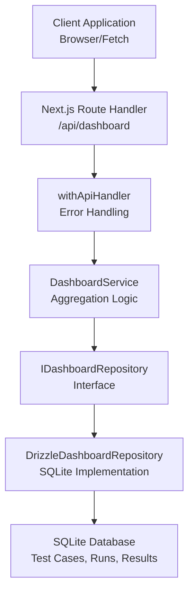
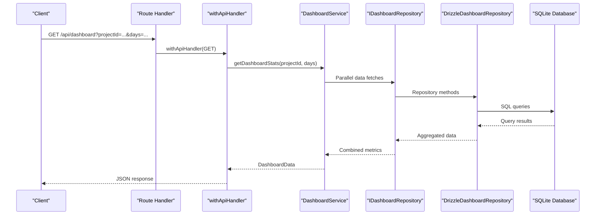

# Dashboard Analytics API

<cite>
**Referenced Files in This Document**
- [route.ts](file://app/api/dashboard/route.ts)
- [withApiHandler.ts](file://app/api/_lib/withApiHandler.ts)
- [DashboardService.ts](file://src/domain/services/DashboardService.ts)
- [DrizzleDashboardRepository.ts](file://src/adapters/persistence/drizzle/DrizzleDashboardRepository.ts)
- [IDashboardRepository.ts](file://src/domain/ports/repositories/IDashboardRepository.ts)
- [index.ts](file://src/domain/types/index.ts)
- [schema.ts](file://src/infrastructure/db/schema.ts)
- [page.tsx](file://app/page.tsx)
</cite>

## Table of Contents
1. [Introduction](#introduction)
2. [Project Structure](#project-structure)
3. [Core Components](#core-components)
4. [Architecture Overview](#architecture-overview)
5. [Detailed Component Analysis](#detailed-component-analysis)
6. [API Definition](#api-definition)
7. [Request/Response Schemas](#requestresponse-schemas)
8. [Filtering and Parameters](#filtering-and-parameters)
9. [Performance and Caching](#performance-and-caching)
10. [Real-time Updates](#real-time-updates)
11. [Examples](#examples)
12. [Troubleshooting](#troubleshooting)
13. [Conclusion](#conclusion)

## Introduction
This document provides comprehensive API documentation for the dashboard analytics endpoint. It covers HTTP methods, URL patterns, request/response schemas, filtering parameters, aggregation functions, return value structures, performance considerations, and real-time update mechanisms. The endpoint exposes aggregated analytics and statistics for test management dashboards.

## Project Structure
The dashboard analytics functionality is implemented as a Next.js Route Handler that delegates to a service layer backed by a repository pattern with a SQLite database adapter.



**Diagram sources**
- [route.ts:1-24](file://app/api/dashboard/route.ts#L1-L24)
- [withApiHandler.ts:1-65](file://app/api/_lib/withApiHandler.ts#L1-L65)
- [DashboardService.ts:1-182](file://src/domain/services/DashboardService.ts#L1-L182)
- [IDashboardRepository.ts:1-15](file://src/domain/ports/repositories/IDashboardRepository.ts#L1-L15)
- [DrizzleDashboardRepository.ts:1-313](file://src/adapters/persistence/drizzle/DrizzleDashboardRepository.ts#L1-L313)
- [schema.ts:1-60](file://src/infrastructure/db/schema.ts#L1-L60)

**Section sources**
- [route.ts:1-24](file://app/api/dashboard/route.ts#L1-L24)
- [DashboardService.ts:1-182](file://src/domain/services/DashboardService.ts#L1-L182)
- [DrizzleDashboardRepository.ts:1-313](file://src/adapters/persistence/drizzle/DrizzleDashboardRepository.ts#L1-L313)

## Core Components
- **Route Handler**: Implements the GET endpoint at `/api/dashboard` with parameter validation and response serialization.
- **Service Layer**: Orchestrates parallel data fetching and computes derived metrics including pass rates, deltas, and health scores.
- **Repository Pattern**: Abstracts data access through an interface with a SQLite implementation using Drizzle ORM.
- **Type System**: Strongly typed request/response schemas and domain entities.

**Section sources**
- [route.ts:7-22](file://app/api/dashboard/route.ts#L7-L22)
- [DashboardService.ts:17-147](file://src/domain/services/DashboardService.ts#L17-L147)
- [IDashboardRepository.ts:3-12](file://src/domain/ports/repositories/IDashboardRepository.ts#L3-L12)

## Architecture Overview
The endpoint follows a layered architecture with clear separation of concerns:



**Diagram sources**
- [route.ts:7-22](file://app/api/dashboard/route.ts#L7-L22)
- [withApiHandler.ts:22-64](file://app/api/_lib/withApiHandler.ts#L22-L64)
- [DashboardService.ts:17-43](file://src/domain/services/DashboardService.ts#L17-L43)
- [DrizzleDashboardRepository.ts:18-313](file://src/adapters/persistence/drizzle/DrizzleDashboardRepository.ts#L18-L313)

## Detailed Component Analysis

### Route Handler (`/api/dashboard`)
- HTTP Method: GET
- URL Pattern: `/api/dashboard`
- Query Parameters:
  - `projectId`: Required string identifier of the project
  - `days`: Optional numeric days window for historical data (defaults to 14)
- Validation:
  - Returns 400 with error code `VALIDATION_ERROR` if `projectId` is missing
- Response:
  - JSON payload containing aggregated dashboard statistics
  - Uses centralized error handling for validation and domain errors

**Section sources**
- [route.ts:7-22](file://app/api/dashboard/route.ts#L7-L22)
- [withApiHandler.ts:22-64](file://app/api/_lib/withApiHandler.ts#L22-L64)

### Service Layer: DashboardService
- Purpose: Aggregates data from multiple sources and computes derived metrics
- Parallel Data Fetching: Uses Promise.all to optimize performance
- Metrics Computed:
  - Status breakdown (Passed, Failed, Blocked, Untested)
  - Module-wise statistics with pass rates
  - Historical pass rate trends
  - Flaky tests detection
  - Pass rate delta between recent runs
  - Health score (0-100) using weighted formula
  - Priority distribution for test cases
  - Recent runs summary
  - Activity feed
  - Module coverage metrics

**Section sources**
- [DashboardService.ts:17-147](file://src/domain/services/DashboardService.ts#L17-L147)

### Repository Layer: DrizzleDashboardRepository
- Data Access Methods:
  - Latest run with nested results and attachments
  - Historical runs with aggregated results
  - Flaky tests calculation across recent runs
  - Priority distribution by test case priority
  - Recent runs summary with pass rates
  - Activity feed generation
  - Delta calculations for cases and runs
  - Module coverage computation
- Database Schema Dependencies:
  - Projects, Modules, TestCases, TestRuns, TestResults, TestAttachments

**Section sources**
- [DrizzleDashboardRepository.ts:18-313](file://src/adapters/persistence/drizzle/DrizzleDashboardRepository.ts#L18-L313)
- [schema.ts:10-59](file://src/infrastructure/db/schema.ts#L10-L59)

## API Definition

### Endpoint
- Method: GET
- Path: `/api/dashboard`
- Authentication: Not specified in the route handler
- Content-Type: application/json

### Query Parameters
- `projectId` (required): String identifier of the project to analyze
- `days` (optional): Number representing the historical window in days (default: 14)

### Success Response
- Status: 200 OK
- Body: [DashboardData:150-175](file://src/domain/types/index.ts#L150-L175)

### Error Responses
- Validation Error (400): Missing `projectId` parameter
- Internal Server Error (500): Unhandled exceptions

**Section sources**
- [route.ts:7-22](file://app/api/dashboard/route.ts#L7-L22)
- [withApiHandler.ts:28-64](file://app/api/_lib/withApiHandler.ts#L28-L64)

## Request/Response Schemas

### Request Schema
- Query Parameters:
  - `projectId`: String, required
  - `days`: Number, optional, default 14

### Response Schema: DashboardData
- Core Metrics:
  - `totalCases`: Number
  - `totalRuns`: Number
  - `latestRun`: TestRun | null
  - `passRate`: Number
  - `lastRunDate`: String | null
- Status Distribution:
  - `statusData`: Array of { name: string, value: number, fill: string }
- Module Statistics:
  - `moduleData`: Array of [ModuleStats:98-103](file://src/domain/types/index.ts#L98-L103)
- Historical Trends:
  - `history`: Array of [HistoricalData:105-108](file://src/domain/types/index.ts#L105-L108)
- Quality Indicators:
  - `flakyTests`: Array of [FlakyTest:110-114](file://src/domain/types/index.ts#L110-L114)
  - `healthScore`: Number (0-100)
- Deltas:
  - `casesDelta`: Number
  - `runsDelta`: Number
  - `passRateDelta`: Number
- Additional Features:
  - `priorityDistribution`: Array of [PriorityDistribution:116-120](file://src/domain/types/index.ts#L116-L120)
  - `recentRuns`: Array of [RecentRunSummary:122-132](file://src/domain/types/index.ts#L122-L132)
  - `activities`: Array of [ActivityItem:134-140](file://src/domain/types/index.ts#L134-L140)
  - `coverageByModule`: Array of [ModuleCoverage:142-148](file://src/domain/types/index.ts#L142-L148)

**Section sources**
- [DashboardService.ts:128-147](file://src/domain/services/DashboardService.ts#L128-L147)
- [index.ts:150-175](file://src/domain/types/index.ts#L150-L175)

## Filtering and Parameters

### Project Scope
- Filter by `projectId` ensures analytics are scoped to a specific project
- Repository methods accept the project identifier and join relevant tables

### Date Range Filtering
- Parameter `days` controls the historical window for:
  - Historical pass rate trends
  - Recent runs aggregation
  - Delta calculations

### Test Case Categories
- Priority-based filtering via priority distribution
- Status-based filtering via status breakdown and module statistics

### Aggregation Functions
- Count: Total cases, total runs
- Percentages: Pass rates, health scores, module success rates
- Deltas: Changes over time windows
- Rankings: Top flaky tests, module coverage

**Section sources**
- [route.ts:9-19](file://app/api/dashboard/route.ts#L9-L19)
- [DashboardService.ts:17-43](file://src/domain/services/DashboardService.ts#L17-L43)

## Performance and Caching

### Parallel Data Fetching
- The service uses Promise.all to fetch multiple datasets concurrently, reducing overall latency

### Database Optimizations
- Efficient joins and aggregations using Drizzle ORM
- Grouped queries for module coverage and priority distributions
- Limit clauses for recent data sets

### Frontend Caching Strategy
- The frontend implements periodic polling with a 30-second interval
- Manual refresh capability allows immediate updates
- Loading states prevent redundant requests

### Export Formats
- No explicit export endpoints are implemented in the current codebase
- The response format is optimized for direct consumption by the React UI

**Section sources**
- [DashboardService.ts:31-43](file://src/domain/services/DashboardService.ts#L31-L43)
- [page.tsx:226-269](file://app/page.tsx#L226-L269)

## Real-time Updates

### Polling Mechanism
- Automatic refresh every 30 seconds when a project is selected
- Manual refresh via UI button
- Last refresh timestamp displayed to users

### Update Triggers
- Project selection changes trigger initial load
- Date range changes update the historical window
- Backend does not expose WebSocket endpoints; polling is the primary mechanism

**Section sources**
- [page.tsx:226-269](file://app/page.tsx#L226-L269)

## Examples

### curl Command
```bash
curl -X GET "http://localhost:3000/api/dashboard?projectId=your-project-id&days=14"
```

### JavaScript Fetch Implementation
```javascript
const projectId = 'your-project-id';
const days = 14;
const response = await fetch(`/api/dashboard?projectId=${projectId}&days=${days}`);
const data = await response.json();
console.log(data);
```

### Response Processing (React)
```javascript
const { totalCases, totalRuns, passRate, history, moduleData } = stats;
// Use these values to render charts and metrics
```

**Section sources**
- [page.tsx:236-251](file://app/page.tsx#L236-L251)

## Troubleshooting

### Common Issues
- Missing `projectId` parameter results in 400 validation error
- Empty project state returns loading UI until data is fetched
- Network failures are logged and handled gracefully

### Error Handling
- Validation errors return structured JSON with error code and details
- Domain errors map to appropriate HTTP status codes
- Unknown errors return 500 with standardized error response

**Section sources**
- [route.ts:12-17](file://app/api/dashboard/route.ts#L12-L17)
- [withApiHandler.ts:28-64](file://app/api/_lib/withApiHandler.ts#L28-L64)

## Conclusion
The dashboard analytics API provides comprehensive test management insights through a well-structured, performant architecture. It supports project scoping, flexible date range filtering, and delivers rich metrics including pass rates, trends, quality indicators, and health scores. The implementation balances simplicity with scalability, leveraging parallel data fetching and efficient database queries while maintaining a straightforward client integration model.