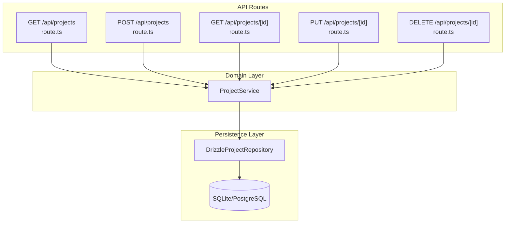
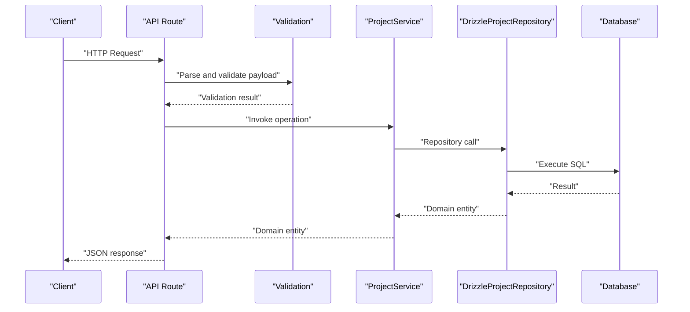
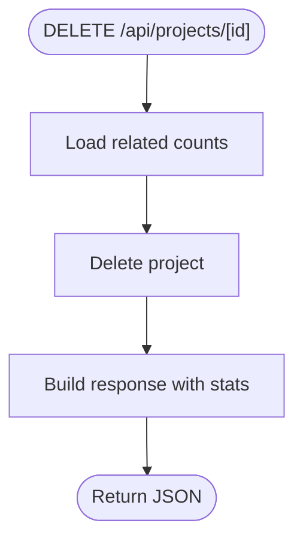
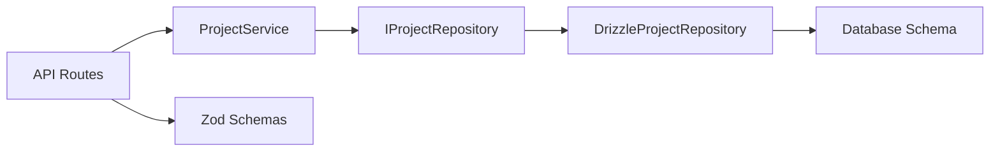
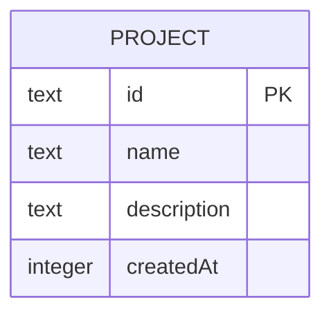

# Project Management API

<cite>
**Referenced Files in This Document**
- [route.ts](file://app/api/projects/route.ts)
- [route.ts](file://app/api/projects/[id]/route.ts)
- [schemas.ts](file://app/api/_lib/schemas.ts)
- [withApiHandler.ts](file://app/api/_lib/withApiHandler.ts)
- [ProjectService.ts](file://src/domain/services/ProjectService.ts)
- [DrizzleProjectRepository.ts](file://src/adapters/persistence/drizzle/DrizzleProjectRepository.ts)
- [IProjectRepository.ts](file://src/domain/ports/repositories/IProjectRepository.ts)
- [index.ts](file://src/domain/types/index.ts)
- [container.ts](file://src/infrastructure/container.ts)
- [schema.ts](file://src/infrastructure/db/schema.ts)
- [DomainErrors.ts](file://src/domain/errors/DomainErrors.ts)
- [client.ts](file://src/infrastructure/db/client.ts)
</cite>

## Table of Contents
1. [Introduction](#introduction)
2. [Project Structure](#project-structure)
3. [Core Components](#core-components)
4. [Architecture Overview](#architecture-overview)
5. [Detailed Component Analysis](#detailed-component-analysis)
6. [Dependency Analysis](#dependency-analysis)
7. [Performance Considerations](#performance-considerations)
8. [Troubleshooting Guide](#troubleshooting-guide)
9. [Conclusion](#conclusion)
10. [Appendices](#appendices)

## Introduction
This document describes the Project Management API, covering HTTP endpoints for creating, reading, updating, and deleting projects. It specifies request/response schemas, validation rules, error handling, and operational behavior such as cascade deletion. Authentication and authorization requirements are not enforced by the API layer itself; however, the API is designed to integrate with external authentication systems commonly used in Next.js applications.

## Project Structure
The project management API is implemented as Next.js App Router API routes under `/app/api/projects`. Two endpoints are exposed:
- Collection endpoint: `GET /api/projects` and `POST /api/projects`
- Individual endpoint: `GET /api/projects/[id]`, `PUT /api/projects/[id]`, and `DELETE /api/projects/[id]`



**Diagram sources**
- [route.ts:1-19](file://app/api/projects/route.ts#L1-L19)
- [route.ts:1-43](file://app/api/projects/[id]/route.ts#L1-L43)
- [ProjectService.ts:1-38](file://src/domain/services/ProjectService.ts#L1-L38)
- [DrizzleProjectRepository.ts:1-52](file://src/adapters/persistence/drizzle/DrizzleProjectRepository.ts#L1-L52)
- [schema.ts:10-15](file://src/infrastructure/db/schema.ts#L10-L15)

**Section sources**
- [route.ts:1-19](file://app/api/projects/route.ts#L1-L19)
- [route.ts:1-43](file://app/api/projects/[id]/route.ts#L1-L43)

## Core Components
- API routes: Define HTTP endpoints and orchestrate request parsing, validation, service invocation, and response formatting.
- Validation: Zod schemas define strict request schemas for project creation/update.
- Service layer: Encapsulates business logic for project operations and enforces existence checks.
- Persistence: Repository pattern abstracts database operations; supports SQLite and PostgreSQL.
- Error handling: Centralized wrapper ensures consistent error responses and status codes.

Key data types:
- Project entity: includes identifier, name, optional description, and creation timestamp.
- CreateProjectDTO: defines required fields for creation.

**Section sources**
- [schemas.ts:5-8](file://app/api/_lib/schemas.ts#L5-L8)
- [index.ts:9-14](file://src/domain/types/index.ts#L9-L14)
- [index.ts:63-66](file://src/domain/types/index.ts#L63-L66)

## Architecture Overview
The API follows a layered architecture:
- HTTP layer: Next.js API routes handle requests and responses.
- Validation layer: Zod schemas validate incoming payloads.
- Service layer: Business logic orchestrates operations and handles domain errors.
- Persistence layer: Repository pattern abstracts database operations.
- Database: SQLite (development/Electron) or PostgreSQL (production/Docker) with foreign-key cascades configured.



**Diagram sources**
- [route.ts:13-18](file://app/api/projects/route.ts#L13-L18)
- [route.ts:14-20](file://app/api/projects/[id]/route.ts#L14-L20)
- [schemas.ts:5-8](file://app/api/_lib/schemas.ts#L5-L8)
- [ProjectService.ts:22-30](file://src/domain/services/ProjectService.ts#L22-L30)
- [DrizzleProjectRepository.ts:26-46](file://src/adapters/persistence/drizzle/DrizzleProjectRepository.ts#L26-L46)

## Detailed Component Analysis

### Endpoint Definitions

- Base URL: `/api/projects`
- Individual resource URL: `/api/projects/[id]`

Methods and behaviors:
- GET `/api/projects`: Returns a list of all projects.
- POST `/api/projects`: Creates a new project.
- GET `/api/projects/[id]`: Retrieves a single project by ID.
- PUT `/api/projects/[id]`: Updates an existing project (partial updates supported).
- DELETE `/api/projects/[id]`: Deletes a project and returns statistics about related entities.

**Section sources**
- [route.ts:8-11](file://app/api/projects/route.ts#L8-L11)
- [route.ts:13-18](file://app/api/projects/route.ts#L13-L18)
- [route.ts:8-12](file://app/api/projects/[id]/route.ts#L8-L12)
- [route.ts:14-20](file://app/api/projects/[id]/route.ts#L14-L20)
- [route.ts:22-42](file://app/api/projects/[id]/route.ts#L22-L42)

### Request and Response Schemas

- Create/Update schema (shared):
  - name: string, required, max length 200
  - description: string, optional, max length 1000

- Response entity:
  - id: string
  - name: string
  - description: string or null
  - createdAt: Date (ISO timestamp)

- DELETE response:
  - deleted: boolean
  - stats: object containing counts for related modules, test cases, and test runs

Validation rules:
- Name is required and limited to 200 characters.
- Description is optional and limited to 1000 characters.

**Section sources**
- [schemas.ts:5-8](file://app/api/_lib/schemas.ts#L5-L8)
- [index.ts:9-14](file://src/domain/types/index.ts#L9-L14)
- [route.ts:34-41](file://app/api/projects/[id]/route.ts#L34-L41)

### Authentication and Authorization
- Authentication: Not enforced by the API layer.
- Authorization: Not enforced by the API layer.
- Recommendation: Integrate with your preferred Next.js authentication method (e.g., NextAuth.js) at the middleware or route level.

[No sources needed since this section does not analyze specific files]

### Processing Logic

#### Creation (POST)
- Parse JSON body.
- Validate against create schema.
- Call service to create project.
- Return created project entity.

#### Retrieval (GET)
- Collection: Retrieve all projects.
- Single: Retrieve by ID; throws 404 if not found.

#### Update (PUT)
- Parse JSON body.
- Validate against create schema.
- Perform partial update via service; throws 404 if not found.

#### Deletion (DELETE)
- Compute counts for modules, test cases, and test runs before deletion.
- Delete project.
- Return success with statistics.



**Diagram sources**
- [route.ts:22-42](file://app/api/projects/[id]/route.ts#L22-L42)

**Section sources**
- [route.ts:13-18](file://app/api/projects/route.ts#L13-L18)
- [route.ts:14-20](file://app/api/projects/[id]/route.ts#L14-L20)
- [route.ts:22-42](file://app/api/projects/[id]/route.ts#L22-L42)

### Error Handling and Status Codes
Centralized error handling maps exceptions to structured JSON responses:
- Validation failures (Zod): 400 with field-level details.
- Domain errors:
  - NOT_FOUND: 404
  - VALIDATION_ERROR: 400
  - CONFLICT: 409
- Other errors: 500 Internal Server Error

Example error response structure:
- error: string
- code: string
- details: object (validation only)

**Section sources**
- [withApiHandler.ts:8-12](file://app/api/_lib/withApiHandler.ts#L8-L12)
- [withApiHandler.ts:25-64](file://app/api/_lib/withApiHandler.ts#L25-L64)
- [DomainErrors.ts:18-38](file://src/domain/errors/DomainErrors.ts#L18-L38)

### Practical Examples

curl examples:
- List projects:
  ```bash
  curl -s -X GET https://your-domain.com/api/projects
  ```
- Create a project:
  ```bash
  curl -s -X POST https://your-domain.com/api/projects \
    -H "Content-Type: application/json" \
    -d '{"name":"My Project","description":"Project description"}'
  ```
- Get a project:
  ```bash
  curl -s -X GET https://your-domain.com/api/projects/<id>
  ```
- Update a project:
  ```bash
  curl -s -X PUT https://your-domain.com/api/projects/<id> \
    -H "Content-Type: application/json" \
    -d '{"name":"Updated Name"}'
  ```
- Delete a project:
  ```bash
  curl -s -X DELETE https://your-domain.com/api/projects/<id>
  ```

JavaScript fetch examples:
- Create a project:
  ```javascript
  const res = await fetch('/api/projects', {
    method: 'POST',
    headers: { 'Content-Type': 'application/json' },
    body: JSON.stringify({ name: 'Project Name', description: 'Description' })
  });
  const data = await res.json();
  ```
- Update a project:
  ```javascript
  const res = await fetch(`/api/projects/${id}`, {
    method: 'PUT',
    headers: { 'Content-Type': 'application/json' },
    body: JSON.stringify({ description: 'New description' })
  });
  const data = await res.json();
  ```

[No sources needed since this section provides usage examples without quoting specific code]

## Dependency Analysis
The API routes depend on:
- ProjectService for business logic.
- Zod schemas for validation.
- IoC container for dependency injection.



**Diagram sources**
- [route.ts:4-6](file://app/api/projects/route.ts#L4-L6)
- [route.ts:4-6](file://app/api/projects/[id]/route.ts#L4-L6)
- [ProjectService.ts:1-10](file://src/domain/services/ProjectService.ts#L1-L10)
- [IProjectRepository.ts:1-10](file://src/domain/ports/repositories/IProjectRepository.ts#L1-L10)
- [DrizzleProjectRepository.ts:1-6](file://src/adapters/persistence/drizzle/DrizzleProjectRepository.ts#L1-L6)
- [schema.ts:10-15](file://src/infrastructure/db/schema.ts#L10-L15)
- [container.ts:53-53](file://src/infrastructure/container.ts#L53-L53)

**Section sources**
- [container.ts:53-53](file://src/infrastructure/container.ts#L53-L53)
- [route.ts:4-6](file://app/api/projects/route.ts#L4-L6)
- [route.ts:4-6](file://app/api/projects/[id]/route.ts#L4-L6)

## Performance Considerations
- Validation occurs synchronously before service calls; keep payloads minimal.
- Repository queries return mapped entities with normalized dates.
- Database foreign keys are configured for cascading deletes; ensure appropriate indexing for large datasets.

[No sources needed since this section provides general guidance]

## Troubleshooting Guide
Common issues and resolutions:
- Validation errors (400): Review the details field for field-specific messages.
- Not found (404): Verify the project ID exists.
- Internal server error (500): Check server logs for stack traces.

**Section sources**
- [withApiHandler.ts:25-64](file://app/api/_lib/withApiHandler.ts#L25-L64)
- [DomainErrors.ts:18-26](file://src/domain/errors/DomainErrors.ts#L18-L26)

## Conclusion
The Project Management API provides a concise set of endpoints for CRUD operations on projects with strict validation, centralized error handling, and a clean separation of concerns. Integration with authentication and authorization should be handled externally, while the API remains stateless and predictable.

[No sources needed since this section summarizes without analyzing specific files]

## Appendices

### API Reference Summary

- GET `/api/projects`
  - Response: array of project entities
  - Status: 200 OK

- POST `/api/projects`
  - Request body: name, description
  - Response: project entity
  - Status: 201 Created

- GET `/api/projects/[id]`
  - Response: project entity
  - Status: 200 OK, 404 Not Found

- PUT `/api/projects/[id]`
  - Request body: partial name, description
  - Response: project entity
  - Status: 200 OK, 404 Not Found

- DELETE `/api/projects/[id]`
  - Response: { deleted: true, stats: { modules, cases, runs } }
  - Status: 200 OK, 404 Not Found

**Section sources**
- [route.ts:8-18](file://app/api/projects/route.ts#L8-L18)
- [route.ts:8-42](file://app/api/projects/[id]/route.ts#L8-L42)

### Data Model



**Diagram sources**
- [schema.ts:10-15](file://src/infrastructure/db/schema.ts#L10-L15)
- [index.ts:9-14](file://src/domain/types/index.ts#L9-L14)