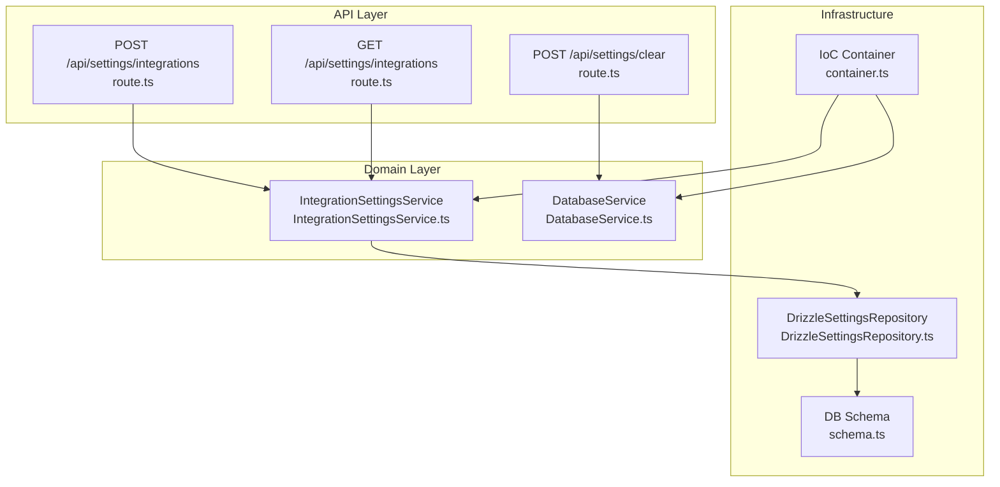
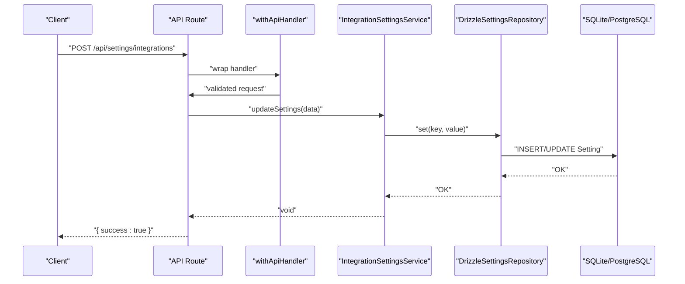
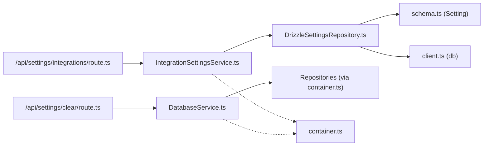

# Settings & Configuration API

<cite>
**Referenced Files in This Document**
- [route.ts](file://app/api/settings/integrations/route.ts)
- [route.ts](file://app/api/settings/clear/route.ts)
- [schemas.ts](file://app/api/_lib/schemas.ts)
- [withApiHandler.ts](file://app/api/_lib/withApiHandler.ts)
- [IntegrationSettingsService.ts](file://src/domain/services/IntegrationSettingsService.ts)
- [DrizzleSettingsRepository.ts](file://src/adapters/persistence/drizzle/DrizzleSettingsRepository.ts)
- [DatabaseService.ts](file://src/domain/services/DatabaseService.ts)
- [container.ts](file://src/infrastructure/container.ts)
- [schema.ts](file://src/infrastructure/db/schema.ts)
- [DomainErrors.ts](file://src/domain/errors/DomainErrors.ts)
- [config.ts](file://src/infrastructure/config.ts)
- [client.ts](file://src/infrastructure/db/client.ts)
</cite>

## Table of Contents
1. [Introduction](#introduction)
2. [Project Structure](#project-structure)
3. [Core Components](#core-components)
4. [Architecture Overview](#architecture-overview)
5. [Detailed Component Analysis](#detailed-component-analysis)
6. [Dependency Analysis](#dependency-analysis)
7. [Performance Considerations](#performance-considerations)
8. [Troubleshooting Guide](#troubleshooting-guide)
9. [Conclusion](#conclusion)
10. [Appendices](#appendices)

## Introduction
This document describes the Settings and Configuration APIs for managing system-wide settings and integration credentials. It covers HTTP endpoints, request/response schemas, validation rules, error handling, and operational guidance including security and backup/restore considerations.

## Project Structure
The settings-related API endpoints are located under the Next.js App Router at:
- GET/POST /api/settings/integrations
- POST /api/settings/clear

These routes delegate to domain services and repositories for persistence and integration configuration.

**Diagram sources**
- [route.ts:1-19](file://app/api/settings/integrations/route.ts#L1-L19)
- [route.ts:1-11](file://app/api/settings/clear/route.ts#L1-L11)
- [IntegrationSettingsService.ts:1-37](file://src/domain/services/IntegrationSettingsService.ts#L1-L37)
- [DatabaseService.ts:1-34](file://src/domain/services/DatabaseService.ts#L1-L34)
- [DrizzleSettingsRepository.ts:1-29](file://src/adapters/persistence/drizzle/DrizzleSettingsRepository.ts#L1-L29)
- [container.ts:1-126](file://src/infrastructure/container.ts#L1-L126)
- [schema.ts:1-60](file://src/infrastructure/db/schema.ts#L1-L60)

**Section sources**
- [route.ts:1-19](file://app/api/settings/integrations/route.ts#L1-L19)
- [route.ts:1-11](file://app/api/settings/clear/route.ts#L1-L11)
- [container.ts:1-126](file://src/infrastructure/container.ts#L1-L126)

## Core Components
- Settings endpoint: GET and POST to manage integration settings (LLM provider, Jira, Slack).
- Clear data endpoint: POST to delete all application data.

Key responsibilities:
- Validation: Zod schemas define allowed fields and optional updates.
- Persistence: Settings stored as key/value pairs in the database.
- Error handling: Centralized wrapper maps validation and domain errors to HTTP responses.

**Section sources**
- [schemas.ts:29-42](file://app/api/_lib/schemas.ts#L29-L42)
- [IntegrationSettingsService.ts:1-37](file://src/domain/services/IntegrationSettingsService.ts#L1-L37)
- [DrizzleSettingsRepository.ts:1-29](file://src/adapters/persistence/drizzle/DrizzleSettingsRepository.ts#L1-L29)
- [withApiHandler.ts:1-65](file://app/api/_lib/withApiHandler.ts#L1-L65)

## Architecture Overview
The API routes are thin wrappers around domain services. They parse and validate requests, then call services that encapsulate business logic and persistence.

**Diagram sources**
- [route.ts:13-18](file://app/api/settings/integrations/route.ts#L13-L18)
- [withApiHandler.ts:22-64](file://app/api/_lib/withApiHandler.ts#L22-L64)
- [IntegrationSettingsService.ts:19-35](file://src/domain/services/IntegrationSettingsService.ts#L19-L35)
- [DrizzleSettingsRepository.ts:12-16](file://src/adapters/persistence/drizzle/DrizzleSettingsRepository.ts#L12-L16)
- [schema.ts:4-8](file://src/infrastructure/db/schema.ts#L4-L8)

## Detailed Component Analysis

### Settings Integrations Endpoint
- Path: /api/settings/integrations
- Methods:
  - GET: Returns current integration settings as a key-value map.
  - POST: Accepts partial updates to settings; invalid fields are ignored by the service.

Request schema (Zod):
- Fields: provider, model, baseUrl, apiKey, jiraUrl, jiraEmail, jiraToken, jiraProject, slackWebhook
- All fields are optional; only provided keys are updated.

Response:
- GET: Object with keys for configured settings.
- POST: { success: true }

Validation and error handling:
- Validation failures return HTTP 400 with structured details.
- Domain errors map to appropriate HTTP status codes.
- Other exceptions return HTTP 500.

Security considerations:
- Sensitive values (e.g., API keys) are stored as-is in the database. Treat the database as sensitive and restrict access accordingly.
- Prefer environment variables for defaults and avoid embedding secrets in client-side code.

Operational notes:
- The service reads a predefined set of keys and writes only those present in the request payload.

**Section sources**
- [route.ts:1-19](file://app/api/settings/integrations/route.ts#L1-L19)
- [schemas.ts:31-41](file://app/api/_lib/schemas.ts#L31-L41)
- [IntegrationSettingsService.ts:11-35](file://src/domain/services/IntegrationSettingsService.ts#L11-L35)
- [DrizzleSettingsRepository.ts:18-27](file://src/adapters/persistence/drizzle/DrizzleSettingsRepository.ts#L18-L27)
- [withApiHandler.ts:22-64](file://app/api/_lib/withApiHandler.ts#L22-L64)
- [DomainErrors.ts:7-39](file://src/domain/errors/DomainErrors.ts#L7-L39)

### Clear Data Endpoint
- Path: /api/settings/clear
- Method: POST
- Purpose: Deletes all application data (attachments, test results, test runs, test cases, modules).

Response:
- { success: true }

Behavior:
- Executes a controlled cascade deletion order to respect foreign keys.
- Intended for administrative tasks like resetting the environment.

**Section sources**
- [route.ts:1-11](file://app/api/settings/clear/route.ts#L1-L11)
- [DatabaseService.ts:22-32](file://src/domain/services/DatabaseService.ts#L22-L32)
- [container.ts:116-125](file://src/infrastructure/container.ts#L116-L125)

### Parameter Specifications

#### LLM Provider Setup
- provider: string (optional)
  - Values supported by adapters: gemini, openai-compatible, ollama.
- model: string (optional)
- baseUrl: string (optional)
- apiKey: string (optional)

Notes:
- For openai-compatible providers, baseUrl typically ends with /v1.
- For local Ollama, default base URL is http://localhost:11434; model defaults to llama3.
- Gemini adapter supports environment variables for API key fallback.

**Section sources**
- [IntegrationSettingsService.ts:12-16](file://src/domain/services/IntegrationSettingsService.ts#L12-L16)
- [config.ts:13-18](file://src/infrastructure/config.ts#L13-L18)
- [OpenAICompatibleAdapter.ts:14-19](file://src/adapters/llm/OpenAICompatibleAdapter.ts#L14-L19)
- [OllamaAdapter.ts:9-16](file://src/adapters/llm/OllamaAdapter.ts#L9-L16)
- [GeminiAdapter.ts:10-12](file://src/adapters/llm/GeminiAdapter.ts#L10-L12)

#### External Service Credentials
- Jira:
  - jiraUrl: string (optional)
  - jiraEmail: string (optional)
  - jiraToken: string (optional)
  - jiraProject: string (optional)
- Slack:
  - slackWebhook: string (optional)

Notes:
- These keys are managed via the same settings mechanism; updates are applied atomically per-key.

**Section sources**
- [IntegrationSettingsService.ts:12-16](file://src/domain/services/IntegrationSettingsService.ts#L12-L16)
- [DrizzleSettingsRepository.ts:12-16](file://src/adapters/persistence/drizzle/DrizzleSettingsRepository.ts#L12-L16)

#### System-wide Settings
- Keys managed by the service include:
  - llm_provider, llm_model, llm_base_url, llm_api_key
  - jira_url, jira_email, jira_token, jira_project
  - slack_webhook

Persistence:
- Stored as key/value pairs with timestamps.

**Section sources**
- [IntegrationSettingsService.ts:12-16](file://src/domain/services/IntegrationSettingsService.ts#L12-L16)
- [DrizzleSettingsRepository.ts:7-16](file://src/adapters/persistence/drizzle/DrizzleSettingsRepository.ts#L7-L16)
- [schema.ts:4-8](file://src/infrastructure/db/schema.ts#L4-L8)

### Return Value Structures

- GET /api/settings/integrations
  - Returns an object containing only the keys that are currently set.
  - Example shape: { llm_provider: "gemini", llm_model: "..." }

- POST /api/settings/integrations
  - Returns: { success: true }

- POST /api/settings/clear
  - Returns: { success: true }

**Section sources**
- [route.ts:8-18](file://app/api/settings/integrations/route.ts#L8-L18)
- [route.ts:7-10](file://app/api/settings/clear/route.ts#L7-L10)

### Error Handling and Status Codes
- Validation errors (Zod): HTTP 400 with details object keyed by field path.
- Domain errors: Mapped to HTTP status via error.statusCode (e.g., 404, 400, 409).
- Internal errors: HTTP 500 with standardized error envelope.

Error envelope:
- error: Human-readable message
- code: Machine-readable error code
- details: Optional field-level validation messages

**Section sources**
- [withApiHandler.ts:8-12](file://app/api/_lib/withApiHandler.ts#L8-L12)
- [withApiHandler.ts:29-62](file://app/api/_lib/withApiHandler.ts#L29-L62)
- [DomainErrors.ts:7-39](file://src/domain/errors/DomainErrors.ts#L7-L39)

### Practical Examples

#### Retrieve Settings
- curl
  - curl -sS -X GET https://your-host/api/settings/integrations
- JavaScript (fetch)
  - fetch("/api/settings/integrations").then(r => r.json())

#### Update Settings
- curl
  - curl -sS -X POST https://your-host/api/settings/integrations \
    -H "Content-Type: application/json" \
    -d '{"provider":"gemini","model":"gemini-2.5-flash","apiKey":"..."}'
- JavaScript (fetch)
  - fetch("/api/settings/integrations", {
      method: "POST",
      headers: {"Content-Type": "application/json"},
      body: JSON.stringify({ provider: "gemini", model: "...", apiKey: "..." })
    })

#### Clear All Data
- curl
  - curl -sS -X POST https://your-host/api/settings/clear
- JavaScript (fetch)
  - fetch("/api/settings/clear", { method: "POST" })

[No sources needed since this section provides usage examples without quoting specific code]

## Dependency Analysis
- API routes depend on:
  - withApiHandler for centralized error handling
  - IntegrationSettingsService and DatabaseService for business logic
- Services depend on:
  - DrizzleSettingsRepository for persistence
  - IoC container for dependency wiring
- Persistence depends on:
  - Drizzle schema for Setting table
  - Database client supporting SQLite and PostgreSQL

**Diagram sources**
- [route.ts:1-19](file://app/api/settings/integrations/route.ts#L1-L19)
- [route.ts:1-11](file://app/api/settings/clear/route.ts#L1-L11)
- [IntegrationSettingsService.ts:1-37](file://src/domain/services/IntegrationSettingsService.ts#L1-L37)
- [DatabaseService.ts:1-34](file://src/domain/services/DatabaseService.ts#L1-L34)
- [DrizzleSettingsRepository.ts:1-29](file://src/adapters/persistence/drizzle/DrizzleSettingsRepository.ts#L1-L29)
- [schema.ts:4-8](file://src/infrastructure/db/schema.ts#L4-L8)
- [client.ts:1-32](file://src/infrastructure/db/client.ts#L1-L32)
- [container.ts:1-126](file://src/infrastructure/container.ts#L1-L126)

**Section sources**
- [container.ts:33-91](file://src/infrastructure/container.ts#L33-L91)
- [schema.ts:4-8](file://src/infrastructure/db/schema.ts#L4-L8)
- [client.ts:6-25](file://src/infrastructure/db/client.ts#L6-L25)

## Performance Considerations
- Settings retrieval uses a single getAll operation for a fixed set of keys; complexity is O(k) where k is the number of keys.
- Updates apply only the provided keys; repository uses upsert semantics to minimize write amplification.
- Database initialization sets SQLite pragmas for improved performance and foreign key enforcement.

[No sources needed since this section provides general guidance]

## Troubleshooting Guide
Common issues and resolutions:
- Validation failure on settings update:
  - Cause: Unexpected field names or types.
  - Action: Review the allowed fields and ensure optional fields are omitted if not changing.
- Internal server error:
  - Cause: Unhandled exception in route or service.
  - Action: Check server logs; response body includes a generic internal error code.
- Database connectivity:
  - Cause: Incorrect DB provider or URL.
  - Action: Verify environment variables for DB provider and URL; confirm database is reachable.

**Section sources**
- [withApiHandler.ts:29-62](file://app/api/_lib/withApiHandler.ts#L29-L62)
- [client.ts:6-25](file://src/infrastructure/db/client.ts#L6-L25)

## Conclusion
The Settings and Configuration API provides a simple, validated interface for managing integration credentials and performing administrative cleanup. By centralizing error handling and using typed schemas, the API ensures predictable behavior and clear feedback for clients.

[No sources needed since this section summarizes without analyzing specific files]

## Appendices

### API Definitions

- GET /api/settings/integrations
  - Description: Retrieve current integration settings.
  - Response: Object with keys for configured settings.
  - Success: 200 OK
  - Errors: 500 Internal Server Error (generic)

- POST /api/settings/integrations
  - Description: Partially update integration settings.
  - Body: Optional fields: provider, model, baseUrl, apiKey, jiraUrl, jiraEmail, jiraToken, jiraProject, slackWebhook.
  - Success: 200 OK with { success: true }
  - Errors: 400 Validation Error (field-level details), 500 Internal Server Error

- POST /api/settings/clear
  - Description: Delete all application data.
  - Success: 200 OK with { success: true }
  - Errors: 500 Internal Server Error

**Section sources**
- [route.ts:8-18](file://app/api/settings/integrations/route.ts#L8-L18)
- [route.ts:7-10](file://app/api/settings/clear/route.ts#L7-L10)
- [schemas.ts:31-41](file://app/api/_lib/schemas.ts#L31-L41)
- [withApiHandler.ts:29-62](file://app/api/_lib/withApiHandler.ts#L29-L62)

### Security Considerations
- Protect database backups and environment variables.
- Avoid exposing API keys in client-side code.
- Use HTTPS in production.
- Limit access to administrative endpoints.

[No sources needed since this section provides general guidance]

### Backup and Restore Procedures
- SQLite:
  - Back up the database file and restore by replacing it while the application is stopped.
- PostgreSQL:
  - Use pg_dump/pg_restore; ensure schema matches the application’s migration state.
- Environment variables:
  - Export and store securely; reapply during restore.

[No sources needed since this section provides general guidance]