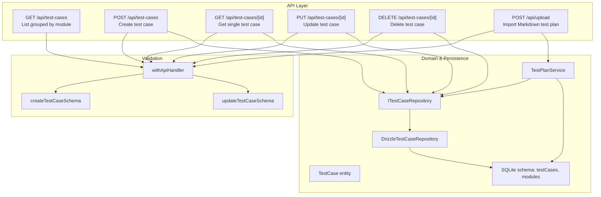
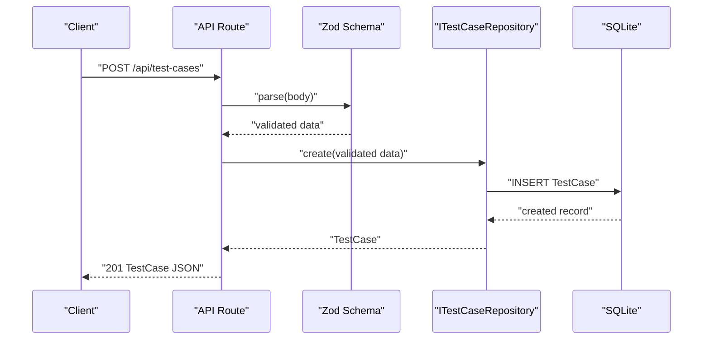
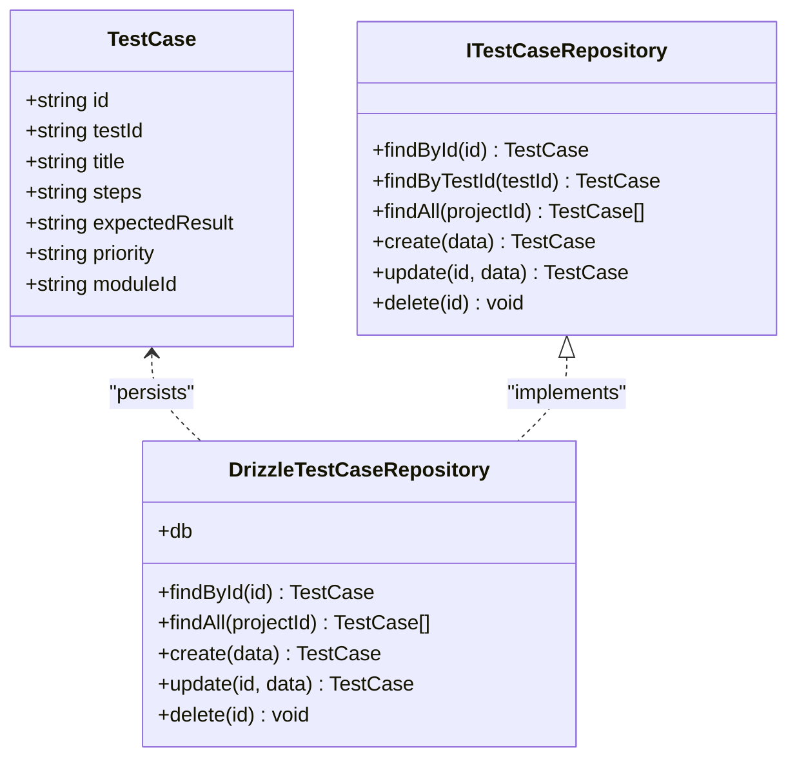

# Test Case Management API

<cite>
**Referenced Files in This Document**
- [route.ts](file://app/api/test-cases/route.ts)
- [route.ts](file://app/api/test-cases/[id]/route.ts)
- [schemas.ts](file://app/api/_lib/schemas.ts)
- [withApiHandler.ts](file://app/api/_lib/withApiHandler.ts)
- [DrizzleTestCaseRepository.ts](file://src/adapters/persistence/drizzle/DrizzleTestCaseRepository.ts)
- [ITestCaseRepository.ts](file://src/domain/ports/ITestCaseRepository.ts)
- [index.ts](file://src/domain/types/index.ts)
- [schema.ts](file://src/infrastructure/db/schema.ts)
- [TestPlanService.ts](file://src/domain/services/TestPlanService.ts)
- [route.ts](file://app/api/upload/route.ts)
- [page.tsx](file://app/test-cases/page.tsx)
- [ImportButton.tsx](file://src/ui/test-design/ImportButton.tsx)
- [DomainErrors.ts](file://src/domain/errors/DomainErrors.ts)
</cite>

## Table of Contents
1. [Introduction](#introduction)
2. [Project Structure](#project-structure)
3. [Core Components](#core-components)
4. [Architecture Overview](#architecture-overview)
5. [Detailed Component Analysis](#detailed-component-analysis)
6. [Dependency Analysis](#dependency-analysis)
7. [Performance Considerations](#performance-considerations)
8. [Troubleshooting Guide](#troubleshooting-guide)
9. [Conclusion](#conclusion)
10. [Appendices](#appendices)

## Introduction
This document describes the Test Case Management API, covering endpoints for listing, creating, retrieving, updating, and deleting test cases. It also documents hierarchical grouping by modules, validation rules, error handling, and supported import/export formats. The API adheres to REST conventions and uses JSON for requests and responses.

## Project Structure
The test case API is implemented as Next.js routes under `/app/api/test-cases`. Validation is handled via Zod schemas, and CRUD operations are delegated to a repository abstraction backed by a Drizzle ORM adapter. An import endpoint parses Markdown test plans and persists modules and test cases.

**Diagram sources**
- [route.ts:1-37](file://app/api/test-cases/route.ts#L1-L37)
- [route.ts:1-33](file://app/api/test-cases/[id]/route.ts#L1-L33)
- [route.ts:1-24](file://app/api/upload/route.ts#L1-L24)
- [schemas.ts:74-91](file://app/api/_lib/schemas.ts#L74-L91)
- [withApiHandler.ts:1-65](file://app/api/_lib/withApiHandler.ts#L1-L65)
- [ITestCaseRepository.ts:1-13](file://src/domain/ports/ITestCaseRepository.ts#L1-L13)
- [DrizzleTestCaseRepository.ts:1-71](file://src/adapters/persistence/drizzle/DrizzleTestCaseRepository.ts#L1-L71)
- [schema.ts:24-32](file://src/infrastructure/db/schema.ts#L24-L32)
- [TestPlanService.ts:1-110](file://src/domain/services/TestPlanService.ts#L1-L110)

**Section sources**
- [route.ts:1-37](file://app/api/test-cases/route.ts#L1-L37)
- [route.ts:1-33](file://app/api/test-cases/[id]/route.ts#L1-L33)
- [schemas.ts:74-91](file://app/api/_lib/schemas.ts#L74-L91)
- [withApiHandler.ts:1-65](file://app/api/_lib/withApiHandler.ts#L1-L65)
- [ITestCaseRepository.ts:1-13](file://src/domain/ports/ITestCaseRepository.ts#L1-L13)
- [DrizzleTestCaseRepository.ts:1-71](file://src/adapters/persistence/drizzle/DrizzleTestCaseRepository.ts#L1-L71)
- [schema.ts:24-32](file://src/infrastructure/db/schema.ts#L24-L32)
- [TestPlanService.ts:1-110](file://src/domain/services/TestPlanService.ts#L1-L110)

## Core Components
- Test case entity and DTOs define the canonical structure for test cases, including identifiers, title, steps, expected results, priority, and module association.
- Validation schemas enforce required fields and constraints for creation and updates.
- API routes implement HTTP endpoints with standardized error handling.
- Repository abstraction enables persistence and supports both SQLite and in-memory implementations.
- Import pipeline parses Markdown test plans and creates modules and test cases.

Key data structures:
- TestCase: id, testId, title, steps, expectedResult, priority, moduleId, optional module relation.
- CreateTestCaseDTO: fields required for creation.
- UpdateResultDTO: fields allowed for partial updates.

**Section sources**
- [index.ts:23-32](file://src/domain/types/index.ts#L23-L32)
- [index.ts:68-75](file://src/domain/types/index.ts#L68-L75)
- [index.ts:77-80](file://src/domain/types/index.ts#L77-L80)
- [schemas.ts:74-91](file://app/api/_lib/schemas.ts#L74-L91)
- [ITestCaseRepository.ts:1-13](file://src/domain/ports/ITestCaseRepository.ts#L1-L13)

## Architecture Overview
The API follows a layered architecture:
- Routes: HTTP entry points for test case operations.
- Validation: Zod schemas validate request bodies.
- Handler wrapper: Centralized error handling and response shaping.
- Services: Domain services orchestrate parsing and persistence.
- Repositories: Abstraction for persistence operations.
- Database: Drizzle ORM schema for SQLite.

**Diagram sources**
- [route.ts:30-36](file://app/api/test-cases/route.ts#L30-L36)
- [schemas.ts:74-81](file://app/api/_lib/schemas.ts#L74-L81)
- [DrizzleTestCaseRepository.ts:37-46](file://src/adapters/persistence/drizzle/DrizzleTestCaseRepository.ts#L37-L46)
- [schema.ts:24-32](file://src/infrastructure/db/schema.ts#L24-L32)

## Detailed Component Analysis

### Endpoint Catalog

- Base URL: `/api/test-cases`
- Single-case URL pattern: `/api/test-cases/[id]`
- Import endpoint: `/api/upload` (Markdown test plan import)

#### GET /api/test-cases
- Purpose: List all test cases for a project, grouped by module.
- Query parameters:
  - projectId (required): string
- Response:
  - Body: `{ modules: [{ module: Module, testCases: TestCase[] }], totalCases: number }`
  - Status: 200
- Error responses:
  - 400 Bad Request: If projectId is missing
- Notes:
  - Returns grouped structure with module metadata and associated test cases.

**Section sources**
- [route.ts:8-28](file://app/api/test-cases/route.ts#L8-L28)

#### POST /api/test-cases
- Purpose: Create a new test case.
- Request body (JSON):
  - Fields: testId, title, steps, expectedResult, priority, moduleId
- Response:
  - 201 Created with created TestCase JSON
  - 400 Bad Request with structured validation error details
- Validation rules:
  - testId: required, max length 50
  - title: required, max length 500
  - steps: required
  - expectedResult: required
  - priority: enum P1|P2|P3|P4
  - moduleId: required
- Notes:
  - On success, returns the created entity with generated identifiers.

**Section sources**
- [route.ts:30-36](file://app/api/test-cases/route.ts#L30-L36)
- [schemas.ts:74-81](file://app/api/_lib/schemas.ts#L74-L81)
- [DrizzleTestCaseRepository.ts:37-46](file://src/adapters/persistence/drizzle/DrizzleTestCaseRepository.ts#L37-L46)

#### GET /api/test-cases/[id]
- Purpose: Retrieve a single test case by ID.
- Path parameters:
  - id (required): string
- Response:
  - 200 OK with TestCase JSON
  - 404 Not Found if not found
- Notes:
  - Returns the test case entity; module relationship may be included depending on repository projection.

**Section sources**
- [route.ts:8-16](file://app/api/test-cases/[id]/route.ts#L8-L16)
- [DrizzleTestCaseRepository.ts:8-11](file://src/adapters/persistence/drizzle/DrizzleTestCaseRepository.ts#L8-L11)

#### PUT /api/test-cases/[id]
- Purpose: Update an existing test case.
- Path parameters:
  - id (required): string
- Request body (JSON):
  - Optional fields: testId, title, steps, expectedResult, priority, moduleId
- Response:
  - 200 OK with updated TestCase JSON
  - 400 Bad Request with structured validation error details
- Validation rules:
  - Same constraints as creation, but all fields are optional
- Notes:
  - Supports partial updates; repository applies only provided fields.

**Section sources**
- [route.ts:18-25](file://app/api/test-cases/[id]/route.ts#L18-L25)
- [schemas.ts:83-90](file://app/api/_lib/schemas.ts#L83-L90)
- [DrizzleTestCaseRepository.ts:49-56](file://src/adapters/persistence/drizzle/DrizzleTestCaseRepository.ts#L49-L56)

#### DELETE /api/test-cases/[id]
- Purpose: Delete a test case by ID.
- Path parameters:
  - id (required): string
- Response:
  - 200 OK with `{ deleted: true }`
- Notes:
  - Deletion is performed by ID; foreign keys cascade to dependent entities as per schema.

**Section sources**
- [route.ts:27-32](file://app/api/test-cases/[id]/route.ts#L27-L32)
- [DrizzleTestCaseRepository.ts:58-60](file://src/adapters/persistence/drizzle/DrizzleTestCaseRepository.ts#L58-L60)
- [schema.ts:24-32](file://src/infrastructure/db/schema.ts#L24-L32)

#### POST /api/upload (Import)
- Purpose: Import a Markdown test plan and persist modules and test cases.
- Form fields:
  - file (required): .md or .html
  - projectId (required): string
- Response:
  - 200 OK with `{ success: true }`
  - 400 Bad Request if missing file or projectId
- Behavior:
  - Parses Markdown, detects module headers and tables, and creates modules/test cases accordingly.
  - Existing test cases with matching testId are skipped if module association differs.

**Section sources**
- [route.ts:7-23](file://app/api/upload/route.ts#L7-L23)
- [TestPlanService.ts:35-108](file://src/domain/services/TestPlanService.ts#L35-L108)
- [page.tsx:170-201](file://app/test-cases/page.tsx#L170-L201)
- [ImportButton.tsx:14-51](file://src/ui/test-design/ImportButton.tsx#L14-L51)

### Request/Response Schemas

- Create test case (POST /api/test-cases)
  - Required: testId, title, steps, expectedResult, priority, moduleId
  - Types: string, string, string, string, "P1"|"P2"|"P3"|"P4", string
  - Constraints: lengths and enums enforced by schema

- Update test case (PUT /api/test-cases/[id])
  - Optional fields: same as create, but all optional
  - Allows partial updates

- Import (POST /api/upload)
  - Multipart form: file, projectId
  - File types accepted: .md, .html

- Response entities
  - TestCase: id, testId, title, steps, expectedResult, priority, moduleId, optional module
  - Grouped listing: modules array with module metadata and testCases array

**Section sources**
- [schemas.ts:74-91](file://app/api/_lib/schemas.ts#L74-L91)
- [index.ts:23-32](file://src/domain/types/index.ts#L23-L32)
- [route.ts:8-28](file://app/api/test-cases/route.ts#L8-L28)
- [route.ts:7-23](file://app/api/upload/route.ts#L7-L23)

### Validation Rules and Error Handling

- Validation failures (400):
  - Zod validation errors return structured details with field paths and messages
  - Example shape: `{ error: "Validation failed", code: "VALIDATION_ERROR", details: { field: ["message"] } }`

- Domain errors:
  - Mapped to appropriate HTTP status codes (e.g., NotFoundError -> 404)
  - Include machine-readable code and optional details

- Unknown errors (500):
  - Centralized logging and generic error response

- Example scenarios:
  - Missing projectId in GET /api/test-cases → 400
  - Non-existent test case ID in GET /[id] → 404
  - Invalid schema fields → 400 with details

**Section sources**
- [withApiHandler.ts:1-65](file://app/api/_lib/withApiHandler.ts#L1-L65)
- [DomainErrors.ts:1-39](file://src/domain/errors/DomainErrors.ts#L1-L39)
- [route.ts:12-14](file://app/api/test-cases/route.ts#L12-L14)
- [route.ts:12-14](file://app/api/test-cases/[id]/route.ts#L12-L14)

### Import/Export Formats

- Export (client-side, UI-driven):
  - Markdown: hierarchical structure with module headers and a table of test cases
  - CSV: comma-separated values with headers including module name

- Import (server-side):
  - Markdown format expected:
    - Module headers: ## Module Name (supports localized variants)
    - Table header row: ID, Title, Steps, Expected Result, Priority
    - Rows represent test cases; separators are ignored
  - Behavior:
    - Creates modules if not present
    - Skips existing test cases with matching testId unless module association differs
    - Returns counts of created modules and test cases

**Section sources**
- [page.tsx:170-201](file://app/test-cases/page.tsx#L170-L201)
- [ImportButton.tsx:14-51](file://src/ui/test-design/ImportButton.tsx#L14-L51)
- [TestPlanService.ts:27-108](file://src/domain/services/TestPlanService.ts#L27-L108)

### Practical Examples

- List test cases grouped by module
  - curl
    - curl "https://your-host/api/test-cases?projectId=<PROJECT_ID>"
  - JavaScript fetch
    - fetch("/api/test-cases?projectId=<PROJECT_ID>")

- Create a test case
  - curl
    - curl -X POST https://your-host/api/test-cases \
      -H "Content-Type: application/json" \
      -d '{"testId":"TC-001","title":"Sample Title","steps":"Step 1","expectedResult":"Result 1","priority":"P1","moduleId":"<MODULE_ID>"}'
  - JavaScript fetch
    - fetch("/api/test-cases", {
      method: "POST",
      headers: {"Content-Type": "application/json"},
      body: JSON.stringify({...})
    })

- Get a test case
  - curl
    - curl "https://your-host/api/test-cases/<ID>"
  - JavaScript fetch
    - fetch("/api/test-cases/<ID>")

- Update a test case
  - curl
    - curl -X PUT https://your-host/api/test-cases/<ID> \
      -H "Content-Type: application/json" \
      -d '{"priority":"P2","moduleId":"<NEW_MODULE_ID>"}'
  - JavaScript fetch
    - fetch("/api/test-cases/<ID>", {
      method: "PUT",
      headers: {"Content-Type": "application/json"},
      body: JSON.stringify({priority:"P2", moduleId:"..."})
    })

- Delete a test case
  - curl
    - curl -X DELETE "https://your-host/api/test-cases/<ID>"
  - JavaScript fetch
    - fetch("/api/test-cases/<ID>", { method: "DELETE" })

- Import a Markdown test plan
  - curl
    - curl -X POST https://your-host/api/upload \
      -F "file=@plan.md" \
      -F "projectId=<PROJECT_ID>"
  - JavaScript fetch
    - const formData = new FormData();
    formData.append("file", fileInput.files[0]);
    formData.append("projectId", "<PROJECT_ID>");
    fetch("/api/upload", { method: "POST", body: formData });

**Section sources**
- [route.ts:8-28](file://app/api/test-cases/route.ts#L8-L28)
- [route.ts:8-32](file://app/api/test-cases/[id]/route.ts#L8-L32)
- [route.ts:7-23](file://app/api/upload/route.ts#L7-L23)
- [page.tsx:170-201](file://app/test-cases/page.tsx#L170-L201)
- [ImportButton.tsx:14-51](file://src/ui/test-design/ImportButton.tsx#L14-L51)

## Dependency Analysis

**Diagram sources**
- [index.ts:23-32](file://src/domain/types/index.ts#L23-L32)
- [ITestCaseRepository.ts:1-13](file://src/domain/ports/ITestCaseRepository.ts#L1-L13)
- [DrizzleTestCaseRepository.ts:1-71](file://src/adapters/persistence/drizzle/DrizzleTestCaseRepository.ts#L1-L71)

**Section sources**
- [ITestCaseRepository.ts:1-13](file://src/domain/ports/ITestCaseRepository.ts#L1-L13)
- [DrizzleTestCaseRepository.ts:1-71](file://src/adapters/persistence/drizzle/DrizzleTestCaseRepository.ts#L1-L71)
- [schema.ts:24-32](file://src/infrastructure/db/schema.ts#L24-L32)

## Performance Considerations
- GET /api/test-cases performs concurrent loading of test cases and modules, then groups in memory. For large datasets, consider pagination or server-side filtering.
- Import process iterates Markdown lines and performs repository lookups; ensure efficient indexing on testId and module associations.
- Repository projections limit selected fields during listing to reduce payload size.

## Troubleshooting Guide
- 400 Validation errors:
  - Inspect the details field for field-specific messages and paths.
  - Ensure required fields are present and meet length constraints.
- 404 Not Found:
  - Verify resource ID exists and belongs to the requested project context.
- 500 Internal Server Error:
  - Check server logs for stack traces; the handler centralizes logging.

**Section sources**
- [withApiHandler.ts:25-64](file://app/api/_lib/withApiHandler.ts#L25-L64)
- [route.ts:12-14](file://app/api/test-cases/[id]/route.ts#L12-L14)

## Conclusion
The Test Case Management API provides a robust, validated, and consistent interface for managing test cases with hierarchical grouping by modules. It supports CRUD operations, structured validation, and import/export capabilities tailored for Markdown-based test plans. The layered architecture ensures maintainability and extensibility.

## Appendices

### Endpoint Reference Summary
- GET /api/test-cases?projectId=... → 200 grouped list
- POST /api/test-cases → 201 created
- GET /api/test-cases/[id] → 200 or 404
- PUT /api/test-cases/[id] → 200 updated
- DELETE /api/test-cases/[id] → 200 deleted
- POST /api/upload → 200 success

### Data Model Notes
- Priority enum: P1, P2, P3, P4
- Module association is mandatory for creation and optional for updates
- Import parser recognizes localized module headers and standard table formats