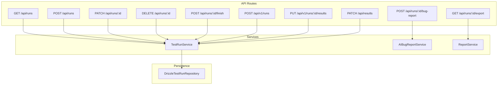
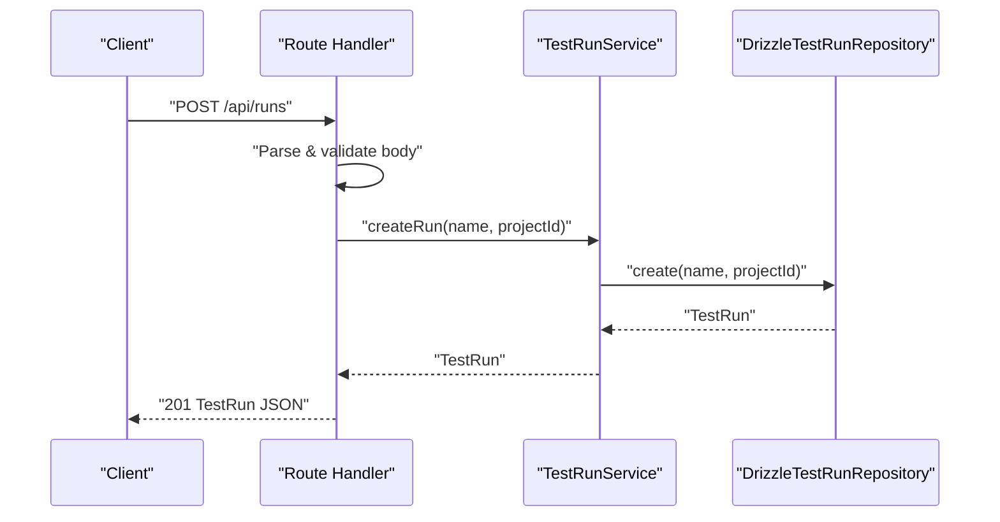
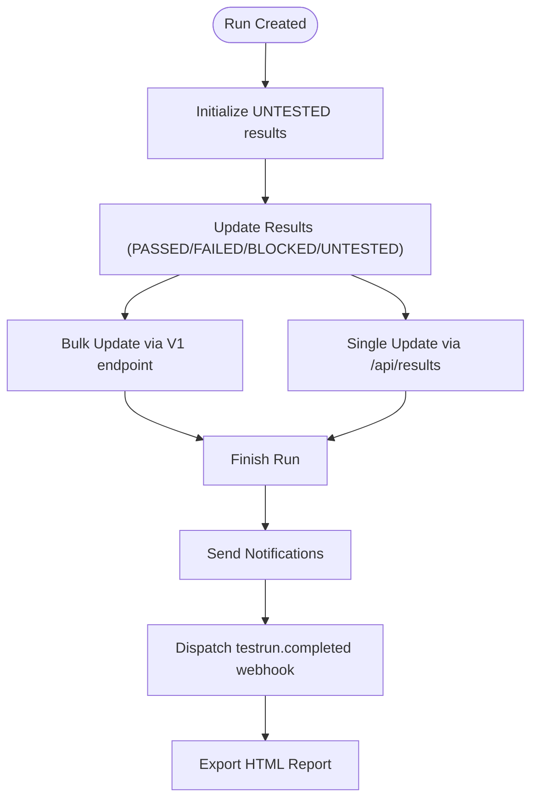
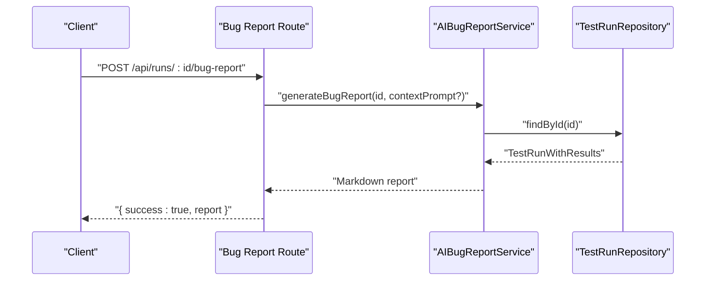
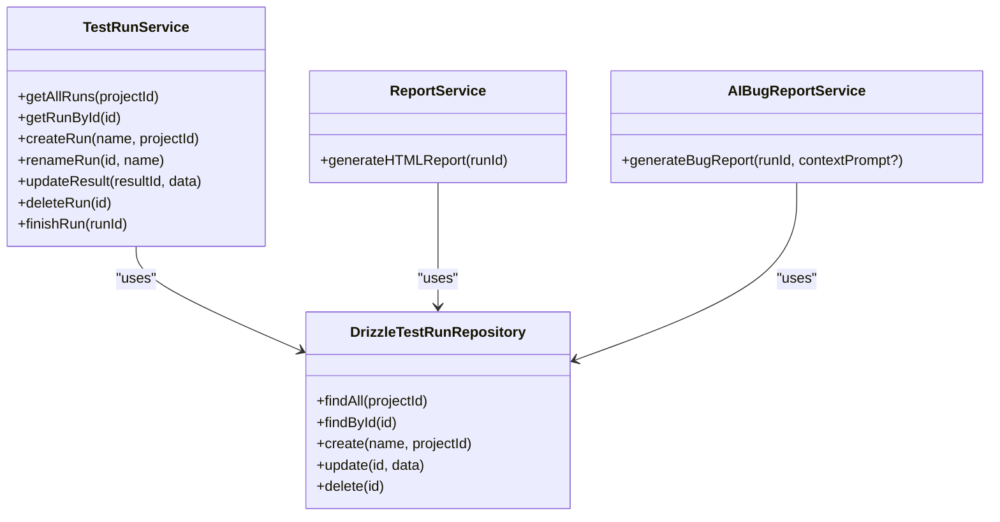

# Test Run Management API

<cite>
**Referenced Files in This Document**
- [app/api/runs/route.ts](file://app/api/runs/route.ts)
- [app/api/runs/[id]/route.ts](file://app/api/runs/[id]/route.ts)
- [app/api/runs/[id]/finish/route.ts](file://app/api/runs/[id]/finish/route.ts)
- [app/api/runs/[id]/export/route.ts](file://app/api/runs/[id]/export/route.ts)
- [app/api/runs/[id]/bug-report/route.ts](file://app/api/runs/[id]/bug-report/route.ts)
- [app/api/v1/runs/route.ts](file://app/api/v1/runs/route.ts)
- [app/api/v1/runs/[id]/results/route.ts](file://app/api/v1/runs/[id]/results/route.ts)
- [app/api/results/route.ts](file://app/api/results/route.ts)
- [app/api/_lib/schemas.ts](file://app/api/_lib/schemas.ts)
- [app/api/_lib/withApiHandler.ts](file://app/api/_lib/withApiHandler.ts)
- [src/domain/services/TestRunService.ts](file://src/domain/services/TestRunService.ts)
- [src/domain/services/AIBugReportService.ts](file://src/domain/services/AIBugReportService.ts)
- [src/domain/services/ReportService.ts](file://src/domain/services/ReportService.ts)
- [src/adapters/persistence/drizzle/DrizzleTestRunRepository.ts](file://src/adapters/persistence/drizzle/DrizzleTestRunRepository.ts)
- [src/domain/types/index.ts](file://src/domain/types/index.ts)
</cite>

## Table of Contents
1. [Introduction](#introduction)
2. [Project Structure](#project-structure)
3. [Core Components](#core-components)
4. [Architecture Overview](#architecture-overview)
5. [Detailed Component Analysis](#detailed-component-analysis)
6. [Dependency Analysis](#dependency-analysis)
7. [Performance Considerations](#performance-considerations)
8. [Troubleshooting Guide](#troubleshooting-guide)
9. [Conclusion](#conclusion)
10. [Appendices](#appendices)

## Introduction
This document describes the Test Run Management API, covering lifecycle endpoints for creating, updating, completing, exporting, and generating AI-powered bug reports for test runs. It documents HTTP methods, URL patterns, request/response schemas, parameter specifications, error handling, status codes, and practical usage examples with curl and JavaScript fetch.

## Project Structure
The API surface for test run management is organized under:
- Legacy routes: app/api/runs and app/api/runs/[id]
- V1 external integration routes: app/api/v1/runs and app/api/v1/runs/[id]/results
- Result update endpoints: app/api/results
- AI bug report endpoint: app/api/runs/[id]/bug-report
- Export endpoint: app/api/runs/[id]/export
- Shared validation and error handling: app/api/_lib/schemas.ts and app/api/_lib/withApiHandler.ts
- Domain services: src/domain/services/TestRunService.ts, AIBugReportService.ts, ReportService.ts
- Persistence: DrizzleTestRunRepository.ts
- Data types: src/domain/types/index.ts

**Diagram sources**
- [app/api/runs/route.ts:1-26](file://app/api/runs/route.ts#L1-L26)
- [app/api/runs/[id]/route.ts:1-27](file://app/api/runs/[id]/route.ts#L1-L27)
- [app/api/runs/[id]/finish/route.ts:1-15](file://app/api/runs/[id]/finish/route.ts#L1-L15)
- [app/api/runs/[id]/export/route.ts:1-20](file://app/api/runs/[id]/export/route.ts#L1-L20)
- [app/api/runs/[id]/bug-report/route.ts:1-19](file://app/api/runs/[id]/bug-report/route.ts#L1-L19)
- [app/api/v1/runs/route.ts:1-28](file://app/api/v1/runs/route.ts#L1-L28)
- [app/api/v1/runs/[id]/results/route.ts:1-59](file://app/api/v1/runs/[id]/results/route.ts#L1-L59)
- [app/api/results/route.ts:1-19](file://app/api/results/route.ts#L1-L19)
- [src/domain/services/TestRunService.ts:1-125](file://src/domain/services/TestRunService.ts#L1-L125)
- [src/domain/services/AIBugReportService.ts:1-70](file://src/domain/services/AIBugReportService.ts#L1-L70)
- [src/domain/services/ReportService.ts:1-110](file://src/domain/services/ReportService.ts#L1-L110)
- [src/adapters/persistence/drizzle/DrizzleTestRunRepository.ts:1-96](file://src/adapters/persistence/drizzle/DrizzleTestRunRepository.ts#L1-L96)

**Section sources**
- [app/api/runs/route.ts:1-26](file://app/api/runs/route.ts#L1-L26)
- [app/api/runs/[id]/route.ts:1-27](file://app/api/runs/[id]/route.ts#L1-L27)
- [app/api/runs/[id]/finish/route.ts:1-15](file://app/api/runs/[id]/finish/route.ts#L1-L15)
- [app/api/runs/[id]/export/route.ts:1-20](file://app/api/runs/[id]/export/route.ts#L1-L20)
- [app/api/runs/[id]/bug-report/route.ts:1-19](file://app/api/runs/[id]/bug-report/route.ts#L1-L19)
- [app/api/v1/runs/route.ts:1-28](file://app/api/v1/runs/route.ts#L1-L28)
- [app/api/v1/runs/[id]/results/route.ts:1-59](file://app/api/v1/runs/[id]/results/route.ts#L1-L59)
- [app/api/results/route.ts:1-19](file://app/api/results/route.ts#L1-L19)
- [app/api/_lib/schemas.ts:1-92](file://app/api/_lib/schemas.ts#L1-L92)
- [app/api/_lib/withApiHandler.ts:1-65](file://app/api/_lib/withApiHandler.ts#L1-L65)
- [src/domain/services/TestRunService.ts:1-125](file://src/domain/services/TestRunService.ts#L1-L125)
- [src/domain/services/AIBugReportService.ts:1-70](file://src/domain/services/AIBugReportService.ts#L1-L70)
- [src/domain/services/ReportService.ts:1-110](file://src/domain/services/ReportService.ts#L1-L110)
- [src/adapters/persistence/drizzle/DrizzleTestRunRepository.ts:1-96](file://src/adapters/persistence/drizzle/DrizzleTestRunRepository.ts#L1-L96)
- [src/domain/types/index.ts:1-196](file://src/domain/types/index.ts#L1-L196)

## Core Components
- TestRunService: Orchestrates run lifecycle, result updates, notifications, webhooks, and completion analytics.
- DrizzleTestRunRepository: Persists and retrieves runs, aggregates results with test cases and attachments.
- ReportService: Generates HTML reports for runs.
- AIBugReportService: Produces Markdown bug reports from failed/blocked results using an LLM provider.
- Validation and error handling: Zod schemas and withApiHandler wrapper unify validation, domain error mapping, and standardized error responses.

Key data types:
- TestRun, TestResult, TestRunWithResults, UpdateResultDTO, RunStats, TestStatus.

**Section sources**
- [src/domain/services/TestRunService.ts:1-125](file://src/domain/services/TestRunService.ts#L1-L125)
- [src/adapters/persistence/drizzle/DrizzleTestRunRepository.ts:1-96](file://src/adapters/persistence/drizzle/DrizzleTestRunRepository.ts#L1-L96)
- [src/domain/services/ReportService.ts:1-110](file://src/domain/services/ReportService.ts#L1-L110)
- [src/domain/services/AIBugReportService.ts:1-70](file://src/domain/services/AIBugReportService.ts#L1-L70)
- [src/domain/types/index.ts:1-196](file://src/domain/types/index.ts#L1-L196)

## Architecture Overview
The API follows a layered architecture:
- Route handlers validate input via Zod, delegate to services, and return JSON responses.
- Services encapsulate business logic and coordinate repositories and external integrations.
- Repositories abstract persistence and expose typed operations.
- Error handling is centralized through withApiHandler.

**Diagram sources**
- [app/api/runs/route.ts:20-25](file://app/api/runs/route.ts#L20-L25)
- [src/domain/services/TestRunService.ts:33-51](file://src/domain/services/TestRunService.ts#L33-L51)
- [src/adapters/persistence/drizzle/DrizzleTestRunRepository.ts:70-80](file://src/adapters/persistence/drizzle/DrizzleTestRunRepository.ts#L70-L80)

## Detailed Component Analysis

### Endpoint Catalog

- GET /api/runs
  - Purpose: List runs for a project.
  - Query parameters:
    - projectId (required): string
  - Responses:
    - 200 OK: Array of TestRun objects.
    - 400 Bad Request: Validation error if projectId missing.
  - Example:
    - curl: curl -s "https://example.com/api/runs?projectId=proj-123"
    - fetch: fetch("/api/runs?projectId=proj-123").then(r => r.json())

- POST /api/runs
  - Purpose: Create a new test run.
  - Request body (JSON):
    - name (required): string
    - projectId (required): string
  - Responses:
    - 201 Created: TestRun object.
    - 400 Bad Request: Validation error.
  - Example:
    - curl: curl -s -X POST -H "Content-Type: application/json" -d '{"name":"Regression","projectId":"proj-123"}' https://example.com/api/runs
    - fetch: fetch("/api/runs", { method: "POST", body: JSON.stringify({name:"Regression", projectId:"proj-123"}) })

- PATCH /api/runs/:id
  - Purpose: Rename a run.
  - Path parameters:
    - id (required): string
  - Request body (JSON):
    - name (required): string
  - Responses:
    - 200 OK: Updated TestRun object.
    - 400 Bad Request: Validation error.
    - 404 Not Found: Run not found.
  - Example:
    - curl: curl -s -X PATCH -H "Content-Type: application/json" -d '{"name":"Updated Name"}' https://example.com/api/runs/run-456
    - fetch: fetch("/api/runs/run-456", { method: "PATCH", body: JSON.stringify({name:"Updated Name"}) })

- DELETE /api/runs/:id
  - Purpose: Delete a run.
  - Path parameters:
    - id (required): string
  - Responses:
    - 204 No Content: Success.
    - 404 Not Found: Run not found.
  - Example:
    - curl: curl -s -X DELETE https://example.com/api/runs/run-456
    - fetch: fetch("/api/runs/run-456", { method: "DELETE" })

- POST /api/runs/:id/finish
  - Purpose: Mark run as completed and compute stats.
  - Path parameters:
    - id (required): string
  - Responses:
    - 200 OK: { success: true }.
    - 404 Not Found: Run not found.
  - Behavior:
    - Calculates totals and severity (error/success/warning).
    - Triggers notifications and webhook dispatch.
  - Example:
    - curl: curl -s -X POST https://example.com/api/runs/run-456/finish
    - fetch: fetch("/api/runs/run-456/finish", { method: "POST" })

- GET /api/runs/:id/export
  - Purpose: Download an HTML report for the run.
  - Path parameters:
    - id (required): string
  - Responses:
    - 200 OK: text/html; Content-Disposition attachment.
    - 404 Not Found: Run not found.
  - Example:
    - curl: curl -s -o report.html "https://example.com/api/runs/run-456/export"
    - fetch: fetch("/api/runs/run-456/export").then(r => r.blob())

- POST /api/runs/:id/bug-report
  - Purpose: Generate a Markdown bug report from failed/blocked results.
  - Path parameters:
    - id (required): string
  - Request body (JSON):
    - contextPrompt (optional): string
  - Responses:
    - 200 OK: { success: true, report: string }.
    - 404 Not Found: Run not found.
  - Example:
    - curl: curl -s -X POST -H "Content-Type: application/json" -d '{}' https://example.com/api/runs/run-456/bug-report
    - fetch: fetch("/api/runs/run-456/bug-report", { method: "POST", body: JSON.stringify({}) })

- POST /api/v1/runs (external CI)
  - Purpose: Create a run for CI/automation.
  - Request body (JSON):
    - name (required): string
    - projectId (required): string
  - Responses:
    - 201 Created: { success: true, run: { id, name, url } }.
  - Example:
    - curl: curl -s -X POST -H "Content-Type: application/json" -d '{"name":"CI Run","projectId":"proj-123"}' https://example.com/api/v1/runs
    - fetch: fetch("/api/v1/runs", { method: "POST", body: JSON.stringify({name:"CI Run", projectId:"proj-123"}) })

- PUT /api/v1/runs/:id/results (bulk result updates)
  - Purpose: Update results for multiple test cases by testId.
  - Path parameters:
    - id (required): string
  - Request body (JSON):
    - results (required): array of items with:
      - testId (required): string
      - status (required): "PASSED" | "FAILED" | "BLOCKED" | "UNTESTED"
      - notes (optional): string
  - Responses:
    - 200 OK: { success: true, message: string, errors?: string[] }.
    - 400 Bad Request: Validation error (e.g., results not an array).
    - 404 Not Found: Run not found.
  - Example:
    - curl: curl -s -X PUT -H "Content-Type: application/json" -d '{"results":[{"testId":"TC-001","status":"FAILED","notes":"Step X failed"},{"testId":"TC-002","status":"PASSED"}]}' https://example.com/api/v1/runs/run-456/results
    - fetch: fetch("/api/v1/runs/run-456/results", { method: "PUT", body: JSON.stringify({ results: [...] }) })

- PATCH /api/results (single result update)
  - Purpose: Update a single result by resultId.
  - Request body (JSON):
    - resultId (required): string
    - status (optional): "PASSED" | "FAILED" | "BLOCKED" | "UNTESTED"
    - notes (optional): string
  - Responses:
    - 200 OK: Updated TestResult object.
    - 400 Bad Request: Validation error.
    - 404 Not Found: Result not found.
  - Example:
    - curl: curl -s -X PATCH -H "Content-Type: application/json" -d '{"resultId":"res-789","status":"BLOCKED","notes":"Waiting on API"}' https://example.com/api/results
    - fetch: fetch("/api/results", { method: "PATCH", body: JSON.stringify({ resultId:"res-789", status:"BLOCKED", notes:"Waiting on API" }) })

### Request/Response Schemas

- Validation schemas (Zod):
  - createRunSchema: { name: string, projectId: string }
  - renameRunSchema: { name: string }
  - updateResultSchema: { resultId: string, status: enum?, notes: string? }
  - generateBugReportSchema: { contextPrompt: string? }

- Data types:
  - TestStatus: "PASSED" | "FAILED" | "BLOCKED" | "UNTESTED"
  - TestRun: { id, name, createdAt, projectId, testResults? }
  - TestResult: { id, status, notes, testRunId, testCaseId, testCase?, attachments? }
  - TestRunWithResults: TestRun with aggregated testResults
  - UpdateResultDTO: { status?, notes? }
  - RunStats: { passed, failed, blocked, untested, total }

**Section sources**
- [app/api/_lib/schemas.ts:12-62](file://app/api/_lib/schemas.ts#L12-L62)
- [src/domain/types/index.ts:3-51](file://src/domain/types/index.ts#L3-L51)
- [src/domain/types/index.ts:179-184](file://src/domain/types/index.ts#L179-L184)

### Error Handling and Status Codes
Centralized error handling via withApiHandler:
- Zod validation errors → 400 with details
- Domain errors (e.g., NotFoundError) → mapped HTTP status
- Other errors → 500 Internal Server Error
- Standard error shape: { error: string, code: string, details?: Record }

Common HTTP codes:
- 200 OK: Successful GET/PUT/PATCH/POST
- 201 Created: New run created
- 204 No Content: Successful deletion
- 400 Bad Request: Validation failures
- 404 Not Found: Resource not found
- 500 Internal Server Error: Unexpected server error

**Section sources**
- [app/api/_lib/withApiHandler.ts:22-64](file://app/api/_lib/withApiHandler.ts#L22-L64)
- [src/domain/services/TestRunService.ts:29](file://src/domain/services/TestRunService.ts#L29)
- [src/domain/services/AIBugReportService.ts:18](file://src/domain/services/AIBugReportService.ts#L18)

### Run State Management and Progress Tracking
- Creation: Creates a run and initializes UNTESTED results for all test cases in the project.
- Renaming: Updates run name and emits webhook.
- Deletion: Removes run and emits webhook.
- Completion: Computes totals and severity, triggers notifications and webhook.
- Progress: Aggregated stats exposed via HTML export and run retrieval.

**Diagram sources**
- [src/domain/services/TestRunService.ts:33-51](file://src/domain/services/TestRunService.ts#L33-L51)
- [app/api/v1/runs/[id]/results/route.ts:12-58](file://app/api/v1/runs/[id]/results/route.ts#L12-L58)
- [app/api/results/route.ts:8-18](file://app/api/results/route.ts#L8-L18)
- [src/domain/services/TestRunService.ts:86-123](file://src/domain/services/TestRunService.ts#L86-L123)
- [app/api/runs/[id]/export/route.ts:6-19](file://app/api/runs/[id]/export/route.ts#L6-L19)

### AI Integration Endpoints
- POST /api/runs/:id/bug-report
  - Uses AIBugReportService to analyze failed/blocked results and generate a Markdown report via an LLM provider.
  - Emits 404 if run not found.
  - Returns { success: true, report: string }.

**Diagram sources**
- [app/api/runs/[id]/bug-report/route.ts:8-18](file://app/api/runs/[id]/bug-report/route.ts#L8-L18)
- [src/domain/services/AIBugReportService.ts:16-68](file://src/domain/services/AIBugReportService.ts#L16-L68)
- [src/adapters/persistence/drizzle/DrizzleTestRunRepository.ts:16-67](file://src/adapters/persistence/drizzle/DrizzleTestRunRepository.ts#L16-L67)

## Dependency Analysis
- Route handlers depend on services and shared validation.
- TestRunService depends on repositories and external integrations (notifiers/webhooks).
- ReportService and AIBugReportService depend on repositories and LLM provider factory.
- DrizzleTestRunRepository builds enriched TestRunWithResults with nested results, test cases, modules, and attachments.

**Diagram sources**
- [src/domain/services/TestRunService.ts:14-125](file://src/domain/services/TestRunService.ts#L14-L125)
- [src/adapters/persistence/drizzle/DrizzleTestRunRepository.ts:7-96](file://src/adapters/persistence/drizzle/DrizzleTestRunRepository.ts#L7-L96)
- [src/domain/services/ReportService.ts:9-110](file://src/domain/services/ReportService.ts#L9-L110)
- [src/domain/services/AIBugReportService.ts:10-70](file://src/domain/services/AIBugReportService.ts#L10-L70)

**Section sources**
- [src/domain/services/TestRunService.ts:14-125](file://src/domain/services/TestRunService.ts#L14-L125)
- [src/adapters/persistence/drizzle/DrizzleTestRunRepository.ts:7-96](file://src/adapters/persistence/drizzle/DrizzleTestRunRepository.ts#L7-L96)
- [src/domain/services/ReportService.ts:9-110](file://src/domain/services/ReportService.ts#L9-L110)
- [src/domain/services/AIBugReportService.ts:10-70](file://src/domain/services/AIBugReportService.ts#L10-L70)

## Performance Considerations
- Bulk result updates (V1) iterate through provided results and match against run.testResults by testId. Prefer batching to minimize round trips.
- Export generates HTML server-side; consider caching for repeated downloads.
- Notification dispatch occurs during finish; ensure notifier availability to avoid delays.
- Repository queries join results with test cases and modules; keep projectId filters and limit result sets where appropriate.

[No sources needed since this section provides general guidance]

## Troubleshooting Guide
- Validation errors:
  - Ensure required fields (name, projectId, resultId, status) are present and correctly typed.
  - For bulk updates, confirm results is an array of objects with testId and status.
- Not found errors:
  - Verify runId exists before calling finish, export, bug-report, or V1 results update.
- Status transitions:
  - Allowed values: PASSED, FAILED, BLOCKED, UNTESTED.
  - Notes are optional; they can be omitted or set to null.
- Error response format:
  - Expect { error, code, details? } with appropriate HTTP status.

**Section sources**
- [app/api/_lib/withApiHandler.ts:22-64](file://app/api/_lib/withApiHandler.ts#L22-L64)
- [app/api/v1/runs/[id]/results/route.ts:20-25](file://app/api/v1/runs/[id]/results/route.ts#L20-L25)
- [src/domain/services/TestRunService.ts:29](file://src/domain/services/TestRunService.ts#L29)

## Conclusion
The Test Run Management API provides a complete lifecycle for managing test runs, including creation, renaming, deletion, result updates, completion, export, and AI-powered bug reporting. It leverages robust validation, centralized error handling, and service-layer orchestration to support both UI and CI/automation integrations.

[No sources needed since this section summarizes without analyzing specific files]

## Appendices

### Practical Examples

- List runs
  - curl: curl -s "https://example.com/api/runs?projectId=proj-123"
  - fetch: fetch("/api/runs?projectId=proj-123").then(r => r.json())

- Create run
  - curl: curl -s -X POST -H "Content-Type: application/json" -d '{"name":"Regression","projectId":"proj-123"}' https://example.com/api/runs
  - fetch: fetch("/api/runs", { method: "POST", body: JSON.stringify({name:"Regression", projectId:"proj-123"}) })

- Rename run
  - curl: curl -s -X PATCH -H "Content-Type: application/json" -d '{"name":"Updated Name"}' https://example.com/api/runs/run-456
  - fetch: fetch("/api/runs/run-456", { method: "PATCH", body: JSON.stringify({name:"Updated Name"}) })

- Delete run
  - curl: curl -s -X DELETE https://example.com/api/runs/run-456
  - fetch: fetch("/api/runs/run-456", { method: "DELETE" })

- Finish run
  - curl: curl -s -X POST https://example.com/api/runs/run-456/finish
  - fetch: fetch("/api/runs/run-456/finish", { method: "POST" })

- Export report
  - curl: curl -s -o report.html "https://example.com/api/runs/run-456/export"
  - fetch: fetch("/api/runs/run-456/export").then(r => r.blob())

- Generate bug report
  - curl: curl -s -X POST -H "Content-Type: application/json" -d '{}' https://example.com/api/runs/run-456/bug-report
  - fetch: fetch("/api/runs/run-456/bug-report", { method: "POST", body: JSON.stringify({}) })

- Create run (CI)
  - curl: curl -s -X POST -H "Content-Type: application/json" -d '{"name":"CI Run","projectId":"proj-123"}' https://example.com/api/v1/runs
  - fetch: fetch("/api/v1/runs", { method: "POST", body: JSON.stringify({name:"CI Run", projectId:"proj-123"}) })

- Bulk result updates (CI)
  - curl: curl -s -X PUT -H "Content-Type: application/json" -d '{"results":[{"testId":"TC-001","status":"FAILED","notes":"Step X failed"},{"testId":"TC-002","status":"PASSED"}]}' https://example.com/api/v1/runs/run-456/results
  - fetch: fetch("/api/v1/runs/run-456/results", { method: "PUT", body: JSON.stringify({ results: [...] }) })

- Single result update
  - curl: curl -s -X PATCH -H "Content-Type: application/json" -d '{"resultId":"res-789","status":"BLOCKED","notes":"Waiting on API"}' https://example.com/api/results
  - fetch: fetch("/api/results", { method: "PATCH", body: JSON.stringify({ resultId:"res-789", status:"BLOCKED", notes:"Waiting on API" }) })