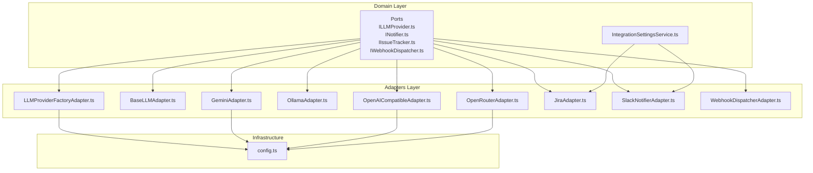
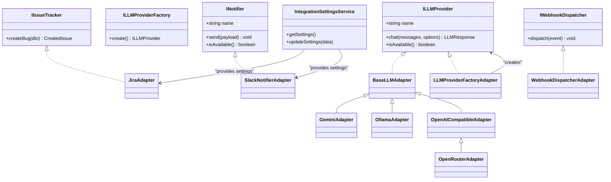
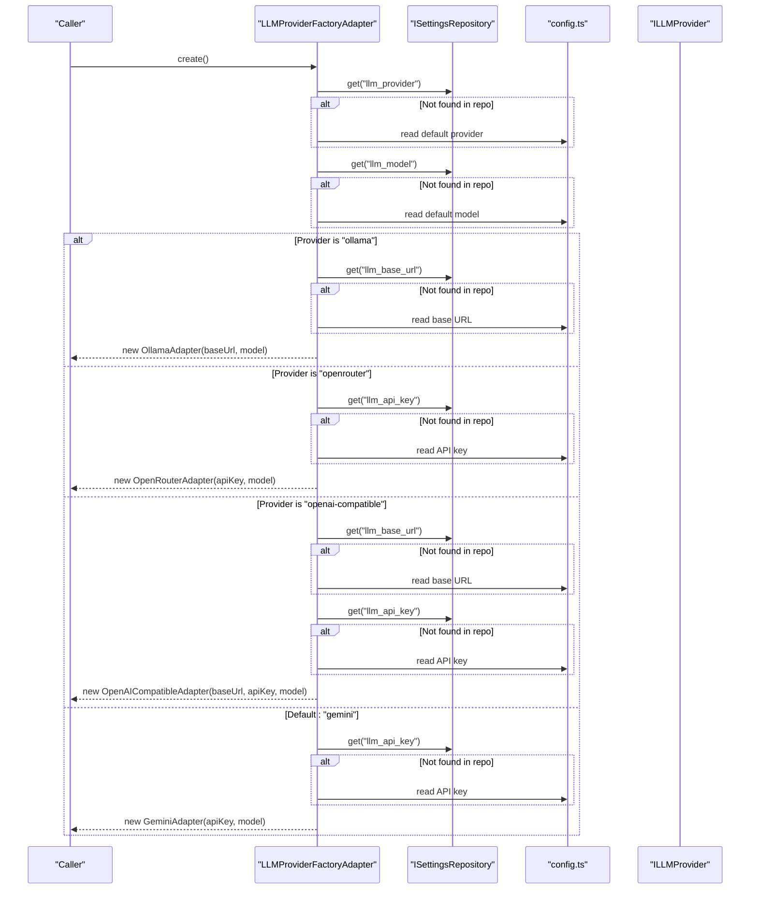
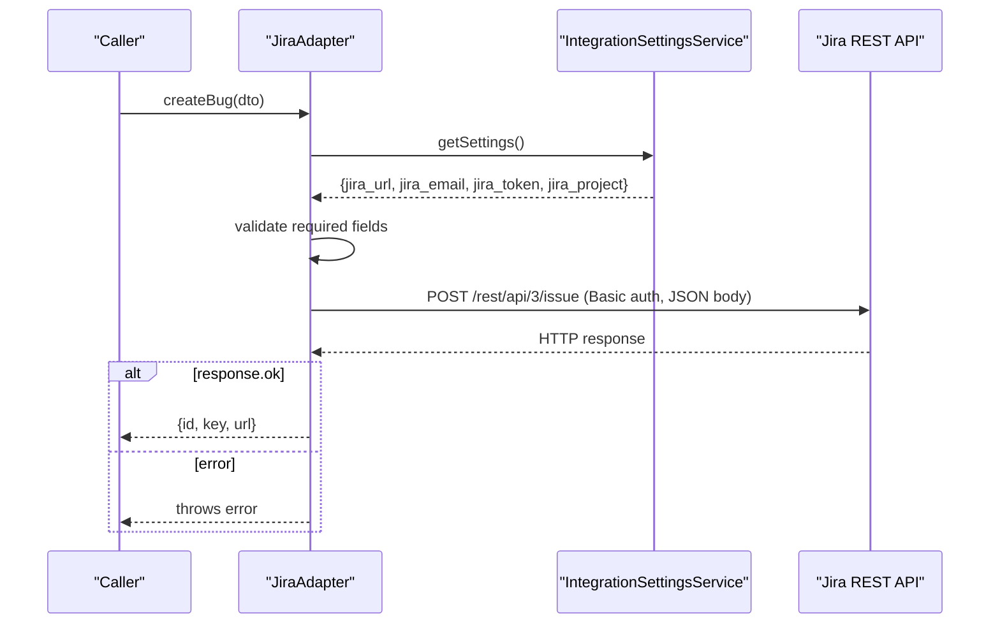
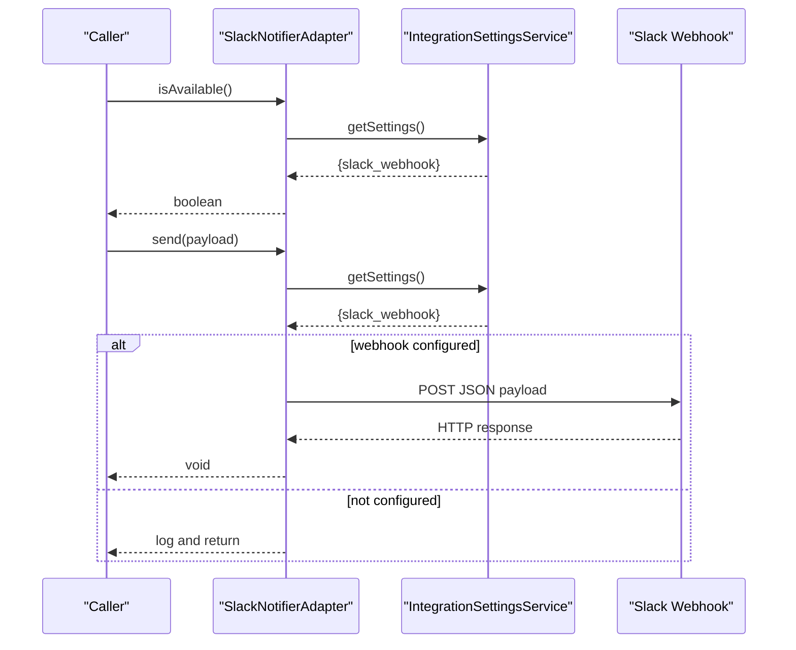
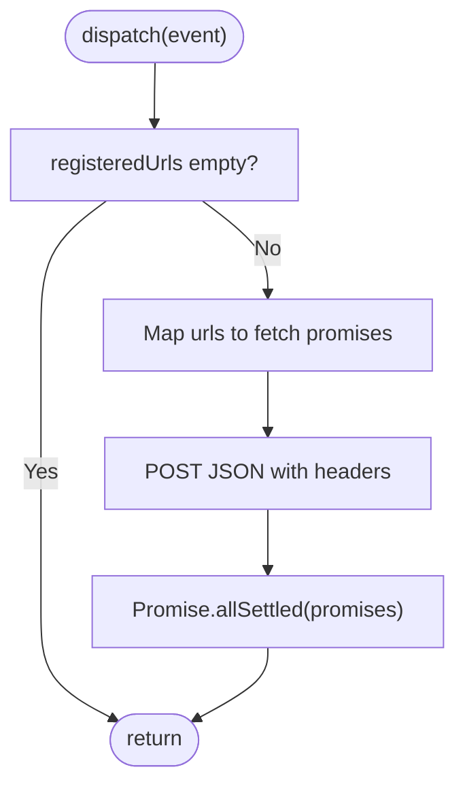
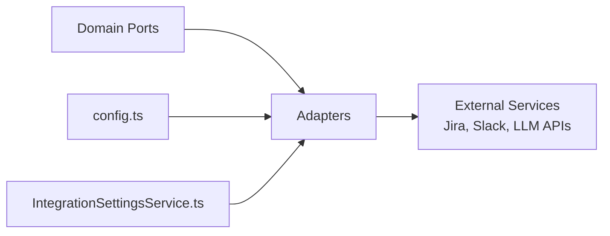

# Adapter Pattern and External Integrations

<cite>
**Referenced Files in This Document**
- [index.ts](file://src/domain/ports/index.ts)
- [ILLMProvider.ts](file://src/domain/ports/ILLMProvider.ts)
- [ILLMProviderFactory.ts](file://src/domain/ports/ILLMProviderFactory.ts)
- [INotifier.ts](file://src/domain/ports/INotifier.ts)
- [IIssueTracker.ts](file://src/domain/ports/IIssueTracker.ts)
- [IWebhookDispatcher.ts](file://src/domain/ports/IWebhookDispatcher.ts)
- [BaseLLMAdapter.ts](file://src/adapters/llm/BaseLLMAdapter.ts)
- [LLMProviderFactoryAdapter.ts](file://src/adapters/llm/LLMProviderFactoryAdapter.ts)
- [GeminiAdapter.ts](file://src/adapters/llm/GeminiAdapter.ts)
- [OllamaAdapter.ts](file://src/adapters/llm/OllamaAdapter.ts)
- [OpenAICompatibleAdapter.ts](file://src/adapters/llm/OpenAICompatibleAdapter.ts)
- [OpenRouterAdapter.ts](file://src/adapters/llm/OpenRouterAdapter.ts)
- [JiraAdapter.ts](file://src/adapters/issue-tracker/JiraAdapter.ts)
- [SlackNotifierAdapter.ts](file://src/adapters/notifier/SlackNotifierAdapter.ts)
- [WebhookDispatcherAdapter.ts](file://src/adapters/webhook/WebhookDispatcherAdapter.ts)
- [IntegrationSettingsService.ts](file://src/domain/services/IntegrationSettingsService.ts)
- [config.ts](file://src/infrastructure/config.ts)
</cite>

## Table of Contents
1. [Introduction](#introduction)
2. [Project Structure](#project-structure)
3. [Core Components](#core-components)
4. [Architecture Overview](#architecture-overview)
5. [Detailed Component Analysis](#detailed-component-analysis)
6. [Dependency Analysis](#dependency-analysis)
7. [Performance Considerations](#performance-considerations)
8. [Troubleshooting Guide](#troubleshooting-guide)
9. [Conclusion](#conclusion)

## Introduction
This document explains how the adapter pattern is used to integrate external services while keeping the domain layer decoupled from concrete implementations. It focuses on:
- Abstraction ports defined in the domain layer for LLM providers, issue trackers, notifiers, and webhooks
- Concrete adapter implementations in the adapters layer
- The factory pattern for dynamic LLM provider instantiation
- Configuration and authentication handling
- Error handling strategies and integration patterns
- How this design enables pluggable integrations and extensibility

## Project Structure
The adapter pattern is implemented across three layers:
- Domain: Ports and services that define contracts and orchestrate integrations
- Adapters: Concrete implementations of ports that talk to external services
- Infrastructure: Configuration and repositories that supply runtime settings

**Diagram sources**
- [index.ts:1-19](file://src/domain/ports/index.ts#L1-L19)
- [LLMProviderFactoryAdapter.ts:1-43](file://src/adapters/llm/LLMProviderFactoryAdapter.ts#L1-L43)
- [BaseLLMAdapter.ts:1-26](file://src/adapters/llm/BaseLLMAdapter.ts#L1-L26)
- [GeminiAdapter.ts:1-67](file://src/adapters/llm/GeminiAdapter.ts#L1-L67)
- [OllamaAdapter.ts:1-70](file://src/adapters/llm/OllamaAdapter.ts#L1-L70)
- [OpenAICompatibleAdapter.ts:1-97](file://src/adapters/llm/OpenAICompatibleAdapter.ts#L1-L97)
- [OpenRouterAdapter.ts:1-28](file://src/adapters/llm/OpenRouterAdapter.ts#L1-L28)
- [JiraAdapter.ts:1-82](file://src/adapters/issue-tracker/JiraAdapter.ts#L1-L82)
- [SlackNotifierAdapter.ts:1-56](file://src/adapters/notifier/SlackNotifierAdapter.ts#L1-L56)
- [WebhookDispatcherAdapter.ts:1-38](file://src/adapters/webhook/WebhookDispatcherAdapter.ts#L1-L38)
- [IntegrationSettingsService.ts:1-37](file://src/domain/services/IntegrationSettingsService.ts#L1-L37)
- [config.ts:1-28](file://src/infrastructure/config.ts#L1-L28)

**Section sources**
- [index.ts:1-19](file://src/domain/ports/index.ts#L1-L19)
- [config.ts:1-28](file://src/infrastructure/config.ts#L1-L28)

## Core Components
- LLM Provider abstractions
  - Port: ILLMProvider defines a unified contract for chatting with LLMs and availability checks
  - Factory: ILLMProviderFactory abstracts construction of LLM providers
  - Base adapter: BaseLLMAdapter provides shared helpers for message formatting and common behavior
  - Concrete adapters: GeminiAdapter, OllamaAdapter, OpenAICompatibleAdapter, OpenRouterAdapter
- Issue Tracker abstraction
  - Port: IIssueTracker defines creating bugs/issues
  - Adapter: JiraAdapter integrates with Jira via REST API using credentials from settings
- Notifier abstraction
  - Port: INotifier defines sending notifications and availability checks
  - Adapter: SlackNotifierAdapter posts to Slack webhooks using settings
- Webhook dispatcher abstraction
  - Port: IWebhookDispatcher defines dispatching events via HTTP
  - Adapter: WebhookDispatcherAdapter performs HTTP POST to registered URLs
- Settings orchestration
  - IntegrationSettingsService retrieves and updates integration settings used by adapters

**Section sources**
- [ILLMProvider.ts:1-32](file://src/domain/ports/ILLMProvider.ts#L1-L32)
- [ILLMProviderFactory.ts:1-11](file://src/domain/ports/ILLMProviderFactory.ts#L1-L11)
- [BaseLLMAdapter.ts:1-26](file://src/adapters/llm/BaseLLMAdapter.ts#L1-L26)
- [GeminiAdapter.ts:1-67](file://src/adapters/llm/GeminiAdapter.ts#L1-L67)
- [OllamaAdapter.ts:1-70](file://src/adapters/llm/OllamaAdapter.ts#L1-L70)
- [OpenAICompatibleAdapter.ts:1-97](file://src/adapters/llm/OpenAICompatibleAdapter.ts#L1-L97)
- [OpenRouterAdapter.ts:1-28](file://src/adapters/llm/OpenRouterAdapter.ts#L1-L28)
- [IIssueTracker.ts:1-16](file://src/domain/ports/IIssueTracker.ts#L1-L16)
- [JiraAdapter.ts:1-82](file://src/adapters/issue-tracker/JiraAdapter.ts#L1-L82)
- [INotifier.ts:1-27](file://src/domain/ports/INotifier.ts#L1-L27)
- [SlackNotifierAdapter.ts:1-56](file://src/adapters/notifier/SlackNotifierAdapter.ts#L1-L56)
- [IWebhookDispatcher.ts:1-21](file://src/domain/ports/IWebhookDispatcher.ts#L1-L21)
- [WebhookDispatcherAdapter.ts:1-38](file://src/adapters/webhook/WebhookDispatcherAdapter.ts#L1-L38)
- [IntegrationSettingsService.ts:1-37](file://src/domain/services/IntegrationSettingsService.ts#L1-L37)

## Architecture Overview
The domain layer defines ports and services. The adapters layer implements these ports and interacts with external systems. Configuration and persisted settings are injected via infrastructure and repositories.

**Diagram sources**
- [ILLMProvider.ts:12-31](file://src/domain/ports/ILLMProvider.ts#L12-L31)
- [ILLMProviderFactory.ts:8-10](file://src/domain/ports/ILLMProviderFactory.ts#L8-L10)
- [BaseLLMAdapter.ts:3-25](file://src/adapters/llm/BaseLLMAdapter.ts#L3-L25)
- [GeminiAdapter.ts:5-66](file://src/adapters/llm/GeminiAdapter.ts#L5-L66)
- [OllamaAdapter.ts:4-68](file://src/adapters/llm/OllamaAdapter.ts#L4-L68)
- [OpenAICompatibleAdapter.ts:8-95](file://src/adapters/llm/OpenAICompatibleAdapter.ts#L8-L95)
- [OpenRouterAdapter.ts:10-27](file://src/adapters/llm/OpenRouterAdapter.ts#L10-L27)
- [IIssueTracker.ts:13-15](file://src/domain/ports/IIssueTracker.ts#L13-L15)
- [JiraAdapter.ts:4-81](file://src/adapters/issue-tracker/JiraAdapter.ts#L4-L81)
- [INotifier.ts:17-26](file://src/domain/ports/INotifier.ts#L17-L26)
- [SlackNotifierAdapter.ts:4-55](file://src/adapters/notifier/SlackNotifierAdapter.ts#L4-L55)
- [IWebhookDispatcher.ts:18-20](file://src/domain/ports/IWebhookDispatcher.ts#L18-L20)
- [WebhookDispatcherAdapter.ts:11-37](file://src/adapters/webhook/WebhookDispatcherAdapter.ts#L11-L37)
- [IntegrationSettingsService.ts:8-36](file://src/domain/services/IntegrationSettingsService.ts#L8-L36)
- [LLMProviderFactoryAdapter.ts:15-42](file://src/adapters/llm/LLMProviderFactoryAdapter.ts#L15-L42)

## Detailed Component Analysis

### LLM Provider Abstractions and Factory
- Port ILLMProvider defines a unified interface for chatting with LLMs and checking availability.
- BaseLLMAdapter provides shared helpers for formatting messages and common behavior.
- Concrete adapters:
  - GeminiAdapter: Uses a cloud SDK, handles initialization and content generation with error wrapping.
  - OllamaAdapter: Calls a local or remote Ollama API, validates model availability.
  - OpenAICompatibleAdapter: Generic OpenAI-compatible API support; includes response format and token usage.
  - OpenRouterAdapter: Extends compatibility adapter with extra headers required by the aggregator.
- Factory LLMProviderFactoryAdapter constructs the appropriate provider based on persisted settings or defaults from configuration.

**Diagram sources**
- [LLMProviderFactoryAdapter.ts:18-41](file://src/adapters/llm/LLMProviderFactoryAdapter.ts#L18-L41)
- [config.ts:13-18](file://src/infrastructure/config.ts#L13-L18)

**Section sources**
- [ILLMProvider.ts:12-31](file://src/domain/ports/ILLMProvider.ts#L12-L31)
- [BaseLLMAdapter.ts:3-25](file://src/adapters/llm/BaseLLMAdapter.ts#L3-L25)
- [GeminiAdapter.ts:5-66](file://src/adapters/llm/GeminiAdapter.ts#L5-L66)
- [OllamaAdapter.ts:4-68](file://src/adapters/llm/OllamaAdapter.ts#L4-L68)
- [OpenAICompatibleAdapter.ts:8-95](file://src/adapters/llm/OpenAICompatibleAdapter.ts#L8-L95)
- [OpenRouterAdapter.ts:10-27](file://src/adapters/llm/OpenRouterAdapter.ts#L10-L27)
- [LLMProviderFactoryAdapter.ts:15-42](file://src/adapters/llm/LLMProviderFactoryAdapter.ts#L15-L42)
- [config.ts:13-18](file://src/infrastructure/config.ts#L13-L18)

### Issue Tracker Integration (Jira)
- Port IIssueTracker defines creating bugs with a standardized DTO and response.
- JiraAdapter:
  - Reads settings from IntegrationSettingsService
  - Validates presence of required credentials and project key
  - Builds a Jira REST API request with Basic auth and ADF-formatted description
  - Handles HTTP errors and returns structured CreatedIssue

**Diagram sources**
- [JiraAdapter.ts:7-80](file://src/adapters/issue-tracker/JiraAdapter.ts#L7-L80)
- [IntegrationSettingsService.ts:11-17](file://src/domain/services/IntegrationSettingsService.ts#L11-L17)

**Section sources**
- [IIssueTracker.ts:13-15](file://src/domain/ports/IIssueTracker.ts#L13-L15)
- [JiraAdapter.ts:4-81](file://src/adapters/issue-tracker/JiraAdapter.ts#L4-L81)
- [IntegrationSettingsService.ts:8-36](file://src/domain/services/IntegrationSettingsService.ts#L8-L36)

### Notifier Integration (Slack)
- Port INotifier defines a channel-agnostic notification interface.
- SlackNotifierAdapter:
  - Uses IntegrationSettingsService to check and send notifications
  - Sends a formatted message to a Slack webhook URL
  - Provides availability check and logs failures without crashing

**Diagram sources**
- [SlackNotifierAdapter.ts:9-54](file://src/adapters/notifier/SlackNotifierAdapter.ts#L9-L54)
- [IntegrationSettingsService.ts:11-17](file://src/domain/services/IntegrationSettingsService.ts#L11-L17)

**Section sources**
- [INotifier.ts:17-26](file://src/domain/ports/INotifier.ts#L17-L26)
- [SlackNotifierAdapter.ts:4-55](file://src/adapters/notifier/SlackNotifierAdapter.ts#L4-L55)
- [IntegrationSettingsService.ts:8-36](file://src/domain/services/IntegrationSettingsService.ts#L8-L36)

### Webhook Dispatcher
- Port IWebhookDispatcher defines dispatching events to external systems.
- WebhookDispatcherAdapter:
  - Accepts a list of registered URLs
  - Sends HTTP POST requests with standardized headers and payload
  - Uses Promise.allSettled to avoid blocking on failures

**Diagram sources**
- [WebhookDispatcherAdapter.ts:14-36](file://src/adapters/webhook/WebhookDispatcherAdapter.ts#L14-L36)
- [IWebhookDispatcher.ts:18-20](file://src/domain/ports/IWebhookDispatcher.ts#L18-L20)

**Section sources**
- [IWebhookDispatcher.ts:18-20](file://src/domain/ports/IWebhookDispatcher.ts#L18-L20)
- [WebhookDispatcherAdapter.ts:11-37](file://src/adapters/webhook/WebhookDispatcherAdapter.ts#L11-L37)

### Configuration and Authentication
- Centralized configuration via config.ts consolidates environment variables for database, LLM defaults, storage, and app metadata.
- LLM provider factories and adapters read keys and endpoints from:
  - Persisted settings via IntegrationSettingsService
  - Defaults from config.ts
  - Environment variables as fallbacks in adapters (e.g., GeminiAdapter reads API keys from environment)
- Issue tracker and notifier adapters rely on IntegrationSettingsService to retrieve credentials and endpoints.

**Section sources**
- [config.ts:7-27](file://src/infrastructure/config.ts#L7-L27)
- [LLMProviderFactoryAdapter.ts:18-41](file://src/adapters/llm/LLMProviderFactoryAdapter.ts#L18-L41)
- [GeminiAdapter.ts:10-20](file://src/adapters/llm/GeminiAdapter.ts#L10-L20)
- [IntegrationSettingsService.ts:11-17](file://src/domain/services/IntegrationSettingsService.ts#L11-L17)

## Dependency Analysis
- Domain depends on ports only; no external libraries leak into the domain.
- Adapters depend on:
  - Domain ports for contracts
  - Infrastructure for configuration and settings
  - External SDKs or HTTP APIs for integrations
- Cohesion is strong within each adapter; coupling is limited to domain ports and minimal infrastructure dependencies.

**Diagram sources**
- [index.ts:1-19](file://src/domain/ports/index.ts#L1-L19)
- [config.ts:1-28](file://src/infrastructure/config.ts#L1-L28)
- [IntegrationSettingsService.ts:1-37](file://src/domain/services/IntegrationSettingsService.ts#L1-L37)
- [JiraAdapter.ts:1-82](file://src/adapters/issue-tracker/JiraAdapter.ts#L1-L82)
- [SlackNotifierAdapter.ts:1-56](file://src/adapters/notifier/SlackNotifierAdapter.ts#L1-L56)
- [GeminiAdapter.ts:1-67](file://src/adapters/llm/GeminiAdapter.ts#L1-L67)
- [OpenAICompatibleAdapter.ts:1-97](file://src/adapters/llm/OpenAICompatibleAdapter.ts#L1-L97)

**Section sources**
- [index.ts:1-19](file://src/domain/ports/index.ts#L1-L19)
- [config.ts:1-28](file://src/infrastructure/config.ts#L1-L28)
- [IntegrationSettingsService.ts:1-37](file://src/domain/services/IntegrationSettingsService.ts#L1-L37)

## Performance Considerations
- HTTP calls to external services are synchronous in adapters; consider:
  - Connection pooling and timeouts for frequent LLM calls
  - Caching responses when safe and appropriate
  - Backoff and retry strategies for transient failures
- Webhook dispatch uses Promise.allSettled to prevent one failing URL from blocking others.
- Availability checks (e.g., isAvailable) can be cached briefly to reduce repeated network calls.

## Troubleshooting Guide
- LLM provider initialization
  - GeminiAdapter requires a valid API key; ensure environment variables or settings are configured.
  - OllamaAdapter requires a reachable base URL and a locally present model; verify model tags endpoint and model name.
  - OpenAI-compatible adapters require Authorization headers when not using localhost; confirm base URL and API key.
- Jira integration
  - Verify required settings: URL, email, token, and project key; trailing slashes are normalized.
  - Inspect HTTP error responses from Jira for detailed failure reasons.
- Slack notifications
  - If webhook is not configured, the adapter logs and returns without throwing.
  - Validate webhook URL and inspect console logs for HTTP errors.
- Webhooks
  - If no registered URLs are set, dispatch returns early.
  - Failures are logged per URL; ensure endpoints accept POST with JSON and required headers.

**Section sources**
- [GeminiAdapter.ts:22-65](file://src/adapters/llm/GeminiAdapter.ts#L22-L65)
- [OllamaAdapter.ts:18-68](file://src/adapters/llm/OllamaAdapter.ts#L18-L68)
- [OpenAICompatibleAdapter.ts:34-95](file://src/adapters/llm/OpenAICompatibleAdapter.ts#L34-L95)
- [JiraAdapter.ts:7-80](file://src/adapters/issue-tracker/JiraAdapter.ts#L7-L80)
- [SlackNotifierAdapter.ts:14-54](file://src/adapters/notifier/SlackNotifierAdapter.ts#L14-L54)
- [WebhookDispatcherAdapter.ts:14-36](file://src/adapters/webhook/WebhookDispatcherAdapter.ts#L14-L36)

## Conclusion
The adapter pattern cleanly separates domain concerns from external integrations. Ports in the domain layer define contracts, while adapters implement them against real services. The factory pattern centralizes provider selection based on persisted settings and defaults, enabling pluggable and configurable integrations. Robust error handling and availability checks ensure reliability, and centralized configuration supports flexible deployment scenarios.