# Architecture and Design

<cite>
**Referenced Files in This Document**
- [container.ts](file://src/infrastructure/container.ts)
- [config.ts](file://src/infrastructure/config.ts)
- [client.ts](file://src/infrastructure/db/client.ts)
- [event-bus.ts](file://src/infrastructure/event-bus.ts)
- [DomainErrors.ts](file://src/domain/errors/DomainErrors.ts)
- [types.ts](file://src/domain/events/types.ts)
- [index.ts](file://src/domain/ports/index.ts)
- [ITestRunRepository.ts](file://src/domain/ports/repositories/ITestRunRepository.ts)
- [TestRunService.ts](file://src/domain/services/TestRunService.ts)
- [DrizzleTestRunRepository.ts](file://src/adapters/persistence/drizzle/DrizzleTestRunRepository.ts)
- [BaseLLMAdapter.ts](file://src/adapters/llm/BaseLLMAdapter.ts)
- [LLMProviderFactoryAdapter.ts](file://src/adapters/llm/LLMProviderFactoryAdapter.ts)
- [route.ts](file://app/api/runs/route.ts)
- [TestRunHeader.tsx](file://src/ui/test-run/TestRunHeader.tsx)
</cite>

## Table of Contents
1. [Introduction](#introduction)
2. [Project Structure](#project-structure)
3. [Core Components](#core-components)
4. [Architecture Overview](#architecture-overview)
5. [Detailed Component Analysis](#detailed-component-analysis)
6. [Dependency Analysis](#dependency-analysis)
7. [Performance Considerations](#performance-considerations)
8. [Troubleshooting Guide](#troubleshooting-guide)
9. [Conclusion](#conclusion)
10. [Appendices](#appendices)

## Introduction
This document describes the clean architecture implementation of the Test Plan Manager. The system is organized into three primary layers:
- Domain: encapsulates core business logic and invariants.
- Adapters: translate between the domain and infrastructure, including repositories, external integrations, and UI adapters.
- Infrastructure: provides runtime support such as the IoC container, database client, configuration, and event bus.

Cross-cutting concerns include dependency injection via a singleton IoC container, repository abstraction for data access, adapter implementations for external services, factory pattern for dynamic LLM provider instantiation, event-driven architecture for decoupled integrations, robust error handling with typed domain exceptions, and centralized configuration management.

## Project Structure
The repository follows a feature-oriented separation with clear boundaries:
- app/: Next.js App Router API routes and pages.
- src/domain/: domain models, services, ports, errors, and events.
- src/adapters/: concrete implementations for persistence, LLM providers, storage, webhooks, and notifiers.
- src/infrastructure/: IoC container, database client, configuration, and event bus.
- src/ui/: React components for the frontend.

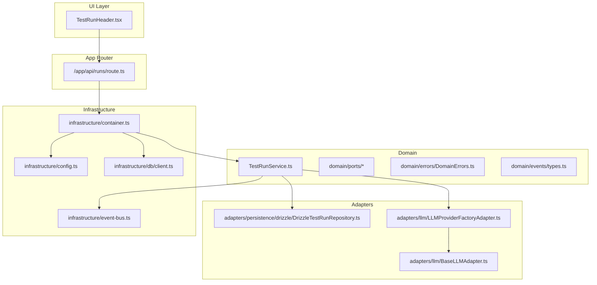

**Diagram sources**
- [TestRunHeader.tsx:1-139](file://src/ui/test-run/TestRunHeader.tsx#L1-L139)
- [route.ts:1-26](file://app/api/runs/route.ts#L1-L26)
- [container.ts:1-126](file://src/infrastructure/container.ts#L1-L126)
- [TestRunService.ts:1-125](file://src/domain/services/TestRunService.ts#L1-L125)
- [DrizzleTestRunRepository.ts:1-96](file://src/adapters/persistence/drizzle/DrizzleTestRunRepository.ts#L1-L96)
- [LLMProviderFactoryAdapter.ts:1-43](file://src/adapters/llm/LLMProviderFactoryAdapter.ts#L1-L43)
- [BaseLLMAdapter.ts:1-26](file://src/adapters/llm/BaseLLMAdapter.ts#L1-L26)
- [event-bus.ts:1-52](file://src/infrastructure/event-bus.ts#L1-L52)
- [client.ts:1-32](file://src/infrastructure/db/client.ts#L1-L32)
- [config.ts:1-28](file://src/infrastructure/config.ts#L1-L28)

**Section sources**
- [container.ts:1-126](file://src/infrastructure/container.ts#L1-L126)
- [config.ts:1-28](file://src/infrastructure/config.ts#L1-L28)
- [client.ts:1-32](file://src/infrastructure/db/client.ts#L1-L32)
- [event-bus.ts:1-52](file://src/infrastructure/event-bus.ts#L1-L52)

## Core Components
- IoC Container: A lazy-initialized singleton that wires repositories, adapters, and domain services. It exposes named exports for use across API routes and services.
- Repository Abstraction: Interfaces define contracts for data access; concrete Drizzle implementations provide SQL-backed persistence.
- Adapter Pattern: External integrations (storage, issue tracker, notifier, webhook dispatcher) are implemented behind interfaces and injected into services.
- Factory Pattern: A factory constructs the appropriate LLM provider based on persisted settings and configuration.
- Event-Driven Architecture: Typed domain events are emitted by services and handled asynchronously by adapters.
- Error Handling: Typed domain exceptions unify error semantics across the stack.
- Configuration Management: Centralized configuration consolidates environment variables into a typed object.

**Section sources**
- [container.ts:27-91](file://src/infrastructure/container.ts#L27-L91)
- [ITestRunRepository.ts:1-12](file://src/domain/ports/repositories/ITestRunRepository.ts#L1-L12)
- [DrizzleTestRunRepository.ts:1-96](file://src/adapters/persistence/drizzle/DrizzleTestRunRepository.ts#L1-L96)
- [LLMProviderFactoryAdapter.ts:10-42](file://src/adapters/llm/LLMProviderFactoryAdapter.ts#L10-L42)
- [event-bus.ts:9-49](file://src/infrastructure/event-bus.ts#L9-L49)
- [DomainErrors.ts:7-39](file://src/domain/errors/DomainErrors.ts#L7-L39)
- [config.ts:7-27](file://src/infrastructure/config.ts#L7-L27)

## Architecture Overview
Clean architecture layers and their responsibilities:
- Domain: Business logic, services, ports, errors, and events.
- Adapters: Implementations for repositories, LLM providers, storage, webhooks, and notifiers.
- Infrastructure: IoC container, database client, configuration, and event bus.

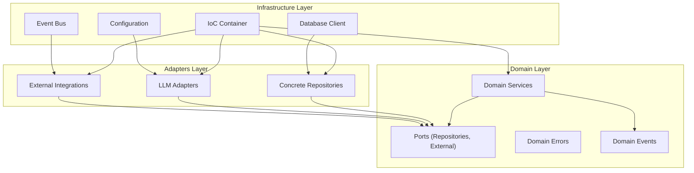

**Diagram sources**
- [container.ts:33-91](file://src/infrastructure/container.ts#L33-L91)
- [client.ts:6-25](file://src/infrastructure/db/client.ts#L6-L25)
- [config.ts:7-27](file://src/infrastructure/config.ts#L7-L27)
- [event-bus.ts:9-49](file://src/infrastructure/event-bus.ts#L9-L49)
- [index.ts:1-19](file://src/domain/ports/index.ts#L1-L19)

## Detailed Component Analysis

### Dependency Injection Container Pattern
The IoC container is a singleton created lazily and stored globally to avoid duplication in Next.js App Router contexts. It registers:
- Repositories: Drizzle implementations for projects, modules, test cases, test runs, test results, attachments, dashboard, and settings.
- External Adapters: Storage provider, Jira adapter, Slack notifier, webhook dispatcher, and LLM provider factory.
- Domain Services: Project, test plan, test run, attachment, dashboard, report, database, integration settings, AI test generation, and AI bug report services.

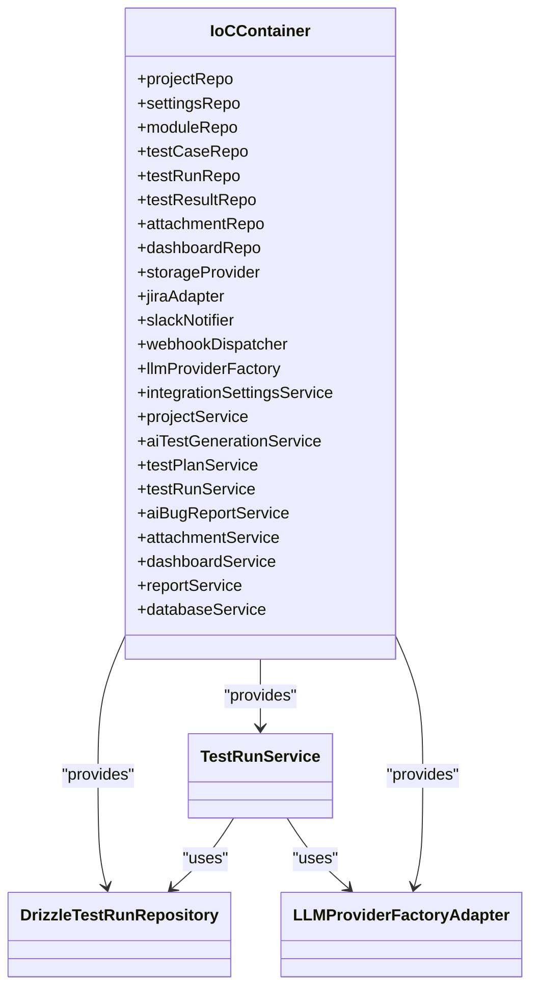

**Diagram sources**
- [container.ts:33-91](file://src/infrastructure/container.ts#L33-L91)
- [DrizzleTestRunRepository.ts:1-96](file://src/adapters/persistence/drizzle/DrizzleTestRunRepository.ts#L1-L96)
- [TestRunService.ts:14-21](file://src/domain/services/TestRunService.ts#L14-L21)
- [LLMProviderFactoryAdapter.ts:15-16](file://src/adapters/llm/LLMProviderFactoryAdapter.ts#L15-L16)

**Section sources**
- [container.ts:27-91](file://src/infrastructure/container.ts#L27-L91)

### Repository Pattern for Data Access Abstraction
- Port Contract: The repository port defines the operations available to the domain service.
- Concrete Implementation: The Drizzle repository implements the port using a typed database client and joins to enrich related entities.
- Domain Service Usage: Services depend on the repository port, keeping business logic independent of the persistence technology.

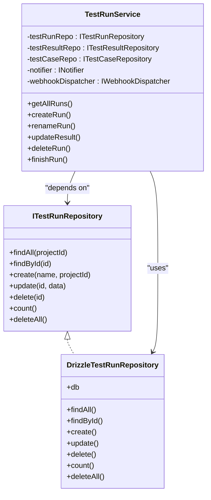

**Diagram sources**
- [ITestRunRepository.ts:3-11](file://src/domain/ports/repositories/ITestRunRepository.ts#L3-L11)
- [DrizzleTestRunRepository.ts:7-95](file://src/adapters/persistence/drizzle/DrizzleTestRunRepository.ts#L7-L95)
- [TestRunService.ts:14-21](file://src/domain/services/TestRunService.ts#L14-L21)

**Section sources**
- [ITestRunRepository.ts:1-12](file://src/domain/ports/repositories/ITestRunRepository.ts#L1-L12)
- [DrizzleTestRunRepository.ts:1-96](file://src/adapters/persistence/drizzle/DrizzleTestRunRepository.ts#L1-L96)
- [TestRunService.ts:1-125](file://src/domain/services/TestRunService.ts#L1-L125)

### Adapter Pattern for External Service Integration
- LLM Provider Factory: Selects the appropriate LLM adapter based on persisted settings or defaults from configuration.
- Base LLM Adapter: Defines a common interface and helper utilities for chat completion and availability checks.
- Other Adapters: Storage, issue tracker, notifier, and webhook dispatcher follow similar patterns behind typed ports.

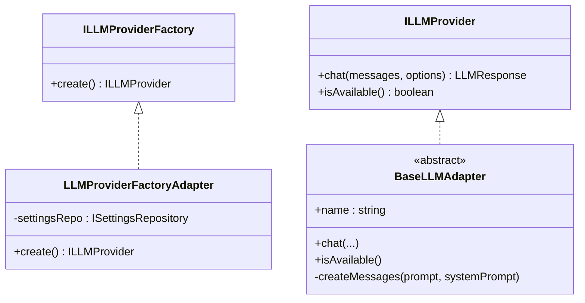

**Diagram sources**
- [LLMProviderFactoryAdapter.ts:15-41](file://src/adapters/llm/LLMProviderFactoryAdapter.ts#L15-L41)
- [BaseLLMAdapter.ts:3-25](file://src/adapters/llm/BaseLLMAdapter.ts#L3-L25)
- [index.ts:12-13](file://src/domain/ports/index.ts#L12-L13)

**Section sources**
- [LLMProviderFactoryAdapter.ts:10-42](file://src/adapters/llm/LLMProviderFactoryAdapter.ts#L10-L42)
- [BaseLLMAdapter.ts:1-26](file://src/adapters/llm/BaseLLMAdapter.ts#L1-L26)
- [index.ts:12-13](file://src/domain/ports/index.ts#L12-L13)

### Factory Pattern for Dynamic LLM Provider Instantiation
The factory reads persisted settings and falls back to configuration defaults to instantiate the correct LLM provider. This keeps the domain free from concrete provider knowledge while enabling runtime selection.

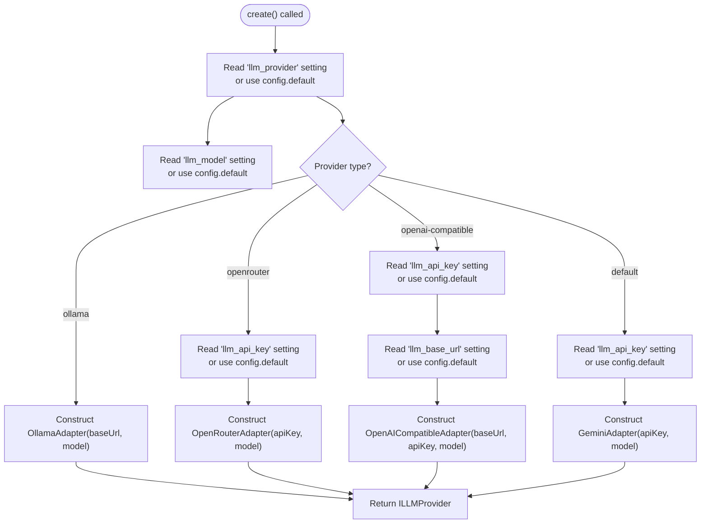

**Diagram sources**
- [LLMProviderFactoryAdapter.ts:18-41](file://src/adapters/llm/LLMProviderFactoryAdapter.ts#L18-L41)
- [config.ts:13-18](file://src/infrastructure/config.ts#L13-L18)

**Section sources**
- [LLMProviderFactoryAdapter.ts:18-41](file://src/adapters/llm/LLMProviderFactoryAdapter.ts#L18-L41)
- [config.ts:13-18](file://src/infrastructure/config.ts#L13-L18)

### Component Interaction: UI to Domain to Adapters and Infrastructure
End-to-end flow from UI components to domain services and adapters:

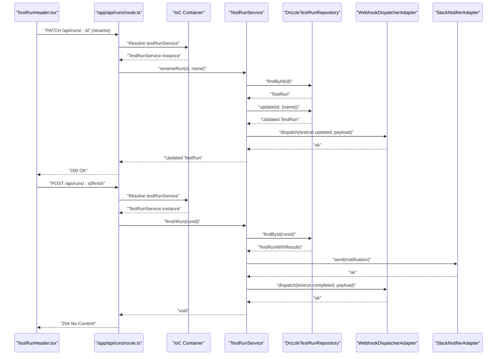

**Diagram sources**
- [TestRunHeader.tsx:33-113](file://src/ui/test-run/TestRunHeader.tsx#L33-L113)
- [route.ts:8-25](file://app/api/runs/route.ts#L8-L25)
- [container.ts:117-120](file://src/infrastructure/container.ts#L117-L120)
- [TestRunService.ts:53-84](file://src/domain/services/TestRunService.ts#L53-L84)
- [DrizzleTestRunRepository.ts:16-85](file://src/adapters/persistence/drizzle/DrizzleTestRunRepository.ts#L16-L85)

**Section sources**
- [TestRunHeader.tsx:1-139](file://src/ui/test-run/TestRunHeader.tsx#L1-L139)
- [route.ts:1-26](file://app/api/runs/route.ts#L1-L26)
- [container.ts:100-126](file://src/infrastructure/container.ts#L100-L126)
- [TestRunService.ts:1-125](file://src/domain/services/TestRunService.ts#L1-L125)
- [DrizzleTestRunRepository.ts:1-96](file://src/adapters/persistence/drizzle/DrizzleTestRunRepository.ts#L1-L96)

### Cross-Cutting Concerns

#### Event-Driven Architecture
- Domain emits typed events describing state changes and lifecycle milestones.
- Infrastructure event bus handles asynchronous dispatch to adapters (e.g., Slack notifier, webhook dispatcher).
- Handlers are registered via subscription and executed asynchronously with error logging.

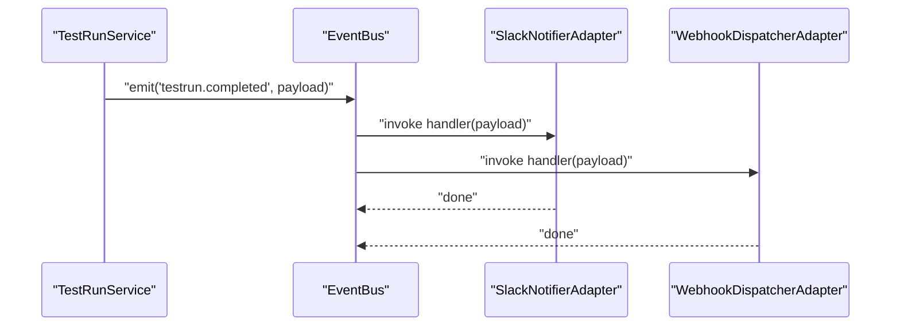

**Diagram sources**
- [TestRunService.ts:101-122](file://src/domain/services/TestRunService.ts#L101-L122)
- [event-bus.ts:13-29](file://src/infrastructure/event-bus.ts#L13-L29)

**Section sources**
- [types.ts:8-58](file://src/domain/events/types.ts#L8-L58)
- [event-bus.ts:9-49](file://src/infrastructure/event-bus.ts#L9-L49)
- [TestRunService.ts:101-122](file://src/domain/services/TestRunService.ts#L101-L122)

#### Error Handling
- Domain errors are typed and map cleanly to HTTP status codes.
- Services throw domain exceptions for invalid states, missing resources, or conflicts.
- API routes can translate domain errors to appropriate HTTP responses.

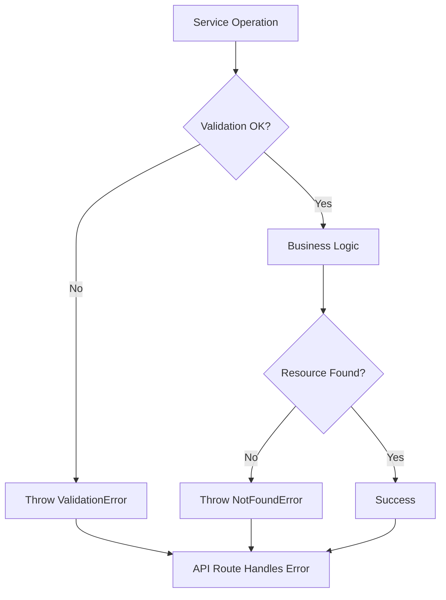

**Diagram sources**
- [DomainErrors.ts:18-38](file://src/domain/errors/DomainErrors.ts#L18-L38)
- [TestRunService.ts:29-57](file://src/domain/services/TestRunService.ts#L29-L57)

**Section sources**
- [DomainErrors.ts:7-39](file://src/domain/errors/DomainErrors.ts#L7-L39)
- [TestRunService.ts:23-84](file://src/domain/services/TestRunService.ts#L23-L84)

#### Configuration Management
- Centralized configuration consolidates environment variables into a typed object.
- Providers (database, LLM, storage, app) are configured via environment variables.
- Factories and adapters consume configuration defaults when settings are not persisted.

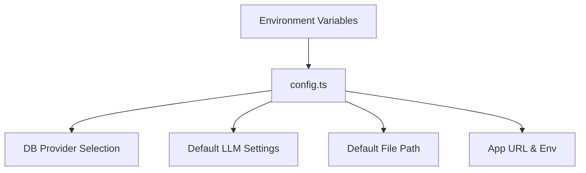

**Diagram sources**
- [config.ts:7-27](file://src/infrastructure/config.ts#L7-L27)

**Section sources**
- [config.ts:1-28](file://src/infrastructure/config.ts#L1-L28)

## Dependency Analysis
The IoC container orchestrates dependencies across layers, ensuring inversion of control and testability.

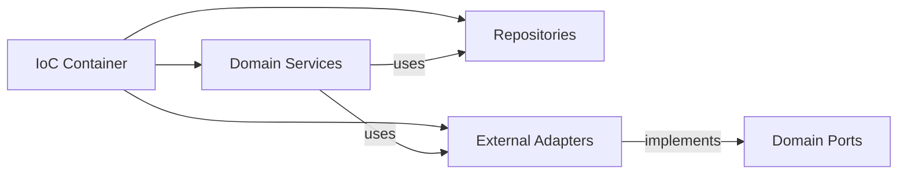

**Diagram sources**
- [container.ts:33-91](file://src/infrastructure/container.ts#L33-L91)
- [index.ts:1-19](file://src/domain/ports/index.ts#L1-L19)

**Section sources**
- [container.ts:1-126](file://src/infrastructure/container.ts#L1-L126)
- [index.ts:1-19](file://src/domain/ports/index.ts#L1-L19)

## Performance Considerations
- Database Provider Selection: The database client supports SQLite for development/electron and PostgreSQL for production, with connection pooling and pragmas optimized for performance.
- Lazy IoC Container: Prevents redundant initialization in Next.js environments.
- Asynchronous Event Dispatch: Handlers run asynchronously to avoid blocking domain logic.
- Repository Joins: Efficiently load related entities in a single query where possible.

**Section sources**
- [client.ts:6-25](file://src/infrastructure/db/client.ts#L6-L25)
- [container.ts:95-98](file://src/infrastructure/container.ts#L95-L98)
- [event-bus.ts:17-29](file://src/infrastructure/event-bus.ts#L17-L29)

## Troubleshooting Guide
- Missing Environment Variables: Ensure database provider, URLs, and LLM keys are set; otherwise, defaults may cause failures.
- Not Found Errors: When resources are missing, services throw typed errors; verify IDs and existence before invoking operations.
- Event Handler Failures: EventBus catches and logs errors from async/sync handlers; check logs for handler-specific issues.
- Repository Connectivity: Confirm database connectivity and migrations; verify provider selection matches deployment target.

**Section sources**
- [config.ts:7-27](file://src/infrastructure/config.ts#L7-L27)
- [DomainErrors.ts:18-26](file://src/domain/errors/DomainErrors.ts#L18-L26)
- [event-bus.ts:20-28](file://src/infrastructure/event-bus.ts#L20-L28)
- [client.ts:6-25](file://src/infrastructure/db/client.ts#L6-L25)

## Conclusion
The Test Plan Manager implements a clean architecture with clear separation of concerns. The IoC container enforces dependency inversion, the repository pattern abstracts persistence, the adapter pattern isolates external integrations, and the factory pattern enables dynamic LLM provider selection. The event-driven architecture and typed domain errors improve decoupling and reliability. Centralized configuration and a singleton database client streamline deployment and performance.

## Appendices
- Extension Guidelines:
  - Add new domain services under src/domain/services and expose them via the IoC container.
  - Implement new repository ports under src/domain/ports/repositories and provide a Drizzle implementation under src/adapters/persistence/drizzle.
  - Introduce new external adapters behind typed ports and register them in the IoC container.
  - Emit typed domain events and subscribe adapters to handle asynchronous integrations.
  - Keep environment variables documented and validated through the centralized configuration.