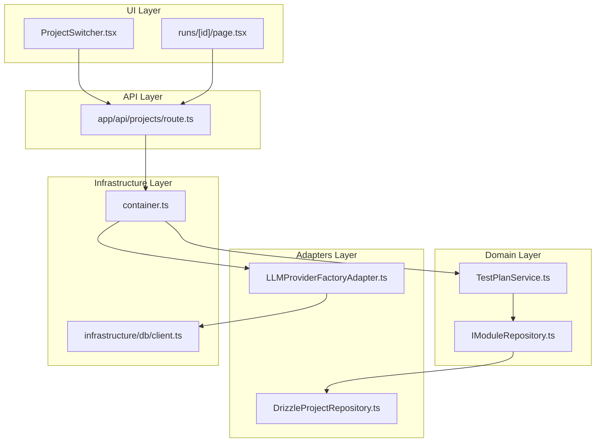
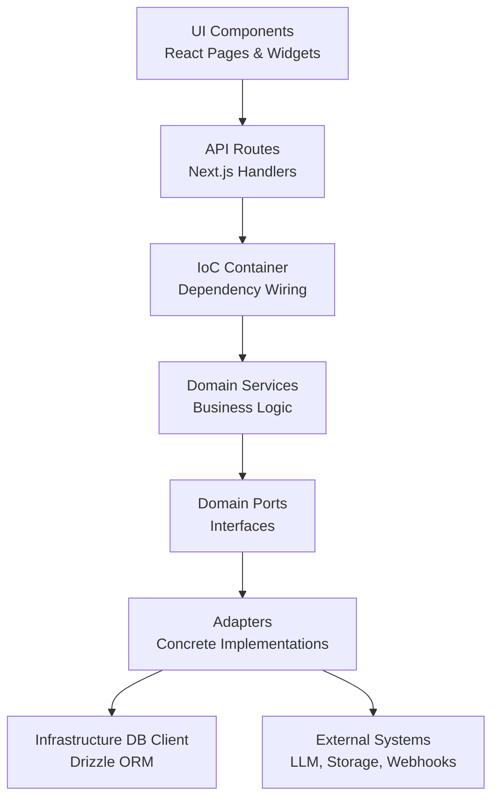
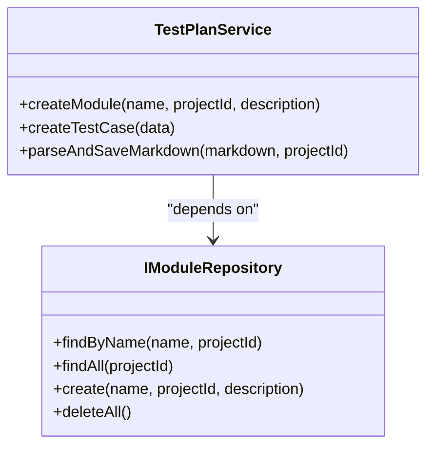
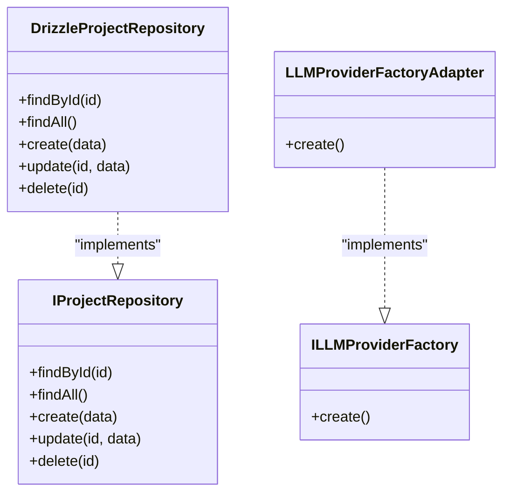
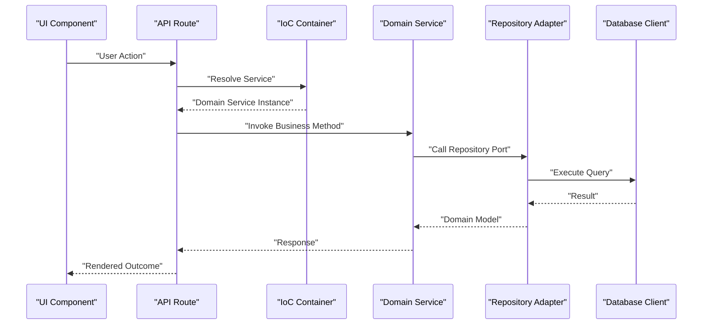
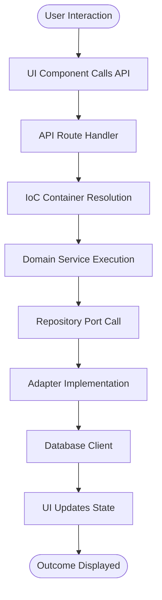
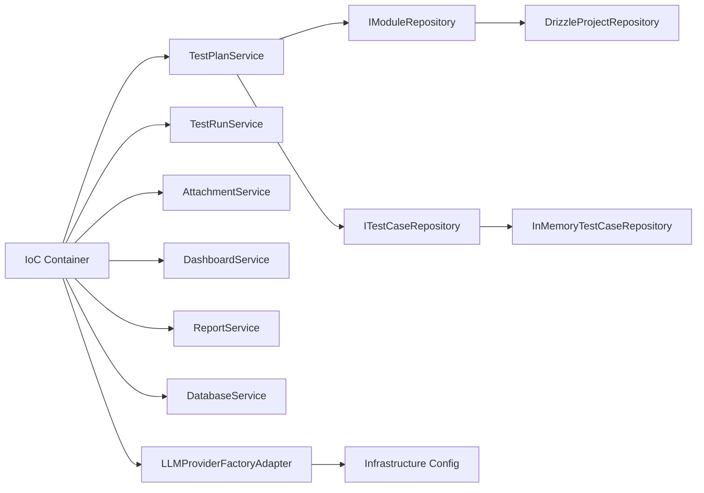

# Clean Architecture Overview

<cite>
**Referenced Files in This Document**
- [container.ts](file://src/infrastructure/container.ts)
- [TestPlanService.ts](file://src/domain/services/TestPlanService.ts)
- [IModuleRepository.ts](file://src/domain/ports/repositories/IModuleRepository.ts)
- [DrizzleProjectRepository.ts](file://src/adapters/persistence/drizzle/DrizzleProjectRepository.ts)
- [LLMProviderFactoryAdapter.ts](file://src/adapters/llm/LLMProviderFactoryAdapter.ts)
- [route.ts](file://app/api/projects/route.ts)
- [ProjectSwitcher.tsx](file://src/ui/layout/ProjectSwitcher.tsx)
- [page.tsx](file://app/runs/[id]/page.tsx)
- [README.md](file://README.md)
</cite>

## Table of Contents
1. [Introduction](#introduction)
2. [Project Structure](#project-structure)
3. [Core Components](#core-components)
4. [Architecture Overview](#architecture-overview)
5. [Detailed Component Analysis](#detailed-component-analysis)
6. [Dependency Analysis](#dependency-analysis)
7. [Performance Considerations](#performance-considerations)
8. [Troubleshooting Guide](#troubleshooting-guide)
9. [Conclusion](#conclusion)

## Introduction
This document presents a clean architecture overview for the Test Plan Manager, focusing on the layered architecture design. The system is organized into three primary layers:
- Domain: encapsulates core business logic and rules, independent of frameworks and external systems.
- Adapters: translate between the domain and external systems such as databases, LLM providers, storage, and webhooks.
- Infrastructure: handles cross-cutting concerns like dependency injection, database clients, and UI state management.

The architecture enforces separation of concerns, adheres to dependency inversion, and promotes testability and maintainability. It supports both web and desktop deployment scenarios, enabling flexible scaling and portability.

## Project Structure
The repository follows a layered structure aligned with clean architecture:
- Domain: services, ports (interfaces), and types define business logic and contracts.
- Adapters: concrete implementations for persistence, LLM providers, storage, and notifications.
- Infrastructure: dependency injection container, database client, and UI state management.
- UI: React components and pages that orchestrate user interactions and call domain services.
- API: Next.js routes that act as orchestrators, invoking domain services via the container.

**Diagram sources**
- [ProjectSwitcher.tsx:1-397](file://src/ui/layout/ProjectSwitcher.tsx#L1-L397)
- [page.tsx:1-38](file://app/runs/[id]/page.tsx#L1-L38)
- [route.ts:1-19](file://app/api/projects/route.ts#L1-L19)
- [TestPlanService.ts:1-110](file://src/domain/services/TestPlanService.ts#L1-L110)
- [IModuleRepository.ts:1-9](file://src/domain/ports/repositories/IModuleRepository.ts#L1-L9)
- [DrizzleProjectRepository.ts:1-52](file://src/adapters/persistence/drizzle/DrizzleProjectRepository.ts#L1-L52)
- [LLMProviderFactoryAdapter.ts:1-43](file://src/adapters/llm/LLMProviderFactoryAdapter.ts#L1-L43)
- [container.ts:1-126](file://src/infrastructure/container.ts#L1-L126)

**Section sources**
- [README.md:1-47](file://README.md#L1-L47)

## Core Components
This section outlines the three layers and their responsibilities, along with how they interact to process requests from UI components to domain services and down to adapters and infrastructure.

- Domain Layer
  - Responsibilities: Business logic, rules, and workflows. Services depend only on interfaces (ports) defined in the domain.
  - Example: TestPlanService orchestrates parsing and persistence of test plans using repository interfaces.
  - Contracts: Repository interfaces define the data access contract the domain depends on.

- Adapters Layer
  - Responsibilities: Implementations of domain contracts and integrations with external systems.
  - Examples:
    - DrizzleProjectRepository implements the project repository interface using Drizzle ORM.
    - LLMProviderFactoryAdapter constructs LLM providers based on settings and configuration.
  - External Integrations: Storage, issue trackers, webhooks, and LLM providers.

- Infrastructure Layer
  - Responsibilities: Dependency injection, database clients, and UI state management.
  - Example: IoC container wires up repositories, adapters, and domain services, exposing named exports for use across the app.

How data flows:
- UI components initiate actions (e.g., project creation, test run retrieval).
- API routes receive requests and delegate to domain services via the container.
- Domain services execute business logic and call repositories through interfaces.
- Adapters implement repository interfaces and interact with infrastructure (ORM, storage, external APIs).
- Infrastructure manages connections and configuration.

Benefits:
- Separation of concerns: UI, business logic, and external integrations are decoupled.
- Dependency inversion: Domain depends on abstractions, not concrete implementations.
- Testability: Domain services and adapters can be unit-tested with mocked dependencies.
- Maintainability: Changes in external systems (e.g., switching LLM providers) are isolated to adapters.

**Section sources**
- [TestPlanService.ts:1-110](file://src/domain/services/TestPlanService.ts#L1-L110)
- [IModuleRepository.ts:1-9](file://src/domain/ports/repositories/IModuleRepository.ts#L1-L9)
- [DrizzleProjectRepository.ts:1-52](file://src/adapters/persistence/drizzle/DrizzleProjectRepository.ts#L1-L52)
- [LLMProviderFactoryAdapter.ts:1-43](file://src/adapters/llm/LLMProviderFactoryAdapter.ts#L1-L43)
- [container.ts:1-126](file://src/infrastructure/container.ts#L1-L126)

## Architecture Overview
The clean architecture organizes the system into layers with clear boundaries and unidirectional dependency flow. The diagram below illustrates the relationships among UI, API, Domain, Adapters, and Infrastructure.

**Diagram sources**
- [container.ts:1-126](file://src/infrastructure/container.ts#L1-L126)
- [TestPlanService.ts:1-110](file://src/domain/services/TestPlanService.ts#L1-L110)
- [IModuleRepository.ts:1-9](file://src/domain/ports/repositories/IModuleRepository.ts#L1-L9)
- [DrizzleProjectRepository.ts:1-52](file://src/adapters/persistence/drizzle/DrizzleProjectRepository.ts#L1-L52)
- [LLMProviderFactoryAdapter.ts:1-43](file://src/adapters/llm/LLMProviderFactoryAdapter.ts#L1-L43)

## Detailed Component Analysis

### Domain Services and Ports
Domain services encapsulate business logic and depend on domain ports (interfaces). This ensures the domain remains agnostic of external implementations.

**Diagram sources**
- [TestPlanService.ts:1-110](file://src/domain/services/TestPlanService.ts#L1-L110)
- [IModuleRepository.ts:1-9](file://src/domain/ports/repositories/IModuleRepository.ts#L1-L9)

**Section sources**
- [TestPlanService.ts:1-110](file://src/domain/services/TestPlanService.ts#L1-L110)
- [IModuleRepository.ts:1-9](file://src/domain/ports/repositories/IModuleRepository.ts#L1-L9)

### Adapters and External Integrations
Adapters implement domain ports and integrate with external systems. They translate domain concepts into concrete implementations.

**Diagram sources**
- [DrizzleProjectRepository.ts:1-52](file://src/adapters/persistence/drizzle/DrizzleProjectRepository.ts#L1-L52)
- [IModuleRepository.ts:1-9](file://src/domain/ports/repositories/IModuleRepository.ts#L1-L9)
- [LLMProviderFactoryAdapter.ts:1-43](file://src/adapters/llm/LLMProviderFactoryAdapter.ts#L1-L43)

**Section sources**
- [DrizzleProjectRepository.ts:1-52](file://src/adapters/persistence/drizzle/DrizzleProjectRepository.ts#L1-L52)
- [LLMProviderFactoryAdapter.ts:1-43](file://src/adapters/llm/LLMProviderFactoryAdapter.ts#L1-L43)

### API Orchestration and Data Flow
API routes act as orchestrators, delegating to domain services via the IoC container. This maintains a clear boundary between presentation and business logic.

**Diagram sources**
- [route.ts:1-19](file://app/api/projects/route.ts#L1-L19)
- [container.ts:1-126](file://src/infrastructure/container.ts#L1-L126)
- [TestPlanService.ts:1-110](file://src/domain/services/TestPlanService.ts#L1-L110)
- [DrizzleProjectRepository.ts:1-52](file://src/adapters/persistence/drizzle/DrizzleProjectRepository.ts#L1-L52)

**Section sources**
- [route.ts:1-19](file://app/api/projects/route.ts#L1-L19)
- [container.ts:1-126](file://src/infrastructure/container.ts#L1-L126)

### UI Integration and Deployment Scenarios
UI components interact with API routes to perform operations. The system supports both web and desktop deployments, leveraging the same architecture.

- Web deployment: Next.js routes and React components.
- Desktop deployment: Electron wrapper around the same codebase.

**Diagram sources**
- [ProjectSwitcher.tsx:1-397](file://src/ui/layout/ProjectSwitcher.tsx#L1-L397)
- [page.tsx:1-38](file://app/runs/[id]/page.tsx#L1-L38)
- [container.ts:1-126](file://src/infrastructure/container.ts#L1-L126)

**Section sources**
- [ProjectSwitcher.tsx:1-397](file://src/ui/layout/ProjectSwitcher.tsx#L1-L397)
- [page.tsx:1-38](file://app/runs/[id]/page.tsx#L1-L38)
- [README.md:24-25](file://README.md#L24-L25)

## Dependency Analysis
The dependency graph highlights how the IoC container binds domain services to adapters and repositories, enforcing dependency inversion and reducing coupling.

**Diagram sources**
- [container.ts:1-126](file://src/infrastructure/container.ts#L1-L126)
- [TestPlanService.ts:1-110](file://src/domain/services/TestPlanService.ts#L1-L110)
- [IModuleRepository.ts:1-9](file://src/domain/ports/repositories/IModuleRepository.ts#L1-L9)
- [DrizzleProjectRepository.ts:1-52](file://src/adapters/persistence/drizzle/DrizzleProjectRepository.ts#L1-L52)
- [LLMProviderFactoryAdapter.ts:1-43](file://src/adapters/llm/LLMProviderFactoryAdapter.ts#L1-L43)

**Section sources**
- [container.ts:1-126](file://src/infrastructure/container.ts#L1-L126)

## Performance Considerations
- Dependency Injection: The IoC container initializes singletons lazily to avoid duplication across API routes and improve startup performance.
- Repository Abstraction: Using repository interfaces allows swapping implementations (e.g., in-memory vs. persistent) without changing domain logic.
- External Integrations: Factories (e.g., LLM provider factory) centralize configuration and reduce repeated setup overhead.
- UI Responsiveness: UI components fetch data asynchronously and update state efficiently, minimizing blocking operations.

[No sources needed since this section provides general guidance]

## Troubleshooting Guide
Common issues and resolutions:
- Missing API Keys: Ensure environment variables for external services (e.g., Gemini) are configured as per the project’s development instructions.
- Database Connectivity: Verify the local SQLite setup and Drizzle ORM commands for schema management.
- Container Initialization: Confirm the IoC container is properly initialized and exported for use in API routes.

**Section sources**
- [README.md:16-20](file://README.md#L16-L20)
- [README.md:28-46](file://README.md#L28-L46)

## Conclusion
The clean architecture design of Test Plan Manager separates business logic from external concerns, enabling testability, maintainability, and scalability. By adhering to dependency inversion and layer boundaries, the system supports both web and desktop deployments while keeping domain logic portable and robust.

[No sources needed since this section summarizes without analyzing specific files]