# Dependency Injection Container

<cite>
**Referenced Files in This Document**
- [container.ts](file://src/infrastructure/container.ts)
- [client.ts](file://src/infrastructure/db/client.ts)
- [withApiHandler.ts](file://app/api/_lib/withApiHandler.ts)
- [route.ts](file://app/api/projects/route.ts)
- [route.ts](file://app/api/settings/clear/route.ts)
- [DrizzleProjectRepository.ts](file://src/adapters/persistence/drizzle/DrizzleProjectRepository.ts)
- [IProjectRepository.ts](file://src/domain/ports/repositories/IProjectRepository.ts)
- [ProjectService.ts](file://src/domain/services/ProjectService.ts)
- [TestRunService.ts](file://src/domain/services/TestRunService.ts)
- [JiraAdapter.ts](file://src/adapters/issue-tracker/JiraAdapter.ts)
- [IIssueTracker.ts](file://src/domain/ports/IIssueTracker.ts)
- [LLMProviderFactoryAdapter.ts](file://src/adapters/llm/LLMProviderFactoryAdapter.ts)
- [AILLMProvider.ts](file://src/domain/ports/ILLMProvider.ts)
- [AITestGenerationService.ts](file://src/domain/services/AITestGenerationService.ts)
</cite>

## Table of Contents
1. [Introduction](#introduction)
2. [Project Structure](#project-structure)
3. [Core Components](#core-components)
4. [Architecture Overview](#architecture-overview)
5. [Detailed Component Analysis](#detailed-component-analysis)
6. [Dependency Analysis](#dependency-analysis)
7. [Performance Considerations](#performance-considerations)
8. [Troubleshooting Guide](#troubleshooting-guide)
9. [Conclusion](#conclusion)

## Introduction
This document explains the dependency injection (DI) container implementation used to register and resolve services in a clean architecture. It covers:
- The IoC container pattern and lazy initialization
- Singleton behavior using a globalThis-based cache to avoid duplicate instances in Next.js App Router
- Registration of repositories, adapters, and domain services
- How the container enables loose coupling and testability
- Examples of service initialization, dependency resolution, and lazy initialization strategy
- How the DI container supports clean architecture principles

## Project Structure
The DI container lives in the infrastructure layer and exposes named exports for services and repositories. API routes import services from the container to keep route handlers thin and testable.

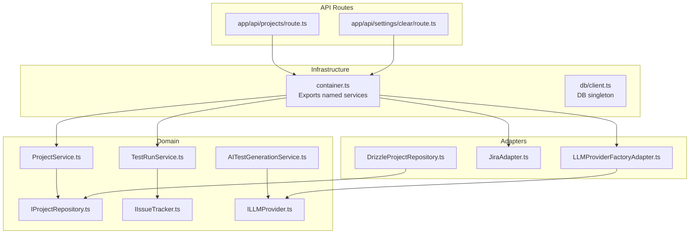

**Diagram sources**
- [container.ts:1-126](file://src/infrastructure/container.ts#L1-L126)
- [client.ts:1-32](file://src/infrastructure/db/client.ts#L1-L32)
- [IProjectRepository.ts:1-10](file://src/domain/ports/repositories/IProjectRepository.ts#L1-L10)
- [ProjectService.ts:1-38](file://src/domain/services/ProjectService.ts#L1-L38)
- [TestRunService.ts:1-125](file://src/domain/services/TestRunService.ts#L1-L125)
- [IIssueTracker.ts:1-16](file://src/domain/ports/IIssueTracker.ts#L1-L16)
- [AILLMProvider.ts:1-32](file://src/domain/ports/ILLMProvider.ts#L1-L32)
- [AITestGenerationService.ts:1-82](file://src/domain/services/AITestGenerationService.ts#L1-L82)
- [DrizzleProjectRepository.ts:1-52](file://src/adapters/persistence/drizzle/DrizzleProjectRepository.ts#L1-L52)
- [JiraAdapter.ts:1-82](file://src/adapters/issue-tracker/JiraAdapter.ts#L1-L82)
- [LLMProviderFactoryAdapter.ts:1-43](file://src/adapters/llm/LLMProviderFactoryAdapter.ts#L1-L43)
- [route.ts:1-19](file://app/api/projects/route.ts#L1-L19)
- [route.ts:1-10](file://app/api/settings/clear/route.ts#L1-L10)

**Section sources**
- [container.ts:1-126](file://src/infrastructure/container.ts#L1-L126)
- [route.ts:1-19](file://app/api/projects/route.ts#L1-L19)
- [route.ts:1-10](file://app/api/settings/clear/route.ts#L1-L10)

## Core Components
- IoC Container: A factory that constructs and wires all dependencies, returning a single object with named exports for services and repositories.
- Global singleton: Uses a globalThis cache to ensure only one container instance exists during development and SSR contexts.
- Lazy initialization: Dependencies are created on first access, avoiding unnecessary work until needed.
- Named exports: Provides ergonomic imports for API routes and tests.

Key responsibilities:
- Register repositories (persistence adapters)
- Register external adapters (storage, notifications, webhooks, LLM factories)
- Register domain services (business logic)
- Expose services and repositories for use in API routes and tests

**Section sources**
- [container.ts:27-98](file://src/infrastructure/container.ts#L27-L98)

## Architecture Overview
The container follows a layered architecture:
- Infrastructure: container.ts orchestrates construction and caching
- Domain: services depend on interfaces (ports)
- Adapters: concrete implementations of domain interfaces
- API Layer: routes import services from the container

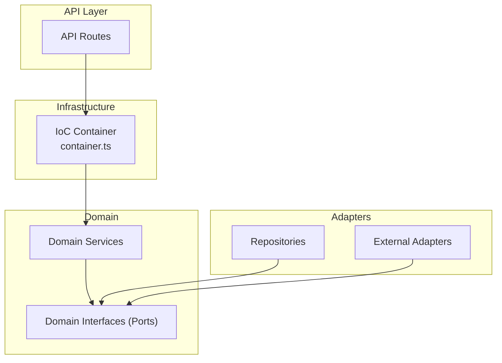

**Diagram sources**
- [container.ts:33-91](file://src/infrastructure/container.ts#L33-L91)
- [ProjectService.ts:9-10](file://src/domain/services/ProjectService.ts#L9-L10)
- [TestRunService.ts:14-21](file://src/domain/services/TestRunService.ts#L14-L21)
- [DrizzleProjectRepository.ts:7-1](file://src/adapters/persistence/drizzle/DrizzleProjectRepository.ts#L7-L1)
- [JiraAdapter.ts:4-5](file://src/adapters/issue-tracker/JiraAdapter.ts#L4-L5)
- [LLMProviderFactoryAdapter.ts:15-16](file://src/adapters/llm/LLMProviderFactoryAdapter.ts#L15-L16)

## Detailed Component Analysis

### IoC Container Implementation
- Construction: The factory initializes repositories, adapters, and services, wiring dependencies by passing required ports/interfaces.
- Singleton: A globalThis cache ensures a single container instance across requests in development and SSR.
- Exports: Named exports expose services and repositories for direct consumption by API routes and tests.

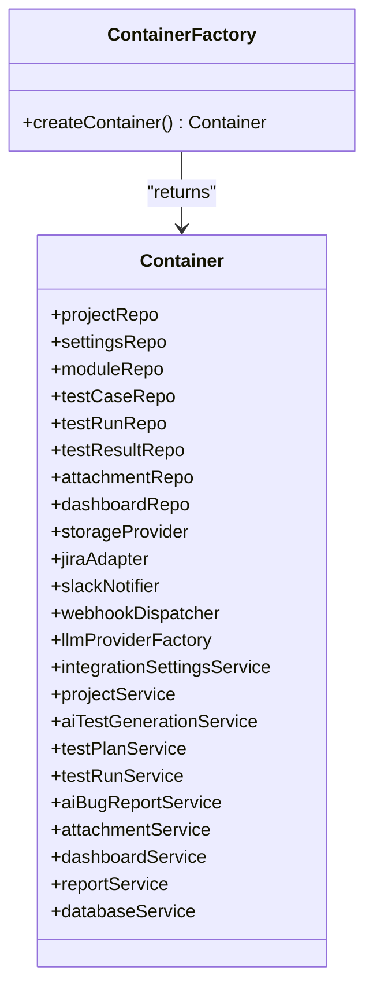

**Diagram sources**
- [container.ts:33-91](file://src/infrastructure/container.ts#L33-L91)

**Section sources**
- [container.ts:27-98](file://src/infrastructure/container.ts#L27-L98)

### Repository Registration and Resolution
- Repository interfaces define contracts for persistence operations.
- Concrete repositories implement those interfaces and are constructed within the container.
- Domain services depend on interfaces, not concrete repositories, enabling substitution and testability.

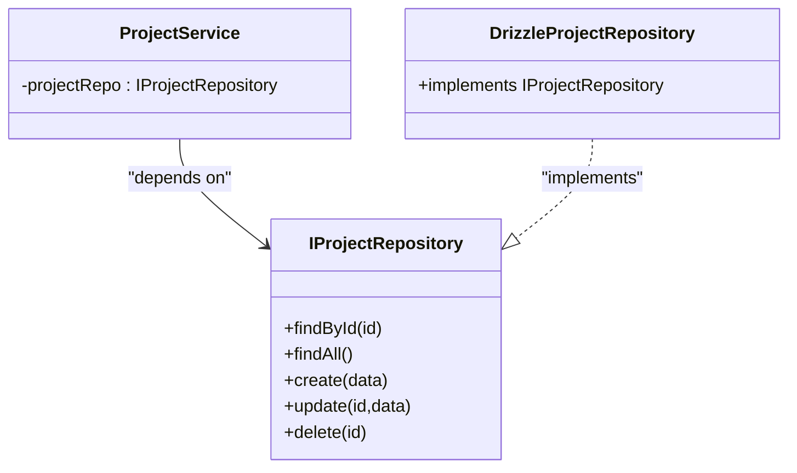

**Diagram sources**
- [IProjectRepository.ts:3-9](file://src/domain/ports/repositories/IProjectRepository.ts#L3-L9)
- [DrizzleProjectRepository.ts:7-52](file://src/adapters/persistence/drizzle/DrizzleProjectRepository.ts#L7-L52)
- [ProjectService.ts:9-10](file://src/domain/services/ProjectService.ts#L9-L10)

**Section sources**
- [IProjectRepository.ts:1-10](file://src/domain/ports/repositories/IProjectRepository.ts#L1-L10)
- [DrizzleProjectRepository.ts:1-52](file://src/adapters/persistence/drizzle/DrizzleProjectRepository.ts#L1-L52)
- [ProjectService.ts:1-38](file://src/domain/services/ProjectService.ts#L1-L38)

### Adapter Registration and LLM Factory Pattern
- External adapters implement domain interfaces (e.g., issue trackers, notifiers).
- The LLM provider factory selects a concrete provider based on persisted settings or configuration, keeping domain logic provider-agnostic.

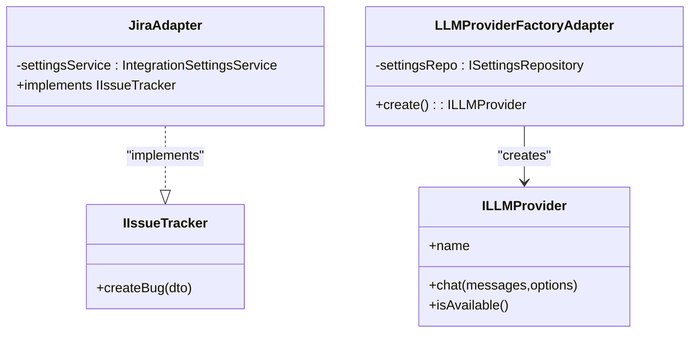

**Diagram sources**
- [IIssueTracker.ts:13-15](file://src/domain/ports/IIssueTracker.ts#L13-L15)
- [JiraAdapter.ts:4-5](file://src/adapters/issue-tracker/JiraAdapter.ts#L4-L5)
- [AILLMProvider.ts:12-31](file://src/domain/ports/ILLMProvider.ts#L12-L31)
- [LLMProviderFactoryAdapter.ts:15-41](file://src/adapters/llm/LLMProviderFactoryAdapter.ts#L15-L41)

**Section sources**
- [JiraAdapter.ts:1-82](file://src/adapters/issue-tracker/JiraAdapter.ts#L1-L82)
- [LLMProviderFactoryAdapter.ts:1-43](file://src/adapters/llm/LLMProviderFactoryAdapter.ts#L1-L43)
- [AILLMProvider.ts:1-32](file://src/domain/ports/ILLMProvider.ts#L1-L32)

### Domain Service Registration and Dependency Resolution
- Domain services are constructed with their dependencies injected via constructor parameters.
- Services encapsulate business logic and coordinate with repositories and adapters through interfaces.

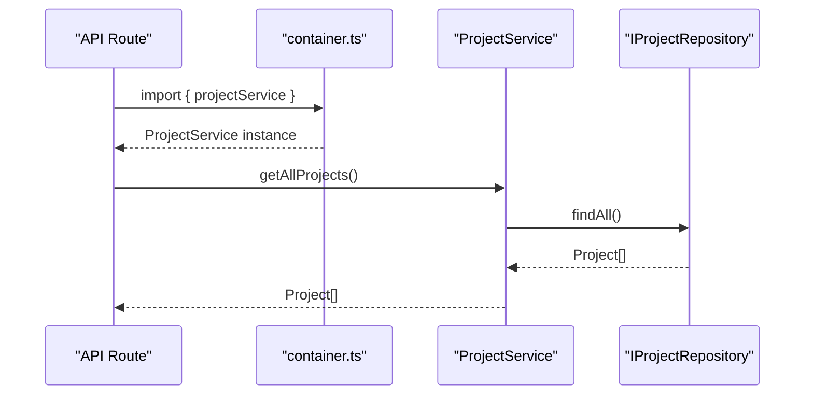

**Diagram sources**
- [route.ts:1-19](file://app/api/projects/route.ts#L1-L19)
- [container.ts:101-125](file://src/infrastructure/container.ts#L101-L125)
- [ProjectService.ts:18-20](file://src/domain/services/ProjectService.ts#L18-L20)
- [IProjectRepository.ts:4-6](file://src/domain/ports/repositories/IProjectRepository.ts#L4-L6)

**Section sources**
- [ProjectService.ts:1-38](file://src/domain/services/ProjectService.ts#L1-L38)
- [TestRunService.ts:1-125](file://src/domain/services/TestRunService.ts#L1-L125)

### Lazy Initialization Strategy
- The container factory is invoked only once and cached in globalThis.
- Dependencies are created on demand; there is no eager instantiation of services or repositories beyond the initial container creation.

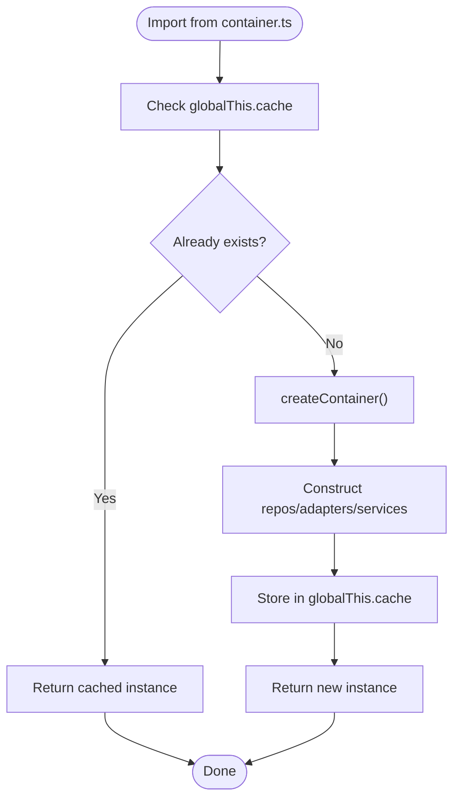

**Diagram sources**
- [container.ts:95-98](file://src/infrastructure/container.ts#L95-L98)
- [client.ts:27-31](file://src/infrastructure/db/client.ts#L27-L31)

**Section sources**
- [container.ts:95-98](file://src/infrastructure/container.ts#L95-L98)
- [client.ts:27-31](file://src/infrastructure/db/client.ts#L27-L31)

### Singleton Pattern Using globalThis
- The container leverages a globalThis cache to ensure a single instance across the application lifecycle.
- This prevents duplicate instances in environments where modules may be reevaluated per request (e.g., Next.js App Router server functions).

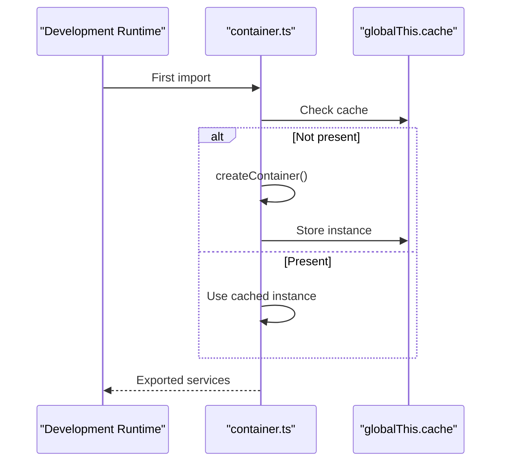

**Diagram sources**
- [container.ts:95-98](file://src/infrastructure/container.ts#L95-L98)

**Section sources**
- [container.ts:95-98](file://src/infrastructure/container.ts#L95-L98)

### Example: Service Initialization and Resolution in API Routes
- API routes import services from the container, ensuring thin routes and centralized dependency management.
- Error handling middleware demonstrates how domain errors and validation errors are normalized.

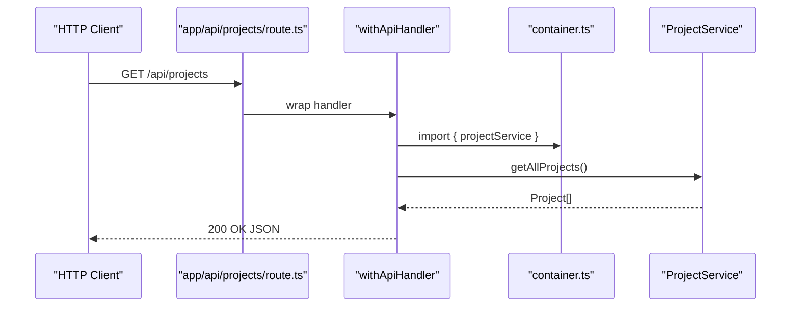

**Diagram sources**
- [route.ts:1-19](file://app/api/projects/route.ts#L1-L19)
- [withApiHandler.ts:22-64](file://app/api/_lib/withApiHandler.ts#L22-L64)
- [container.ts:117](file://src/infrastructure/container.ts#L117)

**Section sources**
- [route.ts:1-19](file://app/api/projects/route.ts#L1-L19)
- [withApiHandler.ts:1-64](file://app/api/_lib/withApiHandler.ts#L1-L64)

### Example: Using a Service That Depends on an Adapter
- The database service clears data; the route imports it from the container.
- This illustrates how domain services can orchestrate operations across repositories and adapters.

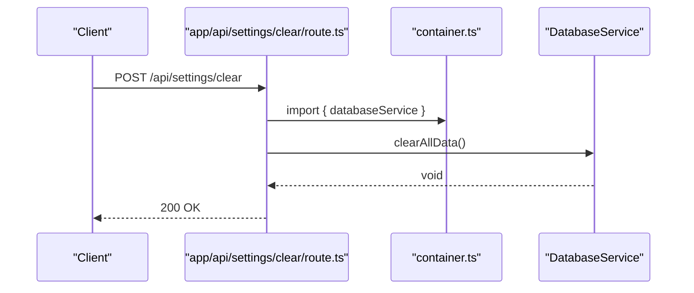

**Diagram sources**
- [route.ts:1-10](file://app/api/settings/clear/route.ts#L1-L10)
- [container.ts:125](file://src/infrastructure/container.ts#L125)

**Section sources**
- [route.ts:1-10](file://app/api/settings/clear/route.ts#L1-L10)

## Dependency Analysis
The container centralizes dependency wiring, reducing coupling between modules:
- Domain services depend on interfaces, not concrete implementations.
- Repositories and adapters are registered once and reused.
- API routes depend only on the container’s named exports.

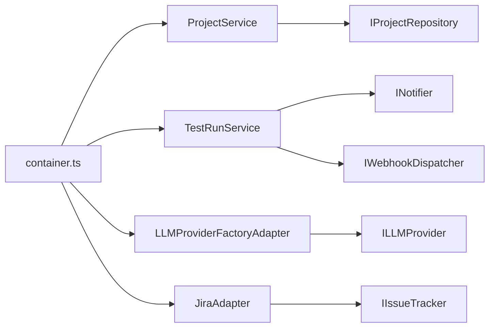

**Diagram sources**
- [container.ts:33-91](file://src/infrastructure/container.ts#L33-L91)
- [ProjectService.ts:9-10](file://src/domain/services/ProjectService.ts#L9-L10)
- [TestRunService.ts:14-21](file://src/domain/services/TestRunService.ts#L14-L21)
- [LLMProviderFactoryAdapter.ts:15-16](file://src/adapters/llm/LLMProviderFactoryAdapter.ts#L15-L16)
- [JiraAdapter.ts:4-5](file://src/adapters/issue-tracker/JiraAdapter.ts#L4-L5)

**Section sources**
- [container.ts:33-91](file://src/infrastructure/container.ts#L33-L91)

## Performance Considerations
- Lazy initialization avoids constructing unused services and repositories.
- Singleton caching reduces overhead in development and SSR contexts.
- Keep the container focused: only wire core dependencies here; avoid adding heavy logic to the factory.

## Troubleshooting Guide
- Validation errors: Normalized to structured JSON with field-level details.
- Domain errors: Mapped to appropriate HTTP status codes.
- Unknown errors: Logged and returned as internal server errors.

**Section sources**
- [withApiHandler.ts:22-64](file://app/api/_lib/withApiHandler.ts#L22-L64)

## Conclusion
The DI container enforces clean architecture by:
- Encapsulating dependency construction and caching
- Promoting interface-based programming to enable substitutability
- Enabling testability by allowing mock implementations of domain interfaces
- Supporting loose coupling between domain services, repositories, and adapters
- Providing a single source of truth for service instances across the application