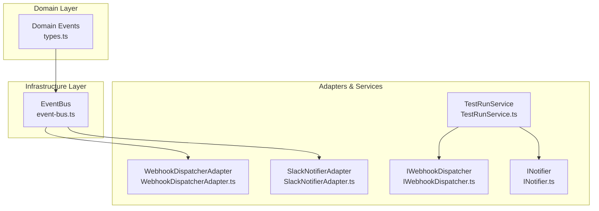
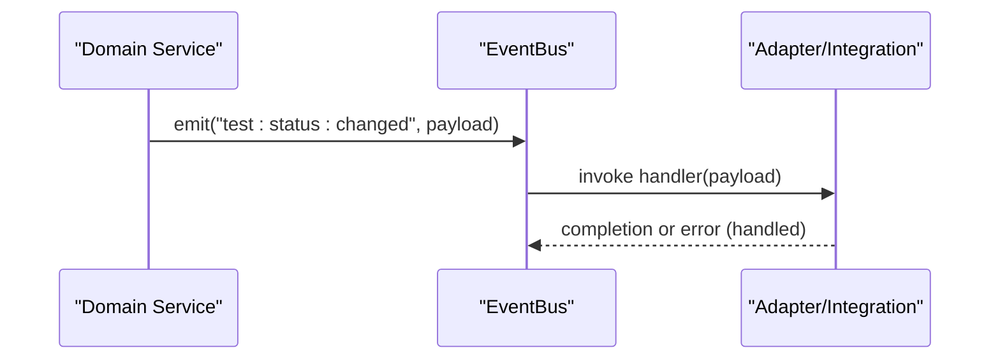
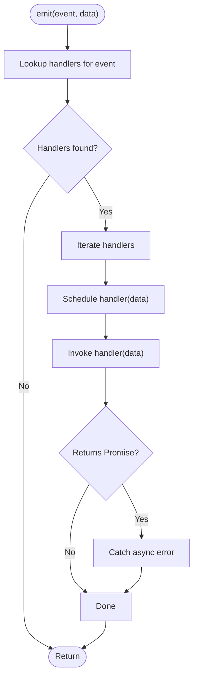
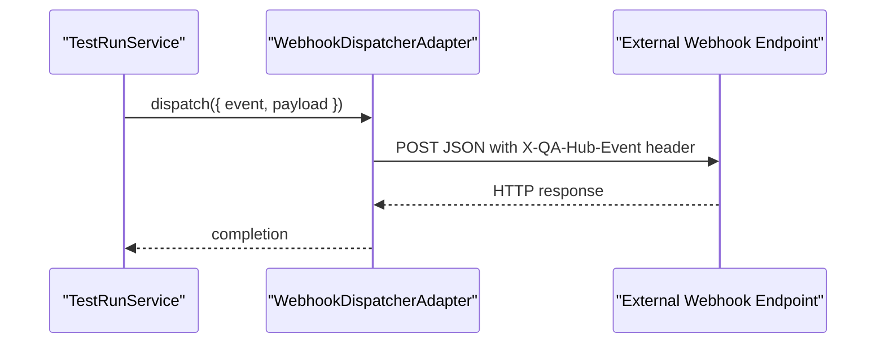
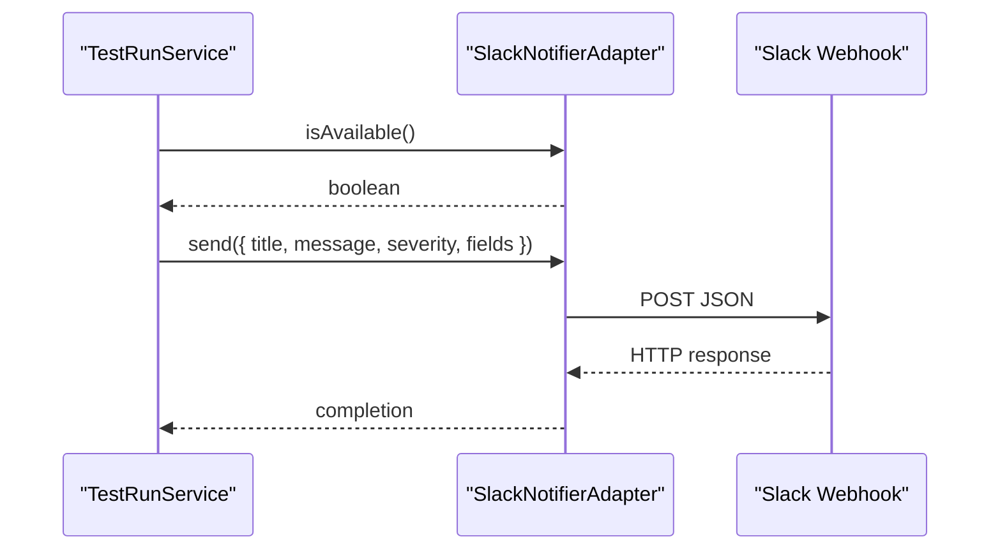
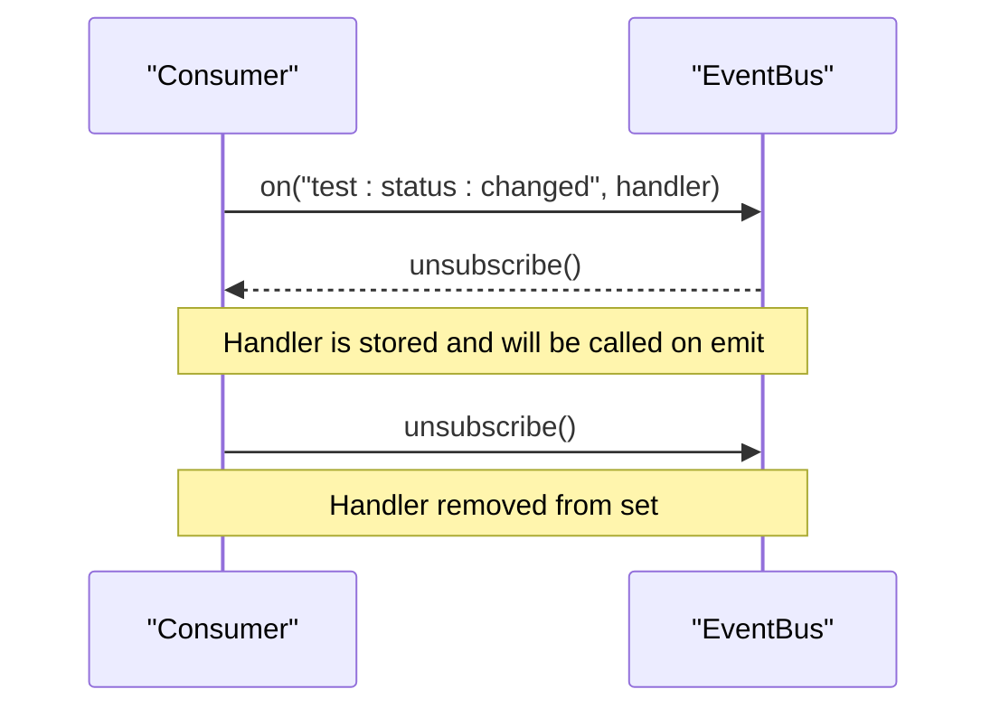
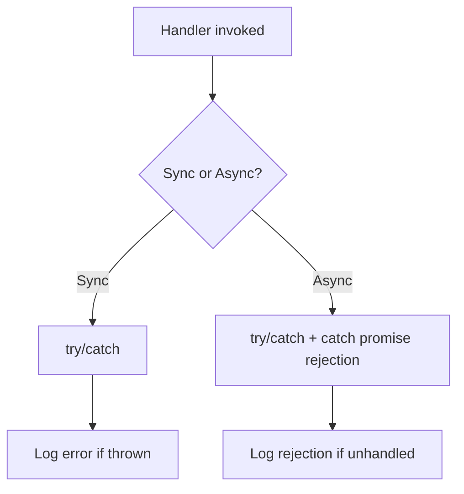
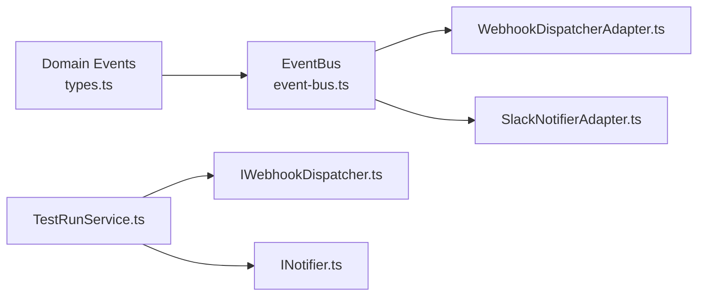

# Event-Driven Architecture and Event Bus

<cite>
**Referenced Files in This Document**
- [event-bus.ts](file://src/infrastructure/event-bus.ts)
- [types.ts](file://src/domain/events/types.ts)
- [index.ts](file://src/domain/events/index.ts)
- [TestRunService.ts](file://src/domain/services/TestRunService.ts)
- [WebhookDispatcherAdapter.ts](file://src/adapters/webhook/WebhookDispatcherAdapter.ts)
- [IWebhookDispatcher.ts](file://src/domain/ports/IWebhookDispatcher.ts)
- [INotifier.ts](file://src/domain/ports/INotifier.ts)
- [SlackNotifierAdapter.ts](file://src/adapters/notifier/SlackNotifierAdapter.ts)
- [container.ts](file://src/infrastructure/container.ts)
</cite>

## Table of Contents
1. [Introduction](#introduction)
2. [Project Structure](#project-structure)
3. [Core Components](#core-components)
4. [Architecture Overview](#architecture-overview)
5. [Detailed Component Analysis](#detailed-component-analysis)
6. [Dependency Analysis](#dependency-analysis)
7. [Performance Considerations](#performance-considerations)
8. [Troubleshooting Guide](#troubleshooting-guide)
9. [Conclusion](#conclusion)

## Introduction
This document explains the event-driven architecture and event bus implementation in the platform. It focuses on how the event system enables loose coupling between components through a publish-subscribe pattern, documents the event types and payload structures, and describes how events are triggered during test execution, result updates, and system operations. It also covers event registration, processing, error handling, and the role of events in supporting notifications, webhooks, and integration patterns. Finally, it outlines how the event system contributes to the platform’s decoupling strategy and extensibility.

## Project Structure
The event system spans three layers:
- Domain events: Strongly typed event definitions and contracts.
- Infrastructure: A typed event bus that publishes events to subscribers.
- Adapters and services: Consumers of domain events that integrate with external systems (e.g., webhooks, notifications).

**Diagram sources**
- [types.ts:1-62](file://src/domain/events/types.ts#L1-L62)
- [event-bus.ts:1-52](file://src/infrastructure/event-bus.ts#L1-L52)
- [TestRunService.ts:1-125](file://src/domain/services/TestRunService.ts#L1-L125)
- [WebhookDispatcherAdapter.ts:1-38](file://src/adapters/webhook/WebhookDispatcherAdapter.ts#L1-L38)
- [SlackNotifierAdapter.ts:1-56](file://src/adapters/notifier/SlackNotifierAdapter.ts#L1-L56)
- [IWebhookDispatcher.ts:1-21](file://src/domain/ports/IWebhookDispatcher.ts#L1-L21)
- [INotifier.ts:1-27](file://src/domain/ports/INotifier.ts#L1-L27)

**Section sources**
- [types.ts:1-62](file://src/domain/events/types.ts#L1-L62)
- [event-bus.ts:1-52](file://src/infrastructure/event-bus.ts#L1-L52)
- [TestRunService.ts:1-125](file://src/domain/services/TestRunService.ts#L1-L125)
- [WebhookDispatcherAdapter.ts:1-38](file://src/adapters/webhook/WebhookDispatcherAdapter.ts#L1-L38)
- [SlackNotifierAdapter.ts:1-56](file://src/adapters/notifier/SlackNotifierAdapter.ts#L1-L56)
- [IWebhookDispatcher.ts:1-21](file://src/domain/ports/IWebhookDispatcher.ts#L1-L21)
- [INotifier.ts:1-27](file://src/domain/ports/INotifier.ts#L1-L27)

## Core Components
- Domain events: A strongly typed map defines the canonical event names and payloads exchanged by the domain core with adapters/integrations.
- Event bus: A typed event publisher/subscriber that ensures asynchronous, non-blocking event delivery and robust error handling for sync and async handlers.
- Adapters and services: Consumers that subscribe to domain events and integrate with external systems (webhooks, notifications).

Key responsibilities:
- Domain events define the contract for “what happened” and “with what data.”
- The event bus decouples producers from consumers and isolates side effects from core logic.
- Adapters translate domain events into outbound integrations (HTTP webhooks, chat notifications).

**Section sources**
- [types.ts:8-62](file://src/domain/events/types.ts#L8-L62)
- [event-bus.ts:9-51](file://src/infrastructure/event-bus.ts#L9-L51)

## Architecture Overview
The event-driven architecture separates concerns:
- Domain services produce domain events.
- The event bus delivers events to subscribed adapters/services.
- Adapters handle integrations (webhooks, notifications) without the domain knowing transport details.

**Diagram sources**
- [event-bus.ts:13-30](file://src/infrastructure/event-bus.ts#L13-L30)
- [types.ts:10-17](file://src/domain/events/types.ts#L10-L17)

## Detailed Component Analysis

### Domain Events
The domain defines a typed event map with the following canonical events and payloads:
- test:status:changed: Emitted when a test result status changes. Payload includes identifiers and timestamps.
- test:run:completed: Emitted when all tests in a run are completed. Payload includes run metadata and statistics.
- test:plan:imported: Emitted after importing a test plan from a file. Payload includes counts and source metadata.
- attachment:uploaded: Emitted when an attachment is uploaded. Payload includes file and result identifiers.
- report:generated: Emitted when a report is generated. Payload includes run identifier, format, and generation timestamp.
- ai:plan:generated: Emitted when AI generates a test plan. Payload includes provider and generation metrics.

These types form the contract between the domain core and the outside world, enabling adapters to react to domain changes without tight coupling.

**Section sources**
- [types.ts:8-58](file://src/domain/events/types.ts#L8-L58)
- [index.ts:1-6](file://src/domain/events/index.ts#L1-L6)

### Event Bus
The event bus provides:
- Type-safe subscription and emission using generic constraints on event names and payloads.
- Asynchronous delivery via immediate scheduling to avoid blocking domain logic.
- Robust error handling: synchronous exceptions are caught and logged; asynchronous promise rejections are handled separately.
- Unsubscribe support via returned functions.
- Clearing all handlers for testing scenarios.

Processing logic:
- Emit iterates handlers and schedules each handler invocation.
- Handlers can be sync or async; async handlers are monitored for unhandled rejections.

**Diagram sources**
- [event-bus.ts:13-30](file://src/infrastructure/event-bus.ts#L13-L30)

**Section sources**
- [event-bus.ts:9-51](file://src/infrastructure/event-bus.ts#L9-L51)

### TestRunService and Webhooks
TestRunService triggers integration events during lifecycle operations:
- Creation, renaming, deletion, and completion of test runs dispatch webhook events.
- These events are delivered via the IWebhookDispatcher port, implemented by WebhookDispatcherAdapter.

**Diagram sources**
- [TestRunService.ts:45-48](file://src/domain/services/TestRunService.ts#L45-L48)
- [TestRunService.ts:57-62](file://src/domain/services/TestRunService.ts#L57-L62)
- [TestRunService.ts:80-84](file://src/domain/services/TestRunService.ts#L80-L84)
- [TestRunService.ts:115-122](file://src/domain/services/TestRunService.ts#L115-L122)
- [WebhookDispatcherAdapter.ts:14-36](file://src/adapters/webhook/WebhookDispatcherAdapter.ts#L14-L36)
- [IWebhookDispatcher.ts:18-20](file://src/domain/ports/IWebhookDispatcher.ts#L18-L20)

**Section sources**
- [TestRunService.ts:33-84](file://src/domain/services/TestRunService.ts#L33-L84)
- [TestRunService.ts:86-123](file://src/domain/services/TestRunService.ts#L86-L123)
- [WebhookDispatcherAdapter.ts:11-38](file://src/adapters/webhook/WebhookDispatcherAdapter.ts#L11-L38)
- [IWebhookDispatcher.ts:1-21](file://src/domain/ports/IWebhookDispatcher.ts#L1-L21)

### Notifications via Slack
SlackNotifierAdapter implements the INotifier port to deliver notifications when a test run completes. It checks availability based on integration settings and posts to a configured webhook URL.

**Diagram sources**
- [TestRunService.ts:101-113](file://src/domain/services/TestRunService.ts#L101-L113)
- [SlackNotifierAdapter.ts:9-21](file://src/adapters/notifier/SlackNotifierAdapter.ts#L9-L21)
- [SlackNotifierAdapter.ts:14-54](file://src/adapters/notifier/SlackNotifierAdapter.ts#L14-L54)
- [INotifier.ts:17-26](file://src/domain/ports/INotifier.ts#L17-L26)

**Section sources**
- [SlackNotifierAdapter.ts:4-56](file://src/adapters/notifier/SlackNotifierAdapter.ts#L4-L56)
- [INotifier.ts:1-27](file://src/domain/ports/INotifier.ts#L1-L27)
- [TestRunService.ts:101-113](file://src/domain/services/TestRunService.ts#L101-L113)

### Event Registration and Unsubscription
To register for domain events, a consumer subscribes to the EventBus and receives an unsubscribe function. Handlers are invoked asynchronously, ensuring non-blocking execution.

**Diagram sources**
- [event-bus.ts:32-43](file://src/infrastructure/event-bus.ts#L32-L43)

**Section sources**
- [event-bus.ts:32-43](file://src/infrastructure/event-bus.ts#L32-L43)

### Error Handling in Event Handlers
The event bus wraps handler invocations in try/catch and monitors async handlers for rejections. Errors are logged with context about the event name, preventing failures from leaking into domain logic.

**Diagram sources**
- [event-bus.ts:19-28](file://src/infrastructure/event-bus.ts#L19-L28)

**Section sources**
- [event-bus.ts:19-28](file://src/infrastructure/event-bus.ts#L19-L28)

## Dependency Analysis
The event system relies on clean separation of concerns:
- Domain events are independent of transport and integrations.
- The event bus depends only on the event type definitions.
- Adapters depend on ports (IWebhookDispatcher, INotifier) to remain decoupled from HTTP or chat APIs.

**Diagram sources**
- [types.ts:1-62](file://src/domain/events/types.ts#L1-L62)
- [event-bus.ts:1-52](file://src/infrastructure/event-bus.ts#L1-L52)
- [WebhookDispatcherAdapter.ts:1-38](file://src/adapters/webhook/WebhookDispatcherAdapter.ts#L1-L38)
- [SlackNotifierAdapter.ts:1-56](file://src/adapters/notifier/SlackNotifierAdapter.ts#L1-L56)
- [TestRunService.ts:1-125](file://src/domain/services/TestRunService.ts#L1-L125)
- [IWebhookDispatcher.ts:1-21](file://src/domain/ports/IWebhookDispatcher.ts#L1-L21)
- [INotifier.ts:1-27](file://src/domain/ports/INotifier.ts#L1-L27)

**Section sources**
- [container.ts:16-61](file://src/infrastructure/container.ts#L16-L61)
- [TestRunService.ts:14-21](file://src/domain/services/TestRunService.ts#L14-L21)

## Performance Considerations
- Asynchronous dispatch: Handlers are scheduled immediately, avoiding synchronous blocking of domain operations.
- Parallelism: Multiple handlers run concurrently; ensure handlers are idempotent and thread-safe.
- Backpressure: For high-volume events, consider batching or rate limiting in adapters.
- Logging overhead: Error logging is essential; keep logs concise and include event names and handler identities for diagnostics.

## Troubleshooting Guide
Common issues and remedies:
- Missing handlers: If no handlers are registered for an event, emit returns early. Verify subscriptions.
- Handler crashes: The event bus catches and logs errors; inspect logs for the specific event name and handler.
- Async handler rejections: Unhandled promise rejections are caught and logged; review handler implementations.
- Webhook failures: WebhookDispatcherAdapter logs individual URL failures; check network connectivity and endpoint availability.
- Notification misconfiguration: SlackNotifierAdapter skips sending if the webhook URL is missing; verify integration settings.

**Section sources**
- [event-bus.ts:19-28](file://src/infrastructure/event-bus.ts#L19-L28)
- [WebhookDispatcherAdapter.ts:30-35](file://src/adapters/webhook/WebhookDispatcherAdapter.ts#L30-L35)
- [SlackNotifierAdapter.ts:18-21](file://src/adapters/notifier/SlackNotifierAdapter.ts#L18-L21)

## Conclusion
The event-driven architecture and typed event bus enable strong decoupling between domain services and external integrations. Domain events define a stable contract, while the event bus ensures reliable, asynchronous delivery and robust error handling. Through adapters, the platform supports notifications and webhooks without compromising the purity of domain logic. This design contributes to extensibility, maintainability, and scalability across the system.