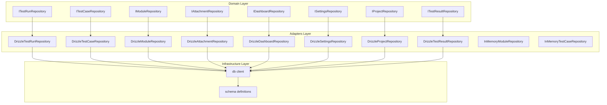
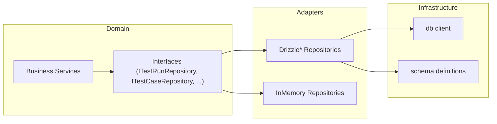
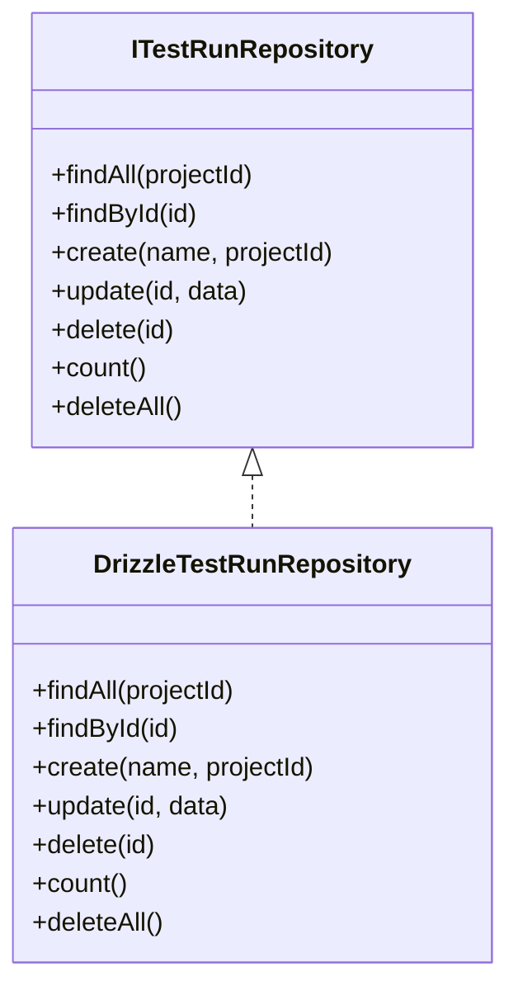
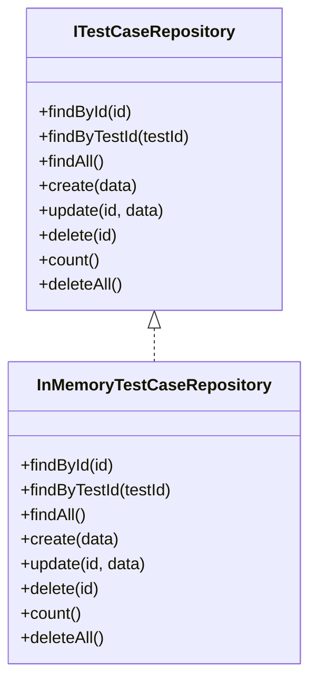
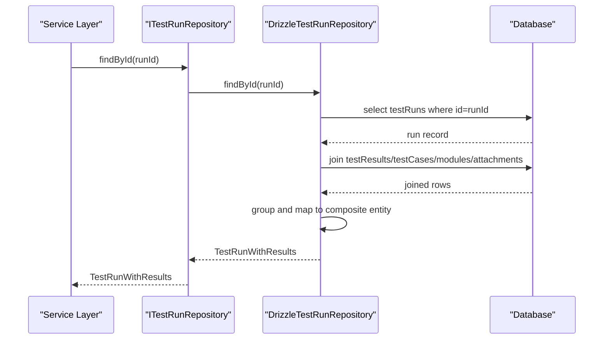
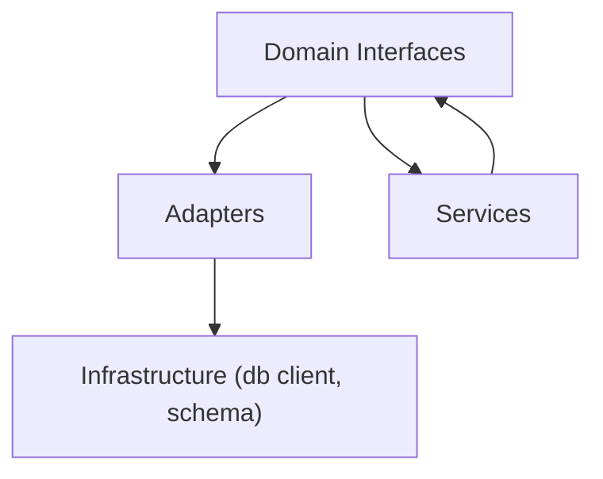

# Repository Pattern Implementation

<cite>
**Referenced Files in This Document**
- [ITestRunRepository.ts](file://src/domain/ports/repositories/ITestRunRepository.ts)
- [ITestCaseRepository.ts](file://src/domain/ports/repositories/ITestCaseRepository.ts)
- [IModuleRepository.ts](file://src/domain/ports/repositories/IModuleRepository.ts)
- [IAttachmentRepository.ts](file://src/domain/ports/repositories/IAttachmentRepository.ts)
- [IDashboardRepository.ts](file://src/domain/ports/repositories/IDashboardRepository.ts)
- [ISettingsRepository.ts](file://src/domain/ports/repositories/ISettingsRepository.ts)
- [IProjectRepository.ts](file://src/domain/ports/repositories/IProjectRepository.ts)
- [ITestResultRepository.ts](file://src/domain/ports/repositories/ITestResultRepository.ts)
- [index.ts](file://src/domain/ports/repositories/index.ts)
- [DrizzleTestRunRepository.ts](file://src/adapters/persistence/drizzle/DrizzleTestRunRepository.ts)
- [DrizzleTestCaseRepository.ts](file://src/adapters/persistence/drizzle/DrizzleTestCaseRepository.ts)
- [DrizzleModuleRepository.ts](file://src/adapters/persistence/drizzle/DrizzleModuleRepository.ts)
- [DrizzleAttachmentRepository.ts](file://src/adapters/persistence/drizzle/DrizzleAttachmentRepository.ts)
- [DrizzleDashboardRepository.ts](file://src/adapters/persistence/drizzle/DrizzleDashboardRepository.ts)
- [DrizzleSettingsRepository.ts](file://src/adapters/persistence/drizzle/DrizzleSettingsRepository.ts)
- [DrizzleProjectRepository.ts](file://src/adapters/persistence/drizzle/DrizzleProjectRepository.ts)
- [DrizzleTestResultRepository.ts](file://src/adapters/persistence/drizzle/DrizzleTestResultRepository.ts)
- [index.ts](file://src/adapters/persistence/in-memory/index.ts)
- [client.ts](file://src/infrastructure/db/client.ts)
- [schema.ts](file://src/infrastructure/db/schema.ts)
</cite>

## Table of Contents
1. [Introduction](#introduction)
2. [Project Structure](#project-structure)
3. [Core Components](#core-components)
4. [Architecture Overview](#architecture-overview)
5. [Detailed Component Analysis](#detailed-component-analysis)
6. [Dependency Analysis](#dependency-analysis)
7. [Performance Considerations](#performance-considerations)
8. [Troubleshooting Guide](#troubleshooting-guide)
9. [Conclusion](#conclusion)

## Introduction
This document explains the repository pattern implementation in Test Plan Manager. It focuses on how the domain layer defines repository interfaces that abstract data access, enabling clean separation between business logic and persistence concerns. The adapters layer provides concrete implementations using Drizzle ORM and an in-memory store for testing. We document repository method contracts, data mapping between domain entities and database records, and transaction management considerations. The pattern supports database independence, testability, and alignment with clean architecture principles.

## Project Structure
The repository pattern is organized by layers:
- Domain layer: Defines repository interfaces and domain types.
- Adapters layer: Implements repositories for persistence backends.
- Infrastructure layer: Provides database client and schema definitions.

**Diagram sources**
- [ITestRunRepository.ts:1-12](file://src/domain/ports/repositories/ITestRunRepository.ts#L1-L12)
- [ITestCaseRepository.ts:1-13](file://src/domain/ports/repositories/ITestCaseRepository.ts#L1-L13)
- [IModuleRepository.ts:1-9](file://src/domain/ports/repositories/IModuleRepository.ts#L1-L9)
- [IAttachmentRepository.ts:1-9](file://src/domain/ports/repositories/IAttachmentRepository.ts#L1-L9)
- [IDashboardRepository.ts:1-15](file://src/domain/ports/repositories/IDashboardRepository.ts#L1-L15)
- [ISettingsRepository.ts:1-6](file://src/domain/ports/repositories/ISettingsRepository.ts#L1-L6)
- [IProjectRepository.ts:1-10](file://src/domain/ports/repositories/IProjectRepository.ts#L1-L10)
- [ITestResultRepository.ts:1-8](file://src/domain/ports/repositories/ITestResultRepository.ts#L1-L8)
- [DrizzleTestRunRepository.ts:1-96](file://src/adapters/persistence/drizzle/DrizzleTestRunRepository.ts#L1-L96)
- [DrizzleTestCaseRepository.ts:1-71](file://src/adapters/persistence/drizzle/DrizzleTestCaseRepository.ts#L1-L71)
- [DrizzleModuleRepository.ts:1-34](file://src/adapters/persistence/drizzle/DrizzleModuleRepository.ts#L1-L34)
- [DrizzleAttachmentRepository.ts:1-26](file://src/adapters/persistence/drizzle/DrizzleAttachmentRepository.ts#L1-L26)
- [DrizzleDashboardRepository.ts:1-313](file://src/adapters/persistence/drizzle/DrizzleDashboardRepository.ts#L1-L313)
- [DrizzleSettingsRepository.ts:1-29](file://src/adapters/persistence/drizzle/DrizzleSettingsRepository.ts#L1-L29)
- [DrizzleProjectRepository.ts:1-52](file://src/adapters/persistence/drizzle/DrizzleProjectRepository.ts#L1-L52)
- [DrizzleTestResultRepository.ts:1-36](file://src/adapters/persistence/drizzle/DrizzleTestResultRepository.ts#L1-L36)
- [client.ts](file://src/infrastructure/db/client.ts)
- [schema.ts](file://src/infrastructure/db/schema.ts)

**Section sources**
- [index.ts:1-7](file://src/domain/ports/repositories/index.ts#L1-L7)

## Core Components
This section documents the repository interfaces and their concrete implementations, highlighting method contracts and mapping strategies.

- ITestRunRepository
  - Methods: findAll, findById, create, update, delete, count, deleteAll
  - Purpose: Manage test run entities and aggregate associated results
  - Example signature path: [ITestRunRepository.ts:3-11](file://src/domain/ports/repositories/ITestRunRepository.ts#L3-L11)
  - Implementation: [DrizzleTestRunRepository.ts:7-95](file://src/adapters/persistence/drizzle/DrizzleTestRunRepository.ts#L7-L95)

- ITestCaseRepository
  - Methods: findById, findByTestId, findAll, create, update, delete, count, deleteAll
  - Purpose: Manage test case entities and their linkage to modules
  - Example signature path: [ITestCaseRepository.ts:3-12](file://src/domain/ports/repositories/ITestCaseRepository.ts#L3-L12)
  - Implementation: [DrizzleTestCaseRepository.ts:7-70](file://src/adapters/persistence/drizzle/DrizzleTestCaseRepository.ts#L7-L70)

- IModuleRepository
  - Methods: findByName, findAll, create, deleteAll
  - Purpose: Manage modules within projects
  - Example signature path: [IModuleRepository.ts:3-8](file://src/domain/ports/repositories/IModuleRepository.ts#L3-L8)
  - Implementation: [DrizzleModuleRepository.ts:7-33](file://src/adapters/persistence/drizzle/DrizzleModuleRepository.ts#L7-L33)

- IAttachmentRepository
  - Methods: findById, create, delete, deleteAll
  - Purpose: Manage test result attachments
  - Example signature path: [IAttachmentRepository.ts:3-8](file://src/domain/ports/repositories/IAttachmentRepository.ts#L3-L8)
  - Implementation: [DrizzleAttachmentRepository.ts:7-25](file://src/adapters/persistence/drizzle/DrizzleAttachmentRepository.ts#L7-L25)

- IDashboardRepository
  - Methods: getLatestRun, getHistoricalRuns, getFlakyTests, getPriorityDistribution, getRecentRuns, getActivities, getCasesDelta, getRunsDelta, getModuleCoverage
  - Purpose: Provide analytics and summaries across test runs, cases, and modules
  - Example signature path: [IDashboardRepository.ts:3-13](file://src/domain/ports/repositories/IDashboardRepository.ts#L3-L13)
  - Implementation: [DrizzleDashboardRepository.ts:14-312](file://src/adapters/persistence/drizzle/DrizzleDashboardRepository.ts#L14-L312)

- ISettingsRepository
  - Methods: get, set, getAll
  - Purpose: Manage key-value settings with upsert semantics
  - Example signature path: [ISettingsRepository.ts:1-6](file://src/domain/ports/repositories/ISettingsRepository.ts#L1-L6)
  - Implementation: [DrizzleSettingsRepository.ts:6-28](file://src/adapters/persistence/drizzle/DrizzleSettingsRepository.ts#L6-L28)

- IProjectRepository
  - Methods: findById, findAll, create, update, delete
  - Purpose: Manage project entities
  - Example signature path: [IProjectRepository.ts:3-9](file://src/domain/ports/repositories/IProjectRepository.ts#L3-L9)
  - Implementation: [DrizzleProjectRepository.ts:7-51](file://src/adapters/persistence/drizzle/DrizzleProjectRepository.ts#L7-L51)

- ITestResultRepository
  - Methods: createMany, update, deleteAll
  - Purpose: Manage test result records and statuses
  - Example signature path: [ITestResultRepository.ts:3-7](file://src/domain/ports/repositories/ITestResultRepository.ts#L3-L7)
  - Implementation: [DrizzleTestResultRepository.ts:7-35](file://src/adapters/persistence/drizzle/DrizzleTestResultRepository.ts#L7-L35)

- In-Memory Repositories (Testing)
  - InMemoryModuleRepository: findByName, findAll, create, deleteAll
  - InMemoryTestCaseRepository: findById, findByTestId, findAll, create, update, delete, count, deleteAll
  - Example implementation paths:
    - [index.ts:5-25](file://src/adapters/persistence/in-memory/index.ts#L5-L25)
    - [index.ts:27-66](file://src/adapters/persistence/in-memory/index.ts#L27-L66)

**Section sources**
- [ITestRunRepository.ts:1-12](file://src/domain/ports/repositories/ITestRunRepository.ts#L1-L12)
- [ITestCaseRepository.ts:1-13](file://src/domain/ports/repositories/ITestCaseRepository.ts#L1-L13)
- [IModuleRepository.ts:1-9](file://src/domain/ports/repositories/IModuleRepository.ts#L1-L9)
- [IAttachmentRepository.ts:1-9](file://src/domain/ports/repositories/IAttachmentRepository.ts#L1-L9)
- [IDashboardRepository.ts:1-15](file://src/domain/ports/repositories/IDashboardRepository.ts#L1-L15)
- [ISettingsRepository.ts:1-6](file://src/domain/ports/repositories/ISettingsRepository.ts#L1-L6)
- [IProjectRepository.ts:1-10](file://src/domain/ports/repositories/IProjectRepository.ts#L1-L10)
- [ITestResultRepository.ts:1-8](file://src/domain/ports/repositories/ITestResultRepository.ts#L1-L8)
- [DrizzleTestRunRepository.ts:1-96](file://src/adapters/persistence/drizzle/DrizzleTestRunRepository.ts#L1-L96)
- [DrizzleTestCaseRepository.ts:1-71](file://src/adapters/persistence/drizzle/DrizzleTestCaseRepository.ts#L1-L71)
- [DrizzleModuleRepository.ts:1-34](file://src/adapters/persistence/drizzle/DrizzleModuleRepository.ts#L1-L34)
- [DrizzleAttachmentRepository.ts:1-26](file://src/adapters/persistence/drizzle/DrizzleAttachmentRepository.ts#L1-L26)
- [DrizzleDashboardRepository.ts:1-313](file://src/adapters/persistence/drizzle/DrizzleDashboardRepository.ts#L1-L313)
- [DrizzleSettingsRepository.ts:1-29](file://src/adapters/persistence/drizzle/DrizzleSettingsRepository.ts#L1-L29)
- [DrizzleProjectRepository.ts:1-52](file://src/adapters/persistence/drizzle/DrizzleProjectRepository.ts#L1-L52)
- [DrizzleTestResultRepository.ts:1-36](file://src/adapters/persistence/drizzle/DrizzleTestResultRepository.ts#L1-L36)
- [index.ts:1-67](file://src/adapters/persistence/in-memory/index.ts#L1-L67)

## Architecture Overview
The repository pattern enforces a clean separation:
- Domain depends only on repository interfaces, not on adapters.
- Adapters depend on infrastructure (database client and schema).
- Business services consume repository interfaces, remaining agnostic to persistence details.

**Diagram sources**
- [ITestRunRepository.ts:1-12](file://src/domain/ports/repositories/ITestRunRepository.ts#L1-L12)
- [DrizzleTestRunRepository.ts:1-96](file://src/adapters/persistence/drizzle/DrizzleTestRunRepository.ts#L1-L96)
- [index.ts](file://src/adapters/persistence/in-memory/index.ts)
- [client.ts](file://src/infrastructure/db/client.ts)
- [schema.ts](file://src/infrastructure/db/schema.ts)

## Detailed Component Analysis

### Repository Interfaces and Contracts
- Contract definition ensures consistent method signatures across implementations.
- Example paths:
  - [ITestRunRepository.ts:3-11](file://src/domain/ports/repositories/ITestRunRepository.ts#L3-L11)
  - [ITestCaseRepository.ts:3-12](file://src/domain/ports/repositories/ITestCaseRepository.ts#L3-L12)
  - [IModuleRepository.ts:3-8](file://src/domain/ports/repositories/IModuleRepository.ts#L3-L8)
  - [IAttachmentRepository.ts:3-8](file://src/domain/ports/repositories/IAttachmentRepository.ts#L3-L8)
  - [IDashboardRepository.ts:3-13](file://src/domain/ports/repositories/IDashboardRepository.ts#L3-L13)
  - [ISettingsRepository.ts:1-6](file://src/domain/ports/repositories/ISettingsRepository.ts#L1-L6)
  - [IProjectRepository.ts:3-9](file://src/domain/ports/repositories/IProjectRepository.ts#L3-L9)
  - [ITestResultRepository.ts:3-7](file://src/domain/ports/repositories/ITestResultRepository.ts#L3-L7)

**Section sources**
- [ITestRunRepository.ts:1-12](file://src/domain/ports/repositories/ITestRunRepository.ts#L1-L12)
- [ITestCaseRepository.ts:1-13](file://src/domain/ports/repositories/ITestCaseRepository.ts#L1-L13)
- [IModuleRepository.ts:1-9](file://src/domain/ports/repositories/IModuleRepository.ts#L1-L9)
- [IAttachmentRepository.ts:1-9](file://src/domain/ports/repositories/IAttachmentRepository.ts#L1-L9)
- [IDashboardRepository.ts:1-15](file://src/domain/ports/repositories/IDashboardRepository.ts#L1-L15)
- [ISettingsRepository.ts:1-6](file://src/domain/ports/repositories/ISettingsRepository.ts#L1-L6)
- [IProjectRepository.ts:1-10](file://src/domain/ports/repositories/IProjectRepository.ts#L1-L10)
- [ITestResultRepository.ts:1-8](file://src/domain/ports/repositories/ITestResultRepository.ts#L1-L8)

### Drizzle ORM Implementations
- DrizzleTestRunRepository
  - Aggregates test run with results, modules, and attachments
  - Uses joins and grouping to build composite entities
  - Example path: [DrizzleTestRunRepository.ts:16-68](file://src/adapters/persistence/drizzle/DrizzleTestRunRepository.ts#L16-L68)
- DrizzleTestCaseRepository
  - Supports filtering by project via module join
  - Example path: [DrizzleTestCaseRepository.ts:18-35](file://src/adapters/persistence/drizzle/DrizzleTestCaseRepository.ts#L18-L35)
- DrizzleModuleRepository
  - Enforces uniqueness by name and project
  - Example path: [DrizzleModuleRepository.ts:8-18](file://src/adapters/persistence/drizzle/DrizzleModuleRepository.ts#L8-L18)
- DrizzleAttachmentRepository
  - Simple CRUD for attachments
  - Example path: [DrizzleAttachmentRepository.ts:8-20](file://src/adapters/persistence/drizzle/DrizzleAttachmentRepository.ts#L8-L20)
- DrizzleDashboardRepository
  - Analytics queries: flaky tests, priority distribution, coverage, activity feeds
  - Example path: [DrizzleDashboardRepository.ts:18-60](file://src/adapters/persistence/drizzle/DrizzleDashboardRepository.ts#L18-L60)
- DrizzleSettingsRepository
  - Upsert behavior on conflict for settings
  - Example path: [DrizzleSettingsRepository.ts:12-16](file://src/adapters/persistence/drizzle/DrizzleSettingsRepository.ts#L12-L16)
- DrizzleProjectRepository
  - Maps date fields to Date instances
  - Example path: [DrizzleProjectRepository.ts:12-16](file://src/adapters/persistence/drizzle/DrizzleProjectRepository.ts#L12-L16)
- DrizzleTestResultRepository
  - Bulk insert with default status; selective updates
  - Example path: [DrizzleTestResultRepository.ts:8-30](file://src/adapters/persistence/drizzle/DrizzleTestResultRepository.ts#L8-L30)

**Diagram sources**
- [ITestRunRepository.ts:3-11](file://src/domain/ports/repositories/ITestRunRepository.ts#L3-L11)
- [DrizzleTestRunRepository.ts:7-95](file://src/adapters/persistence/drizzle/DrizzleTestRunRepository.ts#L7-L95)

**Section sources**
- [DrizzleTestRunRepository.ts:1-96](file://src/adapters/persistence/drizzle/DrizzleTestRunRepository.ts#L1-L96)
- [DrizzleTestCaseRepository.ts:1-71](file://src/adapters/persistence/drizzle/DrizzleTestCaseRepository.ts#L1-L71)
- [DrizzleModuleRepository.ts:1-34](file://src/adapters/persistence/drizzle/DrizzleModuleRepository.ts#L1-L34)
- [DrizzleAttachmentRepository.ts:1-26](file://src/adapters/persistence/drizzle/DrizzleAttachmentRepository.ts#L1-L26)
- [DrizzleDashboardRepository.ts:1-313](file://src/adapters/persistence/drizzle/DrizzleDashboardRepository.ts#L1-L313)
- [DrizzleSettingsRepository.ts:1-29](file://src/adapters/persistence/drizzle/DrizzleSettingsRepository.ts#L1-L29)
- [DrizzleProjectRepository.ts:1-52](file://src/adapters/persistence/drizzle/DrizzleProjectRepository.ts#L1-L52)
- [DrizzleTestResultRepository.ts:1-36](file://src/adapters/persistence/drizzle/DrizzleTestResultRepository.ts#L1-L36)

### In-Memory Implementations (Testing)
- InMemoryModuleRepository
  - Stores entities in memory arrays
  - Example path: [index.ts:5-25](file://src/adapters/persistence/in-memory/index.ts#L5-L25)
- InMemoryTestCaseRepository
  - Supports create, update, delete, count, and deleteAll
  - Example path: [index.ts:27-66](file://src/adapters/persistence/in-memory/index.ts#L27-L66)

**Diagram sources**
- [ITestCaseRepository.ts:3-12](file://src/domain/ports/repositories/ITestCaseRepository.ts#L3-L12)
- [index.ts:27-66](file://src/adapters/persistence/in-memory/index.ts#L27-L66)

**Section sources**
- [index.ts:1-67](file://src/adapters/persistence/in-memory/index.ts#L1-L67)

### Data Mapping Between Domain Entities and Database Records
- Type conversions and projections:
  - Date fields mapped to Date instances in project repository
    - Example path: [DrizzleProjectRepository.ts:12-16](file://src/adapters/persistence/drizzle/DrizzleProjectRepository.ts#L12-L16)
  - Enum-like status fields cast during retrieval
    - Example path: [DrizzleTestResultRepository.ts:26-30](file://src/adapters/persistence/drizzle/DrizzleTestResultRepository.ts#L26-L30)
- Composite entity building:
  - Dashboard aggregates results, test cases, modules, and attachments into a single run view
    - Example path: [DrizzleDashboardRepository.ts:42-59](file://src/adapters/persistence/drizzle/DrizzleDashboardRepository.ts#L42-L59)
  - Test run aggregation mirrors the same pattern
    - Example path: [DrizzleTestRunRepository.ts:34-67](file://src/adapters/persistence/drizzle/DrizzleTestRunRepository.ts#L34-L67)

**Section sources**
- [DrizzleProjectRepository.ts:12-16](file://src/adapters/persistence/drizzle/DrizzleProjectRepository.ts#L12-L16)
- [DrizzleTestResultRepository.ts:26-30](file://src/adapters/persistence/drizzle/DrizzleTestResultRepository.ts#L26-L30)
- [DrizzleDashboardRepository.ts:42-59](file://src/adapters/persistence/drizzle/DrizzleDashboardRepository.ts#L42-L59)
- [DrizzleTestRunRepository.ts:34-67](file://src/adapters/persistence/drizzle/DrizzleTestRunRepository.ts#L34-L67)

### Transaction Management
- Current implementations execute individual statements without explicit transaction blocks.
- Recommendations:
  - Wrap multi-step operations (e.g., creating a run and multiple results) in a transaction to maintain atomicity.
  - Use the database client’s transaction API to ensure rollback on failures.
- Example reference for client initialization:
  - [client.ts](file://src/infrastructure/db/client.ts)

**Section sources**
- [client.ts](file://src/infrastructure/db/client.ts)

### API Workflow: Test Run Retrieval with Results
This sequence illustrates how a service uses the repository to fetch a test run with aggregated results.

**Diagram sources**
- [ITestRunRepository.ts:5](file://src/domain/ports/repositories/ITestRunRepository.ts#L5)
- [DrizzleTestRunRepository.ts:16-68](file://src/adapters/persistence/drizzle/DrizzleTestRunRepository.ts#L16-L68)

## Dependency Analysis
- Cohesion and Coupling:
  - Domain interfaces encapsulate persistence concerns, increasing cohesion within business services.
  - Adapters depend on infrastructure, minimizing domain exposure to database specifics.
- External Dependencies:
  - Drizzle ORM and schema definitions underpin adapter implementations.
- Potential Circular Dependencies:
  - None observed between domain, adapters, and infrastructure in the examined files.

**Diagram sources**
- [ITestRunRepository.ts:1-12](file://src/domain/ports/repositories/ITestRunRepository.ts#L1-L12)
- [DrizzleTestRunRepository.ts:1-96](file://src/adapters/persistence/drizzle/DrizzleTestRunRepository.ts#L1-L96)
- [client.ts](file://src/infrastructure/db/client.ts)
- [schema.ts](file://src/infrastructure/db/schema.ts)

**Section sources**
- [ITestRunRepository.ts:1-12](file://src/domain/ports/repositories/ITestRunRepository.ts#L1-L12)
- [DrizzleTestRunRepository.ts:1-96](file://src/adapters/persistence/drizzle/DrizzleTestRunRepository.ts#L1-L96)
- [client.ts](file://src/infrastructure/db/client.ts)
- [schema.ts](file://src/infrastructure/db/schema.ts)

## Performance Considerations
- Query efficiency:
  - Prefer filtered selects and joins to reduce payload sizes (e.g., project-scoped test case queries).
  - Example path: [DrizzleTestCaseRepository.ts:18-35](file://src/adapters/persistence/drizzle/DrizzleTestCaseRepository.ts#L18-L35)
- Aggregation strategies:
  - Use grouping and precomputed counts to minimize post-processing overhead.
  - Example path: [DrizzleDashboardRepository.ts:266-271](file://src/adapters/persistence/drizzle/DrizzleDashboardRepository.ts#L266-L271)
- Bulk operations:
  - Use batch inserts for creating multiple results to reduce round trips.
  - Example path: [DrizzleTestResultRepository.ts:8-14](file://src/adapters/persistence/drizzle/DrizzleTestResultRepository.ts#L8-L14)

[No sources needed since this section provides general guidance]

## Troubleshooting Guide
- Common issues and resolutions:
  - Not found errors: Implementers throw explicit errors when entities are missing; callers should handle gracefully.
    - Example path: [DrizzleTestCaseRepository.ts:54](file://src/adapters/persistence/drizzle/DrizzleTestCaseRepository.ts#L54)
  - Data mapping mismatches: Ensure enums and dates are cast consistently in adapters.
    - Example path: [DrizzleTestResultRepository.ts:26-30](file://src/adapters/persistence/drizzle/DrizzleTestResultRepository.ts#L26-L30)
  - Transaction anomalies: Wrap multi-step writes in transactions to prevent partial updates.
    - Reference: [client.ts](file://src/infrastructure/db/client.ts)

**Section sources**
- [DrizzleTestCaseRepository.ts:54](file://src/adapters/persistence/drizzle/DrizzleTestCaseRepository.ts#L54)
- [DrizzleTestResultRepository.ts:26-30](file://src/adapters/persistence/drizzle/DrizzleTestResultRepository.ts#L26-L30)
- [client.ts](file://src/infrastructure/db/client.ts)

## Conclusion
The repository pattern in Test Plan Manager cleanly separates domain logic from persistence concerns. Domain interfaces define contracts that adapters fulfill, enabling database independence and testability. Drizzle ORM implementations provide robust, relational persistence, while in-memory repositories support efficient unit testing. By maintaining consistent method signatures, careful data mapping, and transaction-aware operations, the system aligns with clean architecture principles and facilitates scalable evolution.