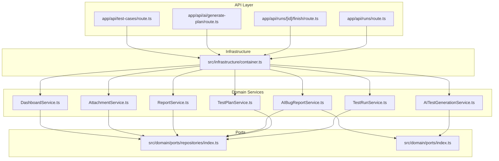
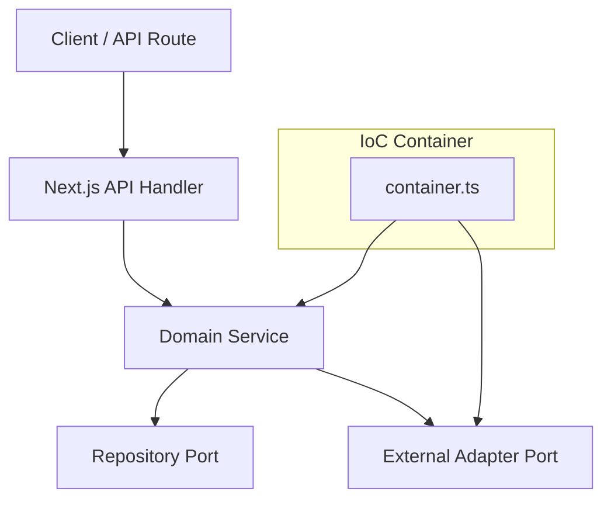
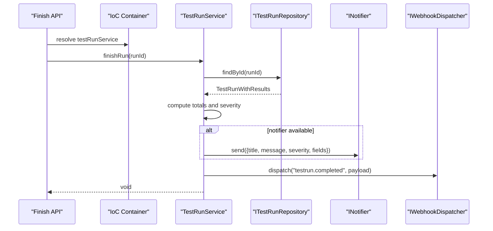
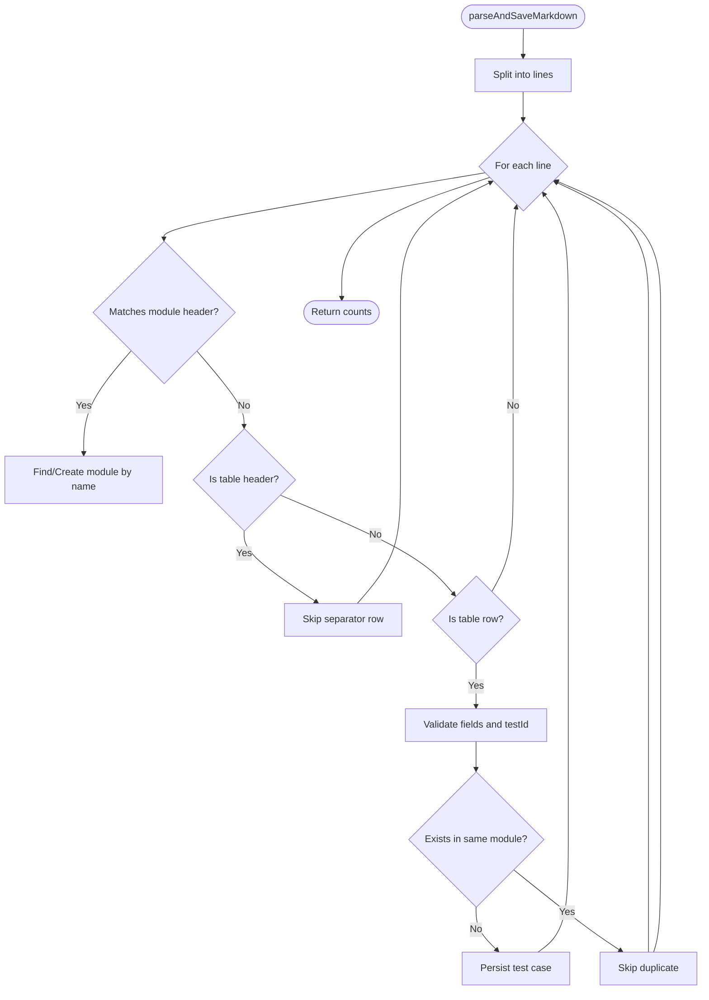
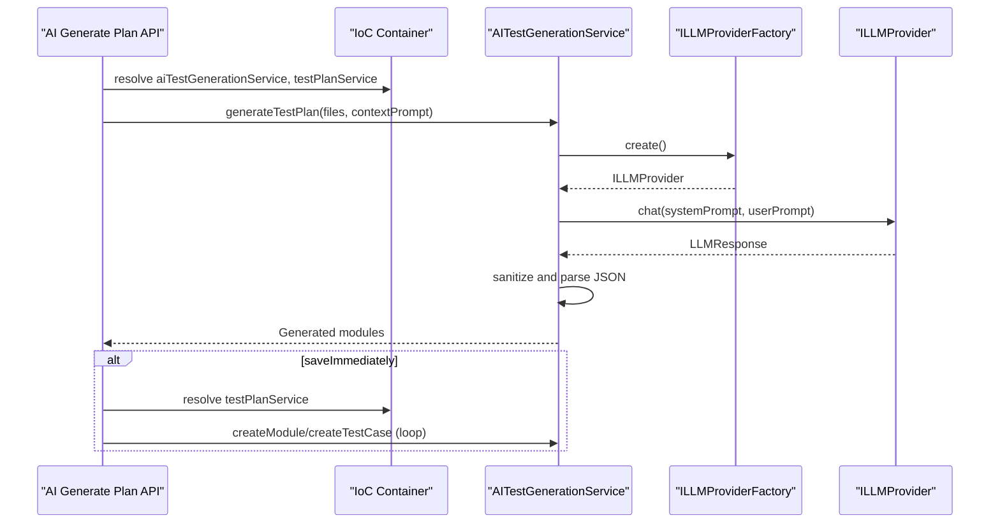
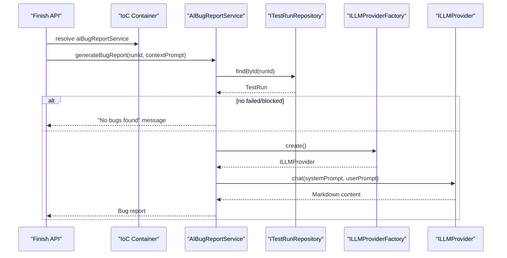
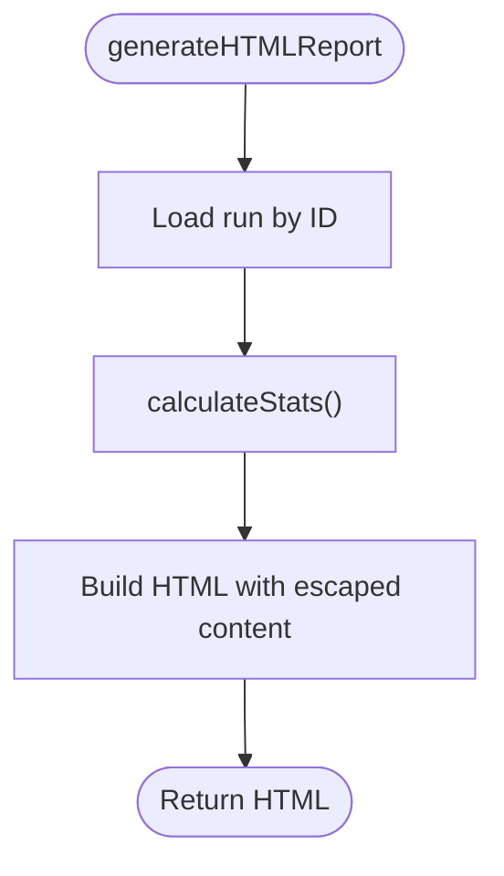
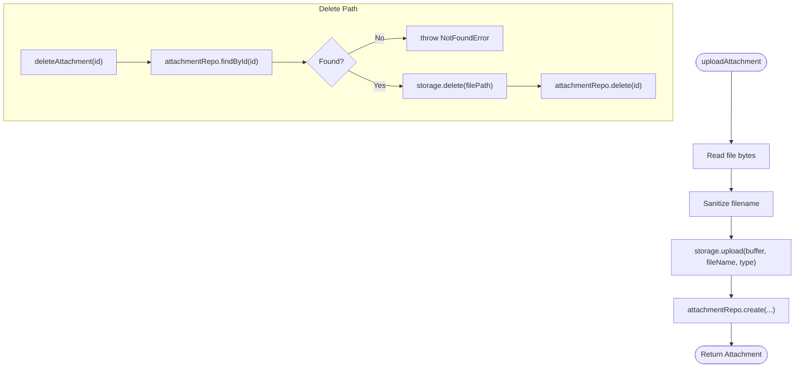
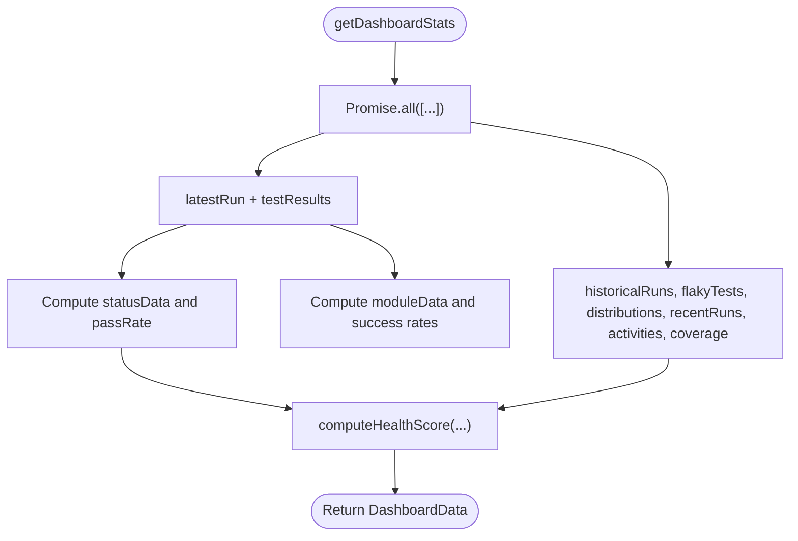
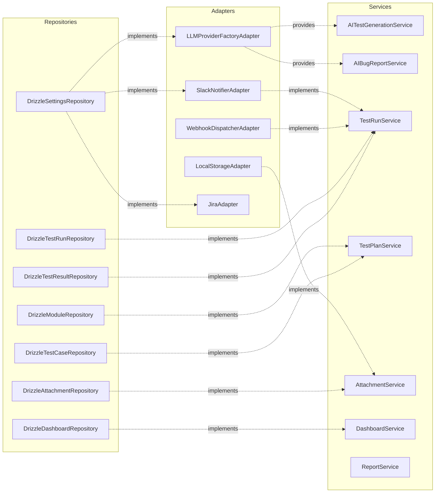

# Service Layer and Business Logic

<cite>
**Referenced Files in This Document**
- [container.ts](file://src/infrastructure/container.ts)
- [index.ts](file://src/domain/services/index.ts)
- [TestRunService.ts](file://src/domain/services/TestRunService.ts)
- [AITestGenerationService.ts](file://src/domain/services/AITestGenerationService.ts)
- [AIBugReportService.ts](file://src/domain/services/AIBugReportService.ts)
- [ReportService.ts](file://src/domain/services/ReportService.ts)
- [TestPlanService.ts](file://src/domain/services/TestPlanService.ts)
- [AttachmentService.ts](file://src/domain/services/AttachmentService.ts)
- [DashboardService.ts](file://src/domain/services/DashboardService.ts)
- [route.ts](file://app/api/runs/route.ts)
- [route.ts](file://app/api/runs/[id]/finish/route.ts)
- [route.ts](file://app/api/ai/generate-plan/route.ts)
- [route.ts](file://app/api/test-cases/route.ts)
- [index.ts](file://src/domain/ports/index.ts)
- [index.ts](file://src/domain/ports/repositories/index.ts)
</cite>

## Table of Contents
1. [Introduction](#introduction)
2. [Project Structure](#project-structure)
3. [Core Components](#core-components)
4. [Architecture Overview](#architecture-overview)
5. [Detailed Component Analysis](#detailed-component-analysis)
6. [Dependency Analysis](#dependency-analysis)
7. [Performance Considerations](#performance-considerations)
8. [Troubleshooting Guide](#troubleshooting-guide)
9. [Conclusion](#conclusion)

## Introduction
This document explains the service layer and business logic of the test management platform. It focuses on how domain services orchestrate business operations, encapsulate workflows, enforce business rules, and coordinate between repositories, adapters, and domain models. The service layer adheres to clean architecture principles by depending on abstractions (ports), delegating infrastructure concerns to adapters, and keeping business logic independent of external frameworks and transports.

## Project Structure
The service layer resides under src/domain/services and is wired via an IoC container in src/infrastructure/container.ts. API routes in app/api consume named exports from the container to invoke services, ensuring separation of concerns and testability.

**Diagram sources**
- [container.ts:33-91](file://src/infrastructure/container.ts#L33-L91)
- [route.ts:1-26](file://app/api/runs/route.ts#L1-L26)
- [route.ts:1-15](file://app/api/runs/[id]/finish/route.ts#L1-L15)
- [route.ts:1-32](file://app/api/ai/generate-plan/route.ts#L1-L32)
- [route.ts:1-37](file://app/api/test-cases/route.ts#L1-L37)
- [index.ts:1-7](file://src/domain/ports/repositories/index.ts#L1-L7)
- [index.ts:1-19](file://src/domain/ports/index.ts#L1-L19)

**Section sources**
- [container.ts:1-126](file://src/infrastructure/container.ts#L1-L126)
- [index.ts:1-7](file://src/domain/services/index.ts#L1-L7)

## Core Components
- TestRunService: Manages test run lifecycle, result updates, notifications, webhooks, and completion analytics.
- TestPlanService: Parses Markdown test plans and persists modules and test cases.
- AITestGenerationService: Generates test plans from code files using an LLM provider factory.
- AIBugReportService: Produces structured bug reports from failed/blocked results using an LLM.
- ReportService: Generates HTML reports from test run results.
- AttachmentService: Handles file uploads and deletions via a storage provider abstraction.
- DashboardService: Aggregates statistics and computes health metrics for dashboards.
- Integration adapters: Slack notifier, webhook dispatcher, LLM provider factory, storage provider, and Jira adapter are injected as external ports.

Responsibilities covered:
- Test case management: creation, grouping, parsing, and persistence.
- Test run execution: creation, result updates, renaming, deletion, and completion.
- AI integration: test plan generation and bug report synthesis.
- Reporting: HTML report generation and dashboard analytics.
- Error handling: explicit NotFoundError and robust JSON parsing safeguards.

**Section sources**
- [TestRunService.ts:14-125](file://src/domain/services/TestRunService.ts#L14-L125)
- [TestPlanService.ts:9-110](file://src/domain/services/TestPlanService.ts#L9-L110)
- [AITestGenerationService.ts:25-82](file://src/domain/services/AITestGenerationService.ts#L25-L82)
- [AIBugReportService.ts:10-70](file://src/domain/services/AIBugReportService.ts#L10-L70)
- [ReportService.ts:9-110](file://src/domain/services/ReportService.ts#L9-L110)
- [AttachmentService.ts:11-52](file://src/domain/services/AttachmentService.ts#L11-L52)
- [DashboardService.ts:10-182](file://src/domain/services/DashboardService.ts#L10-L182)
- [container.ts:52-61](file://src/infrastructure/container.ts#L52-L61)

## Architecture Overview
The service layer follows clean architecture:
- Domain services depend on ports (interfaces) rather than concrete implementations.
- Infrastructure adapters implement ports and are injected into services via the IoC container.
- API routes are thin controllers that validate requests, resolve services from the container, and orchestrate calls.

**Diagram sources**
- [container.ts:33-91](file://src/infrastructure/container.ts#L33-L91)
- [route.ts:1-26](file://app/api/runs/route.ts#L1-L26)

**Section sources**
- [container.ts:33-91](file://src/infrastructure/container.ts#L33-L91)
- [index.ts:1-19](file://src/domain/ports/index.ts#L1-L19)

## Detailed Component Analysis

### TestRunService
Responsibilities:
- Retrieve runs, fetch by ID with existence checks, create runs, and initialize UNTESTED results for all test cases.
- Rename runs, update individual results, delete runs, and finish runs.
- On completion, compute pass/fail/block/untested counts, derive severity, send notifications via notifier, and dispatch webhooks.

Key business rules:
- Creation triggers automatic UNTESTED result creation per test case.
- Completion severity depends on presence of failures or blocks; success requires no untested items.
- Webhook events are dispatched for created, updated, deleted, and completed runs.

Error handling:
- Throws NotFoundError when accessing non-existent runs during rename, delete, or finish operations.

**Diagram sources**
- [route.ts:7-14](file://app/api/runs/[id]/finish/route.ts#L7-L14)
- [TestRunService.ts:86-123](file://src/domain/services/TestRunService.ts#L86-L123)

**Section sources**
- [TestRunService.ts:14-125](file://src/domain/services/TestRunService.ts#L14-L125)
- [route.ts:1-15](file://app/api/runs/[id]/finish/route.ts#L1-L15)

### TestPlanService
Responsibilities:
- Create modules (deduplicate by name) and persist test cases.
- Parse Markdown test plans to extract modules and test cases, skipping headers and separators, and avoiding duplicates.

Business rule enforcement:
- Module deduplication by name and project.
- Skips table header rows and malformed entries.
- Ensures uniqueness by testId and module association.

**Diagram sources**
- [TestPlanService.ts:35-108](file://src/domain/services/TestPlanService.ts#L35-L108)

**Section sources**
- [TestPlanService.ts:9-110](file://src/domain/services/TestPlanService.ts#L9-L110)

### AITestGenerationService
Responsibilities:
- Generate test plans from source code files using an LLM provider obtained from a factory.
- Enforce strict JSON schema via system prompts and sanitize provider responses.

Business rule enforcement:
- Validates and sanitizes JSON output; rejects hallucinations or markdown wrappers.
- Uses temperature and token limits to improve reliability.

**Diagram sources**
- [route.ts:8-31](file://app/api/ai/generate-plan/route.ts#L8-L31)
- [AITestGenerationService.ts:28-80](file://src/domain/services/AITestGenerationService.ts#L28-L80)

**Section sources**
- [AITestGenerationService.ts:25-82](file://src/domain/services/AITestGenerationService.ts#L25-L82)
- [route.ts:1-32](file://app/api/ai/generate-plan/route.ts#L1-L32)

### AIBugReportService
Responsibilities:
- Generate structured Markdown bug reports from failed or blocked results.
- Uses LLM with a system prompt tailored for QA-to-dev communication.

Business rule enforcement:
- Filters results by status (FAILED or BLOCKED).
- Returns a friendly message if no bugs are found.
- Leverages context prompt to focus developer attention.

**Diagram sources**
- [route.ts:11-13](file://app/api/runs/[id]/finish/route.ts#L11-L13)
- [AIBugReportService.ts:16-68](file://src/domain/services/AIBugReportService.ts#L16-L68)

**Section sources**
- [AIBugReportService.ts:10-70](file://src/domain/services/AIBugReportService.ts#L10-L70)

### ReportService
Responsibilities:
- Generate HTML reports from test run results.
- Compute statistics and escape HTML to prevent XSS.

Business rule enforcement:
- Calculates totals and per-status counts.
- Escapes user-provided content in generated HTML.

**Diagram sources**
- [ReportService.ts:14-109](file://src/domain/services/ReportService.ts#L14-L109)

**Section sources**
- [ReportService.ts:9-110](file://src/domain/services/ReportService.ts#L9-L110)

### AttachmentService
Responsibilities:
- Upload files to a storage provider and record metadata in the attachment repository.
- Delete attachments and compute URLs via the storage provider.

Business rule enforcement:
- Sanitizes filenames to safe characters.
- Wraps storage deletion errors to avoid leaking infrastructure details.

**Diagram sources**
- [AttachmentService.ts:17-50](file://src/domain/services/AttachmentService.ts#L17-L50)

**Section sources**
- [AttachmentService.ts:11-52](file://src/domain/services/AttachmentService.ts#L11-L52)

### DashboardService
Responsibilities:
- Aggregate dashboard metrics: total cases/runs, latest run, historical runs, flaky tests, priority distribution, recent runs, activities, coverage, and pass-rate deltas.
- Compute a health score using weighted factors: pass rate, flakiness, freshness, and coverage.

Business rule enforcement:
- Parallelizes repository calls for performance.
- Computes pass rates and module-level success rates.
- Applies a bounded scoring formula for health.

**Diagram sources**
- [DashboardService.ts:17-147](file://src/domain/services/DashboardService.ts#L17-L147)

**Section sources**
- [DashboardService.ts:10-182](file://src/domain/services/DashboardService.ts#L10-L182)

## Dependency Analysis
The IoC container wires domain services with concrete adapters and repositories. Ports define contracts that keep services decoupled from infrastructure.

**Diagram sources**
- [container.ts:1-126](file://src/infrastructure/container.ts#L1-L126)
- [index.ts:1-19](file://src/domain/ports/index.ts#L1-L19)
- [index.ts:1-7](file://src/domain/ports/repositories/index.ts#L1-L7)

**Section sources**
- [container.ts:33-91](file://src/infrastructure/container.ts#L33-L91)
- [index.ts:1-19](file://src/domain/ports/index.ts#L1-L19)
- [index.ts:1-7](file://src/domain/ports/repositories/index.ts#L1-L7)

## Performance Considerations
- Parallelization: DashboardService performs multiple repository queries concurrently to reduce latency.
- Minimal allocations: Services compute aggregates in-memory without additional ORM overhead.
- Early exits: AIBugReportService returns immediately when no failing or blocked results are present.
- Webhooks and notifications: Dispatched after state changes to avoid blocking critical paths.

[No sources needed since this section provides general guidance]

## Troubleshooting Guide
Common issues and resolutions:
- Validation errors in API routes: Ensure required query/body parameters are provided; API routes return structured validation errors.
- Not found errors: Services throw explicit NotFoundError for missing resources; callers should handle and map to appropriate HTTP status codes.
- LLM JSON parsing failures: AITestGenerationService sanitizes and validates JSON; if parsing fails, verify provider settings and response formats.
- Storage deletion failures: AttachmentService logs and tolerates storage deletion errors to prevent partial cleanup failures.

**Section sources**
- [route.ts:12-14](file://app/api/runs/route.ts#L12-L14)
- [TestRunService.ts:29-29](file://src/domain/services/TestRunService.ts#L29-L29)
- [AITestGenerationService.ts:76-79](file://src/domain/services/AITestGenerationService.ts#L76-L79)
- [AttachmentService.ts:42-43](file://src/domain/services/AttachmentService.ts#L42-L43)

## Conclusion
The service layer cleanly encapsulates business workflows, enforces domain rules, and coordinates repositories and adapters through well-defined ports. API routes remain thin, relying on the IoC container to wire services with infrastructure. This design supports maintainability, testability, and adherence to clean architecture principles while enabling AI-driven capabilities and robust reporting.