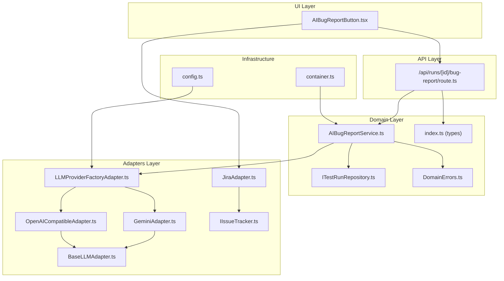
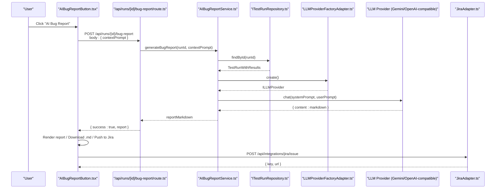
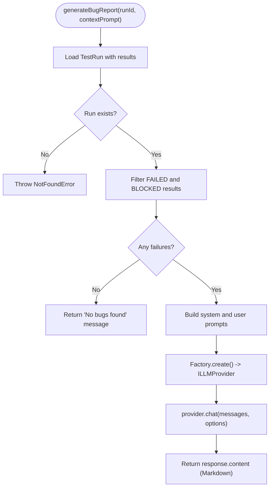
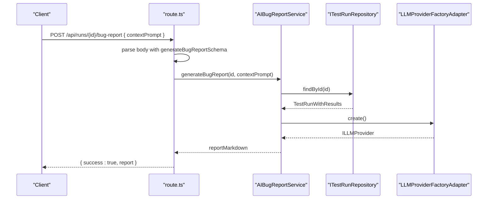
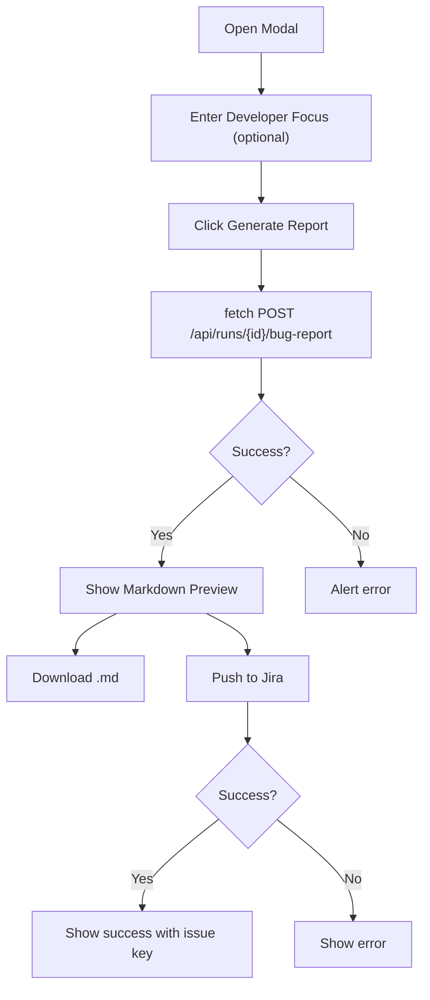
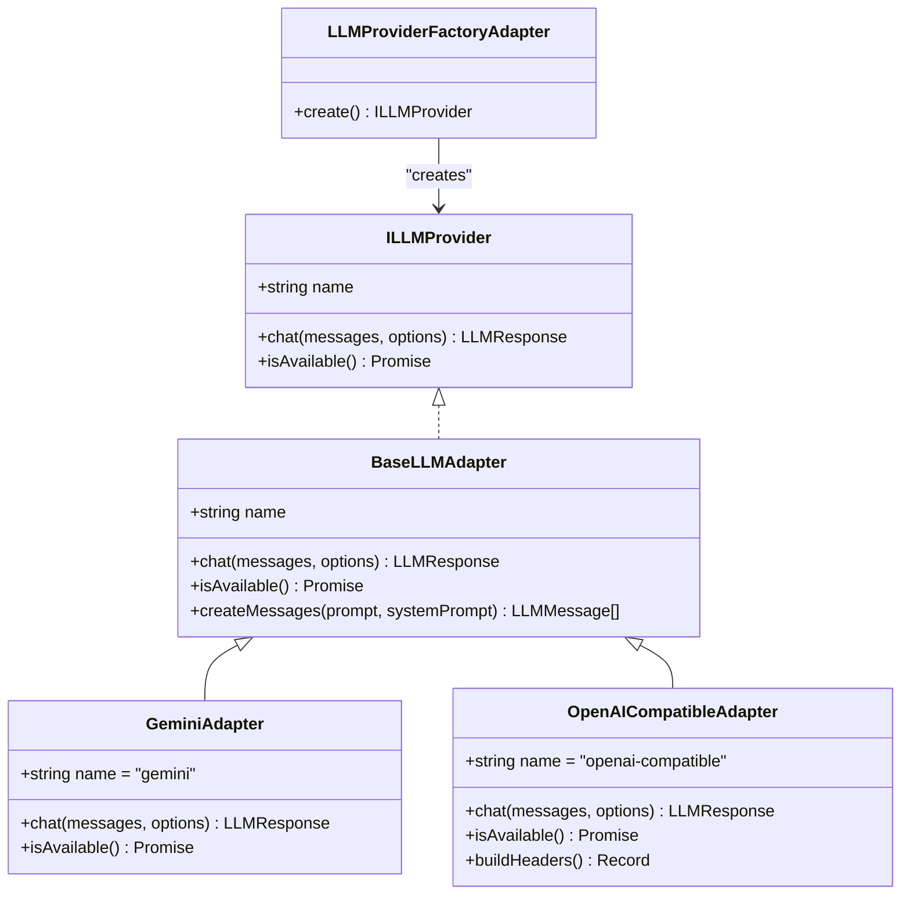
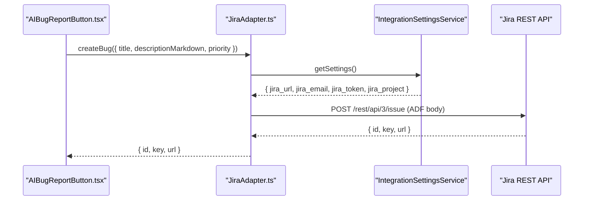
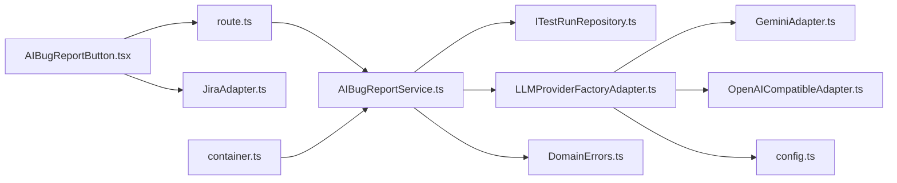
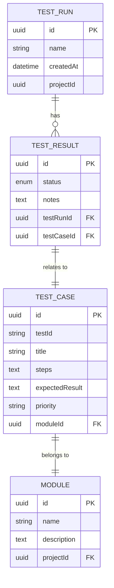

# AI Bug Reporting

<cite>
**Referenced Files in This Document**
- [AIBugReportService.ts](file://src/domain/services/AIBugReportService.ts)
- [route.ts](file://app/api/runs/[id]/bug-report/route.ts)
- [AIBugReportButton.tsx](file://src/ui/test-run/AIBugReportButton.tsx)
- [LLMProviderFactoryAdapter.ts](file://src/adapters/llm/LLMProviderFactoryAdapter.ts)
- [BaseLLMAdapter.ts](file://src/adapters/llm/BaseLLMAdapter.ts)
- [GeminiAdapter.ts](file://src/adapters/llm/GeminiAdapter.ts)
- [OpenAICompatibleAdapter.ts](file://src/adapters/llm/OpenAICompatibleAdapter.ts)
- [ITestRunRepository.ts](file://src/domain/ports/repositories/ITestRunRepository.ts)
- [container.ts](file://src/infrastructure/container.ts)
- [TestRunService.ts](file://src/domain/services/TestRunService.ts)
- [index.ts](file://src/domain/types/index.ts)
- [schemas.ts](file://app/api/_lib/schemas.ts)
- [JiraAdapter.ts](file://src/adapters/issue-tracker/JiraAdapter.ts)
- [DomainErrors.ts](file://src/domain/errors/DomainErrors.ts)
- [config.ts](file://src/infrastructure/config.ts)
- [IIssueTracker.ts](file://src/domain/ports/IIssueTracker.ts)
</cite>

## Table of Contents
1. [Introduction](#introduction)
2. [Project Structure](#project-structure)
3. [Core Components](#core-components)
4. [Architecture Overview](#architecture-overview)
5. [Detailed Component Analysis](#detailed-component-analysis)
6. [Dependency Analysis](#dependency-analysis)
7. [Performance Considerations](#performance-considerations)
8. [Troubleshooting Guide](#troubleshooting-guide)
9. [Conclusion](#conclusion)
10. [Appendices](#appendices)

## Introduction
This document explains the AI Bug Reporting feature that generates structured bug reports from failed and blocked test executions. It covers the AIBugReportService implementation, the bug report template structure, the failure analysis workflow, and integration with test result data. It also documents prompt engineering for bug report generation, including reproduction steps, expected vs actual results, and severity assessment. Practical examples show how to process failed test cases, extract relevant debugging information, and produce comprehensive bug reports. Integration with existing test result tracking, report formatting options, and customization of bug report templates are addressed, along with error handling for incomplete test data and provider response issues.

## Project Structure
The AI Bug Reporting feature spans the domain, adapters, infrastructure, API, and UI layers:

- Domain service orchestrating bug report generation
- LLM provider abstraction and adapters
- API route exposing the generation endpoint
- UI component for initiating generation and exporting results
- Integration with Jira for pushing generated reports
- Type definitions and repository interfaces for test run data

**Diagram sources**
- [AIBugReportButton.tsx:1-195](file://src/ui/test-run/AIBugReportButton.tsx#L1-L195)
- [route.ts:1-19](file://app/api/runs/[id]/bug-report/route.ts#L1-L19)
- [AIBugReportService.ts:1-70](file://src/domain/services/AIBugReportService.ts#L1-L70)
- [ITestRunRepository.ts:1-12](file://src/domain/ports/repositories/ITestRunRepository.ts#L1-L12)
- [LLMProviderFactoryAdapter.ts:1-43](file://src/adapters/llm/LLMProviderFactoryAdapter.ts#L1-L43)
- [BaseLLMAdapter.ts:1-26](file://src/adapters/llm/BaseLLMAdapter.ts#L1-L26)
- [GeminiAdapter.ts:1-67](file://src/adapters/llm/GeminiAdapter.ts#L1-L67)
- [OpenAICompatibleAdapter.ts:1-97](file://src/adapters/llm/OpenAICompatibleAdapter.ts#L1-L97)
- [JiraAdapter.ts:1-82](file://src/adapters/issue-tracker/JiraAdapter.ts#L1-L82)
- [container.ts:1-126](file://src/infrastructure/container.ts#L1-L126)
- [config.ts:1-28](file://src/infrastructure/config.ts#L1-L28)

**Section sources**
- [AIBugReportService.ts:1-70](file://src/domain/services/AIBugReportService.ts#L1-L70)
- [route.ts:1-19](file://app/api/runs/[id]/bug-report/route.ts#L1-L19)
- [AIBugReportButton.tsx:1-195](file://src/ui/test-run/AIBugReportButton.tsx#L1-L195)
- [LLMProviderFactoryAdapter.ts:1-43](file://src/adapters/llm/LLMProviderFactoryAdapter.ts#L1-L43)
- [BaseLLMAdapter.ts:1-26](file://src/adapters/llm/BaseLLMAdapter.ts#L1-L26)
- [GeminiAdapter.ts:1-67](file://src/adapters/llm/GeminiAdapter.ts#L1-L67)
- [OpenAICompatibleAdapter.ts:1-97](file://src/adapters/llm/OpenAICompatibleAdapter.ts#L1-L97)
- [ITestRunRepository.ts:1-12](file://src/domain/ports/repositories/ITestRunRepository.ts#L1-L12)
- [container.ts:1-126](file://src/infrastructure/container.ts#L1-L126)
- [index.ts:1-196](file://src/domain/types/index.ts#L1-L196)
- [schemas.ts:58-62](file://app/api/_lib/schemas.ts#L58-L62)
- [JiraAdapter.ts:1-82](file://src/adapters/issue-tracker/JiraAdapter.ts#L1-L82)
- [DomainErrors.ts:1-39](file://src/domain/errors/DomainErrors.ts#L1-L39)
- [config.ts:1-28](file://src/infrastructure/config.ts#L1-L28)

## Core Components
- AIBugReportService: Orchestrates bug report generation by fetching a test run, filtering failed/blocked results, building prompts, and delegating to an LLM provider.
- LLM Provider Abstractions: ILLMProvider defines the contract; BaseLLMAdapter provides helpers; concrete adapters implement Gemini and OpenAI-compatible providers.
- API Route: Exposes a POST endpoint to trigger generation and returns a Markdown-formatted bug report.
- UI Component: Provides a modal to configure developer context, generate the report, download it, and push to Jira.
- Jira Integration: Converts Markdown to ADF and posts a bug issue to Jira using stored credentials.
- Type System: Defines TestRun, TestResult, TestCase, and related aggregates used to construct prompts and group bugs by module.

Key responsibilities:
- Extract failed/blocked results from a TestRun
- Build structured prompts with context and test case details
- Delegate to a provider selected via factory
- Return Markdown-formatted bug report
- Support optional developer focus/context prompt
- Enable download and Jira push

**Section sources**
- [AIBugReportService.ts:10-68](file://src/domain/services/AIBugReportService.ts#L10-L68)
- [LLMProviderFactoryAdapter.ts:15-41](file://src/adapters/llm/LLMProviderFactoryAdapter.ts#L15-L41)
- [BaseLLMAdapter.ts:3-25](file://src/adapters/llm/BaseLLMAdapter.ts#L3-L25)
- [GeminiAdapter.ts:5-66](file://src/adapters/llm/GeminiAdapter.ts#L5-L66)
- [OpenAICompatibleAdapter.ts:8-96](file://src/adapters/llm/OpenAICompatibleAdapter.ts#L8-L96)
- [route.ts:8-18](file://app/api/runs/[id]/bug-report/route.ts#L8-L18)
- [AIBugReportButton.tsx:11-173](file://src/ui/test-run/AIBugReportButton.tsx#L11-L173)
- [JiraAdapter.ts:4-80](file://src/adapters/issue-tracker/JiraAdapter.ts#L4-L80)
- [index.ts:23-51](file://src/domain/types/index.ts#L23-L51)

## Architecture Overview
The AI Bug Reporting feature follows a layered architecture with clear separation of concerns:

- UI triggers generation and optionally pushes to Jira
- API validates input and delegates to the domain service
- Domain service retrieves test run data and builds prompts
- Factory selects an LLM provider based on settings/config
- Provider returns a Markdown-formatted report
- UI supports download and Jira integration

**Diagram sources**
- [AIBugReportButton.tsx:20-84](file://src/ui/test-run/AIBugReportButton.tsx#L20-L84)
- [route.ts:8-18](file://app/api/runs/[id]/bug-report/route.ts#L8-L18)
- [AIBugReportService.ts:16-67](file://src/domain/services/AIBugReportService.ts#L16-L67)
- [ITestRunRepository.ts:5](file://src/domain/ports/repositories/ITestRunRepository.ts#L5)
- [LLMProviderFactoryAdapter.ts:18-41](file://src/adapters/llm/LLMProviderFactoryAdapter.ts#L18-L41)
- [GeminiAdapter.ts:22-60](file://src/adapters/llm/GeminiAdapter.ts#L22-L60)
- [OpenAICompatibleAdapter.ts:34-80](file://src/adapters/llm/OpenAICompatibleAdapter.ts#L34-L80)
- [JiraAdapter.ts:7-80](file://src/adapters/issue-tracker/JiraAdapter.ts#L7-L80)

## Detailed Component Analysis

### AIBugReportService
Responsibilities:
- Load a test run with results
- Filter failed and blocked results
- Construct system and user prompts
- Invoke provider chat with structured options
- Return Markdown-formatted report

Prompt engineering highlights:
- System prompt establishes role and expectations
- User prompt includes developer focus, run metadata, and aggregated failed test case details
- Structured fields: Test ID, Title, Module, Status, Priority, Steps, Expected Result, Actual Result/QA Notes
- Output format enforced as Markdown

Processing logic:
- Validates run existence
- Filters results by status
- Returns a friendly message when no failures are present
- Builds messages array with system and user roles
- Configures temperature, response format, and max tokens

**Diagram sources**
- [AIBugReportService.ts:16-67](file://src/domain/services/AIBugReportService.ts#L16-L67)
- [ITestRunRepository.ts:5](file://src/domain/ports/repositories/ITestRunRepository.ts#L5)
- [LLMProviderFactoryAdapter.ts:18-41](file://src/adapters/llm/LLMProviderFactoryAdapter.ts#L18-L41)

**Section sources**
- [AIBugReportService.ts:10-68](file://src/domain/services/AIBugReportService.ts#L10-L68)
- [index.ts:179-184](file://src/domain/types/index.ts#L179-L184)

### Prompt Engineering and Template Structure
Template structure (derived from prompts):
- Executive summary
- Grouped by module
- Prioritization: P1 > P2 > P3 > P4, BLOCKED > FAILED
- For each bug:
  - Test ID
  - Title
  - Priority
  - Expected Result
  - Actual Result/QA Notes
- Actionable reproduction steps derived from test case steps
- Investigation suggestions

Formatting:
- Output format enforced as Markdown
- Max tokens and temperature tuned for concise, deterministic output

Customization:
- Developer focus/context prompt is optional and injected into the user prompt
- Provider/model selection via settings/config

**Section sources**
- [AIBugReportService.ts:27-65](file://src/domain/services/AIBugReportService.ts#L27-L65)
- [schemas.ts:60-62](file://app/api/_lib/schemas.ts#L60-L62)
- [config.ts:13-18](file://src/infrastructure/config.ts#L13-L18)

### API Integration and Request Flow
- Endpoint: POST /api/runs/{id}/bug-report
- Request body validated by generateBugReportSchema
- Service invoked via dependency-injected container
- Response: { success: true, report: string }

**Diagram sources**
- [route.ts:8-18](file://app/api/runs/[id]/bug-report/route.ts#L8-L18)
- [AIBugReportService.ts:16-67](file://src/domain/services/AIBugReportService.ts#L16-L67)
- [ITestRunRepository.ts:5](file://src/domain/ports/repositories/ITestRunRepository.ts#L5)
- [LLMProviderFactoryAdapter.ts:18-41](file://src/adapters/llm/LLMProviderFactoryAdapter.ts#L18-L41)

**Section sources**
- [route.ts:8-18](file://app/api/runs/[id]/bug-report/route.ts#L8-L18)
- [schemas.ts:60-62](file://app/api/_lib/schemas.ts#L60-L62)
- [container.ts:57](file://src/infrastructure/container.ts#L57)

### UI Integration and User Experience
- Modal allows entering developer focus/context
- Generates report via fetch to API endpoint
- Renders Markdown preview
- Supports download as .md file
- Optional push to Jira with pre-filled title and priority

**Diagram sources**
- [AIBugReportButton.tsx:20-84](file://src/ui/test-run/AIBugReportButton.tsx#L20-L84)

**Section sources**
- [AIBugReportButton.tsx:11-173](file://src/ui/test-run/AIBugReportButton.tsx#L11-L173)

### LLM Provider Selection and Implementation
- Factory selects provider based on persisted settings or defaults
- GeminiAdapter and OpenAICompatibleAdapter implement BaseLLMAdapter
- Providers support chat completion with configurable options

**Diagram sources**
- [BaseLLMAdapter.ts:3-25](file://src/adapters/llm/BaseLLMAdapter.ts#L3-L25)
- [GeminiAdapter.ts:5-66](file://src/adapters/llm/GeminiAdapter.ts#L5-L66)
- [OpenAICompatibleAdapter.ts:8-96](file://src/adapters/llm/OpenAICompatibleAdapter.ts#L8-L96)
- [LLMProviderFactoryAdapter.ts:15-41](file://src/adapters/llm/LLMProviderFactoryAdapter.ts#L15-L41)

**Section sources**
- [LLMProviderFactoryAdapter.ts:15-41](file://src/adapters/llm/LLMProviderFactoryAdapter.ts#L15-L41)
- [BaseLLMAdapter.ts:3-25](file://src/adapters/llm/BaseLLMAdapter.ts#L3-L25)
- [GeminiAdapter.ts:5-66](file://src/adapters/llm/GeminiAdapter.ts#L5-L66)
- [OpenAICompatibleAdapter.ts:8-96](file://src/adapters/llm/OpenAICompatibleAdapter.ts#L8-L96)

### Jira Integration
- Converts Markdown description to Atlassian Document Format (ADF)
- Uses stored Jira settings for authentication and project
- Creates a Bug issue with summary, description, and issue type

**Diagram sources**
- [AIBugReportButton.tsx:56-84](file://src/ui/test-run/AIBugReportButton.tsx#L56-L84)
- [JiraAdapter.ts:7-80](file://src/adapters/issue-tracker/JiraAdapter.ts#L7-L80)
- [IIssueTracker.ts:1-16](file://src/domain/ports/IIssueTracker.ts#L1-L16)

**Section sources**
- [AIBugReportButton.tsx:56-84](file://src/ui/test-run/AIBugReportButton.tsx#L56-L84)
- [JiraAdapter.ts:4-80](file://src/adapters/issue-tracker/JiraAdapter.ts#L4-L80)
- [IIssueTracker.ts:1-16](file://src/domain/ports/IIssueTracker.ts#L1-L16)

## Dependency Analysis
- AIBugReportService depends on ITestRunRepository and ILLMProviderFactory
- API route depends on the service via the IoC container
- UI depends on the API and Jira adapter
- LLM provider selection depends on settings/config
- Jira adapter depends on integration settings

**Diagram sources**
- [AIBugReportButton.tsx:20-84](file://src/ui/test-run/AIBugReportButton.tsx#L20-L84)
- [route.ts:8-18](file://app/api/runs/[id]/bug-report/route.ts#L8-L18)
- [AIBugReportService.ts:11-14](file://src/domain/services/AIBugReportService.ts#L11-L14)
- [ITestRunRepository.ts:3-11](file://src/domain/ports/repositories/ITestRunRepository.ts#L3-L11)
- [LLMProviderFactoryAdapter.ts:15-41](file://src/adapters/llm/LLMProviderFactoryAdapter.ts#L15-L41)
- [GeminiAdapter.ts:5-66](file://src/adapters/llm/GeminiAdapter.ts#L5-L66)
- [OpenAICompatibleAdapter.ts:8-96](file://src/adapters/llm/OpenAICompatibleAdapter.ts#L8-L96)
- [JiraAdapter.ts:4-80](file://src/adapters/issue-tracker/JiraAdapter.ts#L4-L80)
- [container.ts:57](file://src/infrastructure/container.ts#L57)
- [config.ts:13-18](file://src/infrastructure/config.ts#L13-L18)

**Section sources**
- [container.ts:57](file://src/infrastructure/container.ts#L57)
- [AIBugReportService.ts:11-14](file://src/domain/services/AIBugReportService.ts#L11-L14)
- [LLMProviderFactoryAdapter.ts:15-41](file://src/adapters/llm/LLMProviderFactoryAdapter.ts#L15-L41)

## Performance Considerations
- Temperature and maxTokens are tuned to balance determinism and length
- Filtering failures early avoids unnecessary provider calls
- Provider availability checks can prevent wasted requests
- Consider batching or pagination for very large runs (not currently implemented)
- Caching provider initialization reduces overhead

[No sources needed since this section provides general guidance]

## Troubleshooting Guide
Common issues and resolutions:
- Missing run: NotFoundError is thrown when runId is invalid
- No failures: Friendly message returned when no FAILED or BLOCKED results
- Provider not configured: GeminiAdapter throws if uninitialized; OpenAI-compatible requires API key or local base URL
- Network/API errors: Provider adapters surface descriptive errors
- Jira misconfiguration: JiraAdapter validates settings and returns clear errors
- UI connectivity: Modal handles fetch errors and displays alerts

Error handling patterns:
- DomainError hierarchy for typed errors
- API route catches parsing/validation errors and surfaces messages
- UI components guard against missing report and handle exceptions

**Section sources**
- [AIBugReportService.ts:18](file://src/domain/services/AIBugReportService.ts#L18)
- [AIBugReportService.ts:21-23](file://src/domain/services/AIBugReportService.ts#L21-L23)
- [GeminiAdapter.ts:23-25](file://src/adapters/llm/GeminiAdapter.ts#L23-L25)
- [OpenAICompatibleAdapter.ts:84-95](file://src/adapters/llm/OpenAICompatibleAdapter.ts#L84-L95)
- [JiraAdapter.ts:14-16](file://src/adapters/issue-tracker/JiraAdapter.ts#L14-L16)
- [AIBugReportButton.tsx:35-40](file://src/ui/test-run/AIBugReportButton.tsx#L35-L40)
- [DomainErrors.ts:18-38](file://src/domain/errors/DomainErrors.ts#L18-L38)

## Conclusion
The AI Bug Reporting feature integrates UI, API, domain service, and LLM providers to transform failed test executions into structured, actionable bug reports. The system emphasizes modularity, configurability, and robustness, enabling teams to quickly triage issues, export reports, and integrate with Jira. Prompt engineering ensures consistent formatting and prioritization, while error handling and provider abstractions improve reliability.

[No sources needed since this section summarizes without analyzing specific files]

## Appendices

### Data Model Overview

**Diagram sources**
- [index.ts:34-51](file://src/domain/types/index.ts#L34-L51)

### Practical Examples

- Processing a failed test case:
  - Load TestRunWithResults by runId
  - Filter results where status is FAILED or BLOCKED
  - For each result, collect testCase.testId, title, module.name, steps, expectedResult, notes
  - Build user prompt with aggregated data and developer focus

- Extracting debugging information:
  - Use testCase.steps as reproduction steps
  - Use notes as QA notes for actual result
  - Use module.name for grouping and investigation hints

- Creating a comprehensive bug report:
  - System prompt defines structure and priorities
  - User prompt includes run metadata and test case details
  - Provider returns Markdown-formatted report

- Integrating with Jira:
  - Convert Markdown to ADF
  - Post issue with summary, description, and issue type
  - Display success with issue key and URL

**Section sources**
- [AIBugReportService.ts:44-56](file://src/domain/services/AIBugReportService.ts#L44-L56)
- [index.ts:179-184](file://src/domain/types/index.ts#L179-L184)
- [AIBugReportButton.tsx:43-54](file://src/ui/test-run/AIBugReportButton.tsx#L43-L54)
- [JiraAdapter.ts:27-54](file://src/adapters/issue-tracker/JiraAdapter.ts#L27-L54)