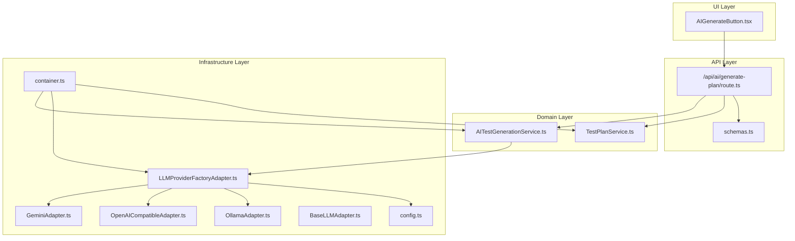
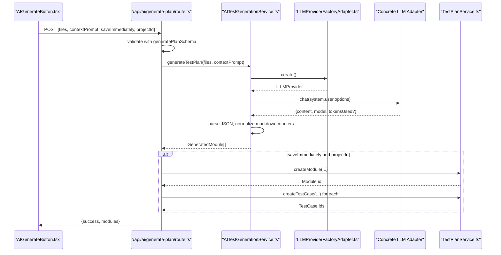
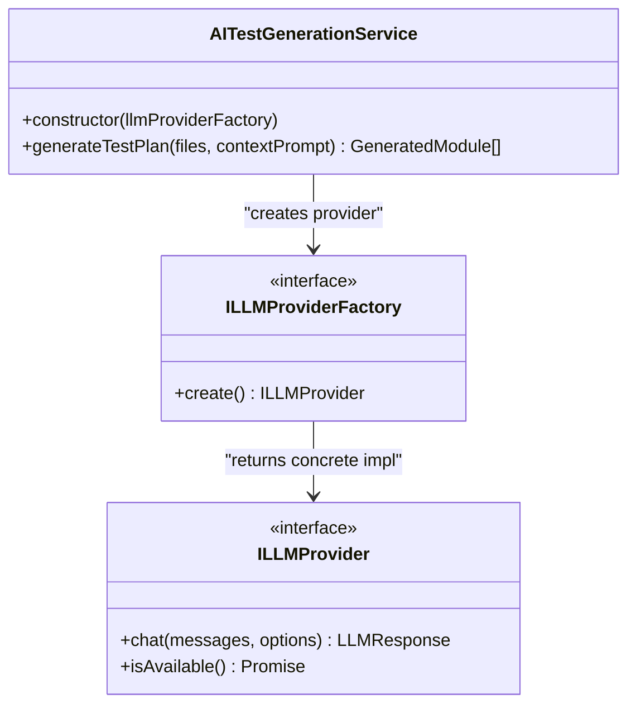
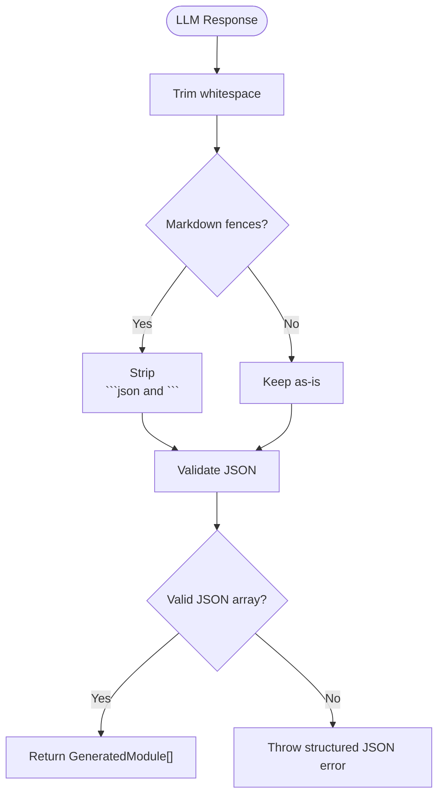
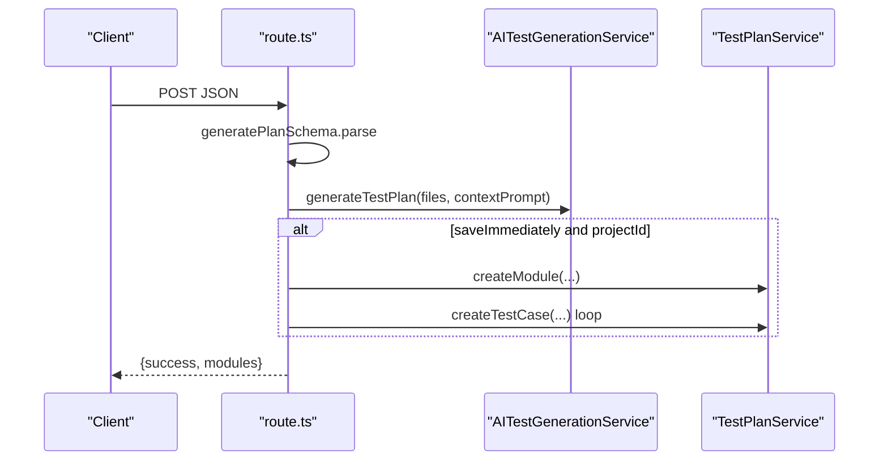
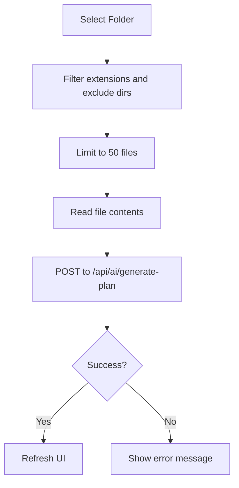
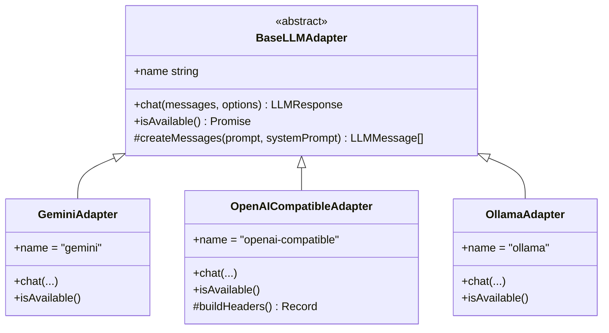
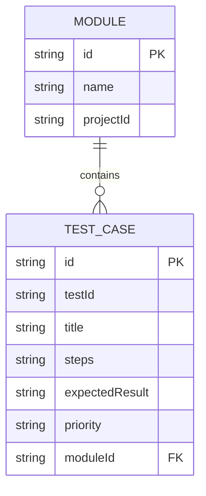
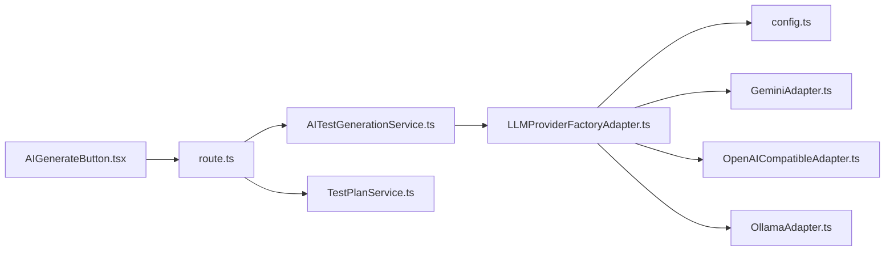

# AI Test Generation

<cite>
**Referenced Files in This Document**
- [AITestGenerationService.ts](file://src/domain/services/AITestGenerationService.ts)
- [route.ts](file://app/api/ai/generate-plan/route.ts)
- [AIGenerateButton.tsx](file://src/ui/test-design/AIGenerateButton.tsx)
- [LLMProviderFactoryAdapter.ts](file://src/adapters/llm/LLMProviderFactoryAdapter.ts)
- [GeminiAdapter.ts](file://src/adapters/llm/GeminiAdapter.ts)
- [OpenAICompatibleAdapter.ts](file://src/adapters/llm/OpenAICompatibleAdapter.ts)
- [OllamaAdapter.ts](file://src/adapters/llm/OllamaAdapter.ts)
- [BaseLLMAdapter.ts](file://src/adapters/llm/BaseLLMAdapter.ts)
- [container.ts](file://src/infrastructure/container.ts)
- [schemas.ts](file://app/api/_lib/schemas.ts)
- [TestPlanService.ts](file://src/domain/services/TestPlanService.ts)
- [config.ts](file://src/infrastructure/config.ts)
- [index.ts](file://src/domain/types/index.ts)
</cite>

## Table of Contents
1. [Introduction](#introduction)
2. [Project Structure](#project-structure)
3. [Core Components](#core-components)
4. [Architecture Overview](#architecture-overview)
5. [Detailed Component Analysis](#detailed-component-analysis)
6. [Dependency Analysis](#dependency-analysis)
7. [Performance Considerations](#performance-considerations)
8. [Troubleshooting Guide](#troubleshooting-guide)
9. [Conclusion](#conclusion)
10. [Appendices](#appendices)

## Introduction
This document explains the AI Test Generation feature that automatically produces structured test plans from source code. It covers the service implementation, prompt engineering, JSON response parsing, data models, provider configuration, API integration, and client-side usage. It also provides guidance on error handling, determinism tuning, and performance optimization for large codebases.

## Project Structure
The AI Test Generation feature spans three layers:
- Domain: Service orchestrating LLM prompts and parsing results
- Infrastructure: Provider factory and adapters for multiple LLM backends
- API/UI: Endpoint handler and client component for user-driven generation

**Diagram sources**
- [AIGenerateButton.tsx:1-166](file://src/ui/test-design/AIGenerateButton.tsx#L1-L166)
- [route.ts:1-32](file://app/api/ai/generate-plan/route.ts#L1-L32)
- [AITestGenerationService.ts:1-82](file://src/domain/services/AITestGenerationService.ts#L1-L82)
- [TestPlanService.ts:1-110](file://src/domain/services/TestPlanService.ts#L1-L110)
- [LLMProviderFactoryAdapter.ts:1-43](file://src/adapters/llm/LLMProviderFactoryAdapter.ts#L1-L43)
- [GeminiAdapter.ts:1-67](file://src/adapters/llm/GeminiAdapter.ts#L1-L67)
- [OpenAICompatibleAdapter.ts:1-97](file://src/adapters/llm/OpenAICompatibleAdapter.ts#L1-L97)
- [OllamaAdapter.ts:1-70](file://src/adapters/llm/OllamaAdapter.ts#L1-L70)
- [BaseLLMAdapter.ts:1-26](file://src/adapters/llm/BaseLLMAdapter.ts#L1-L26)
- [config.ts:1-28](file://src/infrastructure/config.ts#L1-L28)
- [container.ts:1-126](file://src/infrastructure/container.ts#L1-L126)
- [schemas.ts:1-92](file://app/api/_lib/schemas.ts#L1-L92)

**Section sources**
- [container.ts:1-126](file://src/infrastructure/container.ts#L1-L126)
- [route.ts:1-32](file://app/api/ai/generate-plan/route.ts#L1-L32)
- [AIGenerateButton.tsx:1-166](file://src/ui/test-design/AIGenerateButton.tsx#L1-L166)

## Core Components
- AITestGenerationService: Orchestrates system/user prompts, invokes provider, and parses structured JSON into GeneratedModule arrays.
- LLMProviderFactoryAdapter: Creates the appropriate LLM provider based on settings or defaults.
- LLM Adapters: Concrete providers (Gemini, OpenAI-compatible, Ollama) implementing a common interface.
- API Route: Validates input, calls the service, optionally saves results, and returns structured JSON.
- Client Component: Collects files, constructs context, and triggers generation via the API.
- TestPlanService: Persists generated modules and test cases when requested.

Key data models:
- CodeFile: Lightweight file abstraction with path and content.
- GeneratedTestCase: Test case fields aligned with domain types.
- GeneratedModule: Groups test cases under a module name.

**Section sources**
- [AITestGenerationService.ts:3-18](file://src/domain/services/AITestGenerationService.ts#L3-L18)
- [index.ts:23-32](file://src/domain/types/index.ts#L23-L32)
- [index.ts:68-75](file://src/domain/types/index.ts#L68-L75)

## Architecture Overview
The system follows a layered architecture:
- UI collects files and context, then posts to the API.
- API validates payload, delegates to AITestGenerationService.
- Service requests a provider from the factory, sends chat messages with strict JSON formatting, and parses the response.
- Optional: API saves modules and test cases via TestPlanService.
- Providers are injected via the factory, enabling pluggable backends.

**Diagram sources**
- [AIGenerateButton.tsx:45-80](file://src/ui/test-design/AIGenerateButton.tsx#L45-L80)
- [route.ts:8-31](file://app/api/ai/generate-plan/route.ts#L8-L31)
- [AITestGenerationService.ts:28-80](file://src/domain/services/AITestGenerationService.ts#L28-L80)
- [LLMProviderFactoryAdapter.ts:18-41](file://src/adapters/llm/LLMProviderFactoryAdapter.ts#L18-L41)
- [GeminiAdapter.ts:22-61](file://src/adapters/llm/GeminiAdapter.ts#L22-L61)
- [OpenAICompatibleAdapter.ts:34-81](file://src/adapters/llm/OpenAICompatibleAdapter.ts#L34-L81)
- [OllamaAdapter.ts:18-54](file://src/adapters/llm/OllamaAdapter.ts#L18-L54)
- [TestPlanService.ts:15-25](file://src/domain/services/TestPlanService.ts#L15-L25)

## Detailed Component Analysis

### AITestGenerationService
Responsibilities:
- Construct system and user prompts from CodeFile inputs and optional context.
- Configure deterministic parameters (temperature, response format, max tokens).
- Call provider.chat and robustly parse JSON, tolerating minor hallucinations.
- Return GeneratedModule[] for downstream consumption.

Prompt engineering highlights:
- System prompt positions the model as an expert QA engineer and enforces strict JSON output.
- User prompt includes optional context and all source files with clear delimiters.
- Temperature tuned to reduce randomness for deterministic outputs.

JSON parsing safeguards:
- Strips fenced code blocks and trims whitespace.
- Validates array shape and throws a descriptive error on failure.

**Diagram sources**
- [AITestGenerationService.ts:25-80](file://src/domain/services/AITestGenerationService.ts#L25-L80)
- [LLMProviderFactoryAdapter.ts:15-41](file://src/adapters/llm/LLMProviderFactoryAdapter.ts#L15-L41)

**Section sources**
- [AITestGenerationService.ts:28-80](file://src/domain/services/AITestGenerationService.ts#L28-L80)

### Prompt Construction and Determinism
- System prompt: Defines role, task, grouping behavior, and strict JSON schema. It forbids markdown wrappers and requires raw JSON.
- User prompt: Includes optional context and concatenates all files with clear separators.
- Parameters:
  - temperature: 0.2 for deterministic outputs.
  - responseFormat: json to coerce provider to structured output.
  - maxTokens: bounded to manage cost and latency.

These choices improve reliability and reduce hallucinations.

**Section sources**
- [AITestGenerationService.ts:31-64](file://src/domain/services/AITestGenerationService.ts#L31-L64)

### JSON Response Parsing and Validation
- Removes markdown fences and trims surrounding artifacts.
- Ensures the result is an array; otherwise returns empty to avoid crashes.
- On parse failure, logs the raw content and throws a user-friendly error.

**Diagram sources**
- [AITestGenerationService.ts:66-79](file://src/domain/services/AITestGenerationService.ts#L66-L79)

**Section sources**
- [AITestGenerationService.ts:66-79](file://src/domain/services/AITestGenerationService.ts#L66-L79)

### API Endpoint Integration
- Path: POST /api/ai/generate-plan
- Validation: Uses generatePlanSchema to enforce files, contextPrompt, saveImmediately, and projectId rules.
- Execution:
  - Calls AITestGenerationService.generateTestPlan.
  - Optionally persists modules and test cases via TestPlanService when saveImmediately and projectId are provided.
- Response: Returns { success: true, modules: GeneratedModule[] }.

**Diagram sources**
- [route.ts:8-31](file://app/api/ai/generate-plan/route.ts#L8-L31)
- [schemas.ts:45-56](file://app/api/_lib/schemas.ts#L45-L56)
- [TestPlanService.ts:15-25](file://src/domain/services/TestPlanService.ts#L15-L25)

**Section sources**
- [route.ts:8-31](file://app/api/ai/generate-plan/route.ts#L8-L31)
- [schemas.ts:45-56](file://app/api/_lib/schemas.ts#L45-L56)

### Client-Side Usage Pattern
- AIGenerateButton.tsx:
  - Allows selecting a folder (webkitdirectory) and filters valid extensions while excluding common non-code paths.
  - Limits to 50 files to respect context window constraints.
  - Sends files and optional contextPrompt to /api/ai/generate-plan with saveImmediately enabled and active project ID.
  - Handles errors and refreshes the UI upon success.

**Diagram sources**
- [AIGenerateButton.tsx:17-80](file://src/ui/test-design/AIGenerateButton.tsx#L17-L80)

**Section sources**
- [AIGenerateButton.tsx:17-80](file://src/ui/test-design/AIGenerateButton.tsx#L17-L80)

### LLM Provider Abstractions and Factories
- BaseLLMAdapter: Defines the common interface and helper to convert a single prompt into a messages array.
- Concrete adapters:
  - GeminiAdapter: Uses @google/genai SDK with system instruction support and JSON response MIME type.
  - OpenAICompatibleAdapter: Generic adapter supporting multiple backends; sets response_format=json_object when JSON mode is requested.
  - OllamaAdapter: Calls local /api/chat with JSON format and temperature/num_predict options.
- LLMProviderFactoryAdapter: Chooses provider based on persisted settings or defaults, returning the appropriate adapter.

**Diagram sources**
- [BaseLLMAdapter.ts:3-25](file://src/adapters/llm/BaseLLMAdapter.ts#L3-L25)
- [GeminiAdapter.ts:5-66](file://src/adapters/llm/GeminiAdapter.ts#L5-L66)
- [OpenAICompatibleAdapter.ts:8-96](file://src/adapters/llm/OpenAICompatibleAdapter.ts#L8-L96)
- [OllamaAdapter.ts:4-69](file://src/adapters/llm/OllamaAdapter.ts#L4-L69)

**Section sources**
- [BaseLLMAdapter.ts:3-25](file://src/adapters/llm/BaseLLMAdapter.ts#L3-L25)
- [GeminiAdapter.ts:22-61](file://src/adapters/llm/GeminiAdapter.ts#L22-L61)
- [OpenAICompatibleAdapter.ts:34-81](file://src/adapters/llm/OpenAICompatibleAdapter.ts#L34-L81)
- [OllamaAdapter.ts:18-54](file://src/adapters/llm/OllamaAdapter.ts#L18-L54)

### Provider Configuration and Environment
- config.ts centralizes LLM provider, model, base URL, and API key defaults.
- LLMProviderFactoryAdapter reads persisted settings or falls back to config to instantiate the correct adapter.

Environment variables commonly used:
- LLM_PROVIDER, LLM_MODEL, LLM_BASE_URL, LLM_API_KEY
- GEMINI_API_KEY (fallback for Gemini)
- APP_URL, DATABASE_URL, FILES_PATH

**Section sources**
- [config.ts:13-18](file://src/infrastructure/config.ts#L13-L18)
- [LLMProviderFactoryAdapter.ts:18-41](file://src/adapters/llm/LLMProviderFactoryAdapter.ts#L18-L41)

### Data Models and Persistence
- GeneratedModule and GeneratedTestCase align with domain types for seamless persistence.
- TestPlanService supports saving modules and test cases, including deduplication by testId.

**Diagram sources**
- [index.ts:16-32](file://src/domain/types/index.ts#L16-L32)
- [TestPlanService.ts:15-25](file://src/domain/services/TestPlanService.ts#L15-L25)

**Section sources**
- [AITestGenerationService.ts:15-18](file://src/domain/services/AITestGenerationService.ts#L15-L18)
- [index.ts:23-32](file://src/domain/types/index.ts#L23-L32)
- [index.ts:68-75](file://src/domain/types/index.ts#L68-L75)
- [TestPlanService.ts:15-25](file://src/domain/services/TestPlanService.ts#L15-L25)

## Dependency Analysis
- AITestGenerationService depends on ILLMProviderFactory (no concrete provider knowledge).
- LLMProviderFactoryAdapter depends on settings repository and config to choose a provider.
- API route depends on AITestGenerationService and optionally TestPlanService.
- UI component depends on Next.js router and state stores.

**Diagram sources**
- [AIGenerateButton.tsx:1-166](file://src/ui/test-design/AIGenerateButton.tsx#L1-L166)
- [route.ts:1-32](file://app/api/ai/generate-plan/route.ts#L1-L32)
- [AITestGenerationService.ts:1-82](file://src/domain/services/AITestGenerationService.ts#L1-L82)
- [LLMProviderFactoryAdapter.ts:1-43](file://src/adapters/llm/LLMProviderFactoryAdapter.ts#L1-L43)
- [config.ts:1-28](file://src/infrastructure/config.ts#L1-L28)
- [TestPlanService.ts:1-110](file://src/domain/services/TestPlanService.ts#L1-L110)
- [GeminiAdapter.ts:1-67](file://src/adapters/llm/GeminiAdapter.ts#L1-L67)
- [OpenAICompatibleAdapter.ts:1-97](file://src/adapters/llm/OpenAICompatibleAdapter.ts#L1-L97)
- [OllamaAdapter.ts:1-70](file://src/adapters/llm/OllamaAdapter.ts#L1-L70)

**Section sources**
- [container.ts:54-89](file://src/infrastructure/container.ts#L54-L89)

## Performance Considerations
- Context window limits: The UI caps file count to 50 and the service uses a bounded maxTokens setting to control prompt size and cost.
- Deterministic outputs: Lower temperature reduces variability and improves consistency across runs.
- Provider throughput: Choose providers with adequate rate limits; consider batching or retries for large workloads.
- Token usage monitoring: Some adapters expose token usage; track and budget accordingly.

[No sources needed since this section provides general guidance]

## Troubleshooting Guide
Common issues and resolutions:
- Malformed JSON response:
  - Symptom: Error indicating invalid JSON format.
  - Cause: Provider did not return strict JSON or included markdown fences.
  - Resolution: Ensure system prompt enforces raw JSON and rely on built-in trimming; re-run with stricter provider settings.
- Provider configuration errors:
  - Symptom: Initialization failures or availability checks failing.
  - Causes: Missing API keys, incorrect base URLs, or offline local models.
  - Resolutions: Verify environment variables; confirm provider availability; adjust base URL/model.
- Network/API errors:
  - Symptom: HTTP errors from compatible providers or Ollama.
  - Resolution: Check network connectivity, proxy settings, and endpoint reachability.
- Saving failures:
  - Symptom: Persist errors when saveImmediately is enabled.
  - Resolution: Confirm projectId validity and repository permissions.

**Section sources**
- [AITestGenerationService.ts:76-79](file://src/domain/services/AITestGenerationService.ts#L76-L79)
- [GeminiAdapter.ts:23-25](file://src/adapters/llm/GeminiAdapter.ts#L23-L25)
- [OpenAICompatibleAdapter.ts:62-64](file://src/adapters/llm/OpenAICompatibleAdapter.ts#L62-L64)
- [OllamaAdapter.ts:40-42](file://src/adapters/llm/OllamaAdapter.ts#L40-L42)

## Conclusion
The AI Test Generation feature integrates a robust service, flexible provider adapters, and a user-friendly UI to produce structured test plans from code. By enforcing strict JSON output, tuning determinism, and validating inputs, it achieves reliable automation. The modular design allows easy switching between providers and future enhancements.

[No sources needed since this section summarizes without analyzing specific files]

## Appendices

### Practical Examples

- Generating a test plan from JavaScript/TypeScript code:
  - Use the client component to select a project root folder.
  - Optionally add context (e.g., “Focus on edge cases for the authentication flow”).
  - Submit; the API will call the service, invoke the provider, and return modules with test cases.

- Handling multiple file inputs:
  - The UI filters valid extensions and excludes typical non-code directories.
  - Up to 50 files are read and sent to the service; the service’s system prompt expects multiple files with clear separators.

- Processing structured JSON responses:
  - The service trims and validates JSON, ensuring an array of modules.
  - The API can persist results immediately by creating modules and test cases.

**Section sources**
- [AIGenerateButton.tsx:22-43](file://src/ui/test-design/AIGenerateButton.tsx#L22-L43)
- [AITestGenerationService.ts:50-55](file://src/domain/services/AITestGenerationService.ts#L50-L55)
- [route.ts:14-28](file://app/api/ai/generate-plan/route.ts#L14-L28)