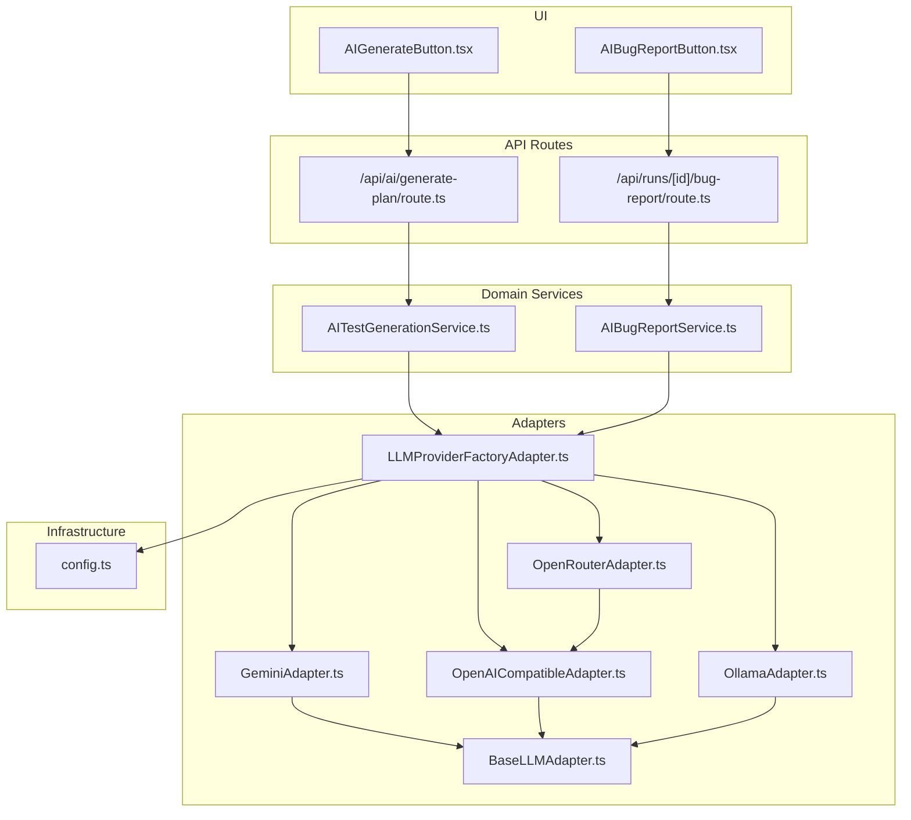
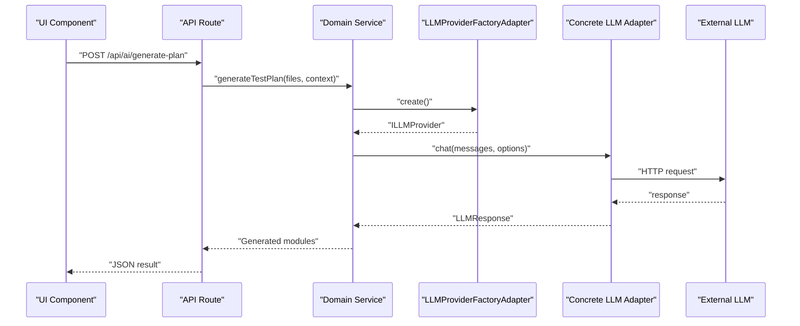
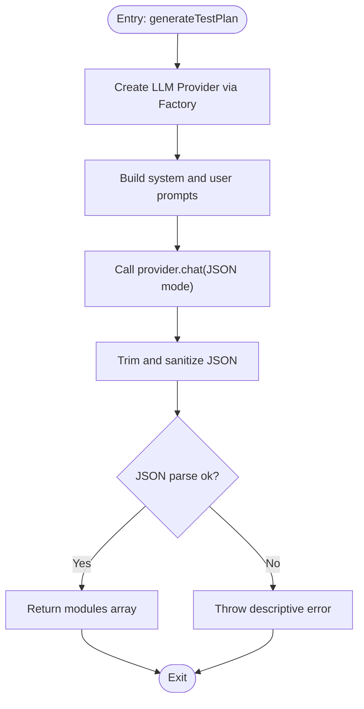
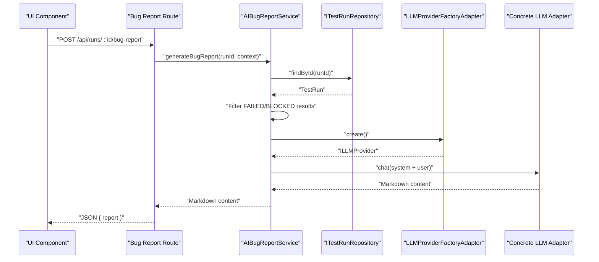
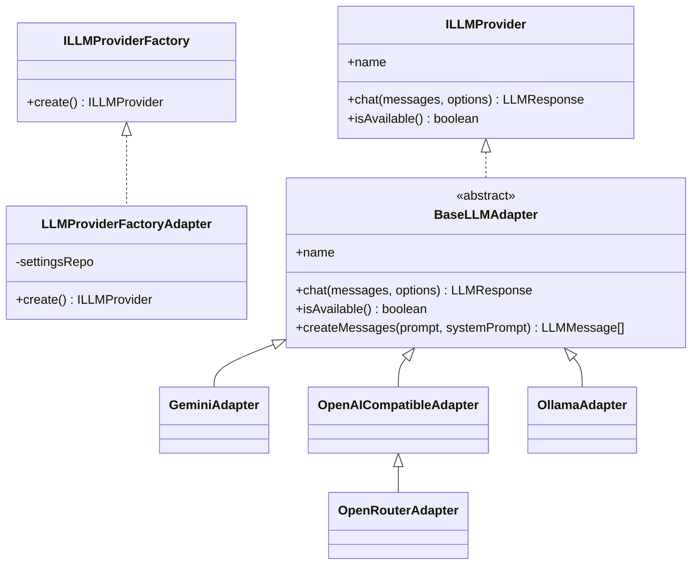
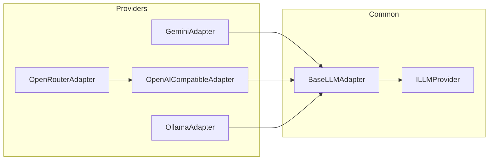
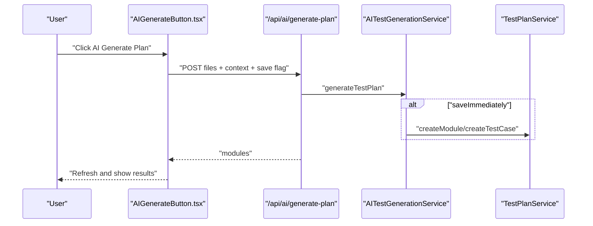
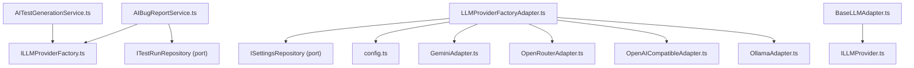

# AI-Powered Features

<cite>
**Referenced Files in This Document**
- [AITestGenerationService.ts](file://src/domain/services/AITestGenerationService.ts)
- [AIBugReportService.ts](file://src/domain/services/AIBugReportService.ts)
- [LLMProviderFactoryAdapter.ts](file://src/adapters/llm/LLMProviderFactoryAdapter.ts)
- [BaseLLMAdapter.ts](file://src/adapters/llm/BaseLLMAdapter.ts)
- [GeminiAdapter.ts](file://src/adapters/llm/GeminiAdapter.ts)
- [OpenAICompatibleAdapter.ts](file://src/adapters/llm/OpenAICompatibleAdapter.ts)
- [OllamaAdapter.ts](file://src/adapters/llm/OllamaAdapter.ts)
- [OpenRouterAdapter.ts](file://src/adapters/llm/OpenRouterAdapter.ts)
- [ILLMProvider.ts](file://src/domain/ports/ILLMProvider.ts)
- [ILLMProviderFactory.ts](file://src/domain/ports/ILLMProviderFactory.ts)
- [config.ts](file://src/infrastructure/config.ts)
- [route.ts](file://app/api/ai/generate-plan/route.ts)
- [route.ts](file://app/api/runs/[id]/bug-report/route.ts)
- [AIGenerateButton.tsx](file://src/ui/test-design/AIGenerateButton.tsx)
- [AIBugReportButton.tsx](file://src/ui/test-run/AIBugReportButton.tsx)
</cite>

## Table of Contents
1. [Introduction](#introduction)
2. [Project Structure](#project-structure)
3. [Core Components](#core-components)
4. [Architecture Overview](#architecture-overview)
5. [Detailed Component Analysis](#detailed-component-analysis)
6. [Dependency Analysis](#dependency-analysis)
7. [Performance Considerations](#performance-considerations)
8. [Troubleshooting Guide](#troubleshooting-guide)
9. [Conclusion](#conclusion)
10. [Appendices](#appendices)

## Introduction
This document explains the AI-powered features of the system, focusing on:
- AI test generation from source code
- AI bug report generation from test runs
- LLM provider configuration and factory pattern
- Prompt engineering templates
- Multi-provider support (Gemini, OpenAI-compatible, Ollama, OpenRouter)
- Integration with external AI services and UI components

It covers service implementations, configuration, prompt templates, result processing, error handling, provider selection criteria, cost optimization, fallback mechanisms, and troubleshooting.

## Project Structure
The AI features span three layers:
- Domain services: orchestrate AI workflows and define contracts
- Adapters: implement concrete LLM providers and a factory
- Infrastructure/UI/API: expose endpoints and user interfaces

**Diagram sources**
- [AIGenerateButton.tsx:1-166](file://src/ui/test-design/AIGenerateButton.tsx#L1-L166)
- [AIBugReportButton.tsx:1-195](file://src/ui/test-run/AIBugReportButton.tsx#L1-L195)
- [route.ts:1-32](file://app/api/ai/generate-plan/route.ts#L1-L32)
- [route.ts:1-19](file://app/api/runs/[id]/bug-report/route.ts#L1-L19)
- [AITestGenerationService.ts:1-82](file://src/domain/services/AITestGenerationService.ts#L1-L82)
- [AIBugReportService.ts:1-70](file://src/domain/services/AIBugReportService.ts#L1-L70)
- [LLMProviderFactoryAdapter.ts:1-43](file://src/adapters/llm/LLMProviderFactoryAdapter.ts#L1-L43)
- [BaseLLMAdapter.ts:1-26](file://src/adapters/llm/BaseLLMAdapter.ts#L1-L26)
- [GeminiAdapter.ts:1-67](file://src/adapters/llm/GeminiAdapter.ts#L1-L67)
- [OpenAICompatibleAdapter.ts:1-97](file://src/adapters/llm/OpenAICompatibleAdapter.ts#L1-L97)
- [OllamaAdapter.ts:1-70](file://src/adapters/llm/OllamaAdapter.ts#L1-L70)
- [OpenRouterAdapter.ts:1-28](file://src/adapters/llm/OpenRouterAdapter.ts#L1-L28)
- [config.ts:1-28](file://src/infrastructure/config.ts#L1-L28)

**Section sources**
- [AIGenerateButton.tsx:1-166](file://src/ui/test-design/AIGenerateButton.tsx#L1-L166)
- [AIBugReportButton.tsx:1-195](file://src/ui/test-run/AIBugReportButton.tsx#L1-L195)
- [route.ts:1-32](file://app/api/ai/generate-plan/route.ts#L1-L32)
- [route.ts:1-19](file://app/api/runs/[id]/bug-report/route.ts#L1-L19)
- [AITestGenerationService.ts:1-82](file://src/domain/services/AITestGenerationService.ts#L1-L82)
- [AIBugReportService.ts:1-70](file://src/domain/services/AIBugReportService.ts#L1-L70)
- [LLMProviderFactoryAdapter.ts:1-43](file://src/adapters/llm/LLMProviderFactoryAdapter.ts#L1-L43)
- [BaseLLMAdapter.ts:1-26](file://src/adapters/llm/BaseLLMAdapter.ts#L1-L26)
- [GeminiAdapter.ts:1-67](file://src/adapters/llm/GeminiAdapter.ts#L1-L67)
- [OpenAICompatibleAdapter.ts:1-97](file://src/adapters/llm/OpenAICompatibleAdapter.ts#L1-L97)
- [OllamaAdapter.ts:1-70](file://src/adapters/llm/OllamaAdapter.ts#L1-L70)
- [OpenRouterAdapter.ts:1-28](file://src/adapters/llm/OpenRouterAdapter.ts#L1-L28)
- [config.ts:1-28](file://src/infrastructure/config.ts#L1-L28)

## Core Components
- AITestGenerationService: Generates test plans from source code files using an LLM. It constructs system and user prompts, invokes the provider, and parses JSON results.
- AIBugReportService: Creates structured bug reports from failed/blocked test results. It builds a system prompt and a user prompt with run context, then returns Markdown-formatted output.
- LLMProviderFactoryAdapter: Factory that selects and instantiates an LLM provider based on persisted settings or defaults from configuration.
- LLM Provider Abstractions: ILLMProvider defines the contract; BaseLLMAdapter provides shared message formatting and availability checks; concrete adapters implement provider-specific logic.
- UI Components: Buttons trigger AI workflows via API routes and present modal dialogs for configuration and results.
- API Routes: Expose endpoints to generate test plans and bug reports, integrating with domain services and optional persistence.

**Section sources**
- [AITestGenerationService.ts:20-82](file://src/domain/services/AITestGenerationService.ts#L20-L82)
- [AIBugReportService.ts:5-70](file://src/domain/services/AIBugReportService.ts#L5-L70)
- [LLMProviderFactoryAdapter.ts:10-43](file://src/adapters/llm/LLMProviderFactoryAdapter.ts#L10-L43)
- [ILLMProvider.ts:12-32](file://src/domain/ports/ILLMProvider.ts#L12-L32)
- [BaseLLMAdapter.ts:3-26](file://src/adapters/llm/BaseLLMAdapter.ts#L3-L26)
- [AIGenerateButton.tsx:9-166](file://src/ui/test-design/AIGenerateButton.tsx#L9-L166)
- [AIBugReportButton.tsx:11-195](file://src/ui/test-run/AIBugReportButton.tsx#L11-L195)
- [route.ts:1-32](file://app/api/ai/generate-plan/route.ts#L1-L32)
- [route.ts:1-19](file://app/api/runs/[id]/bug-report/route.ts#L1-L19)

## Architecture Overview
The AI features follow clean architecture:
- Domain services depend only on ports (ILLMProviderFactory, ITestRunRepository).
- Adapters implement ports and encapsulate provider specifics.
- UI components call API routes, which resolve services from a DI container and delegate to domain services.
- Providers are selected dynamically via the factory, enabling multi-provider support and runtime configuration.

**Diagram sources**
- [route.ts:8-31](file://app/api/ai/generate-plan/route.ts#L8-L31)
- [AITestGenerationService.ts:28-80](file://src/domain/services/AITestGenerationService.ts#L28-L80)
- [LLMProviderFactoryAdapter.ts:18-41](file://src/adapters/llm/LLMProviderFactoryAdapter.ts#L18-L41)
- [GeminiAdapter.ts:22-61](file://src/adapters/llm/GeminiAdapter.ts#L22-L61)
- [OpenAICompatibleAdapter.ts:34-81](file://src/adapters/llm/OpenAICompatibleAdapter.ts#L34-L81)
- [OllamaAdapter.ts:18-54](file://src/adapters/llm/OllamaAdapter.ts#L18-L54)
- [OpenRouterAdapter.ts:15-27](file://src/adapters/llm/OpenRouterAdapter.ts#L15-L27)

## Detailed Component Analysis

### AITestGenerationService
Responsibilities:
- Accepts code files and optional context prompt
- Builds a system prompt instructing the LLM to produce a JSON array of modules and test cases
- Builds a user prompt containing file contents and context
- Invokes provider.chat with JSON response format and controlled temperature/max tokens
- Parses and validates JSON, with robust cleanup for LLM hallucinations
- Returns structured modules with test cases

Processing logic:
- Validates and sanitizes JSON output
- Throws a descriptive error on parsing failure

**Diagram sources**
- [AITestGenerationService.ts:28-80](file://src/domain/services/AITestGenerationService.ts#L28-L80)

**Section sources**
- [AITestGenerationService.ts:25-82](file://src/domain/services/AITestGenerationService.ts#L25-L82)

### AIBugReportService
Responsibilities:
- Loads a test run and filters failed/blocked results
- Builds a system prompt for a structured Markdown bug report
- Builds a user prompt with run metadata and failing test details
- Invokes provider.chat in text mode
- Returns Markdown content for UI rendering and optional export/Jira integration

**Diagram sources**
- [AIBugReportService.ts:16-68](file://src/domain/services/AIBugReportService.ts#L16-L68)
- [route.ts:8-18](file://app/api/runs/[id]/bug-report/route.ts#L8-L18)

**Section sources**
- [AIBugReportService.ts:10-70](file://src/domain/services/AIBugReportService.ts#L10-L70)

### LLM Provider Factory Pattern
The factory abstracts provider instantiation behind ILLMProviderFactory, enabling runtime selection and easy extension.

Selection logic:
- Reads provider/model from settings repository or falls back to config
- Supports: ollama, openrouter, openai-compatible, and defaults to gemini
- Instantiates the appropriate adapter with resolved base URL, API key, and model

**Diagram sources**
- [LLMProviderFactoryAdapter.ts:15-42](file://src/adapters/llm/LLMProviderFactoryAdapter.ts#L15-L42)
- [ILLMProviderFactory.ts:8-11](file://src/domain/ports/ILLMProviderFactory.ts#L8-L11)
- [ILLMProvider.ts:12-32](file://src/domain/ports/ILLMProvider.ts#L12-L32)
- [BaseLLMAdapter.ts:3-26](file://src/adapters/llm/BaseLLMAdapter.ts#L3-L26)
- [GeminiAdapter.ts:5-67](file://src/adapters/llm/GeminiAdapter.ts#L5-L67)
- [OpenAICompatibleAdapter.ts:8-97](file://src/adapters/llm/OpenAICompatibleAdapter.ts#L8-L97)
- [OllamaAdapter.ts:4-70](file://src/adapters/llm/OllamaAdapter.ts#L4-L70)
- [OpenRouterAdapter.ts:10-28](file://src/adapters/llm/OpenRouterAdapter.ts#L10-L28)

**Section sources**
- [LLMProviderFactoryAdapter.ts:15-43](file://src/adapters/llm/LLMProviderFactoryAdapter.ts#L15-L43)
- [ILLMProviderFactory.ts:8-11](file://src/domain/ports/ILLMProviderFactory.ts#L8-L11)
- [ILLMProvider.ts:12-32](file://src/domain/ports/ILLMProvider.ts#L12-L32)
- [BaseLLMAdapter.ts:3-26](file://src/adapters/llm/BaseLLMAdapter.ts#L3-L26)

### Multi-Provider Support and Integration
Supported providers:
- Gemini: Google AI, requires API key; uses official SDK
- OpenAI-compatible: generic OpenAI-style API; supports many backends
- Ollama: local inference via HTTP endpoint
- OpenRouter: proxy over many models with extra headers

Integration highlights:
- GeminiAdapter: SDK initialization, system instruction handling, JSON/text response modes
- OpenAICompatibleAdapter: unified request building, headers, response parsing, availability check
- OllamaAdapter: local endpoint, model existence check, JSON format option
- OpenRouterAdapter: overrides headers for analytics and attribution

**Diagram sources**
- [GeminiAdapter.ts:5-67](file://src/adapters/llm/GeminiAdapter.ts#L5-L67)
- [OpenAICompatibleAdapter.ts:8-97](file://src/adapters/llm/OpenAICompatibleAdapter.ts#L8-L97)
- [OpenRouterAdapter.ts:10-28](file://src/adapters/llm/OpenRouterAdapter.ts#L10-L28)
- [OllamaAdapter.ts:4-70](file://src/adapters/llm/OllamaAdapter.ts#L4-L70)
- [BaseLLMAdapter.ts:3-26](file://src/adapters/llm/BaseLLMAdapter.ts#L3-L26)
- [ILLMProvider.ts:12-32](file://src/domain/ports/ILLMProvider.ts#L12-L32)

**Section sources**
- [GeminiAdapter.ts:10-67](file://src/adapters/llm/GeminiAdapter.ts#L10-L67)
- [OpenAICompatibleAdapter.ts:14-97](file://src/adapters/llm/OpenAICompatibleAdapter.ts#L14-L97)
- [OllamaAdapter.ts:9-70](file://src/adapters/llm/OllamaAdapter.ts#L9-L70)
- [OpenRouterAdapter.ts:15-28](file://src/adapters/llm/OpenRouterAdapter.ts#L15-L28)

### Prompt Engineering Templates
Templates are embedded in services as system and user prompts. They guide the LLM to produce structured outputs.

- Test Plan Generation (AITestGenerationService):
  - System prompt: instructs to analyze code, group into logical modules, output strict JSON matching a schema, avoid markdown wrappers
  - User prompt: includes context/requirements and concatenated code files
  - Options: low temperature, JSON response format, capped tokens

- Bug Report Generation (AIBugReportService):
  - System prompt: instructs to produce a professional Markdown report, summarize, group by module, prioritize by severity/status, include reproduction steps and investigation tips
  - User prompt: includes run metadata and failing test details
  - Options: moderate temperature, text response format, capped tokens

Customization tips:
- Adjust temperature for creativity vs determinism
- Add explicit constraints in system prompts
- Include domain-specific context in user prompts
- Use JSON mode for structured outputs; text mode for free-form reports

**Section sources**
- [AITestGenerationService.ts:31-64](file://src/domain/services/AITestGenerationService.ts#L31-L64)
- [AIBugReportService.ts:27-65](file://src/domain/services/AIBugReportService.ts#L27-L65)

### UI Integration and Workflows
- AI Test Plan Generation:
  - Modal allows selecting a project folder, optional context prompt, and triggers generation
  - Calls /api/ai/generate-plan with files and optional immediate save to project
  - Refreshes UI on success

- AI Bug Report Generation:
  - Modal allows entering developer focus/context, generates Markdown report
  - Provides download and optional push-to-Jira actions

**Diagram sources**
- [AIGenerateButton.tsx:45-80](file://src/ui/test-design/AIGenerateButton.tsx#L45-L80)
- [route.ts:8-31](file://app/api/ai/generate-plan/route.ts#L8-L31)
- [AITestGenerationService.ts:28-30](file://src/domain/services/AITestGenerationService.ts#L28-L30)

**Section sources**
- [AIGenerateButton.tsx:9-166](file://src/ui/test-design/AIGenerateButton.tsx#L9-L166)
- [AIBugReportButton.tsx:11-195](file://src/ui/test-run/AIBugReportButton.tsx#L11-L195)
- [route.ts:1-32](file://app/api/ai/generate-plan/route.ts#L1-L32)
- [route.ts:1-19](file://app/api/runs/[id]/bug-report/route.ts#L1-L19)

## Dependency Analysis
- Domain services depend on ILLMProviderFactory and repositories via ports, preserving separation of concerns
- Factory depends on settings repository and config for runtime selection
- Adapters depend on external SDKs or HTTP endpoints; BaseLLMAdapter centralizes shared behavior
- UI components depend on API routes; API routes depend on services resolved from a DI container

**Diagram sources**
- [AITestGenerationService.ts:1-26](file://src/domain/services/AITestGenerationService.ts#L1-L26)
- [AIBugReportService.ts:1-14](file://src/domain/services/AIBugReportService.ts#L1-L14)
- [LLMProviderFactoryAdapter.ts:1-16](file://src/adapters/llm/LLMProviderFactoryAdapter.ts#L1-L16)
- [ILLMProviderFactory.ts:8-11](file://src/domain/ports/ILLMProviderFactory.ts#L8-L11)
- [ILLMProvider.ts:12-32](file://src/domain/ports/ILLMProvider.ts#L12-L32)
- [BaseLLMAdapter.ts:3-26](file://src/adapters/llm/BaseLLMAdapter.ts#L3-L26)
- [config.ts:13-18](file://src/infrastructure/config.ts#L13-L18)

**Section sources**
- [AITestGenerationService.ts:1-26](file://src/domain/services/AITestGenerationService.ts#L1-L26)
- [AIBugReportService.ts:1-14](file://src/domain/services/AIBugReportService.ts#L1-L14)
- [LLMProviderFactoryAdapter.ts:1-16](file://src/adapters/llm/LLMProviderFactoryAdapter.ts#L1-L16)
- [ILLMProviderFactory.ts:8-11](file://src/domain/ports/ILLMProviderFactory.ts#L8-L11)
- [ILLMProvider.ts:12-32](file://src/domain/ports/ILLMProvider.ts#L12-L32)
- [BaseLLMAdapter.ts:3-26](file://src/adapters/llm/BaseLLMAdapter.ts#L3-L26)
- [config.ts:13-18](file://src/infrastructure/config.ts#L13-L18)

## Performance Considerations
- Token limits and temperature:
  - Control maxTokens and temperature to balance quality and cost
  - Lower temperature improves determinism for structured tasks
- Prompt size management:
  - Limit number of files and content length to stay within context windows
  - UI caps file count to mitigate context overload
- Provider throughput:
  - Prefer local providers (Ollama) for high-volume generation
  - Use cloud providers for higher capability when needed
- Caching and reuse:
  - Reuse provider instances where supported by adapters
- Network resilience:
  - Implement retries and timeouts at the adapter level if extending

[No sources needed since this section provides general guidance]

## Troubleshooting Guide
Common issues and resolutions:
- Provider not initialized:
  - Gemini requires a valid API key; initialize with a key or environment variable
- Availability checks:
  - Use isAvailable to verify connectivity; OpenAI-compatible checks /models endpoint; Ollama checks /api/tags and model presence
- JSON parsing failures:
  - AITestGenerationService trims and cleans LLM output; ensure system prompt enforces JSON-only output
- Network errors:
  - Verify base URLs, API keys, and CORS/proxy settings
- UI feedback:
  - Alerts inform users when AI provider is unreachable or configuration is missing
- Export and Jira integration:
  - Bug report is Markdown; download button saves .md; push-to-Jira uses a dedicated endpoint

**Section sources**
- [GeminiAdapter.ts:23-25](file://src/adapters/llm/GeminiAdapter.ts#L23-L25)
- [OpenAICompatibleAdapter.ts:83-95](file://src/adapters/llm/OpenAICompatibleAdapter.ts#L83-L95)
- [OllamaAdapter.ts:56-68](file://src/adapters/llm/OllamaAdapter.ts#L56-L68)
- [AITestGenerationService.ts:66-80](file://src/domain/services/AITestGenerationService.ts#L66-L80)
- [AIGenerateButton.tsx:74-78](file://src/ui/test-design/AIGenerateButton.tsx#L74-L78)
- [AIBugReportButton.tsx:35-41](file://src/ui/test-run/AIBugReportButton.tsx#L35-L41)

## Conclusion
The AI-powered features are modular, configurable, and provider-agnostic. By leveraging a factory pattern and standardized ports, the system supports multiple LLM backends while keeping domain logic focused on AI workflows. Prompt engineering and configuration enable high-quality outputs for test plan generation and bug reporting, with robust error handling and UI integration for practical use.

[No sources needed since this section summarizes without analyzing specific files]

## Appendices

### Practical Configuration Examples
- Set default provider and model via environment variables or configuration
- Override provider per-project using settings repository values
- Configure base URLs and API keys for cloud providers
- Choose local Ollama for privacy and cost control

**Section sources**
- [config.ts:13-18](file://src/infrastructure/config.ts#L13-L18)
- [LLMProviderFactoryAdapter.ts:18-41](file://src/adapters/llm/LLMProviderFactoryAdapter.ts#L18-L41)

### Provider Selection Criteria
- Cost: local inference (Ollama) vs. hosted APIs
- Latency: local vs. network-dependent providers
- Capability: advanced models via OpenRouter or Gemini
- Compliance: local deployment for sensitive code

**Section sources**
- [OpenRouterAdapter.ts:15-27](file://src/adapters/llm/OpenRouterAdapter.ts#L15-L27)
- [GeminiAdapter.ts:10-20](file://src/adapters/llm/GeminiAdapter.ts#L10-L20)
- [OllamaAdapter.ts:9-16](file://src/adapters/llm/OllamaAdapter.ts#L9-L16)

### Fallback Mechanisms
- Use availability checks to detect provider health
- Graceful degradation: warn users when providers are unavailable
- Preserve user context prompts and files for reattempts

**Section sources**
- [OpenAICompatibleAdapter.ts:83-95](file://src/adapters/llm/OpenAICompatibleAdapter.ts#L83-L95)
- [OllamaAdapter.ts:56-68](file://src/adapters/llm/OllamaAdapter.ts#L56-L68)