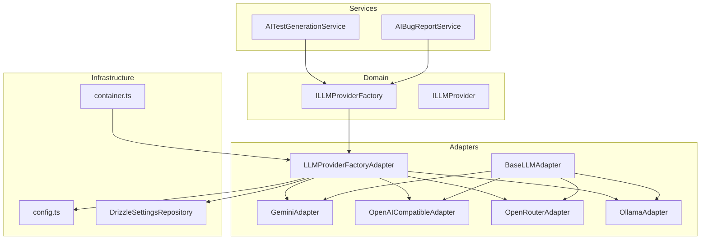
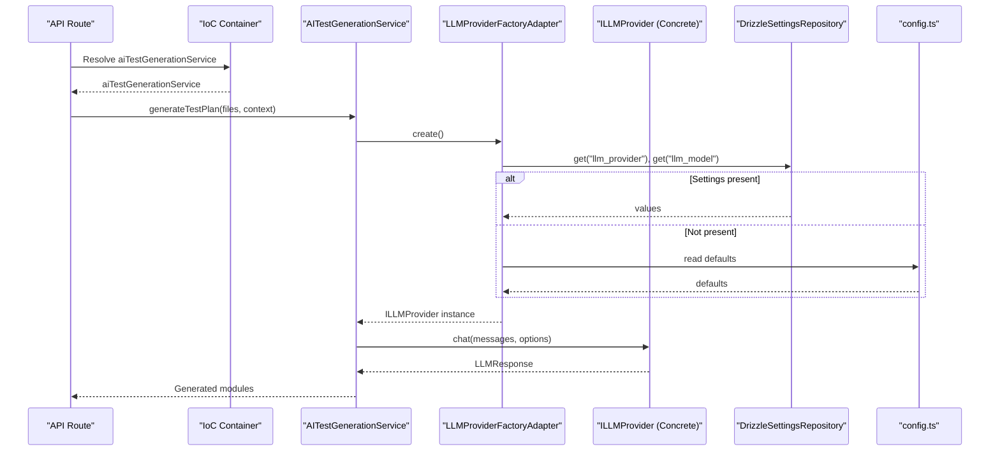
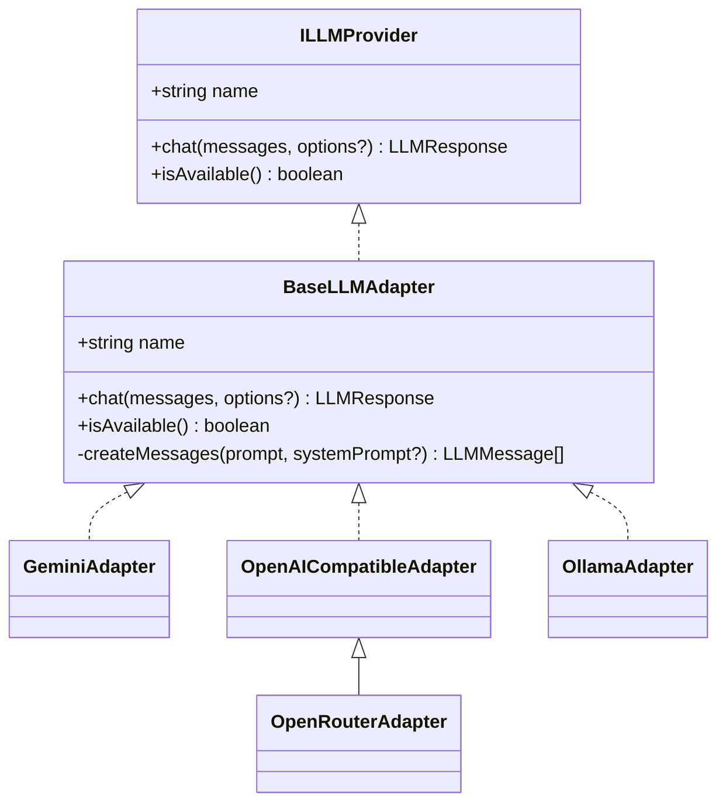
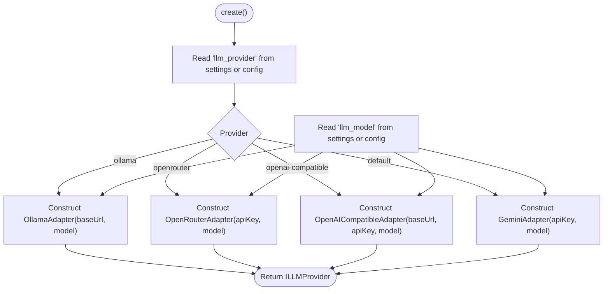
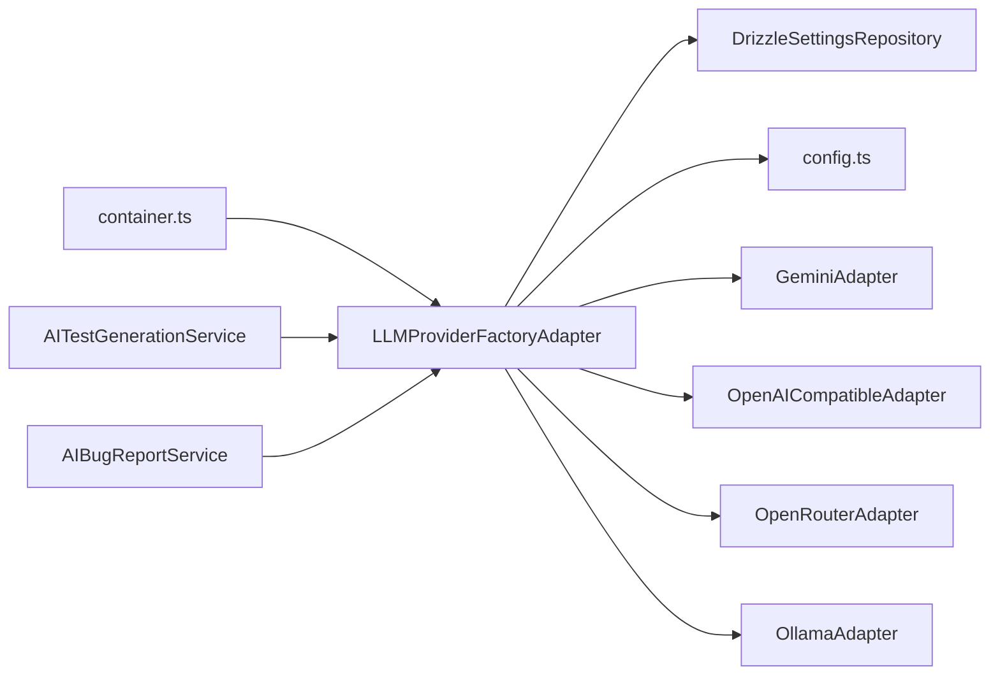

# LLM Provider Integration

<cite>
**Referenced Files in This Document**
- [LLMProviderFactoryAdapter.ts](file://src/adapters/llm/LLMProviderFactoryAdapter.ts)
- [ILLMProviderFactory.ts](file://src/domain/ports/ILLMProviderFactory.ts)
- [ILLMProvider.ts](file://src/domain/ports/ILLMProvider.ts)
- [BaseLLMAdapter.ts](file://src/adapters/llm/BaseLLMAdapter.ts)
- [GeminiAdapter.ts](file://src/adapters/llm/GeminiAdapter.ts)
- [OpenAICompatibleAdapter.ts](file://src/adapters/llm/OpenAICompatibleAdapter.ts)
- [OllamaAdapter.ts](file://src/adapters/llm/OllamaAdapter.ts)
- [OpenRouterAdapter.ts](file://src/adapters/llm/OpenRouterAdapter.ts)
- [config.ts](file://src/infrastructure/config.ts)
- [container.ts](file://src/infrastructure/container.ts)
- [DrizzleSettingsRepository.ts](file://src/adapters/persistence/drizzle/DrizzleSettingsRepository.ts)
- [AITestGenerationService.ts](file://src/domain/services/AITestGenerationService.ts)
- [AIBugReportService.ts](file://src/domain/services/AIBugReportService.ts)
- [route.ts](file://app/api/ai/generate-plan/route.ts)
</cite>

## Table of Contents
1. [Introduction](#introduction)
2. [Project Structure](#project-structure)
3. [Core Components](#core-components)
4. [Architecture Overview](#architecture-overview)
5. [Detailed Component Analysis](#detailed-component-analysis)
6. [Dependency Analysis](#dependency-analysis)
7. [Performance Considerations](#performance-considerations)
8. [Troubleshooting Guide](#troubleshooting-guide)
9. [Conclusion](#conclusion)
10. [Appendices](#appendices)

## Introduction
This document explains the LLM Provider Integration system, focusing on the factory pattern and adapter implementations that enable pluggable AI providers. It covers how the system selects and configures providers, the supported providers (Gemini, OpenAI-compatible services, Ollama, OpenRouter), and how to configure them for local and cloud deployments. It also documents provider-specific features, rate limiting considerations, cost optimization strategies, fallback mechanisms, and troubleshooting connectivity issues.

## Project Structure
The LLM integration spans three layers:
- Domain: Ports define the provider contract and factory abstraction.
- Adapters: Concrete provider implementations and a factory adapter that constructs the appropriate provider based on persisted settings and configuration.
- Infrastructure: Configuration and dependency injection container that wires the system together.

**Diagram sources**
- [ILLMProviderFactory.ts:1-11](file://src/domain/ports/ILLMProviderFactory.ts#L1-L11)
- [ILLMProvider.ts:1-32](file://src/domain/ports/ILLMProvider.ts#L1-L32)
- [BaseLLMAdapter.ts:1-26](file://src/adapters/llm/BaseLLMAdapter.ts#L1-L26)
- [LLMProviderFactoryAdapter.ts:1-43](file://src/adapters/llm/LLMProviderFactoryAdapter.ts#L1-L43)
- [GeminiAdapter.ts:1-67](file://src/adapters/llm/GeminiAdapter.ts#L1-L67)
- [OpenAICompatibleAdapter.ts:1-97](file://src/adapters/llm/OpenAICompatibleAdapter.ts#L1-L97)
- [OpenRouterAdapter.ts:1-28](file://src/adapters/llm/OpenRouterAdapter.ts#L1-L28)
- [OllamaAdapter.ts:1-70](file://src/adapters/llm/OllamaAdapter.ts#L1-L70)
- [config.ts:1-28](file://src/infrastructure/config.ts#L1-L28)
- [container.ts:1-126](file://src/infrastructure/container.ts#L1-L126)
- [DrizzleSettingsRepository.ts:1-29](file://src/adapters/persistence/drizzle/DrizzleSettingsRepository.ts#L1-L29)
- [AITestGenerationService.ts:1-82](file://src/domain/services/AITestGenerationService.ts#L1-L82)
- [AIBugReportService.ts:1-70](file://src/domain/services/AIBugReportService.ts#L1-L70)

**Section sources**
- [LLMProviderFactoryAdapter.ts:1-43](file://src/adapters/llm/LLMProviderFactoryAdapter.ts#L1-L43)
- [config.ts:1-28](file://src/infrastructure/config.ts#L1-L28)
- [container.ts:1-126](file://src/infrastructure/container.ts#L1-L126)

## Core Components
- ILLMProviderFactory: Defines a single method to create an ILLMProvider instance. This abstraction ensures the domain layer does not depend on concrete providers.
- ILLMProvider: Defines the provider contract: a name, a chat method supporting temperature, max tokens, and response format, and an availability check.
- BaseLLMAdapter: Implements shared behavior for constructing message arrays and provides the base contract for all adapters.
- LLMProviderFactoryAdapter: A factory adapter that chooses a provider based on persisted settings or defaults from configuration. It delegates construction to concrete adapters.

Key configuration sources:
- Environment variables and centralized config: provider, API key, base URL, and model.
- Persisted settings: provider, model, and optional base URL/API key overrides.

**Section sources**
- [ILLMProviderFactory.ts:1-11](file://src/domain/ports/ILLMProviderFactory.ts#L1-L11)
- [ILLMProvider.ts:1-32](file://src/domain/ports/ILLMProvider.ts#L1-L32)
- [BaseLLMAdapter.ts:1-26](file://src/adapters/llm/BaseLLMAdapter.ts#L1-L26)
- [LLMProviderFactoryAdapter.ts:1-43](file://src/adapters/llm/LLMProviderFactoryAdapter.ts#L1-L43)
- [config.ts:1-28](file://src/infrastructure/config.ts#L1-L28)
- [DrizzleSettingsRepository.ts:1-29](file://src/adapters/persistence/drizzle/DrizzleSettingsRepository.ts#L1-L29)

## Architecture Overview
The system uses a factory pattern to decouple domain services from provider implementations. Domain services depend on ILLMProviderFactory and ILLMProvider, while the adapter layer implements concrete providers and the factory adapter resolves the correct provider at runtime.

**Diagram sources**
- [container.ts:1-126](file://src/infrastructure/container.ts#L1-L126)
- [AITestGenerationService.ts:1-82](file://src/domain/services/AITestGenerationService.ts#L1-L82)
- [LLMProviderFactoryAdapter.ts:1-43](file://src/adapters/llm/LLMProviderFactoryAdapter.ts#L1-L43)
- [DrizzleSettingsRepository.ts:1-29](file://src/adapters/persistence/drizzle/DrizzleSettingsRepository.ts#L1-L29)
- [config.ts:1-28](file://src/infrastructure/config.ts#L1-L28)
- [route.ts:1-32](file://app/api/ai/generate-plan/route.ts#L1-L32)

## Detailed Component Analysis

### ILLMProvider and BaseLLMAdapter
- Contract: Providers expose a name, chat with optional temperature, max tokens, and response format, plus an availability check.
- BaseLLMAdapter: Provides a helper to convert a simple prompt into a messages array and enforces the contract for subclasses.

**Diagram sources**
- [ILLMProvider.ts:1-32](file://src/domain/ports/ILLMProvider.ts#L1-L32)
- [BaseLLMAdapter.ts:1-26](file://src/adapters/llm/BaseLLMAdapter.ts#L1-L26)
- [GeminiAdapter.ts:1-67](file://src/adapters/llm/GeminiAdapter.ts#L1-L67)
- [OpenAICompatibleAdapter.ts:1-97](file://src/adapters/llm/OpenAICompatibleAdapter.ts#L1-L97)
- [OpenRouterAdapter.ts:1-28](file://src/adapters/llm/OpenRouterAdapter.ts#L1-L28)
- [OllamaAdapter.ts:1-70](file://src/adapters/llm/OllamaAdapter.ts#L1-L70)

**Section sources**
- [ILLMProvider.ts:1-32](file://src/domain/ports/ILLMProvider.ts#L1-L32)
- [BaseLLMAdapter.ts:1-26](file://src/adapters/llm/BaseLLMAdapter.ts#L1-L26)

### LLMProviderFactoryAdapter
- Selects provider based on persisted settings; falls back to configuration defaults.
- Creates provider instances with model and provider-specific parameters (API key, base URL).
- Supports four providers: Ollama, OpenRouter, OpenAI-compatible, and Gemini (default).

**Diagram sources**
- [LLMProviderFactoryAdapter.ts:1-43](file://src/adapters/llm/LLMProviderFactoryAdapter.ts#L1-L43)
- [DrizzleSettingsRepository.ts:1-29](file://src/adapters/persistence/drizzle/DrizzleSettingsRepository.ts#L1-L29)
- [config.ts:1-28](file://src/infrastructure/config.ts#L1-L28)

**Section sources**
- [LLMProviderFactoryAdapter.ts:1-43](file://src/adapters/llm/LLMProviderFactoryAdapter.ts#L1-L43)
- [DrizzleSettingsRepository.ts:1-29](file://src/adapters/persistence/drizzle/DrizzleSettingsRepository.ts#L1-L29)
- [config.ts:1-28](file://src/infrastructure/config.ts#L1-L28)

### GeminiAdapter
- Uses the official Google Generative AI SDK.
- Accepts API key via constructor or environment variables.
- Supports system instruction, temperature, max output tokens, and JSON response format.

Provider-specific features:
- Uses systemInstruction and responseMimeType for advanced control.
- Throws descriptive errors on initialization or generation failures.

Availability check:
- True if initialized with an API key; otherwise false.

**Section sources**
- [GeminiAdapter.ts:1-67](file://src/adapters/llm/GeminiAdapter.ts#L1-L67)
- [config.ts:1-28](file://src/infrastructure/config.ts#L1-L28)

### OpenAICompatibleAdapter
- Generic adapter for OpenAI-compatible APIs (OpenAI, Mistral, Groq, LM Studio, llama.cpp server, vLLM, etc.).
- Builds Authorization header when API key is provided; supports JSON response format via response_format.
- Validates availability by calling /models endpoint.

Provider-specific features:
- Overridable buildHeaders for additional headers.
- Supports max_tokens and response_format mapping.

Availability check:
- False if no API key and not pointing to localhost; otherwise probes /models.

**Section sources**
- [OpenAICompatibleAdapter.ts:1-97](file://src/adapters/llm/OpenAICompatibleAdapter.ts#L1-L97)
- [config.ts:1-28](file://src/infrastructure/config.ts#L1-L28)

### OpenRouterAdapter
- Specialization of OpenAICompatibleAdapter that targets OpenRouter’s API.
- Adds required headers for analytics and rate-limit attribution.
- Defaults to a popular model when none is provided.

Availability check:
- Inherits availability logic from parent.

**Section sources**
- [OpenRouterAdapter.ts:1-28](file://src/adapters/llm/OpenRouterAdapter.ts#L1-L28)
- [OpenAICompatibleAdapter.ts:1-97](file://src/adapters/llm/OpenAICompatibleAdapter.ts#L1-L97)
- [config.ts:1-28](file://src/infrastructure/config.ts#L1-L28)

### OllamaAdapter
- Connects to a local Ollama instance.
- Defaults to http://localhost:11434 and model llama3 if not provided.
- Supports JSON response format and streaming disabled.

Availability check:
- Probes /api/tags and checks for the requested model presence.

**Section sources**
- [OllamaAdapter.ts:1-70](file://src/adapters/llm/OllamaAdapter.ts#L1-L70)
- [config.ts:1-28](file://src/infrastructure/config.ts#L1-L28)

### Domain Services Integration
- AITestGenerationService: Uses the factory to obtain a provider, sends a system prompt and user prompt, and parses JSON output.
- AIBugReportService: Retrieves failing test results, composes a structured prompt, and requests a Markdown report.

Both services rely solely on ILLMProviderFactory and ILLMProvider, ensuring portability across providers.

**Section sources**
- [AITestGenerationService.ts:1-82](file://src/domain/services/AITestGenerationService.ts#L1-L82)
- [AIBugReportService.ts:1-70](file://src/domain/services/AIBugReportService.ts#L1-L70)

## Dependency Analysis
- The IoC container instantiates the factory and injects it into domain services.
- The factory depends on a settings repository and configuration to resolve provider parameters.
- Concrete adapters depend on external SDKs or HTTP endpoints.

**Diagram sources**
- [container.ts:1-126](file://src/infrastructure/container.ts#L1-L126)
- [LLMProviderFactoryAdapter.ts:1-43](file://src/adapters/llm/LLMProviderFactoryAdapter.ts#L1-L43)
- [DrizzleSettingsRepository.ts:1-29](file://src/adapters/persistence/drizzle/DrizzleSettingsRepository.ts#L1-L29)
- [config.ts:1-28](file://src/infrastructure/config.ts#L1-L28)
- [AITestGenerationService.ts:1-82](file://src/domain/services/AITestGenerationService.ts#L1-L82)
- [AIBugReportService.ts:1-70](file://src/domain/services/AIBugReportService.ts#L1-L70)

**Section sources**
- [container.ts:1-126](file://src/infrastructure/container.ts#L1-L126)
- [LLMProviderFactoryAdapter.ts:1-43](file://src/adapters/llm/LLMProviderFactoryAdapter.ts#L1-L43)

## Performance Considerations
- Token usage reporting:
  - OpenAI-compatible providers return total tokens used in the response payload.
  - Other providers do not expose token usage in the current implementation.
- Response format:
  - JSON mode reduces retries and hallucinations when strict schemas are required.
- Temperature and max tokens:
  - Lower temperature improves determinism for test plan generation.
  - Cap max tokens to control latency and cost.
- Streaming:
  - Current adapters disable streaming; enabling streaming may reduce latency but requires careful buffering and error handling.

[No sources needed since this section provides general guidance]

## Troubleshooting Guide
Common issues and resolutions:
- Initialization failures:
  - Gemini requires a valid API key; ensure the key is provided via constructor or environment variables.
- Connectivity:
  - OpenAI-compatible providers require a reachable base URL and valid API key; availability check probes /models.
  - Ollama must be running locally; availability check verifies model tags and requested model presence.
- JSON parsing errors:
  - When expecting JSON, ensure the provider supports JSON mode and that the response is valid JSON.
- Rate limits and attribution:
  - OpenRouter requires referer and title headers; ensure APP_URL is set to avoid attribution issues.

Operational tips:
- Use the availability check to validate provider readiness before sending prompts.
- Prefer local models for offline work; use cloud providers for advanced models or higher throughput.
- Monitor token usage and adjust max tokens to balance quality and cost.

**Section sources**
- [GeminiAdapter.ts:1-67](file://src/adapters/llm/GeminiAdapter.ts#L1-L67)
- [OpenAICompatibleAdapter.ts:1-97](file://src/adapters/llm/OpenAICompatibleAdapter.ts#L1-L97)
- [OllamaAdapter.ts:1-70](file://src/adapters/llm/OllamaAdapter.ts#L1-L70)
- [OpenRouterAdapter.ts:1-28](file://src/adapters/llm/OpenRouterAdapter.ts#L1-L28)

## Conclusion
The LLM Provider Integration leverages a clean factory and adapter pattern to support multiple providers with minimal coupling. By centralizing configuration and persisting user preferences, the system enables seamless switching between providers, supports both local and cloud deployments, and provides a robust foundation for AI-assisted testing workflows.

[No sources needed since this section summarizes without analyzing specific files]

## Appendices

### Provider Selection Criteria and Configuration Management
- Provider selection:
  - Persisted setting takes precedence; otherwise, defaults from configuration are used.
- Configuration sources:
  - Environment variables and centralized config provide defaults for provider, API key, base URL, and model.
- Settings repository:
  - Stores and retrieves provider-related settings; supports batch retrieval for efficiency.

**Section sources**
- [LLMProviderFactoryAdapter.ts:1-43](file://src/adapters/llm/LLMProviderFactoryAdapter.ts#L1-L43)
- [DrizzleSettingsRepository.ts:1-29](file://src/adapters/persistence/drizzle/DrizzleSettingsRepository.ts#L1-L29)
- [config.ts:1-28](file://src/infrastructure/config.ts#L1-L28)

### Setup Guides

- Gemini
  - API key configuration: Provide via constructor or environment variables.
  - Model selection: Specify in settings or configuration; defaults to a modern Flash model.
  - Availability: Requires a valid API key.

- OpenAI-Compatible Services (OpenAI, Groq, LM Studio, etc.)
  - API key configuration: Provide via constructor or environment variables.
  - Endpoint URL: Configure base URL; defaults to a common OpenAI-compatible endpoint.
  - Model selection: Specify model; defaults to a lightweight model when omitted.
  - Availability: Probes /models endpoint; requires API key unless targeting localhost.

- Ollama (Local Deployment)
  - Base URL: Defaults to http://localhost:11434; override via settings or environment.
  - Model: Defaults to llama3; ensure the model is pulled locally.
  - Availability: Checks /api/tags for model presence.

- OpenRouter (Aggregator Proxy)
  - API key configuration: Required.
  - Model selection: Defaults to a popular model when omitted.
  - Headers: Automatically adds referer and title headers for attribution.

**Section sources**
- [GeminiAdapter.ts:1-67](file://src/adapters/llm/GeminiAdapter.ts#L1-L67)
- [OpenAICompatibleAdapter.ts:1-97](file://src/adapters/llm/OpenAICompatibleAdapter.ts#L1-L97)
- [OllamaAdapter.ts:1-70](file://src/adapters/llm/OllamaAdapter.ts#L1-L70)
- [OpenRouterAdapter.ts:1-28](file://src/adapters/llm/OpenRouterAdapter.ts#L1-L28)
- [config.ts:1-28](file://src/infrastructure/config.ts#L1-L28)

### Examples: Switching Providers and Environment-Specific Settings
- Switching providers:
  - Update the persisted provider setting to one of: ollama, openrouter, openai-compatible, or gemini (default).
- Environment-specific settings:
  - Set environment variables for provider, API key, base URL, and model to override defaults.
  - Persisted settings take precedence over environment variables.

**Section sources**
- [LLMProviderFactoryAdapter.ts:1-43](file://src/adapters/llm/LLMProviderFactoryAdapter.ts#L1-L43)
- [DrizzleSettingsRepository.ts:1-29](file://src/adapters/persistence/drizzle/DrizzleSettingsRepository.ts#L1-L29)
- [config.ts:1-28](file://src/infrastructure/config.ts#L1-L28)