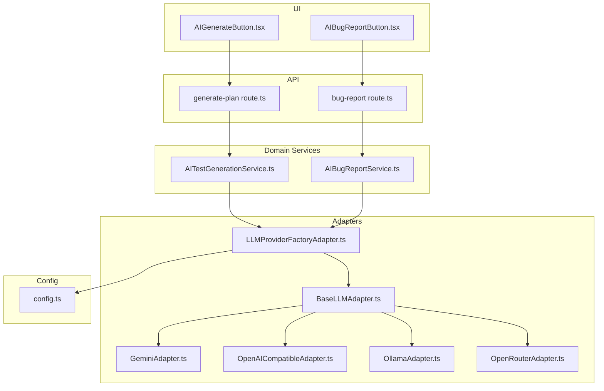
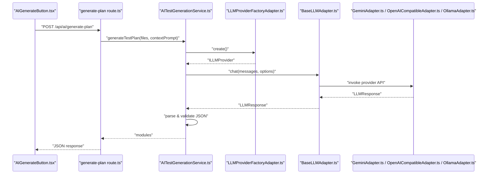
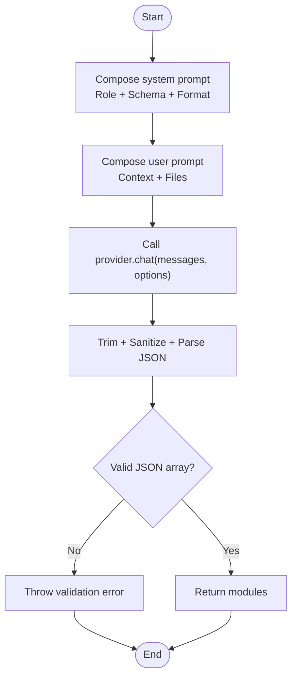
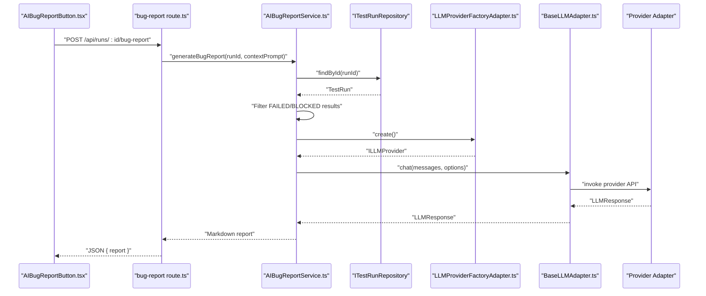
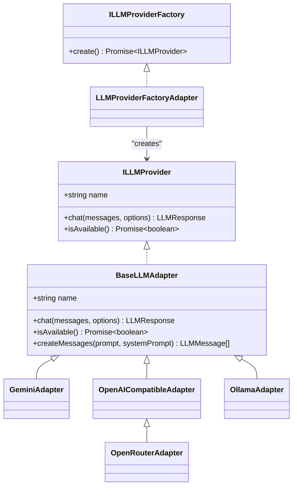
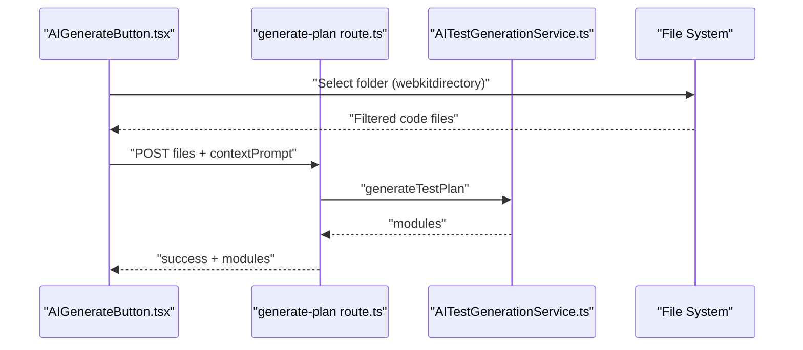
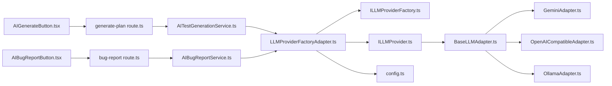

# Prompt Engineering and Templates

<cite>
**Referenced Files in This Document**
- [AITestGenerationService.ts](file://src/domain/services/AITestGenerationService.ts)
- [AIBugReportService.ts](file://src/domain/services/AIBugReportService.ts)
- [BaseLLMAdapter.ts](file://src/adapters/llm/BaseLLMAdapter.ts)
- [GeminiAdapter.ts](file://src/adapters/llm/GeminiAdapter.ts)
- [OpenAICompatibleAdapter.ts](file://src/adapters/llm/OpenAICompatibleAdapter.ts)
- [OllamaAdapter.ts](file://src/adapters/llm/OllamaAdapter.ts)
- [OpenRouterAdapter.ts](file://src/adapters/llm/OpenRouterAdapter.ts)
- [LLMProviderFactoryAdapter.ts](file://src/adapters/llm/LLMProviderFactoryAdapter.ts)
- [AILLMProvider.ts](file://src/domain/ports/ILLMProvider.ts)
- [AILLMProviderFactory.ts](file://src/domain/ports/ILLMProviderFactory.ts)
- [AIGenerateButton.tsx](file://src/ui/test-design/AIGenerateButton.tsx)
- [AIBugReportButton.tsx](file://src/ui/test-run/AIBugReportButton.tsx)
- [generate-plan route.ts](file://app/api/ai/generate-plan/route.ts)
- [bug-report route.ts](file://app/api/runs/[id]/bug-report/route.ts)
- [config.ts](file://src/infrastructure/config.ts)
</cite>

## Table of Contents
1. [Introduction](#introduction)
2. [Project Structure](#project-structure)
3. [Core Components](#core-components)
4. [Architecture Overview](#architecture-overview)
5. [Detailed Component Analysis](#detailed-component-analysis)
6. [Dependency Analysis](#dependency-analysis)
7. [Performance Considerations](#performance-considerations)
8. [Troubleshooting Guide](#troubleshooting-guide)
9. [Conclusion](#conclusion)
10. [Appendices](#appendices)

## Introduction
This document provides a comprehensive guide to prompt engineering and template management for automated test plan generation and AI-powered bug reporting. It explains how prompts are constructed for both test generation and bug reporting, how to optimize prompts for reliability and quality, and how to customize and tune parameters such as temperature and max tokens. It also covers structured output formatting, response validation, role-playing instructions for AI agents, and practical examples for different programming languages and testing scenarios. Finally, it outlines best practices for prompt versioning, A/B testing, and performance monitoring, along with guidelines for aligning prompts with organizational needs and regulatory requirements.

## Project Structure
The system is organized into clear layers:
- UI components collect user inputs (code files, context prompts) and trigger API endpoints.
- API routes validate inputs and orchestrate service calls.
- Services encapsulate prompt construction and LLM invocation, returning validated outputs.
- Adapters abstract provider-specific APIs behind a unified interface.
- Configuration centralizes provider selection and defaults.

**Diagram sources**
- [AIGenerateButton.tsx:1-166](file://src/ui/test-design/AIGenerateButton.tsx#L1-L166)
- [AIBugReportButton.tsx:1-195](file://src/ui/test-run/AIBugReportButton.tsx#L1-L195)
- [generate-plan route.ts:1-32](file://app/api/ai/generate-plan/route.ts#L1-L32)
- [bug-report route.ts:1-19](file://app/api/runs/[id]/bug-report/route.ts#L1-L19)
- [AITestGenerationService.ts:1-82](file://src/domain/services/AITestGenerationService.ts#L1-L82)
- [AIBugReportService.ts:1-70](file://src/domain/services/AIBugReportService.ts#L1-L70)
- [LLMProviderFactoryAdapter.ts:1-43](file://src/adapters/llm/LLMProviderFactoryAdapter.ts#L1-L43)
- [BaseLLMAdapter.ts:1-26](file://src/adapters/llm/BaseLLMAdapter.ts#L1-L26)
- [GeminiAdapter.ts:1-67](file://src/adapters/llm/GeminiAdapter.ts#L1-L67)
- [OpenAICompatibleAdapter.ts:1-97](file://src/adapters/llm/OpenAICompatibleAdapter.ts#L1-L97)
- [OllamaAdapter.ts:1-70](file://src/adapters/llm/OllamaAdapter.ts#L1-L70)
- [OpenRouterAdapter.ts:1-28](file://src/adapters/llm/OpenRouterAdapter.ts#L1-L28)
- [config.ts:1-28](file://src/infrastructure/config.ts#L1-L28)

**Section sources**
- [AIGenerateButton.tsx:1-166](file://src/ui/test-design/AIGenerateButton.tsx#L1-L166)
- [AIBugReportButton.tsx:1-195](file://src/ui/test-run/AIBugReportButton.tsx#L1-L195)
- [generate-plan route.ts:1-32](file://app/api/ai/generate-plan/route.ts#L1-L32)
- [bug-report route.ts:1-19](file://app/api/runs/[id]/bug-report/route.ts#L1-L19)
- [AITestGenerationService.ts:1-82](file://src/domain/services/AITestGenerationService.ts#L1-L82)
- [AIBugReportService.ts:1-70](file://src/domain/services/AIBugReportService.ts#L1-L70)
- [LLMProviderFactoryAdapter.ts:1-43](file://src/adapters/llm/LLMProviderFactoryAdapter.ts#L1-L43)
- [BaseLLMAdapter.ts:1-26](file://src/adapters/llm/BaseLLMAdapter.ts#L1-L26)
- [GeminiAdapter.ts:1-67](file://src/adapters/llm/GeminiAdapter.ts#L1-L67)
- [OpenAICompatibleAdapter.ts:1-97](file://src/adapters/llm/OpenAICompatibleAdapter.ts#L1-L97)
- [OllamaAdapter.ts:1-70](file://src/adapters/llm/OllamaAdapter.ts#L1-L70)
- [OpenRouterAdapter.ts:1-28](file://src/adapters/llm/OpenRouterAdapter.ts#L1-L28)
- [config.ts:1-28](file://src/infrastructure/config.ts#L1-L28)

## Core Components
- Prompt construction and validation:
  - Test generation service composes a system prompt and a user prompt, enforces strict JSON schema, and sanitizes LLM output to ensure valid JSON.
  - Bug report service composes a system prompt and a user prompt, enforces Markdown output, and returns raw text.
- Provider abstraction:
  - A factory selects a provider based on persisted settings or defaults, enabling pluggable LLM backends.
  - Adapters implement a common interface for chat, temperature, max tokens, and response format.
- UI triggers:
  - UI components collect optional context prompts and code files, then call API endpoints to generate plans or bug reports.
- API orchestration:
  - API routes validate inputs, delegate to services, and optionally persist generated artifacts.

Key prompt characteristics:
- Role-playing instructions define the agent’s persona and responsibilities.
- Structured output directives specify JSON or Markdown formats.
- Constraints on schema and formatting reduce hallucinations and parsing errors.
- Parameter tuning controls creativity vs. determinism and output length.

**Section sources**
- [AITestGenerationService.ts:28-80](file://src/domain/services/AITestGenerationService.ts#L28-L80)
- [AIBugReportService.ts:16-68](file://src/domain/services/AIBugReportService.ts#L16-L68)
- [LLMProviderFactoryAdapter.ts:18-41](file://src/adapters/llm/LLMProviderFactoryAdapter.ts#L18-L41)
- [BaseLLMAdapter.ts:6-10](file://src/adapters/llm/BaseLLMAdapter.ts#L6-L10)
- [AIGenerateButton.tsx:45-80](file://src/ui/test-design/AIGenerateButton.tsx#L45-L80)
- [AIBugReportButton.tsx:20-41](file://src/ui/test-run/AIBugReportButton.tsx#L20-L41)
- [generate-plan route.ts:8-31](file://app/api/ai/generate-plan/route.ts#L8-L31)
- [bug-report route.ts:8-18](file://app/api/runs/[id]/bug-report/route.ts#L8-L18)

## Architecture Overview
The system follows a layered architecture:
- UI collects inputs and renders modal experiences for test plan generation and bug report creation.
- API routes validate requests and call domain services.
- Services construct prompts, call the provider factory, and invoke adapters.
- Providers return content with tokens used and model info; services validate and normalize outputs.

**Diagram sources**
- [AIGenerateButton.tsx:53-64](file://src/ui/test-design/AIGenerateButton.tsx#L53-L64)
- [generate-plan route.ts:8-31](file://app/api/ai/generate-plan/route.ts#L8-L31)
- [AITestGenerationService.ts:28-80](file://src/domain/services/AITestGenerationService.ts#L28-L80)
- [LLMProviderFactoryAdapter.ts:18-41](file://src/adapters/llm/LLMProviderFactoryAdapter.ts#L18-L41)
- [BaseLLMAdapter.ts:6-10](file://src/adapters/llm/BaseLLMAdapter.ts#L6-L10)
- [GeminiAdapter.ts:22-56](file://src/adapters/llm/GeminiAdapter.ts#L22-L56)
- [OpenAICompatibleAdapter.ts:34-74](file://src/adapters/llm/OpenAICompatibleAdapter.ts#L34-L74)
- [OllamaAdapter.ts:18-49](file://src/adapters/llm/OllamaAdapter.ts#L18-L49)

## Detailed Component Analysis

### Test Plan Generation Prompt Template
- Purpose: Convert source code into a structured test plan with modules and test cases.
- System prompt:
  - Defines role (QA Engineer), task (analyze code and produce a test plan), grouping logic (modules by features/files), and output format (strict JSON).
  - Includes explicit schema requirements and forbids markdown wrappers around JSON.
- User prompt:
  - Accepts an optional context/requirements field.
  - Embeds multiple code files with headers and content.
  - Requests the JSON output.
- Validation:
  - Removes markdown fences and trims whitespace before attempting JSON.parse.
  - Returns empty array if parsed result is not an array.
- Parameters:
  - Temperature tuned low for deterministic JSON.
  - JSON response format enforced.
  - Max tokens set to accommodate long codebases.

**Diagram sources**
- [AITestGenerationService.ts:31-48](file://src/domain/services/AITestGenerationService.ts#L31-L48)
- [AITestGenerationService.ts:50-55](file://src/domain/services/AITestGenerationService.ts#L50-L55)
- [AITestGenerationService.ts:57-64](file://src/domain/services/AITestGenerationService.ts#L57-L64)
- [AITestGenerationService.ts:66-80](file://src/domain/services/AITestGenerationService.ts#L66-L80)

**Section sources**
- [AITestGenerationService.ts:28-80](file://src/domain/services/AITestGenerationService.ts#L28-L80)

### Bug Report Generation Prompt Template
- Purpose: Transform failed and blocked test results into a structured Markdown bug report for developers.
- System prompt:
  - Defines role (Senior QA Engineer), output format (Markdown), and structure (summary, grouped by module, prioritization, actionable reproduction steps).
- User prompt:
  - Accepts an optional developer-focused context.
  - Includes test run metadata and a consolidated block of failed results with fields like test ID, title, module, status, priority, steps, expected result, and actual notes.
  - Requests a comprehensive Markdown report.
- Parameters:
  - Slightly higher temperature than test generation for balanced creativity.
  - Text response format.
  - Max tokens set to support detailed reports.

**Diagram sources**
- [AIBugReportButton.tsx:24-28](file://src/ui/test-run/AIBugReportButton.tsx#L24-L28)
- [bug-report route.ts:8-18](file://app/api/runs/[id]/bug-report/route.ts#L8-L18)
- [AIBugReportService.ts:16-68](file://src/domain/services/AIBugReportService.ts#L16-L68)
- [LLMProviderFactoryAdapter.ts:18-41](file://src/adapters/llm/LLMProviderFactoryAdapter.ts#L18-L41)
- [BaseLLMAdapter.ts:6-10](file://src/adapters/llm/BaseLLMAdapter.ts#L6-L10)

**Section sources**
- [AIBugReportService.ts:16-68](file://src/domain/services/AIBugReportService.ts#L16-L68)

### Provider Abstraction and Parameter Tuning
- Unified interface:
  - chat(messages, options) supports temperature, maxTokens, and responseFormat.
  - isAvailable() checks provider readiness.
- Provider implementations:
  - GeminiAdapter: maps system instructions and roles, sets responseMimeType for JSON.
  - OpenAICompatibleAdapter: sends standardized chat/completions payload, supports response_format=json_object.
  - OllamaAdapter: uses local API with format=json for JSON outputs.
  - OpenRouterAdapter: extends OpenAI-compatible with extra headers for analytics.
- Factory selection:
  - Reads persisted settings or falls back to config defaults.
  - Supports ollama, openrouter, openai-compatible, and gemini.

**Diagram sources**
- [AILLMProvider.ts:12-31](file://src/domain/ports/ILLMProvider.ts#L12-L31)
- [BaseLLMAdapter.ts:3-25](file://src/adapters/llm/BaseLLMAdapter.ts#L3-L25)
- [GeminiAdapter.ts:5-66](file://src/adapters/llm/GeminiAdapter.ts#L5-L66)
- [OpenAICompatibleAdapter.ts:8-95](file://src/adapters/llm/OpenAICompatibleAdapter.ts#L8-L95)
- [OllamaAdapter.ts:4-68](file://src/adapters/llm/OllamaAdapter.ts#L4-L68)
- [OpenRouterAdapter.ts:10-27](file://src/adapters/llm/OpenRouterAdapter.ts#L10-L27)
- [AILLMProviderFactory.ts:8-10](file://src/domain/ports/ILLMProviderFactory.ts#L8-L10)
- [LLMProviderFactoryAdapter.ts:15-42](file://src/adapters/llm/LLMProviderFactoryAdapter.ts#L15-L42)

**Section sources**
- [AILLMProvider.ts:12-31](file://src/domain/ports/ILLMProvider.ts#L12-L31)
- [BaseLLMAdapter.ts:6-10](file://src/adapters/llm/BaseLLMAdapter.ts#L6-L10)
- [GeminiAdapter.ts:22-56](file://src/adapters/llm/GeminiAdapter.ts#L22-L56)
- [OpenAICompatibleAdapter.ts:34-74](file://src/adapters/llm/OpenAICompatibleAdapter.ts#L34-L74)
- [OllamaAdapter.ts:18-49](file://src/adapters/llm/OllamaAdapter.ts#L18-L49)
- [OpenRouterAdapter.ts:19-26](file://src/adapters/llm/OpenRouterAdapter.ts#L19-L26)
- [LLMProviderFactoryAdapter.ts:18-41](file://src/adapters/llm/LLMProviderFactoryAdapter.ts#L18-L41)

### UI Integration and Data Flow
- Test plan generation:
  - UI collects optional context prompt and up to 50 code files (filtered by extensions and excluded paths).
  - Calls API endpoint to generate and optionally save immediately.
- Bug report generation:
  - UI collects optional developer-focused context and generates a Markdown report.
  - Provides download and optional push-to-Jira actions.

**Diagram sources**
- [AIGenerateButton.tsx:17-43](file://src/ui/test-design/AIGenerateButton.tsx#L17-L43)
- [AIGenerateButton.tsx:53-80](file://src/ui/test-design/AIGenerateButton.tsx#L53-L80)
- [generate-plan route.ts:8-31](file://app/api/ai/generate-plan/route.ts#L8-L31)
- [AITestGenerationService.ts:28-80](file://src/domain/services/AITestGenerationService.ts#L28-L80)

**Section sources**
- [AIGenerateButton.tsx:17-80](file://src/ui/test-design/AIGenerateButton.tsx#L17-L80)
- [AIBugReportButton.tsx:20-84](file://src/ui/test-run/AIBugReportButton.tsx#L20-L84)
- [generate-plan route.ts:8-31](file://app/api/ai/generate-plan/route.ts#L8-L31)
- [bug-report route.ts:8-18](file://app/api/runs/[id]/bug-report/route.ts#L8-L18)

## Dependency Analysis
- Domain services depend on the provider factory port, ensuring no coupling to concrete providers.
- UI components depend on API routes and do not directly call adapters.
- Factory depends on settings repository and config for provider selection.
- Adapters depend on external SDKs or HTTP endpoints and implement a common interface.

**Diagram sources**
- [AIGenerateButton.tsx:1-166](file://src/ui/test-design/AIGenerateButton.tsx#L1-L166)
- [AIBugReportButton.tsx:1-195](file://src/ui/test-run/AIBugReportButton.tsx#L1-L195)
- [generate-plan route.ts:1-32](file://app/api/ai/generate-plan/route.ts#L1-L32)
- [bug-report route.ts:1-19](file://app/api/runs/[id]/bug-report/route.ts#L1-L19)
- [AITestGenerationService.ts:1-82](file://src/domain/services/AITestGenerationService.ts#L1-L82)
- [AIBugReportService.ts:1-70](file://src/domain/services/AIBugReportService.ts#L1-L70)
- [LLMProviderFactoryAdapter.ts:1-43](file://src/adapters/llm/LLMProviderFactoryAdapter.ts#L1-L43)
- [AILLMProviderFactory.ts:1-11](file://src/domain/ports/ILLMProviderFactory.ts#L1-L11)
- [AILLMProvider.ts:1-32](file://src/domain/ports/ILLMProvider.ts#L1-L32)
- [BaseLLMAdapter.ts:1-26](file://src/adapters/llm/BaseLLMAdapter.ts#L1-L26)
- [GeminiAdapter.ts:1-67](file://src/adapters/llm/GeminiAdapter.ts#L1-L67)
- [OpenAICompatibleAdapter.ts:1-97](file://src/adapters/llm/OpenAICompatibleAdapter.ts#L1-L97)
- [OllamaAdapter.ts:1-70](file://src/adapters/llm/OllamaAdapter.ts#L1-L70)
- [config.ts:1-28](file://src/infrastructure/config.ts#L1-L28)

**Section sources**
- [LLMProviderFactoryAdapter.ts:18-41](file://src/adapters/llm/LLMProviderFactoryAdapter.ts#L18-L41)
- [AILLMProviderFactory.ts:8-10](file://src/domain/ports/ILLMProviderFactory.ts#L8-L10)
- [AILLMProvider.ts:12-31](file://src/domain/ports/ILLMProvider.ts#L12-L31)

## Performance Considerations
- Token budget:
  - Set maxTokens per provider to fit within context windows and avoid truncation.
  - Monitor tokensUsed from provider responses to track cost and performance.
- Determinism vs. creativity:
  - Lower temperature for structured JSON outputs; slightly higher for creative Markdown reports.
- Provider throughput:
  - Prefer local providers (Ollama) for high-volume tasks; cloud providers for broader model availability.
- Prompt size control:
  - Limit number of files and content length; UI caps at 50 files to manage context limits.
- Retry and fallback:
  - Implement retry logic and provider fallbacks in adapters for resilience.

[No sources needed since this section provides general guidance]

## Troubleshooting Guide
Common issues and resolutions:
- Invalid JSON from LLM:
  - Symptom: Parsing error after chat completion.
  - Resolution: Ensure system prompt requires raw JSON without markdown fences; sanitize output before parsing.
- Provider misconfiguration:
  - Symptom: Initialization errors or HTTP failures.
  - Resolution: Verify API keys, base URLs, and model names; use isAvailable() checks.
- Context overflow:
  - Symptom: Truncated or irrelevant outputs.
  - Resolution: Reduce number of files or trim content; adjust maxTokens.
- Response format mismatch:
  - Symptom: JSON prompt not honored.
  - Resolution: Confirm responseFormat option and provider-specific settings (e.g., responseMimeType, response_format).

**Section sources**
- [AITestGenerationService.ts:66-80](file://src/domain/services/AITestGenerationService.ts#L66-L80)
- [GeminiAdapter.ts:42-56](file://src/adapters/llm/GeminiAdapter.ts#L42-L56)
- [OpenAICompatibleAdapter.ts:52-54](file://src/adapters/llm/OpenAICompatibleAdapter.ts#L52-L54)
- [OllamaAdapter.ts:31-37](file://src/adapters/llm/OllamaAdapter.ts#L31-L37)

## Conclusion
This system demonstrates robust prompt engineering for two critical QA workflows: automated test plan generation and AI-powered bug reporting. By enforcing structured output formats, validating responses, and abstracting provider implementations, it achieves reliability and flexibility. The layered design enables easy experimentation with different providers and prompt variants, supporting continuous optimization and organizational customization.

[No sources needed since this section summarizes without analyzing specific files]

## Appendices

### Prompt Optimization Techniques
- Role-playing:
  - Define precise roles and responsibilities for the AI agent.
- Instruction clarity:
  - Specify output format, structure, and constraints explicitly.
- Chain-of-thought:
  - Encourage step-by-step reasoning for complex tasks.
- Hallucination prevention:
  - Enforce strict schemas and response formats; sanitize outputs; validate against expected shapes.
- Output formatting:
  - Use JSON for machine-readable outputs; Markdown for human-readable reports.

[No sources needed since this section provides general guidance]

### Parameter Tuning Guidelines
- Temperature:
  - Low (e.g., 0.2–0.3) for deterministic JSON.
  - Moderate (e.g., 0.3–0.5) for balanced Markdown reports.
- Max tokens:
  - Adjust based on code size and report complexity; monitor tokensUsed.
- Response format:
  - JSON for structured data; text for free-form reports.

[No sources needed since this section provides general guidance]

### Practical Prompt Examples by Scenario
- Test generation:
  - System prompt: Role + schema + JSON requirement.
  - User prompt: Context + multiple code files.
- Bug reporting:
  - System prompt: Markdown structure + prioritization rules.
  - User prompt: Test run metadata + failed results block.

[No sources needed since this section provides general guidance]

### Best Practices for Prompt Engineering
- Keep system prompts concise yet comprehensive.
- Use explicit schema examples for JSON outputs.
- Include constraints on output length and formatting.
- Validate and sanitize all LLM outputs before use.
- Employ structured templates and reusable components.

[No sources needed since this section provides general guidance]

### Prompt Versioning, A/B Testing, and Monitoring
- Versioning:
  - Track prompt versions alongside model and parameters.
- A/B testing:
  - Randomize prompt variants and measure outcomes (coverage, accuracy, readability).
- Monitoring:
  - Track success rates, latency, tokensUsed, and error rates per provider.

[No sources needed since this section provides general guidance]

### Customization for Organizational Needs and Regulatory Requirements
- Compliance:
  - Add clauses for data handling, confidentiality, and audit trails.
- Branding:
  - Align tone and structure with internal standards.
- Access control:
  - Restrict prompt visibility and modifications to authorized roles.

[No sources needed since this section provides general guidance]