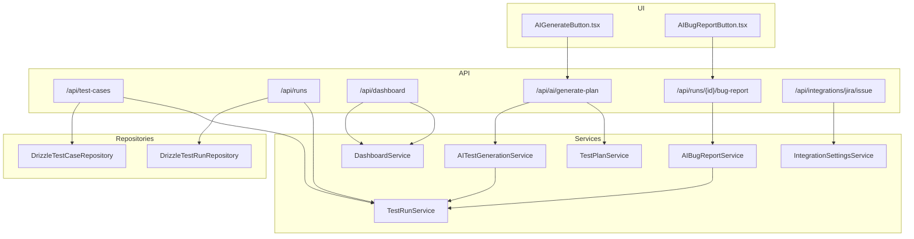
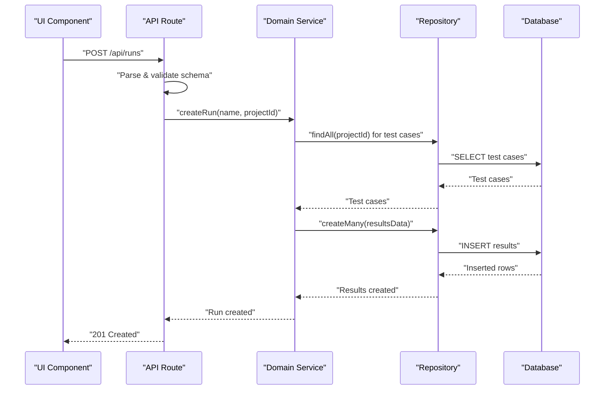
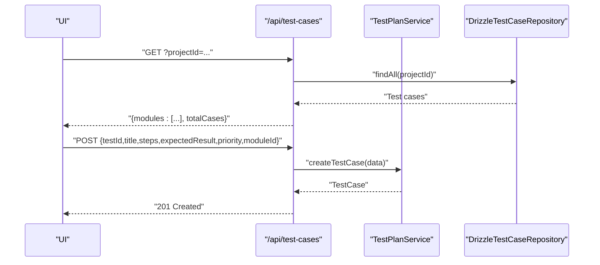
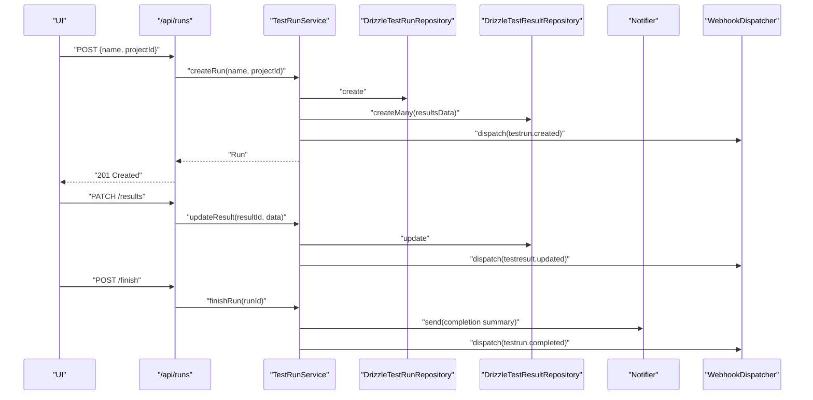
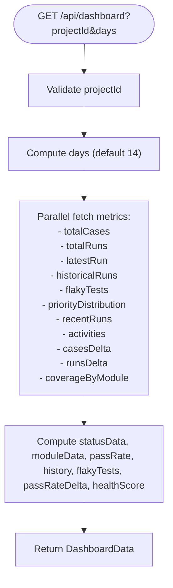
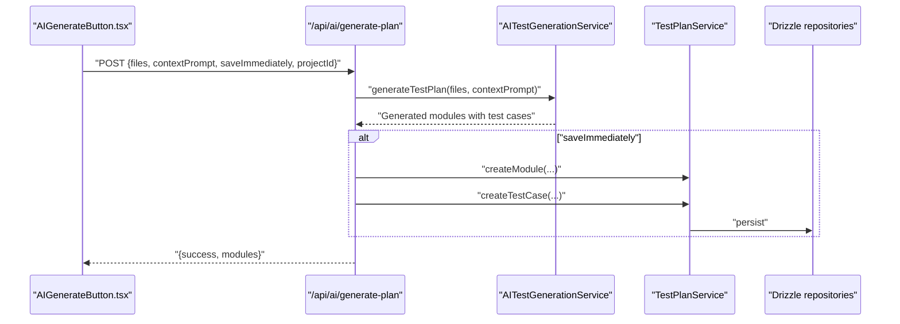
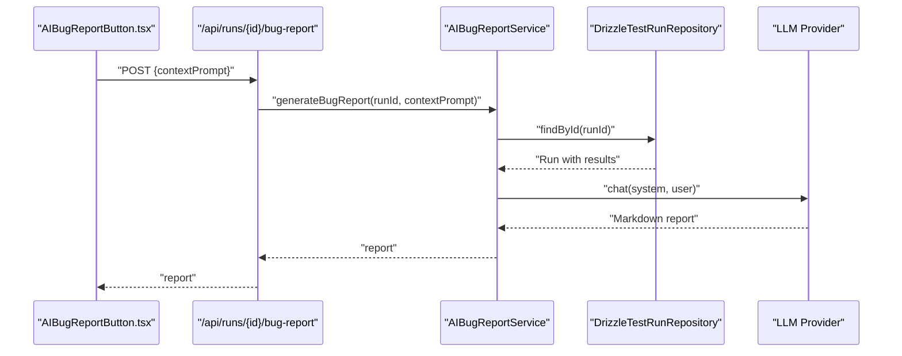
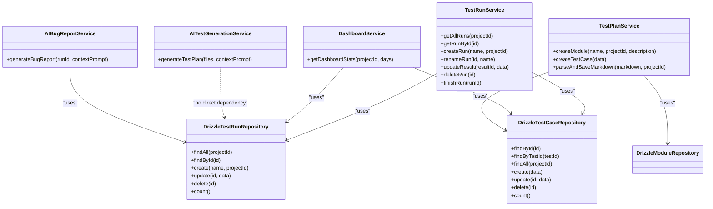

# Core Features

<cite>
**Referenced Files in This Document**
- [app/api/test-cases/route.ts](file://app/api/test-cases/route.ts)
- [app/api/runs/route.ts](file://app/api/runs/route.ts)
- [app/api/dashboard/route.ts](file://app/api/dashboard/route.ts)
- [app/api/ai/generate-plan/route.ts](file://app/api/ai/generate-plan/route.ts)
- [app/api/runs/[id]/bug-report/route.ts](file://app/api/runs/[id]/bug-report/route.ts)
- [app/api/integrations/jira/issue/route.ts](file://app/api/integrations/jira/issue/route.ts)
- [src/domain/services/TestRunService.ts](file://src/domain/services/TestRunService.ts)
- [src/domain/services/DashboardService.ts](file://src/domain/services/DashboardService.ts)
- [src/domain/services/AITestGenerationService.ts](file://src/domain/services/AITestGenerationService.ts)
- [src/domain/services/AIBugReportService.ts](file://src/domain/services/AIBugReportService.ts)
- [src/domain/services/TestPlanService.ts](file://src/domain/services/TestPlanService.ts)
- [src/domain/services/IntegrationSettingsService.ts](file://src/domain/services/IntegrationSettingsService.ts)
- [src/adapters/persistence/drizzle/DrizzleTestCaseRepository.ts](file://src/adapters/persistence/drizzle/DrizzleTestCaseRepository.ts)
- [src/adapters/persistence/drizzle/DrizzleTestRunRepository.ts](file://src/adapters/persistence/drizzle/DrizzleTestRunRepository.ts)
- [app/api/_lib/schemas.ts](file://app/api/_lib/schemas.ts)
- [src/ui/test-design/AIGenerateButton.tsx](file://src/ui/test-design/AIGenerateButton.tsx)
- [src/ui/test-run/AIBugReportButton.tsx](file://src/ui/test-run/AIBugReportButton.tsx)
</cite>

## Table of Contents
1. [Introduction](#introduction)
2. [Project Structure](#project-structure)
3. [Core Components](#core-components)
4. [Architecture Overview](#architecture-overview)
5. [Detailed Component Analysis](#detailed-component-analysis)
6. [Dependency Analysis](#dependency-analysis)
7. [Performance Considerations](#performance-considerations)
8. [Troubleshooting Guide](#troubleshooting-guide)
9. [Conclusion](#conclusion)

## Introduction
This document explains the core features of Test Plan Manager with a focus on:
- Test Case Management: modules, priorities, and imports
- Test Execution Management: run lifecycle and result tracking
- Dashboard and Analytics: real-time metrics and trend analysis
- AI-Powered Features: test generation and bug reporting

It documents business logic, user workflows, data models, integration patterns, and practical examples from the codebase. It also shows how features integrate to support a cohesive testing workflow.

## Project Structure
The system follows a layered architecture:
- API routes define endpoints and orchestrate requests
- Services encapsulate business logic and coordinate repositories
- Repositories abstract persistence via Drizzle ORM
- UI components provide user interactions and trigger API calls
- Integration adapters enable external systems (LLM providers, Jira, Slack)

**Diagram sources**
- [app/api/test-cases/route.ts:1-37](file://app/api/test-cases/route.ts#L1-L37)
- [app/api/runs/route.ts:1-26](file://app/api/runs/route.ts#L1-L26)
- [app/api/dashboard/route.ts:1-24](file://app/api/dashboard/route.ts#L1-L24)
- [app/api/ai/generate-plan/route.ts:1-32](file://app/api/ai/generate-plan/route.ts#L1-L32)
- [app/api/runs/[id]/bug-report/route.ts](file://app/api/runs/[id]/bug-report/route.ts)
- [app/api/integrations/jira/issue/route.ts](file://app/api/integrations/jira/issue/route.ts)
- [src/domain/services/TestRunService.ts:1-125](file://src/domain/services/TestRunService.ts#L1-L125)
- [src/domain/services/DashboardService.ts:1-182](file://src/domain/services/DashboardService.ts#L1-L182)
- [src/domain/services/AITestGenerationService.ts:1-82](file://src/domain/services/AITestGenerationService.ts#L1-L82)
- [src/domain/services/AIBugReportService.ts:1-70](file://src/domain/services/AIBugReportService.ts#L1-L70)
- [src/domain/services/TestPlanService.ts:1-110](file://src/domain/services/TestPlanService.ts#L1-L110)
- [src/domain/services/IntegrationSettingsService.ts:1-37](file://src/domain/services/IntegrationSettingsService.ts#L1-L37)
- [src/adapters/persistence/drizzle/DrizzleTestCaseRepository.ts:1-71](file://src/adapters/persistence/drizzle/DrizzleTestCaseRepository.ts#L1-L71)
- [src/adapters/persistence/drizzle/DrizzleTestRunRepository.ts:1-96](file://src/adapters/persistence/drizzle/DrizzleTestRunRepository.ts#L1-L96)
- [src/ui/test-design/AIGenerateButton.tsx:1-166](file://src/ui/test-design/AIGenerateButton.tsx#L1-L166)
- [src/ui/test-run/AIBugReportButton.tsx:1-195](file://src/ui/test-run/AIBugReportButton.tsx#L1-L195)

**Section sources**
- [app/api/test-cases/route.ts:1-37](file://app/api/test-cases/route.ts#L1-L37)
- [app/api/runs/route.ts:1-26](file://app/api/runs/route.ts#L1-L26)
- [app/api/dashboard/route.ts:1-24](file://app/api/dashboard/route.ts#L1-L24)
- [app/api/ai/generate-plan/route.ts:1-32](file://app/api/ai/generate-plan/route.ts#L1-L32)
- [app/api/runs/[id]/bug-report/route.ts](file://app/api/runs/[id]/bug-report/route.ts)
- [app/api/integrations/jira/issue/route.ts](file://app/api/integrations/jira/issue/route.ts)
- [src/domain/services/TestRunService.ts:1-125](file://src/domain/services/TestRunService.ts#L1-L125)
- [src/domain/services/DashboardService.ts:1-182](file://src/domain/services/DashboardService.ts#L1-L182)
- [src/domain/services/AITestGenerationService.ts:1-82](file://src/domain/services/AITestGenerationService.ts#L1-L82)
- [src/domain/services/AIBugReportService.ts:1-70](file://src/domain/services/AIBugReportService.ts#L1-L70)
- [src/domain/services/TestPlanService.ts:1-110](file://src/domain/services/TestPlanService.ts#L1-L110)
- [src/domain/services/IntegrationSettingsService.ts:1-37](file://src/domain/services/IntegrationSettingsService.ts#L1-L37)
- [src/adapters/persistence/drizzle/DrizzleTestCaseRepository.ts:1-71](file://src/adapters/persistence/drizzle/DrizzleTestCaseRepository.ts#L1-L71)
- [src/adapters/persistence/drizzle/DrizzleTestRunRepository.ts:1-96](file://src/adapters/persistence/drizzle/DrizzleTestRunRepository.ts#L1-L96)
- [src/ui/test-design/AIGenerateButton.tsx:1-166](file://src/ui/test-design/AIGenerateButton.tsx#L1-L166)
- [src/ui/test-run/AIBugReportButton.tsx:1-195](file://src/ui/test-run/AIBugReportButton.tsx#L1-L195)

## Core Components
- Test Case Management
  - API: lists test cases grouped by module and supports creation
  - Service: parses Markdown test plans and persists modules/test cases
  - Persistence: Drizzle repository for test cases
- Test Execution Management
  - API: lists runs and creates runs
  - Service: manages run lifecycle, result updates, notifications, and completion analytics
  - Persistence: Drizzle repository for runs and results
- Dashboard and Analytics
  - API: aggregates dashboard statistics
  - Service: computes pass rates, module stats, trends, health scores, and deltas
- AI-Powered Features
  - API: AI test plan generation and AI bug report generation
  - Services: AI generation and bug report generation using LLM provider factory
  - UI: AI generation button and AI bug report modal

**Section sources**
- [app/api/test-cases/route.ts:1-37](file://app/api/test-cases/route.ts#L1-L37)
- [src/domain/services/TestPlanService.ts:1-110](file://src/domain/services/TestPlanService.ts#L1-L110)
- [src/adapters/persistence/drizzle/DrizzleTestCaseRepository.ts:1-71](file://src/adapters/persistence/drizzle/DrizzleTestCaseRepository.ts#L1-L71)
- [app/api/runs/route.ts:1-26](file://app/api/runs/route.ts#L1-L26)
- [src/domain/services/TestRunService.ts:1-125](file://src/domain/services/TestRunService.ts#L1-L125)
- [src/adapters/persistence/drizzle/DrizzleTestRunRepository.ts:1-96](file://src/adapters/persistence/drizzle/DrizzleTestRunRepository.ts#L1-L96)
- [app/api/dashboard/route.ts:1-24](file://app/api/dashboard/route.ts#L1-L24)
- [src/domain/services/DashboardService.ts:1-182](file://src/domain/services/DashboardService.ts#L1-L182)
- [app/api/ai/generate-plan/route.ts:1-32](file://app/api/ai/generate-plan/route.ts#L1-L32)
- [src/domain/services/AITestGenerationService.ts:1-82](file://src/domain/services/AITestGenerationService.ts#L1-L82)
- [app/api/runs/[id]/bug-report/route.ts](file://app/api/runs/[id]/bug-report/route.ts)
- [src/domain/services/AIBugReportService.ts:1-70](file://src/domain/services/AIBugReportService.ts#L1-L70)
- [src/ui/test-design/AIGenerateButton.tsx:1-166](file://src/ui/test-design/AIGenerateButton.tsx#L1-L166)
- [src/ui/test-run/AIBugReportButton.tsx:1-195](file://src/ui/test-run/AIBugReportButton.tsx#L1-L195)

## Architecture Overview
The system separates concerns across UI, API, Services, and Repositories. APIs validate inputs using Zod schemas, delegate to services, and return JSON responses. Services depend on repositories via typed ports, enabling pluggable persistence. UI components trigger API endpoints and refresh views upon success.

**Diagram sources**
- [app/api/runs/route.ts:20-25](file://app/api/runs/route.ts#L20-L25)
- [src/domain/services/TestRunService.ts:33-51](file://src/domain/services/TestRunService.ts#L33-L51)
- [src/adapters/persistence/drizzle/DrizzleTestRunRepository.ts:70-85](file://src/adapters/persistence/drizzle/DrizzleTestRunRepository.ts#L70-L85)
- [src/adapters/persistence/drizzle/DrizzleTestCaseRepository.ts:18-35](file://src/adapters/persistence/drizzle/DrizzleTestCaseRepository.ts#L18-L35)

## Detailed Component Analysis

### Test Case Management
- Business logic
  - List test cases grouped by module for a project
  - Create test cases with validation
  - Parse Markdown test plans and persist modules and test cases
- User workflows
  - View test cases grouped by module
  - Import Markdown test plan to create modules and test cases
- Data models
  - Test case fields: identifier, title, steps, expected result, priority, module association
  - Module: name, project association
- Integration patterns
  - API validates inputs using Zod schemas
  - Services coordinate repositories for reads/writes
  - UI triggers import and refreshes the page

**Diagram sources**
- [app/api/test-cases/route.ts:8-28](file://app/api/test-cases/route.ts#L8-L28)
- [src/domain/services/TestPlanService.ts:23-25](file://src/domain/services/TestPlanService.ts#L23-L25)
- [src/adapters/persistence/drizzle/DrizzleTestCaseRepository.ts:18-47](file://src/adapters/persistence/drizzle/DrizzleTestCaseRepository.ts#L18-L47)

**Section sources**
- [app/api/test-cases/route.ts:1-37](file://app/api/test-cases/route.ts#L1-L37)
- [src/domain/services/TestPlanService.ts:1-110](file://src/domain/services/TestPlanService.ts#L1-L110)
- [src/adapters/persistence/drizzle/DrizzleTestCaseRepository.ts:1-71](file://src/adapters/persistence/drizzle/DrizzleTestCaseRepository.ts#L1-L71)
- [app/api/_lib/schemas.ts:74-91](file://app/api/_lib/schemas.ts#L74-L91)

### Test Execution Management
- Business logic
  - Create a run that auto-generates UNTESTED results for all existing test cases
  - Update individual test result statuses and notes
  - Finish a run and compute pass/fail/block counts, severity, and dispatch notifications/webhooks
- User workflows
  - Create a run, update results during execution, and finish the run
- Data models
  - Test run: name, project association, timestamps
  - Test result: status, notes, attachments, links to test case and run
- Integration patterns
  - Webhooks dispatched on run create/update/delete and completion
  - Optional notifier integration for run completion alerts

**Diagram sources**
- [app/api/runs/route.ts:20-25](file://app/api/runs/route.ts#L20-L25)
- [src/domain/services/TestRunService.ts:33-84](file://src/domain/services/TestRunService.ts#L33-L84)
- [src/adapters/persistence/drizzle/DrizzleTestRunRepository.ts:70-85](file://src/adapters/persistence/drizzle/DrizzleTestRunRepository.ts#L70-L85)
- [src/adapters/persistence/drizzle/DrizzleTestRunRepository.ts:16-67](file://src/adapters/persistence/drizzle/DrizzleTestRunRepository.ts#L16-L67)

**Section sources**
- [app/api/runs/route.ts:1-26](file://app/api/runs/route.ts#L1-L26)
- [src/domain/services/TestRunService.ts:1-125](file://src/domain/services/TestRunService.ts#L1-L125)
- [src/adapters/persistence/drizzle/DrizzleTestRunRepository.ts:1-96](file://src/adapters/persistence/drizzle/DrizzleTestRunRepository.ts#L1-L96)
- [app/api/_lib/schemas.ts:23-27](file://app/api/_lib/schemas.ts#L23-L27)

### Dashboard and Analytics
- Business logic
  - Aggregate statistics: total cases, total runs, latest run, historical pass rates, priority distribution, recent runs, activities, coverage by module
  - Compute pass rate deltas and health score based on pass rate, flakiness, coverage, and recency
- User workflows
  - Load dashboard with configurable look-back window (default 14 days)
- Data models
  - Dashboard data includes arrays for status breakdown, module stats, historical pass rates, and flaky tests
- Integration patterns
  - Parallel fetch of multiple metrics for performance

**Diagram sources**
- [app/api/dashboard/route.ts:7-22](file://app/api/dashboard/route.ts#L7-L22)
- [src/domain/services/DashboardService.ts:17-147](file://src/domain/services/DashboardService.ts#L17-L147)

**Section sources**
- [app/api/dashboard/route.ts:1-24](file://app/api/dashboard/route.ts#L1-L24)
- [src/domain/services/DashboardService.ts:1-182](file://src/domain/services/DashboardService.ts#L1-L182)

### AI-Powered Features
- Test Plan Generation
  - Business logic
    - Accepts code files and optional context prompt
    - Uses LLM provider factory to generate modules and test cases in JSON
    - Optionally saves immediately into a project by creating modules and test cases
  - User workflow
    - Select project folder, optionally add context, generate plan, and optionally save immediately
- Bug Reporting
  - Business logic
    - Analyzes FAILED and BLOCKED results from a run
    - Generates a structured Markdown bug report using an LLM provider
    - Supports downloading the report and pushing to Jira via integration API
  - User workflow
    - Open AI Bug Report modal, optionally add developer focus, generate, download, or push to Jira

**Diagram sources**
- [src/ui/test-design/AIGenerateButton.tsx:45-80](file://src/ui/test-design/AIGenerateButton.tsx#L45-L80)
- [app/api/ai/generate-plan/route.ts:8-31](file://app/api/ai/generate-plan/route.ts#L8-L31)
- [src/domain/services/AITestGenerationService.ts:28-80](file://src/domain/services/AITestGenerationService.ts#L28-L80)
- [src/domain/services/TestPlanService.ts:15-25](file://src/domain/services/TestPlanService.ts#L15-L25)

**Diagram sources**
- [src/ui/test-run/AIBugReportButton.tsx:20-41](file://src/ui/test-run/AIBugReportButton.tsx#L20-L41)
- [app/api/runs/[id]/bug-report/route.ts](file://app/api/runs/[id]/bug-report/route.ts)
- [src/domain/services/AIBugReportService.ts:16-68](file://src/domain/services/AIBugReportService.ts#L16-L68)
- [src/adapters/persistence/drizzle/DrizzleTestRunRepository.ts:16-32](file://src/adapters/persistence/drizzle/DrizzleTestRunRepository.ts#L16-L32)

**Section sources**
- [app/api/ai/generate-plan/route.ts:1-32](file://app/api/ai/generate-plan/route.ts#L1-L32)
- [src/domain/services/AITestGenerationService.ts:1-82](file://src/domain/services/AITestGenerationService.ts#L1-L82)
- [src/domain/services/TestPlanService.ts:1-110](file://src/domain/services/TestPlanService.ts#L1-L110)
- [src/ui/test-design/AIGenerateButton.tsx:1-166](file://src/ui/test-design/AIGenerateButton.tsx#L1-L166)
- [app/api/runs/[id]/bug-report/route.ts](file://app/api/runs/[id]/bug-report/route.ts)
- [src/domain/services/AIBugReportService.ts:1-70](file://src/domain/services/AIBugReportService.ts#L1-L70)
- [src/ui/test-run/AIBugReportButton.tsx:1-195](file://src/ui/test-run/AIBugReportButton.tsx#L1-L195)

## Dependency Analysis
- API routes depend on services and Zod schemas
- Services depend on repositories via typed ports
- Repositories depend on Drizzle ORM and database schema
- UI components depend on API endpoints and project state
- Integration services manage settings for LLM/Jira/Slack

**Diagram sources**
- [src/domain/services/TestRunService.ts:1-125](file://src/domain/services/TestRunService.ts#L1-L125)
- [src/domain/services/DashboardService.ts:1-182](file://src/domain/services/DashboardService.ts#L1-L182)
- [src/domain/services/AITestGenerationService.ts:1-82](file://src/domain/services/AITestGenerationService.ts#L1-L82)
- [src/domain/services/AIBugReportService.ts:1-70](file://src/domain/services/AIBugReportService.ts#L1-L70)
- [src/domain/services/TestPlanService.ts:1-110](file://src/domain/services/TestPlanService.ts#L1-L110)
- [src/adapters/persistence/drizzle/DrizzleTestCaseRepository.ts:1-71](file://src/adapters/persistence/drizzle/DrizzleTestCaseRepository.ts#L1-L71)
- [src/adapters/persistence/drizzle/DrizzleTestRunRepository.ts:1-96](file://src/adapters/persistence/drizzle/DrizzleTestRunRepository.ts#L1-L96)

**Section sources**
- [src/domain/services/TestRunService.ts:1-125](file://src/domain/services/TestRunService.ts#L1-L125)
- [src/domain/services/DashboardService.ts:1-182](file://src/domain/services/DashboardService.ts#L1-L182)
- [src/domain/services/AITestGenerationService.ts:1-82](file://src/domain/services/AITestGenerationService.ts#L1-L82)
- [src/domain/services/AIBugReportService.ts:1-70](file://src/domain/services/AIBugReportService.ts#L1-L70)
- [src/domain/services/TestPlanService.ts:1-110](file://src/domain/services/TestPlanService.ts#L1-L110)
- [src/adapters/persistence/drizzle/DrizzleTestCaseRepository.ts:1-71](file://src/adapters/persistence/drizzle/DrizzleTestCaseRepository.ts#L1-L71)
- [src/adapters/persistence/drizzle/DrizzleTestRunRepository.ts:1-96](file://src/adapters/persistence/drizzle/DrizzleTestRunRepository.ts#L1-L96)

## Performance Considerations
- Parallelization
  - Dashboard aggregates metrics using parallel fetches to reduce latency
  - Test case listing groups results efficiently after fetching modules and cases
- Caching and deduplication
  - Run result loading deduplicates attachments per result
- Token limits and context windows
  - UI limits selected files to avoid exceeding LLM context limits
  - AI services configure max tokens and temperature for deterministic outputs
- Database queries
  - Repositories filter by project ID and join tables to minimize round trips

[No sources needed since this section provides general guidance]

## Troubleshooting Guide
- Validation errors
  - Missing project ID or invalid schema triggers validation errors in API routes
- AI generation failures
  - LLM provider misconfiguration or invalid JSON responses cause errors; verify provider settings and retry
- Jira integration
  - Ensure Jira credentials and project key are configured; check server connectivity and permissions
- Notifications
  - If notifier is unavailable, run completion notifications are skipped; verify notifier settings

**Section sources**
- [app/api/_lib/schemas.ts:5-91](file://app/api/_lib/schemas.ts#L5-L91)
- [app/api/dashboard/route.ts:12-17](file://app/api/dashboard/route.ts#L12-L17)
- [src/domain/services/AITestGenerationService.ts:66-79](file://src/domain/services/AITestGenerationService.ts#L66-L79)
- [src/domain/services/IntegrationSettingsService.ts:11-35](file://src/domain/services/IntegrationSettingsService.ts#L11-L35)
- [src/ui/test-run/AIBugReportButton.tsx:72-83](file://src/ui/test-run/AIBugReportButton.tsx#L72-L83)

## Conclusion
Test Plan Manager integrates UI, API, services, and repositories to deliver a cohesive testing workflow. Test Case Management supports imports and grouping, Test Execution Management automates run lifecycle and result tracking, Dashboard and Analytics provide actionable insights, and AI-powered features accelerate test plan creation and bug reporting. The layered architecture and typed ports enable maintainability, extensibility, and robust integrations.