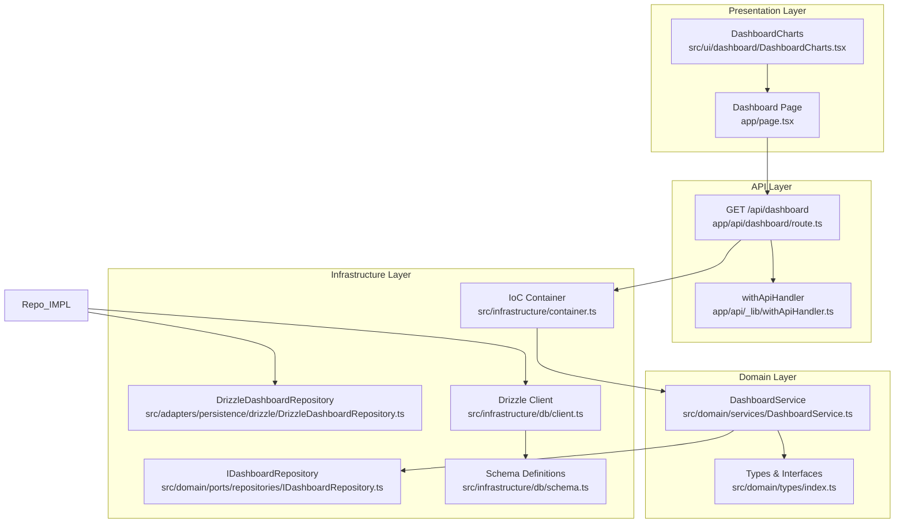
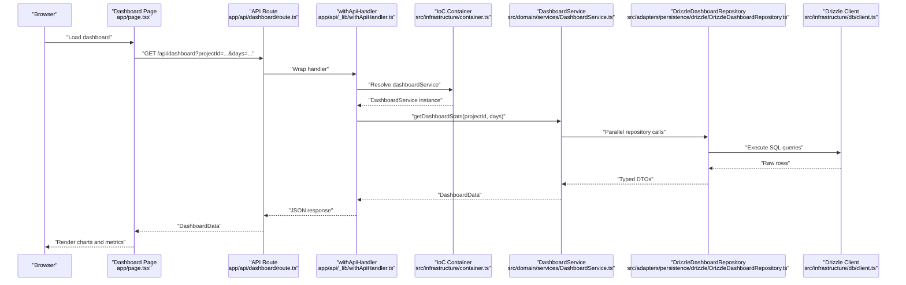
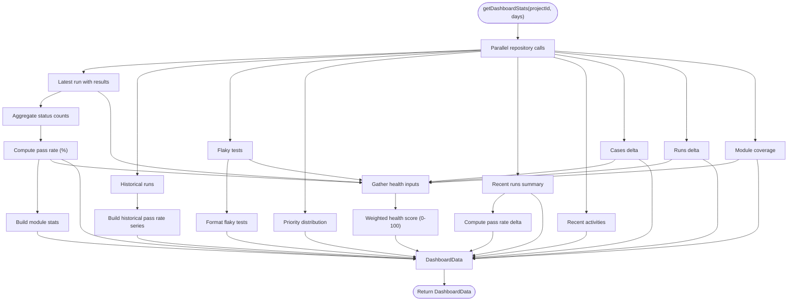
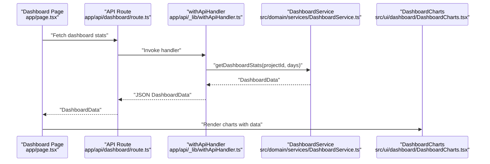
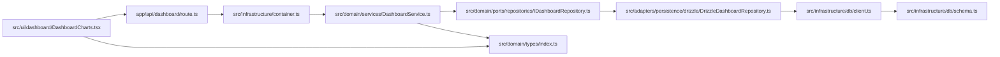

# Analytics Data Models

<cite>
**Referenced Files in This Document**
- [DashboardService.ts](file://src/domain/services/DashboardService.ts)
- [DrizzleDashboardRepository.ts](file://src/adapters/persistence/drizzle/DrizzleDashboardRepository.ts)
- [IDashboardRepository.ts](file://src/domain/ports/repositories/IDashboardRepository.ts)
- [ITestCaseRepository.ts](file://src/domain/ports/repositories/ITestCaseRepository.ts)
- [ITestRunRepository.ts](file://src/domain/ports/repositories/ITestRunRepository.ts)
- [index.ts](file://src/domain/types/index.ts)
- [route.ts](file://app/api/dashboard/route.ts)
- [withApiHandler.ts](file://app/api/_lib/withApiHandler.ts)
- [schema.ts](file://src/infrastructure/db/schema.ts)
- [client.ts](file://src/infrastructure/db/client.ts)
- [container.ts](file://src/infrastructure/container.ts)
- [DashboardCharts.tsx](file://src/ui/dashboard/DashboardCharts.tsx)
- [page.tsx](file://app/page.tsx)
- [QueryProvider.tsx](file://src/infrastructure/state/QueryProvider.tsx)
- [DomainErrors.ts](file://src/domain/errors/DomainErrors.ts)
</cite>

## Table of Contents
1. [Introduction](#introduction)
2. [Project Structure](#project-structure)
3. [Core Components](#core-components)
4. [Architecture Overview](#architecture-overview)
5. [Detailed Component Analysis](#detailed-component-analysis)
6. [Dependency Analysis](#dependency-analysis)
7. [Performance Considerations](#performance-considerations)
8. [Troubleshooting Guide](#troubleshooting-guide)
9. [Conclusion](#conclusion)

## Introduction
This document provides comprehensive documentation for the Analytics Data Models powering the dashboard. It details the DashboardData interface structure, ModuleStats model, and TestResult aggregation patterns. It explains the data transformation processes in DashboardService, including status breakdown calculations, pass rate computations, and health score algorithms. It documents repository patterns for data retrieval, query optimization strategies, and caching mechanisms. Finally, it illustrates data flow from repositories to UI components, showing how raw database queries are transformed into dashboard-ready metrics, and addresses data validation, error handling, and performance considerations.

## Project Structure
The analytics pipeline spans the domain, infrastructure, and presentation layers:
- Domain layer defines typed data models and the DashboardService orchestrating analytics.
- Infrastructure layer implements repositories using Drizzle ORM and exposes database clients.
- Presentation layer renders charts and displays metrics using React components and TanStack Query.



**Diagram sources**
- [page.tsx:227-268](file://app/page.tsx#L227-L268)
- [route.ts:1-24](file://app/api/dashboard/route.ts#L1-L24)
- [withApiHandler.ts:1-65](file://app/api/_lib/withApiHandler.ts#L1-L65)
- [DashboardService.ts:1-182](file://src/domain/services/DashboardService.ts#L1-L182)
- [index.ts:1-196](file://src/domain/types/index.ts#L1-L196)
- [container.ts:1-126](file://src/infrastructure/container.ts#L1-L126)
- [IDashboardRepository.ts:1-15](file://src/domain/ports/repositories/IDashboardRepository.ts#L1-L15)
- [DrizzleDashboardRepository.ts:1-313](file://src/adapters/persistence/drizzle/DrizzleDashboardRepository.ts#L1-L313)
- [client.ts:1-31](file://src/infrastructure/db/client.ts#L1-L31)
- [schema.ts:1-60](file://src/infrastructure/db/schema.ts#L1-L60)

**Section sources**
- [page.tsx:227-268](file://app/page.tsx#L227-L268)
- [route.ts:1-24](file://app/api/dashboard/route.ts#L1-L24)
- [container.ts:1-126](file://src/infrastructure/container.ts#L1-L126)

## Core Components
This section focuses on the primary data models and their transformations.

- DashboardData: Aggregated analytics payload for the dashboard UI, including totals, status breakdowns, historical pass rates, flaky tests, pass rate deltas, priority distributions, recent runs, activities, module coverage, and a health score.
- ModuleStats: Per-module pass rate metrics derived from latest run results.
- TestResult: Core entity representing individual test outcomes with status and associated test case/module.

Key transformations handled by DashboardService:
- Status breakdown calculation from latest run results.
- Pass rate computation for both overall and module-level metrics.
- Historical pass rate series generation.
- Flaky tests identification and ranking.
- Pass rate delta computation across recent runs.
- Health score calculation using weighted components.

**Section sources**
- [index.ts:98-175](file://src/domain/types/index.ts#L98-L175)
- [DashboardService.ts:17-147](file://src/domain/services/DashboardService.ts#L17-L147)

## Architecture Overview
The analytics pipeline follows a layered architecture:
- API routes accept requests and delegate to domain services.
- Domain services orchestrate parallel repository calls and transform raw data into dashboard-ready metrics.
- Repositories encapsulate database queries and return typed DTOs.
- UI components render charts and metrics using standardized data models.



**Diagram sources**
- [page.tsx:236-262](file://app/page.tsx#L236-L262)
- [route.ts:7-22](file://app/api/dashboard/route.ts#L7-L22)
- [withApiHandler.ts:22-64](file://app/api/_lib/withApiHandler.ts#L22-L64)
- [container.ts:59-59](file://src/infrastructure/container.ts#L59-L59)
- [DashboardService.ts:17-147](file://src/domain/services/DashboardService.ts#L17-L147)
- [DrizzleDashboardRepository.ts:18-60](file://src/adapters/persistence/drizzle/DrizzleDashboardRepository.ts#L18-L60)
- [client.ts:1-31](file://src/infrastructure/db/client.ts#L1-L31)

## Detailed Component Analysis

### DashboardService
Responsibilities:
- Orchestrates parallel data retrieval from repositories.
- Computes status breakdown, pass rates, historical trends, flaky tests, deltas, and health score.
- Produces a normalized DashboardData object for the UI.

Key algorithms:
- Status breakdown: Iterates latest run results and aggregates counts per status.
- Pass rate: Calculates percentage of PASSED results out of total results.
- Historical pass rate: Builds a time series of pass rates from historical runs.
- Flaky tests: Identifies tests with moderate failure rates across recent runs.
- Pass rate delta: Compares pass rate between the two most recent runs.
- Health score: Weighted combination of pass rate, flaky penalty, freshness, and coverage.



**Diagram sources**
- [DashboardService.ts:17-147](file://src/domain/services/DashboardService.ts#L17-L147)

**Section sources**
- [DashboardService.ts:17-182](file://src/domain/services/DashboardService.ts#L17-L182)

### DrizzleDashboardRepository
Responsibilities:
- Implements IDashboardRepository with optimized SQL queries.
- Returns typed DTOs for dashboard consumption.

Key methods and optimizations:
- getLatestRun: Joins testResults with testCases and modules, left joins attachments, and deduplicates results by result id.
- getHistoricalRuns: Fetches runs and attaches status counts per run efficiently.
- getFlakyTests: Identifies tests with moderate failure rates across recent runs using sliding window of recent run ids.
- getPriorityDistribution: Counts test cases by priority and assigns colors.
- getRecentRuns: Summarizes run-level stats (total, passed, failed, blocked, untested) and pass rate.
- getActivities: Generates recent activity items based on run creation/completion.
- getCasesDelta: Placeholder returning zero (requires test case creation timestamps).
- getRunsDelta: Counts runs within a given date window.
- getModuleCoverage: Computes module-level coverage using counts and latest run results.

```mermaid
classDiagram
class IDashboardRepository {
+getLatestRun(projectId) : Promise~TestRunWithResults|null~
+getHistoricalRuns(projectId, limit) : Promise~TestRun[]~
+getFlakyTests(projectId) : Promise~{testCase; failureRate}[]~
+getPriorityDistribution(projectId) : Promise~PriorityDistribution[]~
+getRecentRuns(projectId, limit) : Promise~RecentRunSummary[]~
+getActivities(projectId, limit) : Promise~ActivityItem[]~
+getCasesDelta(projectId, days) : Promise~number~
+getRunsDelta(projectId, days) : Promise~number~
+getModuleCoverage(projectId) : Promise~ModuleCoverage[]~
}
class DrizzleDashboardRepository {
+getLatestRun(projectId) : Promise~TestRunWithResults|null~
+getHistoricalRuns(projectId, limit) : Promise~TestRun[]~
+getFlakyTests(projectId) : Promise~{testCase; failureRate}[]~
+getPriorityDistribution(projectId) : Promise~PriorityDistribution[]~
+getRecentRuns(projectId, limit) : Promise~RecentRunSummary[]~
+getActivities(projectId, limit) : Promise~ActivityItem[]~
+getCasesDelta(projectId, days) : Promise~number~
+getRunsDelta(projectId, days) : Promise~number~
+getModuleCoverage(projectId) : Promise~ModuleCoverage[]~
}
IDashboardRepository <|.. DrizzleDashboardRepository : "implements"
```

**Diagram sources**
- [IDashboardRepository.ts:3-12](file://src/domain/ports/repositories/IDashboardRepository.ts#L3-L12)
- [DrizzleDashboardRepository.ts:14-313](file://src/adapters/persistence/drizzle/DrizzleDashboardRepository.ts#L14-L313)

**Section sources**
- [DrizzleDashboardRepository.ts:18-313](file://src/adapters/persistence/drizzle/DrizzleDashboardRepository.ts#L18-L313)

### Data Models and Transformations
DashboardData structure and related models:
- DashboardData: Aggregates totals, latest run, statusData, moduleData, history, flakyTests, passRate, lastRunDate, casesDelta, runsDelta, passRateDelta, priorityDistribution, recentRuns, activities, coverageByModule, and healthScore.
- ModuleStats: Per-module metrics including name, passed, total, and successRate.
- HistoricalData: Time-series entries with date and passRate.
- FlakyTest: Identified unstable tests with testId, title, and failureRate.
- PriorityDistribution: Priority counts with color mapping.
- RecentRunSummary: Run-level summary with pass/fail/block/untested counts and passRate.
- ActivityItem: Event log entries for UI feed.
- ModuleCoverage: Module-level coverage with totalCases, testedCases, and passRate.

Transformation highlights:
- Status breakdown: Aggregates counts per status from latest run results and maps to statusData entries with fill colors.
- Pass rate: Computes overall pass rate and module-level success rates.
- Historical pass rate: Builds a series of daily pass rates from historical runs.
- Flaky tests: Filters and ranks tests with moderate failure rates across recent runs.
- Pass rate delta: Computes difference between the two most recent runs.
- Health score: Combines pass rate, flaky penalty, freshness, and coverage into a single 0–100 score.

**Section sources**
- [index.ts:98-175](file://src/domain/types/index.ts#L98-L175)
- [DashboardService.ts:46-147](file://src/domain/services/DashboardService.ts#L46-L147)

### API Integration and Data Flow
- API endpoint: GET /api/dashboard validates projectId and optional days, delegates to dashboardService, and returns DashboardData.
- Error handling: withApiHandler centralizes error mapping for validation, domain, and unknown errors.
- Frontend: Dashboard page fetches data, manages loading and refresh states, and passes metrics to DashboardCharts for rendering.



**Diagram sources**
- [route.ts:7-22](file://app/api/dashboard/route.ts#L7-L22)
- [withApiHandler.ts:22-64](file://app/api/_lib/withApiHandler.ts#L22-L64)
- [DashboardService.ts:17-147](file://src/domain/services/DashboardService.ts#L17-L147)
- [DashboardCharts.tsx:25-177](file://src/ui/dashboard/DashboardCharts.tsx#L25-L177)
- [page.tsx:236-262](file://app/page.tsx#L236-L262)

**Section sources**
- [route.ts:7-22](file://app/api/dashboard/route.ts#L7-L22)
- [withApiHandler.ts:22-64](file://app/api/_lib/withApiHandler.ts#L22-L64)
- [DashboardCharts.tsx:25-177](file://src/ui/dashboard/DashboardCharts.tsx#L25-L177)
- [page.tsx:236-262](file://app/page.tsx#L236-L262)

## Dependency Analysis
The analytics pipeline exhibits clean separation of concerns:
- Domain services depend on repository interfaces, enabling testability and swapping implementations.
- Repositories depend on Drizzle ORM and database schema definitions.
- API routes depend on the IoC container to resolve services.
- UI components depend on typed data models for rendering.



**Diagram sources**
- [route.ts:4-4](file://app/api/dashboard/route.ts#L4-L4)
- [container.ts:59-59](file://src/infrastructure/container.ts#L59-L59)
- [DashboardService.ts:11-15](file://src/domain/services/DashboardService.ts#L11-L15)
- [IDashboardRepository.ts:3-12](file://src/domain/ports/repositories/IDashboardRepository.ts#L3-L12)
- [DrizzleDashboardRepository.ts:14-14](file://src/adapters/persistence/drizzle/DrizzleDashboardRepository.ts#L14-L14)
- [client.ts:1-31](file://src/infrastructure/db/client.ts#L1-L31)
- [schema.ts:1-60](file://src/infrastructure/db/schema.ts#L1-L60)
- [index.ts:150-175](file://src/domain/types/index.ts#L150-L175)
- [DashboardCharts.tsx:25-177](file://src/ui/dashboard/DashboardCharts.tsx#L25-L177)

**Section sources**
- [container.ts:59-59](file://src/infrastructure/container.ts#L59-L59)
- [DashboardService.ts:11-15](file://src/domain/services/DashboardService.ts#L11-L15)
- [DrizzleDashboardRepository.ts:14-14](file://src/adapters/persistence/drizzle/DrizzleDashboardRepository.ts#L14-L14)

## Performance Considerations
- Parallel data retrieval: DashboardService uses Promise.all to fetch multiple datasets concurrently, reducing total latency.
- Efficient joins and grouping: DrizzleDashboardRepository performs grouped aggregations and joins to minimize round trips and memory usage.
- Caching and reactivity: The UI layer uses TanStack Query with a 5-minute stale time and disables refetch on window focus to balance freshness and performance.
- Database tuning: SQLite uses WAL mode and foreign keys enabled for improved concurrency and data integrity.
- Query optimization patterns:
  - Deduplication of joined results by result id to avoid duplication.
  - Single-pass aggregation for module stats and flaky tests.
  - Sliding window approach for recent runs to bound computation cost.

[No sources needed since this section provides general guidance]

## Troubleshooting Guide
Common issues and resolutions:
- Validation errors: API route requires projectId; missing or invalid parameters return structured validation errors.
- Domain errors: DomainErrors map to appropriate HTTP status codes; inspect error code and details for actionable feedback.
- Unknown errors: All exceptions are caught and returned as internal server errors with logging.
- UI data loading: Dashboard page handles empty states and manual refresh; ensure active project id is set before fetching.

**Section sources**
- [route.ts:12-17](file://app/api/dashboard/route.ts#L12-L17)
- [withApiHandler.ts:28-62](file://app/api/_lib/withApiHandler.ts#L28-L62)
- [DomainErrors.ts:7-39](file://src/domain/errors/DomainErrors.ts#L7-L39)
- [page.tsx:236-262](file://app/page.tsx#L236-L262)

## Conclusion
The Analytics Data Models provide a robust foundation for dashboard insights. DashboardService orchestrates efficient data transformations, while DrizzleDashboardRepository delivers optimized queries against the schema. The typed models ensure consistency across the pipeline, and the UI renders actionable metrics. The architecture supports scalability through parallelization, caching, and modular design, with clear error handling and validation patterns.