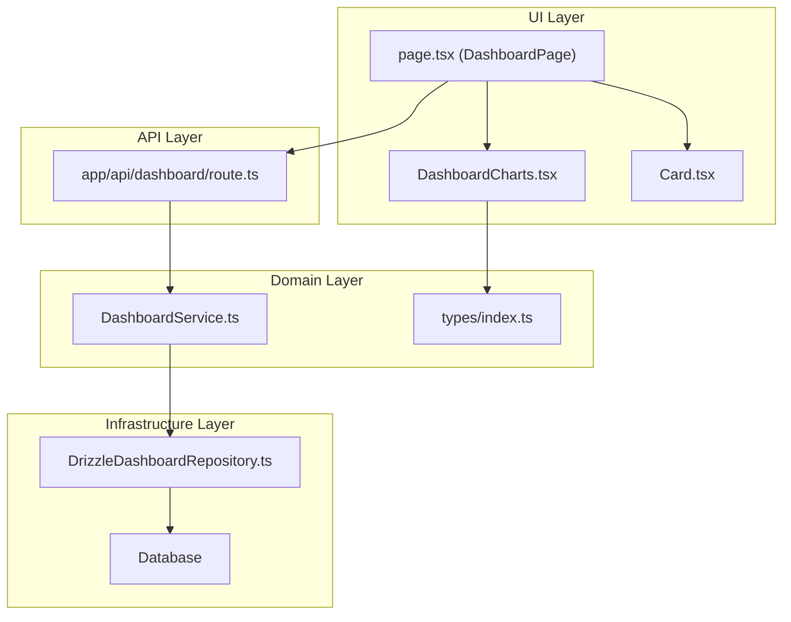
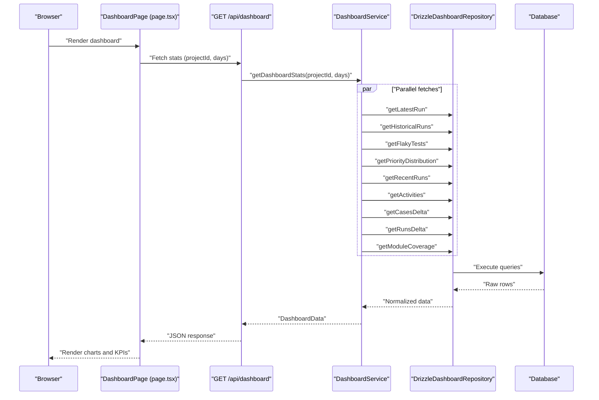
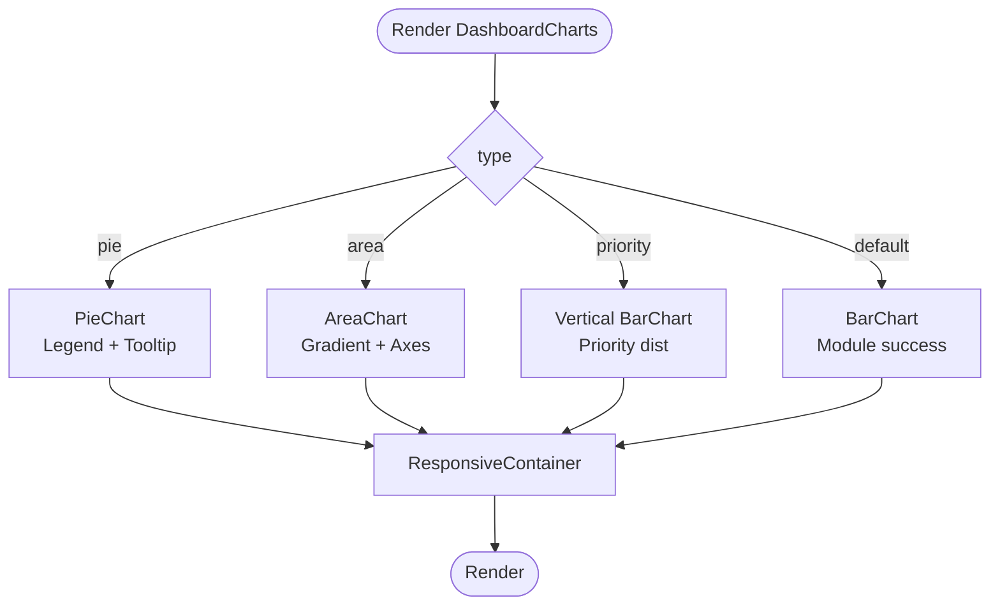
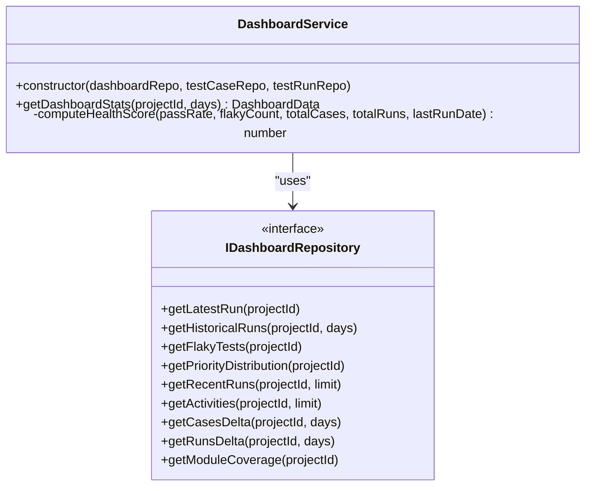
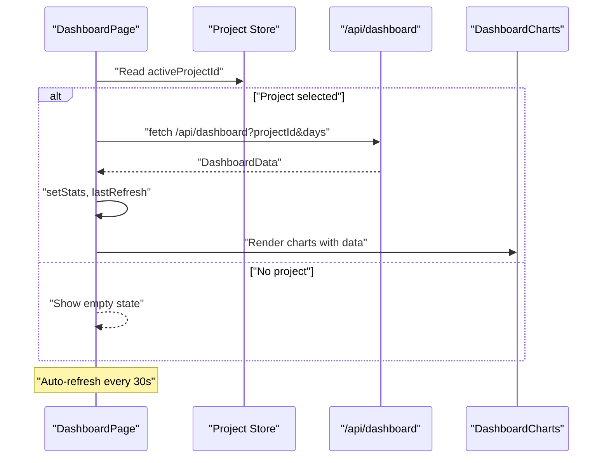
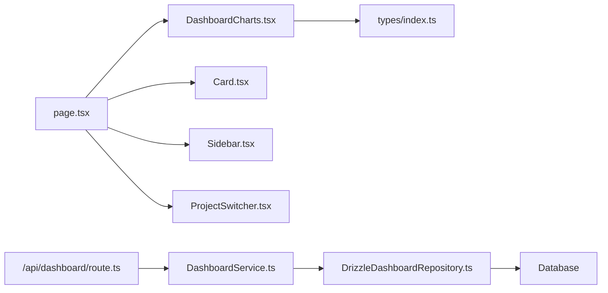

# Dashboard Components

<cite>
**Referenced Files in This Document**
- [DashboardCharts.tsx](file://src/ui/dashboard/DashboardCharts.tsx)
- [DashboardService.ts](file://src/domain/services/DashboardService.ts)
- [DrizzleDashboardRepository.ts](file://src/adapters/persistence/drizzle/DrizzleDashboardRepository.ts)
- [index.ts (types)](file://src/domain/types/index.ts)
- [route.ts (dashboard API)](file://app/api/dashboard/route.ts)
- [page.tsx (DashboardPage)](file://app/page.tsx)
- [Card.tsx](file://src/ui/shared/Card.tsx)
- [Sidebar.tsx](file://src/ui/layout/Sidebar.tsx)
- [ProjectSwitcher.tsx](file://src/ui/layout/ProjectSwitcher.tsx)
</cite>

## Table of Contents
1. [Introduction](#introduction)
2. [Project Structure](#project-structure)
3. [Core Components](#core-components)
4. [Architecture Overview](#architecture-overview)
5. [Detailed Component Analysis](#detailed-component-analysis)
6. [Dependency Analysis](#dependency-analysis)
7. [Performance Considerations](#performance-considerations)
8. [Troubleshooting Guide](#troubleshooting-guide)
9. [Conclusion](#conclusion)

## Introduction
This document focuses on the Dashboard Components, specifically the DashboardCharts.tsx implementation and the surrounding ecosystem that powers the dashboard’s data visualization. It explains how charts are rendered, how data flows from the backend through services and repositories to the UI, and how real-time updates are handled. It also covers KPI cards, progress indicators, interactive charts, responsive design patterns, and state management.

## Project Structure
The dashboard is a client-side Next.js page that orchestrates data fetching, caching, and rendering. The key pieces are:
- UI: DashboardCharts.tsx renders multiple chart types using Recharts.
- Services: DashboardService aggregates metrics from multiple repositories.
- Repositories: DrizzleDashboardRepository executes database queries.
- API: route.ts exposes a GET endpoint returning dashboard stats.
- Page: page.tsx manages state, auto-refresh, and renders KPI cards and charts.

**Diagram sources**
- [DashboardCharts.tsx:1-178](file://src/ui/dashboard/DashboardCharts.tsx#L1-L178)
- [DashboardService.ts:1-182](file://src/domain/services/DashboardService.ts#L1-L182)
- [DrizzleDashboardRepository.ts:1-313](file://src/adapters/persistence/drizzle/DrizzleDashboardRepository.ts#L1-L313)
- [index.ts (types):150-175](file://src/domain/types/index.ts#L150-L175)
- [route.ts (dashboard API):1-24](file://app/api/dashboard/route.ts#L1-L24)
- [page.tsx:228-623](file://app/page.tsx#L228-L623)
- [Card.tsx:1-24](file://src/ui/shared/Card.tsx#L1-L24)

**Section sources**
- [DashboardCharts.tsx:1-178](file://src/ui/dashboard/DashboardCharts.tsx#L1-L178)
- [DashboardService.ts:1-182](file://src/domain/services/DashboardService.ts#L1-L182)
- [DrizzleDashboardRepository.ts:1-313](file://src/adapters/persistence/drizzle/DrizzleDashboardRepository.ts#L1-L313)
- [index.ts (types):150-175](file://src/domain/types/index.ts#L150-L175)
- [route.ts (dashboard API):1-24](file://app/api/dashboard/route.ts#L1-L24)
- [page.tsx:228-623](file://app/page.tsx#L228-L623)
- [Card.tsx:1-24](file://src/ui/shared/Card.tsx#L1-L24)

## Core Components
- DashboardCharts.tsx: Renders pie, area, vertical bar, and default bar charts using Recharts. It accepts a type and data props and applies a consistent tooltip style and theme tokens.
- DashboardService.ts: Aggregates dashboard metrics by fetching data in parallel from repositories and computing derived metrics such as pass rates, health scores, and distributions.
- DrizzleDashboardRepository.ts: Implements repository methods to query latest runs, historical runs, flaky tests, priority distribution, recent runs, activities, deltas, and module coverage.
- page.tsx (DashboardPage): Orchestrates data loading, auto-refresh, manual refresh, and renders KPI cards, progress bars, health gauge, and charts.
- Shared UI: Card.tsx provides a reusable card container; Sidebar.tsx and ProjectSwitcher.tsx provide navigation and project selection.

**Section sources**
- [DashboardCharts.tsx:10-178](file://src/ui/dashboard/DashboardCharts.tsx#L10-L178)
- [DashboardService.ts:17-147](file://src/domain/services/DashboardService.ts#L17-L147)
- [DrizzleDashboardRepository.ts:18-311](file://src/adapters/persistence/drizzle/DrizzleDashboardRepository.ts#L18-L311)
- [page.tsx:228-623](file://app/page.tsx#L228-L623)
- [Card.tsx:4-24](file://src/ui/shared/Card.tsx#L4-L24)
- [Sidebar.tsx:16-49](file://src/ui/layout/Sidebar.tsx#L16-L49)
- [ProjectSwitcher.tsx:29-397](file://src/ui/layout/ProjectSwitcher.tsx#L29-L397)

## Architecture Overview
The dashboard follows a layered architecture:
- API layer handles requests and delegates to a service.
- Service layer coordinates multiple repositories to assemble dashboard data.
- Repository layer performs database queries and returns normalized data.
- UI layer renders charts and KPIs, manages state, and triggers refresh cycles.

**Diagram sources**
- [route.ts (dashboard API):7-22](file://app/api/dashboard/route.ts#L7-L22)
- [DashboardService.ts:17-43](file://src/domain/services/DashboardService.ts#L17-L43)
- [DrizzleDashboardRepository.ts:18-311](file://src/adapters/persistence/drizzle/DrizzleDashboardRepository.ts#L18-L311)
- [page.tsx:236-262](file://app/page.tsx#L236-L262)

## Detailed Component Analysis

### DashboardCharts.tsx: Chart Rendering Patterns and Recharts Integration
- Props:
  - type: 'pie' | 'bar' | 'area' | 'priority'
  - data: any[]
- Rendering patterns:
  - Pie chart: displays status distribution with a legend and percentage tooltip.
  - Area chart: shows pass rate history over time with gradient fill and axis formatting.
  - Vertical bar chart (priority): shows priority distribution with category axis and colored bars.
  - Default bar chart (module success rate): shows module-wise pass rates with tooltips and theme-aware styling.
- Responsive design:
  - Uses ResponsiveContainer to adapt to parent width and height.
  - Consistent chart height via className.
- Tooltip customization:
  - Centralized CUSTOM_TOOLTIP_STYLE applied to all charts.
  - Formatters adjust value presentation (percentages, labels).
- Theming:
  - Uses Tailwind/HSL tokens for borders, backgrounds, and foregrounds.
  - Gradient and cell fills are theme-safe.

**Diagram sources**
- [DashboardCharts.tsx:25-177](file://src/ui/dashboard/DashboardCharts.tsx#L25-L177)

**Section sources**
- [DashboardCharts.tsx:10-23](file://src/ui/dashboard/DashboardCharts.tsx#L10-L23)
- [DashboardCharts.tsx:25-65](file://src/ui/dashboard/DashboardCharts.tsx#L25-L65)
- [DashboardCharts.tsx:68-112](file://src/ui/dashboard/DashboardCharts.tsx#L68-L112)
- [DashboardCharts.tsx:114-146](file://src/ui/dashboard/DashboardCharts.tsx#L114-L146)
- [DashboardCharts.tsx:149-177](file://src/ui/dashboard/DashboardCharts.tsx#L149-L177)

### DashboardService.ts: Aggregation and Derived Metrics
- Parallel data fetching reduces latency.
- Computes:
  - Status distribution from latest run results.
  - Module success rates grouped by module.
  - Historical pass rate series.
  - Flaky tests with failure rates.
  - Pass rate delta between recent runs.
  - Health score using weighted components (pass rate, flaky penalty, freshness, coverage).
- Returns a consolidated DashboardData object consumed by the UI.

**Diagram sources**
- [DashboardService.ts:10-182](file://src/domain/services/DashboardService.ts#L10-L182)
- [DrizzleDashboardRepository.ts:14-313](file://src/adapters/persistence/drizzle/DrizzleDashboardRepository.ts#L14-L313)

**Section sources**
- [DashboardService.ts:17-147](file://src/domain/services/DashboardService.ts#L17-L147)
- [DashboardService.ts:149-180](file://src/domain/services/DashboardService.ts#L149-L180)

### DrizzleDashboardRepository.ts: Data Access Patterns
- Implements all repository methods required by the service:
  - Latest run with nested results and attachments.
  - Historical runs with aggregated results.
  - Flaky tests computed across recent runs.
  - Priority distribution with color mapping.
  - Recent runs summary with pass rates.
  - Activities feed with messages and timestamps.
  - Deltas for cases and runs.
  - Module coverage with pass rates.
- Uses efficient joins and aggregations to minimize round trips.

**Section sources**
- [DrizzleDashboardRepository.ts:18-311](file://src/adapters/persistence/drizzle/DrizzleDashboardRepository.ts#L18-L311)

### page.tsx (DashboardPage): State Management and Real-Time Updates
- State:
  - stats: DashboardData | null
  - loading: boolean
  - days: number (date range)
  - lastRefresh: Date
  - refreshing: boolean
- Behavior:
  - Loads data on initial render and when date range changes.
  - Auto-refreshes every 30 seconds while a project is selected.
  - Manual refresh via a button.
  - Renders KPI cards, progress bars, health gauge, and charts.
  - Handles empty states and onboarding.

**Diagram sources**
- [page.tsx:228-269](file://app/page.tsx#L228-L269)
- [page.tsx:426-466](file://app/page.tsx#L426-L466)
- [DashboardCharts.tsx:25-177](file://src/ui/dashboard/DashboardCharts.tsx#L25-L177)

**Section sources**
- [page.tsx:228-269](file://app/page.tsx#L228-L269)
- [page.tsx:283-292](file://app/page.tsx#L283-L292)
- [page.tsx:426-466](file://app/page.tsx#L426-L466)

### KPI Cards, Progress Indicators, and Interactive Charts
- KPI Cards: Grid layout with links to relevant sections, showing totals, deltas, and contextual badges.
- Progress Indicators: ProgressBar composes a simple SVG-based progress bar with smooth transitions.
- Health Gauge: A circular SVG gauge visualizes the health score with color thresholds and labels.
- Charts: DashboardCharts integrates with Recharts to render interactive, responsive charts with consistent styling.

**Section sources**
- [page.tsx:354-412](file://app/page.tsx#L354-L412)
- [page.tsx:109-118](file://app/page.tsx#L109-L118)
- [page.tsx:64-107](file://app/page.tsx#L64-L107)
- [DashboardCharts.tsx:15-23](file://src/ui/dashboard/DashboardCharts.tsx#L15-L23)

### Responsive Design and Styling Approaches
- ResponsiveContainer ensures charts scale to their containers.
- Tailwind classes apply theme tokens (backgrounds, borders, muted text) consistently.
- Typography and spacing use relative units and grid layouts for adaptability.

**Section sources**
- [DashboardCharts.tsx:29-64](file://src/ui/dashboard/DashboardCharts.tsx#L29-L64)
- [DashboardCharts.tsx:150-176](file://src/ui/dashboard/DashboardCharts.tsx#L150-L176)
- [page.tsx:304-351](file://app/page.tsx#L304-L351)

### Practical Examples and Customization
- Customizing chart configurations:
  - Modify axes, grids, gradients, and tooltip formatters in DashboardCharts.tsx.
  - Adjust colors via data fill values or theme tokens.
- Handling data loading states:
  - page.tsx shows loading spinners and empty states until stats are ready.
- Real-time dashboard updates:
  - Auto-refresh interval is defined and used to poll for fresh data.
  - Manual refresh toggles a refreshing flag to prevent concurrent loads.

**Section sources**
- [DashboardCharts.tsx:68-112](file://src/ui/dashboard/DashboardCharts.tsx#L68-L112)
- [DashboardCharts.tsx:114-146](file://src/ui/dashboard/DashboardCharts.tsx#L114-L146)
- [page.tsx:226-269](file://app/page.tsx#L226-L269)
- [page.tsx:283-292](file://app/page.tsx#L283-L292)

## Dependency Analysis
- DashboardCharts depends on:
  - Recharts primitives for rendering.
  - Tailwind/HSL tokens for styling.
- DashboardPage depends on:
  - DashboardCharts for visualization.
  - Card.tsx for layout.
  - ProjectSwitcher.tsx and Sidebar.tsx for navigation and project selection.
- DashboardService depends on:
  - IDashboardRepository implementations (DrizzleDashboardRepository).
- API route depends on:
  - DashboardService and wraps it with a shared handler.

**Diagram sources**
- [page.tsx:228-623](file://app/page.tsx#L228-L623)
- [DashboardCharts.tsx:1-178](file://src/ui/dashboard/DashboardCharts.tsx#L1-L178)
- [Card.tsx:1-24](file://src/ui/shared/Card.tsx#L1-L24)
- [Sidebar.tsx:16-49](file://src/ui/layout/Sidebar.tsx#L16-L49)
- [ProjectSwitcher.tsx:29-397](file://src/ui/layout/ProjectSwitcher.tsx#L29-L397)
- [route.ts (dashboard API):1-24](file://app/api/dashboard/route.ts#L1-L24)
- [DashboardService.ts:1-182](file://src/domain/services/DashboardService.ts#L1-L182)
- [DrizzleDashboardRepository.ts:1-313](file://src/adapters/persistence/drizzle/DrizzleDashboardRepository.ts#L1-L313)
- [index.ts (types):150-175](file://src/domain/types/index.ts#L150-L175)

**Section sources**
- [DashboardCharts.tsx:1-178](file://src/ui/dashboard/DashboardCharts.tsx#L1-L178)
- [DashboardService.ts:1-182](file://src/domain/services/DashboardService.ts#L1-L182)
- [DrizzleDashboardRepository.ts:1-313](file://src/adapters/persistence/drizzle/DrizzleDashboardRepository.ts#L1-L313)
- [index.ts (types):150-175](file://src/domain/types/index.ts#L150-L175)
- [route.ts (dashboard API):1-24](file://app/api/dashboard/route.ts#L1-L24)
- [page.tsx:228-623](file://app/page.tsx#L228-L623)
- [Card.tsx:1-24](file://src/ui/shared/Card.tsx#L1-L24)
- [Sidebar.tsx:16-49](file://src/ui/layout/Sidebar.tsx#L16-L49)
- [ProjectSwitcher.tsx:29-397](file://src/ui/layout/ProjectSwitcher.tsx#L29-L397)

## Performance Considerations
- Parallel data fetching in DashboardService reduces total latency.
- Efficient database queries in DrizzleDashboardRepository minimize round trips.
- Auto-refresh interval balances freshness and resource usage.
- Responsive charts avoid unnecessary reflows by leveraging ResponsiveContainer.

## Troubleshooting Guide
- No project selected:
  - The page shows a neutral prompt to select or create a project.
- Loading states:
  - Spinner indicates initial load or manual refresh.
- Empty datasets:
  - Charts display friendly placeholders when insufficient data exists.
- API validation:
  - The dashboard API requires projectId and returns structured errors on missing parameters.

**Section sources**
- [page.tsx:272-292](file://app/page.tsx#L272-L292)
- [route.ts (dashboard API):12-17](file://app/api/dashboard/route.ts#L12-L17)

## Conclusion
The dashboard combines a clean separation of concerns with a reactive UI. DashboardCharts.tsx encapsulates chart rendering and theming, DashboardService aggregates data efficiently, and the page orchestrates state and refresh cycles. Together, they deliver a responsive, real-time dashboard experience with consistent styling and robust data handling.