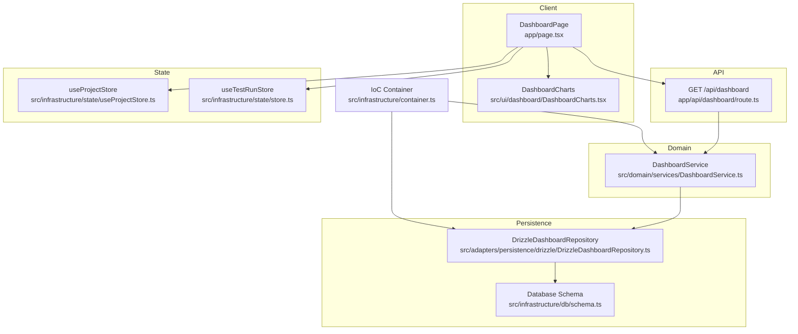
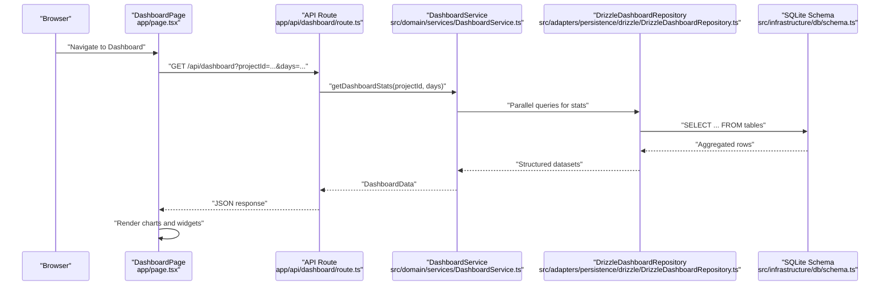
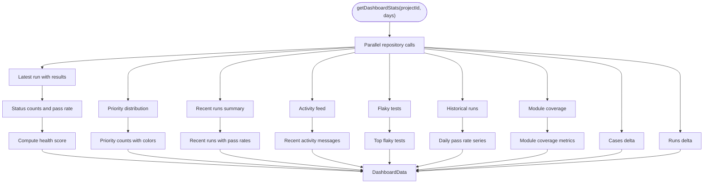
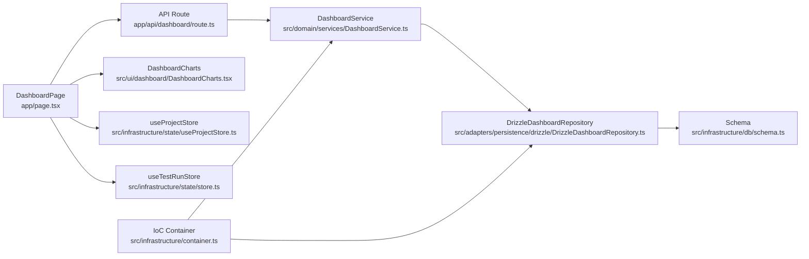

# Dashboard and Analytics

<cite>
**Referenced Files in This Document**
- [DashboardService.ts](file://src/domain/services/DashboardService.ts)
- [DrizzleDashboardRepository.ts](file://src/adapters/persistence/drizzle/DrizzleDashboardRepository.ts)
- [DashboardCharts.tsx](file://src/ui/dashboard/DashboardCharts.tsx)
- [route.ts](file://app/api/dashboard/route.ts)
- [index.ts](file://src/domain/types/index.ts)
- [schema.ts](file://src/infrastructure/db/schema.ts)
- [container.ts](file://src/infrastructure/container.ts)
- [page.tsx](file://app/page.tsx)
- [useProjectStore.ts](file://src/infrastructure/state/useProjectStore.ts)
- [store.ts](file://src/infrastructure/state/store.ts)
</cite>

## Table of Contents
1. [Introduction](#introduction)
2. [Project Structure](#project-structure)
3. [Core Components](#core-components)
4. [Architecture Overview](#architecture-overview)
5. [Detailed Component Analysis](#detailed-component-analysis)
6. [Dependency Analysis](#dependency-analysis)
7. [Performance Considerations](#performance-considerations)
8. [Troubleshooting Guide](#troubleshooting-guide)
9. [Conclusion](#conclusion)
10. [Appendices](#appendices)

## Introduction
This document explains the Dashboard and Analytics feature end-to-end. It covers real-time dashboard components, analytics visualizations powered by Recharts, performance metrics computation, and trend analysis. It documents the DashboardService implementation, data aggregation patterns, chart rendering components, and real-time data updates. It also details the analytics data models, dashboard widgets, metric calculations, and state management integration. Practical examples show how to configure dashboard views, interpret analytics data, track test performance trends, and export analytical reports. Finally, it addresses data refresh mechanisms, visualization customization, and integration with external analytics systems.

## Project Structure
The Dashboard and Analytics feature spans the domain, infrastructure, and UI layers:
- Domain service orchestrates analytics computations.
- Persistence adapters query the database and aggregate data.
- API routes expose dashboard data to the client.
- UI renders charts and widgets using Recharts and Tailwind.
- State stores manage active project selection and filters.

**Diagram sources**
- [page.tsx:228-270](file://app/page.tsx#L228-L270)
- [route.ts:7-22](file://app/api/dashboard/route.ts#L7-L22)
- [DashboardService.ts:10-147](file://src/domain/services/DashboardService.ts#L10-L147)
- [DrizzleDashboardRepository.ts:14-312](file://src/adapters/persistence/drizzle/DrizzleDashboardRepository.ts#L14-L312)
- [schema.ts:10-60](file://src/infrastructure/db/schema.ts#L10-L60)
- [useProjectStore.ts:15-18](file://src/infrastructure/state/useProjectStore.ts#L15-L18)
- [store.ts:22-45](file://src/infrastructure/state/store.ts#L22-L45)
- [container.ts:59-59](file://src/infrastructure/container.ts#L59-L59)

**Section sources**
- [page.tsx:228-270](file://app/page.tsx#L228-L270)
- [route.ts:7-22](file://app/api/dashboard/route.ts#L7-L22)
- [DashboardService.ts:10-147](file://src/domain/services/DashboardService.ts#L10-L147)
- [DrizzleDashboardRepository.ts:14-312](file://src/adapters/persistence/drizzle/DrizzleDashboardRepository.ts#L14-L312)
- [schema.ts:10-60](file://src/infrastructure/db/schema.ts#L10-L60)
- [useProjectStore.ts:15-18](file://src/infrastructure/state/useProjectStore.ts#L15-L18)
- [store.ts:22-45](file://src/infrastructure/state/store.ts#L22-L45)
- [container.ts:59-59](file://src/infrastructure/container.ts#L59-L59)

## Core Components
- Dashboard API route: Validates query parameters and delegates to the domain service.
- DashboardService: Orchestrates parallel data retrieval, computes metrics, and aggregates analytics.
- DrizzleDashboardRepository: Implements repository methods to query and aggregate data from the schema.
- DashboardCharts: Renders Recharts visualizations for pie, area, bar, and priority distributions.
- DashboardPage: Client-side dashboard UI, state management, auto-refresh, and widget rendering.
- Data models: Strongly typed analytics DTOs and entities define the shape of dashboard data.

**Section sources**
- [route.ts:7-22](file://app/api/dashboard/route.ts#L7-L22)
- [DashboardService.ts:17-147](file://src/domain/services/DashboardService.ts#L17-L147)
- [DrizzleDashboardRepository.ts:18-312](file://src/adapters/persistence/drizzle/DrizzleDashboardRepository.ts#L18-L312)
- [DashboardCharts.tsx:25-177](file://src/ui/dashboard/DashboardCharts.tsx#L25-L177)
- [page.tsx:228-622](file://app/page.tsx#L228-L622)
- [index.ts:150-175](file://src/domain/types/index.ts#L150-L175)

## Architecture Overview
The system follows a layered architecture:
- API layer handles requests and responses.
- Domain layer encapsulates business logic and metrics computation.
- Persistence layer abstracts database queries and aggregations.
- UI layer renders charts and widgets, manages state, and triggers refresh cycles.

**Diagram sources**
- [page.tsx:236-251](file://app/page.tsx#L236-L251)
- [route.ts:7-22](file://app/api/dashboard/route.ts#L7-L22)
- [DashboardService.ts:17-43](file://src/domain/services/DashboardService.ts#L17-L43)
- [DrizzleDashboardRepository.ts:18-81](file://src/adapters/persistence/drizzle/DrizzleDashboardRepository.ts#L18-L81)
- [schema.ts:42-51](file://src/infrastructure/db/schema.ts#L42-L51)

## Detailed Component Analysis

### DashboardService
Responsibilities:
- Executes parallel repository calls to gather dashboard datasets.
- Computes status distribution, pass rate, module success rates, and historical pass rate.
- Identifies flaky tests and recent runs.
- Calculates pass rate delta, runs delta, and a composite health score.
- Returns a single DashboardData payload for the UI.

Key implementation patterns:
- Parallel data fetching to minimize latency.
- Aggregation loops over test results to derive counts and rates.
- Weighted scoring for health score considering pass rate, flakiness, freshness, and coverage.

**Diagram sources**
- [DashboardService.ts:17-147](file://src/domain/services/DashboardService.ts#L17-L147)
- [DrizzleDashboardRepository.ts:18-312](file://src/adapters/persistence/drizzle/DrizzleDashboardRepository.ts#L18-L312)

**Section sources**
- [DashboardService.ts:17-147](file://src/domain/services/DashboardService.ts#L17-L147)

### DrizzleDashboardRepository
Responsibilities:
- Retrieve latest run with nested results, modules, and attachments.
- Build historical run series with pass rates.
- Identify flaky tests based on recent runs and failure rates.
- Compute priority distribution with color mapping.
- Summarize recent runs with pass/fail/blocked/untested counts.
- Generate activity feed entries for run creation/completion.
- Calculate deltas for cases and runs.
- Compute module coverage metrics.

Implementation highlights:
- Efficient joins and grouping to aggregate counts and rates.
- Map-reduce patterns to compute flaky tests and module stats.
- Predefined color palette for priorities.

**Section sources**
- [DrizzleDashboardRepository.ts:18-312](file://src/adapters/persistence/drizzle/DrizzleDashboardRepository.ts#L18-L312)

### Dashboard API Route
Responsibilities:
- Enforces presence of projectId.
- Parses days parameter with default fallback.
- Delegates to DashboardService and returns JSON.

**Section sources**
- [route.ts:7-22](file://app/api/dashboard/route.ts#L7-L22)

### DashboardCharts (Recharts)
Responsibilities:
- Render pie chart for status distribution.
- Render area chart for historical pass rate.
- Render vertical bar chart for priority distribution.
- Render module success rate bar chart.
- Provide responsive containers and tooltips.

Customization:
- Tooltip styles and formatters.
- Axis and legend configurations.
- Gradient fills and responsive sizing.

**Section sources**
- [DashboardCharts.tsx:25-177](file://src/ui/dashboard/DashboardCharts.tsx#L25-L177)

### DashboardPage (Client)
Responsibilities:
- Manage active project, loading, refresh state, and date range.
- Auto-refresh every 30 seconds when a project is selected.
- Fetch dashboard data via the API route.
- Render KPI cards, charts, health gauge, coverage heatmap, recent runs, flaky tests, and activity feed.
- Provide manual refresh and navigation controls.

State management:
- useProjectStore for active project selection.
- useTestRunStore for filtering and selection in related contexts.

**Section sources**
- [page.tsx:228-622](file://app/page.tsx#L228-L622)
- [useProjectStore.ts:15-18](file://src/infrastructure/state/useProjectStore.ts#L15-L18)
- [store.ts:22-45](file://src/infrastructure/state/store.ts#L22-L45)

### Analytics Data Models
Core types define the analytics payload:
- DashboardData: top-level analytics bundle.
- ModuleStats: module-level pass rate and counts.
- HistoricalData: daily pass rate series.
- FlakyTest: test identifier, title, and failure rate.
- PriorityDistribution: priority counts with fill colors.
- RecentRunSummary: recent run metrics.
- ActivityItem: recent activity messages with metadata.
- ModuleCoverage: module coverage and pass rate.
- TestRunWithResults: run with nested results and attachments.

These types ensure consistent serialization/deserialization across the API and UI.

**Section sources**
- [index.ts:150-175](file://src/domain/types/index.ts#L150-L175)
- [index.ts:98-148](file://src/domain/types/index.ts#L98-L148)
- [index.ts:179-183](file://src/domain/types/index.ts#L179-L183)

### Database Schema
The schema defines the relational model supporting analytics:
- Projects, Modules, TestCases, TestRuns, TestResults, TestAttachments.
- Unique constraints and foreign keys ensure referential integrity.
- TestResults defaults to UNTESTED status.

**Section sources**
- [schema.ts:10-60](file://src/infrastructure/db/schema.ts#L10-L60)

### Dependency Injection Container
The IoC container wires repositories and services:
- Exposes dashboardService and dashboardRepo for API usage.
- Ensures singletons and avoids duplication in Next.js runtime.

**Section sources**
- [container.ts:59-59](file://src/infrastructure/container.ts#L59-L59)
- [container.ts:108-125](file://src/infrastructure/container.ts#L108-L125)

## Dependency Analysis
The dashboard feature exhibits clean separation of concerns:
- UI depends on API and state stores.
- API depends on the domain service.
- Domain service depends on repositories.
- Repositories depend on the schema.

**Diagram sources**
- [page.tsx:228-270](file://app/page.tsx#L228-L270)
- [route.ts:7-22](file://app/api/dashboard/route.ts#L7-L22)
- [DashboardService.ts:10-147](file://src/domain/services/DashboardService.ts#L10-L147)
- [DrizzleDashboardRepository.ts:14-312](file://src/adapters/persistence/drizzle/DrizzleDashboardRepository.ts#L14-L312)
- [schema.ts:10-60](file://src/infrastructure/db/schema.ts#L10-L60)
- [DashboardCharts.tsx:25-177](file://src/ui/dashboard/DashboardCharts.tsx#L25-L177)
- [useProjectStore.ts:15-18](file://src/infrastructure/state/useProjectStore.ts#L15-L18)
- [store.ts:22-45](file://src/infrastructure/state/store.ts#L22-L45)
- [container.ts:59-59](file://src/infrastructure/container.ts#L59-L59)

**Section sources**
- [page.tsx:228-270](file://app/page.tsx#L228-L270)
- [route.ts:7-22](file://app/api/dashboard/route.ts#L7-L22)
- [DashboardService.ts:10-147](file://src/domain/services/DashboardService.ts#L10-L147)
- [DrizzleDashboardRepository.ts:14-312](file://src/adapters/persistence/drizzle/DrizzleDashboardRepository.ts#L14-L312)
- [schema.ts:10-60](file://src/infrastructure/db/schema.ts#L10-L60)
- [DashboardCharts.tsx:25-177](file://src/ui/dashboard/DashboardCharts.tsx#L25-L177)
- [useProjectStore.ts:15-18](file://src/infrastructure/state/useProjectStore.ts#L15-L18)
- [store.ts:22-45](file://src/infrastructure/state/store.ts#L22-L45)
- [container.ts:59-59](file://src/infrastructure/container.ts#L59-L59)

## Performance Considerations
- Parallel aggregation: DashboardService uses Promise.all to fetch multiple datasets concurrently, reducing total latency.
- Efficient queries: DrizzleDashboardRepository performs grouped and joined queries to compute counts and rates in the database.
- Lightweight UI rendering: Recharts components are responsive and optimized for small chart sizes typical in dashboards.
- Auto-refresh cadence: 30-second intervals balance freshness with network usage.
- Pagination and limits: Methods like recent runs and activities apply reasonable limits to keep payloads small.

Recommendations:
- Add database indexes on frequently filtered columns (e.g., projectId, createdAt).
- Consider caching hot dashboard segments for short intervals.
- Monitor API response times and adjust auto-refresh interval dynamically based on load.

[No sources needed since this section provides general guidance]

## Troubleshooting Guide
Common issues and resolutions:
- Missing projectId: The API route returns a validation error if projectId is absent.
- No active project: The UI displays a guidance message until a project is selected.
- Empty datasets: Widgets gracefully render placeholders when data is unavailable.
- Health score edge cases: Zero cases or runs yield predictable scores; verify repository counts.

Debugging tips:
- Inspect browser network tab for /api/dashboard responses.
- Log DashboardService inputs and outputs to trace aggregation mismatches.
- Verify repository SQL correctness by logging generated queries.

**Section sources**
- [route.ts:12-17](file://app/api/dashboard/route.ts#L12-L17)
- [page.tsx:272-292](file://app/page.tsx#L272-L292)
- [DashboardService.ts:149-180](file://src/domain/services/DashboardService.ts#L149-L180)

## Conclusion
The Dashboard and Analytics feature integrates a robust domain service, efficient repository queries, and expressive Recharts visualizations. It supports real-time insights through auto-refresh, interpretable metrics, and customizable widgets. The typed data models and layered architecture ensure maintainability and extensibility for future enhancements such as exporting analytical reports and integrating external analytics systems.

[No sources needed since this section summarizes without analyzing specific files]

## Appendices

### Practical Examples

- Configure dashboard views:
  - Select a project from the sidebar to activate the dashboard.
  - Choose a date range (7/14/30/90 days) to adjust historical analysis.
  - Use the Refresh button to manually update metrics.

- Interpret analytics data:
  - Status Distribution pie chart shows pass/fail/block/untested proportions.
  - Pass Rate History area chart reveals trends over time.
  - Success Rate by Module bar chart highlights underperforming modules.
  - Priority distribution bar chart shows test case prioritization.
  - Health Score reflects composite quality across pass rate, flakiness, freshness, and coverage.
  - Module Coverage heatmap displays pass rates and testing breadth per module.
  - Recent Runs list provides quick access to latest executions.
  - Flaky Tests identifies unstable test cases requiring attention.
  - Activity Feed surfaces recent run completions and creations.

- Track test performance trends:
  - Observe the Pass Rate History area chart for weekly/monthly trends.
  - Compare passRateDelta to assess improvement or regression versus the previous run.
  - Review module success rates to identify regression hotspots.

- Export analytical reports:
  - Current implementation focuses on in-app visualization.
  - Extend the API to include CSV/JSON export endpoints for runs, modules, and activities.
  - Integrate with external reporting systems by exposing standardized datasets.

- Data refresh mechanisms:
  - Auto-refresh every 30 seconds while a project is selected.
  - Manual refresh via the Refresh button.
  - Date range changes trigger immediate reloads.

- Visualization customization:
  - Adjust chart types and axes in DashboardCharts to match product needs.
  - Customize tooltip formats and legends for clarity.
  - Apply theme-aware colors and responsive sizing for accessibility.

[No sources needed since this section provides general guidance]