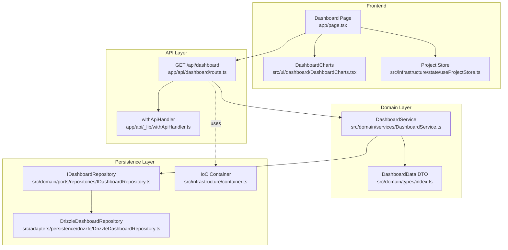
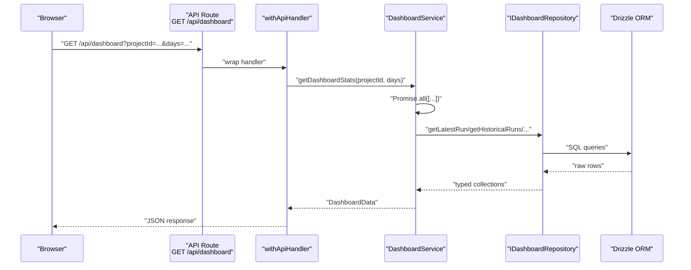
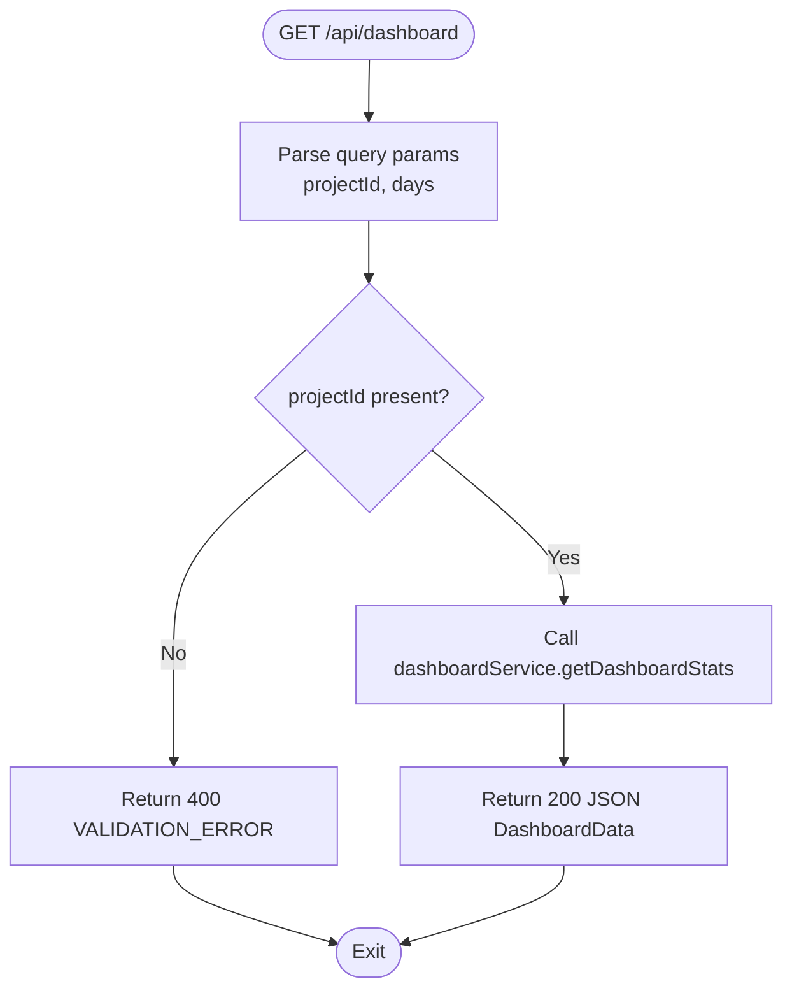
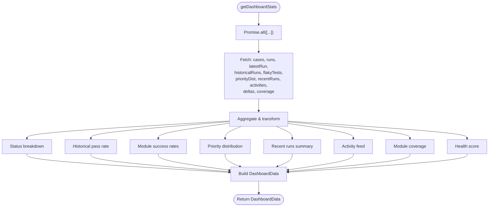
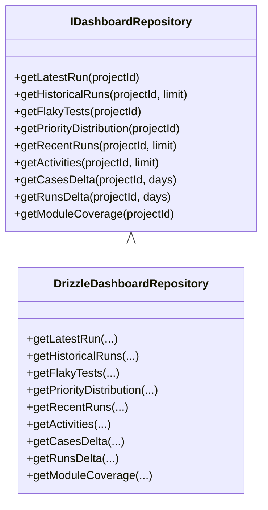
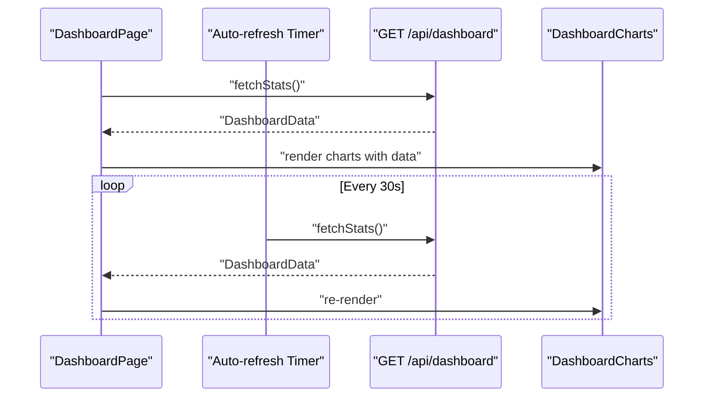
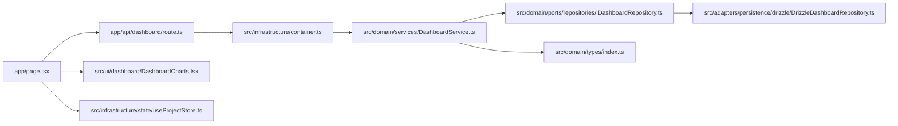

# Data Aggregation and Real-time Updates

<cite>
**Referenced Files in This Document**
- [route.ts](file://app/api/dashboard/route.ts)
- [withApiHandler.ts](file://app/api/_lib/withApiHandler.ts)
- [DashboardService.ts](file://src/domain/services/DashboardService.ts)
- [DrizzleDashboardRepository.ts](file://src/adapters/persistence/drizzle/DrizzleDashboardRepository.ts)
- [IDashboardRepository.ts](file://src/domain/ports/repositories/IDashboardRepository.ts)
- [container.ts](file://src/infrastructure/container.ts)
- [types/index.ts](file://src/domain/types/index.ts)
- [page.tsx](file://app/page.tsx)
- [DashboardCharts.tsx](file://src/ui/dashboard/DashboardCharts.tsx)
- [event-bus.ts](file://src/infrastructure/event-bus.ts)
- [useProjectStore.ts](file://src/infrastructure/state/useProjectStore.ts)
- [store.ts](file://src/infrastructure/state/store.ts)
- [TestRunService.ts](file://src/domain/services/TestRunService.ts)
</cite>

## Table of Contents
1. [Introduction](#introduction)
2. [Project Structure](#project-structure)
3. [Core Components](#core-components)
4. [Architecture Overview](#architecture-overview)
5. [Detailed Component Analysis](#detailed-component-analysis)
6. [Dependency Analysis](#dependency-analysis)
7. [Performance Considerations](#performance-considerations)
8. [Troubleshooting Guide](#troubleshooting-guide)
9. [Conclusion](#conclusion)

## Introduction
This document explains the data aggregation and real-time update mechanisms for the dashboard. It covers the parallel data fetching strategy using Promise.all, repository method implementations for historical data retrieval, and real-time update mechanisms. It also documents the API endpoint implementation for dashboard data, caching strategies, performance optimization techniques, and data aggregation patterns for status breakdowns, trend analysis, and activity feeds. Examples of efficient query patterns, data transformation workflows, and integration with the frontend state management are included, along with guidance on data consistency, update frequency, and handling concurrent data modifications.

## Project Structure
The dashboard feature spans API routes, domain services, repositories, frontend pages, and state management. The API route delegates to a service that orchestrates parallel repository calls, transforms the results into a unified dashboard DTO, and returns them to the client. The frontend page fetches data periodically and renders charts and metrics.

**Diagram sources**
- [route.ts:1-24](file://app/api/dashboard/route.ts#L1-L24)
- [withApiHandler.ts:1-65](file://app/api/_lib/withApiHandler.ts#L1-L65)
- [DashboardService.ts:1-182](file://src/domain/services/DashboardService.ts#L1-L182)
- [DrizzleDashboardRepository.ts:1-313](file://src/adapters/persistence/drizzle/DrizzleDashboardRepository.ts#L1-L313)
- [IDashboardRepository.ts:1-15](file://src/domain/ports/repositories/IDashboardRepository.ts#L1-L15)
- [container.ts:1-126](file://src/infrastructure/container.ts#L1-L126)
- [types/index.ts:150-175](file://src/domain/types/index.ts#L150-L175)
- [page.tsx:227-426](file://app/page.tsx#L227-L426)
- [DashboardCharts.tsx:1-178](file://src/ui/dashboard/DashboardCharts.tsx#L1-L178)
- [useProjectStore.ts:1-19](file://src/infrastructure/state/useProjectStore.ts#L1-L19)

**Section sources**
- [route.ts:1-24](file://app/api/dashboard/route.ts#L1-L24)
- [DashboardService.ts:1-182](file://src/domain/services/DashboardService.ts#L1-L182)
- [DrizzleDashboardRepository.ts:1-313](file://src/adapters/persistence/drizzle/DrizzleDashboardRepository.ts#L1-L313)
- [page.tsx:227-426](file://app/page.tsx#L227-L426)

## Core Components
- API Route: Validates query parameters, delegates to the service, and returns structured JSON responses with centralized error handling.
- DashboardService: Orchestrates parallel repository calls, aggregates results, computes derived metrics, and produces a normalized DashboardData DTO.
- DrizzleDashboardRepository: Implements repository methods for latest run, historical runs, flaky tests, priority distribution, recent runs, activities, deltas, and module coverage.
- Frontend Dashboard Page: Fetches dashboard data, manages auto-refresh intervals, and renders charts and metrics.
- DTOs: Define the shape of aggregated data returned to the client.

Key responsibilities:
- Parallel fetching: Promise.all in the service ensures minimal latency by overlapping independent queries.
- Aggregation patterns: Status breakdowns, historical pass rates, module success rates, priority distributions, recent runs, activity feed, coverage, and health scores.
- Real-time updates: Periodic polling via frontend effects with manual refresh support.

**Section sources**
- [route.ts:7-22](file://app/api/dashboard/route.ts#L7-L22)
- [withApiHandler.ts:22-64](file://app/api/_lib/withApiHandler.ts#L22-L64)
- [DashboardService.ts:17-147](file://src/domain/services/DashboardService.ts#L17-L147)
- [DrizzleDashboardRepository.ts:18-311](file://src/adapters/persistence/drizzle/DrizzleDashboardRepository.ts#L18-L311)
- [types/index.ts:150-175](file://src/domain/types/index.ts#L150-L175)
- [page.tsx:227-269](file://app/page.tsx#L227-L269)

## Architecture Overview
The system follows a layered architecture:
- Presentation: Next.js App Router API route and React page.
- Application: DashboardService coordinates data retrieval and transformation.
- Persistence: Drizzle ORM-backed repository with typed interfaces.
- Frontend state: Zustand stores for project selection and test-run filters.

**Diagram sources**
- [route.ts:7-22](file://app/api/dashboard/route.ts#L7-L22)
- [withApiHandler.ts:22-64](file://app/api/_lib/withApiHandler.ts#L22-L64)
- [DashboardService.ts:17-43](file://src/domain/services/DashboardService.ts#L17-L43)
- [DrizzleDashboardRepository.ts:18-311](file://src/adapters/persistence/drizzle/DrizzleDashboardRepository.ts#L18-L311)

## Detailed Component Analysis

### API Endpoint Implementation
- Validates projectId presence and parses days parameter.
- Uses withApiHandler for centralized error handling and structured responses.
- Delegates to dashboardService.getDashboardStats and returns JSON.

**Diagram sources**
- [route.ts:7-22](file://app/api/dashboard/route.ts#L7-L22)
- [withApiHandler.ts:22-64](file://app/api/_lib/withApiHandler.ts#L22-L64)

**Section sources**
- [route.ts:7-22](file://app/api/dashboard/route.ts#L7-L22)
- [withApiHandler.ts:22-64](file://app/api/_lib/withApiHandler.ts#L22-L64)

### DashboardService Parallel Aggregation
- Uses Promise.all to fetch independent datasets concurrently:
  - Total cases, total runs, latest run, historical runs, flaky tests, priority distribution, recent runs, activities, deltas, module coverage.
- Transforms raw data into:
  - Status breakdown from latest run.
  - Historical pass rate series.
  - Module success rates.
  - Priority distribution bars.
  - Recent runs summary.
  - Activity feed entries.
  - Module coverage metrics.
  - Health score computed from pass rate, flaky count, case/run counts, recency, and coverage.

**Diagram sources**
- [DashboardService.ts:17-147](file://src/domain/services/DashboardService.ts#L17-L147)

**Section sources**
- [DashboardService.ts:17-147](file://src/domain/services/DashboardService.ts#L17-L147)

### Repository Methods for Historical Data Retrieval
- Latest run with nested results and attachments.
- Historical runs with aggregated statuses.
- Flaky tests computed from recent runs.
- Priority distribution by P1–P4.
- Recent runs with pass rates.
- Activities feed for run creation/completion.
- Deltas for cases and runs over a window.
- Module coverage based on latest run results.

**Diagram sources**
- [IDashboardRepository.ts:3-12](file://src/domain/ports/repositories/IDashboardRepository.ts#L3-L12)
- [DrizzleDashboardRepository.ts:14-311](file://src/adapters/persistence/drizzle/DrizzleDashboardRepository.ts#L14-L311)

**Section sources**
- [DrizzleDashboardRepository.ts:18-311](file://src/adapters/persistence/drizzle/DrizzleDashboardRepository.ts#L18-L311)
- [IDashboardRepository.ts:3-12](file://src/domain/ports/repositories/IDashboardRepository.ts#L3-L12)

### Frontend Integration and Real-time Updates
- Dashboard page fetches data on mount and when the date range changes.
- Auto-refresh interval is configured and cleared on unmount.
- Manual refresh triggers while disabling the button to prevent concurrent requests.
- Charts render status distribution, historical pass rate, module success rates, and priority distribution.

**Diagram sources**
- [page.tsx:227-269](file://app/page.tsx#L227-L269)
- [DashboardCharts.tsx:25-177](file://src/ui/dashboard/DashboardCharts.tsx#L25-L177)

**Section sources**
- [page.tsx:227-269](file://app/page.tsx#L227-L269)
- [DashboardCharts.tsx:25-177](file://src/ui/dashboard/DashboardCharts.tsx#L25-L177)

### Data Aggregation Patterns
- Status breakdown: Counts per status from latest run results; derived pass rate and module-wise pass rates.
- Trend analysis: Historical pass rate series built from recent runs.
- Activity feed: Run-created and run-completed events with pass rates.
- Priority distribution: Counts per priority level with color mapping.
- Module coverage: Tested vs total cases in the latest run.
- Health score: Weighted combination of pass rate, flaky penalty, recency, and coverage.

**Section sources**
- [DashboardService.ts:45-147](file://src/domain/services/DashboardService.ts#L45-L147)
- [DrizzleDashboardRepository.ts:127-311](file://src/adapters/persistence/drizzle/DrizzleDashboardRepository.ts#L127-L311)
- [types/index.ts:150-175](file://src/domain/types/index.ts#L150-L175)

### Efficient Query Patterns and Data Transformation
- Latest run with joined results and attachments; de-duplicated and enriched in memory.
- Historical runs with pre-aggregated statuses per run.
- Flaky tests computed by scanning recent runs and calculating failure rates per case.
- Priority distribution via grouped counts with ordering.
- Recent runs with pass rate calculation per run.
- Activities constructed from run events and result counts.
- Module coverage with single-query counts and optional latest-run results aggregation.

**Section sources**
- [DrizzleDashboardRepository.ts:18-311](file://src/adapters/persistence/drizzle/DrizzleDashboardRepository.ts#L18-L311)

### Integration with Frontend State Management
- Active project selection via useProjectStore.
- Test-run filtering via a dedicated zustand store for UI state.
- Dashboard page composes data and renders charts; no direct subscription to events.

**Section sources**
- [useProjectStore.ts:15-18](file://src/infrastructure/state/useProjectStore.ts#L15-L18)
- [store.ts:22-45](file://src/infrastructure/state/store.ts#L22-L45)
- [page.tsx:227-426](file://app/page.tsx#L227-L426)

## Dependency Analysis
The API route depends on the IoC container for dashboardService. The service depends on repository interfaces and concrete implementations. The frontend depends on the API and renders charts.

**Diagram sources**
- [route.ts:4-5](file://app/api/dashboard/route.ts#L4-L5)
- [container.ts:59-59](file://src/infrastructure/container.ts#L59-L59)
- [DashboardService.ts:11-15](file://src/domain/services/DashboardService.ts#L11-L15)
- [DrizzleDashboardRepository.ts:14-14](file://src/adapters/persistence/drizzle/DrizzleDashboardRepository.ts#L14-L14)
- [types/index.ts:150-175](file://src/domain/types/index.ts#L150-L175)
- [page.tsx:227-426](file://app/page.tsx#L227-L426)
- [DashboardCharts.tsx:1-178](file://src/ui/dashboard/DashboardCharts.tsx#L1-L178)
- [useProjectStore.ts:15-18](file://src/infrastructure/state/useProjectStore.ts#L15-L18)

**Section sources**
- [container.ts:59-59](file://src/infrastructure/container.ts#L59-L59)
- [DashboardService.ts:11-15](file://src/domain/services/DashboardService.ts#L11-L15)
- [DrizzleDashboardRepository.ts:14-14](file://src/adapters/persistence/drizzle/DrizzleDashboardRepository.ts#L14-L14)

## Performance Considerations
- Parallel fetching: Promise.all reduces total latency by overlapping independent queries.
- Minimal transformations: Aggregation occurs in memory after fetching denormalized rows; consider adding indexes on frequently filtered columns (e.g., testRuns.projectId, testResults.testRunId).
- Pagination and limits: Repository methods accept limits to bound result sizes (e.g., recent runs, activities).
- Delta computations: Cases delta is currently zero due to missing timestamps; adding createdAt to test cases would enable accurate deltas.
- Rendering: Recharts components are efficient; avoid unnecessary re-renders by passing stable references where possible.

[No sources needed since this section provides general guidance]

## Troubleshooting Guide
Common issues and resolutions:
- Validation errors: Missing projectId returns 400 with VALIDATION_ERROR; ensure the query parameter is present.
- Centralized error handling: withApiHandler maps domain errors to appropriate HTTP status codes and logs unexpected errors.
- Frontend loading states: Loading spinner and empty states improve UX during fetch cycles.
- Concurrency: Manual refresh disables the button to prevent overlapping requests; auto-refresh uses a fixed interval.

**Section sources**
- [route.ts:12-17](file://app/api/dashboard/route.ts#L12-L17)
- [withApiHandler.ts:28-62](file://app/api/_lib/withApiHandler.ts#L28-L62)
- [page.tsx:236-251](file://app/page.tsx#L236-L251)

## Conclusion
The dashboard feature implements robust data aggregation and near real-time updates through:
- A centralized API endpoint with validated inputs and structured error handling.
- A service that performs parallel data retrieval and comprehensive transformations.
- A repository layer that encapsulates efficient SQL queries and aggregations.
- A frontend that polls data at a fixed interval, supports manual refresh, and renders rich visualizations.
- Clear DTOs enabling consistent data contracts between backend and frontend.

Future enhancements could include:
- Adding createdAt to test cases to enable meaningful cases delta.
- Introducing SSE or WebSocket subscriptions for true real-time updates.
- Implementing caching layers (e.g., Redis) for hot-path metrics.
- Adding database indexes for improved query performance on large datasets.

[No sources needed since this section summarizes without analyzing specific files]