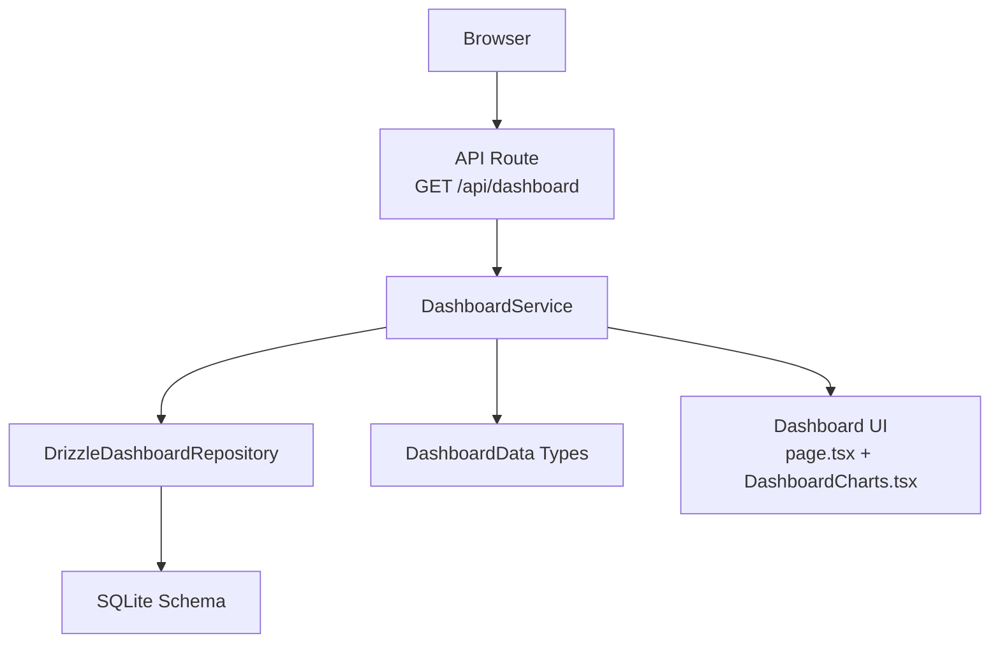
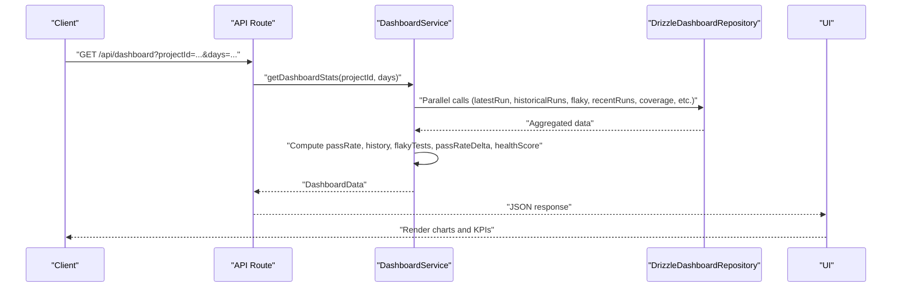
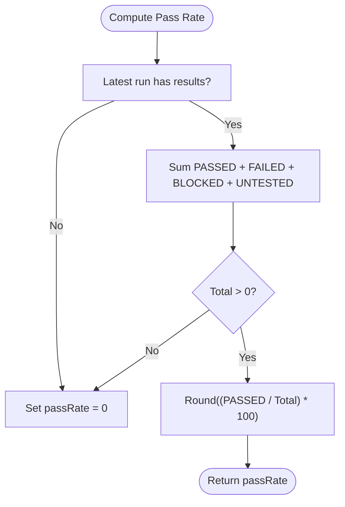
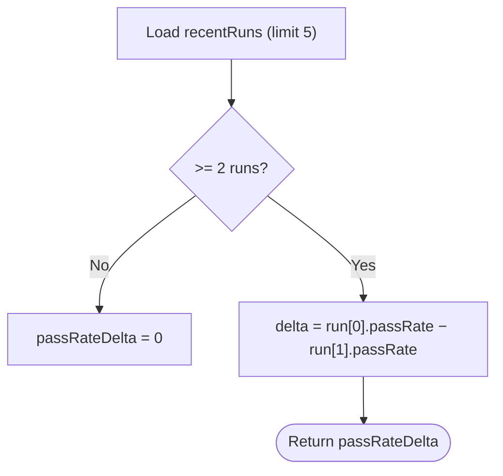
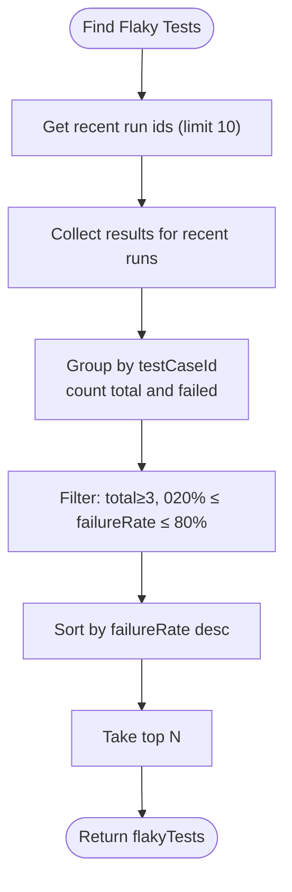
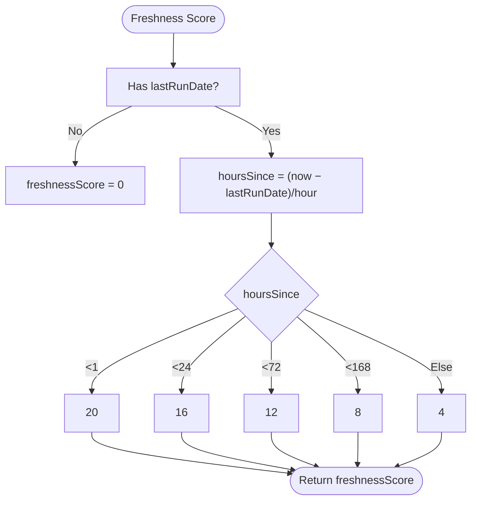
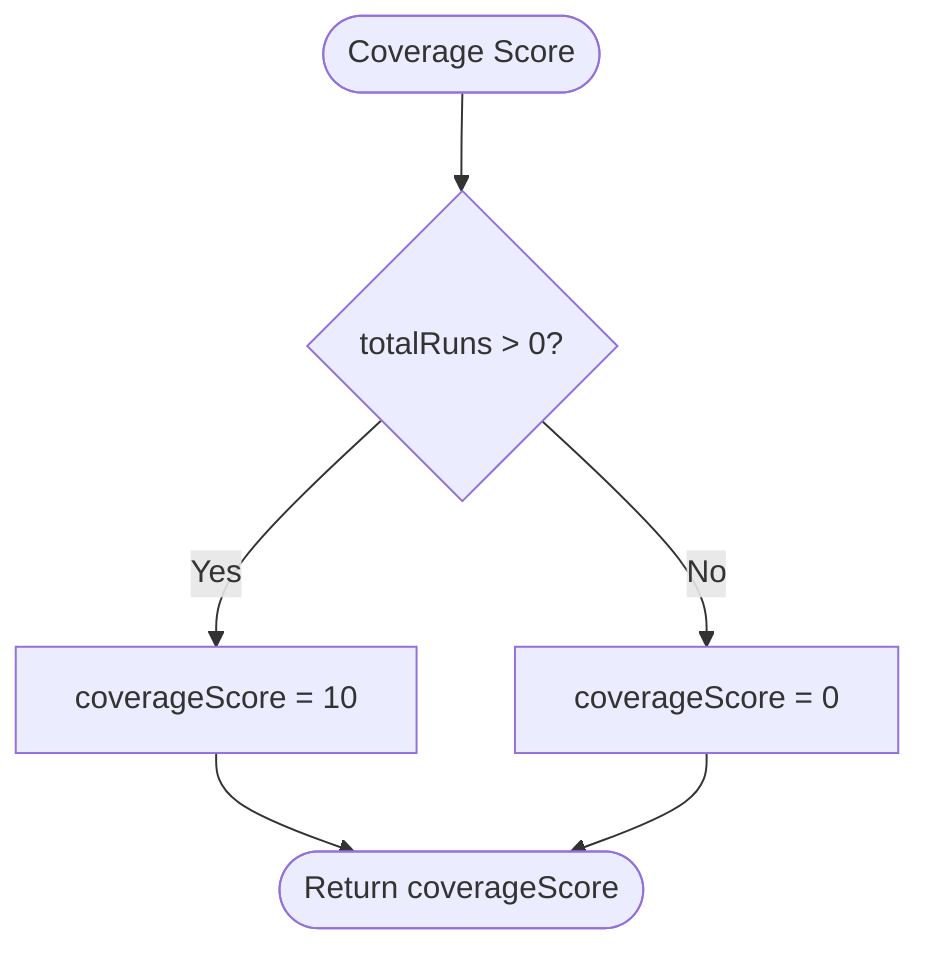
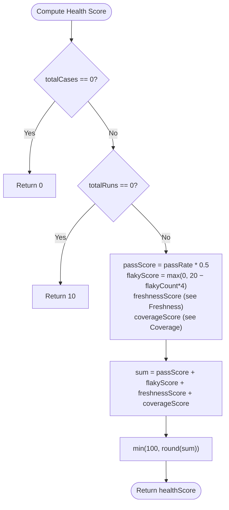
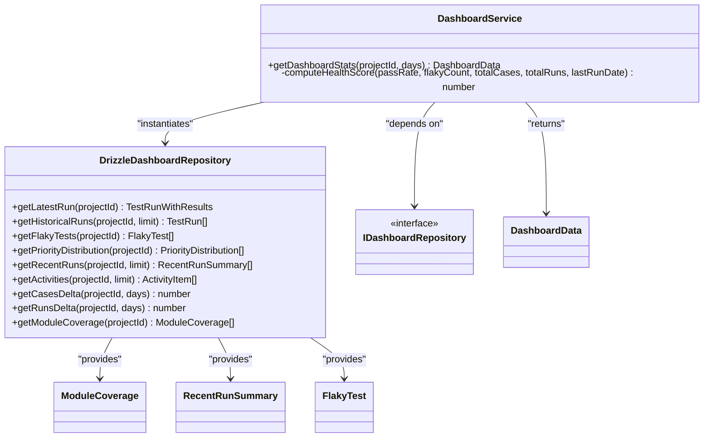

# Performance Metrics and Calculations

<cite>
**Referenced Files in This Document**
- [DashboardService.ts](file://src/domain/services/DashboardService.ts)
- [DrizzleDashboardRepository.ts](file://src/adapters/persistence/drizzle/DrizzleDashboardRepository.ts)
- [IDashboardRepository.ts](file://src/domain/ports/repositories/IDashboardRepository.ts)
- [index.ts](file://src/domain/types/index.ts)
- [route.ts](file://app/api/dashboard/route.ts)
- [page.tsx](file://app/page.tsx)
- [DashboardCharts.tsx](file://src/ui/dashboard/DashboardCharts.tsx)
- [schema.ts](file://src/infrastructure/db/schema.ts)
- [TestRunService.ts](file://src/domain/services/TestRunService.ts)
</cite>

## Table of Contents
1. [Introduction](#introduction)
2. [Project Structure](#project-structure)
3. [Core Components](#core-components)
4. [Architecture Overview](#architecture-overview)
5. [Detailed Component Analysis](#detailed-component-analysis)
6. [Dependency Analysis](#dependency-analysis)
7. [Performance Considerations](#performance-considerations)
8. [Troubleshooting Guide](#troubleshooting-guide)
9. [Conclusion](#conclusion)
10. [Appendices](#appendices)

## Introduction
This document explains the performance metrics and calculations powering the dashboard. It covers how pass rate is computed, how historical trends are derived, how deltas compare time periods, and how the health score aggregates multiple KPIs. It also documents the mathematical models, thresholds, anomaly detection hints, and optimization recommendations based on dashboard insights.

## Project Structure
The metrics pipeline spans the API layer, service layer, repository layer, and UI:
- API endpoint receives requests and delegates to the service.
- Service orchestrates parallel data retrieval and computes KPIs.
- Repository queries the database for runs, results, and derived metrics.
- UI renders charts and cards using the computed metrics.

**Diagram sources**
- [route.ts:1-24](file://app/api/dashboard/route.ts#L1-L24)
- [DashboardService.ts:17-43](file://src/domain/services/DashboardService.ts#L17-L43)
- [DrizzleDashboardRepository.ts:14-313](file://src/adapters/persistence/drizzle/DrizzleDashboardRepository.ts#L14-L313)
- [index.ts:150-175](file://src/domain/types/index.ts#L150-L175)
- [page.tsx:353-549](file://app/page.tsx#L353-L549)
- [DashboardCharts.tsx:25-177](file://src/ui/dashboard/DashboardCharts.tsx#L25-L177)
- [schema.ts:10-60](file://src/infrastructure/db/schema.ts#L10-L60)

**Section sources**
- [route.ts:1-24](file://app/api/dashboard/route.ts#L1-L24)
- [DashboardService.ts:17-43](file://src/domain/services/DashboardService.ts#L17-L43)
- [DrizzleDashboardRepository.ts:14-313](file://src/adapters/persistence/drizzle/DrizzleDashboardRepository.ts#L14-L313)
- [index.ts:150-175](file://src/domain/types/index.ts#L150-L175)
- [page.tsx:353-549](file://app/page.tsx#L353-L549)
- [DashboardCharts.tsx:25-177](file://src/ui/dashboard/DashboardCharts.tsx#L25-L177)
- [schema.ts:10-60](file://src/infrastructure/db/schema.ts#L10-L60)

## Core Components
- Pass Rate: Percentage of PASSED results among all executed results in the latest run.
- Historical Pass Rate: Daily pass rates over the selected window (computed from historical runs).
- Pass Rate Delta: Difference between current and previous recent run pass rates.
- Flaky Tests: Cases with failure rates between 20% and 80% observed in recent runs.
- Freshness: Derived from the last run’s age (hours).
- Coverage: Presence of runs relative to total cases.
- Health Score: Weighted aggregation of pass rate, flaky penalty, freshness, and coverage.

**Section sources**
- [DashboardService.ts:56-146](file://src/domain/services/DashboardService.ts#L56-L146)
- [DrizzleDashboardRepository.ts:83-123](file://src/adapters/persistence/drizzle/DrizzleDashboardRepository.ts#L83-L123)
- [DrizzleDashboardRepository.ts:151-187](file://src/adapters/persistence/drizzle/DrizzleDashboardRepository.ts#L151-L187)
- [DrizzleDashboardRepository.ts:249-311](file://src/adapters/persistence/drizzle/DrizzleDashboardRepository.ts#L249-L311)
- [index.ts:150-175](file://src/domain/types/index.ts#L150-L175)

## Architecture Overview
The system computes metrics in a layered fashion:
- API validates inputs and forwards to the service.
- Service performs parallel repository calls, then computes KPIs and health score.
- UI renders charts and KPI cards using the returned data.

**Diagram sources**
- [route.ts:7-22](file://app/api/dashboard/route.ts#L7-L22)
- [DashboardService.ts:17-43](file://src/domain/services/DashboardService.ts#L17-L43)
- [DrizzleDashboardRepository.ts:18-311](file://src/adapters/persistence/drizzle/DrizzleDashboardRepository.ts#L18-L311)
- [page.tsx:353-549](file://app/page.tsx#L353-L549)

## Detailed Component Analysis

### Pass Rate Calculation
- Latest run pass rate:
  - Count PASSED results.
  - Divide by total executed results (PASSED + FAILED + BLOCKED + UNTESTED).
  - Round to nearest percent.
- Historical pass rate:
  - For each historical run, compute pass rate over its results.
  - Aggregate into daily series with date and pass rate.

**Diagram sources**
- [DashboardService.ts:56-90](file://src/domain/services/DashboardService.ts#L56-L90)
- [DashboardService.ts:92-107](file://src/domain/services/DashboardService.ts#L92-L107)

**Section sources**
- [DashboardService.ts:56-90](file://src/domain/services/DashboardService.ts#L56-L90)
- [DashboardService.ts:92-107](file://src/domain/services/DashboardService.ts#L92-L107)

### Trend Analysis and Delta Comparisons
- Historical pass rate:
  - Uses recent historical runs to build a daily series of pass rates.
- Pass rate delta:
  - Compares the most recent two runs’ pass rates from recentRuns summary.
  - Positive delta indicates improvement; negative indicates regression.

**Diagram sources**
- [DrizzleDashboardRepository.ts:151-187](file://src/adapters/persistence/drizzle/DrizzleDashboardRepository.ts#L151-L187)
- [DashboardService.ts:116-120](file://src/domain/services/DashboardService.ts#L116-L120)

**Section sources**
- [DrizzleDashboardRepository.ts:151-187](file://src/adapters/persistence/drizzle/DrizzleDashboardRepository.ts#L151-L187)
- [DashboardService.ts:116-120](file://src/domain/services/DashboardService.ts#L116-L120)

### Flaky Tests Detection
- Definition: Cases with recent failure rates in [20%, 80%], observed across at least a small number of executions.
- Computation:
  - Select recent runs (limit 10).
  - Aggregate per-case totals and failures across those runs.
  - Filter cases with total ≥ 3, partial failures, and failure rate within bounds.
  - Sort by failure rate descending and cap at top N.

**Diagram sources**
- [DrizzleDashboardRepository.ts:83-123](file://src/adapters/persistence/drizzle/DrizzleDashboardRepository.ts#L83-L123)

**Section sources**
- [DrizzleDashboardRepository.ts:83-123](file://src/adapters/persistence/drizzle/DrizzleDashboardRepository.ts#L83-L123)

### Freshness Metric
- Freshness score depends on hours elapsed since the last run:
  - < 1 hour → 20
  - < 24 hours → 16
  - < 72 hours → 12
  - < 168 hours → 8
  - ≥ 168 hours → 4

**Diagram sources**
- [DashboardService.ts:165-174](file://src/domain/services/DashboardService.ts#L165-L174)

**Section sources**
- [DashboardService.ts:165-174](file://src/domain/services/DashboardService.ts#L165-L174)

### Coverage Metric
- Coverage is represented as a presence indicator:
  - If there are runs for the project, coverageScore = 10.
  - Otherwise, 0.
- Module coverage details are also provided as pass rates per module.

**Diagram sources**
- [DashboardService.ts:176-178](file://src/domain/services/DashboardService.ts#L176-L178)
- [DrizzleDashboardRepository.ts:249-311](file://src/adapters/persistence/drizzle/DrizzleDashboardRepository.ts#L249-L311)

**Section sources**
- [DashboardService.ts:176-178](file://src/domain/services/DashboardService.ts#L176-L178)
- [DrizzleDashboardRepository.ts:249-311](file://src/adapters/persistence/drizzle/DrizzleDashboardRepository.ts#L249-L311)

### Health Score Computation
Weighted aggregation:
- passScore = passRate × 0.5
- flakyPenalty = clamp(0, 20 − flakyCount × 4)
- freshnessScore (see Freshness section)
- coverageScore (see Coverage section)
- healthScore = min(100, round(passScore + flakyPenalty + freshnessScore + coverageScore))

**Diagram sources**
- [DashboardService.ts:149-180](file://src/domain/services/DashboardService.ts#L149-L180)

**Section sources**
- [DashboardService.ts:149-180](file://src/domain/services/DashboardService.ts#L149-L180)

### Statistical Model and Interpretation Guidelines
- Pass Rate:
  - Baseline: 100% ideal; decline below 80% signals concern; below 50% signals significant risk.
- Flaky Tests:
  - Each flaky test reduces flakyScore by 4 points (up to 20 for zero flaky).
  - Investigate frequently failing steps and environmental instability.
- Freshness:
  - Prefer runs within 1 hour; beyond 24 hours, consider delayed feedback loops.
- Coverage:
  - CoverageScore contributes 10 when runs exist; prioritize running more cases.
- Health Score:
  - 80–100: Healthy
  - 60–79: Caution
  - Below 60: Unhealthy

Thresholds and interpretation are derived from the scoring logic and UI color coding.

**Section sources**
- [DashboardService.ts:149-180](file://src/domain/services/DashboardService.ts#L149-L180)
- [page.tsx:470-512](file://app/page.tsx#L470-L512)

### Real-Time Calculation Examples
- Example A: Latest run with 120 executed results, 100 PASSED.
  - passRate = round((100 / 120) × 100) = 83.
- Example B: Historical series over 7 days yields [75, 80, 83, 82, 81, 83, 83].
  - Use these points to render the area chart.
- Example C: RecentRuns[0].passRate = 83, RecentRuns[1].passRate = 80.
  - passRateDelta = 83 − 80 = 3.
- Example D: 5 flaky tests, last run 12 hours ago, 15 runs exist.
  - flakyScore = max(0, 20 − 5×4) = 0
  - freshnessScore = 16
  - coverageScore = 10
  - healthScore = min(100, round(83×0.5 + 0 + 16 + 10)) = min(100, round(41.5 + 26)) = 67

These examples illustrate how metrics are computed in real time from repository data.

**Section sources**
- [DashboardService.ts:56-146](file://src/domain/services/DashboardService.ts#L56-L146)
- [DrizzleDashboardRepository.ts:83-123](file://src/adapters/persistence/drizzle/DrizzleDashboardRepository.ts#L83-L123)
- [DrizzleDashboardRepository.ts:151-187](file://src/adapters/persistence/drizzle/DrizzleDashboardRepository.ts#L151-L187)
- [DrizzleDashboardRepository.ts:249-311](file://src/adapters/persistence/drizzle/DrizzleDashboardRepository.ts#L249-L311)

### Anomaly Detection Hints
- Sudden drop in pass rate delta or flattish historical trend.
- Spike in flaky tests count.
- Extended freshness windows (e.g., multiple days without runs).
- Low coverageScore persisting despite runs.
- Use UI dashboards to visually inspect area charts and module heatmaps for outliers.

[No sources needed since this section provides general guidance]

## Dependency Analysis
The service coordinates multiple repository calls and composes a single response for the UI.

**Diagram sources**
- [DashboardService.ts:10-15](file://src/domain/services/DashboardService.ts#L10-L15)
- [DrizzleDashboardRepository.ts:14-313](file://src/adapters/persistence/drizzle/DrizzleDashboardRepository.ts#L14-L313)
- [IDashboardRepository.ts:3-13](file://src/domain/ports/repositories/IDashboardRepository.ts#L3-L13)
- [index.ts:150-175](file://src/domain/types/index.ts#L150-L175)

**Section sources**
- [DashboardService.ts:10-15](file://src/domain/services/DashboardService.ts#L10-L15)
- [DrizzleDashboardRepository.ts:14-313](file://src/adapters/persistence/drizzle/DrizzleDashboardRepository.ts#L14-L313)
- [IDashboardRepository.ts:3-13](file://src/domain/ports/repositories/IDashboardRepository.ts#L3-L13)
- [index.ts:150-175](file://src/domain/types/index.ts#L150-L175)

## Performance Considerations
- Parallelization: The service fetches multiple datasets concurrently to minimize latency.
- Aggregation in SQL: Repositories compute counts and pass rates server-side to reduce payload sizes.
- UI rendering: Charts expect normalized arrays; keep data shapes minimal and avoid re-computation on the client.
- Freshness and coverage: These are derived from timestamps and counts, ensuring O(n) scans over recent runs.

[No sources needed since this section provides general guidance]

## Troubleshooting Guide
- Missing projectId or invalid days:
  - API returns a validation error; ensure the query string includes projectId and optional days.
- No runs yet:
  - passRate, recentRuns, and related metrics default sensibly; UI displays placeholders.
- Insufficient historical data:
  - Historical area chart may show “Not enough historical data”; increase days or run frequency.
- Flaky tests list empty:
  - Requires recent runs; ensure recent runs exist and include sufficient executions per case.

**Section sources**
- [route.ts:12-22](file://app/api/dashboard/route.ts#L12-L22)
- [DashboardService.ts:116-120](file://src/domain/services/DashboardService.ts#L116-L120)
- [DrizzleDashboardRepository.ts:83-123](file://src/adapters/persistence/drizzle/DrizzleDashboardRepository.ts#L83-L123)
- [page.tsx:434-440](file://app/page.tsx#L434-L440)

## Conclusion
The dashboard metrics combine straightforward, interpretable KPIs with a weighted health score to provide a holistic view of testing performance. By monitoring pass rate trends, flaky tests, freshness, and coverage, teams can detect regressions early and focus optimization efforts where they matter most.

[No sources needed since this section summarizes without analyzing specific files]

## Appendices

### Mathematical Definitions and Formulas
- Pass Rate (latest run):
  - PR = round((PASSED / TOTAL) × 100)
- Historical Pass Rate Series:
  - For each run i, PR_i = round((PASSED_i / TOTAL_i) × 100)
- Pass Rate Delta:
  - ΔPR = PR_current − PR_previous
- Flaky Penalty:
  - FP = clamp(0, 20 − F × 4), where F = number of flaky tests
- Freshness Score:
  - Based on hours since last run (see Freshness section)
- Coverage Score:
  - CS = 10 if runs > 0, else 0
- Health Score:
  - HS = min(100, round(PR×0.5 + FP + FS + CS))

**Section sources**
- [DashboardService.ts:56-180](file://src/domain/services/DashboardService.ts#L56-L180)
- [DrizzleDashboardRepository.ts:83-123](file://src/adapters/persistence/drizzle/DrizzleDashboardRepository.ts#L83-L123)
- [DrizzleDashboardRepository.ts:151-187](file://src/adapters/persistence/drizzle/DrizzleDashboardRepository.ts#L151-L187)
- [DrizzleDashboardRepository.ts:249-311](file://src/adapters/persistence/drizzle/DrizzleDashboardRepository.ts#L249-L311)

### Benchmark Establishment and Optimization Recommendations
- Establish baselines:
  - Track weekly average pass rate and module coverage.
  - Define acceptable ranges: e.g., ≥80% pass rate, ≤2 flaky tests, ≤24h freshness, ≥10 coverage.
- Optimization recommendations:
  - Reduce flaky tests by stabilizing environment and isolating intermittent failures.
  - Maintain frequent runs (<24h) to keep freshness high.
  - Increase coverage by running more cases per module.
  - Investigate modules with low pass rates and prioritize remediation.

[No sources needed since this section provides general guidance]