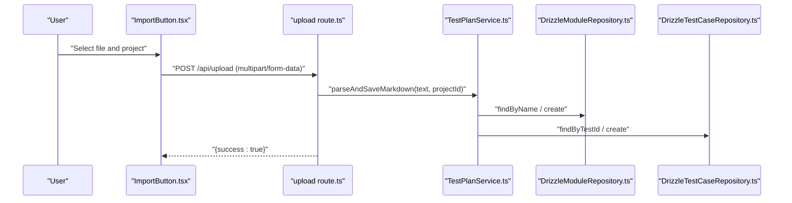
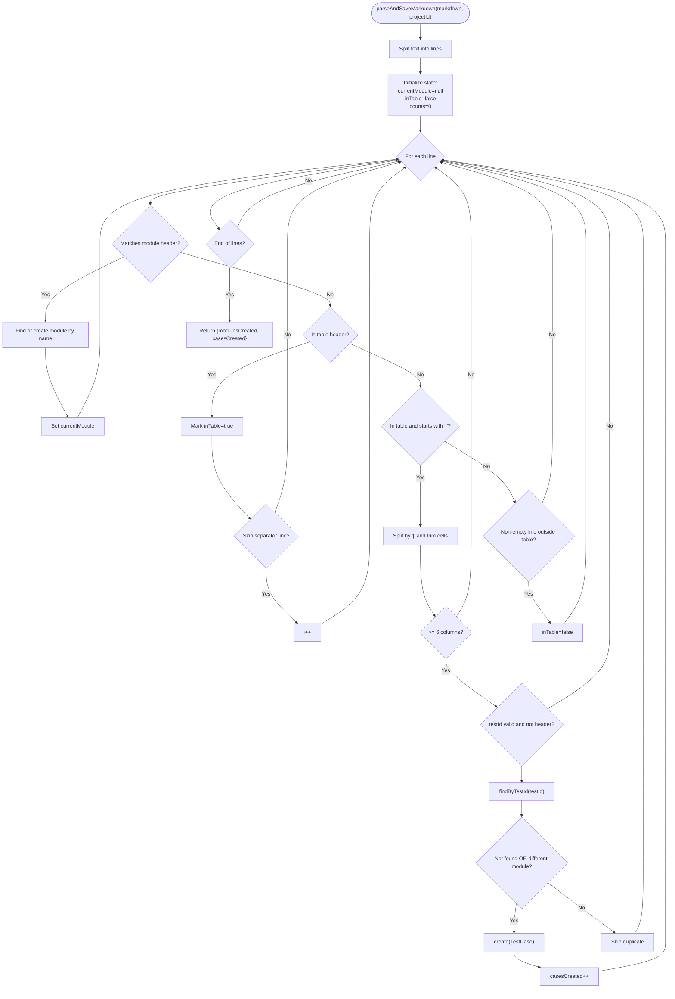
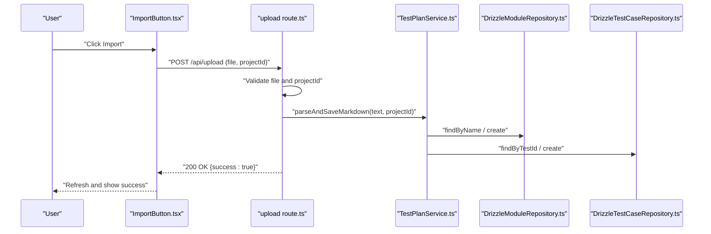
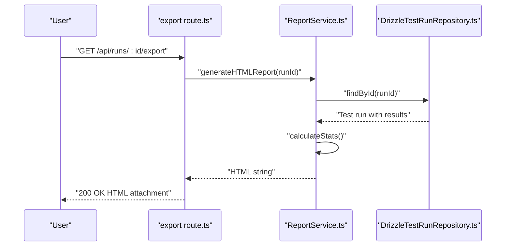
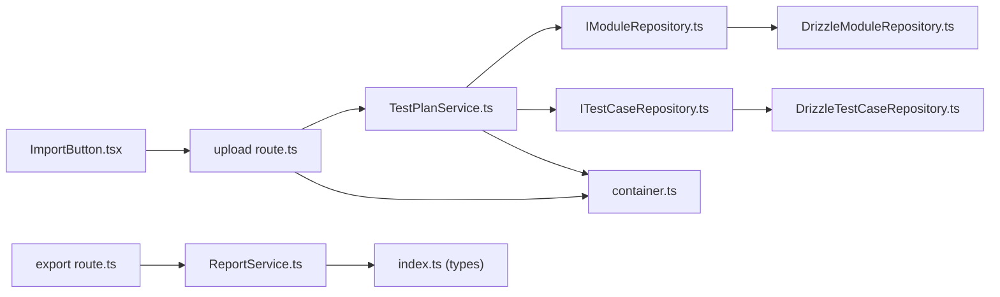

# Import/Export Functionality

<cite>
**Referenced Files in This Document**
- [TestPlanService.ts](file://src/domain/services/TestPlanService.ts)
- [ImportButton.tsx](file://src/ui/test-design/ImportButton.tsx)
- [upload route.ts](file://app/api/upload/route.ts)
- [ReportService.ts](file://src/domain/services/ReportService.ts)
- [export route.ts](file://app/api/runs/[id]/export/route.ts)
- [DrizzleModuleRepository.ts](file://src/adapters/persistence/drizzle/DrizzleModuleRepository.ts)
- [DrizzleTestCaseRepository.ts](file://src/adapters/persistence/drizzle/DrizzleTestCaseRepository.ts)
- [ITestCaseRepository.ts](file://src/domain/ports/repositories/ITestCaseRepository.ts)
- [IModuleRepository.ts](file://src/domain/ports/repositories/IModuleRepository.ts)
- [index.ts (types)](file://src/domain/types/index.ts)
- [container.ts](file://src/infrastructure/container.ts)
</cite>

## Table of Contents
1. [Introduction](#introduction)
2. [Project Structure](#project-structure)
3. [Core Components](#core-components)
4. [Architecture Overview](#architecture-overview)
5. [Detailed Component Analysis](#detailed-component-analysis)
6. [Dependency Analysis](#dependency-analysis)
7. [Performance Considerations](#performance-considerations)
8. [Troubleshooting Guide](#troubleshooting-guide)
9. [Conclusion](#conclusion)
10. [Appendices](#appendices)

## Introduction
This document explains the Import/Export functionality for test plans and test case data. It focuses on:
- How Markdown test plans are parsed and transformed into modules and test cases
- The import workflow from UI to backend and persistence
- Duplicate detection and handling during bulk imports
- Export capabilities for test run results
- Validation rules, data transformation, and best practices for data integrity

## Project Structure
The Import/Export feature spans UI, API routes, domain services, and persistence adapters:
- UI triggers import via a file input that posts to the upload endpoint
- API routes validate inputs and delegate parsing to the domain service
- Domain service parses Markdown and persists modules/test cases
- Persistence adapters write to the database
- Export generates HTML reports for test runs

```mermaid
graph TB
subgraph "UI"
IB["ImportButton.tsx"]
end
subgraph "API"
UR["upload route.ts"]
ER["export route.ts"]
end
subgraph "Domain"
TPS["TestPlanService.ts"]
RS["ReportService.ts"]
end
subgraph "Persistence"
MRepo["DrizzleModuleRepository.ts"]
CRepo["DrizzleTestCaseRepository.ts"]
end
subgraph "Types"
Types["index.ts (types)"]
end
subgraph "IoC"
Ctn["container.ts"]
end
IB --> UR
UR --> TPS
TPS --> MRepo
TPS --> CRepo
ER --> RS
RS --> Types
Ctn --> TPS
Ctn --> RS
```

**Diagram sources**
- [ImportButton.tsx:1-74](file://src/ui/test-design/ImportButton.tsx#L1-L74)
- [upload route.ts:1-24](file://app/api/upload/route.ts#L1-L24)
- [export route.ts:1-20](file://app/api/runs/[id]/export/route.ts#L1-L20)
- [TestPlanService.ts:1-110](file://src/domain/services/TestPlanService.ts#L1-L110)
- [ReportService.ts:1-110](file://src/domain/services/ReportService.ts#L1-L110)
- [DrizzleModuleRepository.ts:1-34](file://src/adapters/persistence/drizzle/DrizzleModuleRepository.ts#L1-L34)
- [DrizzleTestCaseRepository.ts:1-71](file://src/adapters/persistence/drizzle/DrizzleTestCaseRepository.ts#L1-L71)
- [index.ts (types):1-196](file://src/domain/types/index.ts#L1-L196)
- [container.ts:1-126](file://src/infrastructure/container.ts#L1-L126)

**Section sources**
- [ImportButton.tsx:1-74](file://src/ui/test-design/ImportButton.tsx#L1-L74)
- [upload route.ts:1-24](file://app/api/upload/route.ts#L1-L24)
- [export route.ts:1-20](file://app/api/runs/[id]/export/route.ts#L1-L20)
- [TestPlanService.ts:1-110](file://src/domain/services/TestPlanService.ts#L1-L110)
- [ReportService.ts:1-110](file://src/domain/services/ReportService.ts#L1-L110)
- [DrizzleModuleRepository.ts:1-34](file://src/adapters/persistence/drizzle/DrizzleModuleRepository.ts#L1-L34)
- [DrizzleTestCaseRepository.ts:1-71](file://src/adapters/persistence/drizzle/DrizzleTestCaseRepository.ts#L1-L71)
- [index.ts (types):1-196](file://src/domain/types/index.ts#L1-L196)
- [container.ts:1-126](file://src/infrastructure/container.ts#L1-L126)

## Core Components
- TestPlanService: Parses Markdown test plans and persists modules and test cases. Handles duplicate detection by testId and module association.
- ImportButton: Client-side UI element that validates project selection and uploads files.
- upload route: Validates multipart/form-data and delegates parsing to TestPlanService.
- ReportService: Generates HTML reports for test runs.
- export route: Returns downloadable HTML report for a given test run.
- DrizzleModuleRepository and DrizzleTestCaseRepository: Persist modules and test cases.
- Types: Define entity and DTO contracts for modules, test cases, and test runs.

Key responsibilities:
- Import: UI → API → Domain service → Repositories
- Export: Test run → Report service → HTML response

**Section sources**
- [TestPlanService.ts:1-110](file://src/domain/services/TestPlanService.ts#L1-L110)
- [ImportButton.tsx:1-74](file://src/ui/test-design/ImportButton.tsx#L1-L74)
- [upload route.ts:1-24](file://app/api/upload/route.ts#L1-L24)
- [ReportService.ts:1-110](file://src/domain/services/ReportService.ts#L1-L110)
- [export route.ts:1-20](file://app/api/runs/[id]/export/route.ts#L1-L20)
- [DrizzleModuleRepository.ts:1-34](file://src/adapters/persistence/drizzle/DrizzleModuleRepository.ts#L1-L34)
- [DrizzleTestCaseRepository.ts:1-71](file://src/adapters/persistence/drizzle/DrizzleTestCaseRepository.ts#L1-L71)
- [index.ts (types):1-196](file://src/domain/types/index.ts#L1-L196)

## Architecture Overview
The import pipeline is a layered flow:
- UI collects a file and projectId
- API validates presence of file and projectId
- Domain service parses Markdown and creates modules/test cases
- Repositories persist entities
- Export pipeline generates HTML reports for test runs



**Diagram sources**
- [ImportButton.tsx:14-51](file://src/ui/test-design/ImportButton.tsx#L14-L51)
- [upload route.ts:7-22](file://app/api/upload/route.ts#L7-L22)
- [TestPlanService.ts:35-108](file://src/domain/services/TestPlanService.ts#L35-L108)
- [DrizzleModuleRepository.ts:8-28](file://src/adapters/persistence/drizzle/DrizzleModuleRepository.ts#L8-L28)
- [DrizzleTestCaseRepository.ts:13-47](file://src/adapters/persistence/drizzle/DrizzleTestCaseRepository.ts#L13-L47)

## Detailed Component Analysis

### TestPlanService: Markdown Parsing and Bulk Import
Responsibilities:
- Create modules if they do not exist
- Parse Markdown to extract modules and test cases
- Detect duplicates by testId and module association
- Persist modules and test cases

Parsing algorithm highlights:
- Recognizes module headers with optional numeric prefixes and localized variants
- Detects table headers for English and localized column names
- Skips table separator rows
- Extracts columns: ID, Title, Steps, Expected Result, Priority
- Creates test cases only if testId is present and not a header/separator marker
- Duplicate handling: inserts when testId is not found or belongs to a different module



**Diagram sources**
- [TestPlanService.ts:35-108](file://src/domain/services/TestPlanService.ts#L35-L108)

Supported file formats:
- Markdown (.md) for importing test plans
- HTML for exporting test run reports

Table structure requirements:
- Columns: ID, Title, Steps, Expected Result, Priority
- Optional localized header variant for Title column
- Separator row is automatically skipped

Duplicate detection and handling:
- Duplicate is detected by testId
- If a test case with the same testId exists but belongs to a different module, a new test case is inserted
- If a test case with the same testId exists in the same module, insertion is skipped

Validation rules:
- Module header must match expected patterns (English and localized variants)
- Table header must include required columns (English or localized)
- Rows must contain at least five data columns after splitting
- testId must be present and not equal to header markers

Data transformation:
- Trims cell values
- Uses current module context for test case creation
- Converts priority values as stored (no normalization enforced)

Best practices:
- Ensure unique testId per module to avoid ambiguity
- Keep module names unique within a project to prevent collisions
- Use consistent column ordering and separators
- Prefer stable testId formats across imports

**Section sources**
- [TestPlanService.ts:27-108](file://src/domain/services/TestPlanService.ts#L27-L108)
- [DrizzleTestCaseRepository.ts:13-16](file://src/adapters/persistence/drizzle/DrizzleTestCaseRepository.ts#L13-L16)
- [DrizzleModuleRepository.ts:8-19](file://src/adapters/persistence/drizzle/DrizzleModuleRepository.ts#L8-L19)
- [index.ts (types):23-32](file://src/domain/types/index.ts#L23-L32)
- [index.ts (types):68-75](file://src/domain/types/index.ts#L68-L75)

### Import Workflow: UI to Backend
The import workflow is initiated from the UI and processed by the API and domain service.



**Diagram sources**
- [ImportButton.tsx:14-51](file://src/ui/test-design/ImportButton.tsx#L14-L51)
- [upload route.ts:7-22](file://app/api/upload/route.ts#L7-L22)
- [TestPlanService.ts:35-108](file://src/domain/services/TestPlanService.ts#L35-L108)
- [DrizzleModuleRepository.ts:8-28](file://src/adapters/persistence/drizzle/DrizzleModuleRepository.ts#L8-L28)
- [DrizzleTestCaseRepository.ts:13-47](file://src/adapters/persistence/drizzle/DrizzleTestCaseRepository.ts#L13-L47)

Practical examples:
- Import a Markdown test plan with multiple modules and tables
- Import a plan where some testIds already exist in other modules (should insert new records)
- Import a plan where testIds already exist in the same module (should skip duplicates)

**Section sources**
- [ImportButton.tsx:14-51](file://src/ui/test-design/ImportButton.tsx#L14-L51)
- [upload route.ts:7-22](file://app/api/upload/route.ts#L7-L22)
- [TestPlanService.ts:35-108](file://src/domain/services/TestPlanService.ts#L35-L108)

### Export Capability: Test Run Reports
The export feature generates an HTML report for a test run, including statistics and a results table.



**Diagram sources**
- [export route.ts:6-19](file://app/api/runs/[id]/export/route.ts#L6-L19)
- [ReportService.ts:14-83](file://src/domain/services/ReportService.ts#L14-L83)

Supported export format:
- HTML report for a specific test run

Validation rules:
- Test run must exist; otherwise an error is thrown
- Results are aggregated and rendered with sanitized HTML

**Section sources**
- [export route.ts:6-19](file://app/api/runs/[id]/export/route.ts#L6-L19)
- [ReportService.ts:14-98](file://src/domain/services/ReportService.ts#L14-L98)

### Integration with External Testing Tools
While the current implementation supports Markdown imports and HTML exports, integration with external tools can be extended:
- Issue trackers: Use adapters to synchronize test results with external systems
- Notifications: Slack notifications can be triggered after import or run completion
- Webhooks: Dispatch events to external systems upon successful operations

These integrations are facilitated by adapters registered in the IoC container.

**Section sources**
- [container.ts:10-126](file://src/infrastructure/container.ts#L10-L126)

## Dependency Analysis
The import/export feature relies on a clean separation of concerns:
- UI depends on Next.js routing and state
- API routes depend on the IoC container for services
- Domain services depend on repository interfaces
- Repositories depend on the database client and schema



**Diagram sources**
- [ImportButton.tsx:1-74](file://src/ui/test-design/ImportButton.tsx#L1-L74)
- [upload route.ts:1-24](file://app/api/upload/route.ts#L1-L24)
- [TestPlanService.ts:1-110](file://src/domain/services/TestPlanService.ts#L1-L110)
- [IModuleRepository.ts:1-9](file://src/domain/ports/repositories/IModuleRepository.ts#L1-L9)
- [ITestCaseRepository.ts:1-13](file://src/domain/ports/repositories/ITestCaseRepository.ts#L1-L13)
- [DrizzleModuleRepository.ts:1-34](file://src/adapters/persistence/drizzle/DrizzleModuleRepository.ts#L1-L34)
- [DrizzleTestCaseRepository.ts:1-71](file://src/adapters/persistence/drizzle/DrizzleTestCaseRepository.ts#L1-L71)
- [container.ts:1-126](file://src/infrastructure/container.ts#L1-L126)
- [export route.ts:1-20](file://app/api/runs/[id]/export/route.ts#L1-L20)
- [ReportService.ts:1-110](file://src/domain/services/ReportService.ts#L1-L110)
- [index.ts (types):1-196](file://src/domain/types/index.ts#L1-L196)

**Section sources**
- [container.ts:33-91](file://src/infrastructure/container.ts#L33-L91)
- [IModuleRepository.ts:1-9](file://src/domain/ports/repositories/IModuleRepository.ts#L1-L9)
- [ITestCaseRepository.ts:1-13](file://src/domain/ports/repositories/ITestCaseRepository.ts#L1-L13)

## Performance Considerations
- Parsing complexity: Linear in the number of lines; efficient for typical Markdown plans
- Database writes: Batched per record; consider transaction boundaries for very large imports
- Memory usage: Entire file is loaded into memory; for very large files, streaming parsers could reduce memory footprint
- Duplicate checks: findByTestId is executed per row; ensure database indexing on testId for scalability

## Troubleshooting Guide
Common issues and resolutions:
- Missing file or projectId: API returns a validation error; ensure both are provided
- No project selected: UI prevents import until a project is chosen
- Non-Markdown file: Only .md is accepted for import; ensure correct file type
- Malformed table: Ensure required columns and separator rows are present
- Duplicate testId in same module: Import skips duplicates; change testId or move to another module
- Test run not found: Export throws an error if the run does not exist

**Section sources**
- [upload route.ts:12-17](file://app/api/upload/route.ts#L12-L17)
- [ImportButton.tsx:19-23](file://src/ui/test-design/ImportButton.tsx#L19-L23)
- [TestPlanService.ts:86-100](file://src/domain/services/TestPlanService.ts#L86-L100)
- [export route.ts:16-18](file://app/api/runs/[id]/export/route.ts#L16-L18)

## Conclusion
The Import/Export functionality provides a robust pipeline for transforming Markdown test plans into structured modules and test cases, with careful duplicate detection and straightforward export of test run results. By adhering to the supported formats and validation rules, teams can maintain data integrity while integrating with external tools through adapters.

## Appendices

### Supported Formats and Column Specifications
- Import format: Markdown (.md)
  - Module headers: Support English and localized variants
  - Table headers: Support English and localized Title column
  - Required columns: ID, Title, Steps, Expected Result, Priority
- Export format: HTML
  - Includes run metadata, statistics, and results table

**Section sources**
- [TestPlanService.ts:27-74](file://src/domain/services/TestPlanService.ts#L27-L74)
- [export route.ts:13-18](file://app/api/runs/[id]/export/route.ts#L13-L18)