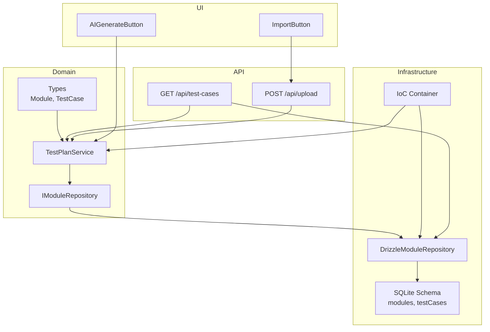
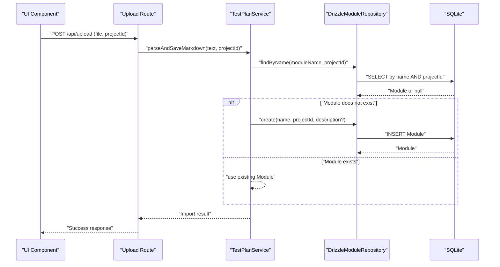
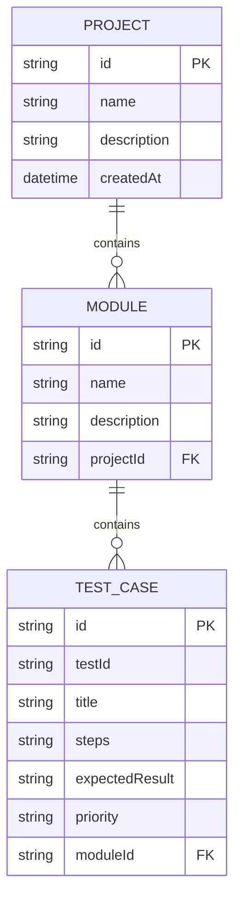
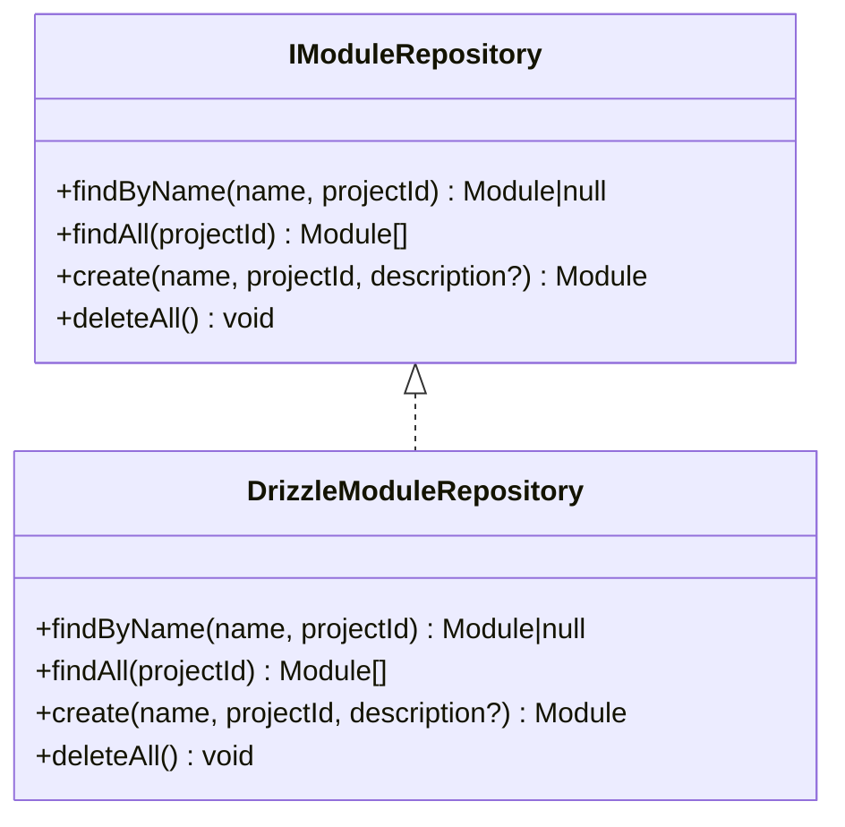
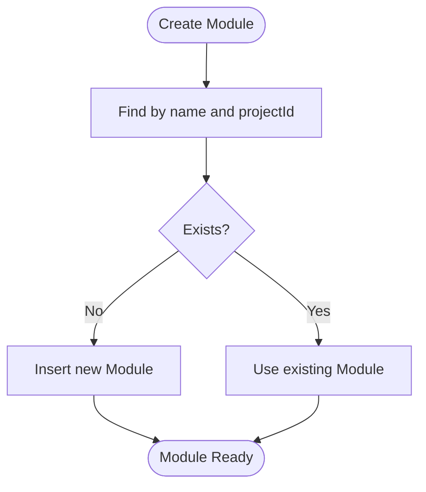
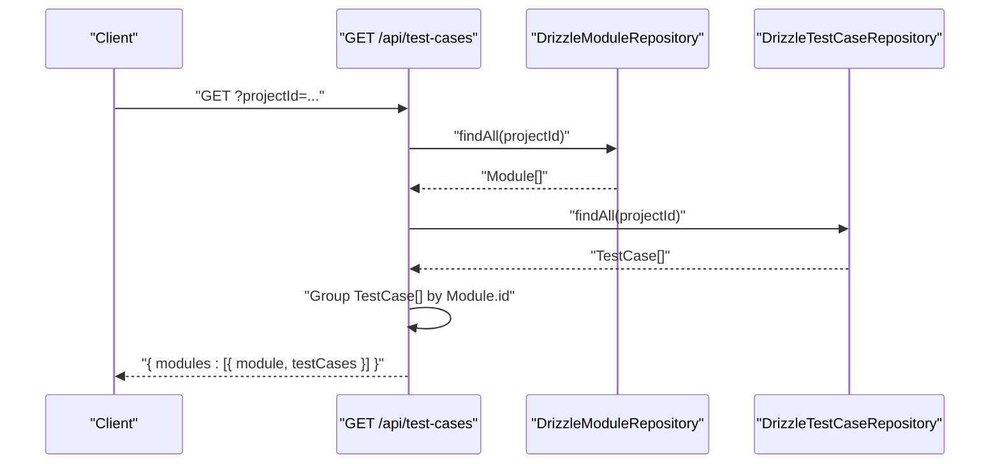
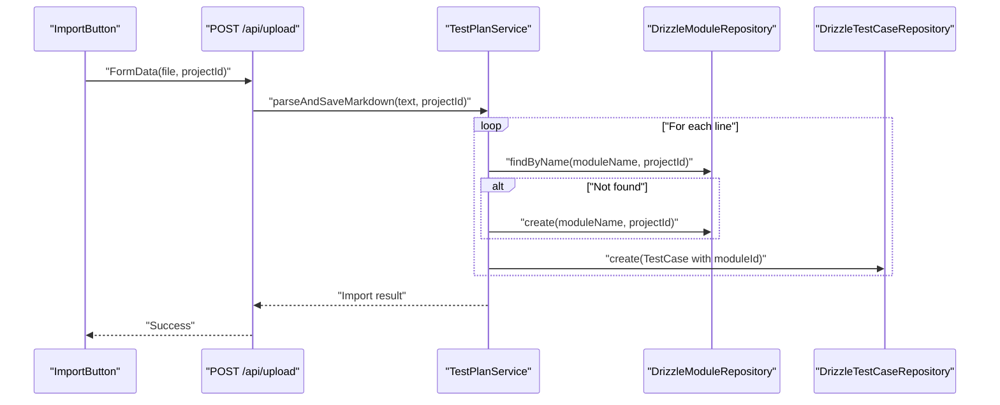
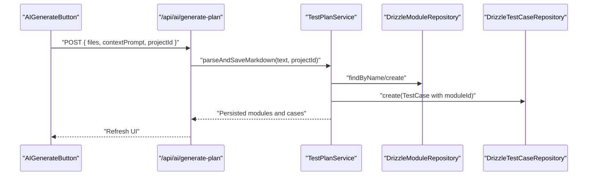
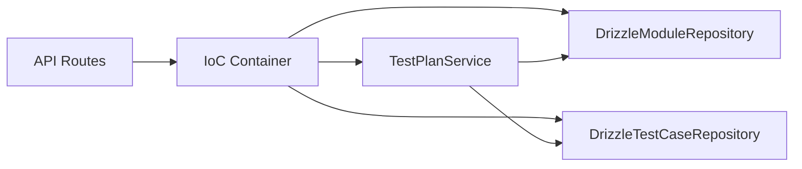

# Module Organization

<cite>
**Referenced Files in This Document**
- [IModuleRepository.ts](file://src/domain/ports/repositories/IModuleRepository.ts)
- [DrizzleModuleRepository.ts](file://src/adapters/persistence/drizzle/DrizzleModuleRepository.ts)
- [TestPlanService.ts](file://src/domain/services/TestPlanService.ts)
- [index.ts](file://src/domain/types/index.ts)
- [schema.ts](file://src/infrastructure/db/schema.ts)
- [container.ts](file://src/infrastructure/container.ts)
- [route.ts](file://app/api/test-cases/route.ts)
- [route.ts](file://app/api/upload/route.ts)
- [ImportButton.tsx](file://src/ui/test-design/ImportButton.tsx)
- [AIGenerateButton.tsx](file://src/ui/test-design/AIGenerateButton.tsx)
- [DatabaseService.ts](file://src/domain/services/DatabaseService.ts)
</cite>

## Table of Contents
1. [Introduction](#introduction)
2. [Project Structure](#project-structure)
3. [Core Components](#core-components)
4. [Architecture Overview](#architecture-overview)
5. [Detailed Component Analysis](#detailed-component-analysis)
6. [Dependency Analysis](#dependency-analysis)
7. [Performance Considerations](#performance-considerations)
8. [Troubleshooting Guide](#troubleshooting-guide)
9. [Conclusion](#conclusion)

## Introduction
This document explains the Module Organization sub-feature that enables hierarchical grouping of test cases into modules under projects. It covers the module model, repository interface and implementation, service orchestration, persistence schema, and the end-to-end lifecycle from creation to import. Practical examples show how to create modules, organize test cases hierarchically, and manage module relationships within a project.

## Project Structure
Modules are first-class entities within the domain model and are persisted in the database as part of the project-scoped data model. The system integrates with:
- Domain types defining Module and TestCase contracts
- A repository interface for modules
- A Drizzle adapter implementing the module repository
- A domain service orchestrating module creation and Markdown-based import
- API routes exposing module-backed functionality
- UI components enabling import and AI generation of test plans

**Diagram sources**
- [IModuleRepository.ts:1-9](file://src/domain/ports/repositories/IModuleRepository.ts#L1-L9)
- [DrizzleModuleRepository.ts:1-34](file://src/adapters/persistence/drizzle/DrizzleModuleRepository.ts#L1-L34)
- [TestPlanService.ts:1-110](file://src/domain/services/TestPlanService.ts#L1-L110)
- [index.ts:16-32](file://src/domain/types/index.ts#L16-L32)
- [schema.ts:17-32](file://src/infrastructure/db/schema.ts#L17-L32)
- [container.ts:33-91](file://src/infrastructure/container.ts#L33-L91)
- [route.ts:1-37](file://app/api/test-cases/route.ts#L1-L37)
- [route.ts:1-24](file://app/api/upload/route.ts#L1-L24)
- [ImportButton.tsx:1-74](file://src/ui/test-design/ImportButton.tsx#L1-L74)
- [AIGenerateButton.tsx:1-166](file://src/ui/test-design/AIGenerateButton.tsx#L1-L166)

**Section sources**
- [IModuleRepository.ts:1-9](file://src/domain/ports/repositories/IModuleRepository.ts#L1-L9)
- [DrizzleModuleRepository.ts:1-34](file://src/adapters/persistence/drizzle/DrizzleModuleRepository.ts#L1-L34)
- [TestPlanService.ts:1-110](file://src/domain/services/TestPlanService.ts#L1-L110)
- [index.ts:16-32](file://src/domain/types/index.ts#L16-L32)
- [schema.ts:17-32](file://src/infrastructure/db/schema.ts#L17-L32)
- [container.ts:33-91](file://src/infrastructure/container.ts#L33-L91)
- [route.ts:1-37](file://app/api/test-cases/route.ts#L1-L37)
- [route.ts:1-24](file://app/api/upload/route.ts#L1-L24)
- [ImportButton.tsx:1-74](file://src/ui/test-design/ImportButton.tsx#L1-L74)
- [AIGenerateButton.tsx:1-166](file://src/ui/test-design/AIGenerateButton.tsx#L1-L166)

## Core Components
- Module entity: Identified by id, name, optional description, and projectId. It serves as a container for test cases.
- IModuleRepository: Defines findByName, findAll, create, and deleteAll operations scoped to a project.
- DrizzleModuleRepository: Implements IModuleRepository using Drizzle ORM against SQLite.
- TestPlanService: Orchestrates module creation and parsing of Markdown test plans into modules and test cases.
- API routes: Expose listing modules and test cases grouped by module, and import functionality.
- UI components: Enable importing Markdown plans and AI-generated plans.

**Section sources**
- [index.ts:16-21](file://src/domain/types/index.ts#L16-L21)
- [IModuleRepository.ts:3-8](file://src/domain/ports/repositories/IModuleRepository.ts#L3-L8)
- [DrizzleModuleRepository.ts:7-33](file://src/adapters/persistence/drizzle/DrizzleModuleRepository.ts#L7-L33)
- [TestPlanService.ts:9-25](file://src/domain/services/TestPlanService.ts#L9-L25)
- [route.ts:8-28](file://app/api/test-cases/route.ts#L8-L28)
- [route.ts:7-23](file://app/api/upload/route.ts#L7-L23)
- [ImportButton.tsx:8-51](file://src/ui/test-design/ImportButton.tsx#L8-L51)
- [AIGenerateButton.tsx:45-80](file://src/ui/test-design/AIGenerateButton.tsx#L45-L80)

## Architecture Overview
The module organization feature follows clean architecture:
- Domain defines Module and TestCase types and TestPlanService logic.
- Infrastructure provides DrizzleModuleRepository and database schema.
- API routes depend on the IoC container to resolve repositories and services.
- UI triggers import and AI generation flows that persist modules and test cases.

**Diagram sources**
- [route.ts:7-23](file://app/api/upload/route.ts#L7-L23)
- [TestPlanService.ts:35-108](file://src/domain/services/TestPlanService.ts#L35-L108)
- [DrizzleModuleRepository.ts:8-28](file://src/adapters/persistence/drizzle/DrizzleModuleRepository.ts#L8-L28)
- [schema.ts:17-22](file://src/infrastructure/db/schema.ts#L17-L22)

## Detailed Component Analysis

### Module Model and Relationships
Modules are project-scoped containers for test cases. The schema enforces referential integrity so deleting a project cascades to modules and test cases.

**Diagram sources**
- [schema.ts:10-15](file://src/infrastructure/db/schema.ts#L10-L15)
- [schema.ts:17-22](file://src/infrastructure/db/schema.ts#L17-L22)
- [schema.ts:24-32](file://src/infrastructure/db/schema.ts#L24-L32)

**Section sources**
- [index.ts:16-32](file://src/domain/types/index.ts#L16-L32)
- [schema.ts:17-32](file://src/infrastructure/db/schema.ts#L17-L32)

### IModuleRepository Interface and Implementation
- Interface contract: findByName(name, projectId), findAll(projectId), create(name, projectId, description?), deleteAll().
- Drizzle implementation: Uses Drizzle ORM to query by name+projectId, list by projectId, insert with returning, and bulk delete.

**Diagram sources**
- [IModuleRepository.ts:3-8](file://src/domain/ports/repositories/IModuleRepository.ts#L3-L8)
- [DrizzleModuleRepository.ts:7-33](file://src/adapters/persistence/drizzle/DrizzleModuleRepository.ts#L7-L33)

**Section sources**
- [IModuleRepository.ts:3-8](file://src/domain/ports/repositories/IModuleRepository.ts#L3-L8)
- [DrizzleModuleRepository.ts:7-33](file://src/adapters/persistence/drizzle/DrizzleModuleRepository.ts#L7-L33)

### Module Creation and Lifecycle
- Creation via TestPlanService.createModule ensures uniqueness per project by name.
- Persistence uses DrizzleModuleRepository.create.
- Lifecycle includes project-scoped listing, and administrative cleanup via DatabaseService.clearAllData.

**Diagram sources**
- [TestPlanService.ts:15-21](file://src/domain/services/TestPlanService.ts#L15-L21)
- [DrizzleModuleRepository.ts:25-28](file://src/adapters/persistence/drizzle/DrizzleModuleRepository.ts#L25-L28)

**Section sources**
- [TestPlanService.ts:15-21](file://src/domain/services/TestPlanService.ts#L15-L21)
- [DrizzleModuleRepository.ts:25-28](file://src/adapters/persistence/drizzle/DrizzleModuleRepository.ts#L25-L28)
- [DatabaseService.ts:22-32](file://src/domain/services/DatabaseService.ts#L22-L32)

### Module Hierarchy Management and Relationships
- Modules are project-scoped. Test cases reference modules via moduleId.
- API groups test cases by module for a given project, enabling hierarchical presentation.

**Diagram sources**
- [route.ts:9-28](file://app/api/test-cases/route.ts#L9-L28)
- [DrizzleModuleRepository.ts:21-23](file://src/adapters/persistence/drizzle/DrizzleModuleRepository.ts#L21-L23)
- [schema.ts:24-32](file://src/infrastructure/db/schema.ts#L24-L32)

**Section sources**
- [route.ts:9-28](file://app/api/test-cases/route.ts#L9-L28)
- [DrizzleModuleRepository.ts:21-23](file://src/adapters/persistence/drizzle/DrizzleModuleRepository.ts#L21-L23)
- [schema.ts:24-32](file://src/infrastructure/db/schema.ts#L24-L32)

### Importing Test Plans with Modules
- UI triggers upload of Markdown files.
- API route parses the file content and delegates to TestPlanService.
- TestPlanService creates modules and test cases, grouping cases under the current module during parsing.

**Diagram sources**
- [ImportButton.tsx:14-51](file://src/ui/test-design/ImportButton.tsx#L14-L51)
- [route.ts:7-23](file://app/api/upload/route.ts#L7-L23)
- [TestPlanService.ts:35-108](file://src/domain/services/TestPlanService.ts#L35-L108)
- [DrizzleModuleRepository.ts:8-28](file://src/adapters/persistence/drizzle/DrizzleModuleRepository.ts#L8-L28)

**Section sources**
- [ImportButton.tsx:14-51](file://src/ui/test-design/ImportButton.tsx#L14-L51)
- [route.ts:7-23](file://app/api/upload/route.ts#L7-L23)
- [TestPlanService.ts:35-108](file://src/domain/services/TestPlanService.ts#L35-L108)
- [DrizzleModuleRepository.ts:8-28](file://src/adapters/persistence/drizzle/DrizzleModuleRepository.ts#L8-L28)

### AI-Generated Test Plans and Modules
- UI component collects source files and context, then posts to AI generation endpoint.
- The backend uses TestPlanService to parse and persist modules and test cases.
- This complements manual imports by auto-generating structured test plans.

**Diagram sources**
- [AIGenerateButton.tsx:45-80](file://src/ui/test-design/AIGenerateButton.tsx#L45-L80)
- [TestPlanService.ts:35-108](file://src/domain/services/TestPlanService.ts#L35-L108)
- [DrizzleModuleRepository.ts:8-28](file://src/adapters/persistence/drizzle/DrizzleModuleRepository.ts#L8-L28)

**Section sources**
- [AIGenerateButton.tsx:45-80](file://src/ui/test-design/AIGenerateButton.tsx#L45-L80)
- [TestPlanService.ts:35-108](file://src/domain/services/TestPlanService.ts#L35-L108)
- [DrizzleModuleRepository.ts:8-28](file://src/adapters/persistence/drizzle/DrizzleModuleRepository.ts#L8-L28)

## Dependency Analysis
- IoC container wires TestPlanService with DrizzleModuleRepository and DrizzleTestCaseRepository.
- API routes depend on the container to resolve repositories and services.
- TestPlanService depends on IModuleRepository and ITestCaseRepository to orchestrate persistence.

**Diagram sources**
- [container.ts:33-91](file://src/infrastructure/container.ts#L33-L91)
- [TestPlanService.ts:10-13](file://src/domain/services/TestPlanService.ts#L10-L13)

**Section sources**
- [container.ts:33-91](file://src/infrastructure/container.ts#L33-L91)
- [TestPlanService.ts:10-13](file://src/domain/services/TestPlanService.ts#L10-L13)

## Performance Considerations
- Module lookup by name and projectId uses a combined filter to avoid unnecessary scans.
- Bulk deletions are supported for administrative cleanup.
- Grouping test cases by module in API leverages in-memory filtering after fetching lists.

[No sources needed since this section provides general guidance]

## Troubleshooting Guide
- Validation errors on upload: Ensure a file and projectId are provided.
- Import duplicates: TestPlanService checks for existing modules by name and project; duplicates are prevented.
- Cascading deletes: Deleting a project removes modules and test cases automatically due to foreign key constraints.

**Section sources**
- [route.ts:12-17](file://app/api/upload/route.ts#L12-L17)
- [TestPlanService.ts:15-21](file://src/domain/services/TestPlanService.ts#L15-L21)
- [schema.ts:21-31](file://src/infrastructure/db/schema.ts#L21-L31)

## Conclusion
Module Organization provides a robust, project-scoped hierarchy for test cases. Modules act as containers, enabling structured test plans imported from Markdown or AI-generated content. The design cleanly separates domain logic, persistence, and API/UI concerns, ensuring maintainable and extensible module management within the broader test management workflow.