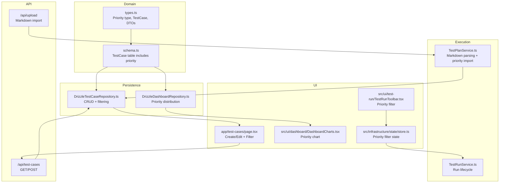
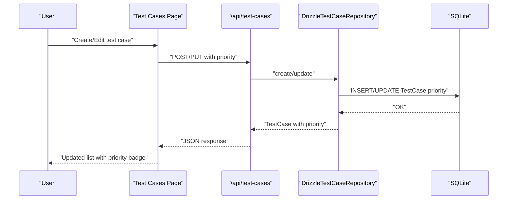
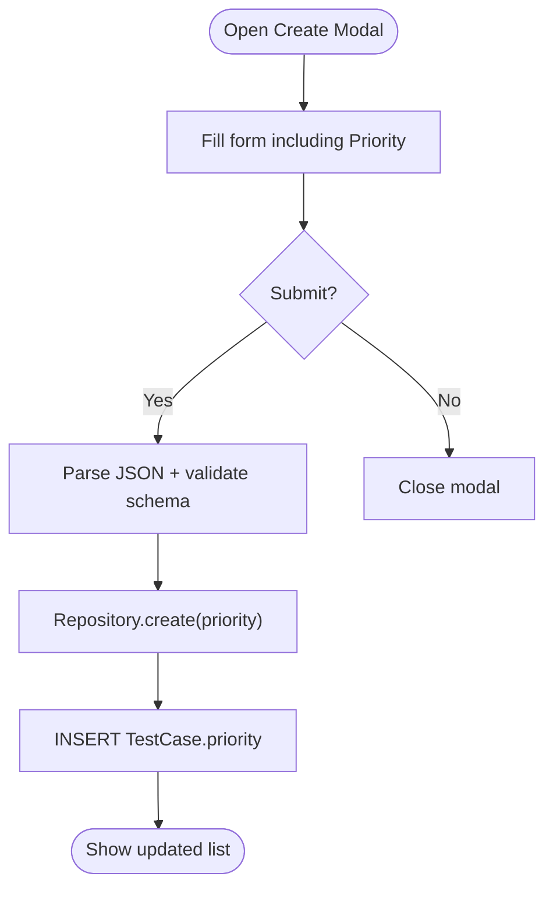
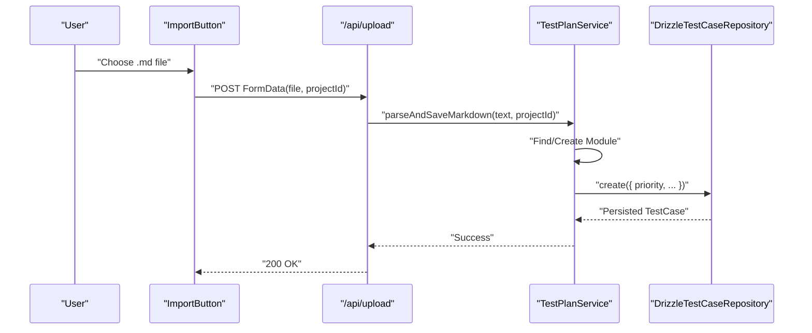
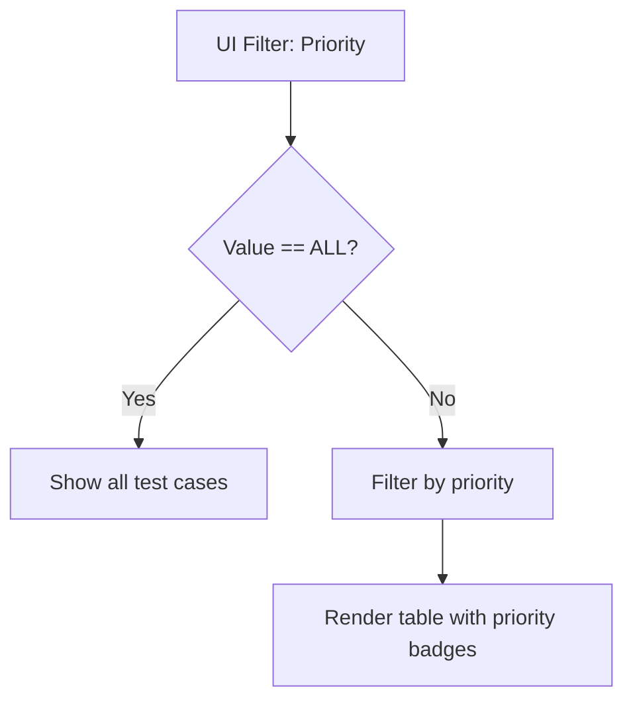
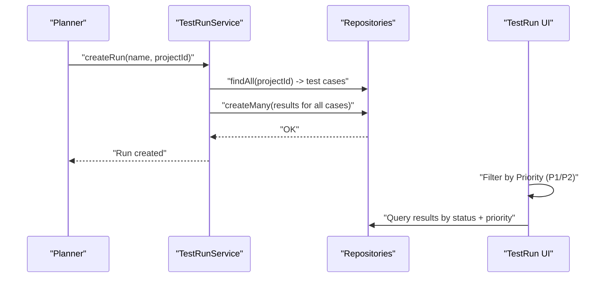
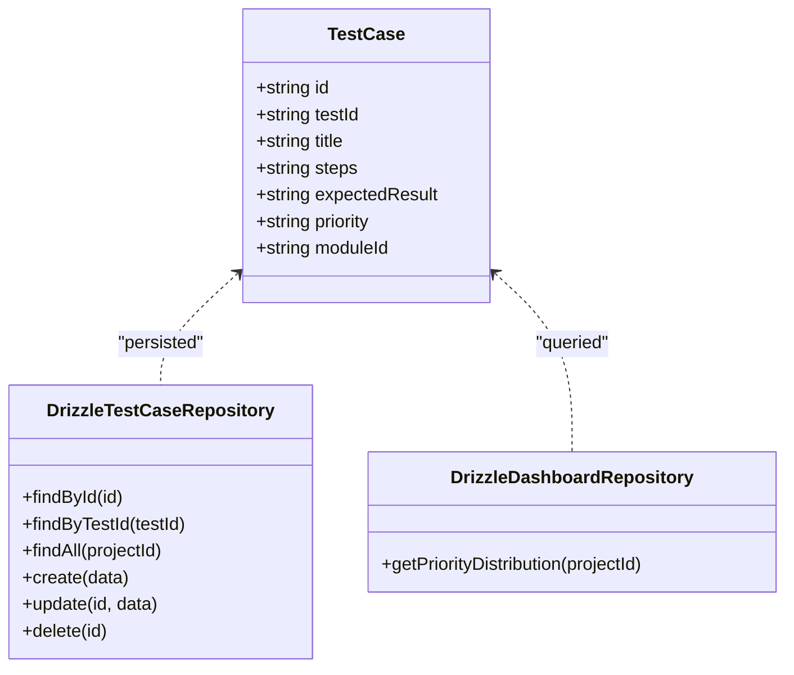

# Priority Management

<cite>
**Referenced Files in This Document**
- [types.ts](file://src/domain/types/index.ts)
- [schema.ts](file://src/infrastructure/db/schema.ts)
- [DrizzleTestCaseRepository.ts](file://src/adapters/persistence/drizzle/DrizzleTestCaseRepository.ts)
- [DrizzleDashboardRepository.ts](file://src/adapters/persistence/drizzle/DrizzleDashboardRepository.ts)
- [page.tsx](file://app/test-cases/page.tsx)
- [TestRunToolbar.tsx](file://src/ui/test-run/TestRunToolbar.tsx)
- [store.ts](file://src/infrastructure/state/store.ts)
- [TestPlanService.ts](file://src/domain/services/TestPlanService.ts)
- [route.ts](file://app/api/test-cases/route.ts)
- [route.ts](file://app/api/upload/route.ts)
- [DashboardCharts.tsx](file://src/ui/dashboard/DashboardCharts.tsx)
- [page.tsx](file://app/page.tsx)
</cite>

## Table of Contents
1. [Introduction](#introduction)
2. [Project Structure](#project-structure)
3. [Core Components](#core-components)
4. [Architecture Overview](#architecture-overview)
5. [Detailed Component Analysis](#detailed-component-analysis)
6. [Dependency Analysis](#dependency-analysis)
7. [Performance Considerations](#performance-considerations)
8. [Troubleshooting Guide](#troubleshooting-guide)
9. [Conclusion](#conclusion)

## Introduction
This document describes the Priority Management sub-feature that governs the P1–P4 priority classification for test cases. It explains the significance and impact levels associated with each priority tier, how priorities are assigned during creation, imported from test plans, and managed throughout the lifecycle. It also covers priority-based filtering and sorting, how priorities influence test execution strategies, the business logic behind classification, team workflows, and integration with test execution planning.

## Project Structure
Priority management spans the domain model, persistence layer, API routes, UI components, and dashboard charts. The priority value is part of the test case entity and is persisted in the database. UI pages and toolbar components expose filtering and display capabilities. The dashboard aggregates priority distributions for reporting.

**Diagram sources**
- [types.ts:5](file://src/domain/types/index.ts#L5)
- [schema.ts:24-32](file://src/infrastructure/db/schema.ts#L24-L32)
- [DrizzleTestCaseRepository.ts:37-47](file://src/adapters/persistence/drizzle/DrizzleTestCaseRepository.ts#L37-L47)
- [DrizzleDashboardRepository.ts:127-149](file://src/adapters/persistence/drizzle/DrizzleDashboardRepository.ts#L127-L149)
- [route.ts](file://app/api/test-cases/route.ts)
- [route.ts](file://app/api/upload/route.ts)
- [page.tsx](file://app/test-cases/page.tsx)
- [TestRunToolbar.tsx:45-55](file://src/ui/test-run/TestRunToolbar.tsx#L45-L55)
- [store.ts:29](file://src/infrastructure/state/store.ts#L29)
- [TestPlanService.ts:35-108](file://src/domain/services/TestPlanService.ts#L35-L108)
- [TestRunService.ts:33-51](file://src/domain/services/TestRunService.ts#L33-L51)
- [DashboardCharts.tsx:114-146](file://src/ui/dashboard/DashboardCharts.tsx#L114-L146)

**Section sources**
- [types.ts:5](file://src/domain/types/index.ts#L5)
- [schema.ts:24-32](file://src/infrastructure/db/schema.ts#L24-L32)
- [DrizzleTestCaseRepository.ts:37-47](file://src/adapters/persistence/drizzle/DrizzleTestCaseRepository.ts#L37-L47)
- [DrizzleDashboardRepository.ts:127-149](file://src/adapters/persistence/drizzle/DrizzleDashboardRepository.ts#L127-L149)
- [page.tsx](file://app/test-cases/page.tsx)
- [TestRunToolbar.tsx:45-55](file://src/ui/test-run/TestRunToolbar.tsx#L45-L55)
- [store.ts:29](file://src/infrastructure/state/store.ts#L29)
- [TestPlanService.ts:35-108](file://src/domain/services/TestPlanService.ts#L35-L108)
- [route.ts](file://app/api/test-cases/route.ts)
- [route.ts](file://app/api/upload/route.ts)
- [DashboardCharts.tsx:114-146](file://src/ui/dashboard/DashboardCharts.tsx#L114-L146)
- [page.tsx](file://app/page.tsx)

## Core Components
- Priority type definition: The domain enforces a strict priority enumeration of P1, P2, P3, P4.
- Test case entity: Includes a priority field persisted in the database.
- Repository operations: Creation and retrieval of test cases include priority values.
- UI filtering: Both the test case list and test run toolbar support priority filtering.
- Dashboard reporting: Priority distribution is computed and visualized.
- Execution lifecycle: Test runs are created with results for all test cases; priorities inform prioritization strategies.

**Section sources**
- [types.ts:5](file://src/domain/types/index.ts#L5)
- [schema.ts:30](file://src/infrastructure/db/schema.ts#L30)
- [DrizzleTestCaseRepository.ts:37-47](file://src/adapters/persistence/drizzle/DrizzleTestCaseRepository.ts#L37-L47)
- [page.tsx:260-270](file://app/test-cases/page.tsx#L260-L270)
- [TestRunToolbar.tsx:45-55](file://src/ui/test-run/TestRunToolbar.tsx#L45-L55)
- [DrizzleDashboardRepository.ts:127-149](file://src/adapters/persistence/drizzle/DrizzleDashboardRepository.ts#L127-L149)
- [DashboardCharts.tsx:114-146](file://src/ui/dashboard/DashboardCharts.tsx#L114-L146)

## Architecture Overview
The priority system is modeled centrally in the domain and persisted via the repository layer. UI surfaces allow creation, editing, and filtering by priority. Test plan import preserves priority values from Markdown tables. Dashboard queries compute priority distributions for reporting.

**Diagram sources**
- [page.tsx:135-159](file://app/test-cases/page.tsx#L135-L159)
- [route.ts](file://app/api/test-cases/route.ts)
- [DrizzleTestCaseRepository.ts:37-47](file://src/adapters/persistence/drizzle/DrizzleTestCaseRepository.ts#L37-L47)
- [schema.ts:24-32](file://src/infrastructure/db/schema.ts#L24-L32)

## Detailed Component Analysis

### Priority Classification and Impact
- P1: Critical. Typically blocks release or affects core functionality. Highest priority for execution and immediate remediation.
- P2: High. Significant functional impact; often regression or major user journey blocker.
- P3: Medium. Noticeable but non-blocking; may be deferred depending on capacity.
- P4: Low. Minor or exploratory; often scheduled last or automated where feasible.

These tiers guide execution ordering, resource allocation, and reporting emphasis.

[No sources needed since this section defines conceptual impact levels]

### Priority Assignment During Creation
- UI form exposes a priority dropdown with P1–P4 options.
- Default priority is set to P2 on creation.
- On submit, the API route validates and persists the priority.

**Diagram sources**
- [page.tsx:115-120](file://app/test-cases/page.tsx#L115-L120)
- [page.tsx:407-416](file://app/test-cases/page.tsx#L407-L416)
- [route.ts](file://app/api/test-cases/route.ts)
- [DrizzleTestCaseRepository.ts:37-47](file://src/adapters/persistence/drizzle/DrizzleTestCaseRepository.ts#L37-L47)

**Section sources**
- [page.tsx:115-120](file://app/test-cases/page.tsx#L115-L120)
- [page.tsx:407-416](file://app/test-cases/page.tsx#L407-L416)
- [route.ts](file://app/api/test-cases/route.ts)
- [DrizzleTestCaseRepository.ts:37-47](file://src/adapters/persistence/drizzle/DrizzleTestCaseRepository.ts#L37-L47)

### Priority Import from Test Plans
- The Markdown parser extracts priority values from table rows.
- Modules are created or reused; test cases are created per row, preserving priority.
- Existing test cases are skipped if the test ID exists and belongs to the same module.

**Diagram sources**
- [ImportButton.tsx:14-51](file://src/ui/test-design/ImportButton.tsx#L14-L51)
- [route.ts](file://app/api/upload/route.ts)
- [TestPlanService.ts:35-108](file://src/domain/services/TestPlanService.ts#L35-L108)
- [DrizzleTestCaseRepository.ts:37-47](file://src/adapters/persistence/drizzle/DrizzleTestCaseRepository.ts#L37-L47)

**Section sources**
- [TestPlanService.ts:35-108](file://src/domain/services/TestPlanService.ts#L35-L108)
- [route.ts](file://app/api/upload/route.ts)
- [ImportButton.tsx:14-51](file://src/ui/test-design/ImportButton.tsx#L14-L51)

### Priority-Based Filtering and Sorting
- Test case list supports filtering by priority (P1–P4) and module.
- Test run toolbar supports filtering by priority (ALL, P1–P4) alongside status filters.
- Priority badges are colored per tier for quick recognition.

**Diagram sources**
- [page.tsx:260-270](file://app/test-cases/page.tsx#L260-L270)
- [page.tsx:350-354](file://app/test-cases/page.tsx#L350-L354)
- [TestRunToolbar.tsx:45-55](file://src/ui/test-run/TestRunToolbar.tsx#L45-L55)
- [store.ts:29](file://src/infrastructure/state/store.ts#L29)

**Section sources**
- [page.tsx:260-270](file://app/test-cases/page.tsx#L260-L270)
- [page.tsx:350-354](file://app/test-cases/page.tsx#L350-L354)
- [TestRunToolbar.tsx:45-55](file://src/ui/test-run/TestRunToolbar.tsx#L45-L55)
- [store.ts:29](file://src/infrastructure/state/store.ts#L29)

### Influence on Test Execution Strategies
- Execution planning: Higher-priority test cases (P1/P2) are prioritized for manual runs and regression cycles.
- Automation: P4 items are candidates for automation; P1/P2 may be partially automated and monitored closely.
- Batch scheduling: Runs can be segmented by priority to focus resources on critical paths.
- Reporting: Dashboards highlight P1/P2 concentrations to drive remediation efforts.

[No sources needed since this section provides conceptual execution guidance]

### Business Logic Behind Priority Classification
- Risk-based classification: P1/P2 correspond to high-risk, high-impact scenarios; P3/P4 represent lower risk.
- Release gating: P1/P2 are often release blockers; P3/P4 may be release-conditional.
- Resource allocation: Teams allocate headcount and environments proportionally to priority distribution.
- Compliance and coverage: Regulatory or compliance-critical items are elevated to P1/P2.

[No sources needed since this section defines conceptual business logic]

### Team Workflows for Priority Management
- Design phase: Product owners and testers collaboratively assign P1–P4 based on risk and impact.
- CI/CD alignment: P1/P2 are included in pre-release smoke tests; P3/P4 are scheduled for nightly runs.
- Defect triage: Bugs affecting P1/P2 receive immediate attention; P4 bugs are queued for maintenance sprints.
- Retrospectives: Priority distribution informs capacity planning and process improvements.

[No sources needed since this section defines conceptual workflows]

### Integration with Test Execution Planning
- Test run creation: Automatically generates UNTESTED results for all test cases; priorities inform run sequencing.
- Execution UI: Users can filter by priority to focus on critical items.
- Notifications and webhooks: Completion events include aggregated statistics; teams can monitor priority-heavy runs.

**Diagram sources**
- [TestRunService.ts:33-51](file://src/domain/services/TestRunService.ts#L33-L51)
- [DrizzleTestCaseRepository.ts:18-35](file://src/adapters/persistence/drizzle/DrizzleTestCaseRepository.ts#L18-L35)
- [TestRunToolbar.tsx:45-55](file://src/ui/test-run/TestRunToolbar.tsx#L45-L55)

**Section sources**
- [TestRunService.ts:33-51](file://src/domain/services/TestRunService.ts#L33-L51)
- [DrizzleTestCaseRepository.ts:18-35](file://src/adapters/persistence/drizzle/DrizzleTestCaseRepository.ts#L18-L35)
- [TestRunToolbar.tsx:45-55](file://src/ui/test-run/TestRunToolbar.tsx#L45-L55)

## Dependency Analysis
Priority is a scalar field in the test case entity and is consistently referenced across UI, API, persistence, and dashboard layers.

**Diagram sources**
- [types.ts:23-32](file://src/domain/types/index.ts#L23-L32)
- [DrizzleTestCaseRepository.ts:7-70](file://src/adapters/persistence/drizzle/DrizzleTestCaseRepository.ts#L7-L70)
- [DrizzleDashboardRepository.ts:127-149](file://src/adapters/persistence/drizzle/DrizzleDashboardRepository.ts#L127-L149)

**Section sources**
- [types.ts:23-32](file://src/domain/types/index.ts#L23-L32)
- [DrizzleTestCaseRepository.ts:7-70](file://src/adapters/persistence/drizzle/DrizzleTestCaseRepository.ts#L7-L70)
- [DrizzleDashboardRepository.ts:127-149](file://src/adapters/persistence/drizzle/DrizzleDashboardRepository.ts#L127-L149)

## Performance Considerations
- Filtering by priority is efficient due to the single-field predicate on the test case table.
- Dashboard aggregation performs a join and grouping; ensure appropriate indexing on module and test case tables.
- Large test plans: Batch imports and deduplication prevent redundant inserts.

[No sources needed since this section provides general guidance]

## Troubleshooting Guide
- Priority not saved on creation: Verify the form selects a valid priority and the API route parses the payload.
- Imported priority missing: Confirm the Markdown table includes a Priority column and the parser recognizes it.
- Filter not working: Ensure the filter value matches the enum (P1–P4) and UI state is updated.

**Section sources**
- [page.tsx:407-416](file://app/test-cases/page.tsx#L407-L416)
- [TestPlanService.ts:84](file://src/domain/services/TestPlanService.ts#L84)
- [TestRunToolbar.tsx:45-55](file://src/ui/test-run/TestRunToolbar.tsx#L45-L55)

## Conclusion
Priority Management centers on a simple, robust P1–P4 classification embedded in the domain and UI. It enables precise control over test case creation, import, filtering, and execution planning. By aligning team workflows and dashboards with priority tiers, organizations can optimize resource allocation, accelerate remediation, and improve release quality.