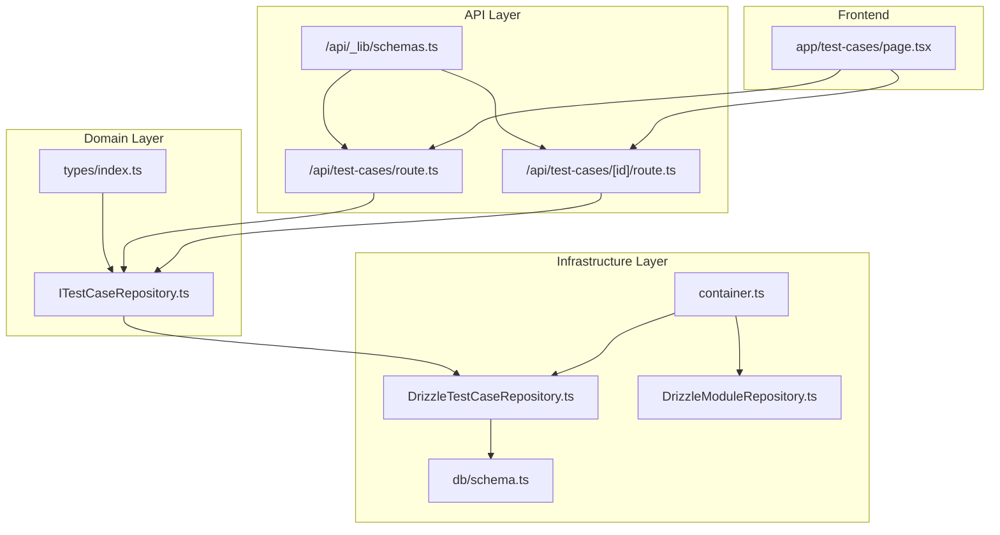
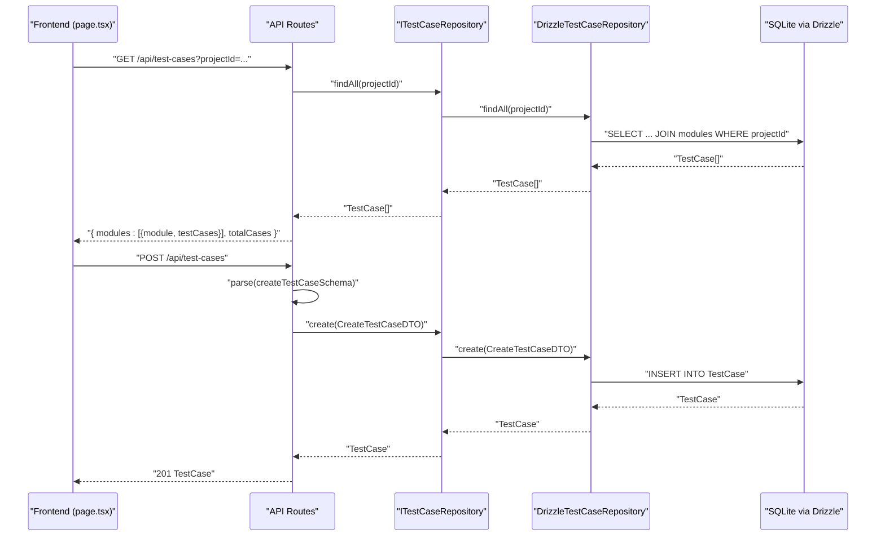
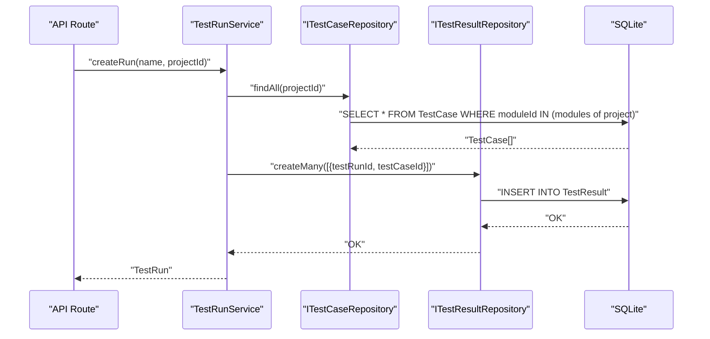
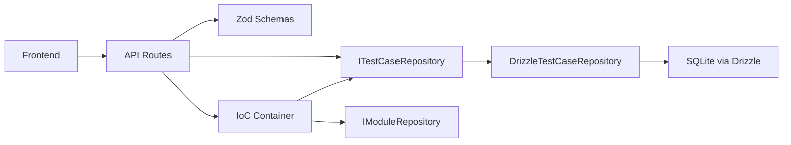

# Test Case CRUD Operations

<cite>
**Referenced Files in This Document**
- [ITestCaseRepository.ts](file://src/domain/ports/repositories/ITestCaseRepository.ts)
- [DrizzleTestCaseRepository.ts](file://src/adapters/persistence/drizzle/DrizzleTestCaseRepository.ts)
- [schemas.ts](file://app/api/_lib/schemas.ts)
- [route.ts](file://app/api/test-cases/route.ts)
- [route.ts](file://app/api/test-cases/[id]/route.ts)
- [index.ts](file://src/domain/types/index.ts)
- [schema.ts](file://src/infrastructure/db/schema.ts)
- [container.ts](file://src/infrastructure/container.ts)
- [page.tsx](file://app/test-cases/page.tsx)
- [DrizzleModuleRepository.ts](file://src/adapters/persistence/drizzle/DrizzleModuleRepository.ts)
- [TestRunService.ts](file://src/domain/services/TestRunService.ts)
</cite>

## Table of Contents
1. [Introduction](#introduction)
2. [Project Structure](#project-structure)
3. [Core Components](#core-components)
4. [Architecture Overview](#architecture-overview)
5. [Detailed Component Analysis](#detailed-component-analysis)
6. [Dependency Analysis](#dependency-analysis)
7. [Performance Considerations](#performance-considerations)
8. [Troubleshooting Guide](#troubleshooting-guide)
9. [Conclusion](#conclusion)

## Introduction
This document provides a comprehensive guide to the Test Case CRUD Operations sub-feature. It covers the complete lifecycle of managing test cases: creation, reading, updating, and deletion. It explains the ITestCaseRepository interface, the test case data models, and the relationship between test cases and modules. It also documents the API endpoints for test case operations, request/response schemas, validation rules, practical examples, and integration with test execution workflows.

## Project Structure
The test case feature spans several layers:
- Domain layer defines the entity and DTO types and the repository interface.
- Infrastructure layer implements the repository using Drizzle ORM and exposes it via an IoC container.
- API layer provides REST endpoints for CRUD operations and validation.
- Frontend integrates with the API to present a user-friendly interface for managing test cases.

**Diagram sources**
- [ITestCaseRepository.ts:1-13](file://src/domain/ports/repositories/ITestCaseRepository.ts#L1-L13)
- [DrizzleTestCaseRepository.ts:1-71](file://src/adapters/persistence/drizzle/DrizzleTestCaseRepository.ts#L1-L71)
- [schema.ts:24-32](file://src/infrastructure/db/schema.ts#L24-L32)
- [container.ts:33-91](file://src/infrastructure/container.ts#L33-L91)
- [DrizzleModuleRepository.ts:1-34](file://src/adapters/persistence/drizzle/DrizzleModuleRepository.ts#L1-L34)
- [route.ts:1-37](file://app/api/test-cases/route.ts#L1-L37)
- [route.ts:1-33](file://app/api/test-cases/[id]/route.ts#L1-L33)
- [schemas.ts:72-92](file://app/api/_lib/schemas.ts#L72-L92)
- [page.tsx:1-523](file://app/test-cases/page.tsx#L1-L523)

**Section sources**
- [ITestCaseRepository.ts:1-13](file://src/domain/ports/repositories/ITestCaseRepository.ts#L1-L13)
- [DrizzleTestCaseRepository.ts:1-71](file://src/adapters/persistence/drizzle/DrizzleTestCaseRepository.ts#L1-L71)
- [schema.ts:24-32](file://src/infrastructure/db/schema.ts#L24-L32)
- [container.ts:33-91](file://src/infrastructure/container.ts#L33-L91)
- [DrizzleModuleRepository.ts:1-34](file://src/adapters/persistence/drizzle/DrizzleModuleRepository.ts#L1-L34)
- [route.ts:1-37](file://app/api/test-cases/route.ts#L1-L37)
- [route.ts:1-33](file://app/api/test-cases/[id]/route.ts#L1-L33)
- [schemas.ts:72-92](file://app/api/_lib/schemas.ts#L72-L92)
- [page.tsx:1-523](file://app/test-cases/page.tsx#L1-L523)

## Core Components
- ITestCaseRepository: Defines the contract for test case persistence operations.
- DrizzleTestCaseRepository: Implements the repository using Drizzle ORM with SQLite.
- Test Case Data Models: Entities and DTOs define the shape of test case data.
- API Endpoints: Provide CRUD operations with validation and grouping by module.
- Frontend Integration: Provides UI for creating, editing, filtering, and deleting test cases.

Key responsibilities:
- Create test cases with validation for required fields and priority enumeration.
- Read test cases by ID, by testId, and list with module grouping.
- Update test cases with partial updates.
- Delete test cases with cascading effects on related results.

**Section sources**
- [ITestCaseRepository.ts:3-12](file://src/domain/ports/repositories/ITestCaseRepository.ts#L3-L12)
- [DrizzleTestCaseRepository.ts:7-71](file://src/adapters/persistence/drizzle/DrizzleTestCaseRepository.ts#L7-L71)
- [index.ts:23-32](file://src/domain/types/index.ts#L23-L32)
- [index.ts:68-75](file://src/domain/types/index.ts#L68-L75)
- [route.ts:8-28](file://app/api/test-cases/route.ts#L8-L28)
- [route.ts:8-32](file://app/api/test-cases/[id]/route.ts#L8-L32)

## Architecture Overview
The system follows layered architecture:
- Domain defines contracts and types.
- Infrastructure implements persistence and dependency injection.
- API routes orchestrate requests, apply validation, and delegate to repositories.
- Frontend consumes the API to render and manage test cases.

**Diagram sources**
- [page.tsx:61-77](file://app/test-cases/page.tsx#L61-L77)
- [route.ts:8-28](file://app/api/test-cases/route.ts#L8-L28)
- [route.ts:30-36](file://app/api/test-cases/route.ts#L30-L36)
- [ITestCaseRepository.ts:6-7](file://src/domain/ports/repositories/ITestCaseRepository.ts#L6-L7)
- [DrizzleTestCaseRepository.ts:18-35](file://src/adapters/persistence/drizzle/DrizzleTestCaseRepository.ts#L18-L35)
- [DrizzleTestCaseRepository.ts:37-47](file://src/adapters/persistence/drizzle/DrizzleTestCaseRepository.ts#L37-L47)

## Detailed Component Analysis

### ITestCaseRepository Interface
Defines the contract for test case persistence:
- findById(id: string): Retrieve a test case by its primary key.
- findByTestId(testId: string): Retrieve a test case by its external identifier.
- findAll(projectId?: string): List test cases optionally filtered by project.
- create(data: CreateTestCaseDTO): Persist a new test case.
- update(id: string, data: Partial<CreateTestCaseDTO>): Update an existing test case.
- delete(id: string): Remove a test case.
- count(): Count all test cases.
- deleteAll(): Bulk delete all test cases.

Validation and constraints are enforced by the API layer and DTOs.

**Section sources**
- [ITestCaseRepository.ts:3-12](file://src/domain/ports/repositories/ITestCaseRepository.ts#L3-L12)

### DrizzleTestCaseRepository Implementation
Implements the repository using Drizzle ORM:
- findById: Selects by primary key.
- findByTestId: Selects by external testId.
- findAll: Lists all test cases; when projectId is provided, joins with modules to filter by project.
- create: Inserts a new test case with all required fields.
- update: Updates selected fields; throws if not found.
- delete: Deletes by primary key.
- count: Counts rows.
- deleteAll: Bulk deletes all rows.

Foreign key constraints:
- TestCase.moduleId references Module.id with cascade delete.
- Deleting a module cascades to test cases.

**Section sources**
- [DrizzleTestCaseRepository.ts:7-71](file://src/adapters/persistence/drizzle/DrizzleTestCaseRepository.ts#L7-L71)
- [schema.ts:24-32](file://src/infrastructure/db/schema.ts#L24-L32)

### Test Case Data Models
Entities and DTOs:
- TestCase: Core entity with id, testId, title, steps, expectedResult, priority, moduleId, and optional module.
- CreateTestCaseDTO: Fields required for creation.
- Priority: Enumerated values P1, P2, P3, P4.

These types are used across the domain, API, and UI layers.

**Section sources**
- [index.ts:23-32](file://src/domain/types/index.ts#L23-L32)
- [index.ts:68-75](file://src/domain/types/index.ts#L68-L75)
- [index.ts:5](file://src/domain/types/index.ts#L5)

### API Endpoints for Test Case Operations
Endpoints:
- GET /api/test-cases?projectId=...: Lists test cases grouped by module for a project.
- POST /api/test-cases: Creates a new test case.
- GET /api/test-cases/[id]: Retrieves a single test case by ID.
- PUT /api/test-cases/[id]: Updates a test case.
- DELETE /api/test-cases/[id]: Deletes a test case.

Request/Response schemas:
- createTestCaseSchema: Validates creation payload with required fields and priority enumeration.
- updateTestCaseSchema: Validates partial updates with optional fields and priority enumeration.

Validation rules:
- All required fields must be present and within length limits.
- Priority must be one of P1, P2, P3, P4.
- Module ID must be provided for creation.

Grouping behavior:
- The list endpoint returns modules with their associated test cases, enabling UI rendering.

**Section sources**
- [route.ts:8-28](file://app/api/test-cases/route.ts#L8-L28)
- [route.ts:30-36](file://app/api/test-cases/route.ts#L30-L36)
- [route.ts:8-16](file://app/api/test-cases/[id]/route.ts#L8-L16)
- [route.ts:18-25](file://app/api/test-cases/[id]/route.ts#L18-L25)
- [route.ts:27-32](file://app/api/test-cases/[id]/route.ts#L27-L32)
- [schemas.ts:74-90](file://app/api/_lib/schemas.ts#L74-L90)

### Practical Examples

#### Creating Test Cases with Different Priorities
- Example: Create a test case with priority P1 (Critical) under a specific module.
- Validation ensures testId, title, steps, expectedResult, priority, and moduleId are provided.
- The frontend defaults priority to P2 and allows selection of P1–P4.

**Section sources**
- [schemas.ts:74-81](file://app/api/_lib/schemas.ts#L74-L81)
- [page.tsx:406-416](file://app/test-cases/page.tsx#L406-L416)

#### Updating Test Case Details
- Example: Change the priority or steps of an existing test case.
- The update endpoint accepts partial fields; only provided fields are updated.
- Validation ensures updated fields meet constraints.

**Section sources**
- [route.ts:18-25](file://app/api/test-cases/[id]/route.ts#L18-L25)
- [schemas.ts:83-90](file://app/api/_lib/schemas.ts#L83-L90)

#### Bulk Operations
- deleteAll: Implemented at the repository level to clear all test cases.
- deleteAll is used by administrative services to reset data; it cascades to related results due to foreign key constraints.

**Section sources**
- [ITestCaseRepository.ts:11](file://src/domain/ports/repositories/ITestCaseRepository.ts#L11)
- [DrizzleTestCaseRepository.ts:67-69](file://src/adapters/persistence/drizzle/DrizzleTestCaseRepository.ts#L67-L69)
- [schema.ts:42-51](file://src/infrastructure/db/schema.ts#L42-L51)

#### Soft vs Hard Deletion Strategies
- Hard deletion: delete(id) removes the test case immediately.
- Cascade behavior: Deleting a module cascades to test cases; deleting a test case cascades to test results.
- No soft delete flag is implemented; deletions are immediate.

**Section sources**
- [DrizzleTestCaseRepository.ts:58-60](file://src/adapters/persistence/drizzle/DrizzleTestCaseRepository.ts#L58-L60)
- [schema.ts:21-32](file://src/infrastructure/db/schema.ts#L21-L32)

### Relationship Between Test Cases and Modules
- Test cases belong to modules via moduleId.
- The list endpoint groups test cases by module for efficient UI rendering.
- Module filtering is performed by joining TestCase with Module on projectId.

**Section sources**
- [DrizzleTestCaseRepository.ts:18-35](file://src/adapters/persistence/drizzle/DrizzleTestCaseRepository.ts#L18-L35)
- [DrizzleModuleRepository.ts:21-23](file://src/adapters/persistence/drizzle/DrizzleModuleRepository.ts#L21-L23)
- [route.ts:16-27](file://app/api/test-cases/route.ts#L16-L27)

### Integration with Test Execution Workflows
- TestRunService creates test results for all existing test cases when a run is created.
- Deleting a test case cascades to test results, ensuring data consistency.
- The UI warns about permanent deletion and associated results.

**Diagram sources**
- [TestRunService.ts:33-51](file://src/domain/services/TestRunService.ts#L33-L51)
- [ITestCaseRepository.ts:6](file://src/domain/ports/repositories/ITestCaseRepository.ts#L6)
- [schema.ts:42-51](file://src/infrastructure/db/schema.ts#L42-L51)

**Section sources**
- [TestRunService.ts:33-51](file://src/domain/services/TestRunService.ts#L33-L51)
- [page.tsx:500-502](file://app/test-cases/page.tsx#L500-L502)

## Dependency Analysis
- API routes depend on the IoC container to resolve ITestCaseRepository and IModuleRepository.
- DrizzleTestCaseRepository depends on the database client and schema definitions.
- Frontend depends on API endpoints for all CRUD operations.

**Diagram sources**
- [container.ts:33-91](file://src/infrastructure/container.ts#L33-L91)
- [DrizzleTestCaseRepository.ts:1-6](file://src/adapters/persistence/drizzle/DrizzleTestCaseRepository.ts#L1-L6)
- [route.ts:4-6](file://app/api/test-cases/route.ts#L4-L6)
- [route.ts:4](file://app/api/test-cases/[id]/route.ts#L4)

**Section sources**
- [container.ts:33-91](file://src/infrastructure/container.ts#L33-L91)
- [DrizzleTestCaseRepository.ts:1-6](file://src/adapters/persistence/drizzle/DrizzleTestCaseRepository.ts#L1-L6)
- [route.ts:4-6](file://app/api/test-cases/route.ts#L4-L6)
- [route.ts:4](file://app/api/test-cases/[id]/route.ts#L4)

## Performance Considerations
- Filtering by projectId in findAll uses an INNER JOIN with modules; ensure projectId is indexed via database constraints.
- Grouping in the API reduces client-side computation by returning pre-grouped data.
- Consider pagination for large datasets to reduce memory usage and response times.
- Use selective field projection in findAll when projectId is provided to minimize payload size.

## Troubleshooting Guide
Common issues and resolutions:
- Missing projectId in GET /api/test-cases: Returns 400 with an error message indicating projectId is required.
- Test case not found by ID: GET /api/test-cases/[id] returns 404 with an error message.
- Validation errors on creation/update: Zod schemas enforce required fields and priority enumeration; fix payload according to schema.
- Foreign key constraint violations: Ensure moduleId exists and belongs to the correct project.
- Cascading deletes: Deleting a module or test case removes related results; verify expected behavior before bulk operations.

**Section sources**
- [route.ts:12-14](file://app/api/test-cases/route.ts#L12-L14)
- [route.ts:12-14](file://app/api/test-cases/[id]/route.ts#L12-L14)
- [schemas.ts:74-90](file://app/api/_lib/schemas.ts#L74-L90)
- [schema.ts:21-32](file://src/infrastructure/db/schema.ts#L21-L32)

## Conclusion
The Test Case CRUD Operations feature provides a robust, validated, and integrated solution for managing test cases. It enforces strong typing and validation, supports efficient grouping by modules, and integrates seamlessly with test execution workflows. The architecture separates concerns clearly, enabling maintainability and extensibility while ensuring data integrity through foreign key constraints and cascading deletes.