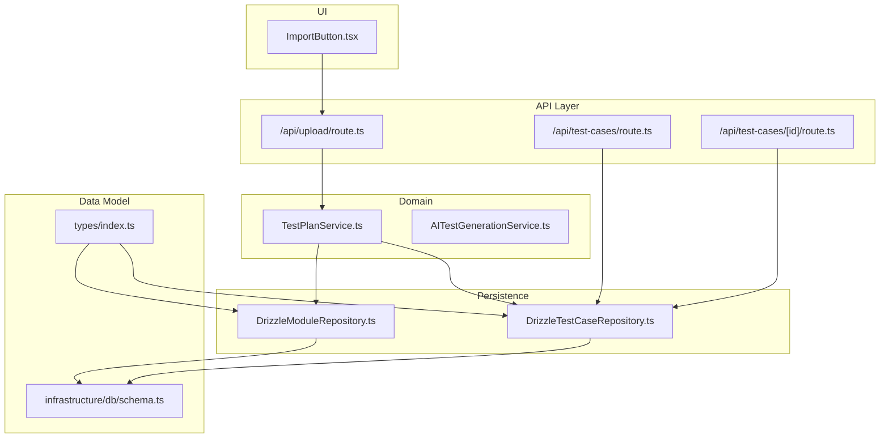
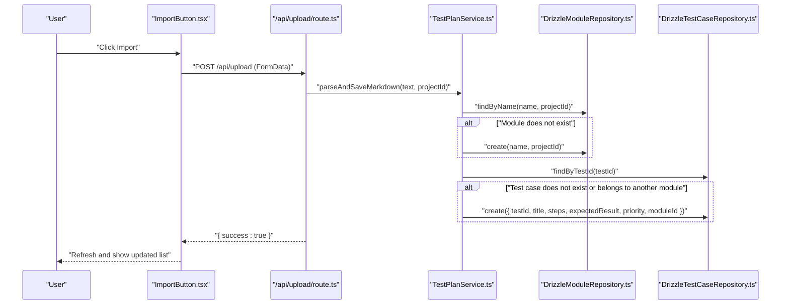
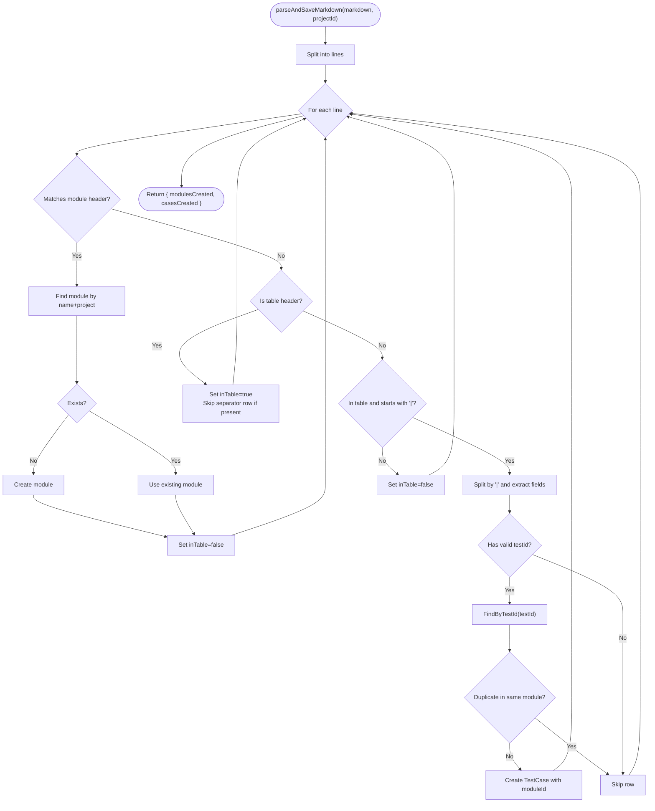
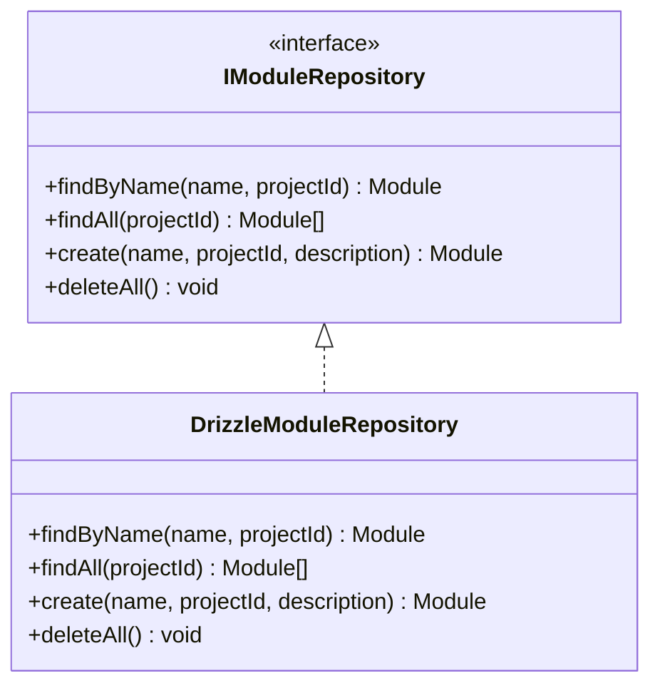
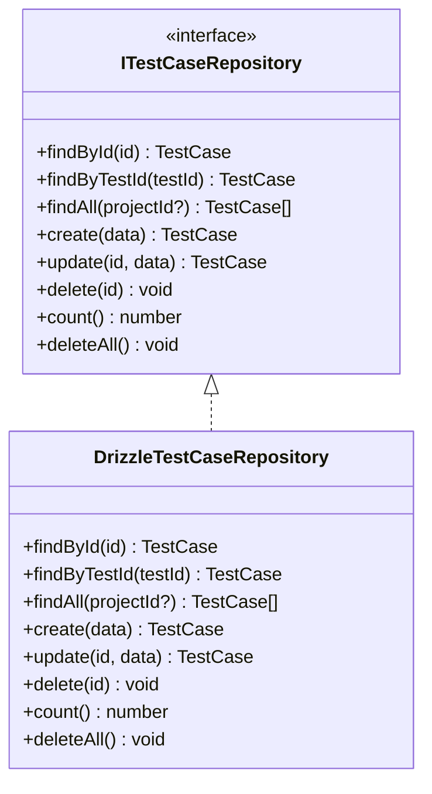
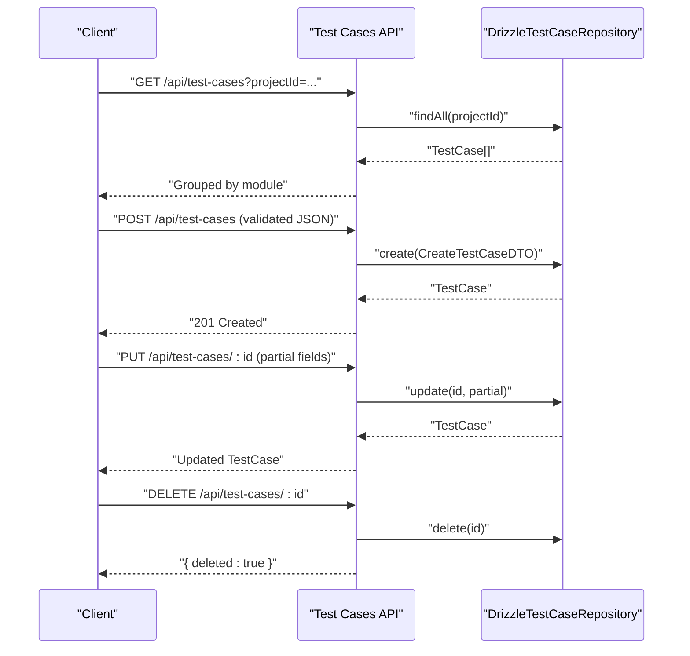
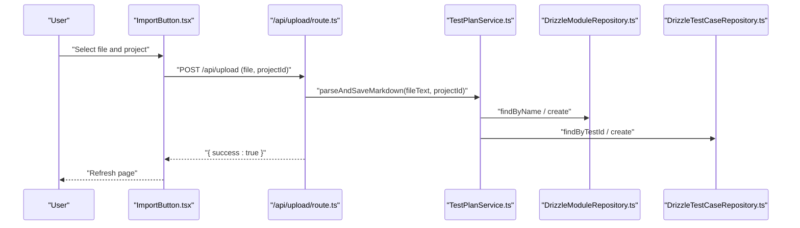
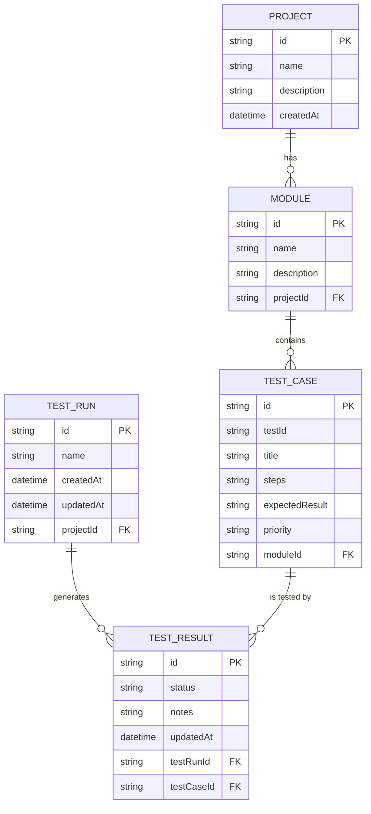
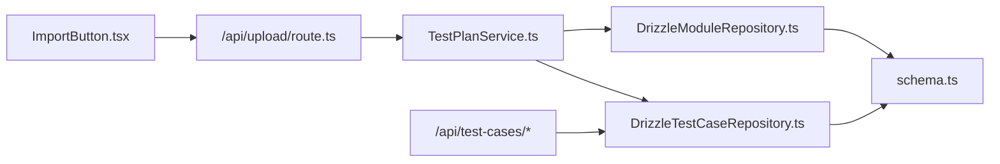

# Test Case Management

<cite>
**Referenced Files in This Document**
- [TestPlanService.ts](file://src/domain/services/TestPlanService.ts)
- [DrizzleTestCaseRepository.ts](file://src/adapters/persistence/drizzle/DrizzleTestCaseRepository.ts)
- [DrizzleModuleRepository.ts](file://src/adapters/persistence/drizzle/DrizzleModuleRepository.ts)
- [ITestCaseRepository.ts](file://src/domain/ports/repositories/ITestCaseRepository.ts)
- [IModuleRepository.ts](file://src/domain/ports/repositories/IModuleRepository.ts)
- [index.ts](file://src/domain/types/index.ts)
- [schemas.ts](file://app/api/_lib/schemas.ts)
- [route.ts](file://app/api/test-cases/route.ts)
- [route.ts](file://app/api/test-cases/[id]/route.ts)
- [route.ts](file://app/api/upload/route.ts)
- [schema.ts](file://src/infrastructure/db/schema.ts)
- [ImportButton.tsx](file://src/ui/test-design/ImportButton.tsx)
- [page.tsx](file://app/test-cases/page.tsx)
- [AITestGenerationService.ts](file://src/domain/services/AITestGenerationService.ts)
</cite>

## Table of Contents
1. [Introduction](#introduction)
2. [Project Structure](#project-structure)
3. [Core Components](#core-components)
4. [Architecture Overview](#architecture-overview)
5. [Detailed Component Analysis](#detailed-component-analysis)
6. [Dependency Analysis](#dependency-analysis)
7. [Performance Considerations](#performance-considerations)
8. [Troubleshooting Guide](#troubleshooting-guide)
9. [Conclusion](#conclusion)
10. [Appendices](#appendices)

## Introduction
This document describes the Test Case Management feature, focusing on hierarchical organization (projects → modules → test cases), priority management (P1–P4), and import/export capabilities. It explains the TestPlanService implementation, module creation and management, CRUD operations for test cases, and bulk import via Markdown. It also documents the data models, repository pattern, API endpoints, and user workflows, with practical examples and integration patterns.

## Project Structure
The Test Case Management feature spans domain services, repositories, database schema, API routes, and UI components:
- Domain: services and types define business logic and data contracts
- Persistence: Drizzle ORM repositories implement CRUD against SQLite
- API: Next.js routes expose REST endpoints for test cases and uploads
- UI: Import button triggers file upload and refreshes the test case list

**Diagram sources**
- [ImportButton.tsx:1-74](file://src/ui/test-design/ImportButton.tsx#L1-L74)
- [route.ts:1-23](file://app/api/upload/route.ts#L1-L23)
- [TestPlanService.ts:1-110](file://src/domain/services/TestPlanService.ts#L1-L110)
- [DrizzleModuleRepository.ts:1-34](file://src/adapters/persistence/drizzle/DrizzleModuleRepository.ts#L1-L34)
- [DrizzleTestCaseRepository.ts:1-71](file://src/adapters/persistence/drizzle/DrizzleTestCaseRepository.ts#L1-L71)
- [route.ts:1-37](file://app/api/test-cases/route.ts#L1-L37)
- [route.ts:1-33](file://app/api/test-cases/[id]/route.ts#L1-L33)
- [index.ts:1-196](file://src/domain/types/index.ts#L1-L196)
- [schema.ts:1-60](file://src/infrastructure/db/schema.ts#L1-L60)

**Section sources**
- [ImportButton.tsx:1-74](file://src/ui/test-design/ImportButton.tsx#L1-L74)
- [route.ts:1-23](file://app/api/upload/route.ts#L1-L23)
- [TestPlanService.ts:1-110](file://src/domain/services/TestPlanService.ts#L1-L110)
- [DrizzleModuleRepository.ts:1-34](file://src/adapters/persistence/drizzle/DrizzleModuleRepository.ts#L1-L34)
- [DrizzleTestCaseRepository.ts:1-71](file://src/adapters/persistence/drizzle/DrizzleTestCaseRepository.ts#L1-L71)
- [route.ts:1-37](file://app/api/test-cases/route.ts#L1-L37)
- [route.ts:1-33](file://app/api/test-cases/[id]/route.ts#L1-L33)
- [index.ts:1-196](file://src/domain/types/index.ts#L1-L196)
- [schema.ts:1-60](file://src/infrastructure/db/schema.ts#L1-L60)

## Core Components
- TestPlanService: Parses Markdown test plans and persists modules and test cases; creates modules and test cases via repositories.
- DrizzleModuleRepository and DrizzleTestCaseRepository: Implement CRUD using Drizzle ORM and SQLite schema.
- API endpoints: Expose GET/POST/PUT/DELETE for test cases and upload/import handler.
- UI ImportButton: Triggers upload of Markdown/HTML files and refreshes the page.
- Types and Schemas: Define entities, DTOs, enums (Priority), validation rules, and database schema.

Key responsibilities:
- Hierarchical organization: projects own modules; modules own test cases.
- Priority management: P1–P4 enforced by schema and validation.
- Bulk import: Markdown parsing with module headers and table rows.
- CRUD: Create, read, update, delete test cases; list by project and group by module.

**Section sources**
- [TestPlanService.ts:1-110](file://src/domain/services/TestPlanService.ts#L1-L110)
- [DrizzleModuleRepository.ts:1-34](file://src/adapters/persistence/drizzle/DrizzleModuleRepository.ts#L1-L34)
- [DrizzleTestCaseRepository.ts:1-71](file://src/adapters/persistence/drizzle/DrizzleTestCaseRepository.ts#L1-L71)
- [route.ts:1-37](file://app/api/test-cases/route.ts#L1-L37)
- [route.ts:1-33](file://app/api/test-cases/[id]/route.ts#L1-L33)
- [ImportButton.tsx:1-74](file://src/ui/test-design/ImportButton.tsx#L1-L74)
- [index.ts:1-196](file://src/domain/types/index.ts#L1-L196)
- [schemas.ts:74-91](file://app/api/_lib/schemas.ts#L74-L91)

## Architecture Overview
The system follows a layered architecture:
- UI triggers import or CRUD actions
- API routes validate requests and delegate to repositories/services
- Domain service encapsulates business logic (parsing, deduplication)
- Repositories persist to SQLite via Drizzle ORM
- Types and schema define contracts and constraints

**Diagram sources**
- [ImportButton.tsx:1-74](file://src/ui/test-design/ImportButton.tsx#L1-L74)
- [route.ts:1-23](file://app/api/upload/route.ts#L1-L23)
- [TestPlanService.ts:35-108](file://src/domain/services/TestPlanService.ts#L35-L108)
- [DrizzleModuleRepository.ts:8-28](file://src/adapters/persistence/drizzle/DrizzleModuleRepository.ts#L8-L28)
- [DrizzleTestCaseRepository.ts:13-46](file://src/adapters/persistence/drizzle/DrizzleTestCaseRepository.ts#L13-L46)

## Detailed Component Analysis

### TestPlanService
Responsibilities:
- Create modules by name within a project (dedupe by name+project)
- Create test cases from DTOs
- Parse Markdown test plans:
  - Recognizes module headers (supports English and Russian variants)
  - Skips table separators
  - Parses table rows into test cases
  - Deduplicates by testId and module ownership

Behavior highlights:
- Uses repository interfaces to avoid coupling to persistence
- Returns counts of created modules and test cases
- Validates presence of current module before parsing rows

**Diagram sources**
- [TestPlanService.ts:35-108](file://src/domain/services/TestPlanService.ts#L35-L108)

**Section sources**
- [TestPlanService.ts:1-110](file://src/domain/services/TestPlanService.ts#L1-L110)

### Module Management
- Create module if not exists (by name and project)
- List modules per project
- Delete all modules (utility)

**Diagram sources**
- [DrizzleModuleRepository.ts:1-34](file://src/adapters/persistence/drizzle/DrizzleModuleRepository.ts#L1-L34)
- [IModuleRepository.ts:1-9](file://src/domain/ports/repositories/IModuleRepository.ts#L1-L9)

**Section sources**
- [DrizzleModuleRepository.ts:1-34](file://src/adapters/persistence/drizzle/DrizzleModuleRepository.ts#L1-L34)
- [IModuleRepository.ts:1-9](file://src/domain/ports/repositories/IModuleRepository.ts#L1-L9)

### Test Case CRUD and Listing
- Retrieve by ID or by external testId
- List all test cases for a project (joined with modules)
- Create, update, delete test cases
- Count and delete all test cases

**Diagram sources**
- [DrizzleTestCaseRepository.ts:1-71](file://src/adapters/persistence/drizzle/DrizzleTestCaseRepository.ts#L1-L71)
- [ITestCaseRepository.ts:1-13](file://src/domain/ports/repositories/ITestCaseRepository.ts#L1-L13)

**Section sources**
- [DrizzleTestCaseRepository.ts:1-71](file://src/adapters/persistence/drizzle/DrizzleTestCaseRepository.ts#L1-L71)
- [ITestCaseRepository.ts:1-13](file://src/domain/ports/repositories/ITestCaseRepository.ts#L1-L13)

### API Endpoints for Test Case Operations
- GET /api/test-cases?projectId=...: Lists test cases grouped by module for a project
- POST /api/test-cases: Creates a test case with validation
- GET /api/test-cases/[id]: Retrieves a single test case
- PUT /api/test-cases/[id]: Updates a test case
- DELETE /api/test-cases/[id]: Deletes a test case

Validation rules:
- Create schema enforces required fields and priority enum
- Update schema allows partial updates

**Diagram sources**
- [route.ts:1-37](file://app/api/test-cases/route.ts#L1-L37)
- [route.ts:1-33](file://app/api/test-cases/[id]/route.ts#L1-L33)
- [DrizzleTestCaseRepository.ts:37-60](file://src/adapters/persistence/drizzle/DrizzleTestCaseRepository.ts#L37-L60)
- [schemas.ts:74-91](file://app/api/_lib/schemas.ts#L74-L91)

**Section sources**
- [route.ts:1-37](file://app/api/test-cases/route.ts#L1-L37)
- [route.ts:1-33](file://app/api/test-cases/[id]/route.ts#L1-L33)
- [schemas.ts:74-91](file://app/api/_lib/schemas.ts#L74-L91)

### Import/Export Functionality
- Import:
  - UI component triggers upload of .md/.html files
  - API endpoint reads FormData, extracts file and projectId, parses Markdown, and persists modules/test cases
- Export:
  - UI supports exporting to Markdown and CSV formats from the test cases page

**Diagram sources**
- [ImportButton.tsx:1-74](file://src/ui/test-design/ImportButton.tsx#L1-L74)
- [route.ts:1-23](file://app/api/upload/route.ts#L1-L23)
- [TestPlanService.ts:35-108](file://src/domain/services/TestPlanService.ts#L35-L108)
- [DrizzleModuleRepository.ts:8-28](file://src/adapters/persistence/drizzle/DrizzleModuleRepository.ts#L8-L28)
- [DrizzleTestCaseRepository.ts:13-46](file://src/adapters/persistence/drizzle/DrizzleTestCaseRepository.ts#L13-L46)

**Section sources**
- [ImportButton.tsx:1-74](file://src/ui/test-design/ImportButton.tsx#L1-L74)
- [route.ts:1-23](file://app/api/upload/route.ts#L1-L23)
- [page.tsx:170-238](file://app/test-cases/page.tsx#L170-L238)

### Data Models and Validation
Entities and relationships:
- Project → Modules (one-to-many)
- Module → TestCases (one-to-many)
- TestResult links to TestCase and TestRun (for reporting)

Enums and constraints:
- Priority: P1 | P2 | P3 | P4
- Validation enforced by Zod schemas for API requests

**Diagram sources**
- [index.ts:9-51](file://src/domain/types/index.ts#L9-L51)
- [schema.ts:10-60](file://src/infrastructure/db/schema.ts#L10-L60)

**Section sources**
- [index.ts:1-196](file://src/domain/types/index.ts#L1-L196)
- [schema.ts:1-60](file://src/infrastructure/db/schema.ts#L1-L60)

### Practical Workflows and Examples
- Create a module:
  - Use TestPlanService.createModule(name, projectId, description?)
  - Or via UI import: ensure a module header exists in Markdown
- Add a test case with priority:
  - POST /api/test-cases with fields: testId, title, steps, expectedResult, priority (P1–P4), moduleId
- Import a test plan:
  - Select a project, choose a Markdown/HTML file, upload
  - Service parses headers and tables, creates modules and test cases
- Manage lifecycle:
  - View grouped list by module
  - Edit/update/delete individual test cases
  - Export to Markdown or CSV for sharing

Integration patterns:
- UI components trigger API endpoints
- API routes depend on repositories/services via dependency injection (container)
- TestPlanService depends on repository interfaces, enabling pluggable persistence

**Section sources**
- [TestPlanService.ts:15-25](file://src/domain/services/TestPlanService.ts#L15-L25)
- [route.ts:30-36](file://app/api/test-cases/route.ts#L30-L36)
- [ImportButton.tsx:14-51](file://src/ui/test-design/ImportButton.tsx#L14-L51)
- [page.tsx:142-168](file://app/test-cases/page.tsx#L142-L168)

## Dependency Analysis
- Domain services depend on repository interfaces, not concrete implementations
- API routes depend on repositories/services via the application container
- Repositories depend on Drizzle ORM and the SQLite schema
- UI components depend on Next.js routing and state stores

**Diagram sources**
- [ImportButton.tsx:1-74](file://src/ui/test-design/ImportButton.tsx#L1-L74)
- [route.ts:1-23](file://app/api/upload/route.ts#L1-L23)
- [TestPlanService.ts:1-13](file://src/domain/services/TestPlanService.ts#L1-L13)
- [DrizzleModuleRepository.ts:1-5](file://src/adapters/persistence/drizzle/DrizzleModuleRepository.ts#L1-L5)
- [DrizzleTestCaseRepository.ts:1-5](file://src/adapters/persistence/drizzle/DrizzleTestCaseRepository.ts#L1-L5)
- [route.ts:1-6](file://app/api/test-cases/route.ts#L1-L6)
- [schema.ts:1-60](file://src/infrastructure/db/schema.ts#L1-L60)

**Section sources**
- [TestPlanService.ts:1-13](file://src/domain/services/TestPlanService.ts#L1-L13)
- [DrizzleModuleRepository.ts:1-5](file://src/adapters/persistence/drizzle/DrizzleModuleRepository.ts#L1-L5)
- [DrizzleTestCaseRepository.ts:1-5](file://src/adapters/persistence/drizzle/DrizzleTestCaseRepository.ts#L1-L5)
- [schema.ts:1-60](file://src/infrastructure/db/schema.ts#L1-L60)

## Performance Considerations
- Parsing Markdown: Linear scan over lines; complexity O(n); minimal overhead for typical test plan sizes
- Repository queries: Single-table operations with equality filters; efficient with proper indexing
- Grouping by module: Client-side filtering after fetching all cases and modules
- Recommendations:
  - Keep Markdown tables compact; avoid extremely long lines
  - Prefer batch operations (bulk import) over many small inserts
  - Use pagination for large lists when extending the UI/API

[No sources needed since this section provides general guidance]

## Troubleshooting Guide
Common issues and resolutions:
- Missing projectId during import:
  - Ensure the project is selected before importing
  - The upload endpoint validates presence of file and projectId
- Duplicate test cases:
  - The parser checks testId and module ownership; duplicates are skipped
- Validation errors on create/update:
  - Verify required fields and enum values (priority)
  - Confirm moduleId exists and belongs to the selected project
- Empty or malformed Markdown:
  - Ensure module headers and table headers are present
  - Use the expected column order and delimiters

**Section sources**
- [route.ts:12-17](file://app/api/upload/route.ts#L12-L17)
- [TestPlanService.ts:86-99](file://src/domain/services/TestPlanService.ts#L86-L99)
- [schemas.ts:74-91](file://app/api/_lib/schemas.ts#L74-L91)

## Conclusion
The Test Case Management feature provides a robust, layered architecture for organizing test assets, enforcing priority levels, and supporting scalable import/export workflows. The domain-driven design isolates business logic, while repositories and APIs offer clean interfaces for persistence and consumption. The UI integrates seamlessly with backend endpoints to deliver an efficient authoring and maintenance experience.

[No sources needed since this section summarizes without analyzing specific files]

## Appendices

### API Reference Summary
- GET /api/test-cases?projectId=...: Returns grouped modules and test cases
- POST /api/test-cases: Creates a test case (validated)
- GET /api/test-cases/[id]: Returns a single test case
- PUT /api/test-cases/[id]: Updates a test case (partial)
- DELETE /api/test-cases/[id]: Deletes a test case
- POST /api/upload: Imports Markdown/HTML test plan for a project

Validation highlights:
- Required fields: testId, title, steps, expectedResult, priority, moduleId
- Priority enum: P1 | P2 | P3 | P4

**Section sources**
- [route.ts:8-28](file://app/api/test-cases/route.ts#L8-L28)
- [route.ts:9-32](file://app/api/test-cases/[id]/route.ts#L9-L32)
- [route.ts:7-22](file://app/api/upload/route.ts#L7-L22)
- [schemas.ts:74-91](file://app/api/_lib/schemas.ts#L74-L91)