# Progress Monitoring and Analytics

<cite>
**Referenced Files in This Document**
- [TestRunHeader.tsx](file://src/ui/test-run/TestRunHeader.tsx)
- [TestRunToolbar.tsx](file://src/ui/test-run/TestRunToolbar.tsx)
- [TestResultRow.tsx](file://src/ui/test-run/TestResultRow.tsx)
- [TestRunService.ts](file://src/domain/services/TestRunService.ts)
- [DashboardService.ts](file://src/domain/services/DashboardService.ts)
- [route.ts](file://app/api/runs/[id]/finish/route.ts)
- [route.ts](file://app/api/v1/runs/[id]/results/route.ts)
- [SlackNotifierAdapter.ts](file://src/adapters/notifier/SlackNotifierAdapter.ts)
- [store.ts](file://src/infrastructure/state/store.ts)
- [index.ts](file://src/domain/types/index.ts)
- [event-bus.ts](file://src/infrastructure/event-bus.ts)
</cite>

## Table of Contents
1. [Introduction](#introduction)
2. [Project Structure](#project-structure)
3. [Core Components](#core-components)
4. [Architecture Overview](#architecture-overview)
5. [Detailed Component Analysis](#detailed-component-analysis)
6. [Dependency Analysis](#dependency-analysis)
7. [Performance Considerations](#performance-considerations)
8. [Troubleshooting Guide](#troubleshooting-guide)
9. [Conclusion](#conclusion)

## Introduction
This document explains how progress monitoring and analytics work for test execution tracking in the system. It covers:
- Completion calculation logic for pass/fail/blocked/untested counts
- Severity determination based on execution results
- Real-time progress indicators via visual components
- The TestRunHeader and TestRunToolbar components for progress display
- The finishRun method implementation for completion processing
- Notification systems for run completion
- Examples of progress calculation algorithms, severity scoring mechanisms, and integration with notification services
- Performance considerations for large test suites, real-time analytics updates, and completion reporting workflows

## Project Structure
The progress monitoring and analytics span UI components, domain services, API routes, and notification adapters:
- UI: TestRunHeader displays progress bars and counts; TestRunToolbar supports filtering and mass status updates; TestResultRow renders individual result states
- Domain Services: TestRunService orchestrates run completion and notifications; DashboardService aggregates analytics for dashboards
- API Routes: finish endpoint triggers completion processing; bulk results endpoint updates statuses from external runners
- Notification: SlackNotifierAdapter sends completion notifications when configured
- State: Zustand store manages UI filters and selections
- Types: Shared enums and interfaces define statuses and analytics structures

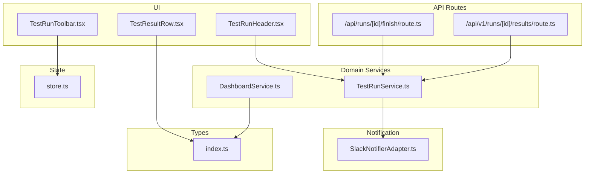

**Diagram sources**
- [TestRunHeader.tsx:1-139](file://src/ui/test-run/TestRunHeader.tsx#L1-L139)
- [TestRunToolbar.tsx:1-70](file://src/ui/test-run/TestRunToolbar.tsx#L1-L70)
- [TestResultRow.tsx:1-63](file://src/ui/test-run/TestResultRow.tsx#L1-L63)
- [TestRunService.ts:1-125](file://src/domain/services/TestRunService.ts#L1-L125)
- [DashboardService.ts:1-182](file://src/domain/services/DashboardService.ts#L1-L182)
- [route.ts:1-15](file://app/api/runs/[id]/finish/route.ts#L1-L15)
- [route.ts:1-59](file://app/api/v1/runs/[id]/results/route.ts#L1-L59)
- [SlackNotifierAdapter.ts:1-56](file://src/adapters/notifier/SlackNotifierAdapter.ts#L1-L56)
- [store.ts:1-46](file://src/infrastructure/state/store.ts#L1-L46)
- [index.ts:1-196](file://src/domain/types/index.ts#L1-L196)

**Section sources**
- [TestRunHeader.tsx:1-139](file://src/ui/test-run/TestRunHeader.tsx#L1-L139)
- [TestRunToolbar.tsx:1-70](file://src/ui/test-run/TestRunToolbar.tsx#L1-L70)
- [TestResultRow.tsx:1-63](file://src/ui/test-run/TestResultRow.tsx#L1-L63)
- [TestRunService.ts:1-125](file://src/domain/services/TestRunService.ts#L1-L125)
- [DashboardService.ts:1-182](file://src/domain/services/DashboardService.ts#L1-L182)
- [route.ts:1-15](file://app/api/runs/[id]/finish/route.ts#L1-L15)
- [route.ts:1-59](file://app/api/v1/runs/[id]/results/route.ts#L1-L59)
- [SlackNotifierAdapter.ts:1-56](file://src/adapters/notifier/SlackNotifierAdapter.ts#L1-L56)
- [store.ts:1-46](file://src/infrastructure/state/store.ts#L1-L46)
- [index.ts:1-196](file://src/domain/types/index.ts#L1-L196)

## Core Components
- TestRunHeader: Renders a progress bar and counts for PASSED, FAILED, BLOCKED, UNTESTED, and computes percentages from stats
- TestRunToolbar: Provides search, status filter, priority filter, and mass status update actions for selected results
- TestResultRow: Visualizes individual result status with icons and priority badges
- TestRunService.finishRun: Computes totals and severity, triggers notifications, and dispatches completion webhooks
- DashboardService: Aggregates historical pass rates, module-level stats, and health scores for analytics
- API finish route: Exposes a POST endpoint to finalize a run and trigger completion processing
- API results route: Accepts bulk result updates from external test runners
- SlackNotifierAdapter: Sends completion notifications to Slack when configured
- Zustand store: Centralizes UI filters and selection state for test run pages
- Types: Defines TestStatus, RunStats, and other analytics-related structures

**Section sources**
- [TestRunHeader.tsx:6-15](file://src/ui/test-run/TestRunHeader.tsx#L6-L15)
- [TestRunToolbar.tsx:5-7](file://src/ui/test-run/TestRunToolbar.tsx#L5-L7)
- [TestResultRow.tsx:5-10](file://src/ui/test-run/TestResultRow.tsx#L5-L10)
- [TestRunService.ts:86-123](file://src/domain/services/TestRunService.ts#L86-L123)
- [DashboardService.ts:17-147](file://src/domain/services/DashboardService.ts#L17-L147)
- [route.ts:7-14](file://app/api/runs/[id]/finish/route.ts#L7-L14)
- [route.ts:12-58](file://app/api/v1/runs/[id]/results/route.ts#L12-L58)
- [SlackNotifierAdapter.ts:9-54](file://src/adapters/notifier/SlackNotifierAdapter.ts#L9-L54)
- [store.ts:6-20](file://src/infrastructure/state/store.ts#L6-L20)
- [index.ts:3-96](file://src/domain/types/index.ts#L3-L96)

## Architecture Overview
The system integrates UI components, domain services, API routes, and notification adapters to provide real-time progress monitoring and analytics.

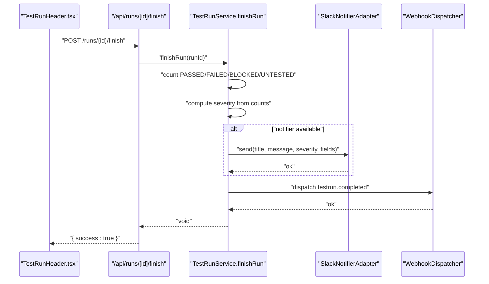

**Diagram sources**
- [TestRunHeader.tsx:104-113](file://src/ui/test-run/TestRunHeader.tsx#L104-L113)
- [route.ts:7-14](file://app/api/runs/[id]/finish/route.ts#L7-L14)
- [TestRunService.ts:86-123](file://src/domain/services/TestRunService.ts#L86-L123)
- [SlackNotifierAdapter.ts:9-54](file://src/adapters/notifier/SlackNotifierAdapter.ts#L9-L54)

## Detailed Component Analysis

### TestRunHeader: Visual Progress Display
- Props include run metadata and stats with counts for PASSED, FAILED, BLOCKED, UNTESTED, and total
- Calculates percentage widths for progress segments using a safe division to avoid NaN
- Renders a horizontal progress bar segmented by status colors and a legend below
- Provides Finish Run action that triggers the completion workflow and optional Slack notifications

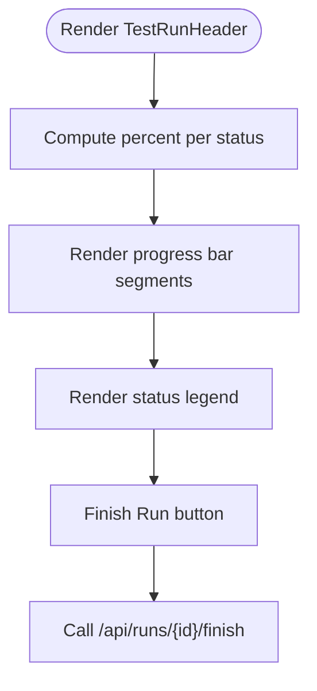

**Diagram sources**
- [TestRunHeader.tsx:22-129](file://src/ui/test-run/TestRunHeader.tsx#L22-L129)

**Section sources**
- [TestRunHeader.tsx:6-15](file://src/ui/test-run/TestRunHeader.tsx#L6-L15)
- [TestRunHeader.tsx:22-129](file://src/ui/test-run/TestRunHeader.tsx#L22-L129)

### TestRunToolbar: Filtering and Mass Updates
- Maintains search query, status filter, and priority filter in Zustand store
- Displays selected count and mass-update buttons for quick PASS/FAIL/BLOCK status changes
- Integrates with the store to manage selection state and UI filters

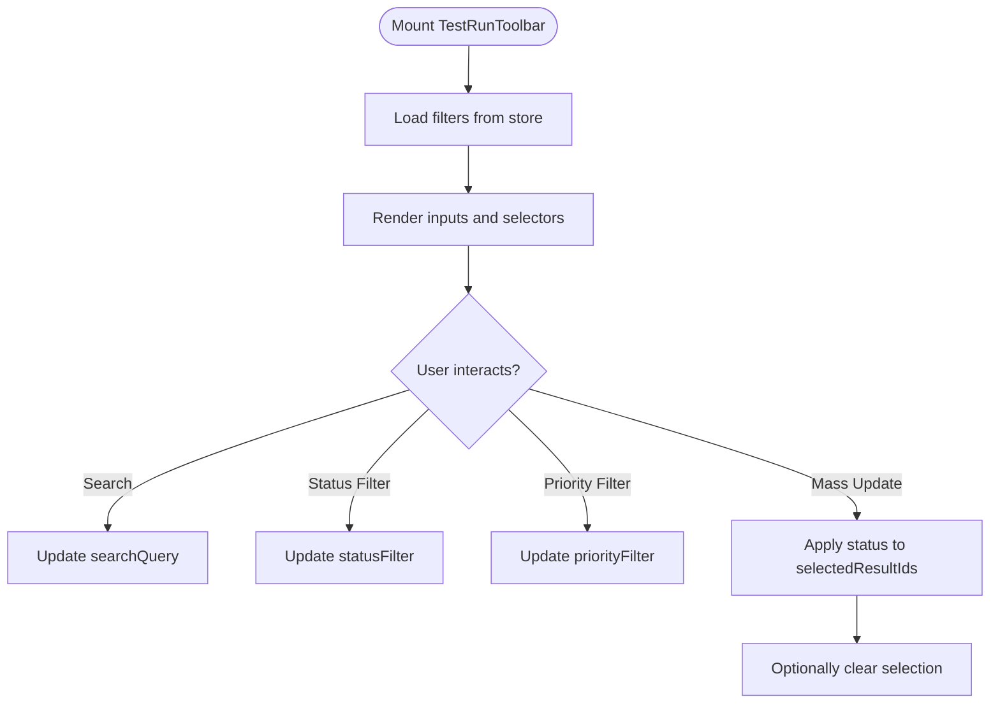

**Diagram sources**
- [TestRunToolbar.tsx:9-67](file://src/ui/test-run/TestRunToolbar.tsx#L9-L67)
- [store.ts:22-45](file://src/infrastructure/state/store.ts#L22-L45)

**Section sources**
- [TestRunToolbar.tsx:5-7](file://src/ui/test-run/TestRunToolbar.tsx#L5-L7)
- [store.ts:6-20](file://src/infrastructure/state/store.ts#L6-L20)

### TestResultRow: Individual Result Visualization
- Uses STATUS_CONFIG to map status to color, background, icon, and label
- Displays testId, title, and priority badge with distinct styles per priority level
- Supports selection and click interactions for row-level actions

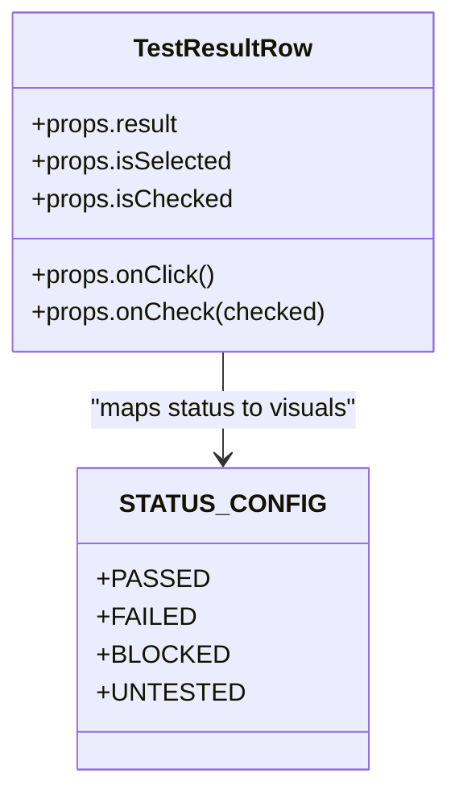

**Diagram sources**
- [TestResultRow.tsx:5-10](file://src/ui/test-run/TestResultRow.tsx#L5-L10)
- [TestResultRow.tsx:20-61](file://src/ui/test-run/TestResultRow.tsx#L20-L61)

**Section sources**
- [TestResultRow.tsx:5-10](file://src/ui/test-run/TestResultRow.tsx#L5-L10)
- [TestResultRow.tsx:20-61](file://src/ui/test-run/TestResultRow.tsx#L20-L61)

### TestRunService.finishRun: Completion Processing
- Iterates over run.testResults to compute totals and counts per status
- Determines severity:
  - error if any FAILED or BLOCKED
  - success if no FAILED/BLOCKED and no UNTESTED
  - warning otherwise (presence of UNTESTED)
- Sends a notification if notifier.isAvailable() is true
- Dispatches a testrun.completed webhook with stats payload

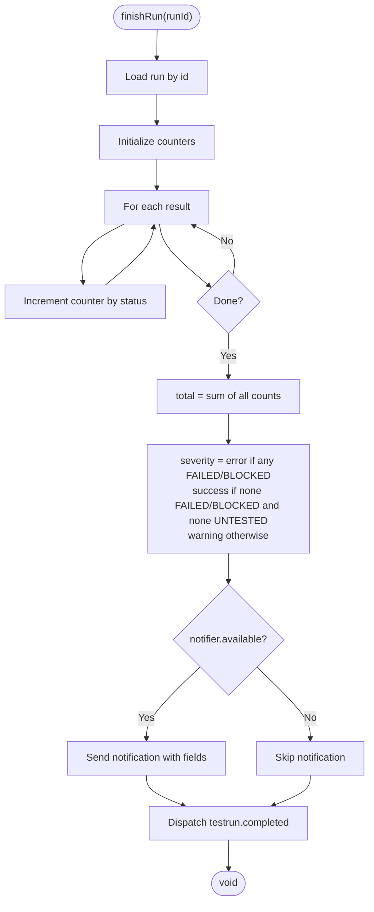

**Diagram sources**
- [TestRunService.ts:86-123](file://src/domain/services/TestRunService.ts#L86-L123)

**Section sources**
- [TestRunService.ts:86-123](file://src/domain/services/TestRunService.ts#L86-L123)

### API Finish Endpoint: Triggering Completion
- Exposes POST /api/runs/[id]/finish
- Calls testRunService.finishRun and returns success JSON

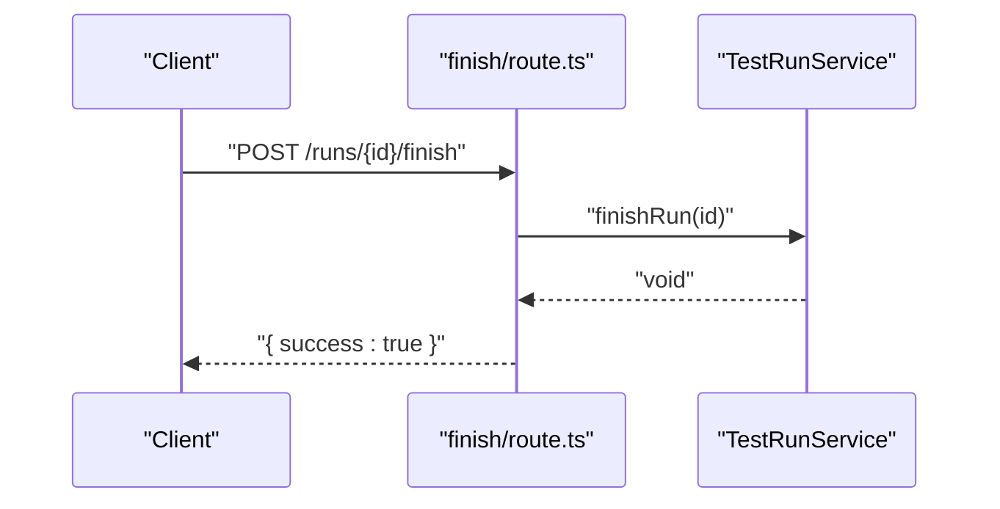

**Diagram sources**
- [route.ts:7-14](file://app/api/runs/[id]/finish/route.ts#L7-L14)
- [TestRunService.ts:86-123](file://src/domain/services/TestRunService.ts#L86-L123)

**Section sources**
- [route.ts:1-15](file://app/api/runs/[id]/finish/route.ts#L1-L15)

### API Bulk Results Endpoint: Real-Time Updates
- Accepts PUT /api/v1/runs/:id/results with an array of { testId, status, notes? }
- Validates payload and iterates results to update matched test results
- Tracks success/failure counts and returns summary with optional errors

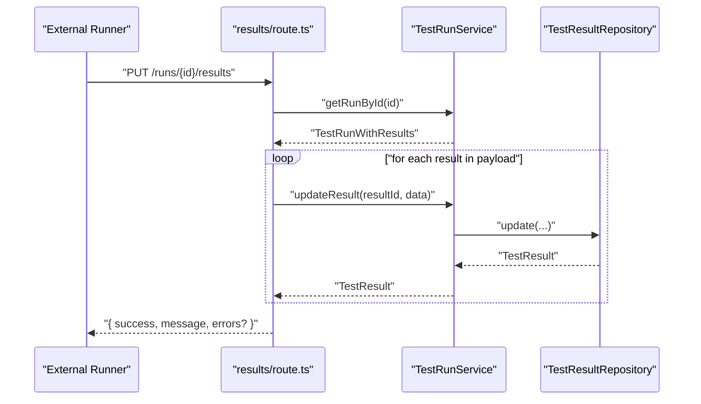

**Diagram sources**
- [route.ts:12-58](file://app/api/v1/runs/[id]/results/route.ts#L12-L58)
- [TestRunService.ts:65-72](file://src/domain/services/TestRunService.ts#L65-L72)

**Section sources**
- [route.ts:7-59](file://app/api/v1/runs/[id]/results/route.ts#L7-L59)

### Notification Integration: SlackNotifierAdapter
- Checks availability by verifying integration settings
- Sends a structured message with severity-based color and fields
- Handles network errors and logs failures

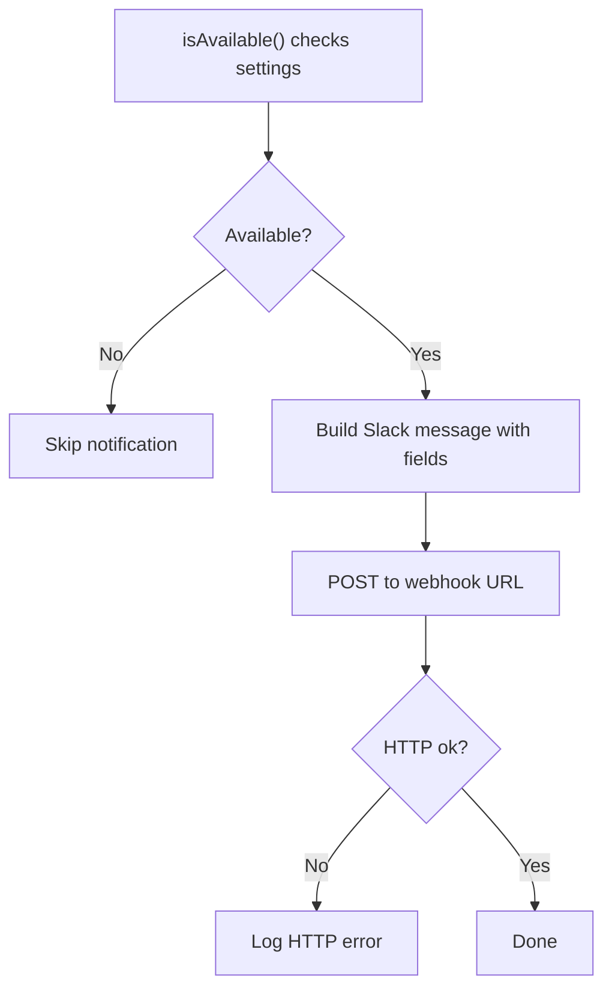

**Diagram sources**
- [SlackNotifierAdapter.ts:9-54](file://src/adapters/notifier/SlackNotifierAdapter.ts#L9-L54)

**Section sources**
- [SlackNotifierAdapter.ts:9-54](file://src/adapters/notifier/SlackNotifierAdapter.ts#L9-L54)

### Analytics and Severity Scoring
- DashboardService aggregates:
  - Latest run status breakdown
  - Historical pass rates
  - Module-level pass rates
  - Health score using weighted components (pass rate, flaky penalty, freshness, coverage)
- Severity scoring in TestRunService.finishRun:
  - error if any FAILED or BLOCKED
  - success if no FAILED/BLOCKED and no UNTESTED
  - warning otherwise

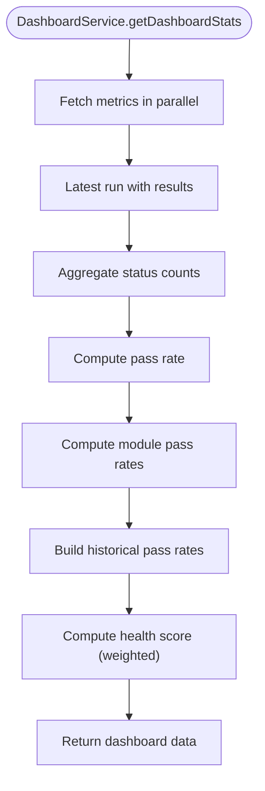

**Diagram sources**
- [DashboardService.ts:17-147](file://src/domain/services/DashboardService.ts#L17-L147)

**Section sources**
- [DashboardService.ts:17-147](file://src/domain/services/DashboardService.ts#L17-L147)
- [TestRunService.ts:89-99](file://src/domain/services/TestRunService.ts#L89-L99)

## Dependency Analysis
- UI components depend on domain types and state stores
- TestRunService depends on repositories, notifier, and webhook dispatcher
- API routes depend on the service layer and shared error handling wrappers
- Notification adapter depends on integration settings service
- DashboardService depends on repositories and aggregates analytics

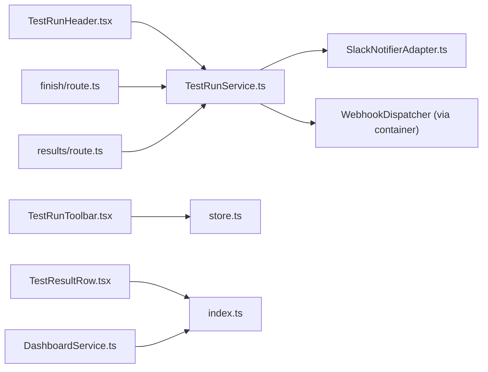

**Diagram sources**
- [TestRunHeader.tsx:1-139](file://src/ui/test-run/TestRunHeader.tsx#L1-L139)
- [TestRunToolbar.tsx:1-70](file://src/ui/test-run/TestRunToolbar.tsx#L1-L70)
- [TestResultRow.tsx:1-63](file://src/ui/test-run/TestResultRow.tsx#L1-L63)
- [TestRunService.ts:1-125](file://src/domain/services/TestRunService.ts#L1-L125)
- [DashboardService.ts:1-182](file://src/domain/services/DashboardService.ts#L1-L182)
- [route.ts:1-15](file://app/api/runs/[id]/finish/route.ts#L1-L15)
- [route.ts:1-59](file://app/api/v1/runs/[id]/results/route.ts#L1-L59)
- [SlackNotifierAdapter.ts:1-56](file://src/adapters/notifier/SlackNotifierAdapter.ts#L1-L56)
- [store.ts:1-46](file://src/infrastructure/state/store.ts#L1-L46)
- [index.ts:1-196](file://src/domain/types/index.ts#L1-L196)

**Section sources**
- [TestRunService.ts:1-21](file://src/domain/services/TestRunService.ts#L1-L21)
- [SlackNotifierAdapter.ts:1-7](file://src/adapters/notifier/SlackNotifierAdapter.ts#L1-L7)
- [DashboardService.ts:1-15](file://src/domain/services/DashboardService.ts#L1-L15)

## Performance Considerations
- Bulk result updates: The results endpoint processes arrays of updates and tracks success/failure counts, minimizing round trips from external runners
- Parallel data fetching: DashboardService fetches multiple metrics concurrently to reduce latency
- Safe progress calculations: TestRunHeader avoids division by zero by using a fallback denominator
- Asynchronous event handling: EventBus emits handlers asynchronously to prevent blocking domain logic
- UI state management: Zustand store centralizes filters and selections to avoid unnecessary re-renders

Recommendations:
- For very large suites, consider pagination or virtualization in the test run UI
- Batch external updates to reduce API load
- Cache recent analytics where appropriate to minimize repeated computations

**Section sources**
- [route.ts:30-57](file://app/api/v1/runs/[id]/results/route.ts#L30-L57)
- [DashboardService.ts:31-43](file://src/domain/services/DashboardService.ts#L31-L43)
- [TestRunHeader.tsx:22-22](file://src/ui/test-run/TestRunHeader.tsx#L22-L22)
- [event-bus.ts:12-30](file://src/infrastructure/event-bus.ts#L12-L30)
- [store.ts:22-45](file://src/infrastructure/state/store.ts#L22-L45)

## Troubleshooting Guide
- Finish run does nothing:
  - Verify the Finish Run button triggers the API endpoint and that the service method executes
  - Check that notifier.isAvailable() returns true when expecting notifications
- Notifications not sent:
  - Confirm Slack webhook is configured; the adapter logs missing configuration and HTTP errors
- Bulk updates fail:
  - Ensure payload contains an array of results with matching testId values present in the run
  - Review returned errors for missing testId entries or update failures
- Progress bar shows unexpected percentages:
  - Ensure stats.total is greater than zero before computing percentages
  - Validate that run.testResults are loaded and populated

**Section sources**
- [TestRunHeader.tsx:104-113](file://src/ui/test-run/TestRunHeader.tsx#L104-L113)
- [TestRunService.ts:101-113](file://src/domain/services/TestRunService.ts#L101-L113)
- [SlackNotifierAdapter.ts:18-53](file://src/adapters/notifier/SlackNotifierAdapter.ts#L18-L53)
- [route.ts:20-50](file://app/api/v1/runs/[id]/results/route.ts#L20-L50)

## Conclusion
The system provides robust progress monitoring and analytics for test execution:
- Real-time progress is visualized via TestRunHeader and TestRunToolbar
- Completion processing computes totals and severity, triggers notifications, and dispatches webhooks
- Bulk result updates enable seamless integration with external test runners
- Analytics services aggregate historical trends and health metrics for informed decision-making
- Performance strategies and asynchronous event handling support scalability for large test suites