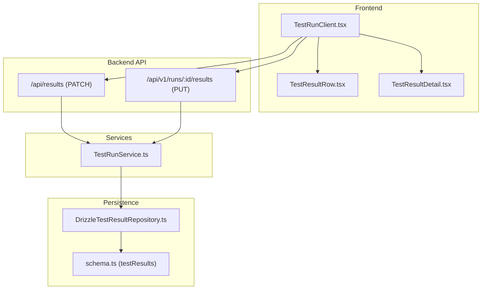
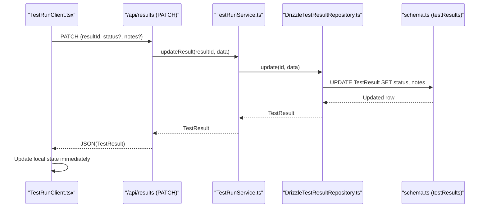
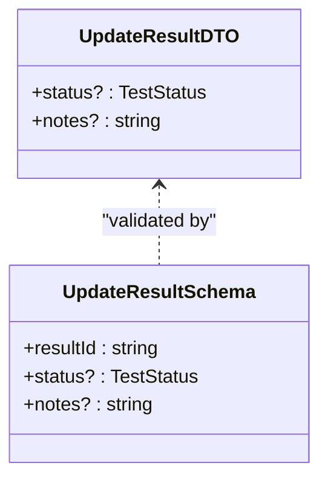
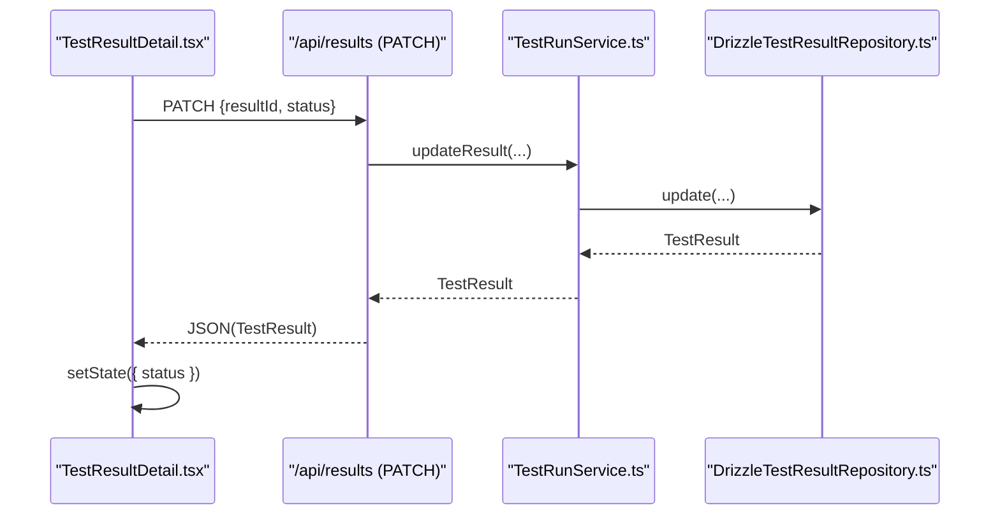
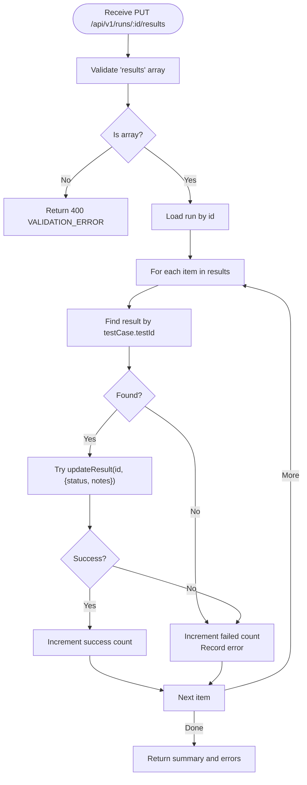
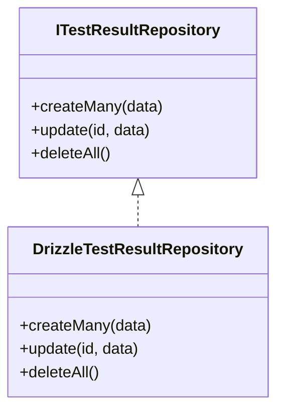
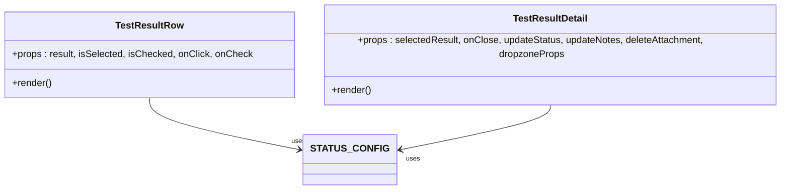
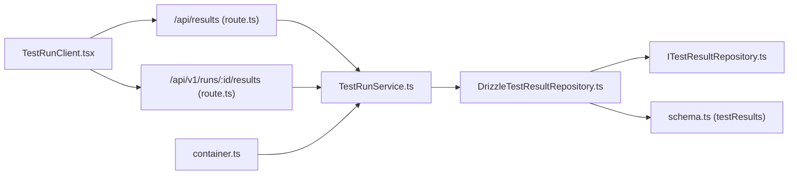

# Result Tracking and Status Management

<cite>
**Referenced Files in This Document**
- [route.ts](file://app/api/results/route.ts)
- [route.ts](file://app/api/v1/runs/[id]/results/route.ts)
- [schemas.ts](file://app/api/_lib/schemas.ts)
- [DrizzleTestResultRepository.ts](file://src/adapters/persistence/drizzle/DrizzleTestResultRepository.ts)
- [ITestResultRepository.ts](file://src/domain/ports/repositories/ITestResultRepository.ts)
- [TestRunService.ts](file://src/domain/services/TestRunService.ts)
- [index.ts](file://src/domain/types/index.ts)
- [schema.ts](file://src/infrastructure/db/schema.ts)
- [container.ts](file://src/infrastructure/container.ts)
- [TestResultRow.tsx](file://src/ui/test-run/TestResultRow.tsx)
- [TestResultDetail.tsx](file://src/ui/test-run/TestResultDetail.tsx)
- [TestRunClient.tsx](file://app/runs/[id]/TestRunClient.tsx)
- [DomainErrors.ts](file://src/domain/errors/DomainErrors.ts)
</cite>

## Table of Contents
1. [Introduction](#introduction)
2. [Project Structure](#project-structure)
3. [Core Components](#core-components)
4. [Architecture Overview](#architecture-overview)
5. [Detailed Component Analysis](#detailed-component-analysis)
6. [Dependency Analysis](#dependency-analysis)
7. [Performance Considerations](#performance-considerations)
8. [Troubleshooting Guide](#troubleshooting-guide)
9. [Conclusion](#conclusion)

## Introduction
This document explains how result tracking and status management work during test executions. It covers the four status types (PASSED, FAILED, BLOCKED, UNTESTED), the UpdateResultDTO structure, result update mechanisms, real-time status changes, the TestResultRepository implementation, UI components for result display and editing, and the integration between backend services and frontend interfaces. It also includes practical examples, validation rules, error scenarios, and considerations for concurrent updates.

## Project Structure
The result tracking system spans three layers:
- Backend API routes that accept updates and bulk updates
- Domain services that orchestrate updates and dispatch notifications
- Persistence layer that stores results and enforces uniqueness
- Frontend components that render statuses and trigger updates

**Diagram sources**
- [TestRunClient.tsx:1-260](file://app/runs/[id]/TestRunClient.tsx#L1-L260)
- [TestResultRow.tsx:1-63](file://src/ui/test-run/TestResultRow.tsx#L1-L63)
- [TestResultDetail.tsx:1-154](file://src/ui/test-run/TestResultDetail.tsx#L1-L154)
- [route.ts:1-18](file://app/api/results/route.ts#L1-L18)
- [route.ts:1-59](file://app/api/v1/runs/[id]/results/route.ts#L1-L59)
- [TestRunService.ts:1-125](file://src/domain/services/TestRunService.ts#L1-L125)
- [DrizzleTestResultRepository.ts:1-36](file://src/adapters/persistence/drizzle/DrizzleTestResultRepository.ts#L1-L36)
- [schema.ts:42-51](file://src/infrastructure/db/schema.ts#L42-L51)

**Section sources**
- [TestRunClient.tsx:1-260](file://app/runs/[id]/TestRunClient.tsx#L1-L260)
- [route.ts:1-18](file://app/api/results/route.ts#L1-L18)
- [route.ts:1-59](file://app/api/v1/runs/[id]/results/route.ts#L1-L59)
- [TestRunService.ts:1-125](file://src/domain/services/TestRunService.ts#L1-L125)
- [DrizzleTestResultRepository.ts:1-36](file://src/adapters/persistence/drizzle/DrizzleTestResultRepository.ts#L1-L36)
- [schema.ts:42-51](file://src/infrastructure/db/schema.ts#L42-L51)

## Core Components
- Status types: The domain defines four statuses used across the system.
- UpdateResultDTO: A typed DTO for partial updates to results.
- API routes: Single-result updates and bulk updates for automated runners.
- Service orchestration: Validates inputs, updates results, and dispatches notifications.
- Persistence: Repository persists updates and ensures uniqueness constraints.
- UI components: Render status badges, allow inline status changes, and manage notes.

**Section sources**
- [index.ts:3](file://src/domain/types/index.ts#L3)
- [index.ts:77-80](file://src/domain/types/index.ts#L77-L80)
- [route.ts:1-18](file://app/api/results/route.ts#L1-L18)
- [route.ts:1-59](file://app/api/v1/runs/[id]/results/route.ts#L1-L59)
- [TestRunService.ts:65-72](file://src/domain/services/TestRunService.ts#L65-L72)
- [DrizzleTestResultRepository.ts:16-30](file://src/adapters/persistence/drizzle/DrizzleTestResultRepository.ts#L16-L30)
- [TestResultRow.tsx:5-10](file://src/ui/test-run/TestResultRow.tsx#L5-L10)
- [TestResultDetail.tsx:47-65](file://src/ui/test-run/TestResultDetail.tsx#L47-L65)

## Architecture Overview
The system follows a layered architecture:
- UI triggers updates via HTTP requests
- API routes parse and validate payloads
- Services update domain entities and publish events
- Repository persists changes to the database
- Frontend reflects real-time updates

**Diagram sources**
- [TestRunClient.tsx:110-127](file://app/runs/[id]/TestRunClient.tsx#L110-L127)
- [route.ts:8-18](file://app/api/results/route.ts#L8-L18)
- [TestRunService.ts:65-72](file://src/domain/services/TestRunService.ts#L65-L72)
- [DrizzleTestResultRepository.ts:16-30](file://src/adapters/persistence/drizzle/DrizzleTestResultRepository.ts#L16-L30)
- [schema.ts:42-51](file://src/infrastructure/db/schema.ts#L42-L51)

## Detailed Component Analysis

### Status Types and Business Meaning
- PASSED: The test executed and met expectations.
- FAILED: The test executed but did not meet expectations.
- BLOCKED: The test could not run due to external blockers (e.g., environment, dependencies).
- UNTESTED: The test case exists but has not yet been executed.

These statuses are defined as a union type and used consistently across DTOs, UI, and persistence.

**Section sources**
- [index.ts:3](file://src/domain/types/index.ts#L3)
- [TestResultRow.tsx:5-10](file://src/ui/test-run/TestResultRow.tsx#L5-L10)
- [DrizzleTestResultRepository.ts:12](file://src/adapters/persistence/drizzle/DrizzleTestResultRepository.ts#L12)
- [schema.ts:44](file://src/infrastructure/db/schema.ts#L44)

### UpdateResultDTO and Validation
- Structure: Optional status and optional notes.
- Validation: API routes validate payloads using Zod schemas; PATCH supports partial updates; PUT validates bulk payloads and matches results by testId.

**Diagram sources**
- [index.ts:77-80](file://src/domain/types/index.ts#L77-L80)
- [schemas.ts:23-27](file://app/api/_lib/schemas.ts#L23-L27)

**Section sources**
- [index.ts:77-80](file://src/domain/types/index.ts#L77-L80)
- [schemas.ts:23-27](file://app/api/_lib/schemas.ts#L23-L27)
- [route.ts:8-18](file://app/api/results/route.ts#L8-L18)
- [route.ts:33-50](file://app/api/v1/runs/[id]/results/route.ts#L33-L50)

### Real-Time Status Changes and UI Integration
- Single updates: Frontend sends PATCH requests and immediately updates local state to reflect the change.
- Bulk updates: Automated runners send PUT requests with an array of results; the API updates each matching result by testId.
- UI rendering: Status badges and labels are rendered based on current status; clicking buttons triggers updates.

**Diagram sources**
- [TestResultDetail.tsx:54](file://src/ui/test-run/TestResultDetail.tsx#L54)
- [route.ts:8-18](file://app/api/results/route.ts#L8-L18)
- [TestRunService.ts:65-72](file://src/domain/services/TestRunService.ts#L65-L72)
- [DrizzleTestResultRepository.ts:16-30](file://src/adapters/persistence/drizzle/DrizzleTestResultRepository.ts#L16-L30)

**Section sources**
- [TestResultDetail.tsx:47-65](file://src/ui/test-run/TestResultDetail.tsx#L47-L65)
- [TestRunClient.tsx:110-127](file://app/runs/[id]/TestRunClient.tsx#L110-L127)
- [TestResultRow.tsx:20-42](file://src/ui/test-run/TestResultRow.tsx#L20-L42)

### Bulk Result Updates for Automated Runners
- Endpoint: PUT /api/v1/runs/:id/results
- Behavior: Validates payload, finds matching results by testId, updates each, and returns aggregated results with any errors.
- Use case: CI/CD pipelines feeding structured results from automated test execution.

**Diagram sources**
- [route.ts:12-58](file://app/api/v1/runs/[id]/results/route.ts#L12-L58)
- [TestRunService.ts:27-31](file://src/domain/services/TestRunService.ts#L27-L31)
- [TestRunService.ts:65-72](file://src/domain/services/TestRunService.ts#L65-L72)

**Section sources**
- [route.ts:12-58](file://app/api/v1/runs/[id]/results/route.ts#L12-L58)

### TestResultRepository Implementation
- Initialization: Creates results with default UNTESTED status when a run is created.
- Update: Applies only provided fields (partial updates) and returns the updated entity.
- Constraints: Unique index on (testRunId, testCaseId) prevents duplicates.

**Diagram sources**
- [ITestResultRepository.ts:3-7](file://src/domain/ports/repositories/ITestResultRepository.ts#L3-L7)
- [DrizzleTestResultRepository.ts:7-35](file://src/adapters/persistence/drizzle/DrizzleTestResultRepository.ts#L7-L35)

**Section sources**
- [DrizzleTestResultRepository.ts:8-14](file://src/adapters/persistence/drizzle/DrizzleTestResultRepository.ts#L8-L14)
- [DrizzleTestResultRepository.ts:16-30](file://src/adapters/persistence/drizzle/DrizzleTestResultRepository.ts#L16-L30)
- [schema.ts:49-51](file://src/infrastructure/db/schema.ts#L49-L51)

### UI Components for Result Display and Editing
- TestResultRow: Renders status badge and priority, supports selection and checkbox toggling.
- TestResultDetail: Provides status buttons, steps, expected result, notes editor, and attachments management.

**Diagram sources**
- [TestResultRow.tsx:20-62](file://src/ui/test-run/TestResultRow.tsx#L20-L62)
- [TestResultDetail.tsx:19-153](file://src/ui/test-run/TestResultDetail.tsx#L19-L153)

**Section sources**
- [TestResultRow.tsx:5-10](file://src/ui/test-run/TestResultRow.tsx#L5-L10)
- [TestResultRow.tsx:20-62](file://src/ui/test-run/TestResultRow.tsx#L20-L62)
- [TestResultDetail.tsx:47-90](file://src/ui/test-run/TestResultDetail.tsx#L47-L90)

### Integration Between Backend and Frontend
- Frontend uses TestRunClient to:
  - Send PATCH for single updates
  - Send PUT for bulk updates
  - Update local state immediately after successful responses
- Backend services:
  - Validate and update results
  - Dispatch notifications and webhooks on updates

**Section sources**
- [TestRunClient.tsx:25-48](file://app/runs/[id]/TestRunClient.tsx#L25-L48)
- [TestRunClient.tsx:110-146](file://app/runs/[id]/TestRunClient.tsx#L110-L146)
- [TestRunService.ts:65-72](file://src/domain/services/TestRunService.ts#L65-L72)

## Dependency Analysis
- API routes depend on the container-provided TestRunService.
- TestRunService depends on repositories and dispatchers.
- DrizzleTestResultRepository depends on the database schema and implements ITestResultRepository.
- Frontend components depend on domain types and UI helpers.

**Diagram sources**
- [route.ts:1-18](file://app/api/results/route.ts#L1-L18)
- [route.ts:1-59](file://app/api/v1/runs/[id]/results/route.ts#L1-L59)
- [TestRunService.ts:14-21](file://src/domain/services/TestRunService.ts#L14-L21)
- [DrizzleTestResultRepository.ts:4](file://src/adapters/persistence/drizzle/DrizzleTestResultRepository.ts#L4)
- [ITestResultRepository.ts:3-7](file://src/domain/ports/repositories/ITestResultRepository.ts#L3-L7)
- [schema.ts:42-51](file://src/infrastructure/db/schema.ts#L42-L51)
- [container.ts:56](file://src/infrastructure/container.ts#L56)

**Section sources**
- [container.ts:56](file://src/infrastructure/container.ts#L56)
- [TestRunService.ts:14-21](file://src/domain/services/TestRunService.ts#L14-L21)
- [DrizzleTestResultRepository.ts:4](file://src/adapters/persistence/drizzle/DrizzleTestResultRepository.ts#L4)

## Performance Considerations
- Single vs bulk updates: Prefer bulk updates for automated runners to reduce network overhead.
- Frontend optimistic updates: Apply UI changes immediately after requests to improve perceived performance; fall back gracefully on errors.
- Concurrency: The repository performs atomic updates per record. There is no explicit application-level concurrency control for simultaneous updates to the same result; conflicts are mitigated by the database’s unique constraint on (runId, testCaseId) and by the API’s lookup by testId for bulk updates.

[No sources needed since this section provides general guidance]

## Troubleshooting Guide
Common issues and resolutions:
- Validation errors on single updates:
  - Ensure resultId is present and status is one of the allowed values.
  - Notes are optional; omitting them avoids accidental clearing.
- Bulk update failures:
  - Verify results is an array.
  - Confirm each item.testId corresponds to a testCase in the run.
  - Review returned errors for specific testId mismatches.
- Not found errors:
  - The service throws a domain error when fetching a run by id; ensure the run exists.
- Status transitions:
  - The system allows moving between PASSED, FAILED, BLOCKED, UNTESTED; ensure the intended transition aligns with test outcomes.
- Real-time updates:
  - If UI does not reflect changes, check network responses and console errors; confirm the frontend applied optimistic updates.

**Section sources**
- [schemas.ts:23-27](file://app/api/_lib/schemas.ts#L23-L27)
- [route.ts:20-25](file://app/api/v1/runs/[id]/results/route.ts#L20-L25)
- [route.ts:33-50](file://app/api/v1/runs/[id]/results/route.ts#L33-L50)
- [TestRunService.ts:27-31](file://src/domain/services/TestRunService.ts#L27-L31)
- [DomainErrors.ts:18-26](file://src/domain/errors/DomainErrors.ts#L18-L26)

## Conclusion
The result tracking system provides a robust, typed foundation for managing test execution outcomes. It supports both manual and automated updates, enforces validation at the API boundary, persists results with uniqueness guarantees, and offers a responsive UI with immediate feedback. By leveraging the provided DTOs, repository, and services, teams can reliably track status changes, maintain auditability through notifications, and scale updates with bulk operations.