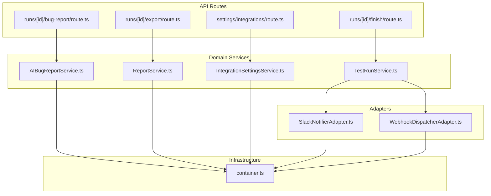
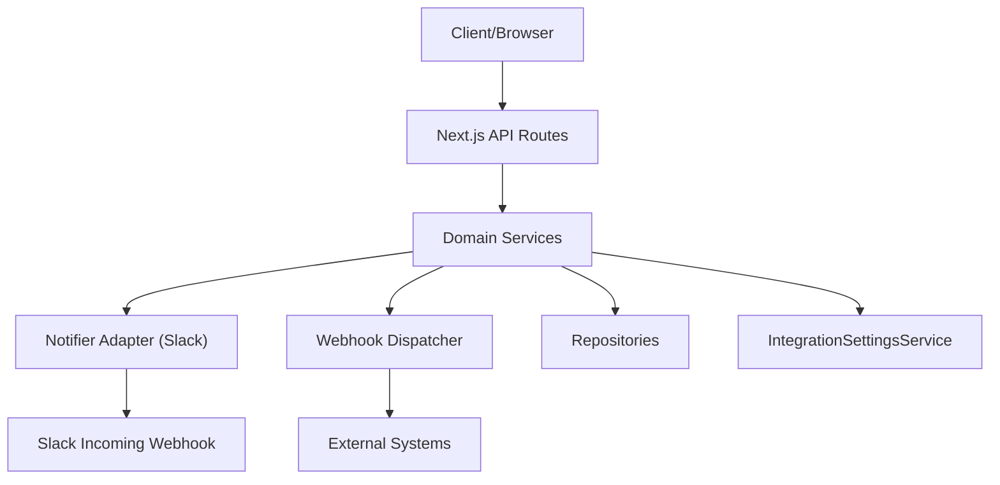
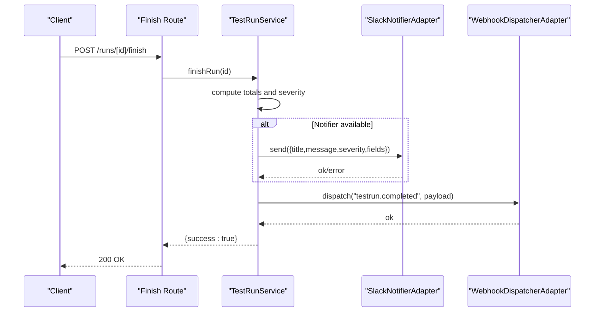
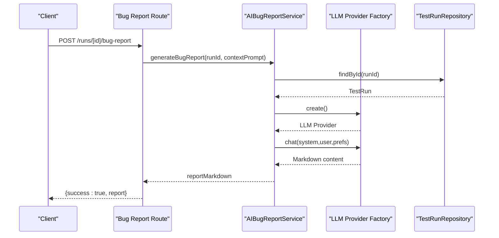
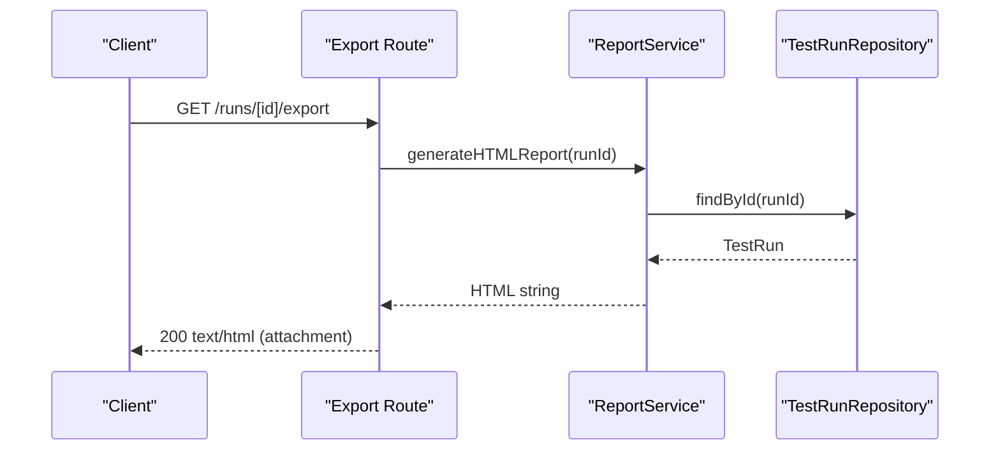
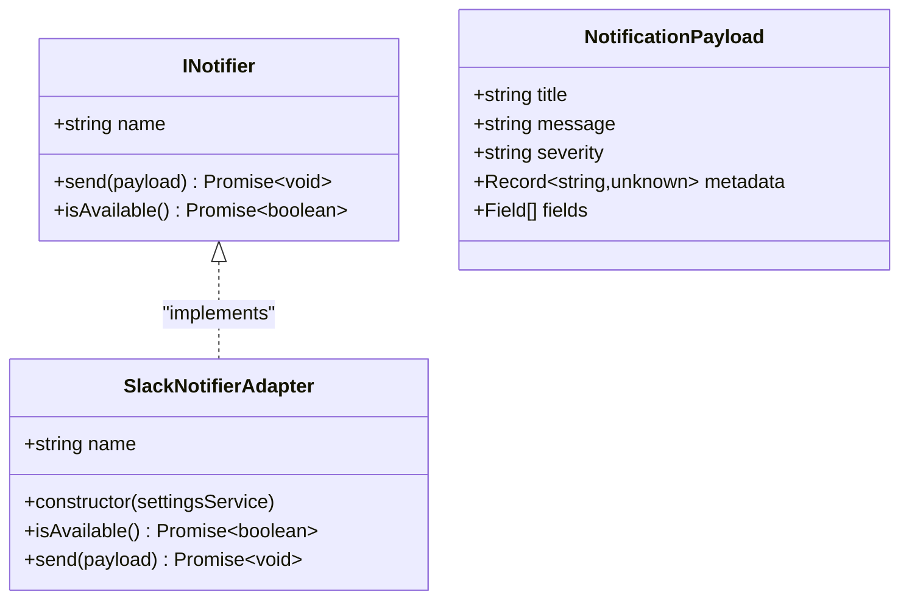
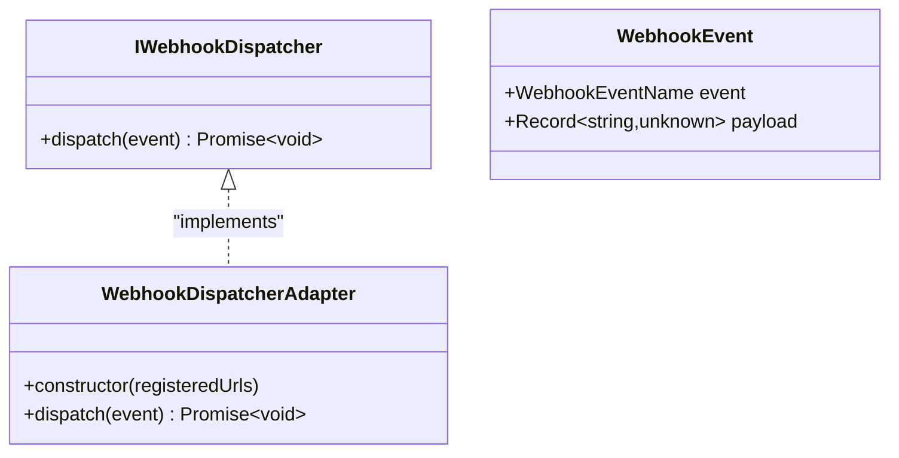
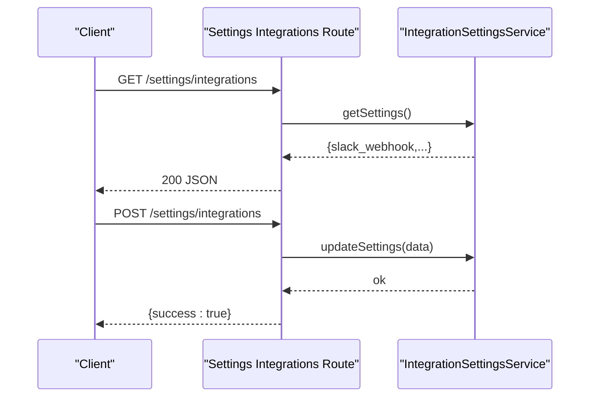
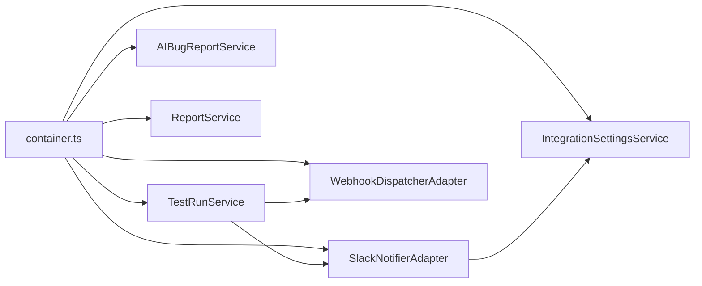

# Run Management and Integration

<cite>
**Referenced Files in This Document**
- [route.ts](file://app/api/runs/[id]/bug-report/route.ts)
- [route.ts](file://app/api/runs/[id]/export/route.ts)
- [route.ts](file://app/api/runs/[id]/finish/route.ts)
- [SlackNotifierAdapter.ts](file://src/adapters/notifier/SlackNotifierAdapter.ts)
- [WebhookDispatcherAdapter.ts](file://src/adapters/webhook/WebhookDispatcherAdapter.ts)
- [INotifier.ts](file://src/domain/ports/INotifier.ts)
- [IWebhookDispatcher.ts](file://src/domain/ports/IWebhookDispatcher.ts)
- [TestRunService.ts](file://src/domain/services/TestRunService.ts)
- [AIBugReportService.ts](file://src/domain/services/AIBugReportService.ts)
- [ReportService.ts](file://src/domain/services/ReportService.ts)
- [IntegrationSettingsService.ts](file://src/domain/services/IntegrationSettingsService.ts)
- [container.ts](file://src/infrastructure/container.ts)
- [schemas.ts](file://app/api/_lib/schemas.ts)
- [route.ts](file://app/api/settings/integrations/route.ts)
- [index.ts](file://src/domain/types/index.ts)
</cite>

## Table of Contents
1. [Introduction](#introduction)
2. [Project Structure](#project-structure)
3. [Core Components](#core-components)
4. [Architecture Overview](#architecture-overview)
5. [Detailed Component Analysis](#detailed-component-analysis)
6. [Dependency Analysis](#dependency-analysis)
7. [Performance Considerations](#performance-considerations)
8. [Security Considerations](#security-considerations)
9. [Troubleshooting Guide](#troubleshooting-guide)
10. [Practical Integration Examples](#practical-integration-examples)
11. [Conclusion](#conclusion)

## Introduction
This document explains how test runs are managed and integrated with external systems. It covers:
- Notification delivery via a notifier interface (Slack adapter)
- Webhook dispatching for external system synchronization
- Bug report generation using AI
- Export of test run results
- Practical configuration examples and security considerations

## Project Structure
The run management and integration features span API routes, domain services, adapters, and configuration. The most relevant areas are:
- API routes under app/api for run operations, bug report generation, export, and settings
- Domain services in src/domain/services for orchestration
- Adapters in src/adapters for external integrations (Slack, webhooks)
- Infrastructure container wiring in src/infrastructure/container.ts
- Type definitions and schemas in src/domain/types and app/api/_lib/schemas.ts

**Diagram sources**
- [route.ts:1-15](file://app/api/runs/[id]/finish/route.ts#L1-L15)
- [route.ts:1-20](file://app/api/runs/[id]/export/route.ts#L1-L20)
- [route.ts:1-19](file://app/api/runs/[id]/bug-report/route.ts#L1-L19)
- [route.ts:1-19](file://app/api/settings/integrations/route.ts#L1-L19)
- [TestRunService.ts:1-125](file://src/domain/services/TestRunService.ts#L1-L125)
- [AIBugReportService.ts:1-70](file://src/domain/services/AIBugReportService.ts#L1-L70)
- [ReportService.ts:1-110](file://src/domain/services/ReportService.ts#L1-L110)
- [IntegrationSettingsService.ts:1-37](file://src/domain/services/IntegrationSettingsService.ts#L1-L37)
- [SlackNotifierAdapter.ts:1-56](file://src/adapters/notifier/SlackNotifierAdapter.ts#L1-L56)
- [WebhookDispatcherAdapter.ts:1-38](file://src/adapters/webhook/WebhookDispatcherAdapter.ts#L1-L38)
- [container.ts:1-126](file://src/infrastructure/container.ts#L1-L126)

**Section sources**
- [route.ts:1-15](file://app/api/runs/[id]/finish/route.ts#L1-L15)
- [route.ts:1-20](file://app/api/runs/[id]/export/route.ts#L1-L20)
- [route.ts:1-19](file://app/api/runs/[id]/bug-report/route.ts#L1-L19)
- [route.ts:1-19](file://app/api/settings/integrations/route.ts#L1-L19)
- [container.ts:1-126](file://src/infrastructure/container.ts#L1-L126)

## Core Components
- TestRunService orchestrates run lifecycle, result updates, and emits webhook events. It integrates with a notifier and a webhook dispatcher.
- SlackNotifierAdapter implements INotifier to deliver run completion notifications to Slack via a webhook URL.
- WebhookDispatcherAdapter implements IWebhookDispatcher to broadcast events to registered URLs.
- AIBugReportService generates Markdown bug reports from failed/blocked test results using an LLM provider.
- ReportService produces HTML reports for test runs.
- IntegrationSettingsService persists and retrieves integration settings (e.g., Slack webhook URL).
- API routes expose endpoints for finishing runs, exporting reports, generating bug reports, and managing integration settings.

**Section sources**
- [TestRunService.ts:1-125](file://src/domain/services/TestRunService.ts#L1-L125)
- [INotifier.ts:1-27](file://src/domain/ports/INotifier.ts#L1-L27)
- [IWebhookDispatcher.ts:1-21](file://src/domain/ports/IWebhookDispatcher.ts#L1-L21)
- [SlackNotifierAdapter.ts:1-56](file://src/adapters/notifier/SlackNotifierAdapter.ts#L1-L56)
- [WebhookDispatcherAdapter.ts:1-38](file://src/adapters/webhook/WebhookDispatcherAdapter.ts#L1-L38)
- [AIBugReportService.ts:1-70](file://src/domain/services/AIBugReportService.ts#L1-L70)
- [ReportService.ts:1-110](file://src/domain/services/ReportService.ts#L1-L110)
- [IntegrationSettingsService.ts:1-37](file://src/domain/services/IntegrationSettingsService.ts#L1-L37)
- [route.ts:1-15](file://app/api/runs/[id]/finish/route.ts#L1-L15)
- [route.ts:1-20](file://app/api/runs/[id]/export/route.ts#L1-L20)
- [route.ts:1-19](file://app/api/runs/[id]/bug-report/route.ts#L1-L19)
- [route.ts:1-19](file://app/api/settings/integrations/route.ts#L1-L19)

## Architecture Overview
The system follows a layered architecture:
- API routes handle HTTP requests and delegate to services.
- Domain services encapsulate business logic and coordinate external integrations.
- Adapters abstract transport details for notifications and webhooks.
- The IoC container wires repositories, adapters, and services.

**Diagram sources**
- [TestRunService.ts:86-123](file://src/domain/services/TestRunService.ts#L86-L123)
- [SlackNotifierAdapter.ts:14-54](file://src/adapters/notifier/SlackNotifierAdapter.ts#L14-L54)
- [WebhookDispatcherAdapter.ts:14-36](file://src/adapters/webhook/WebhookDispatcherAdapter.ts#L14-L36)
- [container.ts:44-61](file://src/infrastructure/container.ts#L44-L61)

## Detailed Component Analysis

### Test Run Completion Workflow (Finish, Notify, Dispatch)
This sequence shows how completing a run triggers notifications and webhooks.

**Diagram sources**
- [route.ts:7-14](file://app/api/runs/[id]/finish/route.ts#L7-L14)
- [TestRunService.ts:86-123](file://src/domain/services/TestRunService.ts#L86-L123)
- [SlackNotifierAdapter.ts:14-54](file://src/adapters/notifier/SlackNotifierAdapter.ts#L14-L54)
- [WebhookDispatcherAdapter.ts:14-36](file://src/adapters/webhook/WebhookDispatcherAdapter.ts#L14-L36)

**Section sources**
- [route.ts:1-15](file://app/api/runs/[id]/finish/route.ts#L1-L15)
- [TestRunService.ts:86-123](file://src/domain/services/TestRunService.ts#L86-L123)

### Bug Report Generation Endpoint
This endpoint generates a Markdown bug report for a given run using an LLM.

**Diagram sources**
- [route.ts:8-18](file://app/api/runs/[id]/bug-report/route.ts#L8-L18)
- [AIBugReportService.ts:16-68](file://src/domain/services/AIBugReportService.ts#L16-L68)
- [container.ts:56-57](file://src/infrastructure/container.ts#L56-L57)

**Section sources**
- [route.ts:1-19](file://app/api/runs/[id]/bug-report/route.ts#L1-L19)
- [AIBugReportService.ts:1-70](file://src/domain/services/AIBugReportService.ts#L1-L70)

### Export Test Run Results
This endpoint returns an HTML report as a downloadable file.

**Diagram sources**
- [route.ts:6-19](file://app/api/runs/[id]/export/route.ts#L6-L19)
- [ReportService.ts:14-83](file://src/domain/services/ReportService.ts#L14-L83)

**Section sources**
- [route.ts:1-20](file://app/api/runs/[id]/export/route.ts#L1-L20)
- [ReportService.ts:1-110](file://src/domain/services/ReportService.ts#L1-L110)

### Notifier Interface and Slack Adapter
The notifier abstraction allows pluggable channels. The Slack adapter checks availability via settings and posts structured messages.

**Diagram sources**
- [INotifier.ts:9-26](file://src/domain/ports/INotifier.ts#L9-L26)
- [SlackNotifierAdapter.ts:4-55](file://src/adapters/notifier/SlackNotifierAdapter.ts#L4-L55)

**Section sources**
- [INotifier.ts:1-27](file://src/domain/ports/INotifier.ts#L1-L27)
- [SlackNotifierAdapter.ts:1-56](file://src/adapters/notifier/SlackNotifierAdapter.ts#L1-L56)

### Webhook Dispatcher Adapter
The webhook dispatcher broadcasts events to configured URLs with standardized headers and payload.

**Diagram sources**
- [IWebhookDispatcher.ts:8-20](file://src/domain/ports/IWebhookDispatcher.ts#L8-L20)
- [WebhookDispatcherAdapter.ts:11-37](file://src/adapters/webhook/WebhookDispatcherAdapter.ts#L11-L37)

**Section sources**
- [IWebhookDispatcher.ts:1-21](file://src/domain/ports/IWebhookDispatcher.ts#L1-L21)
- [WebhookDispatcherAdapter.ts:1-38](file://src/adapters/webhook/WebhookDispatcherAdapter.ts#L1-L38)

### Settings Management for Integrations
Settings are persisted and retrieved by IntegrationSettingsService. The API exposes endpoints to get and update settings.

**Diagram sources**
- [route.ts:8-18](file://app/api/settings/integrations/route.ts#L8-L18)
- [IntegrationSettingsService.ts:11-35](file://src/domain/services/IntegrationSettingsService.ts#L11-L35)

**Section sources**
- [route.ts:1-19](file://app/api/settings/integrations/route.ts#L1-L19)
- [IntegrationSettingsService.ts:1-37](file://src/domain/services/IntegrationSettingsService.ts#L1-L37)
- [schemas.ts:31-41](file://app/api/_lib/schemas.ts#L31-L41)

## Dependency Analysis
The IoC container wires all components. TestRunService depends on repositories, the notifier, and the webhook dispatcher. Adapters depend on IntegrationSettingsService for credentials.

**Diagram sources**
- [container.ts:44-61](file://src/infrastructure/container.ts#L44-L61)
- [TestRunService.ts:14-21](file://src/domain/services/TestRunService.ts#L14-L21)
- [SlackNotifierAdapter.ts:1-7](file://src/adapters/notifier/SlackNotifierAdapter.ts#L1-L7)
- [WebhookDispatcherAdapter.ts:1-12](file://src/adapters/webhook/WebhookDispatcherAdapter.ts#L1-L12)

**Section sources**
- [container.ts:1-126](file://src/infrastructure/container.ts#L1-L126)
- [TestRunService.ts:1-125](file://src/domain/services/TestRunService.ts#L1-L125)

## Performance Considerations
- Webhook dispatching uses concurrent POST requests to multiple endpoints. Consider batching or retry/backoff in production.
- Notification delivery is fire-and-forget; ensure external endpoints are highly available.
- Report generation constructs HTML in memory; large runs may increase memory usage.
- LLM calls are asynchronous; consider rate limits and caching for repeated prompts.

## Security Considerations
- Webhook authentication: The current dispatcher does not sign or authenticate outgoing requests. To secure webhooks:
  - Add HMAC signatures with a shared secret header.
  - Require HTTPS endpoints.
  - Validate event types and payload schemas.
- Notification delivery reliability:
  - Slack webhooks require a valid incoming webhook URL; ensure the URL is kept secret.
  - Implement retries with exponential backoff and dead-letter logging.
- Integration settings:
  - Store secrets securely (e.g., environment variables or encrypted storage).
  - Limit exposure of settings retrieval to authorized users.
- Input validation:
  - API routes validate request bodies using Zod schemas to prevent malformed data.

**Section sources**
- [WebhookDispatcherAdapter.ts:14-36](file://src/adapters/webhook/WebhookDispatcherAdapter.ts#L14-L36)
- [SlackNotifierAdapter.ts:14-54](file://src/adapters/notifier/SlackNotifierAdapter.ts#L14-L54)
- [schemas.ts:31-41](file://app/api/_lib/schemas.ts#L31-L41)

## Troubleshooting Guide
- Slack notifications not sent:
  - Verify the Slack webhook URL is configured in settings.
  - Check console logs for HTTP errors or exceptions during fetch.
- Webhooks not received:
  - Confirm the registered URLs are reachable and accept POST requests.
  - Inspect console logs for fetch errors and ensure event headers are present.
- Bug report generation fails:
  - Ensure an LLM provider is configured and reachable.
  - Confirm the run exists and has failed/blocked results.
- Export returns an error:
  - Verify the run ID exists and the repository can load the run with results.
- Settings not updating:
  - Validate the request payload matches the schema and permissions.

**Section sources**
- [SlackNotifierAdapter.ts:14-54](file://src/adapters/notifier/SlackNotifierAdapter.ts#L14-L54)
- [WebhookDispatcherAdapter.ts:14-36](file://src/adapters/webhook/WebhookDispatcherAdapter.ts#L14-L36)
- [AIBugReportService.ts:16-23](file://src/domain/services/AIBugReportService.ts#L16-L23)
- [ReportService.ts:14-18](file://src/domain/services/ReportService.ts#L14-L18)
- [route.ts:13-18](file://app/api/settings/integrations/route.ts#L13-L18)

## Practical Integration Examples

### Configure Slack Notification Channel
- Set the Slack incoming webhook URL via the settings endpoint.
- The notifier checks availability before sending; ensure the URL is valid.

References:
- [route.ts:13-18](file://app/api/settings/integrations/route.ts#L13-L18)
- [IntegrationSettingsService.ts:11-35](file://src/domain/services/IntegrationSettingsService.ts#L11-L35)
- [SlackNotifierAdapter.ts:9-21](file://src/adapters/notifier/SlackNotifierAdapter.ts#L9-L21)

### Set Up Webhook Endpoints
- Register target URLs in the webhook dispatcher configuration.
- The dispatcher sends events with standardized headers and JSON payload.

References:
- [WebhookDispatcherAdapter.ts:11-36](file://src/adapters/webhook/WebhookDispatcherAdapter.ts#L11-L36)
- [IWebhookDispatcher.ts:1-21](file://src/domain/ports/IWebhookDispatcher.ts#L1-L21)
- [TestRunService.ts:45-48](file://src/domain/services/TestRunService.ts#L45-L48)

### Generate a Bug Report
- Call the bug report endpoint with optional context prompt.
- The service filters failed/blocked results and queries an LLM provider.

References:
- [route.ts:8-18](file://app/api/runs/[id]/bug-report/route.ts#L8-L18)
- [AIBugReportService.ts:16-68](file://src/domain/services/AIBugReportService.ts#L16-L68)

### Export Test Run Results
- Download an HTML report for a run as a file attachment.

References:
- [route.ts:6-19](file://app/api/runs/[id]/export/route.ts#L6-L19)
- [ReportService.ts:14-83](file://src/domain/services/ReportService.ts#L14-L83)

### Complete Run Lifecycle
- Finish a run to trigger notifications and webhook dispatching.

References:
- [route.ts:7-14](file://app/api/runs/[id]/finish/route.ts#L7-L14)
- [TestRunService.ts:86-123](file://src/domain/services/TestRunService.ts#L86-L123)

## Conclusion
The system provides a clean separation between domain logic and external integrations. TestRunService coordinates run completion, notification delivery, and webhook broadcasting. Adapters encapsulate transport concerns, while the IoC container wires everything together. By securing webhooks, validating inputs, and monitoring delivery, teams can reliably automate run completion alerts and synchronize with external tools.