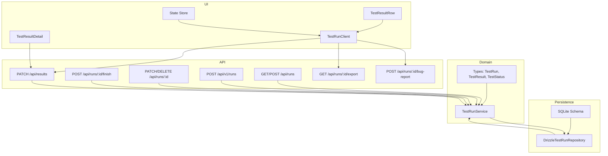
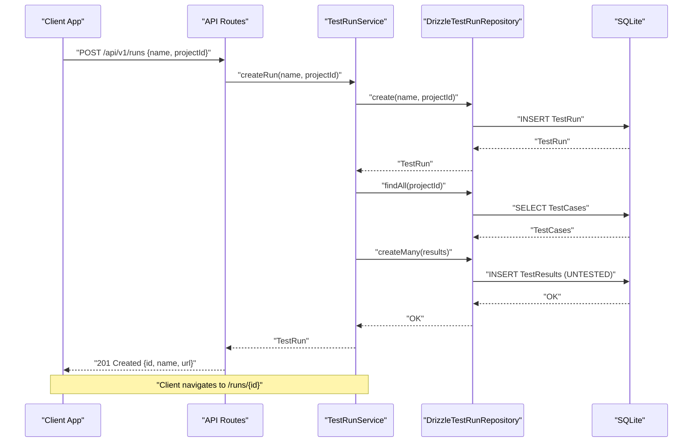
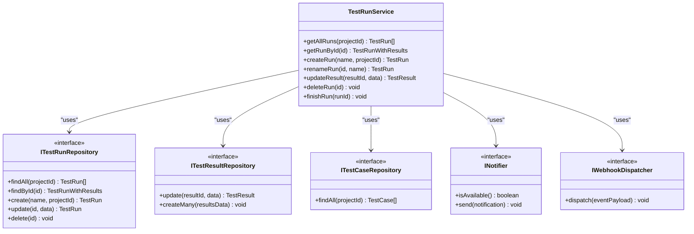
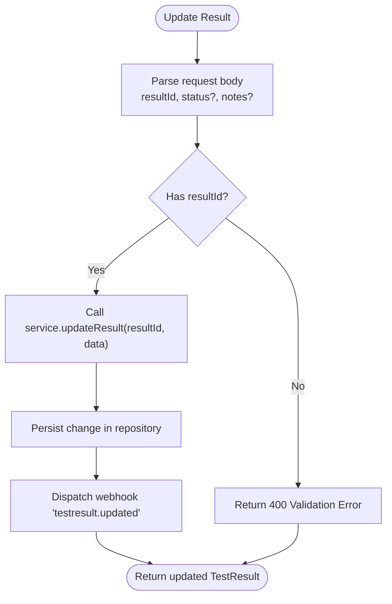
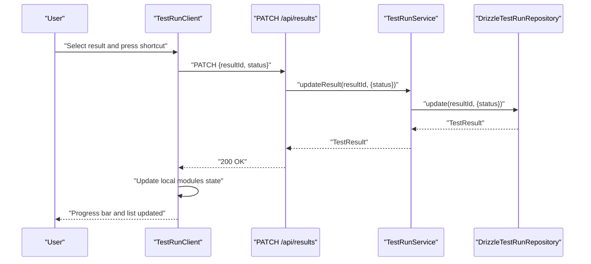
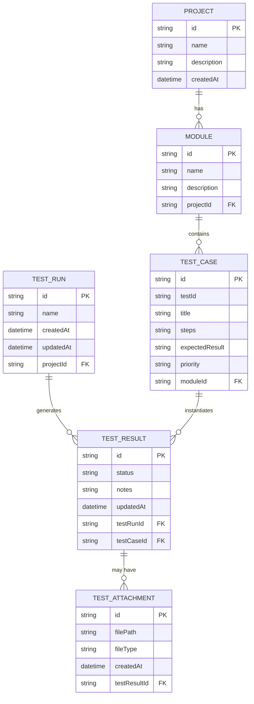
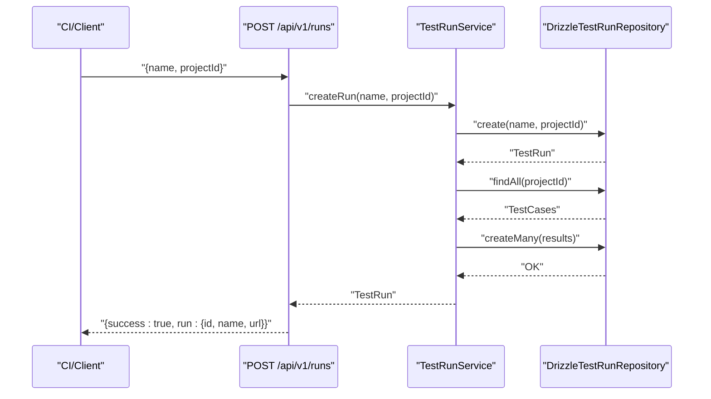
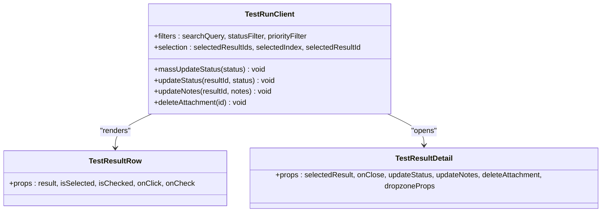
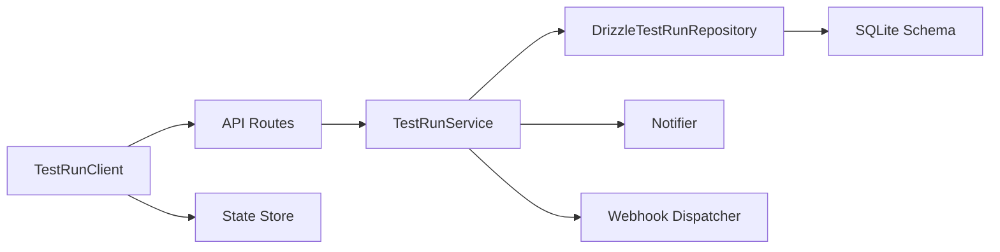

# Test Execution Management

<cite>
**Referenced Files in This Document**
- [TestRunService.ts](file://src/domain/services/TestRunService.ts)
- [DrizzleTestRunRepository.ts](file://src/adapters/persistence/drizzle/DrizzleTestRunRepository.ts)
- [ITestRunRepository.ts](file://src/domain/ports/repositories/ITestRunRepository.ts)
- [index.ts (domain types)](file://src/domain/types/index.ts)
- [schema.ts (API schemas)](file://app/api/_lib/schemas.ts)
- [withApiHandler.ts (API wrapper)](file://app/api/_lib/withApiHandler.ts)
- [route.ts (runs v0)](file://app/api/runs/route.ts)
- [route.ts (runs v1)](file://app/api/v1/runs/route.ts)
- [route.ts (run by id)](file://app/api/runs/[id]/route.ts)
- [route.ts (finish run)](file://app/api/runs/[id]/finish/route.ts)
- [route.ts (results)](file://app/api/results/route.ts)
- [route.ts (export run)](file://app/api/runs/[id]/export/route.ts)
- [route.ts (bug report)](file://app/api/runs/[id]/bug-report/route.ts)
- [TestRunClient.tsx](file://app/runs/[id]/TestRunClient.tsx)
- [TestResultRow.tsx](file://src/ui/test-run/TestResultRow.tsx)
- [TestResultDetail.tsx](file://src/ui/test-run/TestResultDetail.tsx)
- [schema.ts (db schema)](file://src/infrastructure/db/schema.ts)
- [store.ts (state store)](file://src/infrastructure/state/store.ts)
</cite>

## Table of Contents
1. [Introduction](#introduction)
2. [Project Structure](#project-structure)
3. [Core Components](#core-components)
4. [Architecture Overview](#architecture-overview)
5. [Detailed Component Analysis](#detailed-component-analysis)
6. [Dependency Analysis](#dependency-analysis)
7. [Performance Considerations](#performance-considerations)
8. [Troubleshooting Guide](#troubleshooting-guide)
9. [Conclusion](#conclusion)
10. [Appendices](#appendices)

## Introduction
This document describes the Test Execution Management feature, covering the complete lifecycle of a test run: creation, execution tracking, result recording, and completion reporting. It explains the TestRunService implementation, test result status management (PASSED, FAILED, BLOCKED, UNTESTED), progress monitoring, and real-time updates. It also documents the test run data models, result tracking mechanisms, UI components for run monitoring, and the API endpoints used to manage runs. Practical examples show how to create test runs, track execution progress, update test results, and generate completion reports. Finally, it addresses run scheduling, concurrent execution handling, and integration with the broader testing workflow.

## Project Structure
The Test Execution Management feature spans domain services, persistence adapters, API routes, and UI components:

- Domain service orchestrates run lifecycle and result updates.
- Persistence adapter maps domain entities to the database schema.
- API routes expose endpoints for creating, updating, finishing, and exporting runs.
- UI components render run lists, details, and support interactive updates.
- State store coordinates UI filters, selection, and keyboard navigation.

**Diagram sources**
- [TestRunService.ts:14-124](file://src/domain/services/TestRunService.ts#L14-L124)
- [DrizzleTestRunRepository.ts:7-95](file://src/adapters/persistence/drizzle/DrizzleTestRunRepository.ts#L7-L95)
- [schema.ts (db schema):34-59](file://src/infrastructure/db/schema.ts#L34-L59)
- [route.ts (runs v0):8-25](file://app/api/runs/route.ts#L8-L25)
- [route.ts (runs v1):13-27](file://app/api/v1/runs/route.ts#L13-L27)
- [route.ts (run by id):8-26](file://app/api/runs/[id]/route.ts#L8-L26)
- [route.ts (finish run):7-14](file://app/api/runs/[id]/finish/route.ts#L7-L14)
- [route.ts (results):8-18](file://app/api/results/route.ts#L8-L18)
- [route.ts (export run):6-19](file://app/api/runs/[id]/export/route.ts#L6-L19)
- [route.ts (bug report):8-18](file://app/api/runs/[id]/bug-report/route.ts#L8-L18)
- [TestRunClient.tsx:14-259](file://app/runs/[id]/TestRunClient.tsx#L14-L259)
- [TestResultRow.tsx:20-62](file://src/ui/test-run/TestResultRow.tsx#L20-L62)
- [TestResultDetail.tsx:19-153](file://src/ui/test-run/TestResultDetail.tsx#L19-L153)
- [store.ts](file://src/infrastructure/state/store.ts)

**Section sources**
- [TestRunService.ts:14-124](file://src/domain/services/TestRunService.ts#L14-L124)
- [DrizzleTestRunRepository.ts:7-95](file://src/adapters/persistence/drizzle/DrizzleTestRunRepository.ts#L7-L95)
- [index.ts (domain types):34-51](file://src/domain/types/index.ts#L34-L51)
- [route.ts (runs v0):8-25](file://app/api/runs/route.ts#L8-L25)
- [route.ts (runs v1):13-27](file://app/api/v1/runs/route.ts#L13-L27)
- [route.ts (run by id):8-26](file://app/api/runs/[id]/route.ts#L8-L26)
- [route.ts (finish run):7-14](file://app/api/runs/[id]/finish/route.ts#L7-L14)
- [route.ts (results):8-18](file://app/api/results/route.ts#L8-L18)
- [route.ts (export run):6-19](file://app/api/runs/[id]/export/route.ts#L6-L19)
- [route.ts (bug report):8-18](file://app/api/runs/[id]/bug-report/route.ts#L8-L18)
- [TestRunClient.tsx:14-259](file://app/runs/[id]/TestRunClient.tsx#L14-L259)
- [TestResultRow.tsx:20-62](file://src/ui/test-run/TestResultRow.tsx#L20-L62)
- [TestResultDetail.tsx:19-153](file://src/ui/test-run/TestResultDetail.tsx#L19-L153)
- [schema.ts (db schema):34-59](file://src/infrastructure/db/schema.ts#L34-L59)
- [store.ts](file://src/infrastructure/state/store.ts)

## Core Components
- TestRunService: Orchestrates run lifecycle, result updates, and completion notifications.
- DrizzleTestRunRepository: Persists and retrieves runs and aggregates results with test cases and attachments.
- Domain types: Define TestRun, TestResult, TestStatus, and related DTOs.
- API routes: Expose endpoints for creating runs, renaming runs, deleting runs, finishing runs, updating results, exporting reports, and generating AI bug reports.
- UI components: Render run lists, filter and navigate results, update statuses, attach evidence, and show progress.

Key responsibilities:
- Creation: Creates a run and initializes UNTESTED results for all test cases in a project.
- Execution tracking: Updates result status and notes; supports mass updates.
- Completion reporting: Computes statistics and triggers notifications/webhooks.
- Real-time updates: UI reflects immediate updates after API calls.

**Section sources**
- [TestRunService.ts:33-51](file://src/domain/services/TestRunService.ts#L33-L51)
- [TestRunService.ts:65-72](file://src/domain/services/TestRunService.ts#L65-L72)
- [TestRunService.ts:86-123](file://src/domain/services/TestRunService.ts#L86-L123)
- [DrizzleTestRunRepository.ts:16-67](file://src/adapters/persistence/drizzle/DrizzleTestRunRepository.ts#L16-L67)
- [index.ts (domain types):34-51](file://src/domain/types/index.ts#L34-L51)
- [route.ts (runs v0):8-25](file://app/api/runs/route.ts#L8-L25)
- [route.ts (results):8-18](file://app/api/results/route.ts#L8-L18)
- [route.ts (finish run):7-14](file://app/api/runs/[id]/finish/route.ts#L7-L14)
- [TestRunClient.tsx:25-48](file://app/runs/[id]/TestRunClient.tsx#L25-L48)
- [TestRunClient.tsx:110-146](file://app/runs/[id]/TestRunClient.tsx#L110-L146)

## Architecture Overview
The system follows a layered architecture:
- Presentation: React client-side components and pages.
- Application: API routes delegate to TestRunService.
- Domain: Business logic for run/result management.
- Infrastructure: Repositories and database schema.

**Diagram sources**
- [route.ts (runs v1):13-27](file://app/api/v1/runs/route.ts#L13-L27)
- [TestRunService.ts:33-51](file://src/domain/services/TestRunService.ts#L33-L51)
- [DrizzleTestRunRepository.ts:70-85](file://src/adapters/persistence/drizzle/DrizzleTestRunRepository.ts#L70-L85)
- [schema.ts (db schema):42-51](file://src/infrastructure/db/schema.ts#L42-L51)

## Detailed Component Analysis

### TestRunService
Responsibilities:
- Retrieve runs for a project.
- Create a run and initialize UNTESTED results for all test cases.
- Rename and delete runs.
- Update individual test results (status and notes).
- Finish a run, compute statistics, and notify via notifier and webhook dispatcher.

**Diagram sources**
- [TestRunService.ts:14-21](file://src/domain/services/TestRunService.ts#L14-L21)
- [ITestRunRepository.ts:3-11](file://src/domain/ports/repositories/ITestRunRepository.ts#L3-L11)
- [index.ts (domain types):42-51](file://src/domain/types/index.ts#L42-L51)

**Section sources**
- [TestRunService.ts:23-31](file://src/domain/services/TestRunService.ts#L23-L31)
- [TestRunService.ts:33-51](file://src/domain/services/TestRunService.ts#L33-L51)
- [TestRunService.ts:53-63](file://src/domain/services/TestRunService.ts#L53-L63)
- [TestRunService.ts:65-72](file://src/domain/services/TestRunService.ts#L65-L72)
- [TestRunService.ts:74-84](file://src/domain/services/TestRunService.ts#L74-L84)
- [TestRunService.ts:86-123](file://src/domain/services/TestRunService.ts#L86-L123)

### Test Result Status Management
Supported statuses: PASSED, FAILED, BLOCKED, UNTESTED. These are enforced by:
- Domain types defining TestStatus.
- Database schema defaulting status to UNTESTED.
- UI components rendering status-specific icons and styles.
- API PATCH endpoint for updating result status and notes.

**Diagram sources**
- [route.ts (results):8-18](file://app/api/results/route.ts#L8-L18)
- [TestRunService.ts:65-72](file://src/domain/services/TestRunService.ts#L65-L72)
- [index.ts (domain types):3, 77-80](file://src/domain/types/index.ts#L3,L77-L80)

**Section sources**
- [index.ts (domain types):3, 42-51](file://src/domain/types/index.ts#L3,L42-L51)
- [schema.ts (db schema):42-51](file://src/infrastructure/db/schema.ts#L42-L51)
- [TestResultRow.tsx:5-10](file://src/ui/test-run/TestResultRow.tsx#L5-L10)
- [TestResultDetail.tsx:47-65](file://src/ui/test-run/TestResultDetail.tsx#L47-L65)
- [route.ts (results):8-18](file://app/api/results/route.ts#L8-L18)

### Progress Monitoring and Real-Time Updates
Progress is computed client-side from filtered results:
- Stats include counts for PASSED, FAILED, BLOCKED, UNTESTED, and total.
- UI components reflect immediate updates after successful API responses.
- Keyboard shortcuts enable quick status updates.

**Diagram sources**
- [TestRunClient.tsx:110-127](file://app/runs/[id]/TestRunClient.tsx#L110-L127)
- [TestRunClient.tsx:186-193](file://app/runs/[id]/TestRunClient.tsx#L186-L193)
- [route.ts (results):8-18](file://app/api/results/route.ts#L8-L18)
- [TestRunService.ts:65-72](file://src/domain/services/TestRunService.ts#L65-L72)

**Section sources**
- [TestRunClient.tsx:186-193](file://app/runs/[id]/TestRunClient.tsx#L186-L193)
- [TestRunClient.tsx:110-127](file://app/runs/[id]/TestRunClient.tsx#L110-L127)
- [TestResultRow.tsx:20-62](file://src/ui/test-run/TestResultRow.tsx#L20-L62)

### Test Run Data Models
Core entities and relationships:
- TestRun: identifier, name, timestamps, project association.
- TestResult: links run and test case, tracks status and notes, optional attachments.
- TestCase: test identity, steps, expected result, priority, module linkage.
- Module: hierarchical grouping under a project.

**Diagram sources**
- [schema.ts (db schema):10-59](file://src/infrastructure/db/schema.ts#L10-L59)
- [index.ts (domain types):9-51](file://src/domain/types/index.ts#L9-L51)

**Section sources**
- [schema.ts (db schema):10-59](file://src/infrastructure/db/schema.ts#L10-L59)
- [index.ts (domain types):9-51](file://src/domain/types/index.ts#L9-L51)

### API Endpoints for Run Management
- GET /api/runs?projectId=...: List runs for a project.
- POST /api/runs: Create a run (internal API).
- POST /api/v1/runs: Create a run externally (e.g., CI).
- PATCH /api/runs/:id: Rename a run.
- DELETE /api/runs/:id: Delete a run.
- POST /api/runs/:id/finish: Finish a run and compute completion stats.
- PATCH /api/results: Update a test result’s status and notes.
- GET /api/runs/:id/export: Export an HTML report.
- POST /api/runs/:id/bug-report: Generate an AI bug report.

**Diagram sources**
- [route.ts (runs v1):13-27](file://app/api/v1/runs/route.ts#L13-L27)
- [TestRunService.ts:33-51](file://src/domain/services/TestRunService.ts#L33-L51)
- [DrizzleTestRunRepository.ts:70-85](file://src/adapters/persistence/drizzle/DrizzleTestRunRepository.ts#L70-L85)

**Section sources**
- [route.ts (runs v0):8-25](file://app/api/runs/route.ts#L8-L25)
- [route.ts (runs v1):13-27](file://app/api/v1/runs/route.ts#L13-L27)
- [route.ts (run by id):8-26](file://app/api/runs/[id]/route.ts#L8-L26)
- [route.ts (finish run):7-14](file://app/api/runs/[id]/finish/route.ts#L7-L14)
- [route.ts (results):8-18](file://app/api/results/route.ts#L8-L18)
- [route.ts (export run):6-19](file://app/api/runs/[id]/export/route.ts#L6-L19)
- [route.ts (bug report):8-18](file://app/api/runs/[id]/bug-report/route.ts#L8-L18)

### UI Components for Run Monitoring
- TestRunClient: Central client component managing filters, selection, keyboard navigation, mass updates, and real-time state updates.
- TestResultRow: Renders a single test result with status icon, priority badge, and selection state.
- TestResultDetail: Sidebar for viewing and editing selected result details, status buttons, notes, and attachments.

**Diagram sources**
- [TestRunClient.tsx:14-259](file://app/runs/[id]/TestRunClient.tsx#L14-L259)
- [TestResultRow.tsx:20-62](file://src/ui/test-run/TestResultRow.tsx#L20-L62)
- [TestResultDetail.tsx:19-153](file://src/ui/test-run/TestResultDetail.tsx#L19-L153)

**Section sources**
- [TestRunClient.tsx:14-259](file://app/runs/[id]/TestRunClient.tsx#L14-L259)
- [TestResultRow.tsx:20-62](file://src/ui/test-run/TestResultRow.tsx#L20-L62)
- [TestResultDetail.tsx:19-153](file://src/ui/test-run/TestResultDetail.tsx#L19-L153)

## Dependency Analysis
- TestRunService depends on repositories and notification/webhook dispatchers.
- DrizzleTestRunRepository depends on the database schema and joins to build TestRunWithResults.
- API routes depend on TestRunService and enforce request validation via schemas.
- UI components depend on state store and call API endpoints to mutate state.

**Diagram sources**
- [TestRunService.ts:14-21](file://src/domain/services/TestRunService.ts#L14-L21)
- [DrizzleTestRunRepository.ts:7-95](file://src/adapters/persistence/drizzle/DrizzleTestRunRepository.ts#L7-L95)
- [schema.ts (db schema):34-59](file://src/infrastructure/db/schema.ts#L34-L59)
- [TestRunClient.tsx:12-23](file://app/runs/[id]/TestRunClient.tsx#L12-L23)

**Section sources**
- [TestRunService.ts:14-21](file://src/domain/services/TestRunService.ts#L14-L21)
- [DrizzleTestRunRepository.ts:7-95](file://src/adapters/persistence/drizzle/DrizzleTestRunRepository.ts#L7-L95)
- [schema.ts (db schema):34-59](file://src/infrastructure/db/schema.ts#L34-L59)
- [TestRunClient.tsx:12-23](file://app/runs/[id]/TestRunClient.tsx#L12-L23)

## Performance Considerations
- Batch operations: Mass status updates use Promise.all to reduce latency when updating multiple results concurrently.
- Client-side filtering: Filtering and sorting occur in memory on the flattened results list, which is efficient for moderate run sizes.
- Database joins: The repository aggregates results with test cases and attachments in a single query with deduplication to minimize round trips.
- Unique constraint: The unique index on (testRunId, testCaseId) prevents duplicate results per run-case pair.

Recommendations:
- For very large runs, consider pagination or server-side filtering.
- Debounce note updates to avoid frequent PATCH requests.
- Use optimistic UI updates with rollback on error.

**Section sources**
- [TestRunClient.tsx:25-48](file://app/runs/[id]/TestRunClient.tsx#L25-L48)
- [DrizzleTestRunRepository.ts:34-62](file://src/adapters/persistence/drizzle/DrizzleTestRunRepository.ts#L34-L62)
- [schema.ts (db schema):49-51](file://src/infrastructure/db/schema.ts#L49-L51)

## Troubleshooting Guide
Common issues and resolutions:
- Validation errors on run creation:
  - Ensure projectId and name are provided and valid.
  - Check API response for validation error code and message.
- Result update failures:
  - Verify resultId exists and belongs to the current run.
  - Confirm status is one of the supported values.
- Run completion notifications:
  - If notifier is unavailable, the finish operation still completes but no notification is sent.
  - Check webhook dispatcher availability and payload correctness.
- UI not reflecting updates:
  - Ensure PATCH /api/results returns 200 and the client updates local state accordingly.
  - Confirm keyboard shortcuts and selection state are functioning.

**Section sources**
- [route.ts (runs v0):12-14](file://app/api/runs/route.ts#L12-L14)
- [route.ts (results):10-15](file://app/api/results/route.ts#L10-L15)
- [TestRunService.ts:86-123](file://src/domain/services/TestRunService.ts#L86-L123)
- [TestRunClient.tsx:110-127](file://app/runs/[id]/TestRunClient.tsx#L110-L127)

## Conclusion
The Test Execution Management feature provides a robust lifecycle for test runs, from creation to completion. It integrates domain-driven design with a clean separation of concerns, reliable persistence, and a responsive UI. The system supports real-time updates, progress monitoring, and extensibility through webhooks and notifiers. By following the documented APIs and UI patterns, teams can efficiently orchestrate test execution, track outcomes, and generate actionable reports.

## Appendices

### Practical Examples

- Create a test run (external CI):
  - Endpoint: POST /api/v1/runs
  - Body: { name, projectId }
  - Response: { success: true, run: { id, name, url } }

- Track execution progress:
  - Navigate to the run page (/runs/:id).
  - Use status filters and keyboard shortcuts to move between results.
  - Observe live progress bar reflecting counts of PASSED, FAILED, BLOCKED, UNTESTED.

- Update test results:
  - Select a result and choose a status (PASSED/FAILED/BLOCKED/UNTESTED).
  - Add notes or attach evidence via the sidebar.
  - Confirm updates are reflected immediately.

- Finish a run and receive completion report:
  - Call POST /api/runs/:id/finish.
  - Receive success response and expect notifications/webhooks with run statistics.

- Export a run report:
  - Call GET /api/runs/:id/export.
  - Download the generated HTML report.

- Generate an AI bug report:
  - Call POST /api/runs/:id/bug-report with optional context prompt.
  - Receive markdown-formatted bug report content.

**Section sources**
- [route.ts (runs v1):13-27](file://app/api/v1/runs/route.ts#L13-L27)
- [TestRunClient.tsx:186-193](file://app/runs/[id]/TestRunClient.tsx#L186-L193)
- [TestRunClient.tsx:110-146](file://app/runs/[id]/TestRunClient.tsx#L110-L146)
- [route.ts (finish run):7-14](file://app/api/runs/[id]/finish/route.ts#L7-L14)
- [route.ts (export run):6-19](file://app/api/runs/[id]/export/route.ts#L6-L19)
- [route.ts (bug report):8-18](file://app/api/runs/[id]/bug-report/route.ts#L8-L18)