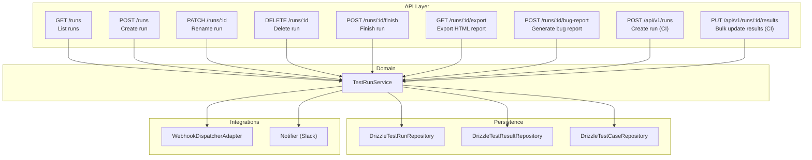
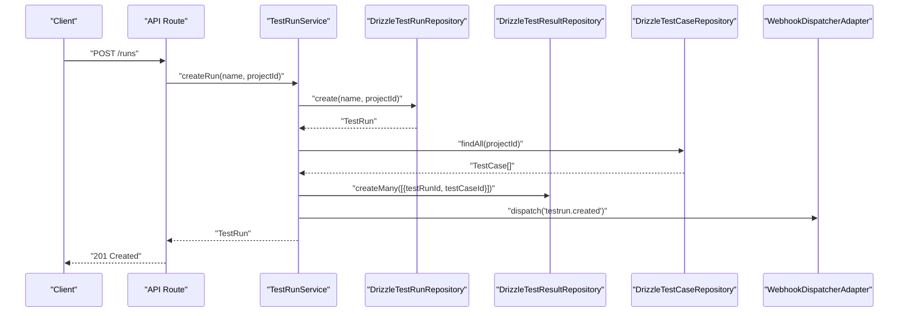
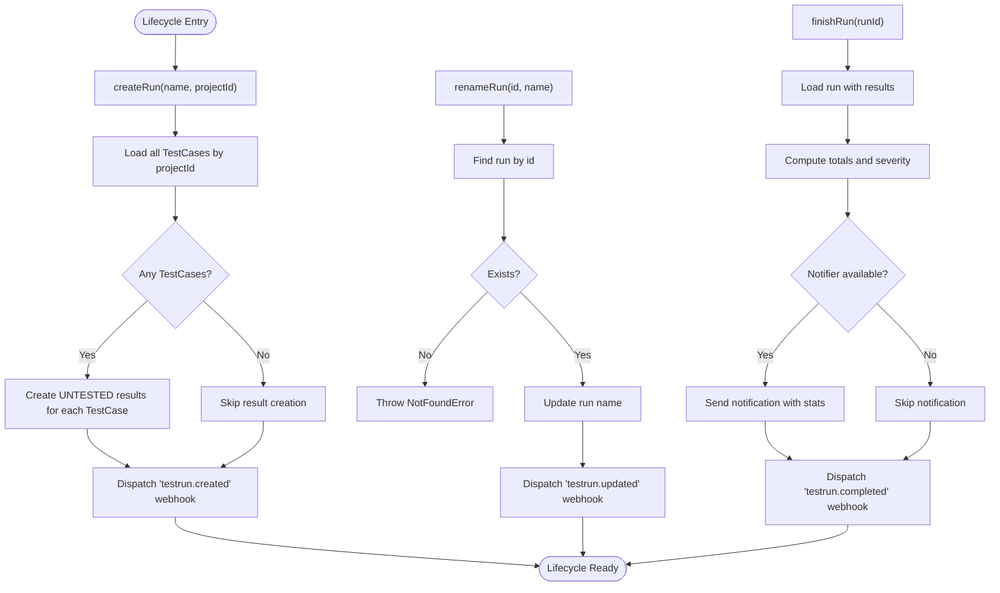
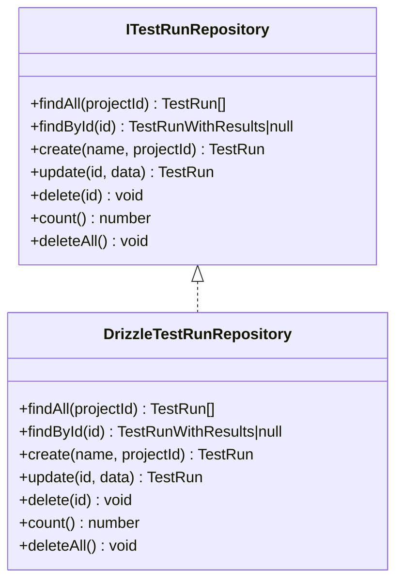
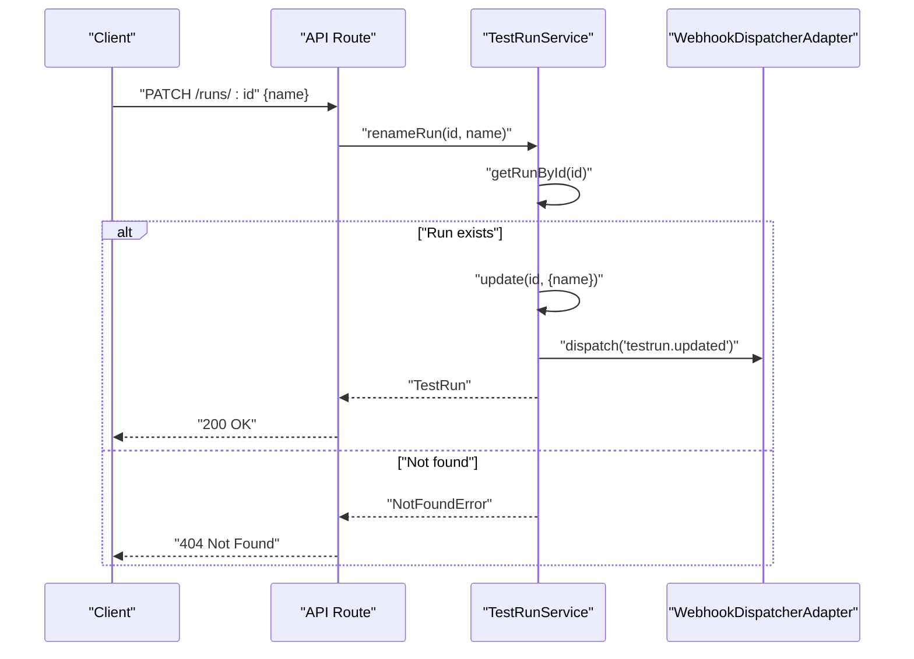
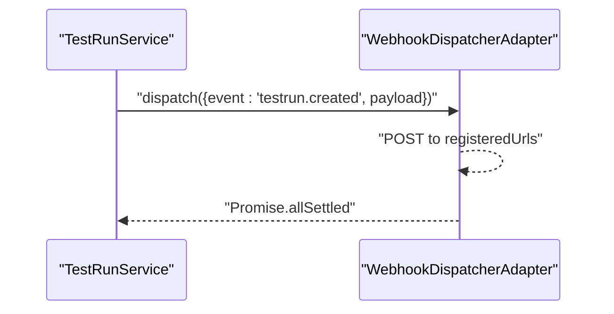
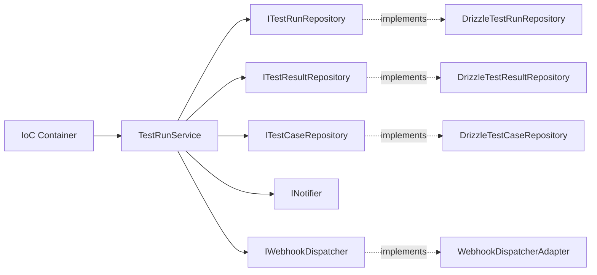

# Test Run Lifecycle

<cite>
**Referenced Files in This Document**
- [TestRunService.ts](file://src/domain/services/TestRunService.ts)
- [DrizzleTestRunRepository.ts](file://src/adapters/persistence/drizzle/DrizzleTestRunRepository.ts)
- [ITestRunRepository.ts](file://src/domain/ports/repositories/ITestRunRepository.ts)
- [route.ts](file://app/api/runs/route.ts)
- [route.ts](file://app/api/runs/[id]/route.ts)
- [route.ts](file://app/api/runs/[id]/finish/route.ts)
- [route.ts](file://app/api/runs/[id]/export/route.ts)
- [route.ts](file://app/api/runs/[id]/bug-report/route.ts)
- [route.ts](file://app/api/v1/runs/route.ts)
- [route.ts](file://app/api/v1/runs/[id]/results/route.ts)
- [schemas.ts](file://app/api/_lib/schemas.ts)
- [container.ts](file://src/infrastructure/container.ts)
- [index.ts](file://src/domain/types/index.ts)
- [WebhookDispatcherAdapter.ts](file://src/adapters/webhook/WebhookDispatcherAdapter.ts)
- [DomainErrors.ts](file://src/domain/errors/DomainErrors.ts)
</cite>

## Table of Contents
1. [Introduction](#introduction)
2. [Project Structure](#project-structure)
3. [Core Components](#core-components)
4. [Architecture Overview](#architecture-overview)
5. [Detailed Component Analysis](#detailed-component-analysis)
6. [Dependency Analysis](#dependency-analysis)
7. [Performance Considerations](#performance-considerations)
8. [Troubleshooting Guide](#troubleshooting-guide)
9. [Conclusion](#conclusion)
10. [Appendices](#appendices)

## Introduction
This document explains the complete Test Run Lifecycle managed by the system, covering creation, population with initial results, renaming, result updates, finishing, exporting reports, generating bug reports, and deletion. It documents the service methods, repository pattern implementation, API endpoints, validation, error handling, and webhook dispatching for lifecycle events. Practical examples illustrate end-to-end workflows for CI and manual execution.

## Project Structure
The lifecycle spans the domain, adapters, and API layers:
- Domain service orchestrates lifecycle operations and integrates with repositories, notifications, and webhooks.
- Persistence adapters implement repository interfaces using Drizzle ORM.
- API routes expose endpoints for run CRUD, result bulk updates, finishing, exporting, and bug report generation.
- Validation schemas define request contracts.
- The IoC container wires dependencies and exposes services to API routes.

**Diagram sources**
- [route.ts:1-26](file://app/api/runs/route.ts#L1-L26)
- [route.ts:1-27](file://app/api/runs/[id]/route.ts#L1-L27)
- [route.ts:1-15](file://app/api/runs/[id]/finish/route.ts#L1-L15)
- [route.ts:1-20](file://app/api/runs/[id]/export/route.ts#L1-L20)
- [route.ts:1-19](file://app/api/runs/[id]/bug-report/route.ts#L1-L19)
- [route.ts:1-28](file://app/api/v1/runs/route.ts#L1-L28)
- [route.ts:1-59](file://app/api/v1/runs/[id]/results/route.ts#L1-L59)
- [TestRunService.ts:1-125](file://src/domain/services/TestRunService.ts#L1-L125)
- [DrizzleTestRunRepository.ts:1-96](file://src/adapters/persistence/drizzle/DrizzleTestRunRepository.ts#L1-L96)
- [WebhookDispatcherAdapter.ts:1-38](file://src/adapters/webhook/WebhookDispatcherAdapter.ts#L1-L38)

**Section sources**
- [route.ts:1-26](file://app/api/runs/route.ts#L1-L26)
- [route.ts:1-27](file://app/api/runs/[id]/route.ts#L1-L27)
- [route.ts:1-15](file://app/api/runs/[id]/finish/route.ts#L1-L15)
- [route.ts:1-20](file://app/api/runs/[id]/export/route.ts#L1-L20)
- [route.ts:1-19](file://app/api/runs/[id]/bug-report/route.ts#L1-L19)
- [route.ts:1-28](file://app/api/v1/runs/route.ts#L1-L28)
- [route.ts:1-59](file://app/api/v1/runs/[id]/results/route.ts#L1-L59)
- [container.ts:1-126](file://src/infrastructure/container.ts#L1-L126)

## Core Components
- TestRunService: Orchestrates lifecycle operations, initializes results for existing test cases upon creation, handles renaming, result updates, finishing, and deletion. Dispatches webhooks and optionally sends notifications.
- DrizzleTestRunRepository: Implements repository methods for run persistence, including loading runs with nested results and attachments.
- API Routes: Expose endpoints for listing, creating, renaming, deleting runs, finishing runs, exporting reports, generating bug reports, and bulk result updates.
- Validation Schemas: Define request contracts for run creation, renaming, result updates, and bug report generation.
- WebhookDispatcherAdapter: Dispatches lifecycle events to configured URLs.
- IoC Container: Wires repositories, adapters, and services for reuse across API routes.

**Section sources**
- [TestRunService.ts:1-125](file://src/domain/services/TestRunService.ts#L1-L125)
- [DrizzleTestRunRepository.ts:1-96](file://src/adapters/persistence/drizzle/DrizzleTestRunRepository.ts#L1-L96)
- [ITestRunRepository.ts:1-12](file://src/domain/ports/repositories/ITestRunRepository.ts#L1-L12)
- [route.ts:1-26](file://app/api/runs/route.ts#L1-L26)
- [route.ts:1-27](file://app/api/runs/[id]/route.ts#L1-L27)
- [route.ts:1-15](file://app/api/runs/[id]/finish/route.ts#L1-L15)
- [route.ts:1-20](file://app/api/runs/[id]/export/route.ts#L1-L20)
- [route.ts:1-19](file://app/api/runs/[id]/bug-report/route.ts#L1-L19)
- [route.ts:1-28](file://app/api/v1/runs/route.ts#L1-L28)
- [route.ts:1-59](file://app/api/v1/runs/[id]/results/route.ts#L1-L59)
- [schemas.ts:1-92](file://app/api/_lib/schemas.ts#L1-L92)
- [WebhookDispatcherAdapter.ts:1-38](file://src/adapters/webhook/WebhookDispatcherAdapter.ts#L1-L38)
- [container.ts:1-126](file://src/infrastructure/container.ts#L1-L126)

## Architecture Overview
The lifecycle follows a layered architecture:
- API routes validate inputs and delegate to TestRunService.
- TestRunService coordinates repositories and external integrations.
- Drizzle repositories persist and load data with joins for enriched run details.
- Webhooks and notifications are dispatched after key lifecycle events.

**Diagram sources**
- [route.ts:20-25](file://app/api/runs/route.ts#L20-L25)
- [TestRunService.ts:33-51](file://src/domain/services/TestRunService.ts#L33-L51)
- [DrizzleTestRunRepository.ts:70-81](file://src/adapters/persistence/drizzle/DrizzleTestRunRepository.ts#L70-L81)
- [WebhookDispatcherAdapter.ts:14-36](file://src/adapters/webhook/WebhookDispatcherAdapter.ts#L14-L36)

## Detailed Component Analysis

### TestRunService Methods and Lifecycle
- getAllRuns(projectId): Retrieves runs for a project.
- getRunById(id): Loads a run with nested results and attachments; throws if not found.
- createRun(name, projectId): Creates a run and initializes UNTESTED results for all existing test cases in the project; dispatches a testrun.created webhook.
- renameRun(id, name): Renames a run; validates existence and dispatches testrun.updated.
- updateResult(resultId, data): Updates a single result; dispatches testresult.updated.
- deleteRun(id): Deletes a run; validates existence and dispatches testrun.deleted.
- finishRun(runId): Computes run statistics, optionally sends a notification, and dispatches testrun.completed.

**Diagram sources**
- [TestRunService.ts:33-123](file://src/domain/services/TestRunService.ts#L33-L123)

**Section sources**
- [TestRunService.ts:23-123](file://src/domain/services/TestRunService.ts#L23-L123)

### Repository Pattern Implementation
- ITestRunRepository defines the contract for run operations.
- DrizzleTestRunRepository implements:
  - findAll(projectId): Lists runs ordered by creation time.
  - findById(id): Loads a run and enriches it with test results, test cases, modules, and attachments.
  - create/update/delete/count/deleteAll: Standard persistence operations.

**Diagram sources**
- [ITestRunRepository.ts:1-12](file://src/domain/ports/repositories/ITestRunRepository.ts#L1-L12)
- [DrizzleTestRunRepository.ts:1-96](file://src/adapters/persistence/drizzle/DrizzleTestRunRepository.ts#L1-L96)

**Section sources**
- [ITestRunRepository.ts:1-12](file://src/domain/ports/repositories/ITestRunRepository.ts#L1-L12)
- [DrizzleTestRunRepository.ts:7-95](file://src/adapters/persistence/drizzle/DrizzleTestRunRepository.ts#L7-L95)

### API Endpoint Handling for Run Operations
- List runs: GET /runs?projectId=... returns TestRun[].
- Create run (UI): POST /runs validates body against createRunSchema and calls createRun.
- Create run (CI): POST /api/v1/runs validates body and returns a structured response with run id and web URL.
- Rename run: PATCH /runs/:id validates body against renameRunSchema and calls renameRun.
- Delete run: DELETE /runs/:id calls deleteRun and returns 204 No Content.
- Finish run: POST /runs/:id/finish triggers finishRun and returns success.
- Export report: GET /runs/:id/export generates and returns an HTML report.
- Bug report: POST /runs/:id/bug-report generates a markdown bug report using AI.
- Bulk results (CI): PUT /api/v1/runs/:id/results updates multiple results atomically.

**Diagram sources**
- [route.ts:8-17](file://app/api/runs/[id]/route.ts#L8-L17)
- [TestRunService.ts:53-63](file://src/domain/services/TestRunService.ts#L53-L63)

**Section sources**
- [route.ts:8-25](file://app/api/runs/route.ts#L8-L25)
- [route.ts:8-26](file://app/api/runs/[id]/route.ts#L8-L26)
- [route.ts:7-14](file://app/api/runs/[id]/finish/route.ts#L7-L14)
- [route.ts:6-19](file://app/api/runs/[id]/export/route.ts#L6-L19)
- [route.ts:8-18](file://app/api/runs/[id]/bug-report/route.ts#L8-L18)
- [route.ts:13-27](file://app/api/v1/runs/route.ts#L13-L27)
- [route.ts:12-58](file://app/api/v1/runs/[id]/results/route.ts#L12-L58)

### Webhook Dispatching for Lifecycle Events
- Events dispatched:
  - testrun.created: After successful run creation.
  - testrun.updated: After renaming a run.
  - testresult.updated: After updating a single result.
  - testrun.deleted: After deleting a run.
  - testrun.completed: After finishing a run.
- WebhookDispatcherAdapter posts JSON payloads with event name and timestamp to registered URLs.

**Diagram sources**
- [TestRunService.ts:45-48](file://src/domain/services/TestRunService.ts#L45-L48)
- [WebhookDispatcherAdapter.ts:14-36](file://src/adapters/webhook/WebhookDispatcherAdapter.ts#L14-L36)

**Section sources**
- [TestRunService.ts:45-83](file://src/domain/services/TestRunService.ts#L45-L83)
- [WebhookDispatcherAdapter.ts:11-38](file://src/adapters/webhook/WebhookDispatcherAdapter.ts#L11-L38)

### Practical Examples

#### Example 1: Run Creation Workflow (Manual/UI)
- Endpoint: POST /runs
- Steps:
  - Validate request body with createRunSchema.
  - Call TestRunService.createRun(name, projectId).
  - Service creates the run and initializes UNTESTED results for all existing test cases.
  - Dispatch testrun.created webhook.
  - Return created run.

**Section sources**
- [route.ts:20-25](file://app/api/runs/route.ts#L20-L25)
- [TestRunService.ts:33-51](file://src/domain/services/TestRunService.ts#L33-L51)

#### Example 2: Run Creation Workflow (CI)
- Endpoint: POST /api/v1/runs
- Steps:
  - Validate request body with createRunSchema.
  - Call TestRunService.createRun(name, projectId).
  - Return structured response with success flag, run id, and web URL.

**Section sources**
- [route.ts:13-27](file://app/api/v1/runs/route.ts#L13-L27)
- [TestRunService.ts:33-51](file://src/domain/services/TestRunService.ts#L33-L51)

#### Example 3: Bulk Result Updates (CI)
- Endpoint: PUT /api/v1/runs/:id/results
- Steps:
  - Validate request body; require results array.
  - Load run by id (throws if not found).
  - For each item, locate matching result by testId and update status/notes.
  - Dispatch testresult.updated for each successful update.
  - Return summary of successes and failures.

**Section sources**
- [route.ts:12-58](file://app/api/v1/runs/[id]/results/route.ts#L12-L58)
- [TestRunService.ts:65-72](file://src/domain/services/TestRunService.ts#L65-L72)

#### Example 4: Finishing a Run and Notifications
- Endpoint: POST /runs/:id/finish
- Steps:
  - Load run by id.
  - Compute totals and severity.
  - Optionally send notification via notifier.
  - Dispatch testrun.completed webhook.

**Section sources**
- [route.ts:7-14](file://app/api/runs/[id]/finish/route.ts#L7-L14)
- [TestRunService.ts:86-123](file://src/domain/services/TestRunService.ts#L86-L123)

#### Example 5: Deleting a Run
- Endpoint: DELETE /runs/:id
- Steps:
  - Validate existence by loading run by id.
  - Delete run.
  - Dispatch testrun.deleted webhook.
  - Return 204 No Content.

**Section sources**
- [route.ts:19-26](file://app/api/runs/[id]/route.ts#L19-L26)
- [TestRunService.ts:74-84](file://src/domain/services/TestRunService.ts#L74-L84)

### Status Management and Statistics
- Status values: PASSED, FAILED, BLOCKED, UNTESTED.
- finishRun computes totals and severity based on result statuses and dispatches completion metrics.

**Section sources**
- [index.ts:3-51](file://src/domain/types/index.ts#L3-L51)
- [TestRunService.ts:89-99](file://src/domain/services/TestRunService.ts#L89-L99)

### Validation and Error Handling
- Validation:
  - createRunSchema enforces name and projectId presence.
  - renameRunSchema enforces name presence.
  - updateResultSchema enforces resultId and optional status/notes.
  - generateBugReportSchema accepts optional contextPrompt.
- Error handling:
  - getRunById and renameRun throw NotFoundError if run does not exist.
  - API routes return appropriate HTTP status codes mapped to domain error codes.

**Section sources**
- [schemas.ts:12-27](file://app/api/_lib/schemas.ts#L12-L27)
- [TestRunService.ts:27-31](file://src/domain/services/TestRunService.ts#L27-L31)
- [TestRunService.ts:53-57](file://src/domain/services/TestRunService.ts#L53-L57)
- [DomainErrors.ts:18-26](file://src/domain/errors/DomainErrors.ts#L18-L26)

## Dependency Analysis
- TestRunService depends on:
  - ITestRunRepository for persistence.
  - ITestResultRepository for result creation and updates.
  - ITestCaseRepository for initializing results.
  - INotifier for notifications.
  - IWebhookDispatcher for lifecycle events.
- IoC container binds concrete implementations and exposes services to API routes.

**Diagram sources**
- [container.ts:33-61](file://src/infrastructure/container.ts#L33-L61)
- [TestRunService.ts:15-21](file://src/domain/services/TestRunService.ts#L15-L21)
- [DrizzleTestRunRepository.ts:1-96](file://src/adapters/persistence/drizzle/DrizzleTestRunRepository.ts#L1-L96)
- [WebhookDispatcherAdapter.ts:1-38](file://src/adapters/webhook/WebhookDispatcherAdapter.ts#L1-L38)

**Section sources**
- [container.ts:33-61](file://src/infrastructure/container.ts#L33-L61)
- [TestRunService.ts:15-21](file://src/domain/services/TestRunService.ts#L15-L21)

## Performance Considerations
- Result initialization: On run creation, a single batch insert is used for all existing test cases, minimizing round trips.
- Run loading: findById performs a join to fetch results, test cases, modules, and attachments; consider pagination or lazy loading for very large runs.
- Webhook dispatch: Uses Promise.allSettled to avoid blocking on slow endpoints; ensure registered URLs are reliable.
- Bulk updates: The CI endpoint iterates through provided results; validate input sizes and handle partial failures gracefully.

[No sources needed since this section provides general guidance]

## Troubleshooting Guide
- Missing run errors:
  - Symptom: 404 Not Found when renaming, finishing, or deleting a run.
  - Cause: Run id does not exist.
  - Resolution: Verify run id and project membership.
- Validation errors:
  - Symptom: 400 Bad Request on run creation or renaming.
  - Causes: Missing name or projectId; invalid schema.
  - Resolution: Ensure request body matches createRunSchema or renameRunSchema.
- Bulk result update mismatches:
  - Symptom: Some items fail to update with “not found in this test run”.
  - Cause: Provided testId does not belong to the run’s test cases.
  - Resolution: Confirm testId alignment with run membership before bulk updates.
- Webhook delivery issues:
  - Symptom: Webhooks not received.
  - Cause: Registered URLs unavailable or misconfigured.
  - Resolution: Check webhook dispatcher configuration and network connectivity.

**Section sources**
- [TestRunService.ts:27-31](file://src/domain/services/TestRunService.ts#L27-L31)
- [TestRunService.ts:53-57](file://src/domain/services/TestRunService.ts#L53-L57)
- [route.ts:33-51](file://app/api/v1/runs/[id]/results/route.ts#L33-L51)
- [WebhookDispatcherAdapter.ts:14-36](file://src/adapters/webhook/WebhookDispatcherAdapter.ts#L14-L36)

## Conclusion
The Test Run Lifecycle is comprehensively supported by a clean separation of concerns: API routes handle validation and delegation, TestRunService orchestrates operations and integrates with repositories and external systems, and repositories provide robust persistence. The system automatically initializes results for existing test cases, supports renaming and deletion, and emits lifecycle webhooks. CI-friendly endpoints enable programmatic run creation and bulk result updates, while finishing and reporting capabilities close the loop for end-to-end testing workflows.

[No sources needed since this section summarizes without analyzing specific files]

## Appendices

### API Definitions Summary
- GET /runs?projectId=... → List runs for a project.
- POST /runs → Create a run (UI).
- POST /api/v1/runs → Create a run (CI).
- PATCH /runs/:id → Rename a run.
- DELETE /runs/:id → Delete a run.
- POST /runs/:id/finish → Finish a run and compute stats.
- GET /runs/:id/export → Export HTML report.
- POST /runs/:id/bug-report → Generate bug report.
- PUT /api/v1/runs/:id/results → Bulk update results.

**Section sources**
- [route.ts:8-25](file://app/api/runs/route.ts#L8-L25)
- [route.ts:8-26](file://app/api/runs/[id]/route.ts#L8-L26)
- [route.ts:7-14](file://app/api/runs/[id]/finish/route.ts#L7-L14)
- [route.ts:6-19](file://app/api/runs/[id]/export/route.ts#L6-L19)
- [route.ts:8-18](file://app/api/runs/[id]/bug-report/route.ts#L8-L18)
- [route.ts:13-27](file://app/api/v1/runs/route.ts#L13-L27)
- [route.ts:12-58](file://app/api/v1/runs/[id]/results/route.ts#L12-L58)