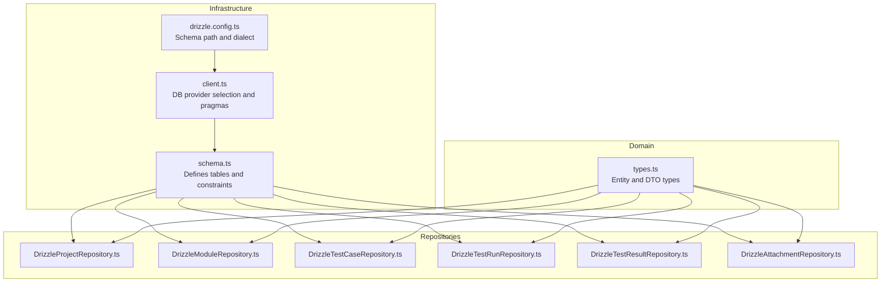
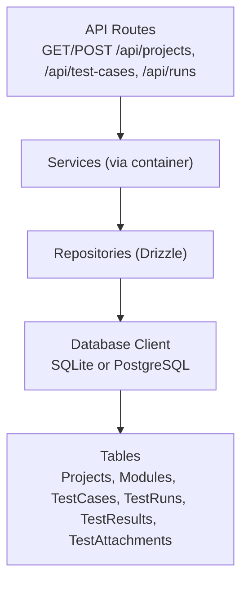
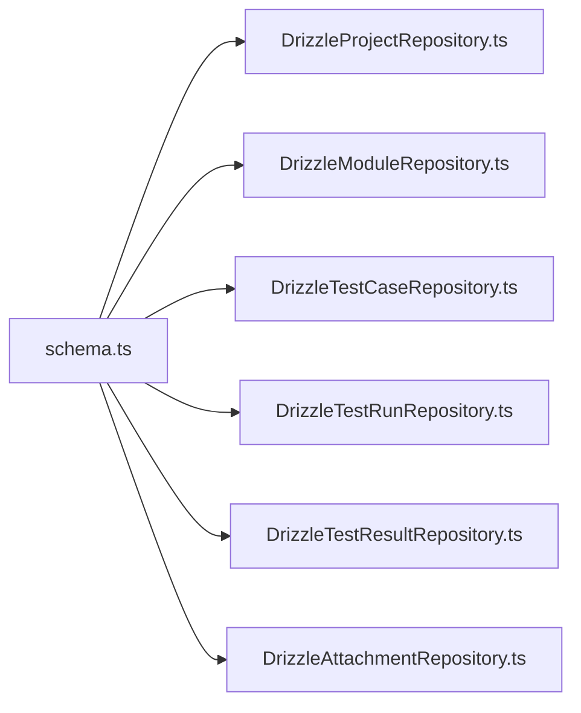

# Core Entities and Tables

<cite>
**Referenced Files in This Document**
- [schema.ts](file://src/infrastructure/db/schema.ts)
- [client.ts](file://src/infrastructure/db/client.ts)
- [drizzle.config.ts](file://drizzle.config.ts)
- [DrizzleProjectRepository.ts](file://src/adapters/persistence/drizzle/DrizzleProjectRepository.ts)
- [DrizzleModuleRepository.ts](file://src/adapters/persistence/drizzle/DrizzleModuleRepository.ts)
- [DrizzleTestCaseRepository.ts](file://src/adapters/persistence/drizzle/DrizzleTestCaseRepository.ts)
- [DrizzleTestRunRepository.ts](file://src/adapters/persistence/drizzle/DrizzleTestRunRepository.ts)
- [DrizzleTestResultRepository.ts](file://src/adapters/persistence/drizzle/DrizzleTestResultRepository.ts)
- [DrizzleAttachmentRepository.ts](file://src/adapters/persistence/drizzle/DrizzleAttachmentRepository.ts)
- [types.ts](file://src/domain/types/index.ts)
- [route.ts (projects)](file://app/api/projects/route.ts)
- [route.ts (test-cases)](file://app/api/test-cases/route.ts)
- [route.ts (runs)](file://app/api/runs/route.ts)
</cite>

## Table of Contents
1. [Introduction](#introduction)
2. [Project Structure](#project-structure)
3. [Core Components](#core-components)
4. [Architecture Overview](#architecture-overview)
5. [Detailed Component Analysis](#detailed-component-analysis)
6. [Dependency Analysis](#dependency-analysis)
7. [Performance Considerations](#performance-considerations)
8. [Troubleshooting Guide](#troubleshooting-guide)
9. [Conclusion](#conclusion)

## Introduction
This document describes the core database entities and their relationships: Projects, Modules, TestCases, TestRuns, TestResults, and TestAttachments. It explains field definitions, data types, constraints, validation rules, primary key strategies (cuid2 generation), audit fields (createdAt/updatedAt), defaults, and the business meaning of each field within the testing workflow. It also covers indexing strategies, performance considerations, typical data examples, and common query patterns derived from the repository implementations and API routes.

## Project Structure
The database schema is defined with Drizzle ORM for SQLite and PostgreSQL. The schema file defines tables and their constraints. Repositories encapsulate CRUD operations and joins used by services and APIs. The database client supports both SQLite (development/Electron) and PostgreSQL (Docker/production) via environment configuration.

**Diagram sources**
- [schema.ts:1-60](file://src/infrastructure/db/schema.ts#L1-L60)
- [client.ts:1-32](file://src/infrastructure/db/client.ts#L1-L32)
- [drizzle.config.ts:1-11](file://drizzle.config.ts#L1-L11)
- [DrizzleProjectRepository.ts:1-52](file://src/adapters/persistence/drizzle/DrizzleProjectRepository.ts#L1-L52)
- [DrizzleModuleRepository.ts:1-34](file://src/adapters/persistence/drizzle/DrizzleModuleRepository.ts#L1-L34)
- [DrizzleTestCaseRepository.ts:1-71](file://src/adapters/persistence/drizzle/DrizzleTestCaseRepository.ts#L1-L71)
- [DrizzleTestRunRepository.ts:1-96](file://src/adapters/persistence/drizzle/DrizzleTestRunRepository.ts#L1-L96)
- [DrizzleTestResultRepository.ts:1-36](file://src/adapters/persistence/drizzle/DrizzleTestResultRepository.ts#L1-L36)
- [DrizzleAttachmentRepository.ts:1-26](file://src/adapters/persistence/drizzle/DrizzleAttachmentRepository.ts#L1-L26)
- [types.ts:1-196](file://src/domain/types/index.ts#L1-L196)

**Section sources**
- [schema.ts:1-60](file://src/infrastructure/db/schema.ts#L1-L60)
- [client.ts:1-32](file://src/infrastructure/db/client.ts#L1-L32)
- [drizzle.config.ts:1-11](file://drizzle.config.ts#L1-L11)

## Core Components
This section documents each table’s fields, data types, constraints, defaults, and business meaning.

- Projects
  - Fields
    - id: text, primary key, generated via cuid2 default function
    - name: text, not null
    - description: text, nullable
    - createdAt: integer (timestamp), default function sets current time
  - Business meaning
    - Represents a product or feature area under test. Used as a parent container for Modules.
  - Typical data
    - id: "cm85...xyz"
    - name: "User Authentication"
    - description: "Handles login, logout, and session management"
    - createdAt: 2025-01-10T08:00:00Z
  - Common queries
    - Find by id
    - List all projects
    - Create/update/delete project

- Modules
  - Fields
    - id: text, primary key, cuid2
    - name: text, not null
    - description: text, nullable
    - projectId: text, not null, references Projects.id with cascade delete
  - Business meaning
    - Logical groupings of test cases within a project (e.g., "Frontend", "API").
  - Typical data
    - id: "cm86...abc"
    - name: "Frontend"
    - description: "UI and component tests"
    - projectId: "cm85...xyz"
  - Common queries
    - Find by name and projectId
    - List by projectId
    - Create/delete module

- TestCases
  - Fields
    - id: text, primary key, cuid2
    - testId: text, not null (business identifier for test case)
    - title: text, not null
    - steps: text, not null
    - expectedResult: text, not null
    - priority: text, not null
    - moduleId: text, not null, references Modules.id with cascade delete
  - Business meaning
    - Defines a single test scenario with steps and expected outcome. Linked to a Module.
  - Typical data
    - id: "cm87...def"
    - testId: "TC-001"
    - title: "Login with valid credentials"
    - steps: "1) Navigate to login page 2) Enter username/password 3) Click submit"
    - expectedResult: "User redirected to dashboard"
    - priority: "P1"
    - moduleId: "cm86...abc"
  - Common queries
    - Find by id
    - Find by testId
    - List by projectId (via join with Modules)
    - Create/update/delete test case

- TestRuns
  - Fields
    - id: text, primary key, cuid2
    - name: text, not null
    - createdAt: integer (timestamp), default function sets current time
    - updatedAt: integer (timestamp), default function sets current time
    - projectId: text, not null, references Projects.id with cascade delete
  - Business meaning
    - Represents a specific execution of selected test cases against a project scope.
  - Typical data
    - id: "cm89...ghi"
    - name: "Smoke Test - Build 1.2.3"
    - createdAt: 2025-01-12T09:00:00Z
    - updatedAt: 2025-01-12T09:05:00Z
    - projectId: "cm85...xyz"
  - Common queries
    - List by projectId, ordered by createdAt desc
    - Find by id with nested results and attachments
    - Create/update/delete run

- TestResults
  - Fields
    - id: text, primary key, cuid2
    - status: text, not null, default "UNTESTED"
    - notes: text, nullable
    - updatedAt: integer (timestamp), default function sets current time
    - testRunId: text, not null, references TestRuns.id with cascade delete
    - testCaseId: text, not null, references TestCases.id with cascade delete
  - Constraints
    - Unique composite index on (testRunId, testCaseId)
  - Business meaning
    - Captures per-run outcomes for a specific test case. Supports status tracking and notes.
  - Typical data
    - id: "cm90...jkl"
    - status: "PASSED"
    - notes: "All assertions passed"
    - updatedAt: 2025-01-12T09:05:00Z
    - testRunId: "cm89...ghi"
    - testCaseId: "cm87...def"
  - Common queries
    - Bulk insert with default status
    - Update status and notes
    - Delete all results (cleanup)

- TestAttachments
  - Fields
    - id: text, primary key, cuid2
    - filePath: text, not null
    - fileType: text, not null
    - createdAt: integer (timestamp), default function sets current time
    - testResultId: text, not null, references TestResults.id with cascade delete
  - Business meaning
    - Stores artifacts (screenshots, logs) linked to a specific TestResult.
  - Typical data
    - id: "cm91...mno"
    - filePath: "/uploads/test-result-123.png"
    - fileType: "image/png"
    - createdAt: 2025-01-12T09:05:00Z
    - testResultId: "cm90...jkl"
  - Common queries
    - Find by id
    - Create/delete attachment

**Section sources**
- [schema.ts:10-59](file://src/infrastructure/db/schema.ts#L10-L59)
- [types.ts:9-59](file://src/domain/types/index.ts#L9-L59)

## Architecture Overview
The system uses a layered architecture:
- Domain layer defines entities and DTOs.
- Infrastructure layer defines the database schema and client.
- Adapters/persistence layer implements repositories using Drizzle ORM.
- API routes orchestrate requests and delegate to services/repositories.

**Diagram sources**
- [route.ts (projects):1-19](file://app/api/projects/route.ts#L1-L19)
- [route.ts (test-cases):1-37](file://app/api/test-cases/route.ts#L1-L37)
- [route.ts (runs):1-26](file://app/api/runs/route.ts#L1-L26)
- [DrizzleProjectRepository.ts:1-52](file://src/adapters/persistence/drizzle/DrizzleProjectRepository.ts#L1-L52)
- [DrizzleTestCaseRepository.ts:1-71](file://src/adapters/persistence/drizzle/DrizzleTestCaseRepository.ts#L1-L71)
- [DrizzleTestRunRepository.ts:1-96](file://src/adapters/persistence/drizzle/DrizzleTestRunRepository.ts#L1-L96)
- [client.ts:1-32](file://src/infrastructure/db/client.ts#L1-L32)
- [schema.ts:1-60](file://src/infrastructure/db/schema.ts#L1-L60)

## Detailed Component Analysis

### Projects
- Purpose
  - Root container for Modules and TestRuns.
- Primary keys
  - cuid2 via default function.
- Audit fields
  - createdAt default set on insert.
- Typical operations
  - findById, findAll, create, update, delete.
- Example query pattern
  - Select all projects; select by id with createdAt mapped to Date.

**Section sources**
- [schema.ts:10-15](file://src/infrastructure/db/schema.ts#L10-L15)
- [DrizzleProjectRepository.ts:8-50](file://src/adapters/persistence/drizzle/DrizzleProjectRepository.ts#L8-L50)
- [types.ts:9-14](file://src/domain/types/index.ts#L9-L14)

### Modules
- Purpose
  - Organize TestCases by logical areas within a Project.
- Primary keys
  - cuid2.
- Foreign keys
  - projectId -> Projects.id (onDelete cascade).
- Typical operations
  - findByName(projectId), findAll(projectId), create(name, projectId), deleteAll.
- Example query pattern
  - Join Modules with Projects to filter by projectId.

**Section sources**
- [schema.ts:17-22](file://src/infrastructure/db/schema.ts#L17-L22)
- [DrizzleModuleRepository.ts:8-32](file://src/adapters/persistence/drizzle/DrizzleModuleRepository.ts#L8-L32)
- [types.ts:16-21](file://src/domain/types/index.ts#L16-L21)

### TestCases
- Purpose
  - Define executable test scenarios with steps and expected outcomes.
- Primary keys
  - cuid2.
- Foreign keys
  - moduleId -> Modules.id (onDelete cascade).
- Validation
  - testId, title, steps, expectedResult, priority are required.
- Typical operations
  - findById, findByTestId, findAll(projectId via join), create, update, delete, count.
- Example query pattern
  - Inner join with Modules to filter by projectId.

**Section sources**
- [schema.ts:24-32](file://src/infrastructure/db/schema.ts#L24-L32)
- [DrizzleTestCaseRepository.ts:8-70](file://src/adapters/persistence/drizzle/DrizzleTestCaseRepository.ts#L8-L70)
- [types.ts:23-32](file://src/domain/types/index.ts#L23-L32)

### TestRuns
- Purpose
  - Track a specific execution of tests for a project.
- Primary keys
  - cuid2.
- Foreign keys
  - projectId -> Projects.id (onDelete cascade).
- Audit fields
  - createdAt and updatedAt default set on insert/update.
- Typical operations
  - findAll(projectId, order by createdAt desc), findById with nested results and attachments, create, update, delete, count.
- Example query pattern
  - Join TestResults with TestCases and Modules; left join TestAttachments; deduplicate attachments; sort by testId.

**Section sources**
- [schema.ts:34-40](file://src/infrastructure/db/schema.ts#L34-L40)
- [DrizzleTestRunRepository.ts:8-95](file://src/adapters/persistence/drizzle/DrizzleTestRunRepository.ts#L8-L95)
- [types.ts:34-51](file://src/domain/types/index.ts#L34-L51)

### TestResults
- Purpose
  - Store per-run outcomes for a TestCase.
- Primary keys
  - cuid2.
- Foreign keys
  - testRunId -> TestRuns.id (onDelete cascade)
  - testCaseId -> TestCases.id (onDelete cascade)
- Constraints
  - Unique index on (testRunId, testCaseId) to prevent duplicates.
- Defaults
  - status default "UNTESTED".
- Typical operations
  - createMany with default status, update(status, notes), deleteAll.
- Example query pattern
  - Bulk insert with default status; update individual result.

**Section sources**
- [schema.ts:42-51](file://src/infrastructure/db/schema.ts#L42-L51)
- [DrizzleTestResultRepository.ts:8-35](file://src/adapters/persistence/drizzle/DrizzleTestResultRepository.ts#L8-L35)
- [types.ts:42-51](file://src/domain/types/index.ts#L42-L51)

### TestAttachments
- Purpose
  - Attach artifacts (files) to TestResults.
- Primary keys
  - cuid2.
- Foreign keys
  - testResultId -> TestResults.id (onDelete cascade).
- Typical operations
  - findById, create, delete, deleteAll.
- Example query pattern
  - Left join with TestResults to fetch attachments for a run.

**Section sources**
- [schema.ts:53-59](file://src/infrastructure/db/schema.ts#L53-L59)
- [DrizzleAttachmentRepository.ts:8-25](file://src/adapters/persistence/drizzle/DrizzleAttachmentRepository.ts#L8-L25)
- [types.ts:53-59](file://src/domain/types/index.ts#L53-L59)

### API Usage Patterns
- Projects API
  - GET /api/projects lists all projects.
  - POST /api/projects creates a project.
- Test Cases API
  - GET /api/test-cases?projectId=... lists grouped by module and total count.
  - POST /api/test-cases creates a test case.
- Runs API
  - GET /api/runs?projectId=... lists runs for a project.
  - POST /api/runs creates a run.

**Section sources**
- [route.ts (projects):8-18](file://app/api/projects/route.ts#L8-L18)
- [route.ts (test-cases):8-36](file://app/api/test-cases/route.ts#L8-L36)
- [route.ts (runs):8-25](file://app/api/runs/route.ts#L8-L25)

## Dependency Analysis
The following diagram shows how repositories depend on the schema and how API routes interact with services and repositories.

**Diagram sources**
- [schema.ts:1-60](file://src/infrastructure/db/schema.ts#L1-L60)
- [DrizzleProjectRepository.ts:1-52](file://src/adapters/persistence/drizzle/DrizzleProjectRepository.ts#L1-L52)
- [DrizzleModuleRepository.ts:1-34](file://src/adapters/persistence/drizzle/DrizzleModuleRepository.ts#L1-L34)
- [DrizzleTestCaseRepository.ts:1-71](file://src/adapters/persistence/drizzle/DrizzleTestCaseRepository.ts#L1-L71)
- [DrizzleTestRunRepository.ts:1-96](file://src/adapters/persistence/drizzle/DrizzleTestRunRepository.ts#L1-L96)
- [DrizzleTestResultRepository.ts:1-36](file://src/adapters/persistence/drizzle/DrizzleTestResultRepository.ts#L1-L36)
- [DrizzleAttachmentRepository.ts:1-26](file://src/adapters/persistence/drizzle/DrizzleAttachmentRepository.ts#L1-L26)

## Performance Considerations
- Primary key strategy
  - cuid2 ensures distributed uniqueness without centralized sequences, reducing contention.
- Audit fields
  - createdAt/updatedAt defaults reduce application-side overhead and ensure consistent timestamps.
- Indexing
  - Unique composite index on (testRunId, testCaseId) in TestResults prevents duplicates and accelerates conflict checks and lookups.
- SQLite optimizations
  - WAL mode and foreign keys enabled in the client improve concurrency and referential integrity.
- Query patterns
  - Frequently filtered fields: projectId in Projects/Modules/TestRuns; testRunId and testCaseId in TestResults; testResultId in TestAttachments.
  - Suggested indexes (conceptual):
    - Modules(projectId)
    - TestCases(moduleId)
    - TestRuns(projectId, createdAt desc)
    - TestResults(testRunId)
    - TestResults(testCaseId)
    - TestAttachments(testResultId)
  - These align with existing repository usage patterns and API filters.

**Section sources**
- [schema.ts:49-51](file://src/infrastructure/db/schema.ts#L49-L51)
- [client.ts:22-23](file://src/infrastructure/db/client.ts#L22-L23)
- [DrizzleModuleRepository.ts:21-22](file://src/adapters/persistence/drizzle/DrizzleModuleRepository.ts#L21-L22)
- [DrizzleTestCaseRepository.ts:18-35](file://src/adapters/persistence/drizzle/DrizzleTestCaseRepository.ts#L18-L35)
- [DrizzleTestRunRepository.ts:8-14](file://src/adapters/persistence/drizzle/DrizzleTestRunRepository.ts#L8-L14)
- [DrizzleTestResultRepository.ts:8-14](file://src/adapters/persistence/drizzle/DrizzleTestResultRepository.ts#L8-L14)
- [DrizzleAttachmentRepository.ts:8-16](file://src/adapters/persistence/drizzle/DrizzleAttachmentRepository.ts#L8-L16)

## Troubleshooting Guide
- Cascade deletion behavior
  - Deleting a Project removes dependent Modules, TestCases, TestRuns, TestResults, and TestAttachments due to cascade constraints.
- Duplicate TestResult entries
  - The unique index on (testRunId, testCaseId) prevents duplicates; attempts to insert duplicates will fail.
- SQLite-specific settings
  - WAL mode and foreign keys are enabled in the client; ensure compatibility with deployment environments.
- API validation
  - API routes validate presence of required query parameters (e.g., projectId) and parse request bodies using schemas.

**Section sources**
- [schema.ts:21-22](file://src/infrastructure/db/schema.ts#L21-L22)
- [schema.ts:39-40](file://src/infrastructure/db/schema.ts#L39-L40)
- [schema.ts:48-49](file://src/infrastructure/db/schema.ts#L48-L49)
- [schema.ts:58-59](file://src/infrastructure/db/schema.ts#L58-L59)
- [client.ts:22-23](file://src/infrastructure/db/client.ts#L22-L23)
- [route.ts (test-cases):12-14](file://app/api/test-cases/route.ts#L12-L14)
- [route.ts (runs):12-14](file://app/api/runs/route.ts#L12-L14)

## Conclusion
The core entities form a cohesive model for managing test design, execution, and artifact capture. cuid2 primary keys, default timestamps, and cascade constraints simplify distributed operation and maintain referential integrity. The repository implementations reveal efficient query patterns aligned with common UI needs, and suggested indexes can further optimize frequent filters. The dual-provider client enables development and production portability while preserving schema consistency.