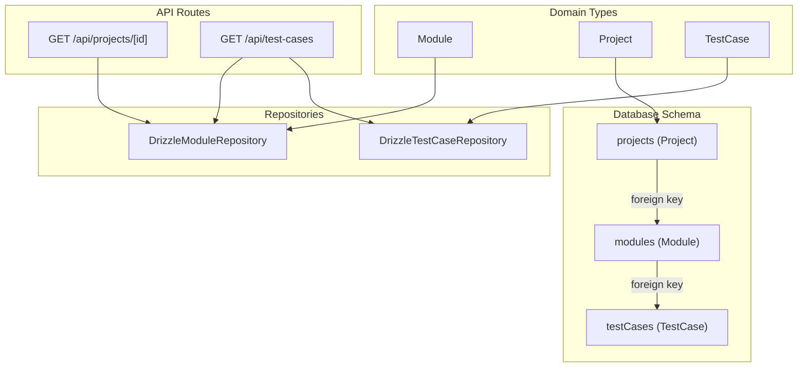
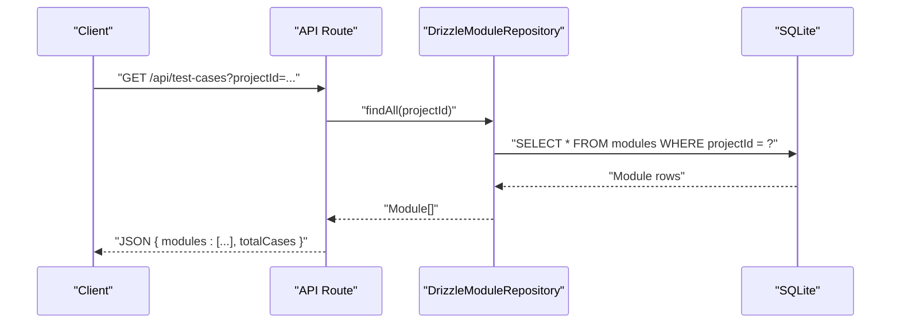
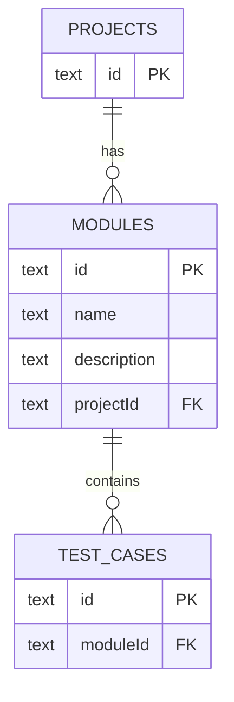
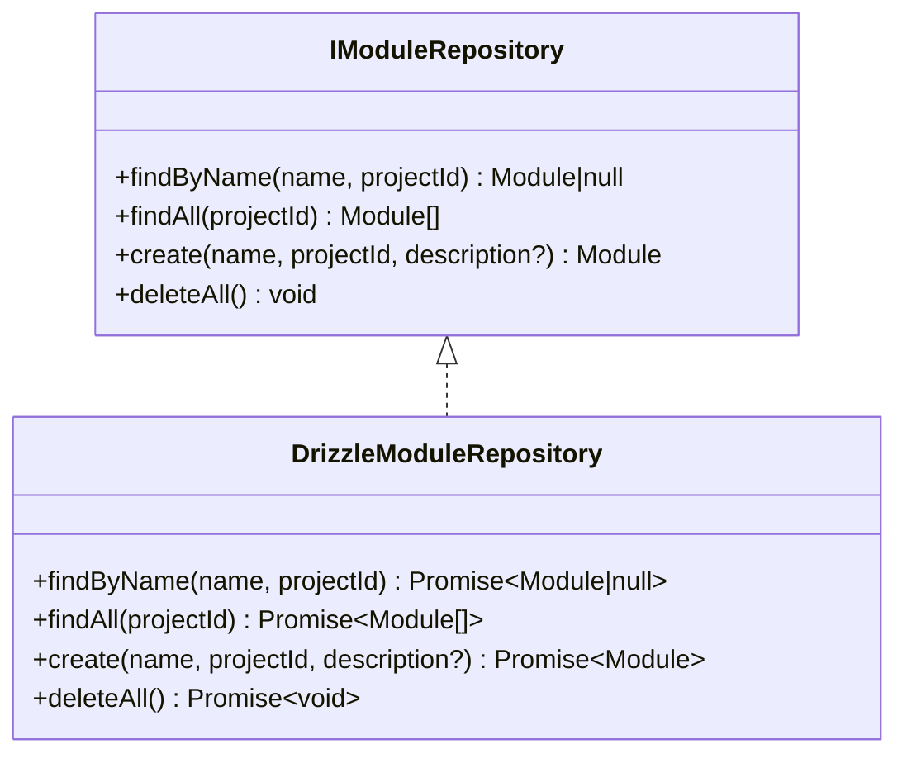
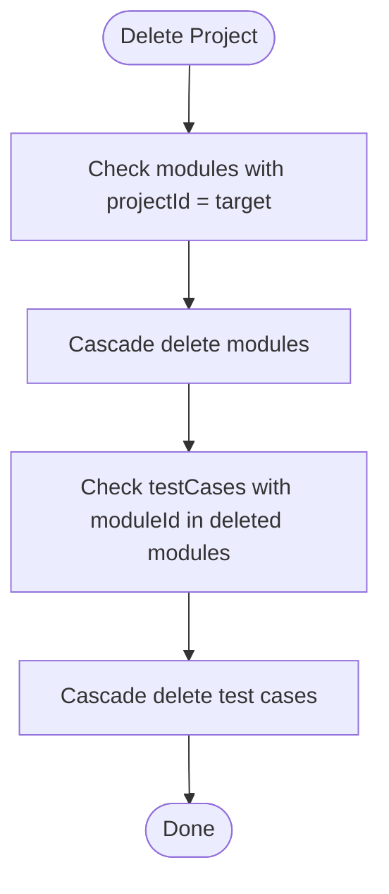
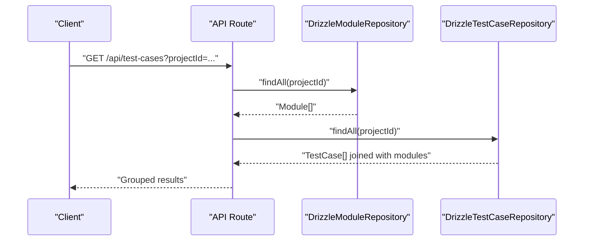
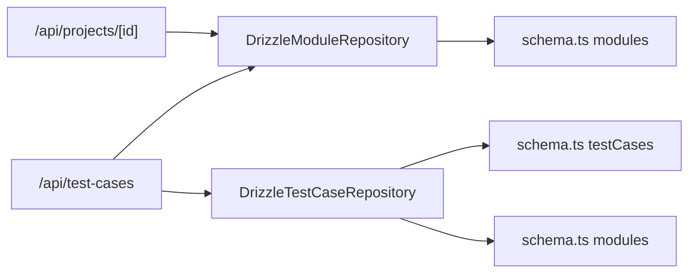

# Modules Table

<cite>
**Referenced Files in This Document**
- [schema.ts](file://src/infrastructure/db/schema.ts)
- [DrizzleModuleRepository.ts](file://src/adapters/persistence/drizzle/DrizzleModuleRepository.ts)
- [IModuleRepository.ts](file://src/domain/ports/repositories/IModuleRepository.ts)
- [index.ts](file://src/domain/types/index.ts)
- [DrizzleTestCaseRepository.ts](file://src/adapters/persistence/drizzle/DrizzleTestCaseRepository.ts)
- [container.ts](file://src/infrastructure/container.ts)
- [route.ts](file://app/api/projects/[id]/route.ts)
- [route.ts](file://app/api/test-cases/route.ts)
- [drizzle.config.ts](file://drizzle.config.ts)
</cite>

## Table of Contents
1. [Introduction](#introduction)
2. [Project Structure](#project-structure)
3. [Core Components](#core-components)
4. [Architecture Overview](#architecture-overview)
5. [Detailed Component Analysis](#detailed-component-analysis)
6. [Dependency Analysis](#dependency-analysis)
7. [Performance Considerations](#performance-considerations)
8. [Troubleshooting Guide](#troubleshooting-guide)
9. [Conclusion](#conclusion)

## Introduction
This document describes the Modules table entity used to organize test cases within projects. It explains the table structure, relationships, cascade delete behavior, validation rules, indexing strategies, and common query patterns. It also covers how modules enable hierarchical organization of test cases and how cascading deletes propagate when projects are removed.

## Project Structure
The Modules table is defined in the database schema and accessed through a repository abstraction layered in the domain. The API routes orchestrate operations that involve modules and test cases.

**Diagram sources**
- [schema.ts:17-32](file://src/infrastructure/db/schema.ts#L17-L32)
- [index.ts:16-32](file://src/domain/types/index.ts#L16-L32)
- [DrizzleModuleRepository.ts:7-33](file://src/adapters/persistence/drizzle/DrizzleModuleRepository.ts#L7-L33)
- [DrizzleTestCaseRepository.ts:7-71](file://src/adapters/persistence/drizzle/DrizzleTestCaseRepository.ts#L7-L71)
- [route.ts:1-42](file://app/api/projects/[id]/route.ts#L1-L42)
- [route.ts:1-36](file://app/api/test-cases/route.ts#L1-L36)

**Section sources**
- [schema.ts:17-32](file://src/infrastructure/db/schema.ts#L17-L32)
- [index.ts:16-32](file://src/domain/types/index.ts#L16-L32)
- [drizzle.config.ts:1-10](file://drizzle.config.ts#L1-L10)

## Core Components
- Modules table definition with primary key id, name, description, and projectId foreign key to projects.
- Cascade delete configured so removing a project removes all associated modules and test cases.
- Module entity type used across the domain.
- Module repository interface and Drizzle implementation for CRUD operations.
- Test case repository demonstrates module-project joins and filtering by projectId.

**Section sources**
- [schema.ts:17-22](file://src/infrastructure/db/schema.ts#L17-L22)
- [index.ts:16-21](file://src/domain/types/index.ts#L16-L21)
- [IModuleRepository.ts:3-8](file://src/domain/ports/repositories/IModuleRepository.ts#L3-L8)
- [DrizzleModuleRepository.ts:7-33](file://src/adapters/persistence/drizzle/DrizzleModuleRepository.ts#L7-L33)
- [DrizzleTestCaseRepository.ts:18-35](file://src/adapters/persistence/drizzle/DrizzleTestCaseRepository.ts#L18-L35)

## Architecture Overview
The Modules table participates in a three-tier relationship: projects → modules → test cases. Deletions cascade from projects to modules and from modules to test cases. The API routes coordinate retrieval and grouping of modules and test cases for a given project.

**Diagram sources**
- [route.ts:8-28](file://app/api/test-cases/route.ts#L8-L28)
- [DrizzleModuleRepository.ts:21-23](file://src/adapters/persistence/drizzle/DrizzleModuleRepository.ts#L21-L23)

**Section sources**
- [route.ts:8-28](file://app/api/test-cases/route.ts#L8-L28)
- [DrizzleModuleRepository.ts:21-23](file://src/adapters/persistence/drizzle/DrizzleModuleRepository.ts#L21-L23)

## Detailed Component Analysis

### Modules Table Definition
- Primary key: id (text, UUID-like, generated by cuid2)
- Required fields: name (text)
- Optional fields: description (text)
- Foreign key: projectId (text) referencing projects.id with onDelete: 'cascade'
- No explicit indexes are declared for modules; queries rely on projectId equality and implicit indices.

**Diagram sources**
- [schema.ts:17-32](file://src/infrastructure/db/schema.ts#L17-L32)

**Section sources**
- [schema.ts:17-22](file://src/infrastructure/db/schema.ts#L17-L22)

### Module Entity Type
- Represents the domain model with id, name, description, and projectId.
- Used by repositories and services to exchange typed data.

**Section sources**
- [index.ts:16-21](file://src/domain/types/index.ts#L16-L21)

### Module Repository Interface
- Defines methods for finding by name and projectId, fetching all modules for a project, creating modules, and bulk deletion.

**Section sources**
- [IModuleRepository.ts:3-8](file://src/domain/ports/repositories/IModuleRepository.ts#L3-L8)

### Drizzle Module Repository Implementation
- findByName(name, projectId): fetches a unique module by name and project.
- findAll(projectId): retrieves all modules for a project.
- create(name, projectId, description?): inserts a new module and returns it.
- deleteAll(): clears all modules (administrative operation).

**Diagram sources**
- [IModuleRepository.ts:3-8](file://src/domain/ports/repositories/IModuleRepository.ts#L3-L8)
- [DrizzleModuleRepository.ts:7-33](file://src/adapters/persistence/drizzle/DrizzleModuleRepository.ts#L7-L33)

**Section sources**
- [DrizzleModuleRepository.ts:7-33](file://src/adapters/persistence/drizzle/DrizzleModuleRepository.ts#L7-L33)

### Relationship to Test Cases
- Test cases belong to modules via moduleId, which references modules.id.
- The test case repository demonstrates joining testCases with modules to filter by projectId.

**Section sources**
- [schema.ts:31](file://src/infrastructure/db/schema.ts#L31)
- [DrizzleTestCaseRepository.ts:18-35](file://src/adapters/persistence/drizzle/DrizzleTestCaseRepository.ts#L18-L35)

### Hierarchical Organization Concept
- Modules group related test cases within a project.
- The API groups test cases by module for a given project, enabling hierarchical presentation of modules and their contained test cases.

**Section sources**
- [route.ts:21-27](file://app/api/test-cases/route.ts#L21-L27)

### Cascade Delete Behavior
- When a project is deleted, modules with projectId pointing to the deleted project are removed due to onDelete: 'cascade'.
- When a module is deleted, all test cases with moduleId pointing to the deleted module are removed due to cascade.

**Diagram sources**
- [schema.ts:21](file://src/infrastructure/db/schema.ts#L21)
- [schema.ts:31](file://src/infrastructure/db/schema.ts#L31)

**Section sources**
- [schema.ts:21](file://src/infrastructure/db/schema.ts#L21)
- [schema.ts:31](file://src/infrastructure/db/schema.ts#L31)

### Examples of Module Hierarchies
- A project can contain multiple modules (e.g., Authentication, Payment, UI).
- Each module contains multiple test cases organized by functional area or feature subset.
- The API route aggregates test cases per module for a given project, enabling hierarchical navigation.

**Section sources**
- [route.ts:21-27](file://app/api/test-cases/route.ts#L21-L27)

### Common Query Patterns
- Retrieve all modules for a project: use findAll(projectId) in the module repository.
- Find a module by name within a project: use findByName(name, projectId).
- Group test cases by module for a project: fetch modules and test cases concurrently, then group by module.id.

**Diagram sources**
- [route.ts:8-28](file://app/api/test-cases/route.ts#L8-L28)
- [DrizzleModuleRepository.ts:21-23](file://src/adapters/persistence/drizzle/DrizzleModuleRepository.ts#L21-L23)
- [DrizzleTestCaseRepository.ts:18-35](file://src/adapters/persistence/drizzle/DrizzleTestCaseRepository.ts#L18-L35)

**Section sources**
- [DrizzleModuleRepository.ts:21-23](file://src/adapters/persistence/drizzle/DrizzleModuleRepository.ts#L21-L23)
- [DrizzleTestCaseRepository.ts:18-35](file://src/adapters/persistence/drizzle/DrizzleTestCaseRepository.ts#L18-L35)
- [route.ts:8-28](file://app/api/test-cases/route.ts#L8-L28)

### Validation Rules and Constraints
- name is required (notNull).
- description is optional (nullable).
- projectId is required and must reference an existing project (foreign key constraint).
- Cascade delete is enforced on both project and module deletions.

**Section sources**
- [schema.ts:19-22](file://src/infrastructure/db/schema.ts#L19-L22)

### Indexing Strategies
- No explicit indexes are defined for the modules table in the schema.
- Queries commonly filter by projectId, which implies that an index on projectId would improve performance for findAll(projectId) and join operations.
- Consider adding an index on modules.projectId for better lookup performance at the cost of write-time overhead.

**Section sources**
- [schema.ts:17-22](file://src/infrastructure/db/schema.ts#L17-L22)

## Dependency Analysis
- The module repository depends on the database schema and Drizzle ORM.
- The test case repository depends on both testCases and modules tables to join and filter by projectId.
- The API routes depend on repositories to serve grouped module and test case data.

**Diagram sources**
- [DrizzleModuleRepository.ts:1-5](file://src/adapters/persistence/drizzle/DrizzleModuleRepository.ts#L1-L5)
- [DrizzleTestCaseRepository.ts:1-5](file://src/adapters/persistence/drizzle/DrizzleTestCaseRepository.ts#L1-L5)
- [schema.ts:17-32](file://src/infrastructure/db/schema.ts#L17-L32)
- [route.ts:1-42](file://app/api/projects/[id]/route.ts#L1-L42)
- [route.ts:1-36](file://app/api/test-cases/route.ts#L1-L36)

**Section sources**
- [container.ts:37-42](file://src/infrastructure/container.ts#L37-L42)
- [DrizzleModuleRepository.ts:1-5](file://src/adapters/persistence/drizzle/DrizzleModuleRepository.ts#L1-L5)
- [DrizzleTestCaseRepository.ts:1-5](file://src/adapters/persistence/drizzle/DrizzleTestCaseRepository.ts#L1-L5)

## Performance Considerations
- Add an index on modules.projectId to optimize queries filtering by project.
- Use batch operations for administrative tasks (e.g., deleteAll) to minimize round trips.
- Leverage concurrent fetching of modules and test cases when building grouped views.

[No sources needed since this section provides general guidance]

## Troubleshooting Guide
- If deleting a project does not remove modules or test cases, verify the foreign key constraints and cascade delete configuration in the schema.
- If queries are slow, consider adding an index on modules.projectId.
- When integrating with API routes, ensure projectId is provided for operations that filter by project.

**Section sources**
- [schema.ts:21](file://src/infrastructure/db/schema.ts#L21)
- [schema.ts:31](file://src/infrastructure/db/schema.ts#L31)

## Conclusion
The Modules table organizes test cases within projects and supports hierarchical grouping. Its design leverages cascade deletes to maintain referential integrity when projects or modules are removed. By adding targeted indexes and using the provided repository APIs, applications can efficiently query and manage modules and their related test cases.