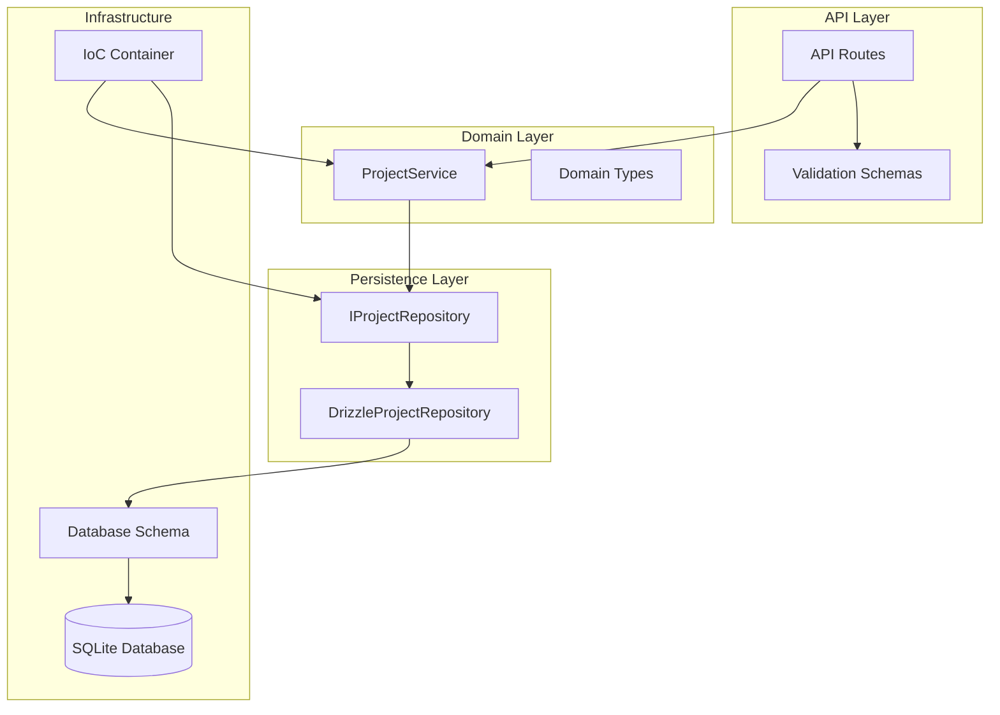
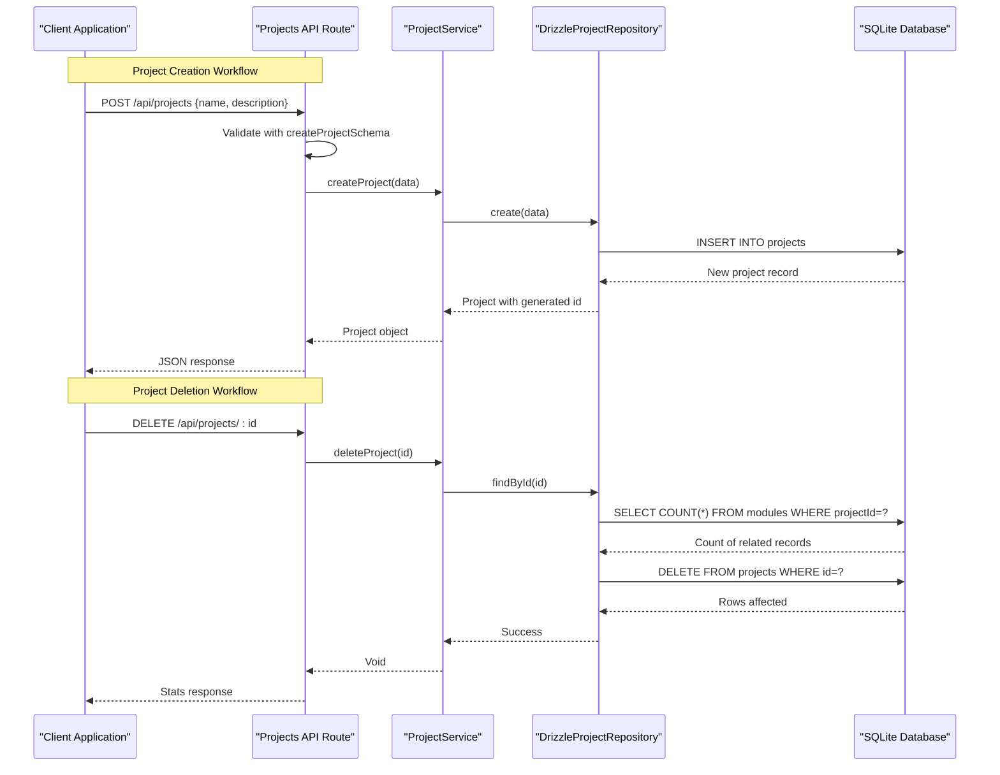
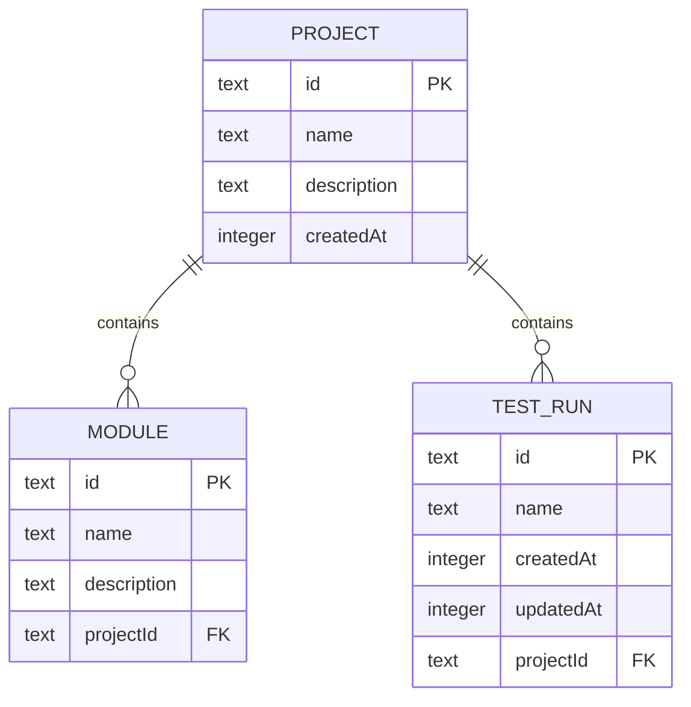
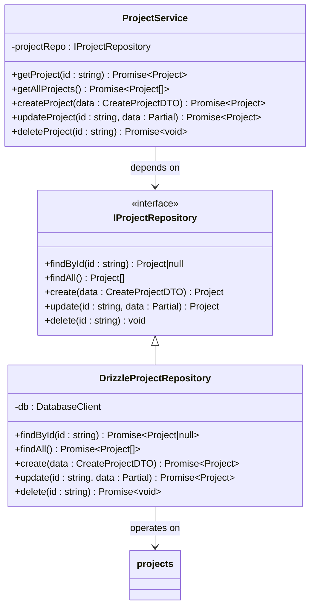
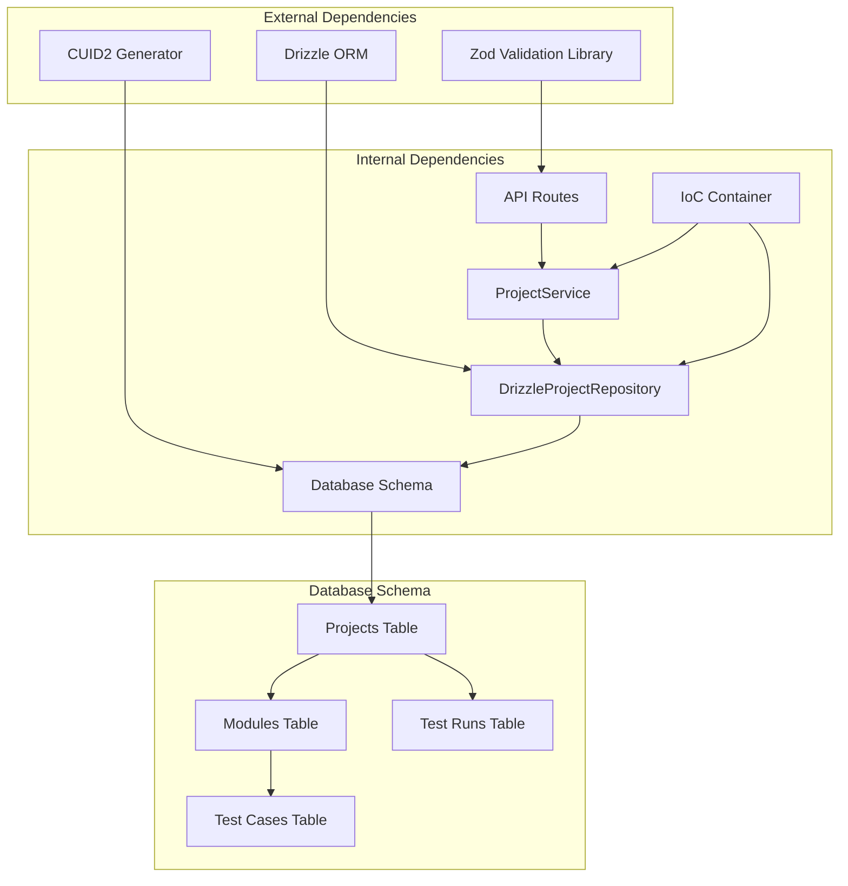
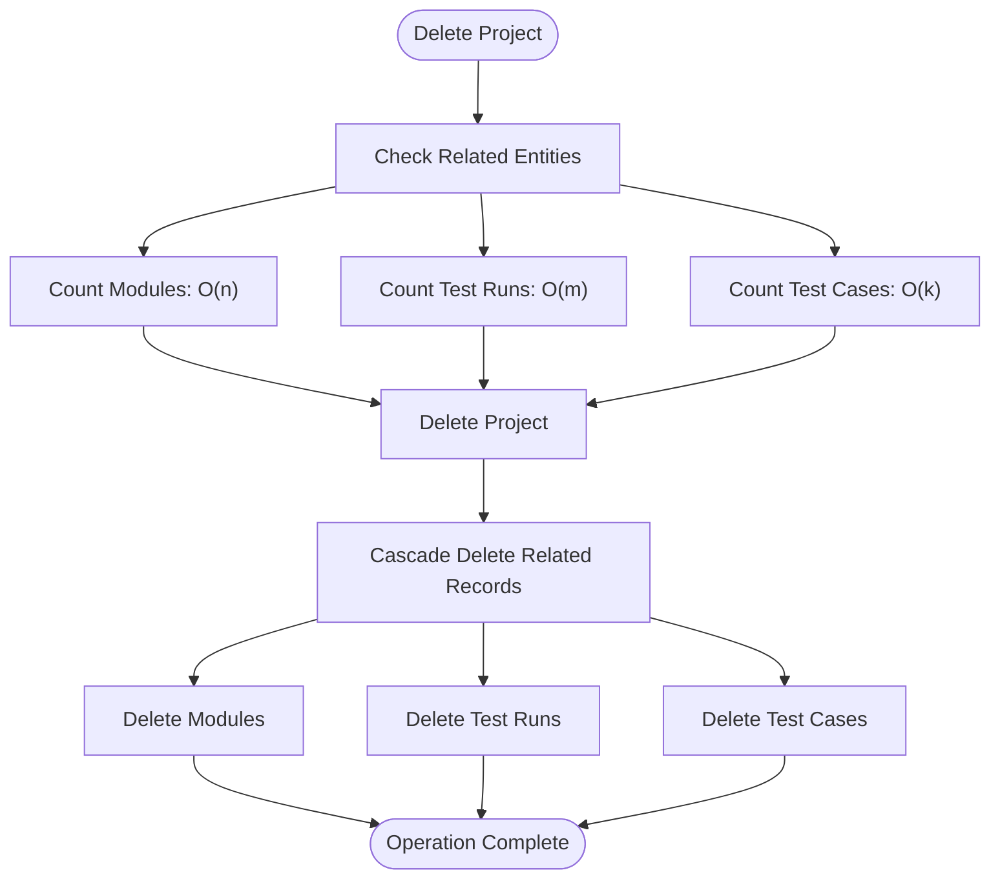

# Projects Table

<cite>
**Referenced Files in This Document**
- [schema.ts](file://src/infrastructure/db/schema.ts)
- [DrizzleProjectRepository.ts](file://src/adapters/persistence/drizzle/DrizzleProjectRepository.ts)
- [IProjectRepository.ts](file://src/domain/ports/repositories/IProjectRepository.ts)
- [ProjectService.ts](file://src/domain/services/ProjectService.ts)
- [route.ts](file://app/api/projects/route.ts)
- [route.ts](file://app/api/projects/[id]/route.ts)
- [schemas.ts](file://app/api/_lib/schemas.ts)
- [container.ts](file://src/infrastructure/container.ts)
- [drizzle.config.ts](file://drizzle.config.ts)
</cite>

## Table of Contents
1. [Introduction](#introduction)
2. [Project Structure](#project-structure)
3. [Core Components](#core-components)
4. [Architecture Overview](#architecture-overview)
5. [Detailed Component Analysis](#detailed-component-analysis)
6. [Dependency Analysis](#dependency-analysis)
7. [Performance Considerations](#performance-considerations)
8. [Troubleshooting Guide](#troubleshooting-guide)
9. [Conclusion](#conclusion)

## Introduction
The Projects table serves as the primary organizational container for test automation assets in the system. It represents the top-level grouping mechanism that organizes Modules (test suites), Test Cases (individual test scenarios), and Test Runs (executions of test suites). Projects encapsulate the business context for test execution and provide the foundation for hierarchical organization of testing artifacts.

The table structure follows modern database design principles with automatic identifier generation, timestamp management, and referential integrity enforcement. It supports the core business requirement of maintaining isolated test environments while enabling efficient querying and reporting across test organizations.

## Project Structure
The Projects table implementation spans multiple architectural layers, demonstrating clean separation of concerns and adherence to domain-driven design principles.

**Diagram sources**
- [route.ts:1-19](file://app/api/projects/route.ts#L1-L19)
- [ProjectService.ts:1-38](file://src/domain/services/ProjectService.ts#L1-L38)
- [DrizzleProjectRepository.ts:1-52](file://src/adapters/persistence/drizzle/DrizzleProjectRepository.ts#L1-L52)
- [schema.ts:10-15](file://src/infrastructure/db/schema.ts#L10-L15)

**Section sources**
- [schema.ts:10-15](file://src/infrastructure/db/schema.ts#L10-L15)
- [drizzle.config.ts:1-11](file://drizzle.config.ts#L1-L11)

## Core Components

### Database Schema Definition
The Projects table is defined using Drizzle ORM with explicit field specifications and constraints:

| Field | Type | Constraints | Description |
|-------|------|-------------|-------------|
| id | TEXT | PRIMARY KEY, AUTOGENERATED | Unique identifier using cuid2 generation |
| name | TEXT | NOT NULL | Project display name (1-200 characters) |
| description | TEXT | NULLABLE | Optional project description (up to 1000 characters) |
| createdAt | INTEGER | DEFAULT NOW | Timestamp of project creation |

### Business Purpose and Organization
Projects serve as the fundamental organizational unit that enables:
- **Hierarchical Test Organization**: Projects contain Modules, which contain Test Cases, which are executed in Test Runs
- **Isolation**: Separate test environments for different product areas or releases
- **Scoping**: Logical boundaries for test execution, reporting, and resource management
- **Multi-tenancy**: Support for multiple independent test organizations within a single system instance

### Data Validation Rules
The system enforces comprehensive validation at multiple layers:

**API Level Validation**:
- Name: Required, min 1 character, max 200 characters
- Description: Optional, max 1000 characters
- Project ID: Required for update/delete operations

**Database Level Constraints**:
- Primary key enforcement on id field
- NOT NULL constraint on name field
- Automatic timestamp generation for createdAt
- Foreign key relationships with cascade delete behavior

**Section sources**
- [schema.ts:10-15](file://src/infrastructure/db/schema.ts#L10-L15)
- [schemas.ts:5-8](file://app/api/_lib/schemas.ts#L5-L8)
- [IProjectRepository.ts:3-9](file://src/domain/ports/repositories/IProjectRepository.ts#L3-L9)

## Architecture Overview

**Diagram sources**
- [route.ts:13-18](file://app/api/projects/route.ts#L13-L18)
- [route.ts:22-42](file://app/api/projects/[id]/route.ts#L22-L42)
- [ProjectService.ts:22-36](file://src/domain/services/ProjectService.ts#L22-L36)
- [DrizzleProjectRepository.ts:26-50](file://src/adapters/persistence/drizzle/DrizzleProjectRepository.ts#L26-L50)

## Detailed Component Analysis

### Database Schema Implementation
The Projects table definition demonstrates careful consideration of modern database design patterns:

**Diagram sources**
- [schema.ts:10-40](file://src/infrastructure/db/schema.ts#L10-L40)

**Key Implementation Details**:
- **Identifier Generation**: Uses cuid2 library for globally unique identifiers
- **Timestamp Management**: Automatic creation timestamps with default function
- **Cascade Delete**: Enforced at database level for related entities
- **Foreign Key Relationships**: Maintains referential integrity across the hierarchy

### Repository Pattern Implementation
The DrizzleProjectRepository provides a clean abstraction over database operations:

**Diagram sources**
- [IProjectRepository.ts:3-9](file://src/domain/ports/repositories/IProjectRepository.ts#L3-L9)
- [DrizzleProjectRepository.ts:7-51](file://src/adapters/persistence/drizzle/DrizzleProjectRepository.ts#L7-L51)
- [ProjectService.ts:9-37](file://src/domain/services/ProjectService.ts#L9-L37)

**Section sources**
- [DrizzleProjectRepository.ts:1-52](file://src/adapters/persistence/drizzle/DrizzleProjectRepository.ts#L1-L52)
- [IProjectRepository.ts:1-10](file://src/domain/ports/repositories/IProjectRepository.ts#L1-L10)

### API Layer Integration
The API routes provide RESTful endpoints with comprehensive error handling and validation:

**Common Operations**:

1. **Project Creation**:
   - Endpoint: `POST /api/projects`
   - Validation: Zod schema ensures name length and description constraints
   - Response: Complete project object with generated id and timestamp

2. **Project Retrieval**:
   - Endpoint: `GET /api/projects` (all projects)
   - Endpoint: `GET /api/projects/:id` (single project)
   - Response: Project object with parsed Date for createdAt field

3. **Project Updates**:
   - Endpoint: `PUT /api/projects/:id`
   - Validation: Same schema as creation
   - Response: Updated project object

4. **Project Deletion**:
   - Endpoint: `DELETE /api/projects/:id`
   - Behavior: Cascade delete removes all related modules, test cases, and test runs
   - Response: Deletion confirmation with statistics

**Section sources**
- [route.ts:1-19](file://app/api/projects/route.ts#L1-L19)
- [route.ts:1-43](file://app/api/projects/[id]/route.ts#L1-L43)

### Domain Service Layer
The ProjectService coordinates business logic and ensures proper error handling:

**Business Logic Features**:
- **NotFoundError Handling**: Throws descriptive errors when projects don't exist
- **Data Transformation**: Converts database timestamps to JavaScript Date objects
- **Repository Abstraction**: Provides clean interface for persistence operations
- **Validation Integration**: Works seamlessly with API-level validation

**Section sources**
- [ProjectService.ts:1-38](file://src/domain/services/ProjectService.ts#L1-L38)

## Dependency Analysis

**Diagram sources**
- [container.ts:1-126](file://src/infrastructure/container.ts#L1-L126)
- [schema.ts:1-60](file://src/infrastructure/db/schema.ts#L1-L60)

**Key Dependencies**:
- **Zod**: Provides runtime validation for API requests
- **CUID2**: Generates globally unique identifiers
- **Drizzle ORM**: Handles database operations and migrations
- **SQLite**: Underlying database engine

**Section sources**
- [container.ts:1-126](file://src/infrastructure/container.ts#L1-L126)
- [schema.ts:1-60](file://src/infrastructure/db/schema.ts#L1-L60)

## Performance Considerations

### Query Patterns and Optimization
The Projects table supports several common query patterns optimized for performance:

**Single Project Retrieval**:
- Index: Primary key on id field
- Complexity: O(log n) for indexed lookup
- Use case: Project detail pages, individual project operations

**Bulk Project Listing**:
- No special indexes required
- Complexity: O(n) for full table scan
- Use case: Dashboard listings, project selection dropdowns

**Filtering and Sorting**:
- Available filters: name (substring matching), createdAt (date range)
- Recommended indexes: name (if frequently searched), createdAt (for chronological queries)
- Performance impact: Minimal for small to medium datasets

### Cascade Delete Performance
The cascade delete operation follows this execution pattern:

**Diagram sources**
- [schema.ts:21-49](file://src/infrastructure/db/schema.ts#L21-L49)
- [route.ts:26-32](file://app/api/projects/[id]/route.ts#L26-L32)

**Performance Characteristics**:
- **Time Complexity**: O(n + m + k) where n, m, k are counts of related entities
- **Database Impact**: Single transaction with cascading deletes
- **Memory Usage**: Minimal, proportional to number of related records

### Storage and Memory Considerations
- **Identifier Size**: CUID2 generates 24-character strings, minimal storage overhead
- **Timestamp Storage**: Integer timestamps require 8 bytes per record
- **String Fields**: Variable-length text fields with reasonable limits
- **Index Overhead**: Primary key index adds ~8 bytes per record for indexing

## Troubleshooting Guide

### Common Issues and Solutions

**Project Not Found Errors**:
- **Symptoms**: 404 errors when accessing non-existent projects
- **Cause**: Project ID doesn't exist in database
- **Solution**: Verify project ID or recreate the project

**Validation Failures**:
- **Name Too Long**: Error when name exceeds 200 characters
- **Missing Name**: Error when name is empty or null
- **Description Too Long**: Error when description exceeds 1000 characters

**Database Integrity Issues**:
- **Foreign Key Violations**: Attempting to create entities without valid project references
- **Cascade Delete Problems**: Issues with deleting projects that have related entities

**Performance Issues**:
- **Slow Queries**: Large project lists causing slow loading
- **Memory Usage**: High memory consumption with large datasets

### Debugging Strategies

**API-Level Debugging**:
1. Verify request payload structure matches validation schema
2. Check response status codes and error messages
3. Monitor API response times for performance analysis

**Database-Level Debugging**:
1. Query project existence before operations
2. Check related entity counts before deletion
3. Monitor database transaction logs

**Section sources**
- [ProjectService.ts:12-16](file://src/domain/services/ProjectService.ts#L12-L16)
- [schemas.ts:5-8](file://app/api/_lib/schemas.ts#L5-L8)

## Conclusion
The Projects table implementation demonstrates robust architecture design with clear separation of concerns, comprehensive validation, and efficient database operations. The system provides reliable project management capabilities with proper error handling and performance considerations.

Key strengths include:
- **Clean Architecture**: Well-separated layers with clear responsibilities
- **Strong Validation**: Multi-layer validation prevents data inconsistencies
- **Efficient Operations**: Optimized for common use cases like project creation and listing
- **Proper Cleanup**: Cascade delete ensures database integrity
- **Extensible Design**: Easy to add new fields or modify behavior

The implementation supports the core business requirement of organizing test automation assets while maintaining performance and reliability for production use.