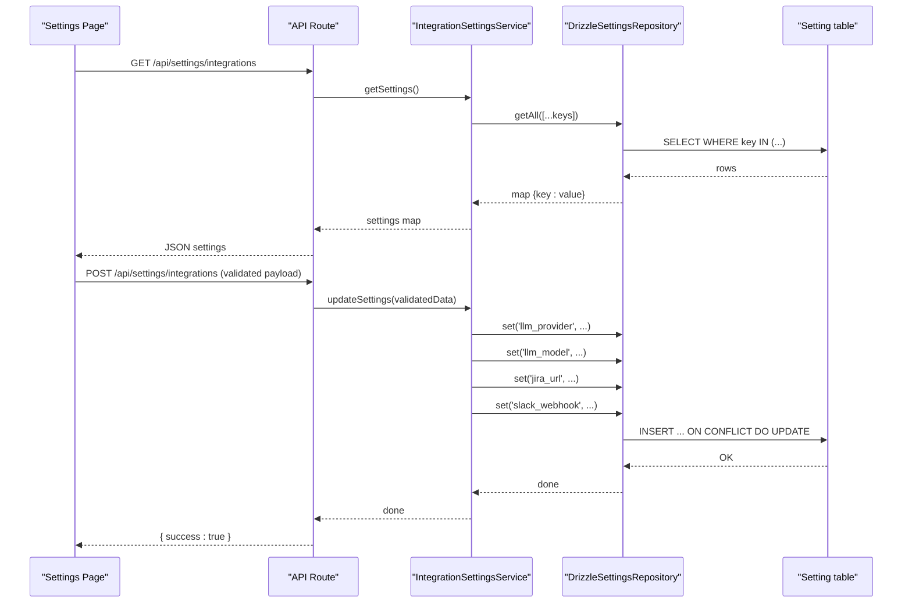
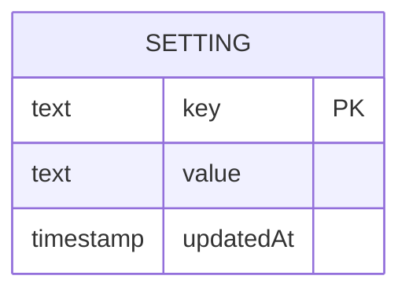
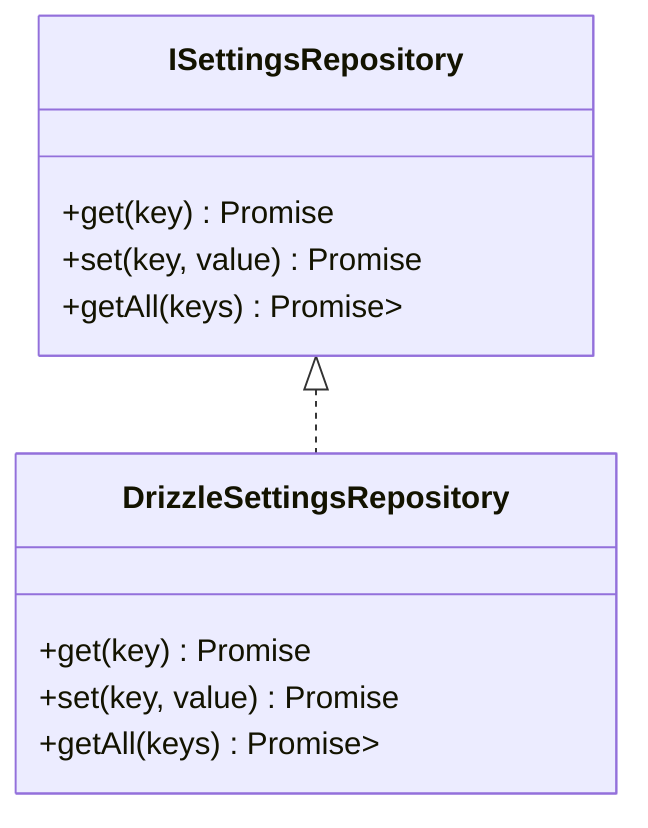
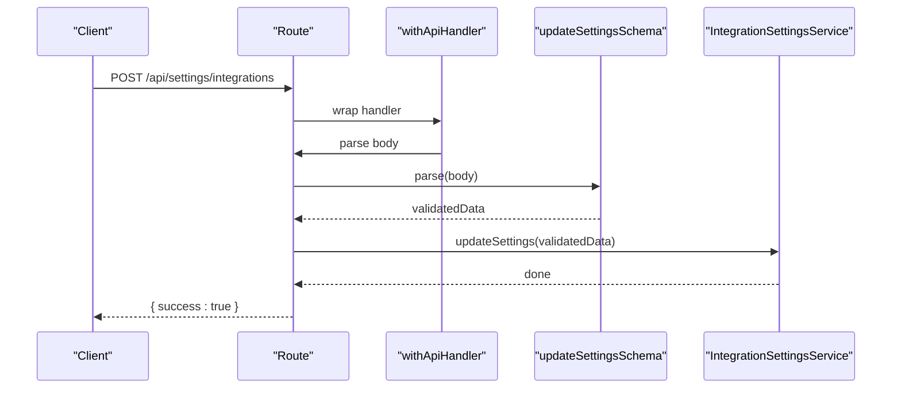
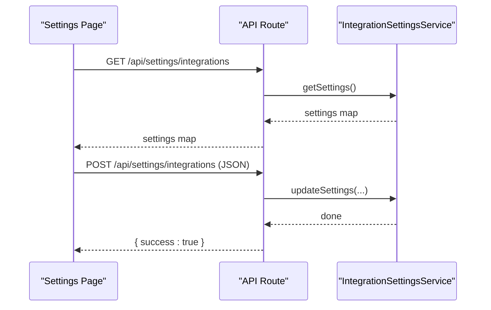
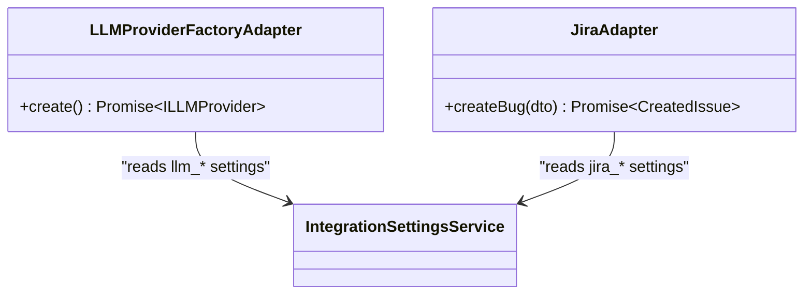
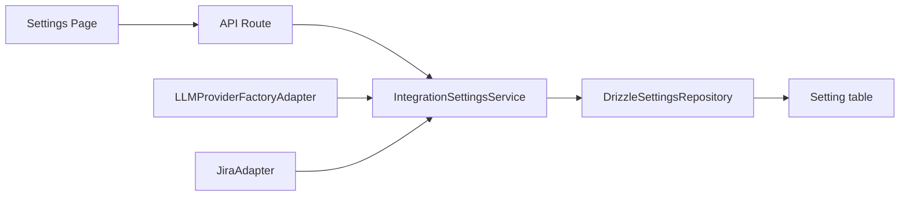

# Settings Table

<cite>
**Referenced Files in This Document**
- [schema.ts](file://src/infrastructure/db/schema.ts)
- [DrizzleSettingsRepository.ts](file://src/adapters/persistence/drizzle/DrizzleSettingsRepository.ts)
- [ISettingsRepository.ts](file://src/domain/ports/repositories/ISettingsRepository.ts)
- [IntegrationSettingsService.ts](file://src/domain/services/IntegrationSettingsService.ts)
- [LLMProviderFactoryAdapter.ts](file://src/adapters/llm/LLMProviderFactoryAdapter.ts)
- [JiraAdapter.ts](file://src/adapters/issue-tracker/JiraAdapter.ts)
- [container.ts](file://src/infrastructure/container.ts)
- [schemas.ts](file://app/api/_lib/schemas.ts)
- [route.ts](file://app/api/settings/integrations/route.ts)
- [page.tsx](file://app/settings/page.tsx)
</cite>

## Table of Contents
1. [Introduction](#introduction)
2. [Project Structure](#project-structure)
3. [Core Components](#core-components)
4. [Architecture Overview](#architecture-overview)
5. [Detailed Component Analysis](#detailed-component-analysis)
6. [Dependency Analysis](#dependency-analysis)
7. [Performance Considerations](#performance-considerations)
8. [Troubleshooting Guide](#troubleshooting-guide)
9. [Conclusion](#conclusion)

## Introduction
This document describes the Settings table entity and the key-value configuration system used across the application. The Settings table stores application-wide configuration as string-based key-value pairs with a timestamp of last update. It powers AI provider configurations, external service integrations (Jira, Slack), and runtime preferences. Values are stored as strings and can represent primitive values or serialized JSON for complex configurations.

## Project Structure
The Settings system spans the database schema, persistence adapter, domain service, API layer, and frontend UI:
- Database schema defines the Setting table with key, value, and updatedAt fields
- A repository abstraction defines get/set/getAll operations
- A concrete repository persists settings to SQLite/PostgreSQL via Drizzle ORM
- A domain service orchestrates integration settings retrieval and updates
- An API route exposes settings endpoints with Zod validation
- The frontend Settings page loads and saves settings via the API

```mermaid
graph TB
subgraph "Database Layer"
S["Setting table<br/>key (PK), value, updatedAt"]
end
subgraph "Persistence"
R["DrizzleSettingsRepository<br/>get/set/getAll"]
end
subgraph "Domain"
IS["ISettingsRepository interface"]
ISS["IntegrationSettingsService<br/>getSettings/updateSettings"]
end
subgraph "Adapters"
LLMF["LLMProviderFactoryAdapter<br/>reads llm_* settings"]
JA["JiraAdapter<br/>reads jira_* settings"]
end
subgraph "API"
API["/api/settings/integrations<br/>GET/POST"]
SCH["updateSettingsSchema<br/>Zod validation"]
end
subgraph "UI"
UI["Settings Page<br/>loads/saves settings"]
end
S <-- "Drizzle ORM" --> R
IS < --> R
ISS --> IS
LLMF --> IS
JA --> ISS
API --> ISS
API --> SCH
UI --> API
```

**Diagram sources**
- [schema.ts:4-8](file://src/infrastructure/db/schema.ts#L4-L8)
- [DrizzleSettingsRepository.ts:6-28](file://src/adapters/persistence/drizzle/DrizzleSettingsRepository.ts#L6-L28)
- [ISettingsRepository.ts:1-6](file://src/domain/ports/repositories/ISettingsRepository.ts#L1-L6)
- [IntegrationSettingsService.ts:8-36](file://src/domain/services/IntegrationSettingsService.ts#L8-L36)
- [LLMProviderFactoryAdapter.ts:15-42](file://src/adapters/llm/LLMProviderFactoryAdapter.ts#L15-L42)
- [JiraAdapter.ts:4-32](file://src/adapters/issue-tracker/JiraAdapter.ts#L4-L32)
- [route.ts:8-18](file://app/api/settings/integrations/route.ts#L8-L18)
- [schemas.ts:31-41](file://app/api/_lib/schemas.ts#L31-L41)
- [page.tsx:30-78](file://app/settings/page.tsx#L30-L78)

**Section sources**
- [schema.ts:4-8](file://src/infrastructure/db/schema.ts#L4-L8)
- [DrizzleSettingsRepository.ts:6-28](file://src/adapters/persistence/drizzle/DrizzleSettingsRepository.ts#L6-L28)
- [ISettingsRepository.ts:1-6](file://src/domain/ports/repositories/ISettingsRepository.ts#L1-L6)
- [IntegrationSettingsService.ts:8-36](file://src/domain/services/IntegrationSettingsService.ts#L8-L36)
- [LLMProviderFactoryAdapter.ts:15-42](file://src/adapters/llm/LLMProviderFactoryAdapter.ts#L15-L42)
- [JiraAdapter.ts:4-32](file://src/adapters/issue-tracker/JiraAdapter.ts#L4-L32)
- [route.ts:8-18](file://app/api/settings/integrations/route.ts#L8-L18)
- [schemas.ts:31-41](file://app/api/_lib/schemas.ts#L31-L41)
- [page.tsx:30-78](file://app/settings/page.tsx#L30-L78)

## Core Components
- Setting table definition
  - key: text, primary key
  - value: text, not null
  - updatedAt: timestamp with default
- Repository contract
  - get(key): returns string or null
  - set(key, value): upserts with updated timestamp
  - getAll(keys): returns a map of key -> value for requested keys
- Integration settings service
  - getSettings(): retrieves a predefined set of integration-related keys
  - updateSettings(): conditionally writes provided settings to keys
- API endpoints
  - GET /api/settings/integrations: returns current settings map
  - POST /api/settings/integrations: validates payload and updates settings
- Frontend settings page
  - Loads settings on mount and saves them via POST

**Section sources**
- [schema.ts:4-8](file://src/infrastructure/db/schema.ts#L4-L8)
- [ISettingsRepository.ts:1-6](file://src/domain/ports/repositories/ISettingsRepository.ts#L1-L6)
- [DrizzleSettingsRepository.ts:6-28](file://src/adapters/persistence/drizzle/DrizzleSettingsRepository.ts#L6-L28)
- [IntegrationSettingsService.ts:11-35](file://src/domain/services/IntegrationSettingsService.ts#L11-L35)
- [route.ts:8-18](file://app/api/settings/integrations/route.ts#L8-L18)
- [page.tsx:30-78](file://app/settings/page.tsx#L30-L78)

## Architecture Overview
The Settings system follows layered architecture:
- Data access: Drizzle ORM maps Setting rows to repository methods
- Persistence: DrizzleSettingsRepository implements CRUD with conflict resolution
- Domain: IntegrationSettingsService encapsulates settings orchestration
- Application: API routes coordinate validation and service calls
- Presentation: Settings page manages UI state and network requests



**Diagram sources**
- [route.ts:8-18](file://app/api/settings/integrations/route.ts#L8-L18)
- [IntegrationSettingsService.ts:11-35](file://src/domain/services/IntegrationSettingsService.ts#L11-L35)
- [DrizzleSettingsRepository.ts:6-28](file://src/adapters/persistence/drizzle/DrizzleSettingsRepository.ts#L6-L28)
- [schema.ts:4-8](file://src/infrastructure/db/schema.ts#L4-L8)
- [page.tsx:30-78](file://app/settings/page.tsx#L30-L78)

## Detailed Component Analysis

### Settings Table Definition
- Fields
  - key: text, primary key; used as the unique identifier for each setting
  - value: text, not null; stores the setting value as a string
  - updatedAt: timestamp with default; auto-updated on insert or update
- Storage semantics
  - String-based storage supports primitives and serialized JSON
  - Conflict resolution on insert updates existing records by key



**Diagram sources**
- [schema.ts:4-8](file://src/infrastructure/db/schema.ts#L4-L8)

**Section sources**
- [schema.ts:4-8](file://src/infrastructure/db/schema.ts#L4-L8)

### Repository Pattern and Implementation
- Contract
  - get(key): returns string or null
  - set(key, value): persists/upserts the value and updates timestamp
  - getAll(keys): returns a map of requested keys to values
- Implementation
  - Uses Drizzle ORM select/insert with on-conflict-do-update targeting the primary key
  - getAll uses inArray for batch retrieval



**Diagram sources**
- [ISettingsRepository.ts:1-6](file://src/domain/ports/repositories/ISettingsRepository.ts#L1-L6)
- [DrizzleSettingsRepository.ts:6-28](file://src/adapters/persistence/drizzle/DrizzleSettingsRepository.ts#L6-L28)

**Section sources**
- [ISettingsRepository.ts:1-6](file://src/domain/ports/repositories/ISettingsRepository.ts#L1-L6)
- [DrizzleSettingsRepository.ts:6-28](file://src/adapters/persistence/drizzle/DrizzleSettingsRepository.ts#L6-L28)

### Integration Settings Service
- Purpose
  - Encapsulates retrieval and update of integration-related settings
  - Centralizes the set of keys used for LLM, Jira, and Slack configuration
- Operations
  - getSettings(): returns a map of predefined keys
  - updateSettings(): conditionally sets keys based on provided fields

```mermaid
flowchart TD
Start(["updateSettings called"]) --> CheckProvider{"provider provided?"}
CheckProvider --> |Yes| SetProvider["set('llm_provider', ...)"]
CheckProvider --> |No| CheckModel
SetProvider --> CheckModel{"model provided?"}
CheckModel --> |Yes| SetModel["set('llm_model', ...)"]
CheckModel --> |No| CheckBaseUrl
SetModel --> CheckBaseUrl{"baseUrl provided?"}
CheckBaseUrl --> |Yes| SetBaseUrl["set('llm_base_url', ...)"]
CheckBaseUrl --> |No| CheckApiKey
SetBaseUrl --> CheckApiKey{"apiKey provided?"}
CheckApiKey --> |Yes| SetApiKey["set('llm_api_key', ...)"]
CheckApiKey --> |No| CheckJiraUrl
SetApiKey --> CheckJiraUrl{"jiraUrl provided?"}
CheckJiraUrl --> |Yes| SetJiraUrl["set('jira_url', ...)"]
CheckJiraUrl --> |No| CheckJiraEmail
SetJiraUrl --> CheckJiraEmail{"jiraEmail provided?"}
CheckJiraEmail --> |Yes| SetJiraEmail["set('jira_email', ...)"]
CheckJiraEmail --> |No| CheckJiraToken
SetJiraEmail --> CheckJiraToken{"jiraToken provided?"}
CheckJiraToken --> |Yes| SetJiraToken["set('jira_token', ...)"]
CheckJiraToken --> |No| CheckJiraProject
SetJiraToken --> CheckJiraProject{"jiraProject provided?"}
CheckJiraProject --> |Yes| SetJiraProject["set('jira_project', ...)"]
CheckJiraProject --> |No| CheckSlack
SetJiraProject --> CheckSlack{"slackWebhook provided?"}
CheckSlack --> |Yes| SetSlack["set('slack_webhook', ...)"]
CheckSlack --> |No| End(["done"])
SetSlack --> End
```



**Diagram sources**
- [IntegrationSettingsService.ts:19-35](file://src/domain/services/IntegrationSettingsService.ts#L19-L35)

**Section sources**
- [IntegrationSettingsService.ts:11-35](file://src/domain/services/IntegrationSettingsService.ts#L11-L35)

### API Integration and Validation
- Endpoints
  - GET /api/settings/integrations: returns current settings map
  - POST /api/settings/integrations: validates request body and updates settings
- Validation
  - Zod schema enforces optional string fields for provider, model, baseUrl, apiKey, and Jira/Slack fields
- Container wiring
  - IntegrationSettingsService depends on ISettingsRepository (implemented by DrizzleSettingsRepository)



**Diagram sources**
- [route.ts:8-18](file://app/api/settings/integrations/route.ts#L8-L18)
- [schemas.ts:31-41](file://app/api/_lib/schemas.ts#L31-L41)
- [IntegrationSettingsService.ts:19-35](file://src/domain/services/IntegrationSettingsService.ts#L19-L35)

**Section sources**
- [route.ts:8-18](file://app/api/settings/integrations/route.ts#L8-L18)
- [schemas.ts:31-41](file://app/api/_lib/schemas.ts#L31-L41)
- [container.ts:46-50](file://src/infrastructure/container.ts#L46-L50)

### Frontend Settings Management
- Behavior
  - On mount, fetches settings and populates form fields
  - On save, sends a POST request with current values
  - Displays success/error notifications
- Keys handled
  - AI: llm_provider, llm_model, llm_base_url, llm_api_key
  - Jira: jira_url, jira_email, jira_token, jira_project
  - Slack: slack_webhook



**Diagram sources**
- [page.tsx:30-78](file://app/settings/page.tsx#L30-L78)
- [route.ts:8-18](file://app/api/settings/integrations/route.ts#L8-L18)
- [IntegrationSettingsService.ts:11-35](file://src/domain/services/IntegrationSettingsService.ts#L11-L35)

**Section sources**
- [page.tsx:30-78](file://app/settings/page.tsx#L30-L78)

### Runtime Configuration Consumers
- LLM Provider Factory
  - Reads llm_provider, llm_model, llm_base_url, llm_api_key to construct the appropriate LLM adapter
- Jira Adapter
  - Reads jira_url, jira_email, jira_token, jira_project to create issues
  - Validates that all required fields are present before proceeding



**Diagram sources**
- [LLMProviderFactoryAdapter.ts:15-42](file://src/adapters/llm/LLMProviderFactoryAdapter.ts#L15-L42)
- [IntegrationSettingsService.ts:11-17](file://src/domain/services/IntegrationSettingsService.ts#L11-L17)
- [JiraAdapter.ts:4-32](file://src/adapters/issue-tracker/JiraAdapter.ts#L4-L32)

**Section sources**
- [LLMProviderFactoryAdapter.ts:18-41](file://src/adapters/llm/LLMProviderFactoryAdapter.ts#L18-L41)
- [JiraAdapter.ts:7-16](file://src/adapters/issue-tracker/JiraAdapter.ts#L7-L16)

## Dependency Analysis
- Coupling
  - IntegrationSettingsService depends on ISettingsRepository
  - DrizzleSettingsRepository depends on Drizzle ORM and the Setting table
  - API route depends on IntegrationSettingsService and Zod schema
  - Adapters (LLMProviderFactoryAdapter, JiraAdapter) depend on IntegrationSettingsService
- Cohesion
  - Settings-related logic is centralized in IntegrationSettingsService
  - Persistence logic is isolated in DrizzleSettingsRepository
- External dependencies
  - Drizzle ORM for database access
  - Zod for request validation
  - Next.js App Router for API routes



**Diagram sources**
- [route.ts:8-18](file://app/api/settings/integrations/route.ts#L8-L18)
- [IntegrationSettingsService.ts:8-36](file://src/domain/services/IntegrationSettingsService.ts#L8-L36)
- [DrizzleSettingsRepository.ts:6-28](file://src/adapters/persistence/drizzle/DrizzleSettingsRepository.ts#L6-L28)
- [schema.ts:4-8](file://src/infrastructure/db/schema.ts#L4-L8)
- [LLMProviderFactoryAdapter.ts:15-42](file://src/adapters/llm/LLMProviderFactoryAdapter.ts#L15-L42)
- [JiraAdapter.ts:4-32](file://src/adapters/issue-tracker/JiraAdapter.ts#L4-L32)
- [page.tsx:30-78](file://app/settings/page.tsx#L30-L78)

**Section sources**
- [container.ts:33-91](file://src/infrastructure/container.ts#L33-L91)
- [route.ts:8-18](file://app/api/settings/integrations/route.ts#L8-L18)
- [IntegrationSettingsService.ts:8-36](file://src/domain/services/IntegrationSettingsService.ts#L8-L36)
- [DrizzleSettingsRepository.ts:6-28](file://src/adapters/persistence/drizzle/DrizzleSettingsRepository.ts#L6-L28)
- [schema.ts:4-8](file://src/infrastructure/db/schema.ts#L4-L8)
- [LLMProviderFactoryAdapter.ts:15-42](file://src/adapters/llm/LLMProviderFactoryAdapter.ts#L15-L42)
- [JiraAdapter.ts:4-32](file://src/adapters/issue-tracker/JiraAdapter.ts#L4-L32)
- [page.tsx:30-78](file://app/settings/page.tsx#L30-L78)

## Performance Considerations
- Batch reads: getAll performs a single query with inArray to minimize round trips
- Upsert strategy: insert with on-conflict-do-update avoids separate update queries
- Indexing: key is the primary key, ensuring efficient lookups and uniqueness
- JSON serialization: complex values can be stored as JSON strings; consider validation and size limits
- Concurrency: updatedAt is updated on each write; consider optimistic locking if needed

## Troubleshooting Guide
- Settings not loading in UI
  - Verify GET /api/settings/integrations returns expected keys
  - Confirm IntegrationSettingsService.getAll includes the intended keys
- Save fails
  - Check POST /api/settings/integrations request payload matches updateSettingsSchema
  - Ensure IntegrationSettingsService.updateSettings receives non-empty values for targeted keys
- Adapter misconfiguration
  - LLMProviderFactoryAdapter requires llm_provider and llm_model; missing values fall back to config defaults
  - JiraAdapter throws if jira_url, jira_email, jira_token, or jira_project are missing
- Data integrity
  - key uniqueness is enforced by primary key; duplicates are prevented by on-conflict-do-update

**Section sources**
- [route.ts:8-18](file://app/api/settings/integrations/route.ts#L8-L18)
- [schemas.ts:31-41](file://app/api/_lib/schemas.ts#L31-L41)
- [IntegrationSettingsService.ts:11-35](file://src/domain/services/IntegrationSettingsService.ts#L11-L35)
- [LLMProviderFactoryAdapter.ts:18-41](file://src/adapters/llm/LLMProviderFactoryAdapter.ts#L18-L41)
- [JiraAdapter.ts:14-16](file://src/adapters/issue-tracker/JiraAdapter.ts#L14-L16)

## Conclusion
The Settings table provides a flexible, string-backed key-value store for application configuration. Its design enables:
- Clear separation of concerns between persistence, domain, and presentation layers
- Centralized management of integration credentials and runtime preferences
- Scalable extension to new settings categories by adding keys and updating consumers
- Robust validation and safe persistence via Zod and Drizzle ORM