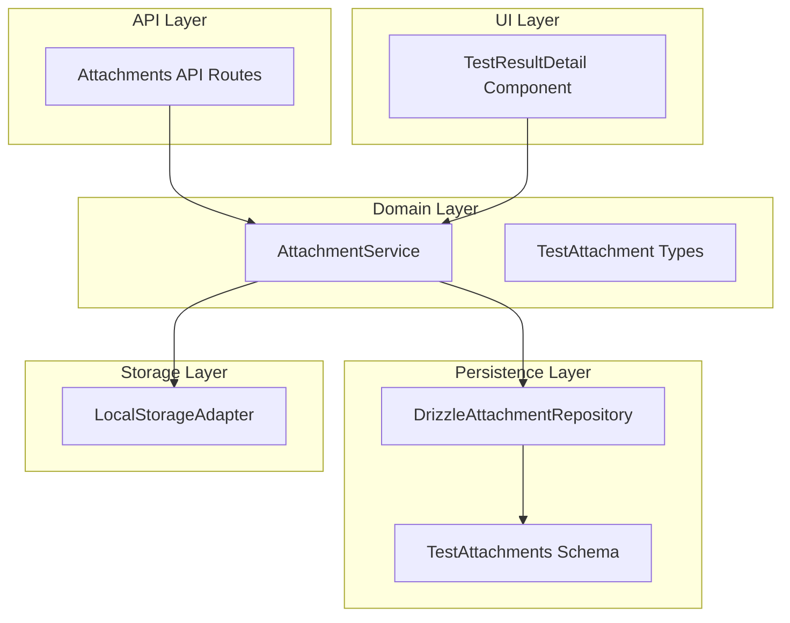
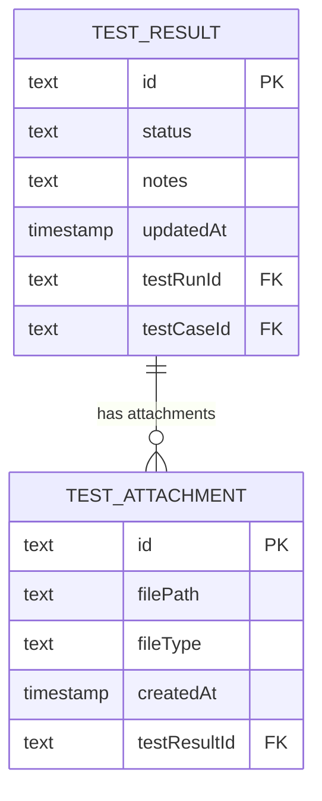
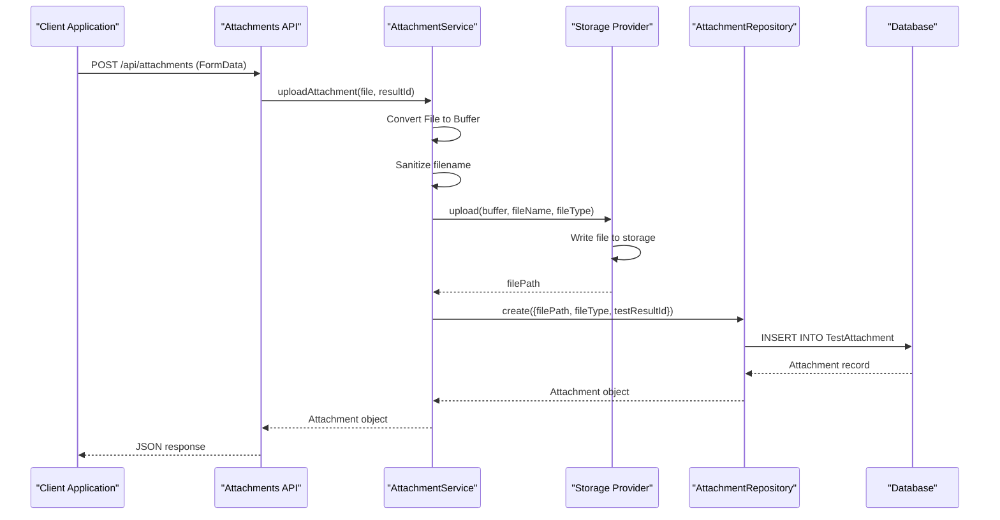
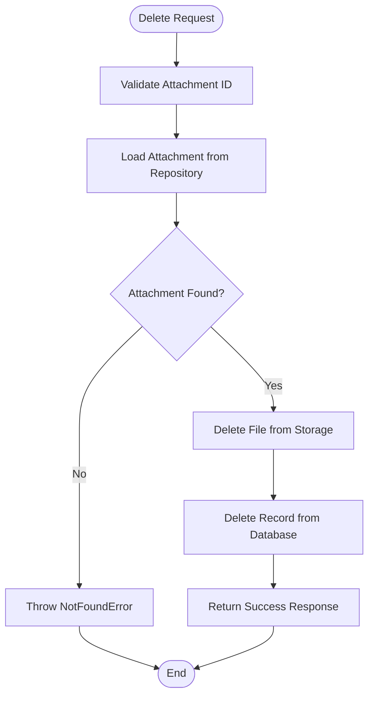
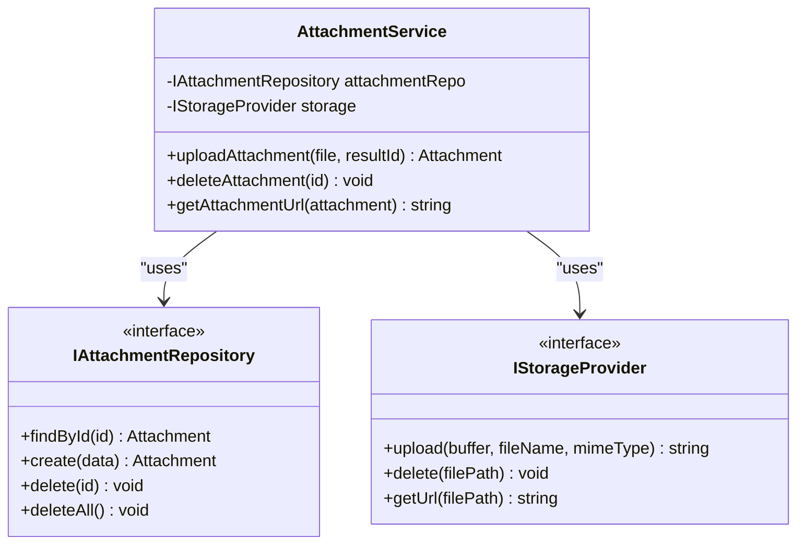
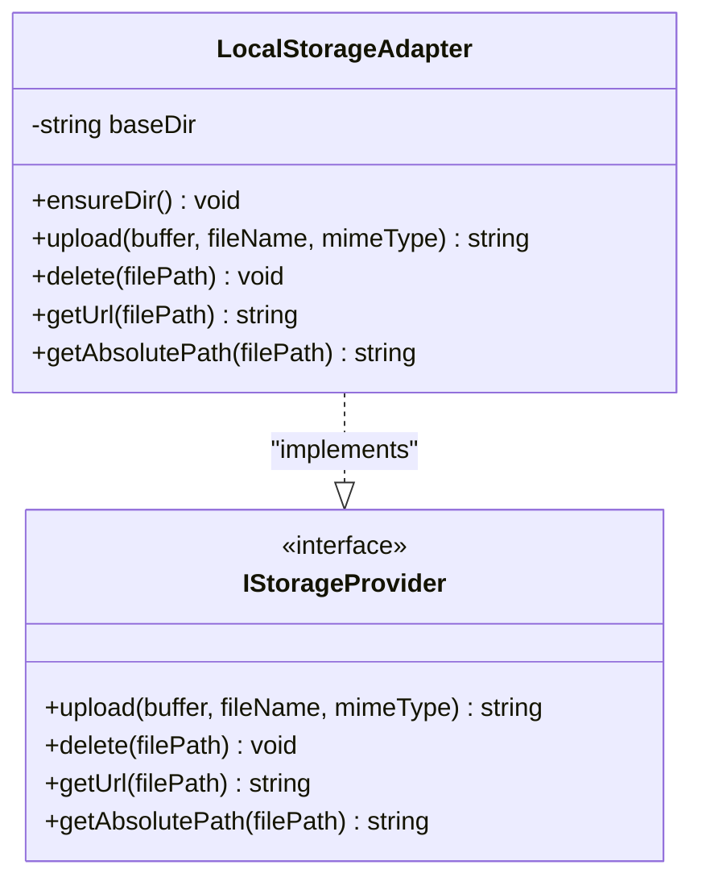
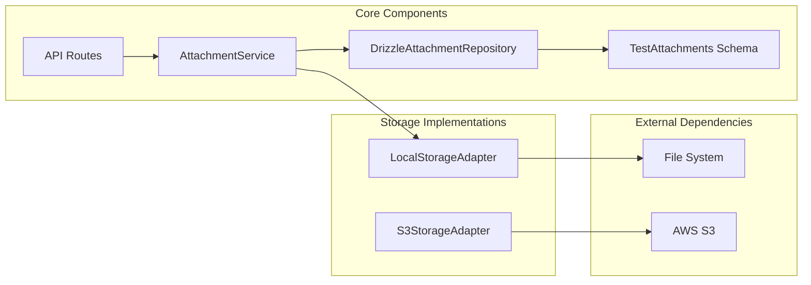

# TestAttachments Table

<cite>
**Referenced Files in This Document**
- [schema.ts](file://src/infrastructure/db/schema.ts)
- [DrizzleAttachmentRepository.ts](file://src/adapters/persistence/drizzle/DrizzleAttachmentRepository.ts)
- [AttachmentService.ts](file://src/domain/services/AttachmentService.ts)
- [route.ts](file://app/api/attachments/route.ts)
- [route.ts](file://app/api/attachments/[id]/route.ts)
- [index.ts](file://src/domain/types/index.ts)
- [LocalStorageAdapter.ts](file://src/adapters/storage/LocalStorageAdapter.ts)
- [container.ts](file://src/infrastructure/container.ts)
- [TestResultDetail.tsx](file://src/ui/test-run/TestResultDetail.tsx)
</cite>

## Table of Contents
1. [Introduction](#introduction)
2. [Project Structure](#project-structure)
3. [Core Components](#core-components)
4. [Architecture Overview](#architecture-overview)
5. [Detailed Component Analysis](#detailed-component-analysis)
6. [Dependency Analysis](#dependency-analysis)
7. [Performance Considerations](#performance-considerations)
8. [Troubleshooting Guide](#troubleshooting-guide)
9. [Conclusion](#conclusion)

## Introduction
The TestAttachments table serves as the persistent storage layer for test execution evidence in the system. It enables teams to associate various types of files (screenshots, video recordings, log files, and other artifacts) with specific test results, creating a comprehensive audit trail and evidence base for quality assurance processes.

The table structure is designed around three primary use cases:
- **Screenshot capture**: Visual evidence of test execution outcomes
- **Video recordings**: Complete test session recordings for debugging
- **Log files and artifacts**: Technical evidence supporting test results

## Project Structure
The TestAttachments functionality spans multiple architectural layers, from database schema definition to user interface integration:

**Diagram sources**
- [schema.ts:53-59](file://src/infrastructure/db/schema.ts#L53-L59)
- [DrizzleAttachmentRepository.ts:7-25](file://src/adapters/persistence/drizzle/DrizzleAttachmentRepository.ts#L7-L25)
- [AttachmentService.ts:11-51](file://src/domain/services/AttachmentService.ts#L11-L51)

**Section sources**
- [schema.ts:53-59](file://src/infrastructure/db/schema.ts#L53-L59)
- [container.ts:33-91](file://src/infrastructure/container.ts#L33-L91)

## Core Components

### Database Schema Definition
The TestAttachments table implements a clean, normalized structure optimized for test evidence management:

| Column Name | Data Type | Constraints | Purpose |
|-------------|-----------|-------------|---------|
| `id` | TEXT | PRIMARY KEY, AUTO-GENERATED | Unique identifier for each attachment record |
| `filePath` | TEXT | NOT NULL | Storage path/URL reference to the actual file |
| `fileType` | TEXT | NOT NULL | MIME type for proper file handling |
| `createdAt` | INTEGER | DEFAULT CURRENT_TIMESTAMP | Timestamp for evidence creation |
| `testResultId` | TEXT | NOT NULL, FOREIGN KEY | Links attachment to specific test result |

**Section sources**
- [schema.ts:53-59](file://src/infrastructure/db/schema.ts#L53-L59)
- [index.ts:53-59](file://src/domain/types/index.ts#L53-L59)

### Foreign Key Relationship and Cascade Behavior
The table establishes a critical relationship with the TestResults table through the `testResultId` foreign key. This relationship enforces referential integrity while implementing cascade deletion behavior:

**Diagram sources**
- [schema.ts:42-51](file://src/infrastructure/db/schema.ts#L42-L51)
- [schema.ts:53-59](file://src/infrastructure/db/schema.ts#L53-L59)

**Section sources**
- [schema.ts:47-48](file://src/infrastructure/db/schema.ts#L47-L48)
- [schema.ts:58](file://src/infrastructure/db/schema.ts#L58)

## Architecture Overview

### Upload Workflow Architecture
The attachment upload process follows a layered architecture pattern with clear separation of concerns:

**Diagram sources**
- [route.ts:7-21](file://app/api/attachments/route.ts#L7-L21)
- [AttachmentService.ts:17-31](file://src/domain/services/AttachmentService.ts#L17-L31)
- [LocalStorageAdapter.ts:16-22](file://src/adapters/storage/LocalStorageAdapter.ts#L16-L22)
- [DrizzleAttachmentRepository.ts:13-16](file://src/adapters/persistence/drizzle/DrizzleAttachmentRepository.ts#L13-L16)

### Deletion Workflow Architecture
The deletion process ensures complete cleanup of both file system resources and database records:

**Diagram sources**
- [route.ts:7-14](file://app/api/attachments/[id]/route.ts#L7-L14)
- [AttachmentService.ts:33-46](file://src/domain/services/AttachmentService.ts#L33-L46)
- [DrizzleAttachmentRepository.ts:18-20](file://src/adapters/persistence/drizzle/DrizzleAttachmentRepository.ts#L18-L20)

**Section sources**
- [route.ts:7-21](file://app/api/attachments/route.ts#L7-L21)
- [route.ts:7-14](file://app/api/attachments/[id]/route.ts#L7-L14)

## Detailed Component Analysis

### AttachmentService Implementation
The AttachmentService acts as the central orchestrator for all attachment-related operations, implementing the core business logic:

**Diagram sources**
- [AttachmentService.ts:11-51](file://src/domain/services/AttachmentService.ts#L11-L51)
- [IAttachmentRepository.ts:3-8](file://src/domain/ports/repositories/IAttachmentRepository.ts#L3-L8)
- [IStorageProvider.ts:8-20](file://src/domain/ports/IStorageProvider.ts#L8-L20)

**Section sources**
- [AttachmentService.ts:11-51](file://src/domain/services/AttachmentService.ts#L11-L51)

### Storage Provider Abstraction
The system implements a storage abstraction layer allowing flexible backend implementations:

**Diagram sources**
- [LocalStorageAdapter.ts:5-44](file://src/adapters/storage/LocalStorageAdapter.ts#L5-L44)
- [IStorageProvider.ts:8-20](file://src/domain/ports/IStorageProvider.ts#L8-L20)

**Section sources**
- [LocalStorageAdapter.ts:5-44](file://src/adapters/storage/LocalStorageAdapter.ts#L5-L44)

### API Route Implementation
The API layer provides REST endpoints for attachment management with proper validation and error handling:

**Section sources**
- [route.ts:7-21](file://app/api/attachments/route.ts#L7-L21)
- [route.ts:7-14](file://app/api/attachments/[id]/route.ts#L7-L14)

### Frontend Integration
The user interface provides seamless attachment management capabilities:

**Section sources**
- [TestResultDetail.tsx:106-148](file://src/ui/test-run/TestResultDetail.tsx#L106-L148)

## Dependency Analysis

### Component Relationships
The attachment system demonstrates excellent separation of concerns through dependency injection and interface abstraction:

**Diagram sources**
- [container.ts:45](file://src/infrastructure/container.ts#L45)
- [container.ts:58](file://src/infrastructure/container.ts#L58)

### Circular Dependency Prevention
The architecture avoids circular dependencies through:
- Clear interface boundaries
- Dependency inversion principle
- Factory pattern for service instantiation

**Section sources**
- [container.ts:33-91](file://src/infrastructure/container.ts#L33-L91)

## Performance Considerations

### Storage Optimization Strategies
- **Asynchronous file operations**: All storage operations use async/await patterns to prevent blocking
- **Buffer-based processing**: Files are processed as buffers to minimize memory overhead
- **Lazy initialization**: Storage directories are created only when needed

### Database Performance
- **Foreign key indexing**: Automatic indexing on foreign key columns
- **Cascade deletion**: Efficient cleanup of orphaned records
- **Minimal column selection**: Repository queries use selective field retrieval

### Scalability Considerations
- **Interface abstraction**: Easy migration to cloud storage solutions
- **Modular design**: Independent scaling of storage and compute resources
- **Connection pooling**: Database connections managed centrally

## Troubleshooting Guide

### Common Issues and Solutions

#### File Upload Failures
**Symptoms**: Upload requests return validation errors
**Causes**: Missing file or resultId parameters
**Solutions**: 
- Verify FormData contains both 'file' and 'resultId' fields
- Check browser compatibility with File API
- Validate file size limits

#### Storage Access Errors
**Symptoms**: Files appear in database but cannot be accessed
**Causes**: Incorrect file path resolution or permission issues
**Solutions**:
- Verify FILES_PATH environment variable is set correctly
- Check directory permissions for write access
- Ensure storage adapter is properly configured

#### Cascade Deletion Issues
**Symptoms**: Deleted test results still show attachments
**Causes**: Database constraint violations or transaction failures
**Solutions**:
- Verify foreign key constraints are properly defined
- Check transaction isolation levels
- Review cascade delete behavior in database schema

**Section sources**
- [route.ts:12-17](file://app/api/attachments/route.ts#L12-L17)
- [AttachmentService.ts:33-46](file://src/domain/services/AttachmentService.ts#L33-L46)
- [LocalStorageAdapter.ts:24-33](file://src/adapters/storage/LocalStorageAdapter.ts#L24-L33)

## Conclusion

The TestAttachments table provides a robust foundation for test evidence management in the system. Its design balances flexibility with reliability through:

- **Strong relational integrity**: Proper foreign key constraints ensure data consistency
- **Flexible storage abstraction**: Pluggable storage providers support various deployment scenarios
- **Complete lifecycle management**: Full CRUD operations with proper error handling
- **User-friendly integration**: Seamless API and UI experiences for attachment management

The architecture supports future enhancements including cloud storage integration, advanced file validation, and distributed storage patterns while maintaining backward compatibility and system stability.