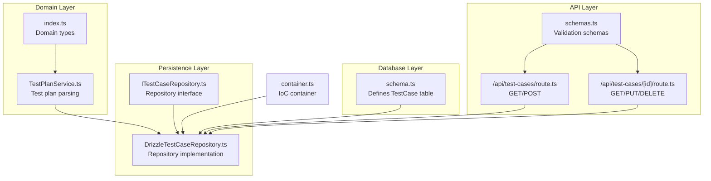
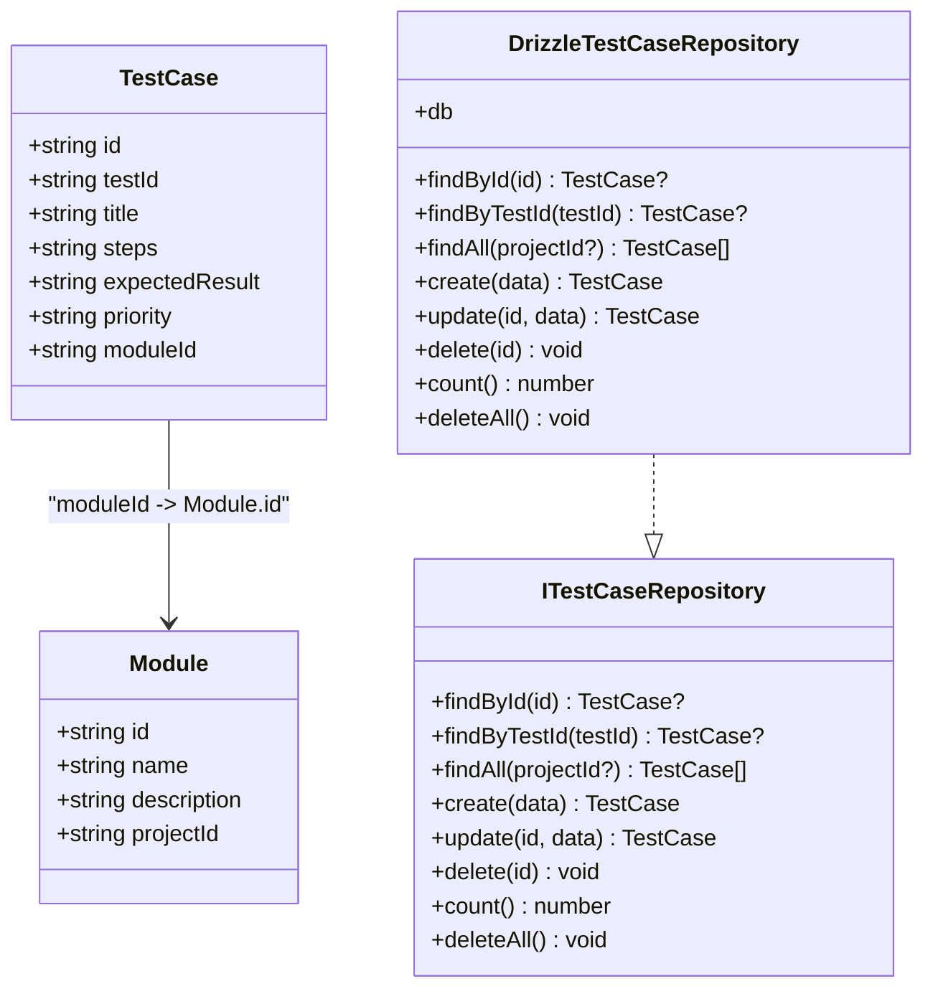
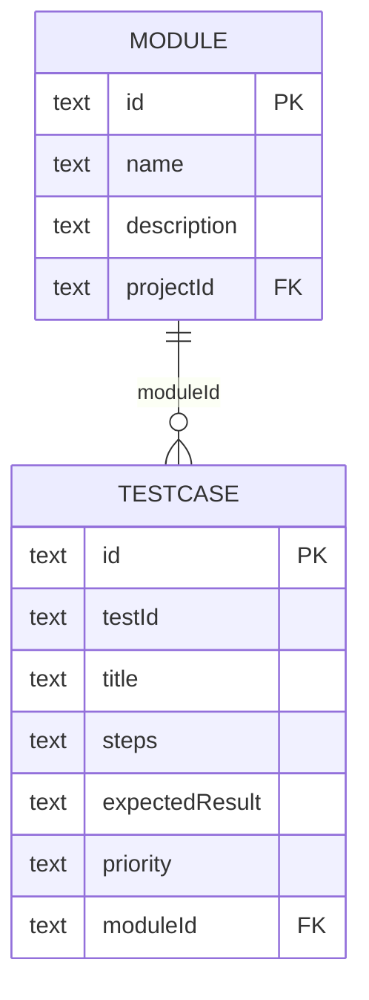
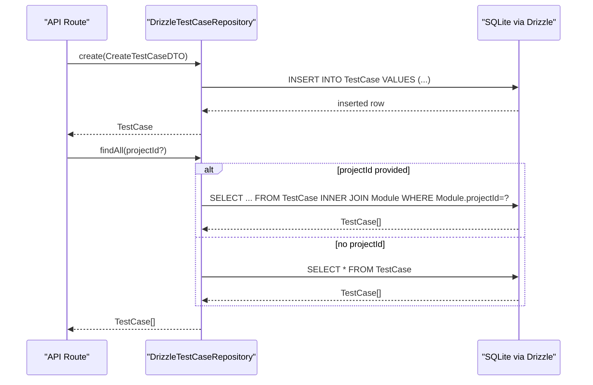
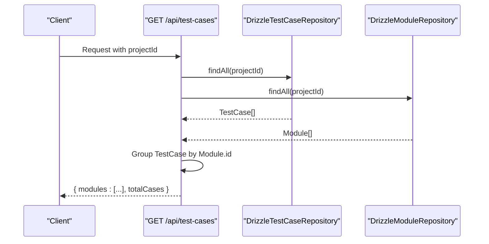
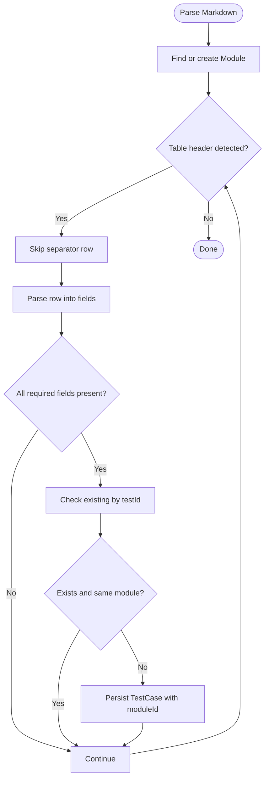
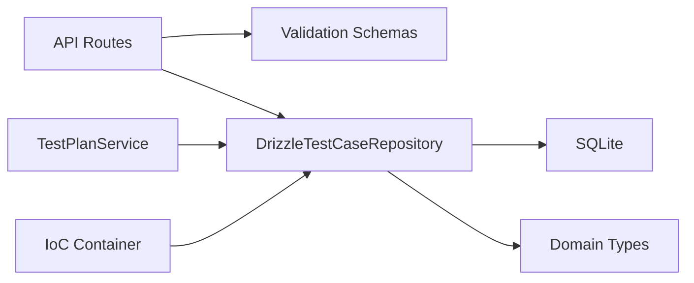

# TestCases Table

<cite>
**Referenced Files in This Document**
- [schema.ts](file://src/infrastructure/db/schema.ts)
- [DrizzleTestCaseRepository.ts](file://src/adapters/persistence/drizzle/DrizzleTestCaseRepository.ts)
- [ITestCaseRepository.ts](file://src/domain/ports/repositories/ITestCaseRepository.ts)
- [index.ts](file://src/domain/types/index.ts)
- [route.ts](file://app/api/test-cases/route.ts)
- [route.ts](file://app/api/test-cases/[id]/route.ts)
- [schemas.ts](file://app/api/_lib/schemas.ts)
- [container.ts](file://src/infrastructure/container.ts)
- [TestPlanService.ts](file://src/domain/services/TestPlanService.ts)
</cite>

## Table of Contents
1. [Introduction](#introduction)
2. [Project Structure](#project-structure)
3. [Core Components](#core-components)
4. [Architecture Overview](#architecture-overview)
5. [Detailed Component Analysis](#detailed-component-analysis)
6. [Dependency Analysis](#dependency-analysis)
7. [Performance Considerations](#performance-considerations)
8. [Troubleshooting Guide](#troubleshooting-guide)
9. [Conclusion](#conclusion)

## Introduction
This document provides comprehensive documentation for the TestCases table entity within the test plan SaaS application. It explains the table structure, field semantics, relationships to modules, and the business logic governing test case organization. It also covers priority levels, common query patterns, and practical examples of well-formed test cases.

## Project Structure
The TestCases table is part of the application's data model and is persisted using Drizzle ORM against an SQLite backend. The relevant components are organized across:
- Database schema definition
- Repository abstraction and implementation
- Domain types and service logic
- API endpoints for CRUD operations
- Validation schemas for request payloads

**Diagram sources**
- [schema.ts:24-32](file://src/infrastructure/db/schema.ts#L24-L32)
- [DrizzleTestCaseRepository.ts:7-71](file://src/adapters/persistence/drizzle/DrizzleTestCaseRepository.ts#L7-L71)
- [ITestCaseRepository.ts:3-12](file://src/domain/ports/repositories/ITestCaseRepository.ts#L3-L12)
- [index.ts:23-32](file://src/domain/types/index.ts#L23-L32)
- [TestPlanService.ts:9-25](file://src/domain/services/TestPlanService.ts#L9-L25)
- [route.ts:8-28](file://app/api/test-cases/route.ts#L8-L28)
- [route.ts:8-32](file://app/api/test-cases/[id]/route.ts#L8-L32)
- [schemas.ts:74-90](file://app/api/_lib/schemas.ts#L74-L90)
- [container.ts:33-91](file://src/infrastructure/container.ts#L33-L91)

**Section sources**
- [schema.ts:24-32](file://src/infrastructure/db/schema.ts#L24-L32)
- [DrizzleTestCaseRepository.ts:7-71](file://src/adapters/persistence/drizzle/DrizzleTestCaseRepository.ts#L7-L71)
- [ITestCaseRepository.ts:3-12](file://src/domain/ports/repositories/ITestCaseRepository.ts#L3-L12)
- [index.ts:23-32](file://src/domain/types/index.ts#L23-L32)
- [TestPlanService.ts:9-25](file://src/domain/services/TestPlanService.ts#L9-L25)
- [route.ts:8-28](file://app/api/test-cases/route.ts#L8-L28)
- [route.ts:8-32](file://app/api/test-cases/[id]/route.ts#L8-L32)
- [schemas.ts:74-90](file://app/api/_lib/schemas.ts#L74-L90)
- [container.ts:33-91](file://src/infrastructure/container.ts#L33-L91)

## Core Components
The TestCases table is defined with the following structure:
- id: Primary key (UUID-like text)
- testId: External identifier for the test case
- title: Human-readable title
- steps: Execution instructions
- expectedResult: Verification criteria
- priority: Priority level (P1-P4)
- moduleId: Foreign key to Module

Field semantics and constraints:
- All fields except optional descriptions are required.
- Priority is constrained to P1, P2, P3, P4.
- moduleId references the Module table with cascade delete behavior.

Relationships:
- Each test case belongs to exactly one Module.
- Modules belong to Projects (via projectId), enabling hierarchical grouping.

**Section sources**
- [schema.ts:24-32](file://src/infrastructure/db/schema.ts#L24-L32)
- [index.ts:5](file://src/domain/types/index.ts#L5)
- [index.ts:23-32](file://src/domain/types/index.ts#L23-L32)

## Architecture Overview
The TestCases entity follows a layered architecture:
- Database schema defines the physical table and constraints.
- Repository abstraction encapsulates persistence operations.
- Domain services orchestrate higher-level logic (e.g., parsing test plans).
- API endpoints expose CRUD operations with validation.
- The IoC container wires dependencies.

**Diagram sources**
- [schema.ts:24-32](file://src/infrastructure/db/schema.ts#L24-L32)
- [schema.ts:17-22](file://src/infrastructure/db/schema.ts#L17-L22)
- [ITestCaseRepository.ts:3-12](file://src/domain/ports/repositories/ITestCaseRepository.ts#L3-L12)
- [DrizzleTestCaseRepository.ts:7-71](file://src/adapters/persistence/drizzle/DrizzleTestCaseRepository.ts#L7-L71)
- [index.ts:23-32](file://src/domain/types/index.ts#L23-L32)

## Detailed Component Analysis

### Database Schema and Constraints
- The TestCase table enforces:
  - Primary key on id
  - Not-null constraints on testId, title, steps, expectedResult, priority, moduleId
  - Foreign key constraint on moduleId referencing Module.id with cascade delete
- The Module table defines the parent entity with projectId linking to Project.

**Diagram sources**
- [schema.ts:17-22](file://src/infrastructure/db/schema.ts#L17-L22)
- [schema.ts:24-32](file://src/infrastructure/db/schema.ts#L24-L32)

**Section sources**
- [schema.ts:17-22](file://src/infrastructure/db/schema.ts#L17-L22)
- [schema.ts:24-32](file://src/infrastructure/db/schema.ts#L24-L32)

### Repository Implementation
The DrizzleTestCaseRepository provides:
- findById and findByTestId for lookup by primary key or external identifier
- findAll with optional projectId filtering, returning joined data with Module
- create, update, delete, count, and deleteAll operations
- Uses Drizzle ORM for SQL generation and type-safe queries

**Diagram sources**
- [DrizzleTestCaseRepository.ts:37-56](file://src/adapters/persistence/drizzle/DrizzleTestCaseRepository.ts#L37-L56)
- [DrizzleTestCaseRepository.ts:18-35](file://src/adapters/persistence/drizzle/DrizzleTestCaseRepository.ts#L18-L35)

**Section sources**
- [DrizzleTestCaseRepository.ts:7-71](file://src/adapters/persistence/drizzle/DrizzleTestCaseRepository.ts#L7-L71)

### Domain Types and Priority Semantics
- Priority is modeled as a union type with literal values P1, P2, P3, P4.
- The CreateTestCaseDTO and UpdateTestCaseDTO define the shape of persisted records.
- The API schemas enforce priority enumeration during creation and updates.

Priority assignment patterns:
- P1: Highest priority (e.g., critical regression, core functionality)
- P2: High priority (e.g., major features, security checks)
- P3: Medium priority (e.g., minor features, UI polish)
- P4: Low priority (e.g., exploratory testing, cleanup tasks)

**Section sources**
- [index.ts:5](file://src/domain/types/index.ts#L5)
- [index.ts:68-75](file://src/domain/types/index.ts#L68-L75)
- [schemas.ts:79](file://app/api/_lib/schemas.ts#L79)

### API Endpoints and Business Logic
Endpoints:
- GET /api/test-cases?projectId=xxx
  - Retrieves all test cases for a project and groups them by module
  - Returns modules with embedded test cases and total count
- POST /api/test-cases
  - Creates a new test case with validated payload
- GET /api/test-cases/[id]
  - Retrieves a single test case by id
- PUT /api/test-cases/[id]
  - Updates an existing test case
- DELETE /api/test-cases/[id]
  - Deletes a test case

**Diagram sources**
- [route.ts:8-28](file://app/api/test-cases/route.ts#L8-L28)
- [DrizzleTestCaseRepository.ts:18-35](file://src/adapters/persistence/drizzle/DrizzleTestCaseRepository.ts#L18-L35)

**Section sources**
- [route.ts:8-28](file://app/api/test-cases/route.ts#L8-L28)
- [route.ts:8-32](file://app/api/test-cases/[id]/route.ts#L8-L32)

### Test Plan Import and Parsing
The TestPlanService parses Markdown test plans and creates modules and test cases:
- Detects module headers and tables
- Extracts rows with fields: ID, Title, Steps, Expected Result, Priority
- Ensures uniqueness by testId and module association
- Persists test cases with moduleId linked to the current module

**Diagram sources**
- [TestPlanService.ts:35-108](file://src/domain/services/TestPlanService.ts#L35-L108)

**Section sources**
- [TestPlanService.ts:9-25](file://src/domain/services/TestPlanService.ts#L9-L25)
- [TestPlanService.ts:35-108](file://src/domain/services/TestPlanService.ts#L35-L108)

## Dependency Analysis
The TestCases entity depends on:
- Module table for hierarchical organization
- Drizzle ORM for persistence
- API schemas for validation
- IoC container for dependency wiring

**Diagram sources**
- [route.ts:8-28](file://app/api/test-cases/route.ts#L8-L28)
- [schemas.ts:74-90](file://app/api/_lib/schemas.ts#L74-L90)
- [DrizzleTestCaseRepository.ts:7-71](file://src/adapters/persistence/drizzle/DrizzleTestCaseRepository.ts#L7-L71)
- [index.ts:23-32](file://src/domain/types/index.ts#L23-L32)
- [container.ts:33-91](file://src/infrastructure/container.ts#L33-L91)

**Section sources**
- [container.ts:33-91](file://src/infrastructure/container.ts#L33-L91)

## Performance Considerations
- Indexing: Consider adding an index on testCases.testId for fast lookups by external identifier.
- Filtering: findAll with projectId performs an inner join; ensure projectId is indexed on Module.
- Pagination: For large datasets, implement pagination in API endpoints.
- Caching: Cache frequently accessed module-grouped results at the API layer.

## Troubleshooting Guide
Common issues and resolutions:
- Foreign key violation when deleting a module:
  - Cascade delete removes associated test cases automatically.
- Duplicate testId within a module:
  - The parser avoids duplicates; ensure moduleId is correctly set when importing.
- Validation errors on create/update:
  - Verify priority is one of P1, P2, P3, P4 and all required fields are present.
- Missing projectId in GET /api/test-cases:
  - Ensure projectId query parameter is provided.

**Section sources**
- [schema.ts:31](file://src/infrastructure/db/schema.ts#L31)
- [TestPlanService.ts:87-99](file://src/domain/services/TestPlanService.ts#L87-L99)
- [schemas.ts:74-90](file://app/api/_lib/schemas.ts#L74-L90)
- [route.ts:12-14](file://app/api/test-cases/route.ts#L12-L14)

## Conclusion
The TestCases table provides a structured foundation for organizing test artifacts within modules and projects. Its design emphasizes clarity (external identifiers), completeness (execution steps and expected outcomes), and prioritization (P1–P4). The layered architecture ensures clean separation of concerns, while the API and service layers support robust CRUD operations and automated test plan ingestion.