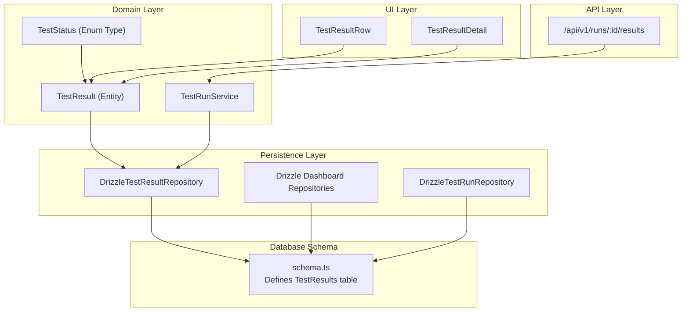
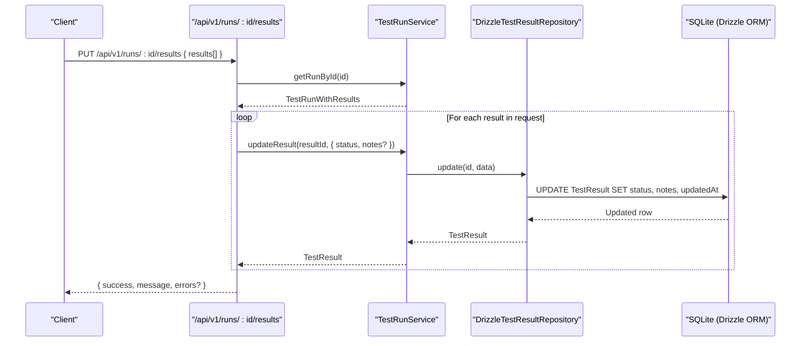
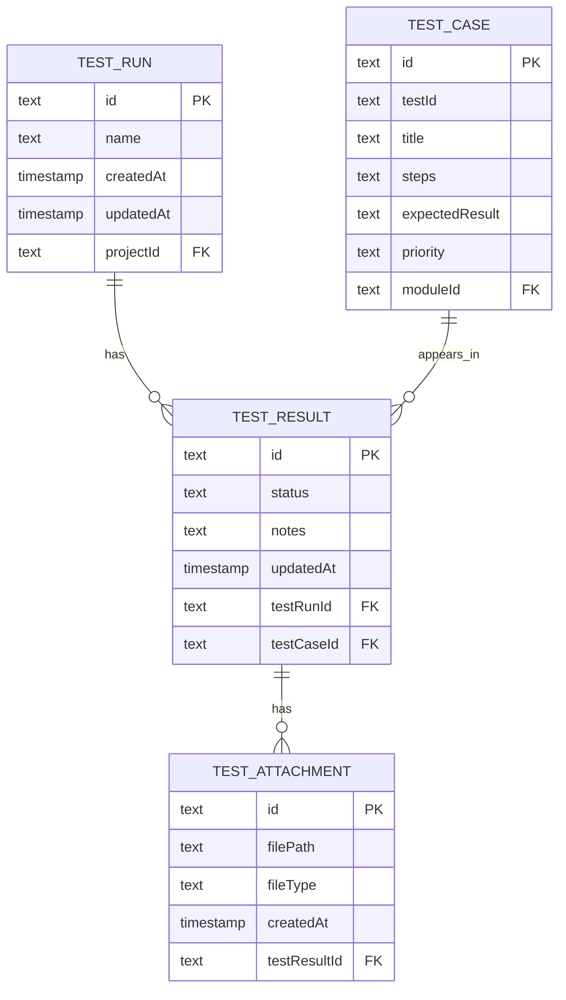
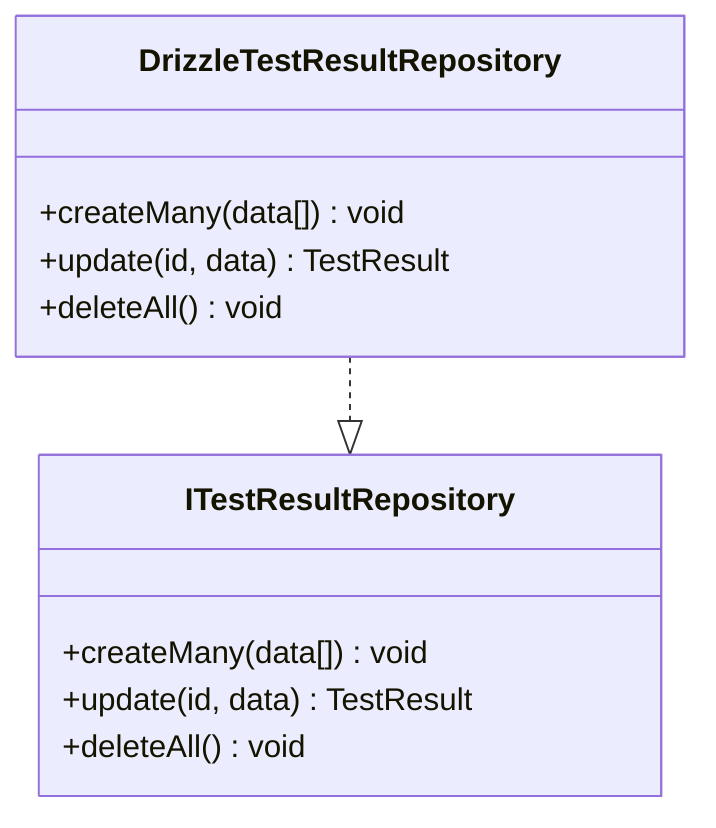
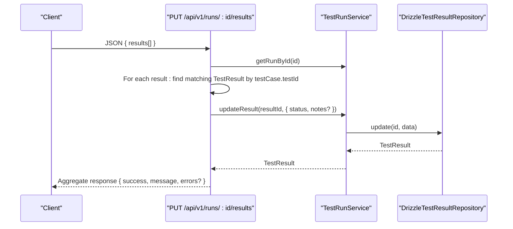
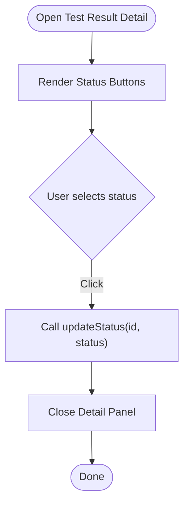
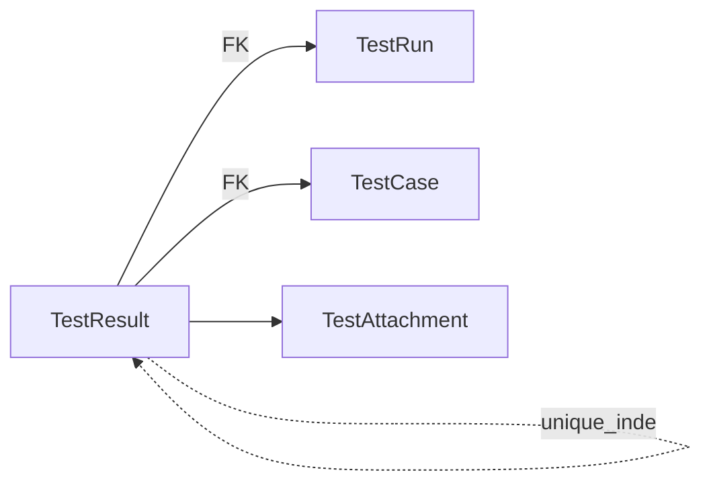

# TestResults Table

<cite>
**Referenced Files in This Document**
- [schema.ts](file://src/infrastructure/db/schema.ts)
- [DrizzleTestResultRepository.ts](file://src/adapters/persistence/drizzle/DrizzleTestResultRepository.ts)
- [ITestResultRepository.ts](file://src/domain/ports/repositories/ITestResultRepository.ts)
- [index.ts](file://src/domain/types/index.ts)
- [TestRunService.ts](file://src/domain/services/TestRunService.ts)
- [route.ts](file://app/api/v1/runs/[id]/results/route.ts)
- [DrizzleDashboardRepository.ts](file://src/adapters/persistence/drizzle/DrizzleDashboardRepository.ts)
- [DrizzleTestRunRepository.ts](file://src/adapters/persistence/drizzle/DrizzleTestRunRepository.ts)
- [TestResultRow.tsx](file://src/ui/test-run/TestResultRow.tsx)
- [TestResultDetail.tsx](file://src/ui/test-run/TestResultDetail.tsx)
</cite>

## Table of Contents
1. [Introduction](#introduction)
2. [Project Structure](#project-structure)
3. [Core Components](#core-components)
4. [Architecture Overview](#architecture-overview)
5. [Detailed Component Analysis](#detailed-component-analysis)
6. [Dependency Analysis](#dependency-analysis)
7. [Performance Considerations](#performance-considerations)
8. [Troubleshooting Guide](#troubleshooting-guide)
9. [Conclusion](#conclusion)

## Introduction
This document provides comprehensive documentation for the TestResults table entity, which tracks individual test execution outcomes within test runs. It covers the table structure, status enumeration semantics, unique constraints, cascade behaviors, bidirectional relationships, and practical usage patterns for result tracking, status updates, and analytics.

## Project Structure
The TestResults table is defined in the database schema and integrated across the domain, persistence, API, and UI layers. The following diagram shows how components relate to the TestResults table.



**Diagram sources**
- [schema.ts:42-51](file://src/infrastructure/db/schema.ts#L42-L51)
- [DrizzleTestResultRepository.ts:7-35](file://src/adapters/persistence/drizzle/DrizzleTestResultRepository.ts#L7-L35)
- [index.ts:42-51](file://src/domain/types/index.ts#L42-L51)
- [TestRunService.ts:65-72](file://src/domain/services/TestRunService.ts#L65-L72)
- [route.ts:12-58](file://app/api/v1/runs/[id]/results/route.ts#L12-L58)
- [DrizzleDashboardRepository.ts:94-151](file://src/adapters/persistence/drizzle/DrizzleDashboardRepository.ts#L94-L151)
- [DrizzleTestRunRepository.ts:16-68](file://src/adapters/persistence/drizzle/DrizzleTestRunRepository.ts#L16-L68)
- [TestResultRow.tsx:5-10](file://src/ui/test-run/TestResultRow.tsx#L5-L10)
- [TestResultDetail.tsx:47-65](file://src/ui/test-run/TestResultDetail.tsx#L47-L65)

**Section sources**
- [schema.ts:42-51](file://src/infrastructure/db/schema.ts#L42-L51)
- [index.ts:42-51](file://src/domain/types/index.ts#L42-L51)

## Core Components
The TestResults table is defined with the following structure:
- id: Primary key (auto-generated)
- status: Text field with default value UNTESTED
- notes: Optional text notes
- updatedAt: Timestamp updated on change
- testRunId: Foreign key to TestRun (cascade delete)
- testCaseId: Foreign key to TestCase (cascade delete)
- Unique index on (testRunId, testCaseId) to prevent duplicates

The status enumeration supports four values:
- PASSED: Test case passed
- FAILED: Test case failed
- BLOCKED: Test case blocked (cannot execute)
- UNTESTED: Default state when result is created

**Section sources**
- [schema.ts:42-51](file://src/infrastructure/db/schema.ts#L42-L51)
- [index.ts:3](file://src/domain/types/index.ts#L3)
- [TestResultRow.tsx:5-10](file://src/ui/test-run/TestResultRow.tsx#L5-L10)

## Architecture Overview
The TestResults entity participates in a bidirectional relationship model:
- From TestRun: One-to-many relationship (a run contains many results)
- From TestCase: One-to-many relationship (a case can appear in many runs)
- Cascade delete: When a TestRun or TestCase is deleted, associated TestResults are removed

The following sequence diagram illustrates bulk status updates via the API endpoint.



**Diagram sources**
- [route.ts:12-58](file://app/api/v1/runs/[id]/results/route.ts#L12-L58)
- [TestRunService.ts:65-72](file://src/domain/services/TestRunService.ts#L65-L72)
- [DrizzleTestResultRepository.ts:16-30](file://src/adapters/persistence/drizzle/DrizzleTestResultRepository.ts#L16-L30)
- [schema.ts:42-51](file://src/infrastructure/db/schema.ts#L42-L51)

## Detailed Component Analysis

### Database Schema Definition
The TestResults table definition establishes:
- Primary key id
- Status with default UNTESTED
- Notes text
- updatedAt timestamp
- Foreign keys testRunId and testCaseId with cascade delete
- Unique index on (testRunId, testCaseId)



**Diagram sources**
- [schema.ts:34-59](file://src/infrastructure/db/schema.ts#L34-L59)

**Section sources**
- [schema.ts:42-51](file://src/infrastructure/db/schema.ts#L42-L51)

### Domain Model and Types
The TestResult entity includes:
- id, status (TestStatus), notes
- testRunId, testCaseId
- Optional navigation properties: testCase, testRun, attachments

The TestStatus type enumerates the allowed values.

```mermaid
classDiagram
class TestResult {
+string id
+TestStatus status
+string|null notes
+string testRunId
+string testCaseId
+TestCase testCase?
+TestRun testRun?
+Attachment[] attachments?
}
class TestStatus {
<<enumeration>>
"PASSED"
"FAILED"
"BLOCKED"
"UNTESTED"
}
TestResult --> TestStatus : "uses"
```

**Diagram sources**
- [index.ts:42-51](file://src/domain/types/index.ts#L42-L51)
- [index.ts:3](file://src/domain/types/index.ts#L3)

**Section sources**
- [index.ts:42-51](file://src/domain/types/index.ts#L42-L51)
- [index.ts:3](file://src/domain/types/index.ts#L3)

### Persistence Layer
The DrizzleTestResultRepository provides:
- Bulk creation of results with default UNTESTED status
- Update of status and notes
- Deletion of all results



**Diagram sources**
- [DrizzleTestResultRepository.ts:7-35](file://src/adapters/persistence/drizzle/DrizzleTestResultRepository.ts#L7-L35)
- [ITestResultRepository.ts:3-7](file://src/domain/ports/repositories/ITestResultRepository.ts#L3-L7)

**Section sources**
- [DrizzleTestResultRepository.ts:7-35](file://src/adapters/persistence/drizzle/DrizzleTestResultRepository.ts#L7-L35)
- [ITestResultRepository.ts:3-7](file://src/domain/ports/repositories/ITestResultRepository.ts#L3-L7)

### API Integration
The API endpoint supports bulk updates of results for a given test run. It validates input, locates matching results by testCase.testId, and applies updates while aggregating success/failure counts.



**Diagram sources**
- [route.ts:12-58](file://app/api/v1/runs/[id]/results/route.ts#L12-L58)
- [TestRunService.ts:65-72](file://src/domain/services/TestRunService.ts#L65-L72)
- [DrizzleTestResultRepository.ts:16-30](file://src/adapters/persistence/drizzle/DrizzleTestResultRepository.ts#L16-L30)

**Section sources**
- [route.ts:12-58](file://app/api/v1/runs/[id]/results/route.ts#L12-L58)
- [TestRunService.ts:65-72](file://src/domain/services/TestRunService.ts#L65-L72)

### UI Integration
The UI components render status choices and allow updating status and notes:
- TestResultRow displays status icons and labels
- TestResultDetail provides a modal for selecting status and editing notes



**Diagram sources**
- [TestResultRow.tsx:5-10](file://src/ui/test-run/TestResultRow.tsx#L5-L10)
- [TestResultDetail.tsx:47-65](file://src/ui/test-run/TestResultDetail.tsx#L47-L65)

**Section sources**
- [TestResultRow.tsx:5-10](file://src/ui/test-run/TestResultRow.tsx#L5-L10)
- [TestResultDetail.tsx:47-65](file://src/ui/test-run/TestResultDetail.tsx#L47-L65)

## Dependency Analysis
The TestResults table participates in several relationships and cascades:
- Cascade delete from TestRun and TestCase to TestResult
- Unique index prevents duplicate results per test case within a run
- Bidirectional navigation in domain types enables efficient reporting and UI rendering



**Diagram sources**
- [schema.ts:42-51](file://src/infrastructure/db/schema.ts#L42-L51)
- [schema.ts:53-59](file://src/infrastructure/db/schema.ts#L53-L59)

**Section sources**
- [schema.ts:42-51](file://src/infrastructure/db/schema.ts#L42-L51)
- [schema.ts:53-59](file://src/infrastructure/db/schema.ts#L53-L59)

## Performance Considerations
- Unique index on (testRunId, testCaseId) ensures fast duplicate prevention and efficient joins for run-scoped queries.
- Bulk insert during run creation initializes UNTESTED results for all cases, minimizing subsequent write operations.
- UI-driven updates are batched via the API endpoint, reducing round trips for automated runners.

[No sources needed since this section provides general guidance]

## Troubleshooting Guide
Common issues and resolutions:
- Duplicate result entries: Ensure the unique index constraint is respected; do not attempt to insert multiple rows with the same (testRunId, testCaseId).
- Status validation: Only the allowed TestStatus values are accepted; invalid statuses will cause validation errors.
- Cascade deletion: Deleting a TestRun or TestCase removes associated TestResults; confirm cascade behavior aligns with data retention policies.
- Bulk update failures: Verify testCase.testId values match existing cases in the run; mismatches will be reported in the errors array.

**Section sources**
- [schema.ts:42-51](file://src/infrastructure/db/schema.ts#L42-L51)
- [route.ts:33-51](file://app/api/v1/runs/[id]/results/route.ts#L33-L51)

## Conclusion
The TestResults table provides a robust foundation for tracking test execution outcomes with clear status semantics, strong referential integrity, and efficient indexing. Its integration across domain, persistence, API, and UI layers enables streamlined result tracking, status updates, and analytics.