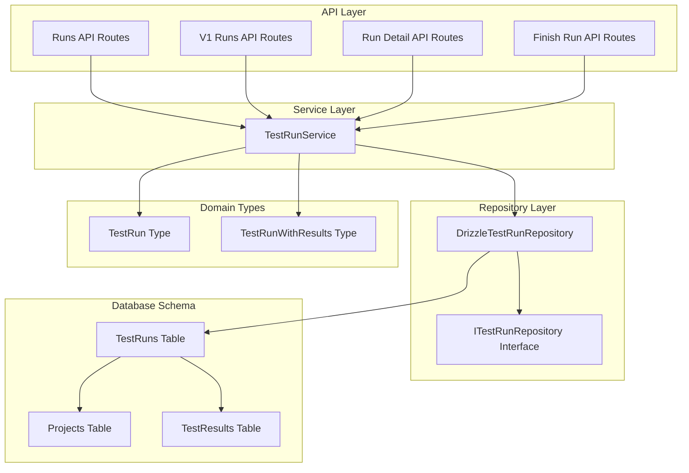
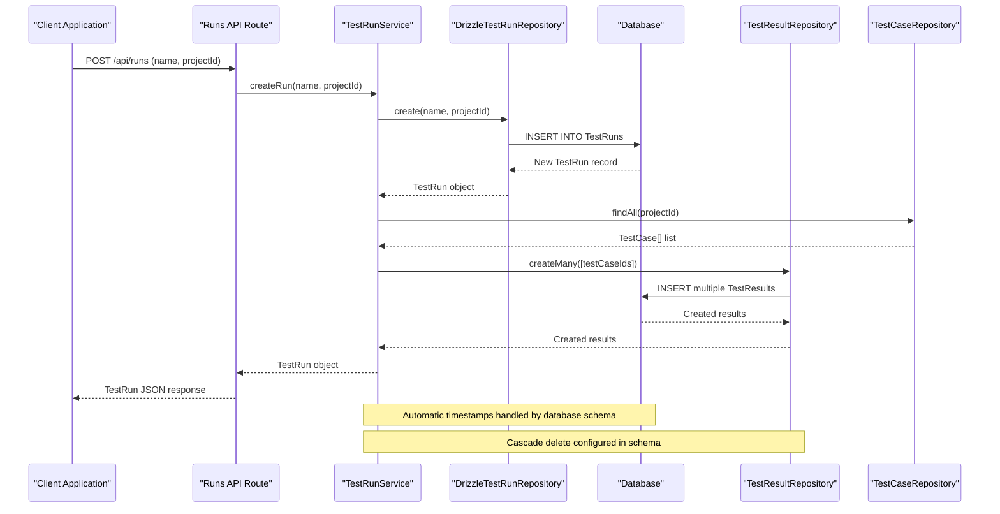
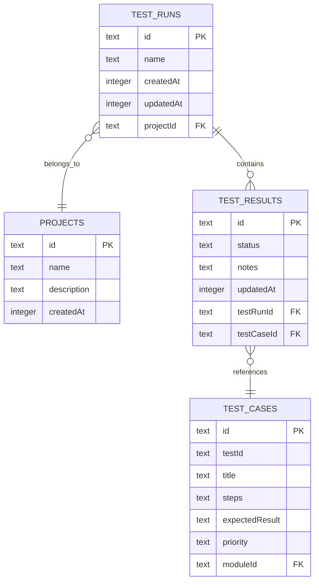
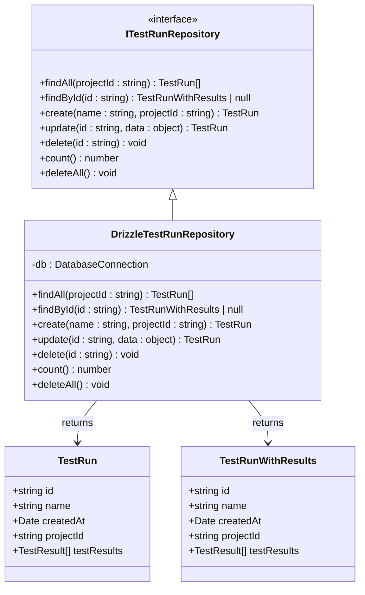
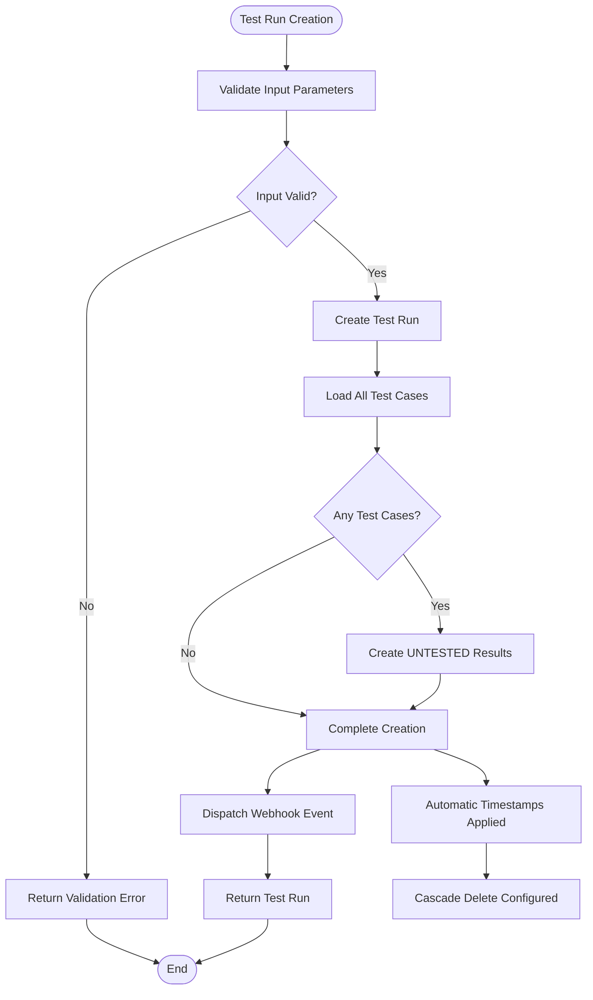
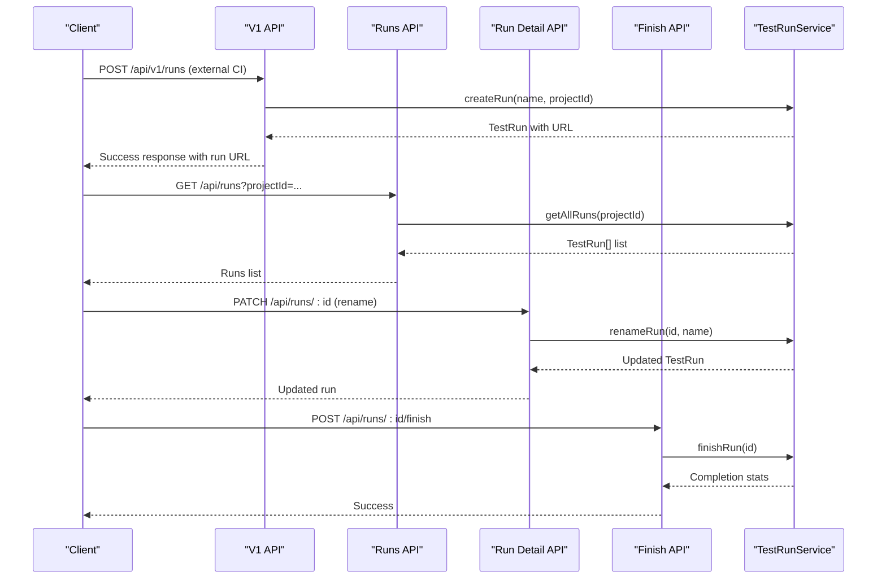
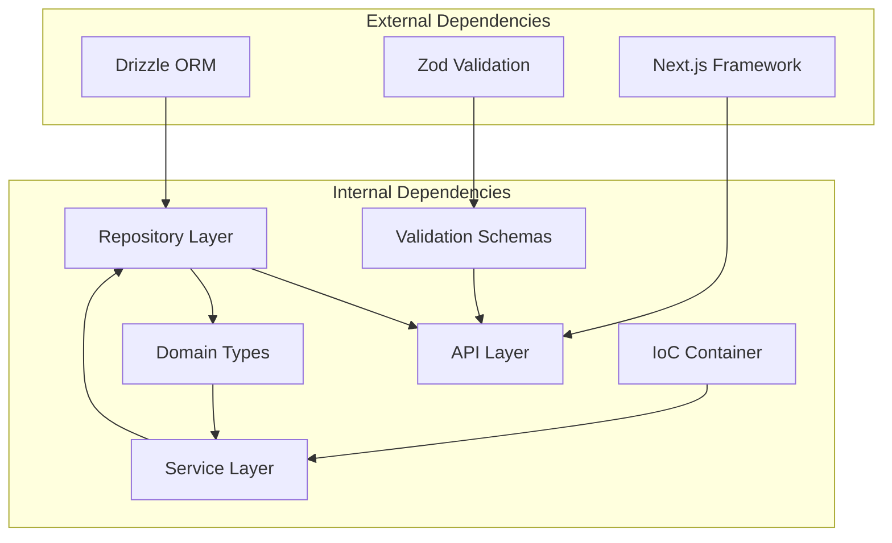

# TestRuns Table

<cite>
**Referenced Files in This Document**
- [schema.ts](file://src/infrastructure/db/schema.ts)
- [DrizzleTestRunRepository.ts](file://src/adapters/persistence/drizzle/DrizzleTestRunRepository.ts)
- [ITestRunRepository.ts](file://src/domain/ports/repositories/ITestRunRepository.ts)
- [TestRunService.ts](file://src/domain/services/TestRunService.ts)
- [index.ts](file://src/domain/types/index.ts)
- [route.ts](file://app/api/runs/route.ts)
- [route.ts](file://app/api/v1/runs/route.ts)
- [route.ts](file://app/api/runs/[id]/route.ts)
- [route.ts](file://app/api/runs/[id]/finish/route.ts)
- [schemas.ts](file://app/api/_lib/schemas.ts)
- [container.ts](file://src/infrastructure/container.ts)
</cite>

## Table of Contents
1. [Introduction](#introduction)
2. [Project Structure](#project-structure)
3. [Core Components](#core-components)
4. [Architecture Overview](#architecture-overview)
5. [Detailed Component Analysis](#detailed-component-analysis)
6. [Dependency Analysis](#dependency-analysis)
7. [Performance Considerations](#performance-considerations)
8. [Troubleshooting Guide](#troubleshooting-guide)
9. [Conclusion](#conclusion)

## Introduction
This document provides comprehensive documentation for the TestRuns table entity, which represents instances of test execution within a project context. The TestRuns table serves as the central construct for organizing and tracking test execution runs, enabling teams to manage test execution workflows, track progress, and generate insights from test execution data.

The TestRuns table maintains strong relationships with projects and test results, supporting cascading operations that ensure data consistency when projects or test runs are deleted. It provides automatic timestamp management for creation and updates, facilitating audit trails and chronological tracking of test execution activities.

## Project Structure
The TestRuns table implementation follows a layered architecture pattern with clear separation of concerns across database schema definition, repository abstraction, service orchestration, and API presentation layers.

**Diagram sources**
- [route.ts:1-26](file://app/api/runs/route.ts#L1-L26)
- [route.ts:1-28](file://app/api/v1/runs/route.ts#L1-L28)
- [route.ts:1-27](file://app/api/runs/[id]/route.ts#L1-L27)
- [route.ts:1-15](file://app/api/runs/[id]/finish/route.ts#L1-L15)
- [TestRunService.ts:1-125](file://src/domain/services/TestRunService.ts#L1-L125)
- [DrizzleTestRunRepository.ts:1-96](file://src/adapters/persistence/drizzle/DrizzleTestRunRepository.ts#L1-L96)
- [schema.ts:34-40](file://src/infrastructure/db/schema.ts#L34-L40)

**Section sources**
- [schema.ts:34-40](file://src/infrastructure/db/schema.ts#L34-L40)
- [DrizzleTestRunRepository.ts:1-96](file://src/adapters/persistence/drizzle/DrizzleTestRunRepository.ts#L1-L96)
- [TestRunService.ts:1-125](file://src/domain/services/TestRunService.ts#L1-L125)

## Core Components

### Database Schema Definition
The TestRuns table is defined in the database schema with the following structure:

| Column Name | Data Type | Constraints | Description |
|-------------|-----------|-------------|-------------|
| id | text | Primary Key, auto-generated | Unique identifier for the test run |
| name | text | Not Null | Human-readable name of the test run |
| createdAt | integer | Timestamp, auto-generated | Creation timestamp with default current time |
| updatedAt | integer | Timestamp, auto-generated | Last update timestamp with default current time |
| projectId | text | Foreign Key, Not Null | Links test run to a project |

The table definition establishes a foreign key relationship with the Projects table, implementing cascade delete behavior. This ensures that when a project is deleted, all associated test runs are automatically removed from the database.

**Section sources**
- [schema.ts:34-40](file://src/infrastructure/db/schema.ts#L34-L40)

### Repository Implementation
The DrizzleTestRunRepository provides comprehensive CRUD operations for test runs while maintaining data integrity and relationships:

- **findAll**: Retrieves all test runs for a specific project, ordered by creation timestamp
- **findById**: Fetches a test run with all associated test results and nested relationships
- **create**: Inserts a new test run with automatic timestamp generation
- **update**: Updates test run properties with timestamp management
- **delete**: Removes a specific test run
- **count**: Provides total count of test runs
- **deleteAll**: Bulk deletion capability

**Section sources**
- [DrizzleTestRunRepository.ts:7-95](file://src/adapters/persistence/drizzle/DrizzleTestRunRepository.ts#L7-L95)

### Service Layer Orchestration
The TestRunService manages the complete lifecycle of test runs, coordinating between repositories and external systems:

- **createRun**: Creates a new test run and automatically generates UNTESTED results for all existing test cases
- **renameRun**: Updates test run names with validation
- **deleteRun**: Handles test run deletion with proper error handling
- **finishRun**: Calculates completion statistics and triggers notifications
- **getAllRuns**: Retrieves all runs for project filtering
- **getRunById**: Fetches detailed run information with results

**Section sources**
- [TestRunService.ts:14-124](file://src/domain/services/TestRunService.ts#L14-L124)

## Architecture Overview

**Diagram sources**
- [route.ts:20-25](file://app/api/runs/route.ts#L20-L25)
- [TestRunService.ts:33-51](file://src/domain/services/TestRunService.ts#L33-L51)
- [DrizzleTestRunRepository.ts:70-73](file://src/adapters/persistence/drizzle/DrizzleTestRunRepository.ts#L70-L73)
- [schema.ts:34-40](file://src/infrastructure/db/schema.ts#L34-L40)

## Detailed Component Analysis

### TestRuns Table Structure

The TestRuns table represents individual test execution instances within a project context. Each test run encapsulates a specific execution of test cases, allowing teams to track progress, manage results, and generate reports.

**Diagram sources**
- [schema.ts:34-51](file://src/infrastructure/db/schema.ts#L34-L51)

#### Primary Key and Identity Management
The TestRuns table uses a CUID-based primary key system, ensuring globally unique identifiers across distributed environments. This approach eliminates potential conflicts in multi-instance deployments and provides better security compared to sequential IDs.

#### Timestamp Management
The table implements automatic timestamp management through database defaults:
- **createdAt**: Automatically set to current timestamp upon record creation
- **updatedAt**: Automatically updated to current timestamp on record modification
- **updatedAt**: Also managed by the TestResults table for result tracking

This timestamp strategy enables efficient querying by creation date and provides audit trail capabilities for compliance and debugging purposes.

#### Foreign Key Relationships
The TestRuns table maintains two critical relationships:
- **projectId**: Links test runs to projects with cascade delete behavior
- **testResults**: Establishes one-to-many relationship with test results

The cascade delete configuration ensures referential integrity when projects are removed, preventing orphaned records in the system.

**Section sources**
- [schema.ts:34-40](file://src/infrastructure/db/schema.ts#L34-L40)

### Repository Pattern Implementation

**Diagram sources**
- [ITestRunRepository.ts:3-11](file://src/domain/ports/repositories/ITestRunRepository.ts#L3-L11)
- [DrizzleTestRunRepository.ts:7-95](file://src/adapters/persistence/drizzle/DrizzleTestRunRepository.ts#L7-L95)
- [index.ts:34-40](file://src/domain/types/index.ts#L34-L40)

The repository pattern provides several benefits:
- **Abstraction**: Database-specific implementation details are hidden behind a clean interface
- **Testability**: Easy mocking and unit testing of business logic
- **Flexibility**: Ability to switch database implementations without affecting higher layers
- **Consistency**: Standardized CRUD operations across the application

**Section sources**
- [DrizzleTestRunRepository.ts:1-96](file://src/adapters/persistence/drizzle/DrizzleTestRunRepository.ts#L1-L96)
- [ITestRunRepository.ts:1-12](file://src/domain/ports/repositories/ITestRunRepository.ts#L1-L12)

### Service Layer Orchestration

**Diagram sources**
- [TestRunService.ts:33-51](file://src/domain/services/TestRunService.ts#L33-L51)
- [DrizzleTestRunRepository.ts:70-73](file://src/adapters/persistence/drizzle/DrizzleTestRunRepository.ts#L70-L73)

The service layer coordinates complex business logic while maintaining clean separation of concerns:

#### Lifecycle Management
- **Creation**: Automatic result generation for all existing test cases
- **Renaming**: Safe updates with validation and event dispatching
- **Deletion**: Proper cleanup with cascade effects on related data
- **Completion**: Statistical analysis and notification dispatch

#### Event-Driven Architecture
The service layer integrates with external systems through webhook dispatching, enabling real-time notifications and integrations with CI/CD pipelines, monitoring systems, and communication platforms.

**Section sources**
- [TestRunService.ts:14-124](file://src/domain/services/TestRunService.ts#L14-L124)

### API Integration Points

**Diagram sources**
- [route.ts:13-27](file://app/api/v1/runs/route.ts#L13-L27)
- [route.ts:8-18](file://app/api/runs/route.ts#L8-L18)
- [route.ts:8-17](file://app/api/runs/[id]/route.ts#L8-L17)
- [route.ts:7-14](file://app/api/runs/[id]/finish/route.ts#L7-L14)

The API layer provides multiple entry points for different use cases:
- **External Integration**: V1 API for CI/CD pipelines and automation
- **Internal Usage**: Standard runs API for application users
- **Lifecycle Operations**: Dedicated endpoints for renaming and completion
- **Real-time Operations**: Immediate feedback for long-running operations

**Section sources**
- [route.ts:1-28](file://app/api/v1/runs/route.ts#L1-L28)
- [route.ts:1-26](file://app/api/runs/route.ts#L1-L26)
- [route.ts:1-27](file://app/api/runs/[id]/route.ts#L1-L27)
- [route.ts:1-15](file://app/api/runs/[id]/finish/route.ts#L1-L15)

## Dependency Analysis

**Diagram sources**
- [container.ts:33-91](file://src/infrastructure/container.ts#L33-L91)
- [schemas.ts:1-92](file://app/api/_lib/schemas.ts#L1-L92)
- [index.ts:1-196](file://src/domain/types/index.ts#L1-L196)

The dependency structure demonstrates a clean layered architecture with clear boundaries:

### Coupling and Cohesion
- **High Cohesion**: Each layer focuses on specific responsibilities
- **Low Coupling**: Interfaces abstract implementation details
- **External Abstraction**: Database and framework dependencies are isolated

### Circular Dependencies
The architecture prevents circular dependencies through:
- **Interface Contracts**: Clear boundaries between layers
- **Dependency Injection**: Loose coupling through IoC container
- **Layered Access**: Controlled data flow between layers

### Integration Points
Key integration points include:
- **Database Layer**: Drizzle ORM for data persistence
- **Validation Layer**: Zod schemas for input validation
- **Framework Layer**: Next.js for API routing and middleware
- **External Systems**: Webhook dispatcher for event notifications

**Section sources**
- [container.ts:1-126](file://src/infrastructure/container.ts#L1-L126)
- [schemas.ts:1-92](file://app/api/_lib/schemas.ts#L1-L92)

## Performance Considerations

### Query Optimization
The TestRuns table implementation includes several performance optimizations:

- **Indexing Strategy**: Primary key indexing on id field for fast lookups
- **Foreign Key Indexing**: Automatic indexing on projectId for efficient filtering
- **Composite Queries**: Optimized joins for fetching runs with results
- **Pagination Support**: Built-in ordering by creation timestamp for efficient pagination

### Memory Management
- **Lazy Loading**: Results are loaded only when requested
- **Connection Pooling**: Database connections managed efficiently
- **Object Reuse**: Shared instances through IoC container pattern

### Scalability Factors
- **Horizontal Scaling**: CUID-based IDs support distributed environments
- **Caching Opportunities**: Potential for result caching strategies
- **Batch Operations**: Support for bulk operations on test results

## Troubleshooting Guide

### Common Issues and Solutions

#### Test Run Creation Failures
**Symptoms**: Validation errors when creating test runs
**Causes**: Missing required fields or invalid project IDs
**Solutions**: 
- Verify projectId parameter presence and validity
- Check name length constraints (1-200 characters)
- Ensure project exists before creating runs

#### Cascade Deletion Problems
**Symptoms**: Unexpected data loss when deleting projects
**Causes**: Misconfigured cascade delete behavior
**Solutions**:
- Verify foreign key constraints in database schema
- Test deletion scenarios with proper transaction handling
- Monitor related table relationships

#### Performance Issues
**Symptoms**: Slow query responses for large datasets
**Causes**: Missing indexes or inefficient queries
**Solutions**:
- Monitor query execution plans
- Consider adding composite indexes for common filters
- Implement pagination for large result sets

#### API Integration Issues
**Symptoms**: External system integration failures
**Causes**: Webhook delivery problems or validation errors
**Solutions**:
- Check webhook endpoint availability
- Verify event payload structure
- Monitor retry mechanisms and error handling

**Section sources**
- [schemas.ts:12-19](file://app/api/_lib/schemas.ts#L12-L19)
- [TestRunService.ts:74-84](file://src/domain/services/TestRunService.ts#L74-L84)

## Conclusion

The TestRuns table entity represents a well-designed component within the test execution system, providing robust functionality for managing test execution instances. The implementation demonstrates excellent architectural principles through:

- **Clean Separation of Concerns**: Clear layering with defined responsibilities
- **Strong Data Integrity**: Proper foreign key relationships and cascade behavior
- **Flexible Design**: Extensible through interfaces and dependency injection
- **Performance Awareness**: Optimized queries and memory management
- **Integration Ready**: Event-driven architecture supporting external systems

The table structure, combined with the supporting repository, service, and API layers, creates a comprehensive solution for test run management that scales effectively and maintains data consistency across complex test execution scenarios.

Future enhancements could include:
- Advanced filtering and search capabilities
- Enhanced analytics and reporting features
- Improved caching strategies for frequently accessed data
- Additional validation rules for complex business scenarios