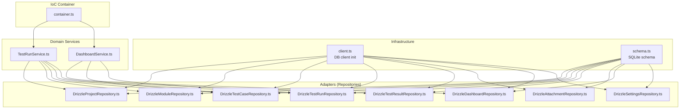
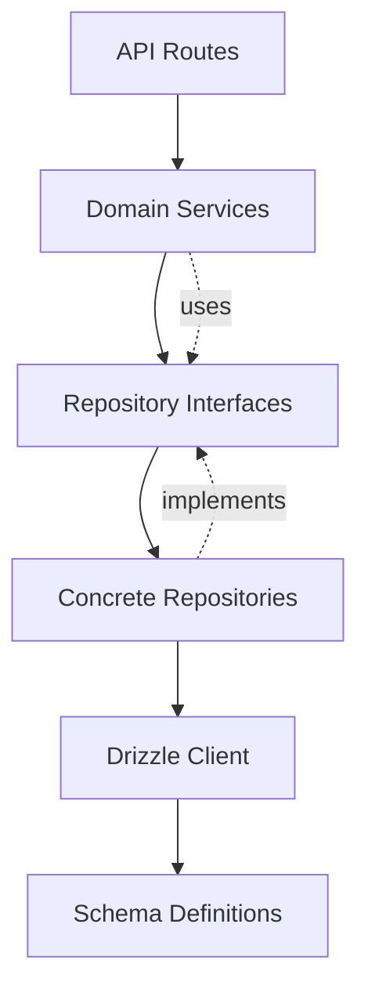
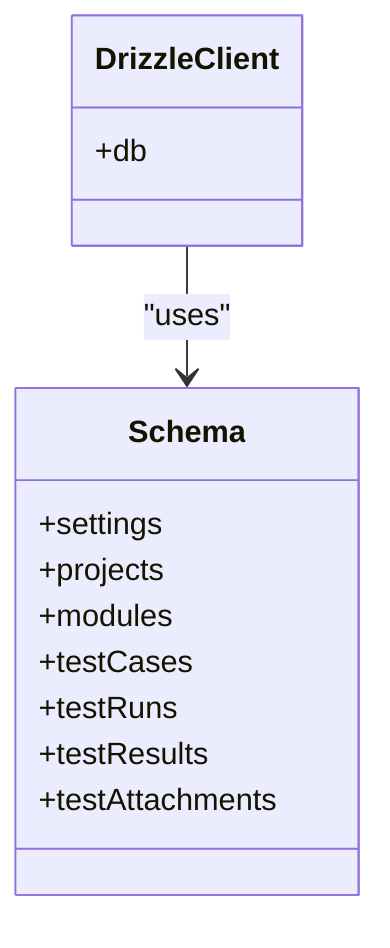
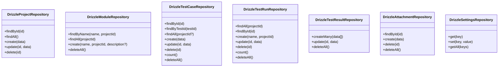
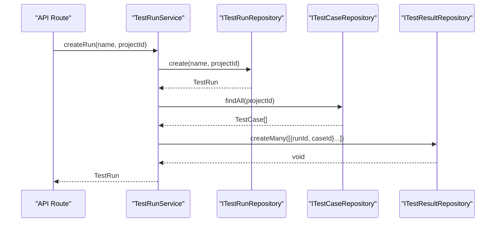
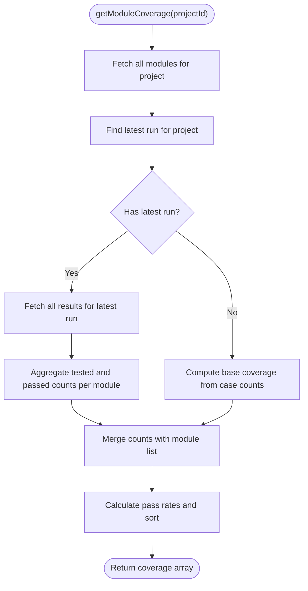
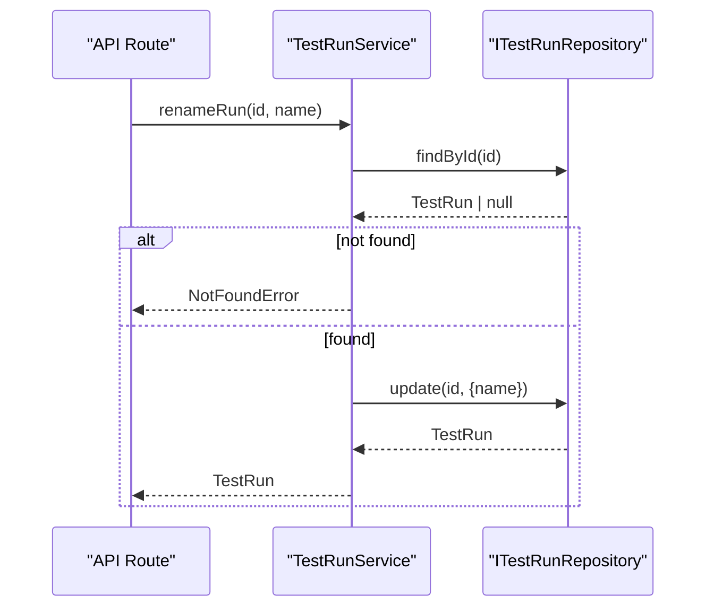
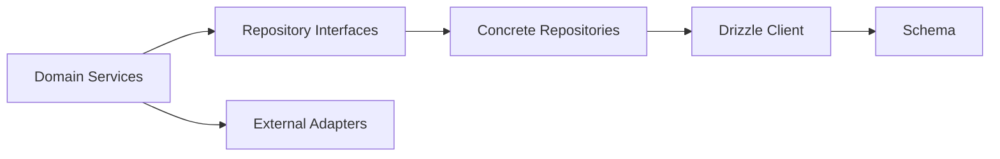

# Data Access Patterns and Repository Implementation

<cite>
**Referenced Files in This Document**
- [DrizzleAttachmentRepository.ts](file://src/adapters/persistence/drizzle/DrizzleAttachmentRepository.ts)
- [DrizzleDashboardRepository.ts](file://src/adapters/persistence/drizzle/DrizzleDashboardRepository.ts)
- [DrizzleModuleRepository.ts](file://src/adapters/persistence/drizzle/DrizzleModuleRepository.ts)
- [DrizzleProjectRepository.ts](file://src/adapters/persistence/drizzle/DrizzleProjectRepository.ts)
- [DrizzleSettingsRepository.ts](file://src/adapters/persistence/drizzle/DrizzleSettingsRepository.ts)
- [DrizzleTestCaseRepository.ts](file://src/adapters/persistence/drizzle/DrizzleTestCaseRepository.ts)
- [DrizzleTestResultRepository.ts](file://src/adapters/persistence/drizzle/DrizzleTestResultRepository.ts)
- [DrizzleTestRunRepository.ts](file://src/adapters/persistence/drizzle/DrizzleTestRunRepository.ts)
- [schema.ts](file://src/infrastructure/db/schema.ts)
- [client.ts](file://src/infrastructure/db/client.ts)
- [container.ts](file://src/infrastructure/container.ts)
- [TestRunService.ts](file://src/domain/services/TestRunService.ts)
- [DashboardService.ts](file://src/domain/services/DashboardService.ts)
- [index.ts](file://src/domain/types/index.ts)
</cite>

## Table of Contents
1. [Introduction](#introduction)
2. [Project Structure](#project-structure)
3. [Core Components](#core-components)
4. [Architecture Overview](#architecture-overview)
5. [Detailed Component Analysis](#detailed-component-analysis)
6. [Dependency Analysis](#dependency-analysis)
7. [Performance Considerations](#performance-considerations)
8. [Troubleshooting Guide](#troubleshooting-guide)
9. [Conclusion](#conclusion)
10. [Appendices](#appendices)

## Introduction
This document explains the data access patterns and repository implementation strategies used in the application. It focuses on how repositories implement CRUD operations, optimize queries, manage transactions, and support complex aggregations and joins. It also covers the benefits of the repository pattern, including abstraction of database operations and improved testability, along with caching strategies, connection pooling, and performance optimization techniques. Error handling patterns and transaction boundaries are addressed across various operations.

## Project Structure
The data access layer is implemented using Drizzle ORM with a clear separation between:
- Infrastructure: database client initialization and schema definitions
- Adapters: concrete repository implementations for each domain entity
- Domain services: orchestrate repositories and business logic
- IoC container: wires repositories and services together

**Diagram sources**
- [client.ts:1-32](file://src/infrastructure/db/client.ts#L1-L32)
- [schema.ts:1-60](file://src/infrastructure/db/schema.ts#L1-L60)
- [DrizzleProjectRepository.ts:1-52](file://src/adapters/persistence/drizzle/DrizzleProjectRepository.ts#L1-L52)
- [DrizzleModuleRepository.ts:1-34](file://src/adapters/persistence/drizzle/DrizzleModuleRepository.ts#L1-L34)
- [DrizzleTestCaseRepository.ts:1-71](file://src/adapters/persistence/drizzle/DrizzleTestCaseRepository.ts#L1-L71)
- [DrizzleTestRunRepository.ts:1-96](file://src/adapters/persistence/drizzle/DrizzleTestRunRepository.ts#L1-L96)
- [DrizzleTestResultRepository.ts:1-36](file://src/adapters/persistence/drizzle/DrizzleTestResultRepository.ts#L1-L36)
- [DrizzleAttachmentRepository.ts:1-26](file://src/adapters/persistence/drizzle/DrizzleAttachmentRepository.ts#L1-L26)
- [DrizzleDashboardRepository.ts:1-313](file://src/adapters/persistence/drizzle/DrizzleDashboardRepository.ts#L1-L313)
- [DrizzleSettingsRepository.ts:1-29](file://src/adapters/persistence/drizzle/DrizzleSettingsRepository.ts#L1-L29)
- [container.ts:1-126](file://src/infrastructure/container.ts#L1-L126)
- [TestRunService.ts:1-125](file://src/domain/services/TestRunService.ts#L1-L125)
- [DashboardService.ts:1-182](file://src/domain/services/DashboardService.ts#L1-L182)

**Section sources**
- [client.ts:1-32](file://src/infrastructure/db/client.ts#L1-L32)
- [schema.ts:1-60](file://src/infrastructure/db/schema.ts#L1-L60)
- [container.ts:1-126](file://src/infrastructure/container.ts#L1-L126)

## Core Components
- Drizzle ORM client initialized once and reused across repositories
- Strongly typed schema definitions for SQLite with foreign keys and constraints
- Repository classes implementing CRUD and specialized queries
- Domain services orchestrating repositories and coordinating workflows
- IoC container providing singletons and dependency wiring

Key characteristics:
- Abstraction of database operations behind repository interfaces
- Testability through interface-based design and DI
- Consistent error handling and return types across repositories
- Parallelization of dashboard queries for performance

**Section sources**
- [client.ts:1-32](file://src/infrastructure/db/client.ts#L1-L32)
- [schema.ts:1-60](file://src/infrastructure/db/schema.ts#L1-L60)
- [container.ts:1-126](file://src/infrastructure/container.ts#L1-L126)

## Architecture Overview
The application follows a layered architecture:
- Presentation/API routes depend on domain services
- Domain services depend on repository interfaces
- Repositories depend on the Drizzle client and schema
- Schema defines entities, relationships, and constraints

**Diagram sources**
- [container.ts:1-126](file://src/infrastructure/container.ts#L1-L126)
- [TestRunService.ts:1-125](file://src/domain/services/TestRunService.ts#L1-L125)
- [DashboardService.ts:1-182](file://src/domain/services/DashboardService.ts#L1-L182)
- [client.ts:1-32](file://src/infrastructure/db/client.ts#L1-L32)
- [schema.ts:1-60](file://src/infrastructure/db/schema.ts#L1-L60)

## Detailed Component Analysis

### Drizzle Client and Schema
- The client supports both SQLite (development/Electron) and PostgreSQL (Docker/production) via environment configuration
- SQLite uses WAL mode and foreign key enforcement for performance and integrity
- PostgreSQL uses a connection pool via the pg library
- Schema defines primary keys, foreign keys, and a unique index on test run + test case pairing

**Diagram sources**
- [client.ts:1-32](file://src/infrastructure/db/client.ts#L1-L32)
- [schema.ts:1-60](file://src/infrastructure/db/schema.ts#L1-L60)

**Section sources**
- [client.ts:1-32](file://src/infrastructure/db/client.ts#L1-L32)
- [schema.ts:1-60](file://src/infrastructure/db/schema.ts#L1-L60)

### Repository Pattern Benefits
- Abstraction of database operations behind interfaces enables swapping implementations
- Testability through mocking repositories in unit tests
- Centralized query logic and consistent error handling
- Clear separation of concerns between domain logic and data access

[No sources needed since this section provides conceptual benefits]

### CRUD Operations Across Repositories
- Projects: findById, findAll, create, update, delete
- Modules: findByName, findAll, create, deleteAll
- Test Cases: findById, findByTestId, findAll, create, update, delete, count, deleteAll
- Test Runs: findAll, findById, create, update, delete, count, deleteAll
- Test Results: createMany, update, deleteAll
- Attachments: findById, create, delete, deleteAll
- Settings: get, set, getAll

**Diagram sources**
- [DrizzleProjectRepository.ts:1-52](file://src/adapters/persistence/drizzle/DrizzleProjectRepository.ts#L1-L52)
- [DrizzleModuleRepository.ts:1-34](file://src/adapters/persistence/drizzle/DrizzleModuleRepository.ts#L1-L34)
- [DrizzleTestCaseRepository.ts:1-71](file://src/adapters/persistence/drizzle/DrizzleTestCaseRepository.ts#L1-L71)
- [DrizzleTestRunRepository.ts:1-96](file://src/adapters/persistence/drizzle/DrizzleTestRunRepository.ts#L1-L96)
- [DrizzleTestResultRepository.ts:1-36](file://src/adapters/persistence/drizzle/DrizzleTestResultRepository.ts#L1-L36)
- [DrizzleAttachmentRepository.ts:1-26](file://src/adapters/persistence/drizzle/DrizzleAttachmentRepository.ts#L1-L26)
- [DrizzleSettingsRepository.ts:1-29](file://src/adapters/persistence/drizzle/DrizzleSettingsRepository.ts#L1-L29)

**Section sources**
- [DrizzleProjectRepository.ts:1-52](file://src/adapters/persistence/drizzle/DrizzleProjectRepository.ts#L1-L52)
- [DrizzleModuleRepository.ts:1-34](file://src/adapters/persistence/drizzle/DrizzleModuleRepository.ts#L1-L34)
- [DrizzleTestCaseRepository.ts:1-71](file://src/adapters/persistence/drizzle/DrizzleTestCaseRepository.ts#L1-L71)
- [DrizzleTestRunRepository.ts:1-96](file://src/adapters/persistence/drizzle/DrizzleTestRunRepository.ts#L1-L96)
- [DrizzleTestResultRepository.ts:1-36](file://src/adapters/persistence/drizzle/DrizzleTestResultRepository.ts#L1-L36)
- [DrizzleAttachmentRepository.ts:1-26](file://src/adapters/persistence/drizzle/DrizzleAttachmentRepository.ts#L1-L26)
- [DrizzleSettingsRepository.ts:1-29](file://src/adapters/persistence/drizzle/DrizzleSettingsRepository.ts#L1-L29)

### Query Optimization Techniques
- Selective field projection: repositories fetch only required fields (e.g., test cases with selected columns)
- Inner joins and left joins to denormalize related data in a single query
- Aggregation with GROUP BY and SQL helpers for counts and pass rates
- Deduplication of attachments during result mapping
- Sorting by testId to ensure deterministic ordering
- Parallel fetching of dashboard metrics to reduce latency

Examples of optimized queries:
- Projection of selected fields for test cases filtered by project
- Aggregation of pass/fail counts per module using GROUP BY
- Left join to include attachments without excluding results

**Section sources**
- [DrizzleTestCaseRepository.ts:18-35](file://src/adapters/persistence/drizzle/DrizzleTestCaseRepository.ts#L18-L35)
- [DrizzleTestRunRepository.ts:21-67](file://src/adapters/persistence/drizzle/DrizzleTestRunRepository.ts#L21-L67)
- [DrizzleDashboardRepository.ts:266-271](file://src/adapters/persistence/drizzle/DrizzleDashboardRepository.ts#L266-L271)
- [DrizzleDashboardRepository.ts:278-296](file://src/adapters/persistence/drizzle/DrizzleDashboardRepository.ts#L278-L296)

### Transaction Management
- Single-table operations (insert, update, delete) are atomic per statement
- No explicit multi-statement transaction blocks are present in the repositories
- Business logic requiring cross-entity consistency is handled in domain services:
  - Creating a test run triggers creation of multiple results in a batch insert
  - Completing a run computes derived metrics and dispatches notifications/webhooks

**Diagram sources**
- [TestRunService.ts:33-51](file://src/domain/services/TestRunService.ts#L33-L51)
- [DrizzleTestRunRepository.ts:70-73](file://src/adapters/persistence/drizzle/DrizzleTestRunRepository.ts#L70-L73)
- [DrizzleTestCaseRepository.ts:18-35](file://src/adapters/persistence/drizzle/DrizzleTestCaseRepository.ts#L18-L35)
- [DrizzleTestResultRepository.ts:8-14](file://src/adapters/persistence/drizzle/DrizzleTestResultRepository.ts#L8-L14)

**Section sources**
- [TestRunService.ts:33-51](file://src/domain/services/TestRunService.ts#L33-L51)
- [DrizzleTestResultRepository.ts:8-14](file://src/adapters/persistence/drizzle/DrizzleTestResultRepository.ts#L8-L14)

### Complex Queries, Joins, and Aggregations
- Dashboard repository performs:
  - Latest run with nested results and attachments
  - Historical runs with aggregated statuses
  - Flaky tests computation using recent runs and failure rates
  - Priority distribution by counting cases per priority
  - Module coverage with counts and pass rates
  - Activity feed generation from run events

**Diagram sources**
- [DrizzleDashboardRepository.ts:249-311](file://src/adapters/persistence/drizzle/DrizzleDashboardRepository.ts#L249-L311)

**Section sources**
- [DrizzleDashboardRepository.ts:18-60](file://src/adapters/persistence/drizzle/DrizzleDashboardRepository.ts#L18-L60)
- [DrizzleDashboardRepository.ts:83-123](file://src/adapters/persistence/drizzle/DrizzleDashboardRepository.ts#L83-L123)
- [DrizzleDashboardRepository.ts:127-149](file://src/adapters/persistence/drizzle/DrizzleDashboardRepository.ts#L127-L149)
- [DrizzleDashboardRepository.ts:151-187](file://src/adapters/persistence/drizzle/DrizzleDashboardRepository.ts#L151-L187)
- [DrizzleDashboardRepository.ts:189-231](file://src/adapters/persistence/drizzle/DrizzleDashboardRepository.ts#L189-L231)
- [DrizzleDashboardRepository.ts:238-247](file://src/adapters/persistence/drizzle/DrizzleDashboardRepository.ts#L238-L247)
- [DrizzleDashboardRepository.ts:249-311](file://src/adapters/persistence/drizzle/DrizzleDashboardRepository.ts#L249-L311)

### Caching Strategies
- No explicit in-memory cache is implemented in repositories
- Dashboard aggregates are computed on demand; consider caching frequently accessed metrics
- Suggestion: cache module coverage and priority distributions for a short TTL keyed by projectId

[No sources needed since this section proposes general guidance]

### Connection Pooling and Performance Optimization
- PostgreSQL uses a connection pool via the pg library
- SQLite uses a single connection with WAL mode and foreign keys enabled
- Dashboard metrics are fetched in parallel to minimize response time
- Batch inserts for test results when creating runs

**Section sources**
- [client.ts:9-17](file://src/infrastructure/db/client.ts#L9-L17)
- [client.ts:20-24](file://src/infrastructure/db/client.ts#L20-L24)
- [DashboardService.ts:17-43](file://src/domain/services/DashboardService.ts#L17-L43)
- [DrizzleTestResultRepository.ts:8-14](file://src/adapters/persistence/drizzle/DrizzleTestResultRepository.ts#L8-L14)

### Error Handling Patterns and Transaction Boundaries
- Repositories throw meaningful errors when entities are not found (e.g., update operations)
- Services centralize error handling and coordinate operations; they throw domain-specific errors when entities are missing
- Transaction boundaries are implicit per repository method; cross-operation consistency is managed at the service level

**Diagram sources**
- [TestRunService.ts:53-63](file://src/domain/services/TestRunService.ts#L53-L63)
- [DrizzleTestRunRepository.ts:75-81](file://src/adapters/persistence/drizzle/DrizzleTestRunRepository.ts#L75-L81)

**Section sources**
- [DrizzleProjectRepository.ts:40](file://src/adapters/persistence/drizzle/DrizzleProjectRepository.ts#L40)
- [DrizzleTestCaseRepository.ts:54](file://src/adapters/persistence/drizzle/DrizzleTestCaseRepository.ts#L54)
- [TestRunService.ts:27-31](file://src/domain/services/TestRunService.ts#L27-L31)
- [TestRunService.ts:53-63](file://src/domain/services/TestRunService.ts#L53-L63)

## Dependency Analysis
Repositories depend on:
- The Drizzle client for database operations
- Schema definitions for table and column references
- Domain types for input/output contracts

Services depend on:
- Repository interfaces for data access
- External adapters for notifications and webhooks

**Diagram sources**
- [container.ts:1-126](file://src/infrastructure/container.ts#L1-L126)
- [client.ts:1-32](file://src/infrastructure/db/client.ts#L1-L32)
- [schema.ts:1-60](file://src/infrastructure/db/schema.ts#L1-L60)
- [index.ts:1-196](file://src/domain/types/index.ts#L1-L196)

**Section sources**
- [container.ts:1-126](file://src/infrastructure/container.ts#L1-L126)
- [index.ts:1-196](file://src/domain/types/index.ts#L1-L196)

## Performance Considerations
- Prefer selective projections to reduce payload sizes
- Use joins to avoid N+1 queries; map relationships in memory when needed
- Batch operations (e.g., createMany) to minimize round trips
- Parallelize independent dashboard metrics retrieval
- Consider indexing on frequently filtered columns (e.g., projectId, testRunId)
- Monitor SQLite WAL mode and foreign key overhead in production scenarios

[No sources needed since this section provides general guidance]

## Troubleshooting Guide
Common issues and resolutions:
- Entity not found: ensure proper existence checks before updates; services throw descriptive errors
- Missing attachments: verify left joins and deduplication logic in result mapping
- Slow dashboard loads: confirm parallel metric retrieval and avoid redundant queries
- PostgreSQL connectivity: verify DATABASE_URL and pool configuration

**Section sources**
- [DrizzleProjectRepository.ts:40](file://src/adapters/persistence/drizzle/DrizzleProjectRepository.ts#L40)
- [DrizzleTestCaseRepository.ts:54](file://src/adapters/persistence/drizzle/DrizzleTestCaseRepository.ts#L54)
- [DrizzleTestRunRepository.ts:34-57](file://src/adapters/persistence/drizzle/DrizzleTestRunRepository.ts#L34-L57)
- [client.ts:9-17](file://src/infrastructure/db/client.ts#L9-L17)

## Conclusion
The repository implementations leverage Drizzle ORM to provide clean, testable, and efficient data access. They implement robust CRUD operations, optimize queries with joins and aggregations, and coordinate complex workflows in domain services. While transactions are implicit per operation, cross-entity consistency is maintained at the service layer. With minor enhancements like caching and targeted indexing, performance can be further improved.

## Appendices
- Data model relationships and constraints are defined in the schema
- IoC container exposes repositories and services for use across the application

**Section sources**
- [schema.ts:1-60](file://src/infrastructure/db/schema.ts#L1-L60)
- [container.ts:1-126](file://src/infrastructure/container.ts#L1-L126)