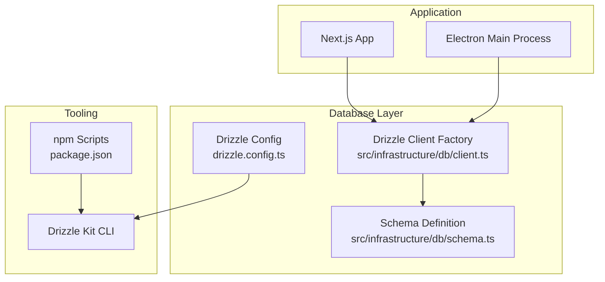
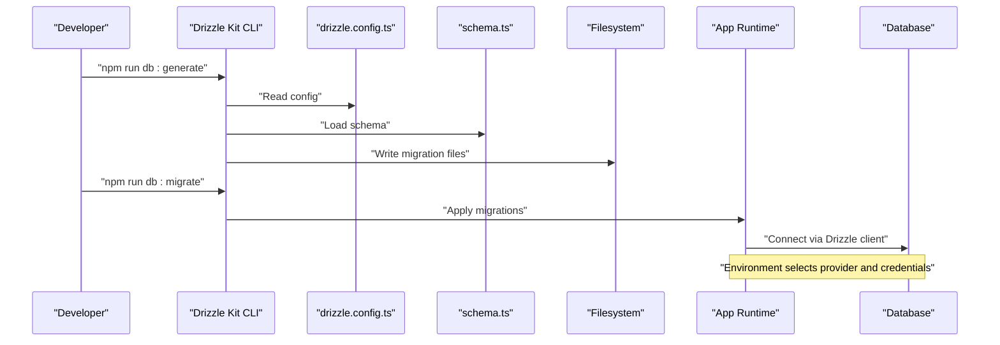
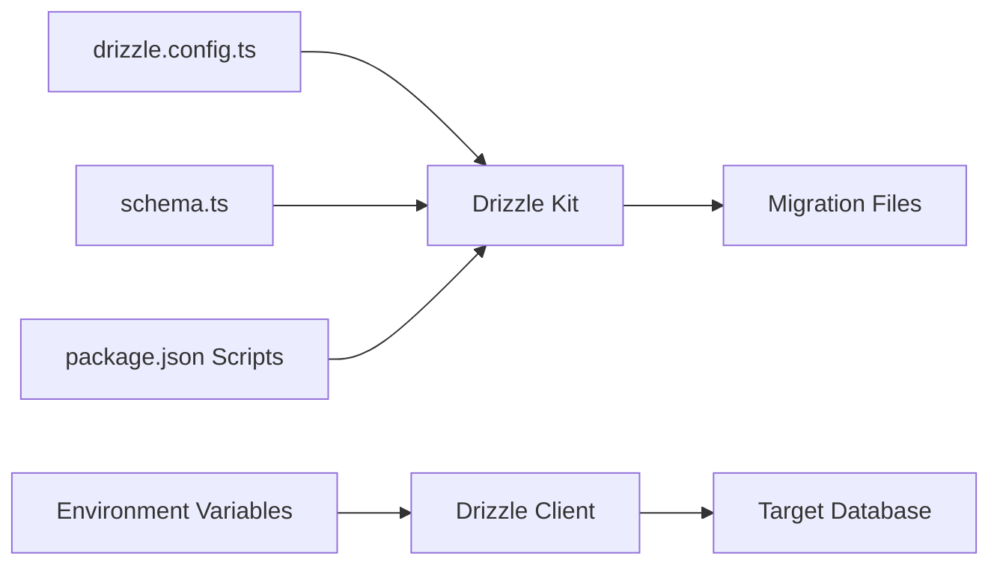

# Database Migrations and Schema Evolution

<cite>
**Referenced Files in This Document**
- [drizzle.config.ts](file://drizzle.config.ts)
- [client.ts](file://src/infrastructure/db/client.ts)
- [schema.ts](file://src/infrastructure/db/schema.ts)
- [package.json](file://package.json)
- [README.md](file://README.md)
- [DatabaseService.ts](file://src/domain/services/DatabaseService.ts)
- [main.ts](file://electron/main.ts)
</cite>

## Table of Contents
1. [Introduction](#introduction)
2. [Project Structure](#project-structure)
3. [Core Components](#core-components)
4. [Architecture Overview](#architecture-overview)
5. [Detailed Component Analysis](#detailed-component-analysis)
6. [Dependency Analysis](#dependency-analysis)
7. [Performance Considerations](#performance-considerations)
8. [Troubleshooting Guide](#troubleshooting-guide)
9. [Conclusion](#conclusion)
10. [Appendices](#appendices)

## Introduction
This document explains the database migration strategy and schema evolution process for Test Plan Manager. It covers Drizzle ORM configuration, migration file generation and execution, schema versioning, backward compatibility, rollbacks, and initialization on first run. It also provides practical guidance for adding new tables, modifying schemas, handling data transformations, testing migrations, deploying to production, and backing up the database.

## Project Structure
The database layer is organized around Drizzle ORM with a single schema definition and a unified client factory that supports both SQLite (development/Electron) and PostgreSQL (production). Migration tooling is driven by Drizzle Kit with commands exposed via npm scripts.

**Diagram sources**
- [client.ts:1-32](file://src/infrastructure/db/client.ts#L1-L32)
- [schema.ts:1-60](file://src/infrastructure/db/schema.ts#L1-L60)
- [drizzle.config.ts:1-11](file://drizzle.config.ts#L1-L11)
- [package.json:7-27](file://package.json#L7-L27)

**Section sources**
- [drizzle.config.ts:1-11](file://drizzle.config.ts#L1-L11)
- [client.ts:1-32](file://src/infrastructure/db/client.ts#L1-L32)
- [schema.ts:1-60](file://src/infrastructure/db/schema.ts#L1-L60)
- [package.json:7-27](file://package.json#L7-L27)
- [README.md:27-47](file://README.md#L27-L47)

## Core Components
- Drizzle configuration defines schema location, output directory for migrations, dialect selection, and credentials.
- The Drizzle client factory creates a connection based on environment variables, enabling SQLite for development/Electron and PostgreSQL for production.
- The schema definition file declares all tables and relationships used by the application.
- npm scripts expose migration commands: generate, migrate, push, and studio.

Key responsibilities:
- Drizzle configuration: centralizes dialect and schema mapping for Drizzle Kit.
- Drizzle client: selects provider, sets pragmas for SQLite, and binds schema to the connection.
- Schema: defines entities and constraints.
- Tooling: generates migration files and applies them to the target database.

**Section sources**
- [drizzle.config.ts:1-11](file://drizzle.config.ts#L1-L11)
- [client.ts:1-32](file://src/infrastructure/db/client.ts#L1-L32)
- [schema.ts:1-60](file://src/infrastructure/db/schema.ts#L1-L60)
- [package.json:7-27](file://package.json#L7-L27)
- [README.md:27-47](file://README.md#L27-L47)

## Architecture Overview
The migration and schema evolution pipeline integrates Drizzle Kit with the application runtime. Drizzle Kit reads the schema definition and produces migration files. The application connects to the database using the Drizzle client, which is configured via environment variables. On first run, the Electron main process initializes the database file and sets the connection string.

**Diagram sources**
- [drizzle.config.ts:1-11](file://drizzle.config.ts#L1-L11)
- [schema.ts:1-60](file://src/infrastructure/db/schema.ts#L1-L60)
- [package.json:20-21](file://package.json#L20-L21)
- [client.ts:6-25](file://src/infrastructure/db/client.ts#L6-L25)

## Detailed Component Analysis

### Drizzle ORM Configuration
- Schema path: points to the TypeScript schema definition.
- Output directory: migration files are generated here.
- Dialect: selected dynamically based on environment variables.
- Credentials: connection string or SQLite file URL.

Operational implications:
- Ensures migrations are generated against the current schema.
- Supports both SQLite and PostgreSQL depending on environment.

**Section sources**
- [drizzle.config.ts:1-11](file://drizzle.config.ts#L1-L11)

### Drizzle Client Factory
- Provider selection: PostgreSQL when the provider is set to postgres or postgresql; otherwise SQLite.
- PostgreSQL: uses a connection pool and node-postgres adapter.
- SQLite: uses better-sqlite3 with performance pragmas and foreign keys enabled.
- Singleton pattern: prevents multiple connections in development.

Initialization behavior:
- Sets journal mode to WAL and enables foreign keys for SQLite.
- Binds the schema to the connection.

**Section sources**
- [client.ts:1-32](file://src/infrastructure/db/client.ts#L1-L32)

### Schema Definition
- Entities: settings, projects, modules, test cases, test runs, test results, test attachments.
- Primary keys: cuid-based identifiers for all entities.
- Timestamps: createdAt/updatedAt fields with default functions.
- Relationships: foreign keys with cascade deletes.
- Constraints: unique index on test run and test case pairing.

Versioning approach:
- The schema acts as the source of truth for the current state.
- Drizzle Kit compares the schema to the target database to generate deltas.

Backward compatibility:
- Foreign keys and cascade deletes preserve referential integrity.
- Unique constraints prevent duplicate associations.

**Section sources**
- [schema.ts:1-60](file://src/infrastructure/db/schema.ts#L1-L60)

### Migration Commands and Execution
- Generate migrations: creates migration files from the schema.
- Apply migrations: runs pending migrations against the target database.
- Push schema: synchronizes schema directly (use with caution).
- Studio: opens a GUI for schema exploration.

Execution context:
- The application’s Drizzle client is used at runtime.
- Environment variables select the provider and credentials.

**Section sources**
- [package.json:20-23](file://package.json#L20-L23)
- [README.md:44-46](file://README.md#L44-L46)
- [client.ts:6-25](file://src/infrastructure/db/client.ts#L6-L25)

### First Run Initialization (Electron)
- The Electron main process ensures a database file exists in the user data directory.
- Sets the DATABASE_URL environment variable for the app runtime.
- Supports copying a packaged default database file in production builds.

Implications:
- Guarantees a writable database file on first run.
- Aligns runtime connection with the filesystem path.

**Section sources**
- [main.ts:35-60](file://electron/main.ts#L35-L60)

### Administrative Clear Operation
- Provides a controlled method to remove all data in the correct order to respect foreign key constraints.

Use cases:
- Testing environments.
- Resetting state during development.

**Section sources**
- [DatabaseService.ts:1-34](file://src/domain/services/DatabaseService.ts#L1-L34)

## Dependency Analysis
The migration and schema evolution process depends on the following relationships:
- Drizzle Kit reads drizzle.config.ts and schema.ts to generate migrations.
- The application runtime uses the Drizzle client to connect to the database.
- Environment variables determine provider and credentials.
- npm scripts orchestrate Drizzle Kit commands.

**Diagram sources**
- [drizzle.config.ts:1-11](file://drizzle.config.ts#L1-L11)
- [schema.ts:1-60](file://src/infrastructure/db/schema.ts#L1-L60)
- [client.ts:6-25](file://src/infrastructure/db/client.ts#L6-L25)
- [package.json:20-23](file://package.json#L20-L23)

**Section sources**
- [drizzle.config.ts:1-11](file://drizzle.config.ts#L1-L11)
- [client.ts:1-32](file://src/infrastructure/db/client.ts#L1-L32)
- [schema.ts:1-60](file://src/infrastructure/db/schema.ts#L1-L60)
- [package.json:7-27](file://package.json#L7-L27)

## Performance Considerations
- SQLite pragmas: WAL mode and foreign keys are enabled in the client factory to improve concurrency and enforce referential integrity.
- Connection pooling: PostgreSQL uses a connection pool for scalable production deployments.
- Migration granularity: keep migrations small and atomic to reduce downtime and simplify rollbacks.

[No sources needed since this section provides general guidance]

## Troubleshooting Guide
Common issues and resolutions:
- Migration conflicts: regenerate and reapply migrations after resolving schema drift.
- Provider mismatch: verify DB_PROVIDER and DATABASE_URL environment variables.
- SQLite file permissions: ensure the Electron app has write access to the database file path.
- Foreign key constraint failures: review deletion order and relationships in the schema.

Operational checks:
- Confirm migrations are applied by inspecting the target database.
- Use the Drizzle Studio GUI to validate schema state.

**Section sources**
- [client.ts:6-25](file://src/infrastructure/db/client.ts#L6-L25)
- [README.md:31-36](file://README.md#L31-L36)

## Conclusion
Test Plan Manager uses Drizzle ORM with Drizzle Kit for schema evolution. The configuration points to a single schema definition, while the client factory adapts to SQLite or PostgreSQL based on environment variables. Migrations are generated and applied via npm scripts, and the Electron main process ensures a writable database file on first run. The schema enforces referential integrity and unique constraints, supporting safe evolution over time.

[No sources needed since this section summarizes without analyzing specific files]

## Appendices

### A. Adding a New Table
Steps:
- Extend the schema definition with the new table and columns.
- Generate a migration file.
- Apply the migration to the target database.
- Verify the new table in the database.

References:
- [schema.ts:1-60](file://src/infrastructure/db/schema.ts#L1-L60)
- [drizzle.config.ts:1-11](file://drizzle.config.ts#L1-L11)
- [package.json](file://package.json#L20)

### B. Modifying an Existing Schema
Steps:
- Update the schema definition to reflect the change.
- Generate a migration file.
- Review the generated migration for correctness.
- Apply the migration to staging, then production.
- Validate data integrity and application behavior.

References:
- [schema.ts:1-60](file://src/infrastructure/db/schema.ts#L1-L60)
- [drizzle.config.ts:1-11](file://drizzle.config.ts#L1-L11)
- [package.json:20-21](file://package.json#L20-L21)

### C. Handling Data Transformations During Migrations
Guidance:
- Use Drizzle Kit’s migration DSL to add columns, update values, and transform data.
- Keep transformations minimal and reversible where possible.
- Test transformations on a copy of production data.

References:
- [drizzle.config.ts:1-11](file://drizzle.config.ts#L1-L11)
- [package.json:20-21](file://package.json#L20-L21)

### D. Migration Testing Strategies
- Test on a staging database identical to production.
- Use Drizzle Studio to visually confirm schema changes.
- Run integration tests to ensure queries and relationships remain valid.

References:
- [README.md:31-36](file://README.md#L31-L36)
- [package.json:22-23](file://package.json#L22-L23)

### E. Production Deployment Considerations
- Set DB_PROVIDER to postgres or postgresql and DATABASE_URL to a managed Postgres connection string.
- Apply migrations before deploying application code.
- Use connection pooling and monitor database performance.

References:
- [client.ts:9-17](file://src/infrastructure/db/client.ts#L9-L17)
- [package.json:20-21](file://package.json#L20-L21)

### F. Database Backup Procedures
- For SQLite: back up the database file from the Electron user data directory.
- For PostgreSQL: use managed backups or logical dumps.
- Automate backups as part of your CI/CD pipeline.

References:
- [main.ts:23-33](file://electron/main.ts#L23-L33)
- [client.ts:15-16](file://src/infrastructure/db/client.ts#L15-L16)