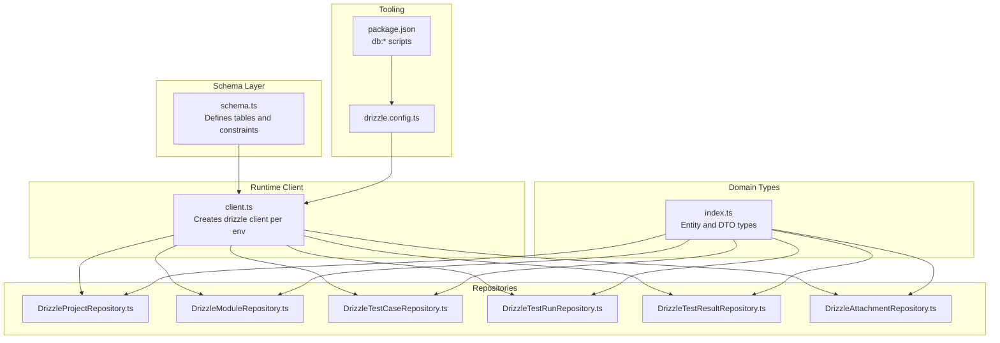
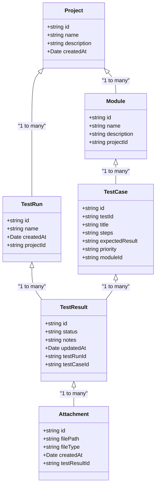
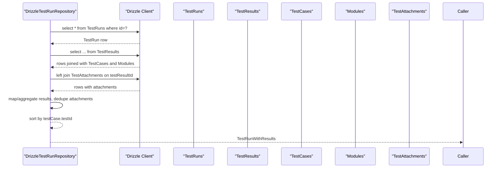
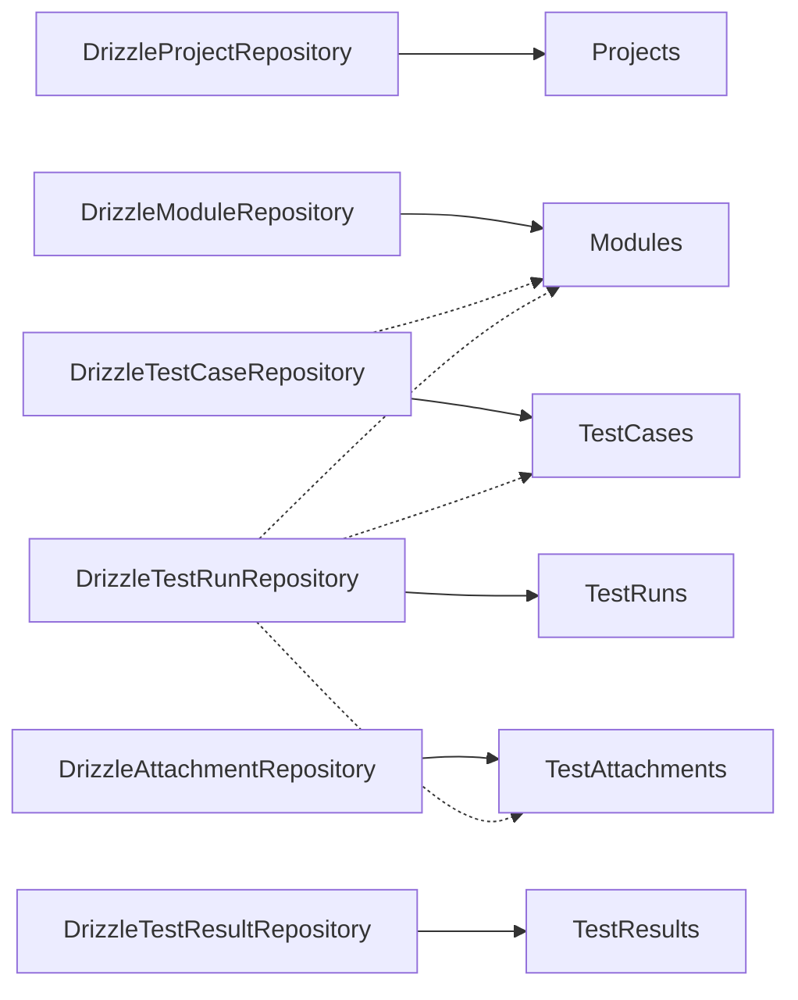
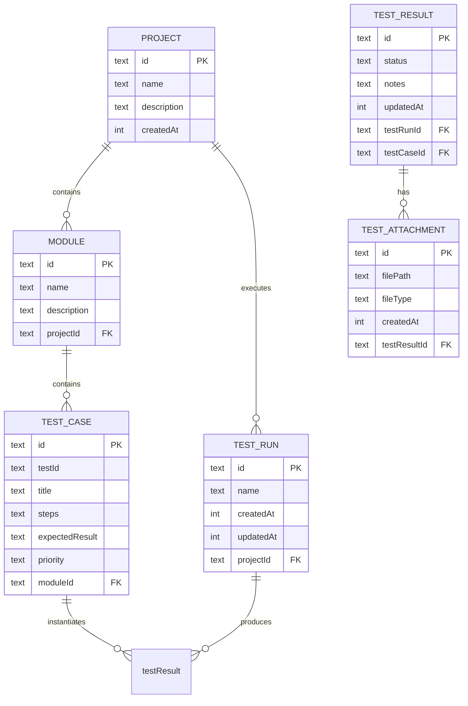

# Database Schema and Models

<cite>
**Referenced Files in This Document**
- [schema.ts](file://src/infrastructure/db/schema.ts)
- [client.ts](file://src/infrastructure/db/client.ts)
- [drizzle.config.ts](file://drizzle.config.ts)
- [DrizzleProjectRepository.ts](file://src/adapters/persistence/drizzle/DrizzleProjectRepository.ts)
- [DrizzleModuleRepository.ts](file://src/adapters/persistence/drizzle/DrizzleModuleRepository.ts)
- [DrizzleTestCaseRepository.ts](file://src/adapters/persistence/drizzle/DrizzleTestCaseRepository.ts)
- [DrizzleTestRunRepository.ts](file://src/adapters/persistence/drizzle/DrizzleTestRunRepository.ts)
- [DrizzleTestResultRepository.ts](file://src/adapters/persistence/drizzle/DrizzleTestResultRepository.ts)
- [DrizzleAttachmentRepository.ts](file://src/adapters/persistence/drizzle/DrizzleAttachmentRepository.ts)
- [index.ts](file://src/domain/types/index.ts)
- [DatabaseService.ts](file://src/domain/services/DatabaseService.ts)
- [package.json](file://package.json)
</cite>

## Table of Contents
1. [Introduction](#introduction)
2. [Project Structure](#project-structure)
3. [Core Components](#core-components)
4. [Architecture Overview](#architecture-overview)
5. [Detailed Component Analysis](#detailed-component-analysis)
6. [Dependency Analysis](#dependency-analysis)
7. [Performance Considerations](#performance-considerations)
8. [Troubleshooting Guide](#troubleshooting-guide)
9. [Conclusion](#conclusion)
10. [Appendices](#appendices)

## Introduction
This document describes the database schema and data models used by Test Plan Manager. It covers entity definitions, relationships, constraints, and indexes; explains how repositories access data; outlines caching and performance characteristics; documents data lifecycle and administrative operations; and highlights security and access control considerations. The schema is implemented with Drizzle ORM against SQLite in development/Electron and PostgreSQL in production environments.

## Project Structure
The database layer is organized around a single schema definition file, a runtime database client, and repository adapters implementing domain port interfaces. Drizzle Kit is configured for schema generation and migrations.

**Diagram sources**
- [schema.ts:1-60](file://src/infrastructure/db/schema.ts#L1-L60)
- [client.ts:1-32](file://src/infrastructure/db/client.ts#L1-L32)
- [drizzle.config.ts:1-11](file://drizzle.config.ts#L1-L11)
- [DrizzleProjectRepository.ts:1-52](file://src/adapters/persistence/drizzle/DrizzleProjectRepository.ts#L1-L52)
- [DrizzleModuleRepository.ts:1-34](file://src/adapters/persistence/drizzle/DrizzleModuleRepository.ts#L1-L34)
- [DrizzleTestCaseRepository.ts:1-71](file://src/adapters/persistence/drizzle/DrizzleTestCaseRepository.ts#L1-L71)
- [DrizzleTestRunRepository.ts:1-96](file://src/adapters/persistence/drizzle/DrizzleTestRunRepository.ts#L1-L96)
- [DrizzleTestResultRepository.ts:1-36](file://src/adapters/persistence/drizzle/DrizzleTestResultRepository.ts#L1-L36)
- [DrizzleAttachmentRepository.ts:1-26](file://src/adapters/persistence/drizzle/DrizzleAttachmentRepository.ts#L1-L26)
- [index.ts:1-196](file://src/domain/types/index.ts#L1-L196)
- [package.json:7-26](file://package.json#L7-L26)

**Section sources**
- [schema.ts:1-60](file://src/infrastructure/db/schema.ts#L1-L60)
- [client.ts:1-32](file://src/infrastructure/db/client.ts#L1-L32)
- [drizzle.config.ts:1-11](file://drizzle.config.ts#L1-L11)
- [package.json:7-26](file://package.json#L7-L26)

## Core Components
This section defines the core entities and their fields, types, and constraints. All identifiers are text-based UUIDs generated by cuid2.

- Settings
  - Purpose: Store key-value configuration entries with timestamps.
  - Fields:
    - key: text, PK
    - value: text, not null
    - updatedAt: integer (timestamp), default current time
  - Constraints: Primary key on key.

- Projects
  - Purpose: Top-level containers for test assets.
  - Fields:
    - id: text, PK, default cuid2
    - name: text, not null
    - description: text
    - createdAt: integer (timestamp), default current time
  - Constraints: None beyond PK.

- Modules
  - Purpose: Logical groupings of test cases within a project.
  - Fields:
    - id: text, PK, default cuid2
    - name: text, not null
    - description: text
    - projectId: text, not null, FK to Projects.id, cascade delete
  - Constraints: Foreign key cascade delete; no explicit index.

- TestCases
  - Purpose: Individual test specifications.
  - Fields:
    - id: text, PK, default cuid2
    - testId: text, not null
    - title: text, not null
    - steps: text, not null
    - expectedResult: text, not null
    - priority: text, not null
    - moduleId: text, not null, FK to Modules.id, cascade delete
  - Constraints: Foreign key cascade delete; no explicit index.

- TestRuns
  - Purpose: Executions of test plans scoped to a project.
  - Fields:
    - id: text, PK, default cuid2
    - name: text, not null
    - createdAt: integer (timestamp), default current time
    - updatedAt: integer (timestamp), default current time
    - projectId: text, not null, FK to Projects.id, cascade delete
  - Constraints: Foreign key cascade delete; no explicit index.

- TestResults
  - Purpose: Per-run outcomes for individual test cases.
  - Fields:
    - id: text, PK, default cuid2
    - status: text, not null, default "UNTESTED"
    - notes: text
    - updatedAt: integer (timestamp), default current time
    - testRunId: text, not null, FK to TestRuns.id, cascade delete
    - testCaseId: text, not null, FK to TestCases.id, cascade delete
  - Constraints:
    - Foreign keys cascade delete
    - Unique composite index on (testRunId, testCaseId)

- TestAttachments
  - Purpose: Files attached to test results.
  - Fields:
    - id: text, PK, default cuid2
    - filePath: text, not null
    - fileType: text, not null
    - createdAt: integer (timestamp), default current time
    - testResultId: text, not null, FK to TestResults.id, cascade delete
  - Constraints: Foreign key cascade delete; no explicit index.

Notes:
- Timestamps are stored as integers in UTC milliseconds.
- All identifiers are text-based UUIDs generated by cuid2.
- Cascade deletes ensure referential integrity when parent records are removed.

**Section sources**
- [schema.ts:4-59](file://src/infrastructure/db/schema.ts#L4-L59)
- [index.ts:9-59](file://src/domain/types/index.ts#L9-L59)

## Architecture Overview
The data access pattern follows a layered architecture:
- Domain types define entities and DTOs.
- Repositories implement domain ports and encapsulate queries.
- The Drizzle client abstracts database selection (SQLite vs PostgreSQL) and connection pooling.
- Drizzle Kit manages schema and migrations.

**Diagram sources**
- [schema.ts:10-59](file://src/infrastructure/db/schema.ts#L10-L59)
- [index.ts:9-59](file://src/domain/types/index.ts#L9-L59)

## Detailed Component Analysis

### Schema Definitions and Constraints
- Primary keys: All entities use text PKs with cuid2 defaults.
- Foreign keys: Projects → Modules, Modules → TestCases, Projects → TestRuns, TestRuns/TestCases → TestResults, TestResults → TestAttachments.
- Cascade deletes: Parent deletions propagate to children via FK constraints.
- Unique index: TestResults has a unique composite index on (testRunId, testCaseId) to prevent duplicates.

**Section sources**
- [schema.ts:10-59](file://src/infrastructure/db/schema.ts#L10-L59)

### Drizzle Client and Environment Selection
- SQLite (development/Electron): Uses better-sqlite3 with WAL journal mode and foreign keys enabled for performance and integrity.
- PostgreSQL (production/Docker): Uses node-postgres with drizzle-orm/node-postgres for Neon-style deployments.
- Singleton pattern prevents multiple connections in development.

**Section sources**
- [client.ts:6-31](file://src/infrastructure/db/client.ts#L6-L31)

### Repository Implementations and Access Patterns
- ProjectRepository
  - Operations: findById, findAll, create, update, delete.
  - Notes: Returns dates as Date objects; update throws if record not found.

- ModuleRepository
  - Operations: findByName (composite filter), findAll, create, deleteAll.
  - Notes: Uses AND condition for name+projectId lookup.

- TestCaseRepository
  - Operations: findById, findByTestId, findAll (optionally filtered by project), create, update, delete, count, deleteAll.
  - Notes: Optional join with Modules when filtering by projectId.

- TestRunRepository
  - Operations: findAll (by project), findById (with nested results and attachments), create, update, delete, count, deleteAll.
  - Notes: Aggregates TestResult rows with TestCase and Module data; left-joins attachments; deduplicates attachments; sorts by testCase.testId.

- TestResultRepository
  - Operations: createMany (bulk insert with default status), update, deleteAll.
  - Notes: Supports partial updates for status and notes.

- AttachmentRepository
  - Operations: findById, create, delete, deleteAll.

**Diagram sources**
- [DrizzleTestRunRepository.ts:16-67](file://src/adapters/persistence/drizzle/DrizzleTestRunRepository.ts#L16-L67)

**Section sources**
- [DrizzleProjectRepository.ts:8-50](file://src/adapters/persistence/drizzle/DrizzleProjectRepository.ts#L8-L50)
- [DrizzleModuleRepository.ts:8-32](file://src/adapters/persistence/drizzle/DrizzleModuleRepository.ts#L8-L32)
- [DrizzleTestCaseRepository.ts:8-69](file://src/adapters/persistence/drizzle/DrizzleTestCaseRepository.ts#L8-L69)
- [DrizzleTestRunRepository.ts:8-94](file://src/adapters/persistence/drizzle/DrizzleTestRunRepository.ts#L8-L94)
- [DrizzleTestResultRepository.ts:8-34](file://src/adapters/persistence/drizzle/DrizzleTestResultRepository.ts#L8-L34)
- [DrizzleAttachmentRepository.ts:8-24](file://src/adapters/persistence/drizzle/DrizzleAttachmentRepository.ts#L8-L24)

### Data Types and Validation Rules
- Enum-like constraints:
  - TestStatus: PASSED | FAILED | BLOCKED | UNTESTED
  - Priority: P1 | P2 | P3 | P4
- Required fields:
  - Projects: name
  - Modules: name, projectId
  - TestCases: testId, title, steps, expectedResult, priority, moduleId
  - TestRuns: name, projectId
  - TestResults: status (defaults to UNTESTED), testRunId, testCaseId
  - TestAttachments: filePath, fileType, testResultId
- Unique constraints:
  - Settings.key is unique (PK)
  - TestResults.(testRunId, testCaseId) is unique

**Section sources**
- [index.ts:3-5](file://src/domain/types/index.ts#L3-L5)
- [schema.ts:4-59](file://src/infrastructure/db/schema.ts#L4-L59)

### Sample Data Examples
- Project
  - id: "cuid2-text-id"
  - name: "Web App QA"
  - description: "End-to-end testing for web application"
  - createdAt: 1710000000000
- Module
  - id: "cuid2-text-id"
  - name: "Authentication"
  - description: "Login/logout flows"
  - projectId: "project-id"
- TestCase
  - id: "cuid2-text-id"
  - testId: "TC-001"
  - title: "User can log in with valid credentials"
  - steps: "Navigate to login... submit form..."
  - expectedResult: "Redirect to dashboard"
  - priority: "P1"
  - moduleId: "module-id"
- TestRun
  - id: "cuid2-text-id"
  - name: "Sprint 1 Regression"
  - createdAt: 1710000000000
  - updatedAt: 1710000000000
  - projectId: "project-id"
- TestResult
  - id: "cuid2-text-id"
  - status: "UNTESTED"
  - notes: "Awaiting environment"
  - updatedAt: 1710000000000
  - testRunId: "run-id"
  - testCaseId: "case-id"
- Attachment
  - id: "cuid2-text-id"
  - filePath: "/uploads/screenshot.png"
  - fileType: "image/png"
  - createdAt: 1710000000000
  - testResultId: "result-id"

[No sources needed since this section provides conceptual examples]

### Common Query Patterns
- Find all test cases for a project:
  - Join TestCase with Module on moduleId=modules.id
  - Filter by modules.projectId
- Retrieve a TestRun with nested results and attachments:
  - Inner join TestResults with TestCases and Modules
  - Left join TestAttachments on testResultId
  - Deduplicate attachments and sort by testCase.testId
- Bulk insert TestResults:
  - Insert multiple rows with default status set to UNTESTED

**Section sources**
- [DrizzleTestCaseRepository.ts:18-35](file://src/adapters/persistence/drizzle/DrizzleTestCaseRepository.ts#L18-L35)
- [DrizzleTestRunRepository.ts:21-62](file://src/adapters/persistence/drizzle/DrizzleTestRunRepository.ts#L21-L62)

## Dependency Analysis
The following diagram shows repository-to-schema dependencies and the direction of data flow.

**Diagram sources**
- [DrizzleProjectRepository.ts:1-52](file://src/adapters/persistence/drizzle/DrizzleProjectRepository.ts#L1-L52)
- [DrizzleModuleRepository.ts:1-34](file://src/adapters/persistence/drizzle/DrizzleModuleRepository.ts#L1-L34)
- [DrizzleTestCaseRepository.ts:1-71](file://src/adapters/persistence/drizzle/DrizzleTestCaseRepository.ts#L1-L71)
- [DrizzleTestRunRepository.ts:1-96](file://src/adapters/persistence/drizzle/DrizzleTestRunRepository.ts#L1-L96)
- [DrizzleTestResultRepository.ts:1-36](file://src/adapters/persistence/drizzle/DrizzleTestResultRepository.ts#L1-L36)
- [DrizzleAttachmentRepository.ts:1-26](file://src/adapters/persistence/drizzle/DrizzleAttachmentRepository.ts#L1-L26)
- [schema.ts:10-59](file://src/infrastructure/db/schema.ts#L10-L59)

**Section sources**
- [DrizzleProjectRepository.ts:1-52](file://src/adapters/persistence/drizzle/DrizzleProjectRepository.ts#L1-L52)
- [DrizzleModuleRepository.ts:1-34](file://src/adapters/persistence/drizzle/DrizzleModuleRepository.ts#L1-L34)
- [DrizzleTestCaseRepository.ts:1-71](file://src/adapters/persistence/drizzle/DrizzleTestCaseRepository.ts#L1-L71)
- [DrizzleTestRunRepository.ts:1-96](file://src/adapters/persistence/drizzle/DrizzleTestRunRepository.ts#L1-L96)
- [DrizzleTestResultRepository.ts:1-36](file://src/adapters/persistence/drizzle/DrizzleTestResultRepository.ts#L1-L36)
- [DrizzleAttachmentRepository.ts:1-26](file://src/adapters/persistence/drizzle/DrizzleAttachmentRepository.ts#L1-L26)

## Performance Considerations
- SQLite tuning:
  - WAL mode improves concurrency and write performance.
  - Foreign keys enabled for integrity with cascade deletes.
- PostgreSQL deployment:
  - Node-postgres driver with drizzle-orm/node-postgres for Neon-style hosting.
- Indexing:
  - Unique composite index on TestResults.(testRunId, testCaseId) prevents duplicates and supports fast existence checks.
  - No additional indexes are defined in the schema; consider adding indexes for frequently filtered columns (e.g., modules.projectId, testCases.testId) if query volume grows.
- Query patterns:
  - Prefer filtered joins (e.g., project-scoped lookups) to limit result sets.
  - Use returning() to minimize round trips for inserts/updates.
- Caching:
  - No explicit caching layer is present in the repository implementations. Consider application-level caches for read-heavy aggregates (e.g., dashboard metrics) if needed.

**Section sources**
- [client.ts:22-23](file://src/infrastructure/db/client.ts#L22-L23)
- [schema.ts:49-51](file://src/infrastructure/db/schema.ts#L49-L51)

## Troubleshooting Guide
- Data deletion order:
  - To avoid foreign key constraint violations, delete in the following order: Attachments → TestResults → TestRuns → TestCases → Modules → Projects.
  - The DatabaseService enforces this order for administrative cleanup.
- SQLite connection issues:
  - Ensure WAL mode and foreign keys are enabled; verify DATABASE_PATH and file permissions.
- PostgreSQL connectivity:
  - Verify DATABASE_URL and network access; confirm driver availability.
- Migration and schema sync:
  - Use drizzle-kit commands to generate, migrate, or push schema changes.

**Section sources**
- [DatabaseService.ts:26-32](file://src/domain/services/DatabaseService.ts#L26-L32)
- [client.ts:6-25](file://src/infrastructure/db/client.ts#L6-L25)
- [package.json:20-23](file://package.json#L20-L23)

## Conclusion
The database schema for Test Plan Manager is designed around a small set of core entities with clear relationships and enforced referential integrity via cascade deletes. Drizzle ORM provides a consistent abstraction across SQLite and PostgreSQL, while repository implementations encapsulate CRUD and aggregation logic. The design supports efficient project-scoped queries and maintains uniqueness constraints for critical combinations like run-case pairs. Administrators can safely clear data by following the enforced deletion order, and Drizzle Kit enables straightforward schema management.

## Appendices

### Database Schema Diagram

**Diagram sources**
- [schema.ts:10-59](file://src/infrastructure/db/schema.ts#L10-L59)

### Migration and Tooling
- Drizzle Kit configuration points to the schema file and selects dialect based on environment variables.
- Available scripts include generate, migrate, push, and studio for schema management and inspection.

**Section sources**
- [drizzle.config.ts:3-10](file://drizzle.config.ts#L3-L10)
- [package.json:20-23](file://package.json#L20-L23)