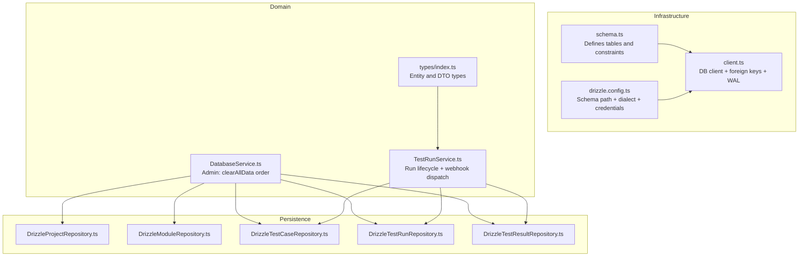
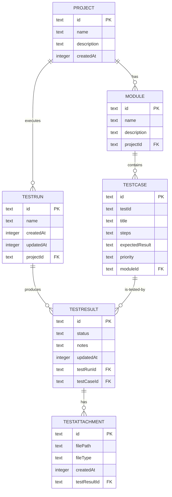
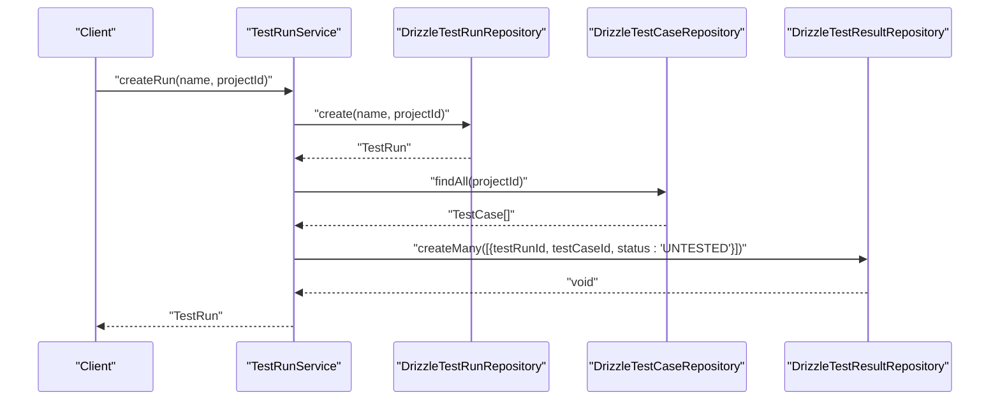
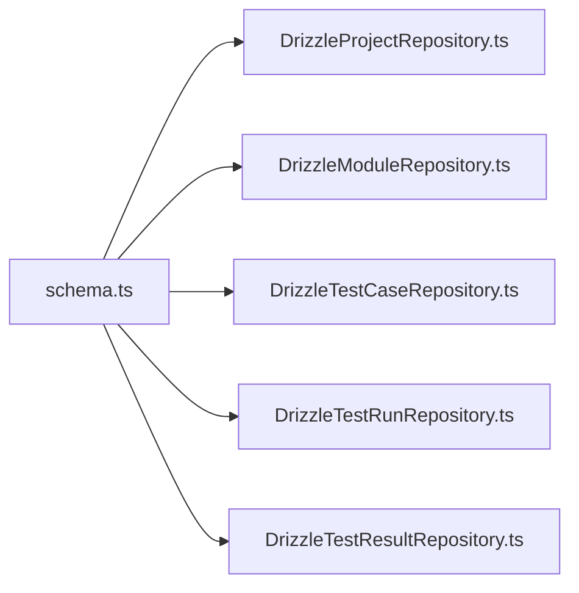

# Entity Relationships and Schema Overview

<cite>
**Referenced Files in This Document**
- [schema.ts](file://src/infrastructure/db/schema.ts)
- [client.ts](file://src/infrastructure/db/client.ts)
- [drizzle.config.ts](file://drizzle.config.ts)
- [DrizzleProjectRepository.ts](file://src/adapters/persistence/drizzle/DrizzleProjectRepository.ts)
- [DrizzleModuleRepository.ts](file://src/adapters/persistence/drizzle/DrizzleModuleRepository.ts)
- [DrizzleTestCaseRepository.ts](file://src/adapters/persistence/drizzle/DrizzleTestCaseRepository.ts)
- [DrizzleTestRunRepository.ts](file://src/adapters/persistence/drizzle/DrizzleTestRunRepository.ts)
- [DrizzleTestResultRepository.ts](file://src/adapters/persistence/drizzle/DrizzleTestResultRepository.ts)
- [index.ts](file://src/domain/types/index.ts)
- [TestRunService.ts](file://src/domain/services/TestRunService.ts)
- [DatabaseService.ts](file://src/domain/services/DatabaseService.ts)
</cite>

## Table of Contents
1. [Introduction](#introduction)
2. [Project Structure](#project-structure)
3. [Core Components](#core-components)
4. [Architecture Overview](#architecture-overview)
5. [Detailed Component Analysis](#detailed-component-analysis)
6. [Dependency Analysis](#dependency-analysis)
7. [Performance Considerations](#performance-considerations)
8. [Troubleshooting Guide](#troubleshooting-guide)
9. [Conclusion](#conclusion)

## Introduction
This document explains the database schema and entity relationships used by the Test Plan Manager. It focuses on the hierarchical structure from Projects through Modules to TestCases, and how TestRuns connect to TestResults. It documents foreign key constraints, cascade deletion policies, referential integrity rules, and the rationale behind design choices such as cuid2-based UUIDs and timestamp-based audit trails. Unique constraints, particularly the unique index on testRunId and testCaseId combinations, are explained along with their business implications.

## Project Structure
The schema is defined centrally and consumed by repositories and services across the application. The database client initializes SQLite with foreign keys enabled and WAL mode for performance, and supports PostgreSQL via environment configuration.

**Diagram sources**
- [schema.ts:1-60](file://src/infrastructure/db/schema.ts#L1-L60)
- [client.ts:1-31](file://src/infrastructure/db/client.ts#L1-L31)
- [drizzle.config.ts:1-11](file://drizzle.config.ts#L1-L11)
- [index.ts:1-196](file://src/domain/types/index.ts#L1-L196)
- [TestRunService.ts:1-125](file://src/domain/services/TestRunService.ts#L1-L125)
- [DatabaseService.ts:1-33](file://src/domain/services/DatabaseService.ts#L1-L33)
- [DrizzleProjectRepository.ts:1-52](file://src/adapters/persistence/drizzle/DrizzleProjectRepository.ts#L1-L52)
- [DrizzleModuleRepository.ts:1-34](file://src/adapters/persistence/drizzle/DrizzleModuleRepository.ts#L1-L34)
- [DrizzleTestCaseRepository.ts:1-71](file://src/adapters/persistence/drizzle/DrizzleTestCaseRepository.ts#L1-L71)
- [DrizzleTestRunRepository.ts:1-96](file://src/adapters/persistence/drizzle/DrizzleTestRunRepository.ts#L1-L96)
- [DrizzleTestResultRepository.ts:1-36](file://src/adapters/persistence/drizzle/DrizzleTestResultRepository.ts#L1-L36)

**Section sources**
- [schema.ts:1-60](file://src/infrastructure/db/schema.ts#L1-L60)
- [client.ts:1-31](file://src/infrastructure/db/client.ts#L1-L31)
- [drizzle.config.ts:1-11](file://drizzle.config.ts#L1-L11)
- [index.ts:1-196](file://src/domain/types/index.ts#L1-L196)

## Core Components
- Projects: Top-level container for test assets.
- Modules: Logical groupings under Projects.
- TestCases: Individual test definitions linked to Modules.
- TestRuns: Executions of a Project’s test plan.
- TestResults: Per-case outcomes within a TestRun.
- TestAttachments: Optional artifacts linked to TestResults.

Key design characteristics:
- UUIDs generated with cuid2 for globally unique identifiers.
- Timestamp-based audit fields for createdAt/updatedAt.
- Foreign keys with cascade delete policies to maintain referential integrity.
- Unique constraint on (testRunId, testCaseId) to ensure one result per case per run.

**Section sources**
- [schema.ts:10-60](file://src/infrastructure/db/schema.ts#L10-L60)
- [index.ts:9-59](file://src/domain/types/index.ts#L9-L59)

## Architecture Overview
The schema enforces a strict hierarchy: Projects -> Modules -> TestCases. TestRuns are independent entities that link to TestResults, which in turn link to TestCases. Cascade deletes propagate deletions from parent entities to children, preventing orphaned records.

**Diagram sources**
- [schema.ts:10-60](file://src/infrastructure/db/schema.ts#L10-L60)

## Detailed Component Analysis

### Projects
- Purpose: Container for test assets and test runs.
- Keys: id (UUID), createdAt (audit).
- Relationships: One-to-many with Modules.

**Section sources**
- [schema.ts:10-15](file://src/infrastructure/db/schema.ts#L10-L15)
- [index.ts:9-14](file://src/domain/types/index.ts#L9-L14)
- [DrizzleProjectRepository.ts:1-52](file://src/adapters/persistence/drizzle/DrizzleProjectRepository.ts#L1-L52)

### Modules
- Purpose: Logical grouping of test cases within a Project.
- Keys: id (UUID), projectId (FK), cascade delete policy.
- Relationships: Many-to-one with Project, one-to-many with TestCases.

**Section sources**
- [schema.ts:17-22](file://src/infrastructure/db/schema.ts#L17-L22)
- [index.ts:16-21](file://src/domain/types/index.ts#L16-L21)
- [DrizzleModuleRepository.ts:1-34](file://src/adapters/persistence/drizzle/DrizzleModuleRepository.ts#L1-L34)

### TestCases
- Purpose: Individual test definitions with steps and expected results.
- Keys: id (UUID), moduleId (FK), testId (business identifier).
- Relationships: Many-to-one with Module, one-to-many with TestResults.

**Section sources**
- [schema.ts:24-32](file://src/infrastructure/db/schema.ts#L24-L32)
- [index.ts:23-32](file://src/domain/types/index.ts#L23-L32)
- [DrizzleTestCaseRepository.ts:1-71](file://src/adapters/persistence/drizzle/DrizzleTestCaseRepository.ts#L1-L71)

### TestRuns
- Purpose: Executions of a Project’s test plan.
- Keys: id (UUID), projectId (FK), createdAt/updatedAt (audit).
- Relationships: Many-to-one with Project, one-to-many with TestResults.

**Section sources**
- [schema.ts:34-40](file://src/infrastructure/db/schema.ts#L34-L40)
- [index.ts:34-40](file://src/domain/types/index.ts#L34-L40)
- [DrizzleTestRunRepository.ts:1-96](file://src/adapters/persistence/drizzle/DrizzleTestRunRepository.ts#L1-L96)

### TestResults
- Purpose: Per-case outcomes within a TestRun.
- Keys: id (UUID), testRunId (FK), testCaseId (FK), status (audit).
- Constraints: Unique index on (testRunId, testCaseId) ensures one result per case per run.
- Relationships: Many-to-one with TestRun and TestCase; one-to-many with TestAttachments.

**Section sources**
- [schema.ts:42-51](file://src/infrastructure/db/schema.ts#L42-L51)
- [index.ts:42-51](file://src/domain/types/index.ts#L42-L51)
- [DrizzleTestResultRepository.ts:1-36](file://src/adapters/persistence/drizzle/DrizzleTestResultRepository.ts#L1-L36)

### TestAttachments
- Purpose: Optional artifacts associated with TestResults.
- Keys: id (UUID), testResultId (FK), createdAt (audit).
- Relationships: Many-to-one with TestResult.

**Section sources**
- [schema.ts:53-59](file://src/infrastructure/db/schema.ts#L53-L59)
- [index.ts:53-59](file://src/domain/types/index.ts#L53-L59)

### Cascade Deletion Policy
Cascade deletes are configured on the following relationships:
- Module -> TestCases: Deleting a Module deletes its TestCases.
- Project -> Modules: Deleting a Project deletes its Modules.
- Project -> TestRuns: Deleting a Project deletes its TestRuns.
- TestRun -> TestResults: Deleting a TestRun deletes its TestResults.
- TestResult -> TestAttachments: Deleting a TestResult deletes its Attachments.

These policies ensure referential integrity and simplify cleanup operations.

**Section sources**
- [schema.ts:21](file://src/infrastructure/db/schema.ts#L21)
- [schema.ts:39](file://src/infrastructure/db/schema.ts#L39)
- [schema.ts:47](file://src/infrastructure/db/schema.ts#L47)
- [schema.ts:58](file://src/infrastructure/db/schema.ts#L58)

### Unique Constraint on TestResults
A unique index on (testRunId, testCaseId) guarantees that each case appears only once per run. This prevents duplicate results and simplifies aggregation and reporting logic.

Business implications:
- Ensures deterministic run results per case.
- Supports efficient lookups and updates.
- Prevents accidental duplication during bulk result creation.

**Section sources**
- [schema.ts:49-51](file://src/infrastructure/db/schema.ts#L49-L51)

### Audit Trail and Timestamps
Timestamps are used for audit trails:
- createdAt: Creation time for Projects, Modules, TestCases, TestRuns, TestResults, and TestAttachments.
- updatedAt: Last modification time for Projects, TestRuns, and TestResults.

These timestamps enable chronological ordering, reporting, and compliance tracking.

**Section sources**
- [schema.ts:14](file://src/infrastructure/db/schema.ts#L14)
- [schema.ts:21](file://src/infrastructure/db/schema.ts#L21)
- [schema.ts:38](file://src/infrastructure/db/schema.ts#L38)
- [schema.ts:46](file://src/infrastructure/db/schema.ts#L46)
- [schema.ts:57](file://src/infrastructure/db/schema.ts#L57)

### UUID Generation with cuid2
All primary keys use cuid2-generated UUIDs. This choice provides:
- Global uniqueness without centralized coordination.
- URL-friendly strings.
- No reliance on auto-increment sequences.

**Section sources**
- [schema.ts:11](file://src/infrastructure/db/schema.ts#L11)
- [schema.ts:18](file://src/infrastructure/db/schema.ts#L18)
- [schema.ts:25](file://src/infrastructure/db/schema.ts#L25)
- [schema.ts:35](file://src/infrastructure/db/schema.ts#L35)
- [schema.ts:43](file://src/infrastructure/db/schema.ts#L43)
- [schema.ts:54](file://src/infrastructure/db/schema.ts#L54)

### TestRun Lifecycle and Result Management
TestRunService orchestrates run creation, result updates, and completion notifications. On run creation, it generates UNTESTED results for all existing TestCases in the Project. It also dispatches webhooks and notifications upon run updates and completion.

**Diagram sources**
- [TestRunService.ts:33-51](file://src/domain/services/TestRunService.ts#L33-L51)
- [DrizzleTestRunRepository.ts:70-73](file://src/adapters/persistence/drizzle/DrizzleTestRunRepository.ts#L70-L73)
- [DrizzleTestCaseRepository.ts:18-35](file://src/adapters/persistence/drizzle/DrizzleTestCaseRepository.ts#L18-L35)
- [DrizzleTestResultRepository.ts:8-14](file://src/adapters/persistence/drizzle/DrizzleTestResultRepository.ts#L8-L14)

**Section sources**
- [TestRunService.ts:1-125](file://src/domain/services/TestRunService.ts#L1-L125)
- [DrizzleTestRunRepository.ts:1-96](file://src/adapters/persistence/drizzle/DrizzleTestRunRepository.ts#L1-L96)
- [DrizzleTestCaseRepository.ts:1-71](file://src/adapters/persistence/drizzle/DrizzleTestCaseRepository.ts#L1-L71)
- [DrizzleTestResultRepository.ts:1-36](file://src/adapters/persistence/drizzle/DrizzleTestResultRepository.ts#L1-L36)

## Dependency Analysis
The schema defines tight coupling between entities through foreign keys and cascade policies. Repositories depend on the schema definitions, while services orchestrate higher-level operations.

**Diagram sources**
- [schema.ts:1-60](file://src/infrastructure/db/schema.ts#L1-L60)
- [DrizzleProjectRepository.ts:1-52](file://src/adapters/persistence/drizzle/DrizzleProjectRepository.ts#L1-L52)
- [DrizzleModuleRepository.ts:1-34](file://src/adapters/persistence/drizzle/DrizzleModuleRepository.ts#L1-L34)
- [DrizzleTestCaseRepository.ts:1-71](file://src/adapters/persistence/drizzle/DrizzleTestCaseRepository.ts#L1-L71)
- [DrizzleTestRunRepository.ts:1-96](file://src/adapters/persistence/drizzle/DrizzleTestRunRepository.ts#L1-L96)
- [DrizzleTestResultRepository.ts:1-36](file://src/adapters/persistence/drizzle/DrizzleTestResultRepository.ts#L1-L36)

**Section sources**
- [schema.ts:1-60](file://src/infrastructure/db/schema.ts#L1-L60)

## Performance Considerations
- SQLite configuration enables WAL mode and foreign keys for improved concurrency and integrity.
- Timestamps support efficient sorting and filtering.
- Unique index on (testRunId, testCaseId) optimizes lookups and enforces uniqueness efficiently.

Operational tips:
- Prefer batch insertions for TestResults to minimize round trips.
- Use createdAt ordering for pagination and recent-first views.
- Ensure indexes exist on frequently filtered columns (e.g., projectId, moduleId, testRunId).

**Section sources**
- [client.ts:22-24](file://src/infrastructure/db/client.ts#L22-L24)
- [schema.ts:49-51](file://src/infrastructure/db/schema.ts#L49-L51)

## Troubleshooting Guide
Common issues and resolutions:
- Integrity constraint violations when deleting parents:
  - Cause: Attempting to delete a Project or Module with children.
  - Resolution: Use cascade delete or delete children first.
- Duplicate TestResult entries:
  - Cause: Inserting multiple rows with same (testRunId, testCaseId).
  - Resolution: Rely on unique index; ensure createMany does not duplicate.
- Orphaned records:
  - Cause: Disabling foreign keys or manual SQL without cascade.
  - Resolution: Re-enable foreign keys and rely on cascade policies.

Administrative operations:
- Clearing all data follows a safe order to respect foreign key constraints.

**Section sources**
- [client.ts:22-24](file://src/infrastructure/db/client.ts#L22-L24)
- [DatabaseService.ts:26-32](file://src/domain/services/DatabaseService.ts#L26-L32)

## Conclusion
The schema establishes a clear, scalable hierarchy from Projects to Modules to TestCases, with TestRuns and TestResults forming the execution layer. cuid2 UUIDs and timestamp-based audits provide robust identity and traceability. Cascade deletion policies and a unique index on (testRunId, testCaseId) ensure referential integrity and predictable run outcomes. Together, these design choices support reliable test plan management and execution tracking.