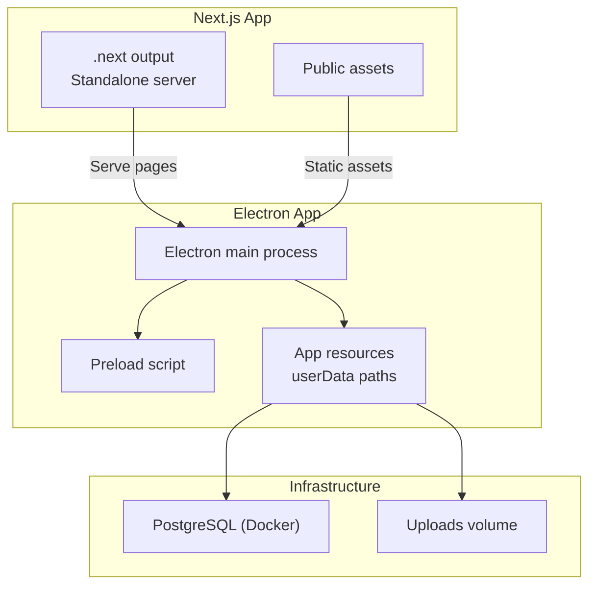
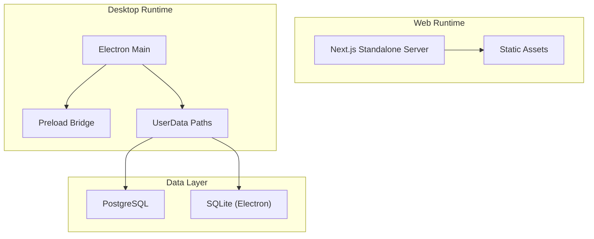
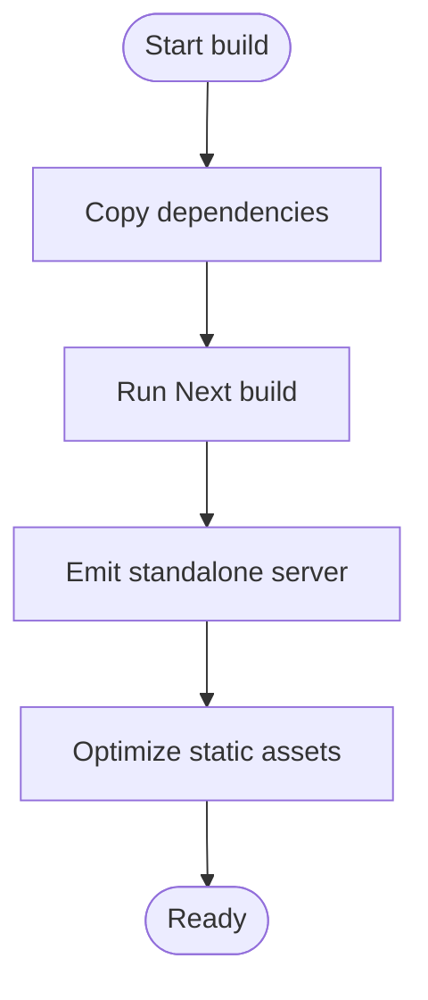
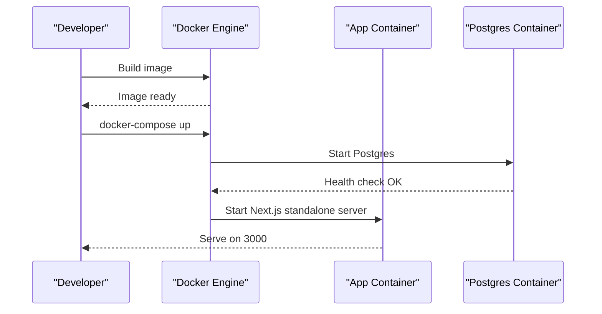
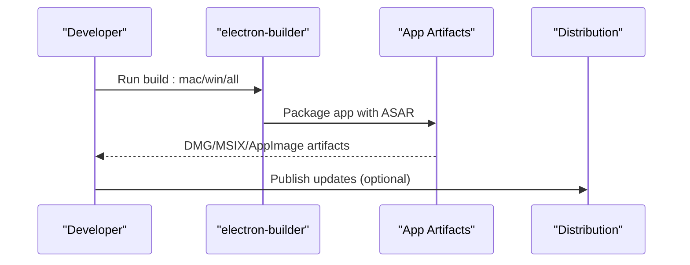
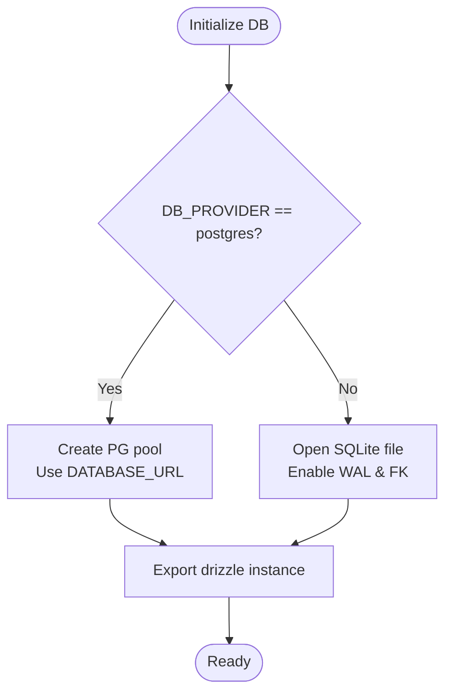
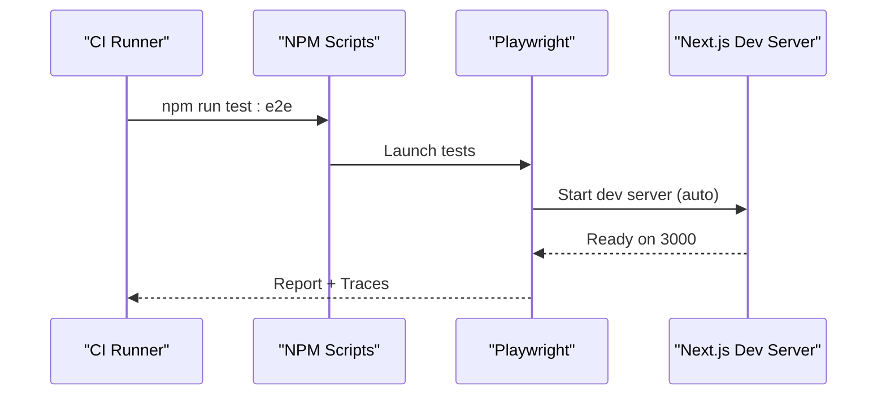
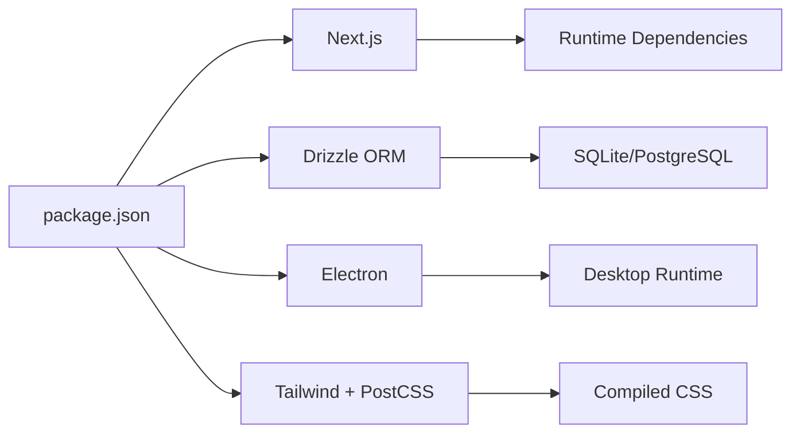

# Deployment and DevOps

<cite>
**Referenced Files in This Document**
- [package.json](file://package.json)
- [Dockerfile](file://Dockerfile)
- [docker-compose.yml](file://docker-compose.yml)
- [next.config.ts](file://next.config.ts)
- [tsconfig.json](file://tsconfig.json)
- [electron-builder.yml](file://electron-builder.yml)
- [electron/main.ts](file://electron/main.ts)
- [electron/preload.ts](file://electron/preload.ts)
- [drizzle.config.ts](file://drizzle.config.ts)
- [src/infrastructure/db/client.ts](file://src/infrastructure/db/client.ts)
- [src/infrastructure/config.ts](file://src/infrastructure/config.ts)
- [playwright.config.ts](file://playwright.config.ts)
- [README-ELECTRON.md](file://README-ELECTRON.md)
- [README.md](file://README.md)
- [postcss.config.mjs](file://postcss.config.mjs)
- [next-env.d.ts](file://next-env.d.ts)
</cite>

## Table of Contents
1. [Introduction](#introduction)
2. [Project Structure](#project-structure)
3. [Core Components](#core-components)
4. [Architecture Overview](#architecture-overview)
5. [Detailed Component Analysis](#detailed-component-analysis)
6. [Dependency Analysis](#dependency-analysis)
7. [Performance Considerations](#performance-considerations)
8. [Troubleshooting Guide](#troubleshooting-guide)
9. [Conclusion](#conclusion)
10. [Appendices](#appendices)

## Introduction
This document provides comprehensive deployment and DevOps guidance for Test Plan Manager. It covers the Next.js build and runtime pipeline, TypeScript configuration, asset bundling, Docker containerization, environment variable management, Electron desktop packaging and distribution, CI/CD considerations, automated testing, monitoring and backup strategies, and troubleshooting.

## Project Structure
The project combines a Next.js 15 application with an Electron wrapper. Key deployment-related artifacts include:
- Next.js build and runtime configuration
- Dockerfile and docker-compose for containerized deployment
- Electron builder configuration for desktop packaging
- Drizzle ORM configuration for database connectivity
- Playwright configuration for E2E testing

**Diagram sources**
- [Dockerfile:12-19](file://Dockerfile#L12-L19)
- [docker-compose.yml:3-28](file://docker-compose.yml#L3-L28)
- [electron/main.ts:74-112](file://electron/main.ts#L74-L112)
- [electron/preload.ts:1-31](file://electron/preload.ts#L1-L31)

**Section sources**
- [package.json:7-27](file://package.json#L7-L27)
- [next.config.ts:22-23](file://next.config.ts#L22-L23)
- [Dockerfile:12-19](file://Dockerfile#L12-L19)
- [docker-compose.yml:3-28](file://docker-compose.yml#L3-L28)
- [electron-builder.yml:5-16](file://electron-builder.yml#L5-L16)

## Core Components
- Next.js build and runtime
  - Standalone output mode for minimal container footprint
  - TypeScript strictness and ESLint integration
  - Remote image pattern allowance for placeholders
- Electron packaging
  - Multi-target builds for macOS, Windows, Linux
  - App Store (MAS) support and hardened runtime
  - ASAR packaging enabled
- Database connectivity
  - Drizzle ORM with SQLite for desktop/dev and PostgreSQL for Docker/production
- Containerization
  - Multi-stage Docker build with Alpine base
  - Volume mounts for uploads and Postgres data
- Testing
  - Playwright E2E with auto-started dev server

**Section sources**
- [next.config.ts:3-10](file://next.config.ts#L3-L10)
- [next.config.ts:22-23](file://next.config.ts#L22-L23)
- [electron-builder.yml:23-47](file://electron-builder.yml#L23-L47)
- [drizzle.config.ts:3-10](file://drizzle.config.ts#L3-L10)
- [src/infrastructure/db/client.ts:6-25](file://src/infrastructure/db/client.ts#L6-L25)
- [Dockerfile:1-20](file://Dockerfile#L1-L20)
- [docker-compose.yml:13-14](file://docker-compose.yml#L13-L14)
- [playwright.config.ts:38-43](file://playwright.config.ts#L38-L43)

## Architecture Overview
The system supports three deployment modes:
- Web-only (Next.js standalone server)
- Desktop (Electron packaged app)
- Hybrid (Electron bundles Next.js and serves assets locally)

**Diagram sources**
- [Dockerfile:15-16](file://Dockerfile#L15-L16)
- [electron/main.ts:24-60](file://electron/main.ts#L24-L60)
- [src/infrastructure/db/client.ts:9-24](file://src/infrastructure/db/client.ts#L9-L24)

## Detailed Component Analysis

### Next.js Build and Optimization
- Build process
  - Uses Next.js CLI to compile pages and static assets
  - Standalone output enables self-contained server deployment
- TypeScript and linting
  - Strict compiler options with preserved JSX
  - ESLint configured to ignore during builds
- Asset bundling
  - Remote image allowance for placeholder images
  - Tailwind and PostCSS configured via PostCSS config
- Development behavior
  - Watch options adjusted for HMR and Electron paths
  - Disabled HMR when a specific environment variable is set

**Diagram sources**
- [Dockerfile:6-10](file://Dockerfile#L6-L10)
- [next.config.ts:24-50](file://next.config.ts#L24-L50)
- [postcss.config.mjs:1-10](file://postcss.config.mjs#L1-L10)

**Section sources**
- [package.json:10-11](file://package.json#L10-L11)
- [next.config.ts:22-23](file://next.config.ts#L22-L23)
- [next.config.ts:12-21](file://next.config.ts#L12-L21)
- [next.config.ts:24-50](file://next.config.ts#L24-L50)
- [tsconfig.json:11-24](file://tsconfig.json#L11-L24)
- [postcss.config.mjs:1-10](file://postcss.config.mjs#L1-L10)

### Docker Configuration and Environment Management
- Multi-stage build
  - Deps stage installs production dependencies
  - Builder stage compiles the app
  - Runner stage copies standalone server and static assets
- Runtime environment
  - NODE_ENV set to production
  - Port 3000 exposed
- Compose orchestration
  - App service depends on a healthy database
  - Uploads volume mounted for persistent file storage
  - PostgreSQL managed as a separate service with named volume

**Diagram sources**
- [Dockerfile:1-20](file://Dockerfile#L1-L20)
- [docker-compose.yml:3-28](file://docker-compose.yml#L3-L28)

**Section sources**
- [Dockerfile:14-19](file://Dockerfile#L14-L19)
- [docker-compose.yml:7-14](file://docker-compose.yml#L7-L14)
- [docker-compose.yml:16-27](file://docker-compose.yml#L16-L27)

### Electron Desktop Packaging and Distribution
- Build targets
  - macOS DMG and MAS targets with hardened runtime and entitlements
  - Windows NSIS and MSIX targets
  - Linux AppImage and deb targets
- Packaging
  - ASAR enabled
  - Extra resources copied from prisma directory
  - Files include Next.js output, public assets, Electron sources, and dependencies
- Runtime behavior
  - Development loads from Next.js dev server; production loads built HTML
  - UserData paths for database and files
  - IPC bridge exposes safe APIs to renderer

**Diagram sources**
- [electron-builder.yml:17-22](file://electron-builder.yml#L17-L22)
- [electron-builder.yml:25-47](file://electron-builder.yml#L25-L47)
- [electron-builder.yml:49-79](file://electron-builder.yml#L49-L79)
- [electron/main.ts:98-107](file://electron/main.ts#L98-L107)

**Section sources**
- [electron-builder.yml:1-83](file://electron-builder.yml#L1-L83)
- [README-ELECTRON.md:22-36](file://README-ELECTRON.md#L22-L36)
- [README-ELECTRON.md:55-68](file://README-ELECTRON.md#L55-L68)
- [electron/main.ts:24-60](file://electron/main.ts#L24-L60)
- [electron/main.ts:74-112](file://electron/main.ts#L74-L112)
- [electron/preload.ts:1-31](file://electron/preload.ts#L1-L31)

### Database Connectivity and Persistence
- Provider selection
  - PostgreSQL when DB_PROVIDER is postgres or postgresql
  - SQLite otherwise (used by Electron and development)
- Connection details
  - DATABASE_URL controls connection string
  - DATABASE_PATH influences SQLite file location
- Drizzle configuration
  - Schema path and output directory configured
  - Dialect selected based on environment

**Diagram sources**
- [src/infrastructure/db/client.ts:6-25](file://src/infrastructure/db/client.ts#L6-L25)
- [drizzle.config.ts:3-10](file://drizzle.config.ts#L3-L10)

**Section sources**
- [src/infrastructure/db/client.ts:6-25](file://src/infrastructure/db/client.ts#L6-L25)
- [drizzle.config.ts:3-10](file://drizzle.config.ts#L3-L10)
- [src/infrastructure/config.ts:7-27](file://src/infrastructure/config.ts#L7-L27)

### Automated Testing and CI/CD Considerations
- Playwright configuration
  - Auto-starts Next.js dev server for tests
  - Runs against localhost:3000
  - HTML reporter and trace collection
- CI-friendly behavior
  - Retries and reduced worker count on CI
  - Reuse existing server in CI to speed up runs
- Recommended CI tasks
  - Install dependencies
  - Run lint and type checks
  - Run E2E tests
  - Build and publish artifacts (web and desktop)
  - Optional: run database migration scripts

**Diagram sources**
- [playwright.config.ts:38-43](file://playwright.config.ts#L38-L43)
- [package.json:24-26](file://package.json#L24-L26)

**Section sources**
- [playwright.config.ts:1-45](file://playwright.config.ts#L1-L45)
- [package.json:18-26](file://package.json#L18-L26)

## Dependency Analysis
- Build-time dependencies
  - Next.js, TypeScript, Tailwind, PostCSS
  - Drizzle Kit for migrations
  - Electron and electron-builder for desktop
- Runtime dependencies
  - Next.js runtime, drizzle-orm, better-sqlite3 or pg
  - Electron runtime and preload bridge
- External integrations
  - Gemini LLM provider via environment variables
  - PostgreSQL via DATABASE_URL

**Diagram sources**
- [package.json:28-74](file://package.json#L28-L74)
- [postcss.config.mjs:1-10](file://postcss.config.mjs#L1-L10)

**Section sources**
- [package.json:28-74](file://package.json#L28-L74)
- [postcss.config.mjs:1-10](file://postcss.config.mjs#L1-L10)

## Performance Considerations
- Next.js
  - Standalone output reduces container size and startup time
  - Watch options optimized for development to avoid unnecessary rebuilds
- Database
  - SQLite WAL mode and foreign keys enabled for reliability and performance
  - Connection pooling for PostgreSQL in production
- Electron
  - ASAR packaging improves load times
  - Separate preload bridge minimizes IPC overhead
- Containerization
  - Multi-stage build reduces final image size
  - Minimal base image (Alpine) for faster pulls and smaller footprint

[No sources needed since this section provides general guidance]

## Troubleshooting Guide
- Next.js build fails
  - Verify TypeScript strictness and ignoreBuildErrors setting
  - Ensure remote image patterns are configured if using placeholders
- Docker container does not start
  - Confirm database health check passes
  - Check environment variables for DATABASE_URL and DB_PROVIDER
  - Validate volume mounts for uploads and Postgres data
- Electron app crashes on startup
  - Verify userData paths exist and are writable
  - Ensure DATABASE_URL is set appropriately for packaged vs dev mode
  - Confirm preload bridge exposes required APIs
- Database connectivity issues
  - For PostgreSQL, verify connection string and network reachability
  - For SQLite, confirm file permissions and path resolution
- E2E tests fail
  - Check dev server readiness and port binding
  - Review traces and HTML reports for failures

**Section sources**
- [next.config.ts:8-10](file://next.config.ts#L8-L10)
- [next.config.ts:12-21](file://next.config.ts#L12-L21)
- [docker-compose.yml:7-14](file://docker-compose.yml#L7-L14)
- [docker-compose.yml:24-27](file://docker-compose.yml#L24-L27)
- [electron/main.ts:24-60](file://electron/main.ts#L24-L60)
- [src/infrastructure/db/client.ts:19-24](file://src/infrastructure/db/client.ts#L19-L24)
- [playwright.config.ts:38-43](file://playwright.config.ts#L38-L43)

## Conclusion
This guide outlines a robust deployment strategy for Test Plan Manager across web, desktop, and hybrid environments. By leveraging Next.js standalone output, multi-stage Docker builds, Electron packaging, and Drizzle ORM, teams can achieve reliable, scalable deployments with clear separation of concerns between web and desktop runtimes.

[No sources needed since this section summarizes without analyzing specific files]

## Appendices

### Environment Variables Reference
- DB_PROVIDER: Selects database provider (sqlite/postgres)
- DATABASE_URL: Connection string for PostgreSQL
- DATABASE_PATH: Path to SQLite file for Electron/dev
- FILES_PATH: Directory for uploaded files
- APP_URL: Application base URL
- NODE_ENV: Runtime environment
- LLM_PROVIDER, LLM_API_KEY, LLM_BASE_URL, LLM_MODEL: LLM configuration
- DISABLE_HMR: Controls HMR behavior in development

**Section sources**
- [src/infrastructure/config.ts:7-27](file://src/infrastructure/config.ts#L7-L27)
- [drizzle.config.ts:3-10](file://drizzle.config.ts#L3-L10)
- [src/infrastructure/db/client.ts:6-25](file://src/infrastructure/db/client.ts#L6-L25)
- [next.config.ts:27-47](file://next.config.ts#L27-L47)

### Deployment Strategies
- Web application
  - Build with Next.js, run standalone server in container
  - Mount uploads volume for persistent file storage
- Desktop application
  - Build Electron artifacts with electron-builder
  - Distribute via DMG/MSIX/AppImage or App Store
- Hybrid scenario
  - Electron bundles Next.js output and serves locally
  - Use userData paths for database and files

**Section sources**
- [Dockerfile:12-19](file://Dockerfile#L12-L19)
- [electron-builder.yml:17-22](file://electron-builder.yml#L17-L22)
- [electron/main.ts:98-107](file://electron/main.ts#L98-L107)

### Monitoring, Logging, Backup, and Disaster Recovery
- Monitoring
  - Use container logs for runtime diagnostics
  - Track database health and connection metrics
- Logging
  - Capture Next.js server logs and application logs
  - Store logs externally for retention
- Backups
  - PostgreSQL: Regular logical backups using pg_dump
  - SQLite (Electron): Backup user data directory
  - Uploads: Persist and snapshot the uploads volume
- Disaster Recovery
  - Restore database from latest backup
  - Recreate containers from images
  - Rehydrate user data from backups

[No sources needed since this section provides general guidance]