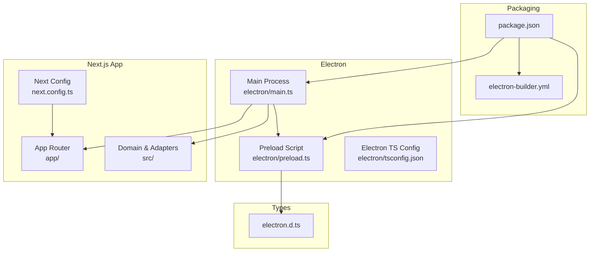
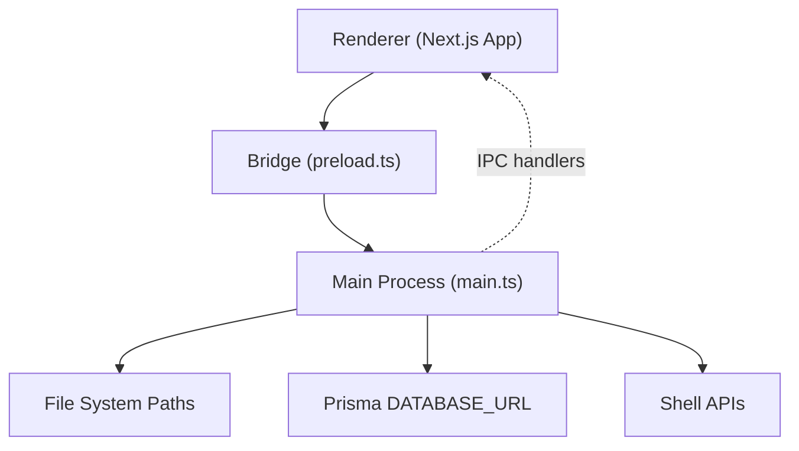
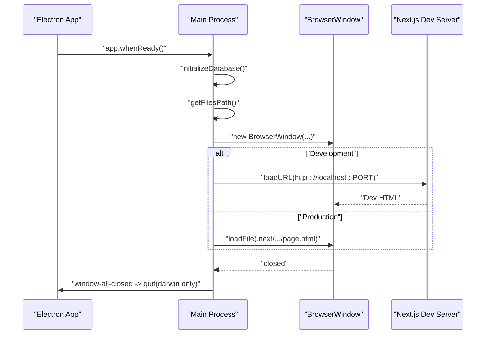
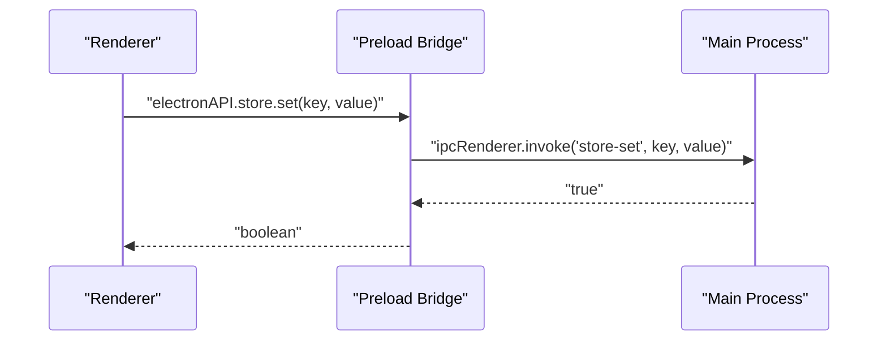
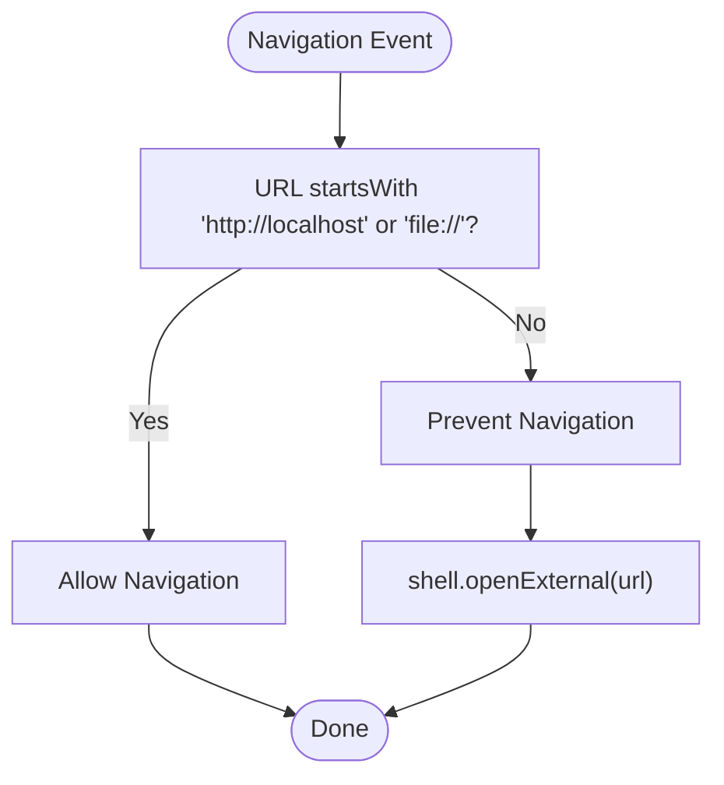
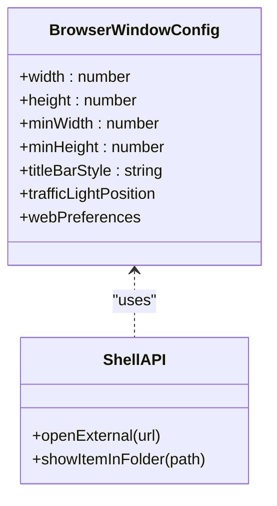
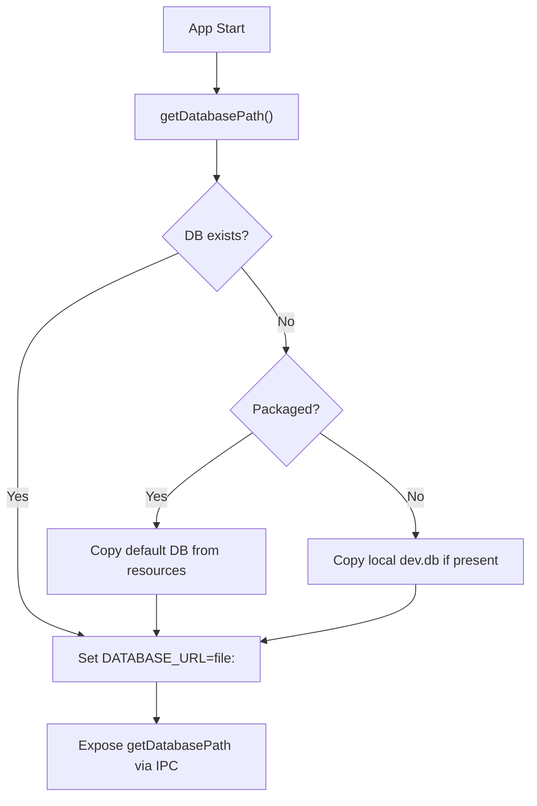
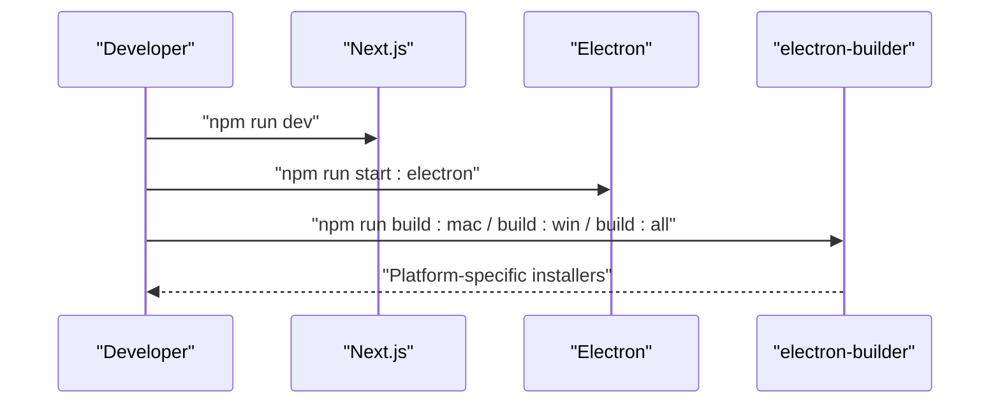
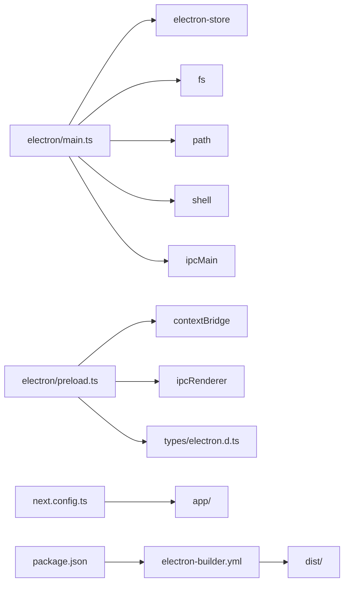

# Desktop Application

<cite>
**Referenced Files in This Document**
- [electron/main.ts](file://electron/main.ts)
- [electron/preload.ts](file://electron/preload.ts)
- [electron/tsconfig.json](file://electron/tsconfig.json)
- [types/electron.d.ts](file://types/electron.d.ts)
- [package.json](file://package.json)
- [electron-builder.yml](file://electron-builder.yml)
- [next.config.ts](file://next.config.ts)
- [README-ELECTRON.md](file://README-ELECTRON.md)
- [src/adapters/storage/LocalStorageAdapter.ts](file://src/adapters/storage/LocalStorageAdapter.ts)
- [src/domain/ports/IStorageProvider.ts](file://src/domain/ports/IStorageProvider.ts)
</cite>

## Table of Contents
1. [Introduction](#introduction)
2. [Project Structure](#project-structure)
3. [Core Components](#core-components)
4. [Architecture Overview](#architecture-overview)
5. [Detailed Component Analysis](#detailed-component-analysis)
6. [Dependency Analysis](#dependency-analysis)
7. [Performance Considerations](#performance-considerations)
8. [Troubleshooting Guide](#troubleshooting-guide)
9. [Conclusion](#conclusion)
10. [Appendices](#appendices)

## Introduction
This document describes the Electron-based desktop application that integrates a Next.js frontend with a native Electron shell. It covers the main process and renderer process separation, IPC communication patterns, security configurations, window and menu management, native OS feature usage, file system integration, local storage management, desktop-specific UI patterns, build and packaging with electron-builder, distribution strategies, development workflow, debugging techniques, platform-specific considerations, security implications (including auto-updates), and troubleshooting guidance.

## Project Structure
The project combines:
- Electron main process and preload scripts under electron/
- Next.js application under app/ and src/
- Packaging and distribution configuration under electron-builder.yml
- TypeScript configuration for Electron under electron/tsconfig.json
- Type declarations for the exposed Electron API under types/electron.d.ts
- Build and dev scripts under package.json
- Next.js configuration under next.config.ts
- Electron-specific documentation under README-ELECTRON.md

**Diagram sources**
- [electron/main.ts:1-180](file://electron/main.ts#L1-L180)
- [electron/preload.ts:1-31](file://electron/preload.ts#L1-L31)
- [electron/tsconfig.json:1-20](file://electron/tsconfig.json#L1-L20)
- [next.config.ts:1-54](file://next.config.ts#L1-L54)
- [electron-builder.yml:1-83](file://electron-builder.yml#L1-L83)
- [package.json:1-75](file://package.json#L1-L75)
- [types/electron.d.ts:1-23](file://types/electron.d.ts#L1-L23)

**Section sources**
- [README-ELECTRON.md:38-53](file://README-ELECTRON.md#L38-L53)
- [package.json:7-27](file://package.json#L7-L27)
- [next.config.ts:24-50](file://next.config.ts#L24-L50)

## Core Components
- Main process (electron/main.ts)
  - Creates the BrowserWindow with context isolation and a preload script.
  - Manages lifecycle events (ready, activate, window-all-closed, before-quit).
  - Initializes persistent database and files directories, sets environment variables for the database.
  - Implements security policies: denies navigations outside localhost and file://, opens external http links in default browser.
  - Exposes IPC handlers for app info, database path, files path, settings store, and shell operations.
- Preload script (electron/preload.ts)
  - Uses contextBridge to expose a typed API surface to the renderer process.
  - Provides methods for app path/version, database path, files path, settings store, opening external URLs, and revealing items in folders.
- Types (types/electron.d.ts)
  - Declares the ElectronAPI interface and global window augmentation for type safety in the renderer.
- Packaging and build (package.json, electron-builder.yml)
  - Scripts for dev, build, and cross-platform packaging.
  - electron-builder configuration for macOS (DMG, MAS), Windows (NSIS, MSIX), Linux (AppImage, deb), ASAR packaging, and update server.
- Next.js integration (next.config.ts)
  - Standalone output, dev watchOptions adjustments, and remote image pattern allowances.

**Section sources**
- [electron/main.ts:74-112](file://electron/main.ts#L74-L112)
- [electron/main.ts:115-138](file://electron/main.ts#L115-L138)
- [electron/main.ts:140-148](file://electron/main.ts#L140-L148)
- [electron/main.ts:150-179](file://electron/main.ts#L150-L179)
- [electron/preload.ts:4-30](file://electron/preload.ts#L4-L30)
- [types/electron.d.ts:1-23](file://types/electron.d.ts#L1-L23)
- [package.json:7-27](file://package.json#L7-L27)
- [electron-builder.yml:1-83](file://electron-builder.yml#L1-L83)
- [next.config.ts:22-50](file://next.config.ts#L22-L50)

## Architecture Overview
The application follows a strict main/renderer boundary:
- Main process controls OS-level features, manages windows, and exposes safe IPC endpoints.
- Renderer process (Next.js app) communicates via typed IPC calls through the preload bridge.
- Data paths for database and files are resolved in the main process and passed to the renderer via IPC.
- Security is enforced by disabling Node integration, enabling context isolation, and restricting navigations.

**Diagram sources**
- [electron/main.ts:74-112](file://electron/main.ts#L74-L112)
- [electron/main.ts:150-179](file://electron/main.ts#L150-L179)
- [electron/preload.ts:4-30](file://electron/preload.ts#L4-L30)

## Detailed Component Analysis

### Main Process: Window Lifecycle and Security
Key responsibilities:
- Window creation with hidden inset title bar and traffic light positioning.
- Loading either the Next.js dev server in development or static built HTML in production.
- Enforcing navigation policy to prevent loading external URLs inside the app window.
- Managing app lifecycle events and cleanup.

**Diagram sources**
- [electron/main.ts:115-138](file://electron/main.ts#L115-L138)
- [electron/main.ts:98-107](file://electron/main.ts#L98-L107)

**Section sources**
- [electron/main.ts:74-112](file://electron/main.ts#L74-L112)
- [electron/main.ts:115-138](file://electron/main.ts#L115-L138)
- [electron/main.ts:140-148](file://electron/main.ts#L140-L148)

### IPC Communication Patterns
The preload script exposes a typed API to the renderer. The main process registers IPC handlers for:
- App info: getAppPath, getVersion
- Paths: getDatabasePath, getFilesPath
- Settings store: store.get/set/delete/clear
- Shell: openExternal, showItemInFolder

**Diagram sources**
- [electron/preload.ts:19-25](file://electron/preload.ts#L19-L25)
- [electron/main.ts:156-169](file://electron/main.ts#L156-L169)

**Section sources**
- [electron/preload.ts:4-30](file://electron/preload.ts#L4-L30)
- [electron/main.ts:150-179](file://electron/main.ts#L150-L179)
- [types/electron.d.ts:1-23](file://types/electron.d.ts#L1-L23)

### Security Configurations
- Context Isolation enabled and Node integration disabled in BrowserWindow webPreferences.
- Navigation restrictions: will-navigate blocks non-local URLs and opens them externally.
- External link policy: setWindowOpenHandler redirects http links to the default browser.
- Sandboxing: preload-based bridge limits exposed APIs to a whitelist.

**Diagram sources**
- [electron/main.ts:140-148](file://electron/main.ts#L140-L148)
- [electron/main.ts:90-96](file://electron/main.ts#L90-L96)

**Section sources**
- [electron/main.ts:83-88](file://electron/main.ts#L83-L88)
- [electron/main.ts:140-148](file://electron/main.ts#L140-L148)
- [electron/main.ts:90-96](file://electron/main.ts#L90-L96)

### Window Management and Native OS Features
- Hidden inset title bar and traffic light position configured for macOS-style appearance.
- External URL opening handled via shell.openExternal.
- Folder reveal via shell.showItemInFolder.

**Diagram sources**
- [electron/main.ts:75-88](file://electron/main.ts#L75-L88)
- [electron/main.ts:171-179](file://electron/main.ts#L171-L179)

**Section sources**
- [electron/main.ts:75-88](file://electron/main.ts#L75-L88)
- [electron/main.ts:171-179](file://electron/main.ts#L171-L179)

### File System Integration and Local Storage Management
- Database path resolution and initialization:
  - Resolves user data directory, ensures database folder, copies default database if missing (production from resources, dev from local prisma dir), and sets DATABASE_URL for Prisma.
- Files directory for attachments:
  - Ensures a dedicated files directory under user data and exposes its path via IPC.
- Renderer-side storage abstraction:
  - IStorageProvider defines upload, delete, getUrl, and optional getAbsolutePath.
  - LocalStorageAdapter implements a local file-based storage adapter with basic directory management.

**Diagram sources**
- [electron/main.ts:24-60](file://electron/main.ts#L24-L60)

**Section sources**
- [electron/main.ts:24-60](file://electron/main.ts#L24-L60)
- [electron/main.ts:62-72](file://electron/main.ts#L62-L72)
- [src/domain/ports/IStorageProvider.ts:1-20](file://src/domain/ports/IStorageProvider.ts#L1-L20)
- [src/adapters/storage/LocalStorageAdapter.ts:1-44](file://src/adapters/storage/LocalStorageAdapter.ts#L1-L44)

### Desktop-Specific UI Patterns
- Hidden inset title bar and macOS-style traffic lights for native appearance.
- Renderer receives platform info and app version via IPC for conditional UI behavior.

**Section sources**
- [electron/main.ts:81-82](file://electron/main.ts#L81-L82)
- [electron/preload.ts:5-11](file://electron/preload.ts#L5-L11)

### Build Process and Distribution Strategies
- Development:
  - Next.js dev server runs on port 3000; Electron loads the dev URL and opens DevTools.
  - Combined dev command launches both services concurrently.
- Build:
  - Next build followed by TypeScript compilation of Electron sources.
- Packaging:
  - electron-builder supports DMG/APP (macOS), NSIS/MSIX (Windows), AppImage/deb (Linux).
  - ASAR enabled; extraResources include prisma directory.
  - Auto-updates configured via a generic provider URL.

**Diagram sources**
- [package.json:8-17](file://package.json#L8-L17)
- [README-ELECTRON.md:7-20](file://README-ELECTRON.md#L7-L20)
- [README-ELECTRON.md:22-36](file://README-ELECTRON.md#L22-L36)

**Section sources**
- [package.json:8-17](file://package.json#L8-L17)
- [README-ELECTRON.md:7-20](file://README-ELECTRON.md#L7-L20)
- [README-ELECTRON.md:22-36](file://README-ELECTRON.md#L22-L36)
- [electron-builder.yml:17-23](file://electron-builder.yml#L17-L23)
- [electron-builder.yml:80-83](file://electron-builder.yml#L80-L83)

## Dependency Analysis
- Main process depends on:
  - Electron APIs for BrowserWindow, ipcMain, shell, app, and filesystem for DB/files initialization.
  - electron-store for settings persistence.
- Preload depends on:
  - contextBridge and ipcRenderer to expose a controlled API surface.
- Renderer depends on:
  - Typed ElectronAPI via types/electron.d.ts.
- Packaging depends on:
  - electron-builder.yml for targets, ASAR, and update server.
- Next.js depends on:
  - next.config.ts for standalone output and watchOptions.

**Diagram sources**
- [electron/main.ts:1-6](file://electron/main.ts#L1-L6)
- [electron/preload.ts:1](file://electron/preload.ts#L1)
- [types/electron.d.ts:18-22](file://types/electron.d.ts#L18-L22)
- [next.config.ts:24-50](file://next.config.ts#L24-L50)
- [electron-builder.yml:5-16](file://electron-builder.yml#L5-L16)
- [package.json:7-27](file://package.json#L7-L27)

**Section sources**
- [electron/main.ts:1-6](file://electron/main.ts#L1-L6)
- [electron/preload.ts:1](file://electron/preload.ts#L1)
- [types/electron.d.ts:18-22](file://types/electron.d.ts#L18-L22)
- [next.config.ts:24-50](file://next.config.ts#L24-L50)
- [electron-builder.yml:5-16](file://electron-builder.yml#L5-L16)
- [package.json:7-27](file://package.json#L7-L27)

## Performance Considerations
- Keep preload minimal to reduce renderer exposure and overhead.
- Use ASAR packaging to bundle assets efficiently.
- Avoid heavy synchronous operations in main process; defer to worker threads or background tasks when possible.
- Leverage Next.js standalone output to minimize runtime footprint.
- Disable HMR selectively in watchOptions for specific directories to avoid unnecessary rebuilds.

[No sources needed since this section provides general guidance]

## Troubleshooting Guide
- External links open in the system browser:
  - Confirm setWindowOpenHandler behavior and navigation restrictions are active.
- Navigation blocked to external URLs:
  - Verify will-navigate handler prevents non-local URLs and opens them externally.
- Database not found or empty:
  - Ensure getDatabasePath resolves correctly and default DB is copied from resources or local prisma directory.
- Files directory missing:
  - Confirm getFilesPath creates the directory under user data.
- Settings not persisting:
  - Check electron-store defaults and IPC store handlers.
- Auto-updates not triggering:
  - Validate electron-builder publish URL configuration.

**Section sources**
- [electron/main.ts:90-96](file://electron/main.ts#L90-L96)
- [electron/main.ts:140-148](file://electron/main.ts#L140-L148)
- [electron/main.ts:36-60](file://electron/main.ts#L36-L60)
- [electron/main.ts:62-72](file://electron/main.ts#L62-L72)
- [electron-builder.yml:80-83](file://electron-builder.yml#L80-L83)

## Conclusion
This Electron application cleanly separates concerns between the main and renderer processes, enforces strong security boundaries, and integrates a Next.js frontend with robust file and settings management. The packaging pipeline supports multiple platforms, and the configuration enables straightforward distribution and updates. Following the documented patterns and troubleshooting steps will help maintain a reliable and performant desktop experience.

## Appendices

### Development Workflow
- Run Next.js dev server and Electron concurrently for rapid iteration.
- Use devtools in development mode; production loads static HTML from .next.

**Section sources**
- [package.json:8-17](file://package.json#L8-L17)
- [electron/main.ts:98-102](file://electron/main.ts#L98-L102)

### Platform-Specific Considerations
- macOS:
  - Hidden inset title bar and traffic light positioning.
  - Hardened Runtime and entitlements configured for DMG and MAS builds.
- Windows:
  - NSIS and MSIX targets with per-machine installation option.
- Linux:
  - AppImage and deb targets with Development category.

**Section sources**
- [electron/main.ts:81-82](file://electron/main.ts#L81-L82)
- [electron-builder.yml:25-47](file://electron-builder.yml#L25-L47)
- [electron-builder.yml:49-79](file://electron-builder.yml#L49-L79)

### Security Implications and Auto-Updates
- Security:
  - Context isolation and disabled Node integration.
  - Navigation restrictions and external link redirection.
- Auto-updates:
  - Generic provider configured with a custom URL.

**Section sources**
- [electron/main.ts:83-88](file://electron/main.ts#L83-L88)
- [electron/main.ts:140-148](file://electron/main.ts#L140-L148)
- [electron-builder.yml:80-83](file://electron-builder.yml#L80-L83)